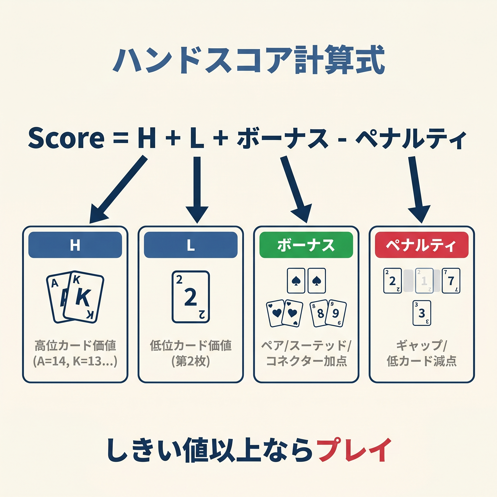
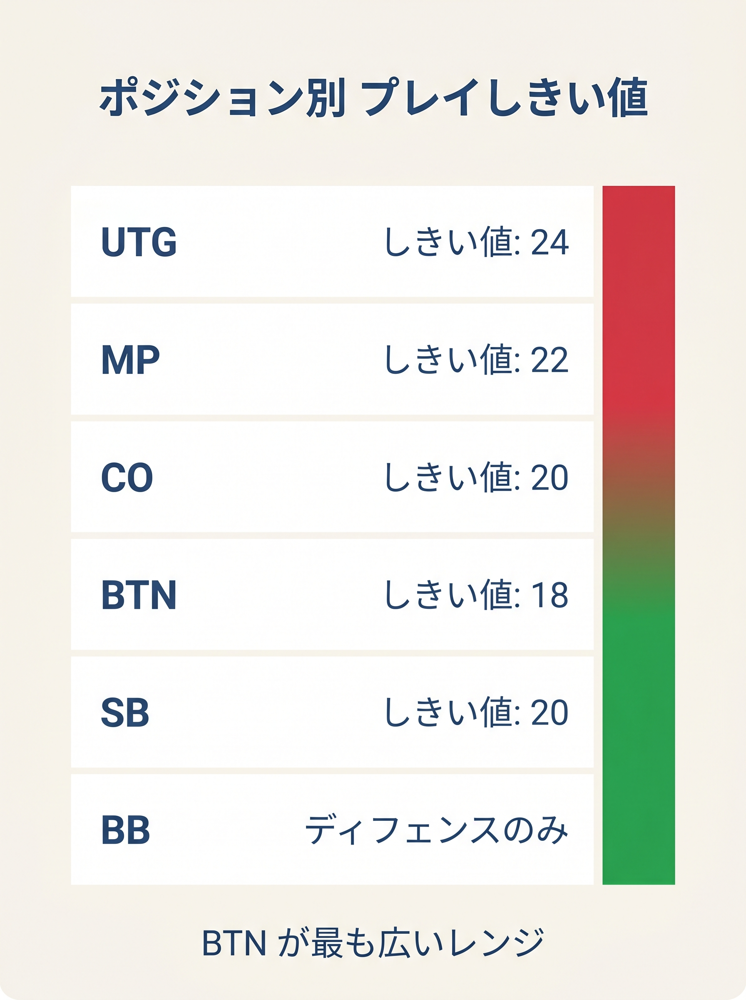

# 第5章　基本スコア式の全体像

<!-- markdownlint-disable MD036 MD060 -->
<!-- textlint-disable preset-ja-technical-writing/no-exclamation-question-mark -->
<!-- textlint-disable preset-ja-technical-writing/no-mix-dearu-desumasu -->
<!-- textlint-disable preset-jtf-style/4.3.7.山かっこ<> -->

> **本章の目標**: 本書の中核である「基本スコア式（Score_R）」を導入します。10のサンプルハンドで実際に計算し、暗算で式を回す感覚を体得します。

ここまでの4章は、計算式アプローチの「前提」を整える章でした。カードとポジションの数値化（第2章）、計算で判断する意義（第3章）、避けるべきミス（第4章）。本章からいよいよ**実装**に入ります。

本章で提示する**基本スコア式（Score_R）**は、オープンレイズをするかどうかを1つの数字で判定するための道具です。手札を見た瞬間に H + L + ボーナスを計算し、ポジション別しきい値と比較する。これだけで、レンジ表の代わりになります。

---

<figure><figcaption>Score_R = H + L + ボーナスの式構造と各変数の説明図</figcaption></figure>

<figure><figcaption>スーテッド+4・コネクター差1=+3・差2=+2・差3=+1のボーナス加点テーブル（ペナルティなし）</figcaption></figure>

<figure><figcaption>UTG 24 / HJ 22 / CO 20 / BTN 18 / SB 22 のポジション別プレイしきい値ラダー</figcaption></figure>

## 5-1 プリフロップスコアの全体像

### 1行で表すと

本書の**プリフロップスコア（Score_R）**は次の1行です。

```text
Score_R = H + L + ボーナス  （ペアは 2R + (T以上なら+2)）
```

各項目の意味は次の通りです。

- **H**：高い方のカード値（A=14、K=13、Q=12、J=11、T=10、…、2=2）
- **L**：低い方のカード値
- **ボーナス**：ペアやスーテッドなど、手役の可能性を足す
- **R**：ペアのランク値（AA なら R=14、99 なら R=9）

**ペアの計算式は特別です**。H + L ではなく **2R + (T以上なら+2)** として計算します。「ランクの2倍」がペアの基礎価値を表し、「T（テン）以上ならさらに+2」でブロードウェイボーナスを加えます。

この**1 つのスコア式で、本書のすべての判断（オープン / 3ベット / コール / 4ベット / 5ベット / スクイーズ / BB defense）が扱えます**。各場面で違うのは閾値（しきい値）だけです。

### ボーナスの詳細

| 種別 | 条件 | 値 |
|------|------|-----|
| ペア（Broadway） | **T以上のペア**（TT〜AA） | 2R+2 |
| ペア（小ペア） | **9以下のペア**（99以下） | 2R |
| ボーナス | **スーテッド**（同じマーク） | +4 |
| ボーナス | **コネクター**（差 = 1） | +3 |
| ボーナス | **差 2（1-gapper）** | +2 |
| ボーナス | **差 3（2-gapper）** | +1 |
| ボーナス | **差 4 以上** | 0（ボーナスなし） |
| ブロッカー | **A・K 両方** | +3 |
| ブロッカー | **A を含む**（Kは含まない） | +2 |
| ブロッカー | **K を含む**（Aは含まない） | +1 |

**Score_R にはペナルティがありません**。ギャップや低カードへのマイナス項を廃止し、ボーナスだけで評価します。

「差」は、2枚のカード値の差の絶対値です。たとえばAKなら14 − 13 = 1、AJなら14 − 11 = 3、A9なら14 − 9 = 5です。

**重要な適用規則**：

- **ペアには「コネクター」「ギャップ」ボーナスも適用しない**（差=0のため対象外）。
- **ペアにはスーテッドボーナスも適用しない**（2枚が同じ数字だと必ず違うマーク）。
- **ペアには「ブロッカー」ボーナスを加えない**（ペアは 2R 式で完結）。

ボーナス値の「なぜその値か」は次章（第6章）で詳しく解説します。本章ではまず式を動かしてみることに集中します。

---

## 5-2 ポジション別 オープン閾値（T_open）

計算したスコアを、自分のポジションのオープン閾値と比較します。

| ポジション | T_open |
|-----------|----------|
| UTG | 24 |
| HJ | 22 |
| CO | 20 |
| BTN | 18 |
| SB | 22 |

判断ルールは1行です。

**Score_R ≥ T_open → オープンレイズ、Score_R < T_open → フォールド**

閾値は GTO の RFI 頻度にプリフロップスコアの値域を合わせてキャリブレーションしました（精度 91.1%、knowledges/preflop/gto-charts.json で検証）。UTG は最もタイト、BTN は最もルース。SB は OOP のため BTN より絞り、HJ と同じ tight な T_open=22 とします。GTO の SB raise-only RFI（約 24%）に整合します。

3ベット・コール・4ベットなどほかの場面の閾値は、各章で扱います。重要なのは**スコアの計算式は変わらず、閾値だけが場面ごとに違う**ということです。

---

## 5-3 10例題で計算を体感する

ここからは、10のサンプルハンドで実際に計算してみます。目標は、各ハンドを**3秒以内**でスコア化できるようになることです。

### 例1：AA（Score_R = 30）

- ペア：R = 14（A）、T以上なので 2R+2

```text
2×14 + 2 = 30
```

全ポジションで余裕のオープン。最強クラスのハンドです。

---

### 例2：AKs（Score_R = 37）

- H = 14（A）、L = 13（K）
- スーテッド：+4
- 差 = 1（コネクター）：+3
- ブロッカー（A・K 両方）：+3

```text
14 + 13 + 4 + 3 + 3 = 37
```

全ポジションでオープン。プレミアムハンドの典型。

---

### 例3：JJ（Score_R = 24）

- ペア：R = 11（J）、T以上なので 2R+2

```text
2×11 + 2 = 24
```

**T_open(UTG)=24 にちょうど一致**。UTG でオープンできる境界のペアです。設計上の基準点になっています。

---

### 例4：99（Score_R = 18）

- ペア：R = 9（9）、T未満なので 2R のみ

```text
2×9 = 18
```

**T_open(BTN)=18 にちょうど一致**。BTN でオープンできる境界の小ペアです。

---

### 例5：AJo（Score_R = 28）

- H = 14（A）、L = 11（J）
- 差 = 3（2-gapper）：+1
- ブロッカー（A のみ）：+2

```text
14 + 11 + 1 + 2 = 28
```

T_open(UTG)=24 を大きく超えるので UTG 以降すべてのポジションでオープン可。

---

### 例6：KTs（Score_R = 29）

- H = 13（K）、L = 10（T）
- スーテッド：+4
- 差 = 3（2-gapper）：+1
- ブロッカー（K のみ）：+1

```text
13 + 10 + 4 + 1 + 1 = 29
```

T_open(UTG)=24 を余裕で超える。スーテッドのブロードウェイは全ポジションでオープン可。

---

### 例7：QJs（Score_R = 30）

- H = 12（Q）、L = 11（J）
- スーテッド：+4
- 差 = 1（コネクター）：+3
- ブロッカー：なし

```text
12 + 11 + 4 + 3 = 30
```

スーテッドコネクターは「スーテッド+4」と「コネクター+3」の両方を受けるため、高スコアになります。全ポジションでオープン可。

---

### 例8：T9s（Score_R = 26）

- H = 10（T）、L = 9
- スーテッド：+4
- 差 = 1（コネクター）：+3
- ブロッカー：なし

```text
10 + 9 + 4 + 3 = 26
```

T_open(UTG)=24 を超えるので**UTG 以降すべてのポジションでオープン可**。旧式ではUTGでギリギリ届かなかったT9sが、Score_Rでは明確にオープンレンジに入ります。

---

### 例9：K3s（Score_R = 21）

- H = 13（K）、L = 3
- スーテッド：+4
- 差 = 10（4以上）：+0（ボーナスなし）
- ブロッカー（K のみ）：+1

```text
13 + 3 + 4 + 0 + 1 = 21
```

T_open(CO)=20 を超えるので CO 以降でオープン可。**BTN では余裕でオープン**、HJ では届かずフォールド。

---

### 例10：72o（Score_R = 9）

- H = 7、L = 2
- ボーナス：なし（差=5はボーナス0、オフスーツ、ブロッカーなし）

```text
7 + 2 = 9
```

全ポジションで圧倒的にフォールド。ポーカーで最弱とされる72oは、本書式でもはっきり最弱域です。

---

## 5-4 スコアの「相場観」を掴む

ここまでの10例から、スコアの感覚を整理します。

| スコア帯 | 代表ハンド | 判定 |
|---------|-----------|------|
| 30以上 | AA、AKs、AQs、QJs、QQ | 全ポジでオープン |
| 26〜29 | KK、AKo、AQo、AJs、KQs、T9s | 全ポジでオープン |
| 24〜25 | JJ、JTs、AJo、K7s | UTG 以降でオープン |
| 22〜23 | TT、T9s前後、87s、A2s | HJ 以降でオープン |
| 20〜21 | 76s、K3s | CO 以降でオープン |
| 18〜19 | 99、65s | BTN 以降でオープン |
| 17以下 | 88以下、54s以下、72o | フォールド |

「手札を見てスコアが22以上ならとりあえずHJまで開ける」「18を下回るならBTN以外は降ろす」といったざっくりした感覚が、スコア式の運用上の武器になります。

---

> **補足（第21章への接続）**: 本章の式はスコアがしきい値を超えたら100%オープン、未満なら100%フォールドという単一の閾値で動きます。この決定論的な境界付近では、第21章で導入するR1（3バンド化）を使って混合ゾーンを設けることで、搾取されにくいプレイに近づけます。

## 【GTOとのズレ】Score_R が苦手な2つのハンド群

本書のScore_Rは、プレミアムハンド〜中堅ハンドではGTOとよく整合します。しかし、**2つのハンド群で系統的にGTOより過小評価**する弱点があります。

### 弱点1：小ペア（22〜88）

- 22：Score_R=4、33：Score_R=6、44：Score_R=8、55：Score_R=10、66：Score_R=12、77：Score_R=14、88：Score_R=16
- すべて T_open(BTN)=18 を下回る → 全ポジションでフォールド判定
- GTO：BTN から 22+ をオープン対象

理由は 2R 式の構造にあります。小ペアはランク値が低いため 2R だけではしきい値に届きません。しかし実際には、BTNなどのポジションでは「セットマイニング」の期待値があります。

**補助ルール**：22〜88 は、BTN でコール額×15 ≤ 相手スタックの条件（セットマイニング条件）が成立する場面のみオープン可と覚えてください。深スタックで相手にコールしてもらえる状況では、スモールポケットは参加価値があります。

### 弱点2：下位スーテッドコネクター（65s・54s）

- 65s：Score_R = 6+5+4+3 = 18（BTN 境界ちょうど → ギリギリオープン可）
- 54s：Score_R = 5+4+4+3 = 16（T_open(BTN)=18 を下回る → フォールド判定）
- GTO：CO・BTN からオープン

65s はBTNでちょうど T_open=18 に一致するため、Score_R でもオープン可です。しかし 54s はスコア16 で BTN 閾値にわずかに届きません。GTO ではどちらも CO/BTN からオープン対象です。

**補助ルール**：54s もBTNに限り例外的にオープン可と覚えても構いません。

### 弱点3（解消済み）：Ax スーテッドはブロッカー+2 で対応済み

現行 Score_R にはAブロッカー +2 が組み込まれているため、スーテッドエースは GTO と高精度で一致します。

- A5s：14+5+4+2=25（UTG 以降でオープン）
- A4s：14+4+4+2=24（UTG 以降でオープン、ちょうど境界）
- A3s：14+3+4+2=23（HJ 以降でオープン）
- A2s：14+2+4+2=22（HJ 以降でオープン）

GTO が UTG で A5s〜A4s を開くのと同様の結果が、本書スコアでも自然に得られます。

### 簡易式としての割り切り

この2つの弱点は、**初心者が「やりすぎて損する」側ではなく、「控えめすぎて機会損失する」側**にあります。言い換えれば、本書スコアに従って落とすハンドは、実戦で大事故につながるハンドではありません。

境界の数%のハンドでGTOより得られるEVを少し逃しても、**破滅的なミスを避ける方が初心者の収支改善には効果的**です。これが本書の立場です。

<figure><figcaption>プリフロップスコア ヒートマップ — 高スコア（緑）ほど多くのポジションでオープン可能。グラデーションバーの縦線がポジション別 T_open を示す</figcaption></figure>

---

## 章のまとめ

- プリフロップスコア式は `Score_R = H + L + ボーナス（ペアは 2R + (T以上なら+2)）`
- ボーナス：スーテッド+4、コネクター差1=+3、差2=+2、差3=+1、差4以上=0
- ブロッカー：AK=+3、A のみ=+2、K のみ=+1
- **ペナルティは一切なし**
- ポジション別 T_open：UTG 24 / HJ 22 / CO 20 / BTN 18 / SB 22
- Score_R ≥ T_open ならオープン、未満ならフォールド
- JJ（スコア24）は T_open(UTG)=24 にちょうど一致する境界の基準点です
- 99（スコア18）は T_open(BTN)=18 にちょうど一致するBTN境界のペアです
- 小ペア22〜88とスーテッドコネクター54sは補助ルールで対応する
- Axスーテッドはブロッカー+2が組み込まれており問題なし

---

## ミニクイズ

### 問1

次のハンドのスコアを計算してください。

1. JJ
2. 99
3. AQs

---

### 問2

次のハンドはどのポジションからオープンできるでしょうか（本書のしきい値に従う）。

1. KQs
2. JTs
3. 98s

---

### 問3

本書のScore_Rがわずかに過小評価するハンドとして、本章で指摘されたものはどれでしょうか（複数回答）。

1. AA
2. 22（小ペア）
3. 54s（低スーテッドコネクター）
4. A2s

---

### 解答

- **問1**：(1) JJ=24（2×11+2）、(2) 99=18（2×9）、(3) AQs=34（14+12+4+3(diff2)+1(Aブロッカー)）
- **問2**：（1）KQs=33（13+12+4+3(diff1)+1(Kブロッカー)）は UTG (T_open=24) からすべてオープン可、（2）JTs=28（11+10+4+3(diff1)）は全ポジオープン可、（3）98s=24（9+8+4+3(diff1)）は UTG (T_open=24) 以降オープン可
- **問3**：2、3（小ペア22〜88とスーテッドコネクター54sは補助ルール対象。A2sは Score_R=22 で HJ 以降オープン可のため過小評価ではない）

---

## 出典

- ThePokerBank『The Chen Formula』
- ThePokerBank『Sklansky and Malmuth Starting Hand Groups』
- 888 Poker『GTO Open Raising Strategies』（2020年代）
- GTO Wizard『Preflop Range Morphology』（2024）
- Upswing Poker『How to Play Six-Five Suited』（2024）
- Wikipedia『Texas hold'em starting hands』
