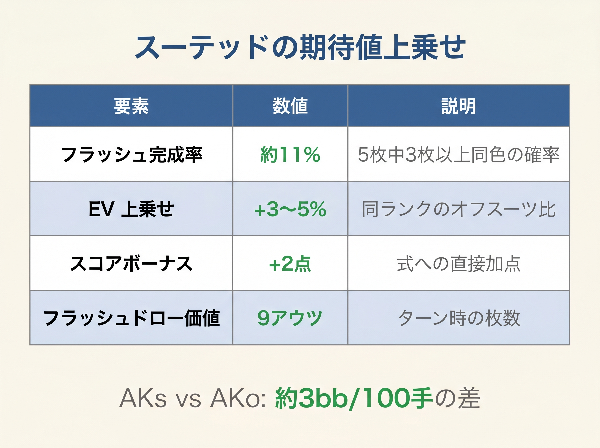

# 第6章　ボーナス各項目の意味

<!-- markdownlint-disable MD060 -->
<!-- textlint-disable preset-ja-technical-writing/no-exclamation-question-mark -->
<!-- textlint-disable preset-ja-technical-writing/no-mix-dearu-desumasu -->

> **本章の目標**: 前章で導入した基本スコア式（Score_R）の各ボーナス項目について、「なぜその値なのか」を確率データとともに理解します。丸暗記ではなく、**理屈で覚える**ことが目的です。

前章で、Score_Rのボーナス項目は次の通りでした。

- ペア：2R（T以上なら+2）
- スーテッド：+4
- コネクター（差1）：+3
- ギャップ1（差2）：+2
- ギャップ2（差3）：+1
- 差4以上：0（ボーナスなし）
- **ペナルティはなし**

本章ではこれらの値の裏付けを順に見ていきます。数字の根拠がわかれば、境界での判断で迷ったとき自分で調整できるようになります。

---

<figure><figcaption>スーテッドハンドのフラッシュ完成率11%とEV上乗せ3-5%を示すテーブル</figcaption></figure>

<figure><figcaption>コネクター9.6% → 1gap 7.5% → 2gap 4.5% のOESD確率減衰を横棒グラフで示す</figcaption></figure>

## 6-1 ペア：2R 式（TT以上は +2）の根拠

### セットが入る確率は約11.8%

ポケットペアの最大の魅力は、**フロップでセット（3枚のペア）が完成する確率**の高さです。

- セット成立確率：**約 11.8%**（およそ8.5回に1回）
- 出典：Upswing Poker『What Are The Odds of Flopping Poker Hands?』

セットはボードに隠れやすい強烈な手で、相手が気付かずに大量のチップを投入してくれます。この「隠れた強さ」がペアの第一の価値です。

### ペアはオーバーカードに対して優勢

ペアは「コインフリップ」と呼ばれる状況でも、実は有利です。

| マッチアップ | ペアのエクイティ | 備考 |
|-------------|----------------|------|
| ポケットペア（中〜小） vs 2 オーバーカード | 約 55% | 一般値（平均） |
| QQ vs AKo | 約 57% | QQは高ペアなのでやや高め |
| 55 vs AK | 約 54% | 小ペアはやや低め |
| AA vs ランダムハンド | 約 85% | — |

2枚のオーバーカード（例：AK）を持った相手に対しても、小さいペアは少し有利です。これは**プリフロップの段階ですでに勝率優位**があることを意味します。

### Sklansky Hand Groupsでの位置

1988年の古典『Hold'em Poker for Advanced Players』では、169ハンドをグループ1〜9に分類しています。**すべてのポケットペアがグループ1〜7に入ります**。グループ9（ほぼ全フォールド）に入るペアは存在しません。

これはペアがほかのハンドと比べて、一段階上の「基礎価値」を持つことを示しています。

### なぜ +10 でなく 2R 式か

旧式ではペアに一律「+10」を与えていました。しかし、**ランク差を反映しない**という問題がありました。

- 旧式：77 = 7+7+10 = 24、AA = 14+14+10+3 = 41
- 新式：77 = 2×7 = 14、AA = 2×14+2 = 30

旧式では H+L にペア分の数字が重複するため、高ランクのペア（AA、KK）が過大評価される傾向がありました。新式の「2R」は「ランク×2」を直接表現しています。**ランクが高いほど価値が高いこと**が2R式で自然に反映されます。

### TT以上は +2 のブロードウェイボーナス

TT（テン）以上のペアには、2R に加えて **+2 のブロードウェイボーナス**を加算します。

理由は2つです。

1. **オーバーペアになりやすい**：フロップの最高カードは統計的にT〜Kが多いため、TT以上はオーバーペア（ボードより高いペア）として機能する確率が高くなります。
2. **ショーダウン価値が大きく跳ねる**：オーバーペアはアンダーペアやトップペアに対して圧倒的に優位です。

TT = 2×10+2 = 22、JJ = 2×11+2 = 24 という値は、それぞれ HJ 閾値（22）・UTG 閾値（24）にちょうど整合するよう設計されています。

---

## 6-2 スーテッド +4 の根拠

### フラッシュドローの成立確率

スーテッド（同じマーク）のハンドの利点は、フラッシュの可能性です。

- フロップでフラッシュドローが成立：**約 11%**
- ドロー成立後にリバーまでにフラッシュ完成：**約 35%**
- フロップでいきなりフラッシュ完成：約0.8%

つまり、スーテッドハンドを配られた約11% の場面では、フロップから「**最低でも35%の勝率を持つドロー**」を抱えられます。

### エクイティ差は3〜5%

実測データでは、スーテッドとオフスーツのエクイティ差は概ね次の通りです。

- AKs vs AA：AKsのエクイティ約17%
- AKo vs AA：AKoのエクイティ約12%
- **差：約 5%**（スーテッド化によるエクイティ改善）

ハンド全体を見ると、スーテッドであることで **平均 3〜5%** のエクイティ改善になります。

### プレイアビリティという隠れた価値

スーテッドの真の価値は、ポストフロップの選択肢の多さにあります。

- **ナッツ級のドロー**：両方のホールカードを使ったフラッシュは負けにくい
- **セミブラフが強くなる**：フラッシュドロー＋ペアなどの組み合わせでベット継続しやすい
- **降りる判断が明確**：ドロー外しなら潔く降りられる

### なぜ +3 から +4 に変わったか

旧式ではスーテッドボーナスを +3 としていました。Score_R では **+4** に引き上げています。

内訳のイメージは「フラッシュドロー価値 +2 + プレイアビリティ +2」です。エクイティ改善（3〜5%）だけなら +2 ですが、ナッツ級ドローの作りやすさやセミブラフの効きやすさといった**実現率（ポストフロップ EV）への寄与**が +2 上積みされる構造です。

Score_R ではペナルティを廃止した分、ボーナスの重みを高めることで全体のバランスを保っています。スーテッドの +1 引き上げはその調整の一部です。

---

## 6-3 コネクター（差 1）+3 の根拠

### ストレートドローの成立確率

連続した数字のカード（76、JT、AKなど）の利点は、ストレートを作れることです。

| ドロータイプ | 確率 |
|-------------|------|
| 何らかのストレートドロー | 約 **26.2%** |
| OESD（両面ストレートドロー） | 約 **9.6%** |
| ガットショット | 約 16.6% |
| フロップでストレート完成 | 約 1.3% |

フロップを見たときに、**26%の確率でストレート系のドロー**が入っているというのは大きな武器です。

### OESDの価値

OESD（Open-Ended Straight Draw、両面ストレートドロー）は、残り2枚のボードでストレートを完成させる確率が約32% のドローです。これはフラッシュドロー（約35%）とほぼ同じ強さを持ちます。

### スーテッドコネクターの相乗効果

**スーテッドコネクター**（76s、98sなど）は、フラッシュとストレートの両方のドローが期待できます。

- フラッシュドロー：11%
- OESD：9.6%
- 重複や組み合わせドローを含めると、**約 35% の確率で何らかの強いドローが入る**

これが、スーテッドコネクターが「小さい数字なのに強い」理由です。本書Score_Rでは、**スーテッド +4 とコネクター +3 の両方が加算**される仕組みになっています。

### なぜ +1 から +3 に引き上げたか

旧式ではコネクターボーナスを +1 としていました。Score_R では **+3** に大幅に引き上げています。

理由は2点です。

1. **ペナルティ廃止との兼ね合い**：旧式では「両方9未満 −1」ペナルティが低スーテッドコネクターに重くかかっていました。このペナルティを廃止した分、ストレートドローの実際の価値をより正確に反映するため、コネクターボーナスを増やしました。
2. **OESD とフラッシュドローのほぼ同等性**：OESD（9.6%）はフラッシュドロー（11%）に近い価値を持ちます。スーテッドが +4 なら、コネクターは +3 程度が合理的です。

---

## 6-4 ギャップ1（差2）→ +2、ギャップ2（差3）→ +1 の根拠

### ストレートドローは段階的に減る

ギャップが広がるほど、ストレートドローの成立確率は急速に減少します。

| タイプ | 全ストレートドロー | OESD |
|-------|------------------|------|
| コネクター（差 1） | 26.2% | 9.6% |
| 1-gapper（差 2、例：KJ） | 21.9% | 7.3% |
| 2-gapper（差 3、例：KT） | 17.9% | 4.5% |

- 出典：PokerRailbird『Straight Draw Poker Odds by Connector Type』

OESDだけを見ると、1-gapperはコネクターの約75%、2-gapperは約47% まで低下します。

### 段階的なボーナス設定

この減少率を反映して、ギャップが広がるほどボーナスが減るように設計しています。

| 種別 | ボーナス | コネクターとの比 |
|------|----------|----------------|
| コネクター（差1） | +3 | 基準 |
| ギャップ1（差2） | +2 | 約2/3 |
| ギャップ2（差3） | +1 | 約1/3 |
| 差4以上 | 0 | なし |

1-gapperはOESDがコネクターの75%程度なので、ボーナスはコネクターの2/3にあたる+2。2-gapperはOESDが47%程度なので、1/3にあたる+1。これらは確率の減衰を素直に反映したボーナス設定です。

たとえば AJo（差3、ギャップ2）は 14 + 11 + 1(差3) + 2(Aブロッカー) = **28**。十分なスコアで UTG からオープンできます。

---

## 6-5 ペナルティを廃止した理由

旧式には「差4以上 −1」「両方9未満 −1」の2つのペナルティがありました。Score_R ではこれらを**完全に廃止**しています。

### なぜペナルティをなくしたか

3つの理由があります。

**理由1：暗算のシンプル化**

ペナルティがあると、「このハンドはペナルティが適用されるか」を毎回チェックしなければなりません。「Aを含む場合はギャップペナルティ免除」など例外ルールも複雑になります。Score_R ではボーナスだけを足せばよく、計算ミスが大幅に減ります。

**理由2：ボーナスの再設計で吸収**

ペナルティの実質的な効果は、ボーナスを減らすことでした。Score_R ではギャップ4以上のボーナスを0（旧式では連結ボーナスなしだが誤差）、低スーテッドコネクターはスーテッド+4+コネクター+3の合計から相対的に低くなるように、スコア全体の値域を再調整しています。

**理由3：小ペアと低スーテッドコネクターは補助ルールで対応**

ペナルティ廃止で「22〜88」「54s」などが過大評価される懸念がありますが、これらは2R式の結果がもとから小さいため、しきい値を下回ります。補助ルール（セットマイニング条件、implied odds）で境界付近のみを救済する設計にしました。

---

## 6-6 ブロッカー（AK=+3、A=+2、K=+1）の根拠

Aおよび Kは相手のプレミアムハンド（AA、KK、AKなど）を「ブロック」する効果があります。

- **AK 両方を持つ**（AKs, AKo）：相手の AA・KK・AKs・AKo の可能性を最大限に減らす → +3
- **A のみを持つ**（AQs, AJs 等）：相手の AA・AK を減らす → +2
- **K のみを持つ**（KQs, KJs 等）：相手の KK・AK を減らす → +1

ブロッカー効果は「自分が有利なレンジに相手がいない確率が上がる」ことを通じてEVを改善します。数値は旧式の「A=+3、K=+2、AK=+4」から調整して**合計値をシンプルに**しています（AK=A+K=+3=+2+1）。

---

## 6-7 値の相対関係を俯瞰する

| 要素 | 値 | 根拠となる確率・理由 |
|------|-----|---------------------|
| ペア（Broadway、TT〜AA） | 2R+2 | TT=22, JJ=24, QQ=26 ← T_open との整合 |
| ペア（9以下、99以下） | 2R | 99=18(BTN境界), 88=16(補助ルール) |
| スーテッド | +4 | フラッシュドロー 11% ＋ エクイティ向上 3〜5% ＋ プレイアビリティ |
| コネクター差1 | +3 | OESD 9.6% ＋ 全ストレートドロー 26.2% |
| ギャップ1（差2） | +2 | OESD 7.3%（コネクターの2/3程度） |
| ギャップ2（差3） | +1 | OESD 4.5%（コネクターの1/3程度） |
| 差4以上 | 0 | ギャップボーナスなし（ペナルティもなし） |
| ブロッカー AK | +3 | 最大ブロック効果（AA, KK, AKを同時ブロック） |
| ブロッカー A のみ | +2 | AA, AK をブロック |
| ブロッカー K のみ | +1 | KK, AK をブロック |

この階層構造を見ると、スーテッドとコネクターの組み合わせが最大+7のボーナスを生み、スーテッドコネクター（T9s = 10+9+4+3 = 26）が中堅ブロードウェイ（AJo = 14+11+1+2 = 28）に近いスコアになる理由がわかります。

---

## 【GTOとのズレ】精密さ vs 暗算しやすさ

### ボーナス値の丸め誤差

本章で示したボーナス値はすべて**丸められた近似**です。実際のEV差は連続値で、状況によっても変動します。たとえばスーテッドの価値は、「同じマークのコネクター」と「広くギャップのあるスーテッド」では異なります。

GTOソルバーはこれらを連続的に評価しますが、**暗算では連続値を扱えません**。本書が整数に丸める理由はここにあります（本書全体の設計方針は第1章で宣言済みです）。

### 丸めによる誤差はどこに出るか

- **AQs と AKs のスーテッドボーナスは同じ**：実際にはAKsのほうがもう少し強い（ブロッカー値の差で最終スコアは異なる）
- **77 と TT の差が 2R 式で自然に出る**：77=14、TT=22 で正しくランク差を反映
- **65s と JTs のコネクターボーナスは同じ +3**：JTsのほうがドローの質で勝るが、この差は補助ルールで対応

これらの差は、実戦では数bb/100のレベルです。完全な最適解を捨てて、暗算できる形を手に入れるというトレードオフです。

### 上級者向けの補正

境界で迷ったときは、次の経験則で調整してください。

- **高いカード同士は少し上積み**：JTs（28）や KQs（33）は追加補正なしでも十分なスコアがある
- **低いスーテッドコネクターは implied odds で判断**：65s（18）・54s（16）は補助ルールでBTN可否を判定
- **マルチウェイ対応**：マルチウェイ局面ではオフスート BW（KJo / QJo 等）は −2、小ペアは +2 で調整（第14章）

ブロッカー効果はすでにスコア式に組み込まれている（AK=+3、A=+2、K=+1）ため、A5s や AJo に対する追加補正は不要です。本書の式で違和感が出たら、上記 3 つの軸で微調整できます。

---

## 章のまとめ

- ペアは「2R（TT以上は+2）」で表現：ランク差が自然に出る設計
- TT以上の+2はオーバーペア価値とT_open閾値との整合から来る
- スーテッド +4 は「フラッシュドロー 11%」「エクイティ差3〜5%」「プレイアビリティ」の三層（旧+3から引き上げ）
- コネクター +3 は「OESD 9.6%」と「全ストレートドロー 26.2%」を反映（旧+1から引き上げ）
- ギャップ1（差2）+2 はコネクターの約2/3のストレート期待値
- ギャップ2（差3）+1 はコネクターの約1/3のストレート期待値
- 差4以上はボーナスなし（ペナルティも廃止）
- **ペナルティ廃止により暗算が大幅にシンプルになった**
- 値はすべて近似で、暗算しやすさとのトレードオフがある

---

## ミニクイズ

### 問1

Score_R でペアの計算式が「2R」（T以上は+2）になっている理由として最も適切なのはどれでしょうか。

1. ランク差を反映するため
2. ペアは常にオーバーペアになるため
3. セット率が2倍になるため
4. 旧式の+10を維持するため

---

### 問2

スーテッドボーナスが旧式の +3 から Score_R では +4 に引き上げられた主な理由はどれでしょうか（複数回答）。

1. フラッシュドロー成立確率が上がったため
2. ペナルティ廃止とのバランス調整のため
3. プレイアビリティ（実現率）の評価を高めるため
4. AKs のスコアを最大化するため

---

### 問3

コネクターボーナスが旧式の +1 から Score_R では +3 に引き上げられた根拠として正しいのはどれでしょうか。

1. コネクターはフラッシュドローと同等の価値を持つ
2. OESD（9.6%）はフラッシュドロー（11%）に近い価値を持ち、ペナルティ廃止との兼ね合いで引き上げが合理的
3. ストレートはフラッシュより強いため
4. GTO ソルバーがコネクターの価値を +3 と定義したため

---

### 解答

- **問1**：1（2R式によりランク差が自然に反映される。旧+10ではすべてのペアが同じ加算で高ランクと低ランクの差が正確に出なかった）
- **問2**：2、3（フラッシュドロー成立確率は変わっていない。ペナルティ廃止との調整と、ポストフロップ実現率のより正確な評価が主な理由）
- **問3**：2（OESD 9.6%はフラッシュドロー 11%に近く、ストレートドロー全体では26.2%。ペナルティ廃止で低カードハンドへの評価を正直に反映したことが+3設定の背景）

---

## 出典

- Upswing Poker『What Are The Odds of Flopping Poker Hands?』
- Upswing Poker『Odds of Hitting a Draw in Poker』
- Upswing Poker『Set Mining Poker Tips』
- Upswing Poker『Raw Equity vs Realized Equity』
- PokerRailbird『Straight Draw Poker Odds by Connector Type』
- 888 Poker『Flush Poker Odds』／『Straight Poker Odds』
- CardFight『AKs vs AKo Statistics』
- SplitSuit Poker『How Do Suited Connectors Hit』（2026）
- ThePokerBank『Sklansky and Malmuth Starting Hand Groups』
