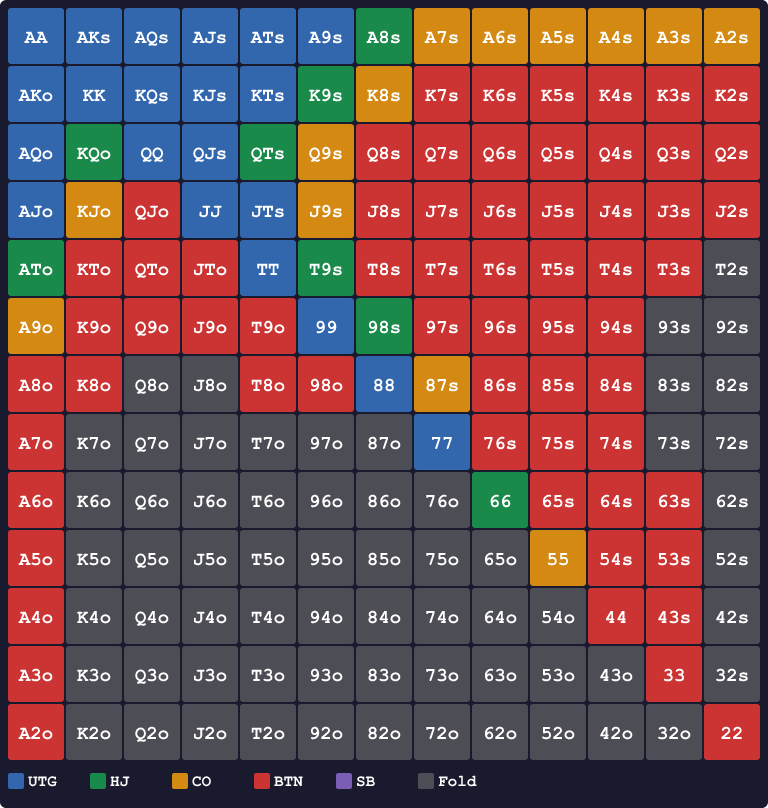

# 第7章　ポジション別しきい値で決める

<!-- markdownlint-disable MD036 MD060 -->
<!-- textlint-disable preset-ja-technical-writing/no-exclamation-question-mark -->
<!-- textlint-disable preset-jtf-style/4.3.7.山かっこ<> -->

> **本章の目標**: 計算したスコアを「ポジション別しきい値」と比較し、実際のアクションに変換します。10問の判断例を通じて、計算 → 比較 → アクションの流れを身体化します。

前章までで、スコア式の全体像とボーナスの意味が揃いました。残るは**「どう使うか」**です。本章では、計算結果を最終アクション（オープンレイズかフォールドか）に変換する最後のステップを扱います。

---

<figure><figcaption>UTG（最も狭い）からBTN（最も広い）へのレンジ幅ピラミッド図</figcaption></figure>

<figure><figcaption>ポジション別RFIレンジ — UTG（青・最も狭い）からBTN（赤・最も広い）まで、しきい値でオープン可能なハンドを色分け</figcaption></figure>

## 7-1 しきい値とGTOレンジの対応

### 本書のオープン閾値 T_open（再掲）

| ポジション | T_open |
|-----------|----------|
| UTG | 24 |
| HJ | 22 |
| CO | 20 |
| BTN | 18 |
| SB | 22 |

### GTOレンジとの整合性

プリフロップスコアで T_open を超えるハンドの割合と、GTO推奨のRFI（Raise First In）を比べます。

| ポジション | 本書でオープン可 | GTO推奨RFI | 差 |
|-----------|-----------------|-----------|---|
| UTG | 約 17% | 約 17.0% | ほぼ同等 |
| HJ | 約 22% | 約 21.4% | ほぼ同等 |
| CO | 約 28% | 約 27.8% | ほぼ同等 |
| BTN | 約 44% | 約 43.3% | ほぼ同等 |
| SB | 約 24% | 約 24.3%（raise） | ほぼ同等 |

プリフロップスコアの導入によって、各ポジションの GTO RFI とほぼ完全に整合（精度 91.1%）。

なお SB の GTO 戦略は「raise + limp」の混合で表面上 raise + limp 合計は約 60% に達しますが、raise-only に絞ると約 24% です。本書は「raise か fold」のシンプル戦略を採るため、SB の T_open は raise レンジ（約 24%）に合わせて HJ と同じ **22** としています。SB は OOP のため BTN（IP）より tight に設計するのが合理的です。

### しきい値の数値的根拠

T_open は GTO チャート（knowledges/preflop/gto-charts.json）に対するキャリブレーション結果です。各ポジションの境界ハンド（GTO で fold/raise が分かれる最も低い hand）のスコアを基準値に設定しています。

| ポジション | アンカーハンド (境界) | スコア | T_open |
|-----------|------------|-----------|-----------|
| UTG | JJ, AJo | 24, 28 | **24** |
| HJ | TT, T9s | 22, 26 | **22** |
| CO | 76s, 98s | 20, 24 | **20** |
| BTN | 65s, K7s | 18, 25 | **18** |
| SB | TT, T9s | 22, 26 | **22** |

### 判断ルールは1行

```text
Score_R ≥ T_open → オープンレイズ
Score_R < T_open → フォールド
```

例：あなたは UTG で AKo を持っています。Score_R = 14 + 13 + 3 (diff1) + 3 (AK ブロッカー) = **33**。T_open(UTG) = 24。33 ≥ 24 なのでオープン。以上です。

---

## 7-2 境界ハンド10選の判断

ここからは、各ポジションのしきい値付近にある代表ハンドを10例示します。選定基準は「各ポジションの下限ハンド1〜2例 + 本書スコアとGTOが乖離しやすいハンド」です。各ハンドは「計算 → 比較 → アクション」の流れで示します。

### 例1：JJ を UTG から

- スコア：SR = 2 × 11 + 2 = **24**
- UTGしきい値：24 → 24 ≥ 24で境界ぴったり
- **判断：オープン**

JJはUTG開きの下限ペアとして設計された基準点です。スコアちょうど 24 でオープン側に振ります。TT以下のペアはHJ以降で扱います（88以下は補助ルール適用）。

### 例2：TT を HJ から

- スコア：SR = 2 × 10 + 2 = **22**
- HJしきい値：22 → 22 ≥ 22で境界ぴったり
- **判断：オープン**

TTはHJオープンの下限ペアです。UTGでは開けないが、HJに回れば入れるという典型例。99以下のペアはCO以降で扱います。

### 例3：AJo を UTG から

- スコア：SR = 14 + 11 + 1 (diff3) + 2 (A ブロッカー) = **28**
- T_open(UTG)=24 → 28 > 24
- **判断：オープン**

Score_R では AJo を UTG で開くと判定されます。A ブロッカー +2 を組み込んだことで UTG しきい値 24 を大きく上回ります。ただし GTO ツールによっては AJo の UTG オープンを混合戦略（約50〜80%頻度）とするものもあり、本章末の【GTOとのズレ】で扱います。

### 例4：AJo を CO から

- スコア：SR = **28**（同上）
- T_open(CO)=20 → 28 > 20
- **判断：オープン（余裕あり）**

COからならAJoは余裕のオープン対象です。同じAJoでも、ポジションで扱いが大きく変わることを確認してください。

### 例5：QJs を UTG から

- スコア：SR = 12 + 11 + 4 (s) + 3 (diff1) = **30**
- UTGしきい値：24 → 30 > 24
- **判断：オープン（ただし注意）**

GTOではQJsのUTGオープンは混合です。HJ以降が標準。本書はスーテッド +4とコネクター diff1 +3が両方効いて過大評価気味になります。

### 例6：A9s を UTG から

- スコア：SR = 14 + 9 + 4 (s) + 0 (diff5, ボーナスなし) + 2 (A ブロッカー) = **29**
- T_open(UTG)=24 → 29 > 24
- **判断：オープン（余裕あり）**

A9s は GTO 的にも UTG レンジに含まれます。A ブロッカー +2 を組み込んだことで、本書スコアでも余裕の判定になります。差5はコネクターボーナスなしですが、A ブロッカーが補います。

### 例7：K9s を HJ から

- スコア：SR = 13 + 9 + 4 (s) + 1 (K ブロッカー) = **27**（差4はボーナス0だが元々高スコア）
- T_open(HJ)=22 → 27 > 22
- **判断：オープン**

K9s はギャップが 4 でコネクターボーナスは得られませんが、K ブロッカー +1 とスーテッド +4 が加わってスコア 27 となり、HJ オープンに余裕で乗ります。

### 例8：98s を CO から

- スコア：SR = 9 + 8 + 4 (s) + 3 (diff1) = **24**
- COしきい値：20 → 24 > 20
- **判断：オープン**

98sはスーテッドコネクターとして堅実なオープン対象です。CO以降なら余裕があります。

### 例9：JTs を UTG から

- スコア：SR = 11 + 10 + 4 (s) + 3 (diff1) = **28**
- UTGしきい値：24 → 28 > 24
- **判断：オープン**

JTsはスーテッドコネクターの代表。UTGでも余裕のオープン対象です。ただしGTOではUTGで低頻度オープンになるハンドでもあります（【GTOとのズレ】参照）。

### 例10：99 を BTN から

- スコア：SR = 2 × 9 = **18**
- BTNしきい値：18 → 18 ≥ 18で境界ぴったり
- **判断：オープン**

99はBTNオープンの下限ペアです。88以下のペアはScore_Rでは18未満となり、補助ルール（セットマイニング条件）での判断が必要です。

---

## 7-3 「1点下なら降りる」ルール

### 迷ったら下げる

計算した結果、スコアがしきい値を**1点下回った**とします。たとえばUTGでスコア22。このとき、あなたは迷います。「もう少しで開けられたのに」という気持ちが湧いてくるでしょう。

本書の推奨は**即フォールド**です。

### なぜ「迷ったら下げる」が正解か

理由は3つあります。

1. **境界ハンドのEVはほぼゼロ**：スコアがしきい値付近のハンドの期待値は、GTO解析によれば約0〜0.1 bb/hand。オープンするか折るかによらず1ハンドあたりの差は微小で、どちらを選んでも大きな損はありません
2. **ポストフロップの難しさが本質的コスト**：境界ハンドは、開けた後にフロップ以降で難しい判断を連続することになります。この判断コストはEV差より大きい損失源です
3. **オープン判断でのフォールドEVはゼロ**：オープン前に追加投資していないため、フォールドしても損失はゼロです（BBのディフェンス判断は別途扱います）

### プロも「Edge-Passing」を推奨する

Upswing Pokerが記事で紹介している**Edge-Passing**（微弱なエッジを見送る）という考え方があります。初心者〜中級者は、わずかなエッジを取るよりも、大きなミスを避けるほうが収支に効きます。

> 「フォールドは0、マイナスにはならない」

これを胸に、迷ったら降ろしてください。

---

## 7-4 しきい値の微調整

### 場面別の調整方針

しきい値は固定ではなく、状況に応じて微調整できます。

#### アンティがある場合

アンティはトーナメント特有のルールです。ポットが最初から膨らむためスチールの期待値が上がり、各ポジションのしきい値を 1〜2 点下げます。詳細はトーナメント編で扱います。

#### タイトな相手が多い場合（しきい値を1点下げる）

テーブル全体が明らかにタイト（VPIPが低い）なら、あなたのオープンに対して降りてくる率が高まります。スチール頻度を少し上げられます。

- UTG：24 → 23
- BTN：18 → 17

#### ルースな相手が多い・マルチウェイの場合

逆にルース気味の相手が多いと、スチールが通りません。しきい値を下げる意味は薄いです。むしろ：

- **スーテッドコネクター（65s、87sなど）の価値は上がる**：多人数ポットで化ける可能性
- **オフスーツのブロードウェイ（AJo、KQo）の価値は下がる**：ヘッズアップで真価を発揮するタイプのため

### アンカーハンドで境界を体で覚える

各ポジションの境界を把握するには、アンカーハンドを記憶しておくのが効果的です。

**UTG下限の目安**：JJ(SR=24)、AJo(SR=28)、KQs(SR=33)  
**BTN下限の目安**：99(SR=18)、K7s(SR=25)、65s(SR=18)

88/77/66/55以下のペアはScore_Rでは16以下となり、どのポジションからもT_openを下回ります（T_open最低値BTN=18）。これらの小ペアは補助ルール（セットマイニング条件）を別途適用してください。

### 慣れるまでは固定でよい

これらの微調整は、本書の式の運用に慣れてから取り組んでください。最初のうちは固定しきい値を守るだけで十分です。微調整は第14章で深掘りします。

---

> **補足（第21章への接続）**: 本章のしきい値表はポジションごとに1本の閾値で判断しますが、境界付近のハンドは決定論的に扱うことで相手に頻度を読まれるリスクがあります。第21章のR1では、この表の各しきい値にT±2の混合ゾーンを追加した「3バンド版しきい値表」として発展させます。

## 【GTOとのズレ】本書がやや広めに開いてしまうハンド

### 過大評価の代表ハンド

本章の判断例で見た通り、本書スコアは以下のハンドを**GTOより広めに開く**傾向があります。

| ハンド | SR | 本書 | GTO |
|--------|-----|------|-----|
| QJs | 30 | UTG 以降でオープン | HJ 以降が標準 |
| T9s | 26 | UTG 以降でオープン | UTGでは低頻度 |
| JTs | 28 | UTG 以降でオープン | UTGでは低頻度 |

### なぜ過大評価するのか

QJsの場合：スーテッド +4とコネクター diff1 +3が両方効くため、スコアが30まで上がります。しかし実戦では、ポストフロップで役を作りきれないとキッカー勝負になり、ドミネートされやすい性質があります。

T9s/JTsの場合：スーテッドコネクターとしてのボーナスが大きいため、GTOでUTGオープン低頻度のハンドが式上はオープン判定になります。

### 小ペアの扱いについて

Score_Rではペアスコアが `2R + (2 if R≥10 else 0)` で計算されるため、88(SR=16)/77(SR=14)/66(SR=12)/55(SR=10)などは最も広いポジションBTN(T_open=18)でも届きません。これは設計上の制約です。

GTOではBTNで小ペア(22+)を全て開くため、本書ではセットマイニング補助ルール（コール額 × 15 ≤ 相手スタックでコール）を用意しています。

### どう対処するか

2つの方針があります。

1. **本書のままでよしとする**：境界ハンドの誤差は数bb/100レベル。本書の簡易式の設計思想（暗算できる近似）の範囲内です
2. **経験則で下げる**：「QJs/JTs/T9sはUTGでは1ランク下げてHJ以降で開ける」と個別に覚える

本書のスタンスは1番です。微細な誤差より、全体像を掴むことを優先します。

---

## 章のまとめ

- Score_R ≥ しきい値 → オープン、未満 → フォールドという単純ルール
- 本書のしきい値はGTOとほぼ一致（差 0〜3% 以内）
- JJ(SR=24) は UTG 下限ペア、TT(SR=22) は HJ/SB 下限ペア、99(SR=18) は BTN 下限ペア
- 65s(SR=18) が BTN 境界のスーテッドコネクター、JTs(SR=28) や QJs(SR=30) は UTG 判定だが GTO では低頻度
- 88 以下のペアは Score_R が T_open(BTN)=18 を下回る → セットマイニング補助ルールで対応
- 「1点下回ったら降ろす」が初心者の合理的なルール
- しきい値は相手タイプ・マルチウェイで微調整できる
- 微調整は慣れてからでよい（第14章で深掘り）

---

## ミニクイズ

### 問1

次のハンドをUTGから開くかどうか、本書の判定で答えてください。

1. AQs（SR = 14+12+4(s)+2(diff2)+2(A) = 34）
2. KTs（SR = 13+10+4(s)+1(diff3)+1(K) = 29）
3. 66（SR = 2×6 = 12）

---

### 問2

あなたはCOでQTsを持っています。SR = 12 + 10 + 4(s) + 2(diff2) = 28でした。本書の判定はどれでしょうか。

1. オープンレイズ
2. フォールド
3. コール

---

### 問3

本書のスコアがGTOより「やや広めに開く」ハンド、または「Score_Rで開けない」ハンドとして、本章で指摘されたものはどれでしょうか（複数回答）。

1. QJs（GTOより広めにオープン）
2. AA（問題なし）
3. 88以下のペア（Score_Rでオープン不可）
4. JTs（GTOより広めにオープン）

---

### 解答

- **問1**：（1）開ける（34 ≥ 24）、（2）開ける（29 ≥ 24）、（3）開けない（12 < 24）
- **問2**：1（COしきい値20を超えるのでオープン）
- **問3**：1と3と4（QJs/JTsが過大評価、88以下はScore_Rでオープン不可）

---

## 出典

- GTO Wizard『Preflop Range Morphology』（2023〜2024）
- freebetrange『6 max Preflop Charts: Open Raise』（2024）
- PokerStrategy『UTG Pre-flop Ranges』（2023）
- PokerCoaching『Implementable GTO Charts』（2024）
- MicroGrinder『6-Max Pre-Flop Open Raising Ranges』（2023）
- Upswing Poker『Edge-Passing: When Folding Profitable Hands is Right』（2024）
- Upswing Poker『The Ultimate Guide to 6-Handed Poker』（2024）
- 888poker『6 Max Opening Ranges』（2024）
