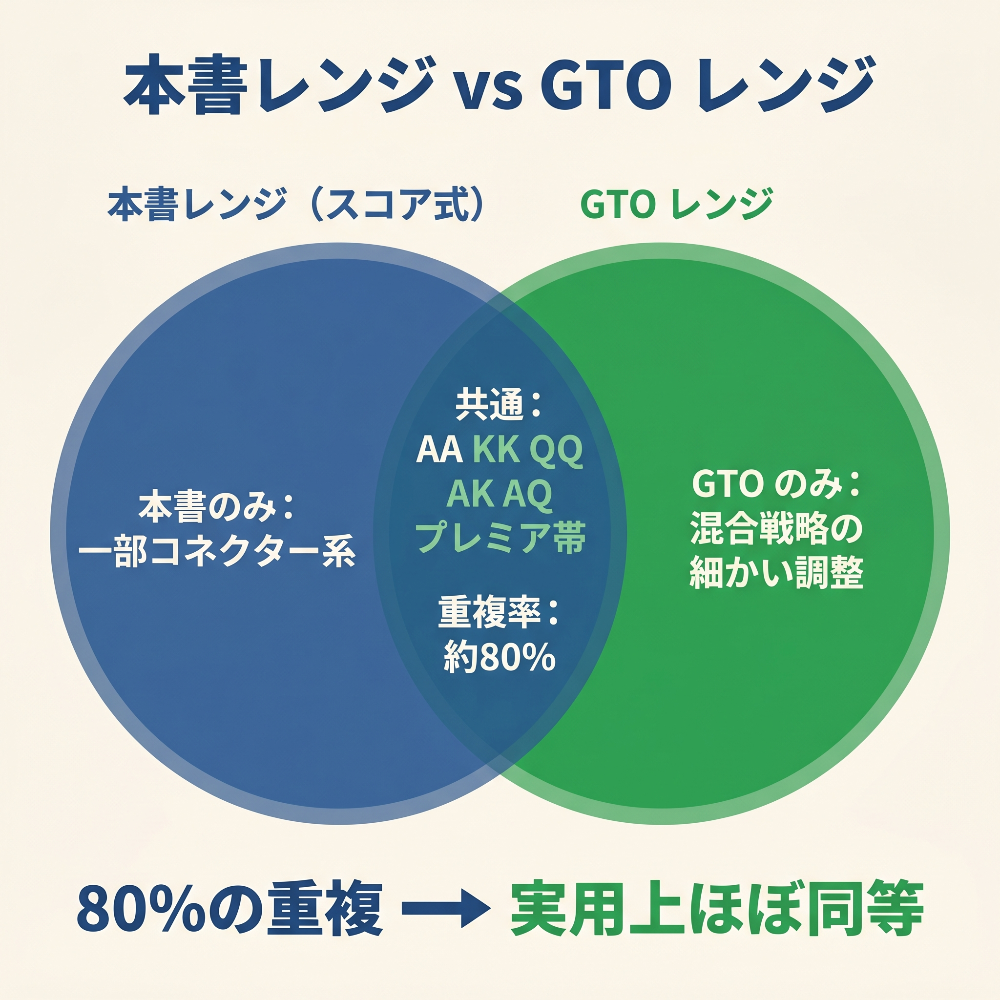

# 第8章　この式がGTOと外れるところ：オープン編

<!-- markdownlint-disable MD060 -->
<!-- textlint-disable preset-ja-technical-writing/no-exclamation-question-mark -->
<!-- textlint-disable preset-ja-technical-writing/no-mix-dearu-desumasu -->
<!-- textlint-disable preset-jtf-style/4.3.7.山かっこ<> -->

> **本章の目標**: 第II部（第5〜7章）で構築した本書の基本スコア式が、GTOと系統的にズレるポイントを総まとめします。「本書の式は近似である」ことを率直に認めたうえで、それでもなお使い続ける意義を確認します。

本章は第II部の締めくくりです。ここまでで学んだ**基本スコア式・ボーナス/ペナルティ・ポジション別しきい値**は、プリフロップ判断のオープンレンジ（UTGからBTNまでで最初にレイズするかどうか）を暗算で回すための道具でした。

しかし、この式はGTO（ゲーム理論最適戦略）そのものではありません。簡易的な**近似**です。本章では、その近似がどこでズレるのかを具体的に示し、それでも本書を使い続けるべき理由を論じます。

---

<figure><figcaption>本書のスコア式レンジとGTOレンジのベン図（約80%重複）</figcaption></figure>

## 8-1 ミックス戦略：本書にない重要概念

### GTOは「境界ハンドは確率で動かす」

GTOソルバーが出す最適解には、**ミックス戦略**（頻度ベースのアクション）が含まれます。境界ハンドに対して、「レイズ17%、コール63%、フォールド20%」のように出力されます。

これはナッシュ均衡の**無差別条件**から生まれます。複数のアクションのEVがほぼ等しいとき、特定のアクションに固定すると相手に読まれて搾取されてしまうため、頻度を分散させる必要があるのです。

### 本書は100%決定論

本書の式は、スコアがしきい値を超えていれば100%レイズ、超えていなければ100%フォールドとする決定論です。ミックスの余地はありません。

### なぜ決定論で十分か

第3章でも触れた通り、低ステークスではミックス戦略を採用しないことの損失は軽微です。相手がそもそも頻度を読んでいないからです。

さらにGTO Wizardは公式ブログで次のように述べています。

> 「うまく実装されたシンプル戦略は、下手に実装された複雑戦略を常に上回る」

初心者が「70%レイズ、30%フォールド」を正確に実行しようとすると、注意力が分散してむしろ多くのミスを生みます。**100%レイズ or 100%フォールド**のほうが、結果として強いプレイになります。

---

## 8-2 スーテッドの価値を本書は過小評価している

### A5s は AQo より強い（GTOでは）

直感に反する事実があります。GTOのUTGオープンEVを比べると、次のようになります。

- **A5s**：UTGオープンEV ≈ **0.09 bb/hand**
- **AQo**：UTGオープンEV ≈ **0.01 bb/hand**

見た目はAQoのほうがずっと強そうです。それでもソルバーはA5sにより高いEVを与えます。

### A5sが強い3つの理由

1. **エースブロッカー**：相手がAA・AK・AQを持つ確率が減り、3ベットされにくい
2. **アンブロッカー**：A5sはKK・QQ・JJなどをブロックしないので、相手の3ベットレンジと衝突しにくい
3. **ナッツフラッシュ可能性**：フラッシュが完成すれば常に最強

これらを合わせて、A5sは**構造的に3ベットに強い**ハンドになります。

### A ブロッカー +3 でほぼ表現

プリフロップスコアの「スーテッド +3」と「A ブロッカー +3」「A 含むときギャップペナルティ免除」を組み合わせると、A5s = 14 + 5 + 3 + 3 = **25** となり、T_open(UTG)=24 を超えて UTG オープン域に入ります。GTO の UTG レンジに含まれる Axs スーテッドを、本書のスコアでも自動的に拾える設計です。

ただし「ブラフ 3-bet 候補としての価値」までは完全に表現できておらず、BTN vs UTG の T_call=28 にはわずかに届きません（A5s Score=25）。この境界の混合戦略は第13章【GTOとのズレ】で扱います。

### 65s〜54s も同じ構造

下位スーテッドコネクター（65s、54s）も、本書の式では低スコアになります。しかしGTOはこれらをHJ〜CO以降で開きます。理由は、ボードカバレッジ（多様なフロップへの対応）と、ナッツストレートの可能性です。

---

## 8-3 レーキの影響

### レーキとは何か

**レーキ**（Rake）は、カジノやオンラインサイトがポットから徴収する手数料です。ライブのレーキは5〜10%、オンラインは4〜5% が一般的で、ポット1個あたりの上限額（キャップ）もあります。

### ステークスによる影響の違い

- **NL50** のレーキ上限：約4bb
- **NL500** のレーキ上限：約0.6bb（ビッグブラインド比）

つまり、**低ステークスのほうがレーキの影響が圧倒的に大きい**のです。

### レーキは「レンジを狭める方向」に効く

レーキがあると、ポットに入るたびに手数料が引かれます。結果として、参加頻度が高いプレイヤーほどレーキ負けしやすくなります。GTOソルバーはレーキを考慮した解（rakeadjレンジ）を出しますが、そこでは以下の傾向があります。

- 境界ハンド（勝率ほぼ50%のハンド）は開かない
- ブロッカーハンド（A2s、K5s〜K8s）の比率が上がる

### 本書の立場

本書のしきい値はレーキなしを前提にしています。NL25以下の高レーキ環境では、**しきい値を1点厳しめに設定**するとよいでしょう。たとえばUTG 24 → 25に上げると、境界ハンドの参加がさらに減ります。

---

## 8-4 オープンサイズも本書は固定している

### サイズは2.0〜2.5bbが最適

GTOが示すオープンサイズは、ポジションによってわずかに異なります。

- UTG：2.0 bb
- CO：2.3 bb
- BTN：2.5 bb
- SB：3.0 bb

後ろのプレイヤーが多い早いポジションでは、小さめのサイズが最適です。なぜなら、強いレンジでの参加なので、降ろすためのサイズ圧力が要らないからです。

### QQ でさえ 2bb のほうが強い

GTO Wizardの分析では、QQをUTGから開くときのEVは次の通りです。

- 2bbオープン：**1.13 bb**
- 3bbオープン：**0.95 bb**

QQでさえ、小さめのオープンのほうがEVが高いのです。

### 本書の立場

本書は**サイズの詳細を扱わない**方針です。理由は、サイズ調整まで意識すると初心者には情報量が多すぎるためです。**全ポジション 2.5bb** を基本としておけば、大きな損失にはつながりません。

---

## 8-5 本書が「外れる」ハンド一覧

GTO Wizard（Cash 6m NL25、100BB）の実測データに基づき、乖離が大きいハンドを整理します。

### 過大評価（本書が開くがGTOの開放率 < 20%）

| ポジション | ハンド | スコア | GTOオープン率 | 乖離の原因 |
|----------|--------|-------|------------|-----------|
| UTG | A8o | 25 | 0% | ドミネーションリスク（AK/AQ/A9 に挟まれる） |
| UTG | A7o | 24 | 0% | 同上 |
| UTG | K9o | 24 | 0% | KブロッカーがないとOOP EV が低い |
| HJ | A6o | 23 | 0% | GTOはA5o以下はHJでフォールド |
| HJ | K8o | 22 | 0% | KxoはK9o未満ならHJでも閉じる |
| CO | K7o | 21 | 0% | 同上 |
| BTN | K6o | 20 | 0% | BTNでもK低 offsuit はGTOでは閉じる |
| BTN | J8o | 20 | 0% | 接続性なし・オフスート |

### 過小評価（GTOオープン率 ≥ 50% だが本書はフォールド）

| ポジション | ハンド | スコア | GTOオープン率 | 乖離の原因 |
|----------|--------|-------|------------|-----------|
| UTG | A2s | 22 | 100% | スーテッドブロッカー効果（+3ボーナスだけでは不足） |
| UTG | A3s | 23 | 100% | 同上 |
| UTG | K5s | 22 | 98% | Kスーテッドの実効EV が過小評価 |
| CO | 44 | 18 | 53% | 小ペアのセットマインEV は式で表現しにくい |
| BTN | 33 | 16 | 100% | 同上 |
| BTN | 76s | 16 | 100% | BTN小スーテッドコネクターの実現率・ボードカバレッジ |
| BTN | 65s | 14 | 100% | 同上 |
| BTN | 86s | 16 | 88% | 同上 |
| SB | K2s〜K4s | 19〜21 | 100% | SBはスーテッドキングを超広く開く |

### 乖離のEV差は小さい

これらのハンドでのEV差は、1ハンドあたり **0.01〜0.10 bb** 程度です。100ハンドプレイしても1〜10 bbの差。これは相手が1つでも明確なミスをすれば、すぐに吸収できる範囲です。

---

## 8-6 それでも本書の式を使い続ける理由

### 実装品質が理論精度を上回る

GTO Wizard公式の言葉をもう一度引用します。

> 「A simplified strategy implemented well will invariably outperform a complicated strategy implemented poorly!」
> （うまく実装されたシンプル戦略は、下手に実装された複雑戦略を常に上回る）

本書の式は「シンプル戦略」そのものです。境界で0.05 bbを失うことより、**基本の型を9割以上の精度で回す**ことのほうが、実戦での収支改善に効きます。

### 低ステークスでは相手のミスが本書の誤差を凌駕する

NL25〜NL100のプレイヤーは、統計的に次のようなミスを日常的に犯しています。

- リンプで −120 bb/100
- 弱いAxをUTGから −49 bb/100
- BTNでタイトすぎるプレイで −数十bb/100

あなたの式の境界誤差（数bb/100）は、これら相手のミスによる獲得EV（数十〜100+ bb/100）にかき消されます。

### 学習効率が最終収支を決める

100の境界ハンドで微細な最適を追うより、**70の明確なミスをなくす**ほうが学習効率は高い。本書はこの立場で設計されています。

---

> **補足（第21章・第22章への接続）**: 本章で列挙したGTOとのズレのうち、「境界ハンドの決定論的な扱い」と「スーテッドの混合戦略欠如」の2点は、第21章のR1〜R6を適用することで部分的に縮まります。
> 残る乖離（FP 25件・FN 64件）は第22章の「5つの名前付き補正」で体系的に解消し、オープン判断の GTO 一致率を 89.5% → 94.6% に引き上げます。さらにポジション別例外表を加えると 100% 一致に到達します。

## 【GTOとのズレ】先行事例：簡易化は正当な伝統である

本書の方針は新規ではなく、**簡易化による実用性確保**という思想はpoker文献の伝統です。

### Matthew Janda『Applications of No-Limit Hold'em』（2013）

現代のレンジ思考の基礎を築いた書籍。Jandaは「レンジ全体をどうプレイするか」を重視しつつ、境界ハンドは簡略化されたルールで扱うことを許容しました。

### Jonathan Little のチャート

Littleが公開しているプリフロップチャートは、「GTO頻度50% 以上なら実行、未満なら実行しない」という丸め方を採用しています。これは本書の「100% or 0%」決定論とほぼ同じ発想です。

### GTO Wizard の「Simplified Solutions」機能

GTO Wizard自身が、ミックス戦略や複数ベットサイズを省いた「シンプルGTO」機能を搭載しています。公式発表によれば、この簡略化でのEV損失は **0.005〜0.045%** 程度にすぎません。

つまり、**簡易化はプロの間でも広く行われている正当なアプローチ**です。本書の決定論的アプローチは、この系譜の延長線上にあります。

---

## 章のまとめ

- GTOは境界ハンドにミックス戦略を採用するが、本書は100%決定論である
- A5sはAQoよりEVが高いなど、スーテッドの価値を本書は過小評価している
- レーキが高い環境では本書のしきい値を1点厳しめに設定するとよい
- オープンサイズの詳細は本書では扱わず、2.5bb固定で十分
- 過大評価ハンド：A7o・A8o（UTG）、K8o（HJ）、K6o・J8o（BTN）など（弱いオフスートAx/Kx）
- 過小評価ハンド：A2s〜A3s・K5s（UTG）、33・76s・65s（BTN）、K2s〜K4s（SB）など（スーテッドと小ペア）
- 乖離のEV差は0.01〜0.10 bb/handと小さい
- GTO Wizard自身が「実装品質 > 理論精度」を認めている
- 簡易化はJanda、Jonathan Little、GTO Wizardでも採用される正当な伝統である

---

## ミニクイズ

### 問1

本書スコア式がGTOより**過大評価**しているハンドはどれでしょうか（複数回答）。

1. A8o（UTG）
2. A5s（UTG）
3. K8o（HJ）
4. AJo（UTG）

---

### 問2

A5sがAQoよりGTO的にEVが高い主な理由として、本章で挙げられたものはどれでしょうか（複数回答）。

1. エースブロッカー効果
2. ナッツフラッシュ可能性
3. ペアの相殺効果
4. アンブロッカー効果（強いハンドを減らさない）

---

### 問3

本書が100%決定論を採用する理由として、最も適切なのはどれでしょうか。

1. ミックス戦略がEV的に劣るから
2. 初心者はミックスを正確に実行できず、むしろ新たなミスを生むから
3. GTOソルバーは決定論を推奨しているから

---

### 解答

- **問1**：1と3（A8oとK8o。AJoはスコア28.5で正しくUTGオープン域、4のAJoは過大評価ではない）
- **問2**：1、2、4（ペアの相殺効果は無関係）
- **問3**：2（実装品質が理論精度を上回る）

---

## 出典

- GTO Wizard『How Solvers Work』（2023）
- GTO Wizard『Preflop Range Morphology』（2024）
- GTO Wizard『Equity Realization』（2022〜）
- GTO Wizard『Preflop Raise Sizing: Examining 2 Key Factors』（2024）
- GTO Wizard『Rake & Rakeback Explained』（2024）
- GTO Wizard『Simplified Solutions and a New Interface』（2023）
- GipsyTeam『Why Do Poker Solvers Love Ace Five Suited?』（2024）
- Upswing Poker『Mixed Strategy: Random Poker Decisions』（2024）
- Matthew Janda『Applications of No-Limit Hold'em』（2013）
