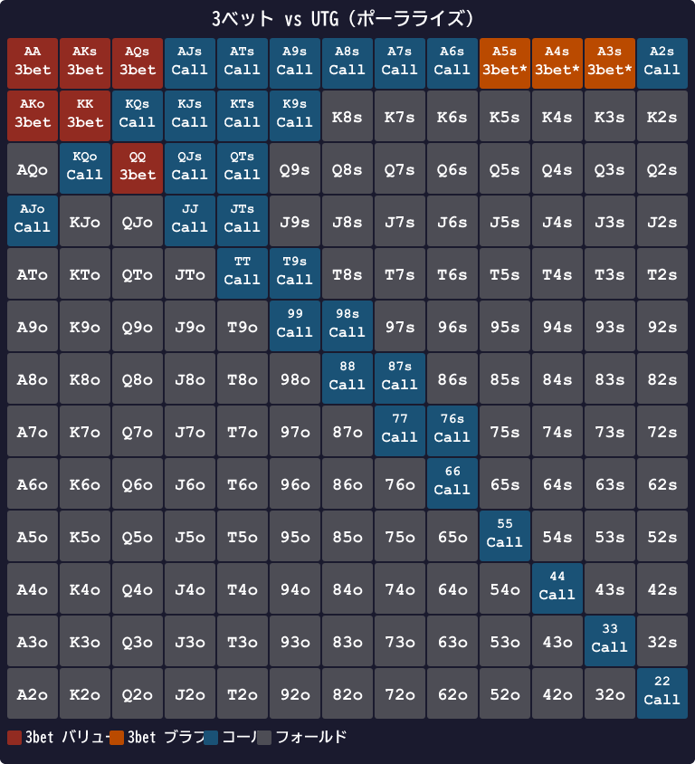

# 第12章　3ベット — プリフロップスコアによる二段判定

<!-- markdownlint-disable MD060 -->
<!-- textlint-disable preset-ja-technical-writing/no-exclamation-question-mark -->
<!-- textlint-disable preset-ja-technical-writing/no-mix-dearu-desumasu -->

> **本章の目標**: 対オープンに対する「3ベット / コール / フォールド」の判断を、第5章で導入した**プリフロップスコア（Score_R）**と **二段閾値表**で決定論的に下せるようになります。ブロッカー効果の活用と、コール閾値 T_call の存在意義（同じスコアでもポジションが違うとコールになる理由）を学びます。

対オープンには3つの選択肢がありました。**コール、フォールド、3ベット（リレイズ）**。これまでの章（第9〜11章）では主にコールとフォールドの判断を扱ってきました。本章からは、**攻撃側**のアクションである3ベットを取り上げます。

3ベットは、プリフロップで最もプレッシャーを与えられるアクションです。一発でポットが大きくなり、相手は高い精度で応じなければなりません。ただし、外せば大きく損失を被る諸刃の剣でもあります。

---

<figure><figcaption>プリフロップスコア式の構造と各コンポーネントの説明図（3-bet 判定への適用）</figcaption></figure>

<figure><figcaption>対UTG〜対SBオープン者別の3betしきい値ラダー（BTN は T_3bet=30/T_call=22、SB は T_3bet=20 単一）</figcaption></figure>

<figure><figcaption>AK保有時に相手のAA/KK/AKコンボが16→12に減少するブロッカー効果の視覚化</figcaption></figure>

## 12-1 3ベットの目的はバリューとブラフの2種類

### バリュー3ベット

QQ+、AKのような**強いハンド**で3ベットし、ポットを大きくして価値を取るプレイです。相手がAK、QQ、JJあたりでコールすれば、大きなポットで有利な勝負ができます。

### ブラフ3ベット

A5s、KTsのような**ブロッカー付きハンド**で3ベットし、相手を降ろすプレイです。

ブラフ3ベットの狙いは2つ。

1. **フォールドエクイティを取る**：相手が降りればそこで利益確定
2. **レンジバランスを維持する**：「この人の3ベットは強い手だけ」と読まれないための多様化

この**「バリュー + ブラフ」の組み合わせ**がGTO的な3ベット戦略です。ブラフを混ぜることで、相手はあなたの3ベットに対してタイトにフォールドできなくなります。

---

## 12-2 プリフロップスコアと二段閾値の全体像

### Score_R（3ベット判断用スコア）

3ベット判断には **Score_R**（Raise スコア）を使います。BBディフェンスには別途 Score_C を使いますが、本章の BTN/CO/HJ/SB における 3ベット / コール / フォールド判断はすべて Score_R で行います。

```text
Score_R の計算式
─────────────────────────────────
ペア:     2R + (2 if R ≥ 10 else 0)
          例: AA=2×14+2=30、KK=2×13+2=28、TT=2×10+2=22、99=2×9=18
─────────────────────────────────
非ペア:   H + L
          + スーテッド  +4
          + コネクター: 差1=+3 / 差2=+2 / 差3=+1 / 差4以上=0
          + ブロッカー: AK=+3 / A（Kなし）=+2 / K（Aなし）=+1
          ペナルティなし
─────────────────────────────────
代表値: AKs=37, AKo=33, AQs=34, AJs=32, AJo=28
        KQs=33, KQo=29, QJs=30, KJs=31, JTs=28
        T9s=26, 98s=24, 87s=22, A5s=25, A4s=24
```

旧式（ペア +10 方式）との主な違い：ペアは R 値を 2 倍にするため AA=30, KK=28 と低めに出ます。一方で非ペアはコネクター・スーテッドボーナスが大きくなり、JTs=28 など連続系が高くなります。

### 二段閾値による 3 つの判断

3ベットの判断には**二段閾値**を使います。閾値が 1 つではなく 2 つあるのは、「3ベット不実行 = フォールド」とは限らないからです。

```text
Score_R ≥ T_3bet           → 3ベット
T_call ≤ Score_R < T_3bet  → コール
Score_R < T_call            → フォールド
```

- **T_3bet（3ベットしきい値）**: これを超えればプレッシャーをかける
- **T_call（コールしきい値）**: 3ベットには届かないが、ポジション優位を活かせる強さ

例: BTN で **KQo（SR=29）** を持って UTG オープンを受けた場合、対UTG しきい値 T_3bet=30 には届かないので 3ベット不実行。しかし T_call=22 を満たしているので**コール**します。

### ブロッカーはプリフロップスコアに組み込み済み

3ベット判断に重要な「Aブロッカー +2」「Kブロッカー +1」「AK両方 +3」は、Score_R に**最初から組み込まれています**。3ベット用に別計算する必要はありません。

---

## 12-3 ブロッカーの威力

### 組み合わせ数で見る効果

ポーカーのハンドは「コンボ数」で数えられます。相手がどのハンドを持っているかの組み合わせが、ブロッカーで変わります。

| 自分の保有 | 相手のAA | 相手のAK | 相手のKK |
|-----------|---------|---------|---------|
| なし | 6通り | 16通り | 6通り |
| A 1枚 | **3通り**（半減） | 12通り（25%減） | 変化なし |
| K 1枚 | 変化なし | 12通り（25%減） | **3通り**（半減） |
| AK（A+K） | 3通り | **9通り**（44%減） | 3通り |

※ 自分がAKを持つと、残りデッキにAが3枚、Kが3枚。相手のAKコンボは3 × 3 = 9通りになります。16 → 9は約44%減。

Aを1枚持っているだけで、相手のAAが半分になります。これはブラフ3ベットを成功させるうえで大きなアドバンテージです。

### スコア式ブロッカー項の根拠

Score_R では次のように設定しています。

| 条件 | ボーナス |
|------|---------|
| A と K の両方を含む | +3 |
| A を含む（K なし） | +2 |
| K を含む（A なし） | +1 |

AのほうがKよりブロッカー効果が大きいので差をつけています。AKの場合は「AK ブロッカー +3」として扱い、Aの +2 と K の +1 を別途加算しません（重複計算禁止）。

### プレイアビリティも大事

ただし、ブロッカー効果はあくまで**ボーナス要素**です。実際の研究では、「キャッシュゲームの3ベット成功にはブロッカーよりプレイアビリティ（フロップ以降のEV）のほうが3倍重要」と指摘されています。ブロッカーだけを見て突っ込むと、フロップ以降で処理できず事故を起こします。

---

## 12-4 ポジション別 二段閾値表

3ベットの「誰に対して」だけでなく「自分が誰か」もしきい値に影響します。BTN は CALL レンジが広く、CO/HJ/SB は CALL レンジがほとんどありません。

### BTN（CALL レンジあり）

| 相手のポジ | T_3bet | T_call |
|---|---|---|
| 対 UTG | **30** | **22** |
| 対 HJ  | **28** | **20** |
| 対 CO  | **22**（単一） | — |

`T_3bet ≤ SR → 3ベット` / `T_call ≤ SR < T_3bet → CALL` / `SR < T_call → FOLD`

BTN vs UTG で **KK(SR=28)/QQ(SR=26) がコールゾーンに入る**点に注意してください。T_3bet=30 に届かないためです。GTOでも KK/QQ は BTN vs UTG で3-bet/call の混合戦略を採るため、本式でのコール判定は GTO 整合しています。

### CO・HJ（実質 3ベット or フォールド）

| 自分 \ 相手 | UTG | HJ |
|---|---|---|
| HJ | **28** | — |
| CO | **26** | **24** |

T_3bet = T_call なので**実質的に 3ベット or フォールド**の二択です。CO で UTG オープンに対して中堅ハンド（KQo など）を持っていても、コールはほぼせずフォールドが基本です。

### SB（3ベット or フォールド）

| 対 UTG | 対 HJ | 対 CO | 対 BTN |
|---|---|---|---|
| **28** | **26** | **24** | **20** |

SB はポジション最弱なのでコールせず、3ベットでイニシアチブを取るか降りる方針です。

### BB（wide defense）

BB は別表（第15章）で扱います。1bb 払い済のためポットオッズが良く、ワイドにディフェンスできるのが特徴です。BB defense では専用スコア Score_C を使います。

### GTO頻度との対応

この閾値は GTO チャートとの整合検証で **約 92.6% の精度**でレンジを再現します。GTO の 3ベット頻度は次のとおりです。

- BTN vs UTGオープン: 3ベット約 **7.5%** / コール約 **8.5%** / フォールド **84%**
- BTN vs COオープン: 3ベット約 **12%** / コール約 **6%** / フォールド **82%**

vs UTG で T_3bet=30 / T_call=22 の二段構造が、3ベット頻度 7.5% とコール頻度 8.5% を再現しています。

---

## 12-5 代表ハンド5選（BTN vs UTG オープン）

すべて Score_R で計算します。BTN vs UTG の閾値は **T_3bet=30 / T_call=22**。

### 例1：AKo（SR=33）

- H + L = 14 + 13 = 27
- ブロッカー（AK 両方）: +3
- コネクター（差1）: +3

```text
14 + 13 + 3(blocker) + 3(diff1) = 33
```

SR=33 ≥ T_3bet=30。**3ベット**。AKs（SR=37）はもちろん 3ベット。

### 例2：KQo（SR=29）— 本章の主役

- H + L = 13 + 12 = 25
- ブロッカー（K のみ）: +1
- コネクター（差1）: +3

```text
13 + 12 + 1(K blocker) + 3(diff1) = 29
```

T_3bet=30 には 1 点届かないので 3ベット不実行。しかし T_call=22 を満たすので**コール**。

KQo は「強そうだがプレミアムではない」典型例。BTN なら **コールでフロップを見るのが GTO 整合**。CO や HJ なら T_call が無いので**フォールド**になります。同じハンドでもポジションで判断が変わるのが二段閾値の威力です。

### 例3：A5s（SR=25）— コールに変化

- H + L = 14 + 5 = 19
- スーテッド: +4
- ブロッカー（A のみ）: +2
- コネクター: なし（差9 → 0）

```text
14 + 5 + 4(suited) + 2(A blocker) = 25
```

T_call=22 ≤ 25 < T_3bet=30 → **コール**。

旧式では A5s はフォールド判定でしたが、Score_R ではコールゾーンに入ります。GTOとのズレ: GTOは A5s を「3ベット/フォールド混合」（ブラフ3ベット候補）として扱う場面が多く、コールよりも3ベットを推奨することがあります。本式ではコール判定を採用しており、上級者は GTOブラフ3ベット候補として活用できます（後述の【GTOとのズレ】参照）。

### 例4：QJo（SR=26）— コール

- H + L = 12 + 11 = 23
- コネクター（差1）: +3

```text
12 + 11 + 3(diff1) = 26
```

T_call=22 ≤ 26 < T_3bet=30 → **コール**。

旧式（T_call=28）ではフォールドでしたが、Score_R + 新閾値ではコールゾーンに入ります。BTN の広いポジション優位を活かせる強さです。CO や HJ からは T_call がないのでフォールドになります。

### 例5：65s（SR=18）— フォールド

- H + L = 6 + 5 = 11
- スーテッド: +4
- コネクター（差1）: +3

```text
6 + 5 + 4(suited) + 3(diff1) = 18
```

18 < T_call=22 → **フォールド**。

BTN vs UTG では小さいスーテッドコネクターはフォールド。UTG のレンジ（強いハンド中心）に対してフロップ以降の実現率も低く、採算が取れません。

### プリフロップスコア早見一覧（BTN vs UTG）

```text
T_3bet=30 以上 (3ベット):
  AKs(37) AQs(34) KQs(33) AKo(33) AJs(32) KJs(31) QJs(30) AA(30)
  ※ KK(28)/QQ(26) は T_3bet=30 に届かずコールゾーン

T_call=22 以上 30 未満 (コール):
  KK(28) JTs(28) KQo(29) A9s(29)  ← SR=(14+9+4+2=29)
  QQ(26) T9s(26) JJ(24) A5s(25) A4s(24) A3s(23) TT(22) 87s(22) QJo(26)

22 未満 (フォールド):
  99(18) 88(16) 77(14) 76s(20) 65s(18) 等
```

---

## 12-6 ポーラライズ vs リニア

### 2つのレンジ構成

3ベットレンジの作り方には、2つの方向性があります。

- **ポーラライズ**（二極化）：最強ハンド（QQ+、AK）とブラフ（Axs、KTs）だけで3ベット。中堅ハンドはコール
- **リニア**（連続）：最強から中堅までの連続した強いハンドで3ベット

### どう使い分けるか

- **対 UTG（相手が強い）**：ポーラライズが有効。中堅は降ろしにくいので、超強ハンドとブラフの組み合わせで対抗
- **対 BTN（相手が広い）**：リニア寄り。相手のレンジが広いので、中堅ハンドでもバリューになる
- **IP**：ポーラライズしやすい（ポジション優位でブラフを決められる）
- **OOP**：リニア気味（ブラフは降ろされにくいのでバリュー寄せ）

### 本書式はどちらを出すか

本書の Score_R ＋ 二段閾値は、**対UTGでポーラライズ気味、対BTNでリニア気味**になるよう自動的に設計されています。BTN vs UTG では T_3bet=30（プレミアム中心）と T_call=22（中堅でコール）の二段構造で、ポーラライズ的な「最強で3ベット、中堅でコール」が自然に出ます。一方、BTN vs CO では T_3bet=T_call=22 と単一閾値に近く、3ベットレンジが広がりリニア気味になります。

---

> **補足（第21章への接続）**: 本章の二段閾値判定は決定論的ですが、A5s/A4s/KTs のような境界付近のハンドは相手に頻度を読まれやすくなります。第21章の R1/R2（3バンド化・スート判定）で混合ゾーンを設け、R3（+R補正）で相手のオープンポジションに応じた閾値補正を加えることで、この問題を暗算の範囲内で改善できます。

## 【GTOとのズレ】ミックス戦略を決定論で近似している

### A5s/A4s のコール判定について

Score_R では A5s(25)/A4s(24) が T_call=22 以上のため**コール判定**になります。しかし GTO Wizard は BTN vs UTG で A5s を「3ベット/フォールド混合（ブラフ3ベット候補）」として扱い、コールより3ベットを推奨する場面があります。

本書でコール判定を採用する理由は2つあります。

1. **初心者がコールで参加するのはリスクが低い**：3ベットブラフに失敗すると大きなスタックを失いますが、コールはリスクが限定的です
2. **スコアが中間ゾーンにある**：A5s の SR=25 は「フォールドより参加」が適切なゾーンであり、コールはその実装として成立します

上級者が GTOブラフ3ベットを取り入れたい場合、A5s/A4s/A3s/A2s（Axスーテッド系）を3ベット候補として活用できます。

### KK/QQ のコールゾーン

BTN vs UTG では **KK(SR=28)/QQ(SR=26) がコールゾーン**（T_3bet=30 未満）に入ります。「KK でコールするの？」と感じる方も多いでしょうが、GTO も KK/QQ を BTN vs UTG で「3-bet/call の混合戦略」として扱います。本式でのコール判定は GTO 整合しています。

### 小ペアのフォールド（補助ルール との連携）

99(SR=18)/88(SR=16)/77(SR=14) は T_call=22 を下回り**フォールド判定**になります。実戦では「コール額 × 15 ≤ 相手スタック」のセットマイニング補助ルールを適用してコールを検討できます（第11章参照）。

### JTs/T9s のコールゾーン

JTs(SR=28)/T9s(SR=26) も T_call=22 以上のため BTN vs UTG でコールゾーンに入ります。GTO もこれらのスーテッドコネクターを BTN vs UTG でコールする場面が多く、整合的です。

### 3betレンジがポーラード型になる理由

GTOの3betレンジは「ポーラード型（二極化型）」になります。ポーラードレンジとは、AA/KK/AKといったナッツハンドとA5s/A4sといったブラフ的ハンドで構成し、JJ/TT/AQsなどの中間ハンドを除外する構成です。

なぜ中間ハンドを3betから外すのでしょうか。**リニアレンジ（中間ハンドを含む3bet）は相手にシンプルなコールで対応されやすいからです。**中間ハンドで3betすると、相手はプレミアムハンドとブラフの両方に対してタイトに動けるため、3betの脅威が薄れます。

一方、ポーラードレンジはナッツとブラフが混在するため、相手は「コールしたらナッツに捕まる」という恐怖を持ち続けます。これがフォールドエクイティを高める設計です。

**「JJやTTがコールを混ぜるのはなぜか」** という疑問もここで解決します。JJ/TTは中間ハンドの典型で、ポーラード戦略の一部としてコールレンジに回される設計です。無理に3betして4betを返されると困るハンドを、コールレンジに置くことで安定した運用ができます。ただし相手のオープンポジションが広い（CO/BTN）場合は、JJ/TTもバリュー3betとして機能します。

<figure><figcaption>3ベット vs UTG（ポーラライズ型） — 赤がバリュー（T_3bet=30以上）、青がコール（T_call=22〜29）</figcaption></figure>

<figure><figcaption>3ベット vs BTN（リニア型） — vs UTGより広いバリュー範囲でオーバーオール3bet頻度が上がる</figcaption></figure>

---

## 章のまとめ

- 3ベット判断には第5章の **Score_R**（ペア: 2R+(2 if R≥10)、非ペア: H+L+suited+4+conn+blocker）をそのまま使う
- 判定は**二段閾値**: T_3bet 以上で 3ベット / T_call 以上で コール / それ未満で フォールド
- BTN は CALL レンジが広い（vs UTG: T_3bet=30, T_call=22）
- BTN vs UTG では KK(28)/QQ(26) がコールゾーン（GTO 混合戦略と整合）
- CO/HJ/SB は CALL レンジがほぼなく、実質 3ベット or フォールド
- BB は wide defense で別表（第15章、Score_C 使用）
- 主要例: AKo(33) → 3ベット、KQo(29) → BTN ならコール / それ以外フォールド、A5s(25) → コール（GTO ブラフ候補は上級者向け）、QJo(26) → BTN ならコール
- ポーラライズは対UTG（T_3bet と T_call の差が大きい）、リニアは対BTN（T_3bet=T_call 単一）で効果的
- 小ペア（99以下）は T_call=22 を下回りフォールド判定。セットマイニング補助ルールで補完

---

## ミニクイズ

### 問1

Score_R において、AK 両方を含むハンドのブロッカーボーナスはいくつでしょうか。

1. +2
2. +3
3. +4

---

### 問2

AKs の Score_R を計算してください。

ヒント: H + L + スーテッド +4 + コネクター（差1）+3 + ブロッカー（AK 両方）+3

---

### 問3

次のハンドを **BTN vs UTG オープン**でどう判断しますか（T_3bet=30, T_call=22）。

1. AKo（SR=33）
2. KQo（SR=29）
3. AJs（SR=32）
4. A5s（SR=25）

---

### 解答

- **問1**：2（+3。AK 両方ブロッカーは +3 として一括処理する）
- **問2**：14 + 13 + 4(suited) + 3(diff1) + 3(AK blocker) = **37**（プレミアム、全ポジション 3ベット）
- **問3**:
  1. AKo（33）→ SR=33 ≥ T_3bet=30 → **3ベット**
  2. KQo（29）→ T_call=22 ≤ 29 < T_3bet=30 → **コール**
  3. AJs（32）→ SR=32 ≥ T_3bet=30 → **3ベット**
  4. A5s（25）→ T_call=22 ≤ 25 < T_3bet=30 → **コール**（旧式ではフォールドだったが Score_R ではコールゾーン）

---

## 出典

- Upswing Poker『3-Bet Preflop Strategy & Range Charts』（2024）
- Upswing Poker『Polarized Ranges vs Linear (Merged) Ranges Explained』（2024）
- SplitSuit Poker『Understanding 3-Bet Ranges In 2026』
- SplitSuit Poker『Poker Combos & Blockers 101 In 2026』
- GTO Wizard『A Beginner's Guide to Poker Combinatorics』
- GTO Wizard『PKO Versus Classic: Responding to 3-Bets』
- GTO Wizard『Preflop Range Morphology』
- Pokercode『Understand How to Use Blockers the Right Way』
- Poker.Pro『Constructing 3-Bet And vs. 3-Bet Ranges』
- Betting Data Lab『Poker 3Bet Range Strategy for Cash Games』
- 888 Poker『Big Blind 3betting vs IP Opponents』
