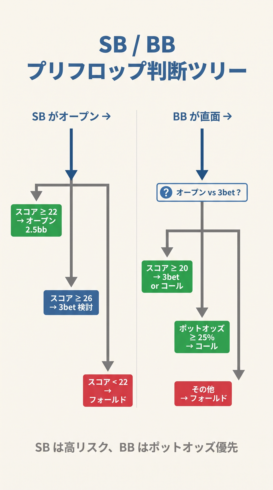
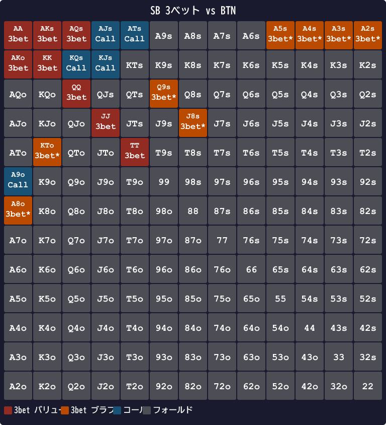
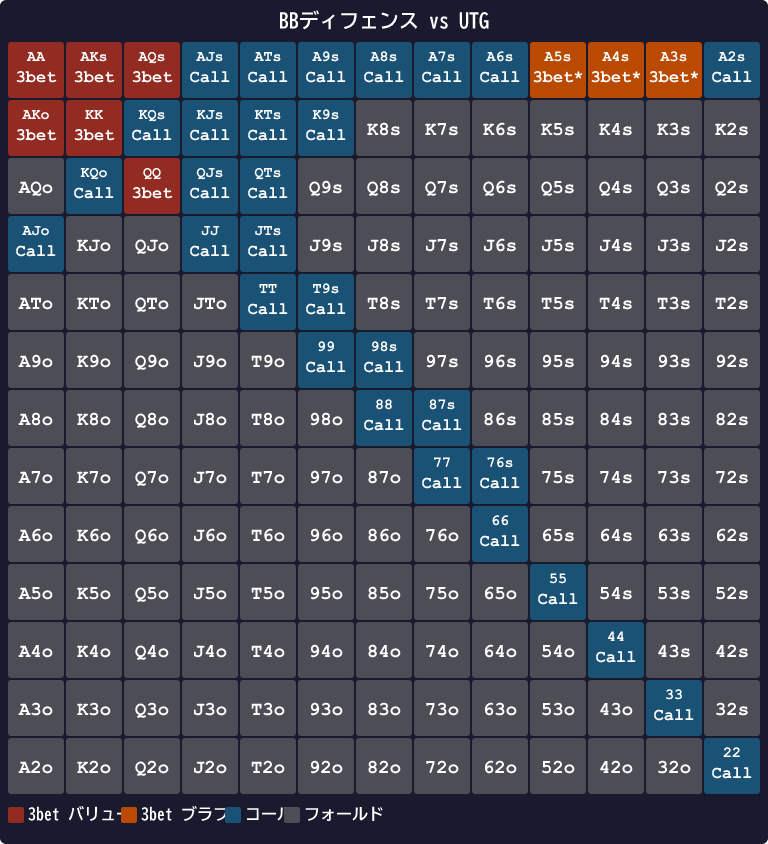
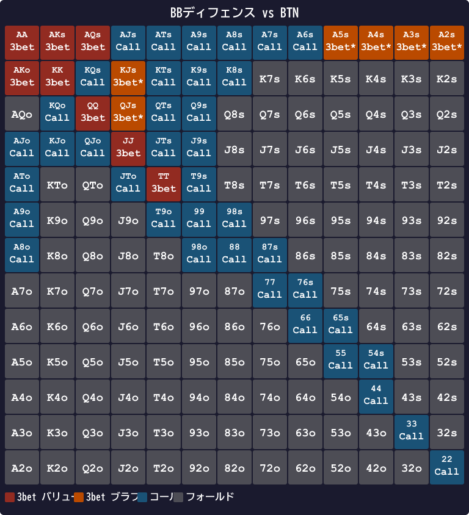

# 第15章　SBとBBの特殊性

<!-- markdownlint-disable MD060 -->

> **本章の目標**: ブラインドの2席、SB（スモールブラインド）と BB（ビッグブラインド）の特殊な戦略を扱います。「SBは3ベットかフォールド」「BBは広くディフェンス」という基本ルールの背景を理解します。BB defense では専用スコア **Score_C** を使った 6ステップフローを習得します。

SBとBBは、本書のほかのポジションと構造が違います。**強制的にチップを投入している**という、ほかにない特徴を持つ席です。この特徴が、戦略の根本を変えます。

本章では、SBとBBの戦略を独立に扱い、両者で**逆方向に動く**理由を明確にします。

---

<figure><figcaption>SBとBBのプリフロップ判断ツリー（オープン・3bet・コール・フォールドの分岐）</figcaption></figure>

<figure><figcaption>オープンサイズ別BBのポットオッズとMDFライン早見表</figcaption></figure>

## 15-1 SB戦略：3ベットかフォールドが基本

### 3つの構造的理由

SBがコールより「3ベットかフォールド」を選ぶ理由は、3つの構造的問題にあります。

#### 理由1：BBからのスクイーズリスク

SBがコールすると、BBは自分のハンドを安く見られる立場で攻撃を仕掛けやすくなります。BBが **3ベット（スクイーズ）**で返してきたら、SBはOOPで対応しなければなりません。

- SBがコール → BBが3ベット → SBはコールするか降ろす
- どちらを選んでも、SBはOOPで不利を背負う

「**コールは罠**」と言われる所以です。

#### 理由2：エクイティ実現率が最悪クラス

第10章で触れた通り、SBの実現率は **35〜60%** と極端に低い値です。生エクイティが45% あっても、実戦では35% しか取り切れないケースもあります。

3ベットすれば、主導権を握れます。相手のオープンレンジ全体をフォールドに追い込むか、狭いレンジとのヘッズアップに持ち込むことで、実現率の低さを補います。

#### 理由3：キャップされたレンジ問題

SBがコールすると、相手からは「3ベットしなかった＝強い手ではない」と読まれます。これが**キャップされたレンジ**問題で、ポストフロップで攻撃を受けやすくなります。

### スクイーズ圧力の定量化

3つの理由のうち、「スクイーズリスク（理由1）」が最も強力です。数字で示します。

SBがBTN 2.5bb オープンにコールした場面を考えます。

```text
BTN レイズ 2.5bb → SB コール 2.5bb → BB がスクイーズ可能
```

GTOBase のデータによると、SB cold-call 後に BB がスクイーズする頻度は **約 20〜25%** です。これが意味することを計算してみましょう。

- SB が投入したコール額：2.5 bb
- BB スクイーズ発生確率：22%（中間値）
- スクイーズされた場合の SB の期待損失：2.5 bb（フォールド一択の場面が多い）

コールを 100 回行ったとして：22 回はスクイーズで 2.5 bb を失います。残り 78 回はフロップへ進みますが、OOP の実現率低下（35〜60%）が効いてきます。

**結論：「コールした回数 × 0.55 bb」がスクイーズタックスとして取られる計算**になります。3ベットすればこのタックスがゼロになるため、同等の手牌なら3ベットの方がEVが高くなります。

### GTO推奨頻度

SBがBTN 2.5bbオープンに直面したときのGTO Wizard（NL25 実測）推奨頻度は次の通りです。

| アクション | 頻度 |
|----------|------|
| フォールド | **84%** |
| コールド・コール | **2.3%**（ごく少数のバランス手） |
| 3ベット | **13.8%** |

コールが2.3%と微量存在しますが、本書では**「3ベットかフォールド」に単純化**します。この0.04bb/100程度の損失は実戦上無視できます。

### vs BTN の SB 3ベットレンジ（T_3bet=20）

Score_R で T_3bet=20（SB vs BTN）以上のハンドが3ベット候補になります。

- **バリュー**：SR ≥ 20 のすべて（AA/KK/QQ/JJ/TT以上のペア、AKs/AKo/AQs/AJs/KQs/KJs/QJs 等）
- **ブラフ候補（SR=20〜24 の非プレミアム）**：T9s(26)/87s(22)/76s(20)/A5s(25)/A4s(24)/A3s(23) 等

T_3bet=20 は「大部分のハンドが3ベット」になる広い閾値です。BTNのオープンレンジが約43% と広いため、SBはほぼすべてのコール候補を3ベットに転換する「リニア（マージド）」構成になります。

---

## 15-2 BB戦略：広くディフェンスする

### BBが広くディフェンスできる2つの理由

#### 理由1：1BB 投入済みのポットオッズ

BBは強制的に1BB投入しています。BTNが2.5bbオープンしてきたとき：

- 追加コール額 = 2.5 − 1 = 1.5 bb
- 最終ポット = 5.5 bb
- 必要勝率 = 1.5 / 5.5 ≈ **27%**

SBより低い必要勝率で呼べます。**構造的に有利な立場**です。

#### 理由2：最後のアクション権

BBはプリフロップで最後に動ける席です。SBのアクションを見てから判断できます。SBがフォールドしていれば、BTNとBBのヘッズアップ。状況判断が完全にできる場面が多いのです。

### BB defense 専用スコア：Score_C

BBディフェンスには **Score_C**（Call スコア）を使います。1bb 払い済のポットオッズで暗黙オッズ込みのコールが成立するため、スーテッドとコネクターを通常より高く評価します。

```text
Score_C（スーテッドのみ強化）
─────────────────────────────────
ペア・オフスート: Score_C = Score_R（変化なし）
スーテッド:
  H + L
  + スーテッド  +6  （Score_R の +4 → +6）
  + コネクター: 差1=+4 / 差2=+2 / 差3以上=0  （Score_R より大きい）
  + ブロッカー: AK=+3 / A=+2 / K=+1  （Score_R と同じ）
  ペナルティなし
─────────────────────────────────
```

スーテッドコネクター 76s の Score を比較すると：

| ハンド | Score_R | Score_C | 計算（Score_C） |
|---|---|---|---|
| AKs | 37 | **40** | 14+13+6(s)+4(diff1)+3(AK blocker) |
| AKo | 33 | **33** | オフスート → Score_C = Score_R |
| AQs | 34 | **36** | 14+12+6(s)+2(diff2)+2(A blocker) |
| QQ | 26 | 26 | ペア → Score_C = Score_R |
| JJ | 24 | 24 | ペア → Score_C = Score_R |
| KQo | 29 | **29** | オフスート → Score_C = Score_R |
| T9s | 26 | **29** | 10+9+6(s)+4(diff1) |
| 76s | 20 | **23** | 7+6+6(s)+4(diff1) |
| JTs | 28 | **31** | 11+10+6(s)+4(diff1) |
| 87s | 22 | **25** | 8+7+6(s)+4(diff1) |
| 65s | 18 | **21** | 6+5+6(s)+4(diff1) |
| 54s | 16 | **19** | 5+4+6(s)+4(diff1) |

スーテッドコネクターは Score_C で大幅に評価が上がります。76s(SR=20) が 76s(SC=23) になるように、BBのポットオッズ的優位がスコアに反映されます。

### BB defense フロー（6ステップ）

```text
① Score_R ≥ T_3bet → バリュー3ベット
② Axスーテッド（A2s〜A9s）→ ブラフ3ベット
③ ペア（22〜AA）→ コール（セットマイニング）
④ スーテッド: Score_C ≥ T_call_s → コール
⑤ オフスート: Score_R ≥ T_call_o → コール
⑥ それ以外 → フォールド
```

各ステップの説明：

- **Step ①**: バリュー3ベットは Score_R ≥ T_3bet で判定（スーテッド/オフスート共通）
- **Step ②**: Axスーテッド（A2s〜A9s）は「Aブロッカー + スーテッドの組み合わせ」でブラフ3ベット効果が高い。T_3bet に届かなくても 3ベット。AA/KKs はStep①でも3ベット判定になる
- **Step ③**: ペアは必ずコール（セットマイニング）。AA/KK は Step① でバリュー3ベットになる場合もあるが、スタック・相手レンジにより Step① を飛ばしてコールすることもある
- **Step ④**: スーテッドは Score_C（強化版スコア）≥ T_call_s でコール。小さいスーテッドコネクターも広くコールできる
- **Step ⑤**: オフスートは Score_R ≥ T_call_o でコール。T_call_o は高めに設定されており、弱いオフスートは絞る
- **Step ⑥**: 残りはフォールド

### BB defense 閾値表

| レイザー | T_3bet | T_call_s（スーテッド用 SC） | T_call_o（オフスート用 SR） |
|---|---|---|---|
| vs UTG | **30** | **19** | **28** |
| vs HJ  | **28** | **17** | **26** |
| vs CO  | **26** | **15** | **24** |
| vs BTN | **24** | **13** | **22** |
| vs SB  | **22** | **11** | **20** |

### T_3bet/T_call がポジションで変わる理由

- **T_3bet が vs UTG で 30**（AA=30 がちょうど境界）: UTG は約 17% のタイトなレンジでオープンします。このレンジに対してバリュー3ベットするには強いハンドが必要なため、T_3bet=30 まで絞ります
- **T_3bet が vs BTN で 24**（JJ=24 が境界）: BTN は約 43% の広いレンジでオープンします。相手のフォールド率が高く、T_3bet=24 でも3ベットが成立します
- **T_call_s が非常に低い**（vs BTN: T_call_s=13）: Score_C で評価するスーテッドは暗黙オッズが大きく、BB の構造的有利もあるため、広くコールできます
- **T_call_o が高め**（vs UTG: T_call_o=28）: オフスートはポストフロップ実現率が低く、スーテッドほど暗黙オッズを活かせないため絞ります

**vs SB の特別な理由**: SB は T_open=22（HJ 相当のタイトさ）でオープンします。BB は SB のオープンに対してフロップで IP（後に行動する側）になるため、コールレンジを広げられます。GTO 精度 82.2%。

### BB defense の具体例（vs UTG: T_3bet=30 / T_call_s=19 / T_call_o=28）

| ハンド | Score_R | Score_C | フロー判定 | アクション |
|---|---|---|---|---|
| KK | 28 | — | ①: SR=28 < 30 → skip; ③: ペア → | **コール** |
| QJs | 30 | 33 | ①: SR=30 ≥ T_3bet=30 → | **バリュー3ベット** |
| 88 | 16 | — | ①: 16<30; ③: ペア → | **コール** |
| T9s | 26 | 29 | ①: 26<30; ②: not Axs; ③: not pair; ④: SC=29 ≥ T_call_s=19 → | **コール** |
| A5s | 25 | 27 | ①: 25<30; ②: Axスーテッド → | **ブラフ3ベット** |
| A5o | 21 | — | ①: 21<30; ②: not suited; ③: not pair; ④: not suited; ⑤: SR=21 < T_call_o=28 → | **フォールド** |

### vs BTN の BB defense（T_3bet=24 / T_call_s=13 / T_call_o=22）

| ハンド | Score_R | Score_C | フロー判定 | アクション |
|---|---|---|---|---|
| JJ | 24 | — | ①: SR=24 ≥ T_3bet=24 → | **バリュー3ベット** |
| KK | 28 | — | ①: SR=28 ≥ T_3bet=24 → | **バリュー3ベット** |
| 88 | 16 | — | ①: 16<24; ③: ペア → | **コール** |
| 54s | 16 | 19 | ①: 16<24; ②: not Axs; ③: not pair; ④: SC=19 ≥ T_call_s=13 → | **コール** |
| A3s | 23 | 25 | ①: 23<24; ②: Axスーテッド → | **ブラフ3ベット** |

vs BTN では T_3bet が低いため、広い範囲でバリュー3ベットが成立します。また T_call_s=13 は非常に低く、54s(SC=19) のような小さいスーテッドコネクターもコールできます。

### BBディフェンス頻度（ポジション別）

GTO Wizard（Cash 6m NL25、100BB）実測データによるBBディフェンス（コール + 3ベット）頻度です。

| 相手のポジション | 相手のオープン率 | BB Fold | BB Call | BB 3bet | 合計守備% |
|----------------|---------------|--------|--------|--------|---------|
| UTG | 17.5% | 77% | 18% | **5%** | **23%** |
| HJ  | 21.7% | 74% | 19% | **7%** | **26%** |
| CO  | 27.9% | 69% | 23% | **9%** | **32%** |
| BTN | 40.6% | 61% | 27% | **13%** | **39%** |
| SB  | 34.4% | — | — | — | 未測定※ |

※ BB vs SB は次回計測予定。

相手のレンジが広いほどBBはより多く守ります。**対BTNでも約39%**（コール27% + 3bet13%）が実測値です。本書の Score_R/Score_C + 6ステップフローは GTO チャートとの整合 **約 83.4%** で、混合戦略の境界以外をほぼ正確に再現します。

### ポストフロップの現実も忘れない

BBは実現率79% と、SBより高いがやはりOOPです。第10章で扱った通り、**必要勝率 +5〜7%** の上乗せが必要です。

たとえば27% のポットオッズを満たしても、実効的には **34% 以上の生エクイティ**が欲しいところです。72o（生エクイティ30%）のコールが赤字になるのはこのためです。

---

## 15-3 SB と BB が「逆方向に動く」理由

SBとBBは、プリフロップではどちらもOOPに見えますが、戦略は真逆です。

| 項目 | SB | BB |
|------|-----|-----|
| 基本戦略 | 3ベットかフォールド | 広くコール＋3ベット |
| コール頻度 | **0%**（実用 GTO は cold-call しない） | 約 **43%**（対BTN） |
| 3ベット頻度 | 約 **7〜15%**（相手による） | 約 **6〜13%**（相手による） |
| 実現率 | 35〜60% | 79% |

### なぜ違うのか

- **SB は ポストフロップで全員にOOP**：最も厳しい位置
- **BB は SB がフォールドすれば最後のアクション**：情報は拾える

結果として、SBは「コールすると損」、BBは「コールしないと損」という真逆の構造になります。

---

## 15-4 現代GTOでのSBリンプ戦略

### キャッシュゲームではほぼ無視

第4章で触れた通り、100BBのキャッシュゲームではSBのリンプは**ほぼ採用されません**。GTO WizardやGTOBaseでも、「SBはノーリンプ（常にレイズかフォールド）」が標準です。

### ショートスタックでは話が変わる（巻⑥へ）

スタックが浅くなる（25BB 以下など）とリンプが混合戦略として登場し、さらに浅いとオールイン or フォールドだけになります。これらはトーナメント特有の局面なので、本シリーズ**巻⑥（トーナメント編）**で扱います。本書はキャッシュゲーム 100BB 前提のため、SB のリンプは扱いません。

### SBリンプに直面したBBの対処

ライブゲームや初心者テーブルで SB がリンプしてきた場合、BB は次のように対応します。BB はポストフロップで SB より後に行動する（IP）ため、IP + リンパー 1 人の T_iso = T_open(BTN) − 2 = **16** を使います（第 14 章 14-3B 参照）。

- **アイソレートレイズ**：Score ≥ 16 のハンドで **4BB** レイズ（3BB + 1BB × リンパー 1 人）。SB のリンプレンジをフォールドさせるか、有利なレンジでの HU に持ち込みます。
- **チェック**：Score < 16 の弱ハンドはそのままフロップへ。HU の小ポットなので損失は限定的です。

### HU（ヘッズアップ）も例外

2人対戦のヘッズアップでは、SBはディーラーボタンの位置になります（SB = BTN）。ポストフロップでIPになるため、リンプも多用されます。この特殊ケースは本書の対象外です。

---

## 15-5 ブラインドスチールの採算

### スチール成功率の実測

ポジション別の「スチール試行がフォールドされる率」の典型値は次の通りです。

| 場面 | フォールド率 |
|------|------------|
| SB の Fold to Steal（対BTNスチール） | **70〜90%** |
| BB の Fold to Steal | **60〜80%** |
| BTN からのスチール総合フォールド率 | 約 **72%** |

マイクロステークスではフォールド率がさらに高く（SB 90%、BB 80%）、**BTN スチールは非常に高確率で成立**します。

### スチール採算ライン

2.5BBオープンのスチールが成立する条件：

- スチール成功で獲得する額：1.5BB（SB 0.5 + BB 1）
- 失う額：2.5BB（コールされた時の最大リスク）
- 必要フォールド率 = 2.5 / (1.5 + 2.5) = **62.5%**

実測の72%フォールド率は、この採算ラインを大きく上回っています。**BTNからのスチールは、ほぼ全自動で利益**になるアクションです。

本書のBTNしきい値（18）が低く設定されているのは、このスチール利益を取り込むためです。

---

> **補足（第21章への接続）**: 本章では対BTNのBBディフェンス頻度を「約39%」として単一のルールで扱っていますが、ハンドごとにコール・フォールド・3ベットを揺らす混合版については第21章21-5節で詳しく扱います。対ポジション別の防御しきい値と3バンド化（R1）を組み合わせた運用方法を示しています。

## 【GTOとのズレ】BB defense の例外ルールとGTOの差

### Axスーテッドのブラフ3ベット例外

本書の Step ② 「Axスーテッド（A2s〜A9s）は無条件ブラフ3ベット」はGTO整合しています。GTO Wizard でも BB から A2s〜A9s を相手のポジション問わずブラフ3ベットする戦略が確認されています。「Aブロッカー（相手のAA/AK コンボを減らす）+ スーテッドの実現率」の組み合わせが、T_3bet に届かない Score_R でもブラフ3ベットを正当化します。

### ペア無条件コールのズレ

本書の Step ③ 「ペアは必ずコール」は GTO とおおむね整合します。

- **AA/KK**: Step ① でバリュー3ベット（vs BTN で SR=28/30 ≥ T_3bet=24）になる場合が多い
- **QQ/JJ**: ポジション依存で3ベット/コール混合。本書では Step ① を通過しない場合コールになり、GTO の混合戦略のコール側を常に採用することになります
- **小ペア（22〜77）**: GTO もセットマイニングでコールする場面が多く整合的

### SBのコール 7% 枠を本書は無視

本書のしきい値では、SBに対してオープンに対するコール判定を特に設けていません。「SBは3ベットかフォールド」という単純ルールで統一しています。

GTOはSBでも7% 程度のコール頻度を持ちます。具体的には、次のようなハンドです。

- AJs、KQs、KJs（プレミアム系でコール）
- 88、77、66（小ペアでコール）

本書の「SBは3ベットかフォールドのみ」は、**初心者向けの強力な安全策**です。中〜上級者になったら、AJsやKQsでのSBコールを混ぜる選択肢を検討してください。

> **注**: AJs（SR=32）などは本書スコア式では SB vs BTN の T_3bet=20 を大幅に超えるため3ベット判定になります。しかしGTOはこれらを**バリューバランス目的でSBからコールに残す**こともあります。「SBのみ、スコアが3ベット閾値を超えていてもコールを選ぶ例外がある」という点は本書式の限界として覚えておいてください。

<figure><figcaption>SB 3ベット vs BTN — 実用 GTO は 3ベットかフォールドのみ。図中の青セルは理論上の混合戦略にだけ登場する候補で、本書は採用しない</figcaption></figure>

<figure><figcaption>BBディフェンス vs UTG — フォールド約77%、コール約18%、3ベット約5%（合計23%が守備）。弱いオフスートはほぼフォールド</figcaption></figure>

<figure><figcaption>BBディフェンス vs BTN — vs UTGより大幅に広いコール範囲。スーテッドコネクターや小ペアまで守備範囲に入る</figcaption></figure>

---

## 章のまとめ

- SBは構造的に3つの不利を抱える：スクイーズリスク、低実現率、キャップされたレンジ
- SB対BTNのGTO頻度：84% フォールド、2% コール、14% 3ベット（本書は「3ベットかフォールド」に単純化）
- SB vs BTN の3ベット閾値は T_3bet=20（Score_R ≥ 20 → 3ベット）
- BBは1BB投入済み＋最後のアクション権で広くディフェンスできる
- BBのディフェンス頻度：対UTG 約 23%、対CO 約 32%、対BTN 約 39%（GTO Wizard NL25 実測）
- BB defense は **Score_C**（スーテッドのみ suited+6/diff1=+4 に強化）と 6ステップフローで判定
- 6ステップフロー：①バリュー3ベット(SR≥T_3bet) → ②Axs ブラフ3ベット → ③ペアコール → ④スーテッドSC≥T_call_s コール → ⑤オフスートSR≥T_call_o コール → ⑥フォールド
- 実現率はSB 35〜60%、BB 79%（どちらもOOPだがSBのほうが厳しい）
- キャッシュゲーム100BBではSBリンプはほぼ採用されない
- BTNからのブラインドスチールは実測フォールド率72%で高採算

---

## ミニクイズ

### 問1

SBがコールよりも「3ベットかフォールド」を選ぶ主な理由として、本章で挙げられたものはどれでしょうか（複数回答）。

1. BBからのスクイーズリスク
2. エクイティ実現率の低さ
3. キャップされたレンジになるリスク
4. ポットオッズが良すぎる

---

### 問2

BBの対BTN 2.5bbオープンに対するディフェンス頻度（コール + 3ベット合計）として、GTO Wizard 実測に最も近いのはどれでしょうか。

1. 約20%
2. 約39%
3. 約57%
4. 約80%

---

### 問3

キャッシュゲーム100BBスタックで、SBのリンプ戦略として正しいのはどれでしょうか。

1. 常にリンプで参加する
2. ほぼ使わない（3ベットかフォールドが基本）
3. 弱いハンドだけリンプする

---

### 解答

- **問1**：1、2、3（すべて正解）
- **問2**：2（約 39%、13% 3bet + 26% call。GTO Wizard NL25 実測値。MDF ≈ 37.5% とほぼ一致）
- **問3**：2（100BBキャッシュではSBリンプは採用されない）

---

## 出典

- Upswing Poker『Small Blind Strategy Tips』
- GTO Wizard『MDF & Alpha』
- GTO Wizard『How Stack Sizes Change Your Range』（2024）
- GTOBase『GTO Solutions 6-max Cash Library』
- PokerCoaching『Small Blind Strategy When Facing a Raise』
- PokerCoaching『MDF Poker』
- Raise Your Edge『How to Defend Your Big Blind』
- Run It Once『SB vs BTN GTO Calling Range』
- MyHoldemPokerTips『HUD Stats Stealing Blinds』
- Poker Copilot『Blind Stealing Guide』
