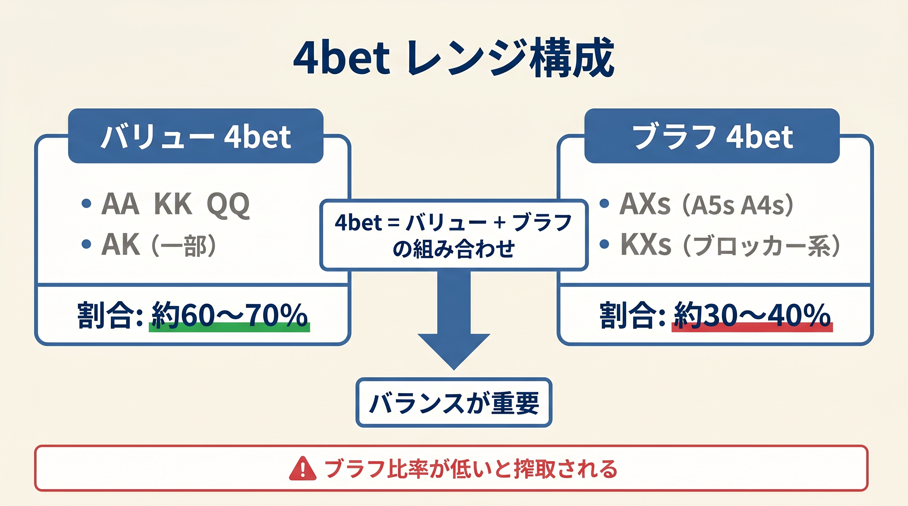
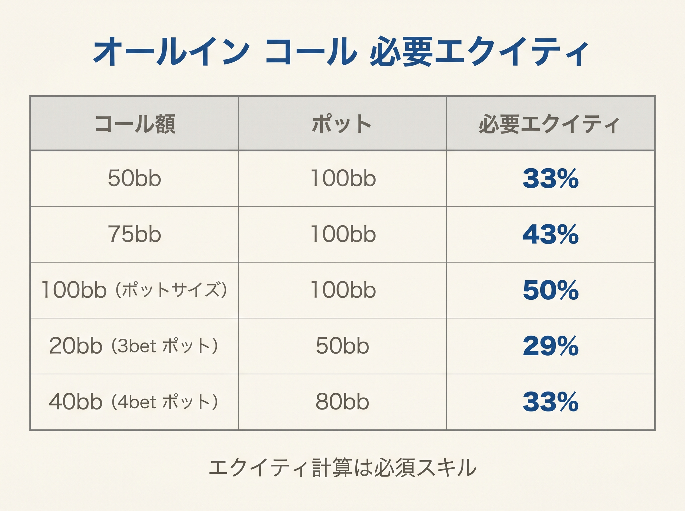

# 第16章　4bet・オールインの簡易EV式（軽め）

<!-- markdownlint-disable MD060 -->

> **本章の目標**: 4ベットとオールインの判断を、**「AA/KK/QQ/AKs の4ハンドで8割正解」**というシンプル原則に集約します。本書で最も「覚えなくていい章」ですが、知らないと大事故に繋がる最低限のルールを扱います。

本章は本書で最も**軽め**の章です。4ベットとオールインは、プリフロップで最も大きなポットがかかるアクションですが、頻度は低く、判断もシンプルに済ませられます。

「AA/KK/QQ/AKs だけで4ベット」「5ベット返しはAAだけ、KK/QQ/AKs等はコール」という2つのルールを覚えれば、**破滅的な事故の大半を避けられます**。

---

<figure><figcaption>4betレンジのバリュー（60-70%）とブラフ（30-40%）の二重構造図</figcaption></figure>

<figure><figcaption>コール額とポット別のオールイン必要エクイティ早見表</figcaption></figure>

## 16-1 4ベットの目的とレンジ

### 4ベット = 3ベットへのリレイズ

順を追うと次のようになります。

1. オープンレイズ（誰かが2.5bb開ける）
2. 3ベット（ほかのプレイヤーが8〜10bbに上げる）
3. **4ベット**（元のオープンレイザーが22〜25bbに再度上げる）
4. 5ベット（通常オールイン）

4ベットは**プレミアムハンドの戦い**です。相手の3ベットに対して「私のほうが強い」と宣言するアクションです。

### 4ベットレンジの構成

GTOの4ベットレンジは大きく2種類のハンドで構成されます。

- **バリュー**：AA、KK、QQ、AKs
- **ブラフ**：A5s、A4s、A3s、A2s（スーテッドエース）

バリューは「3ベットレンジに対してエクイティ優位」のハンド、ブラフは「ブロッカー効果＋4ベット耐性」を持つハンドです。

### バリュー4ベット対象ハンド

Score_R でペアのスコアは `2R + (2 if R≥10 else 0)` で計算されます。ペアスコアが低いため、「Score_Rの単一閾値」ではなく「明示的なハンドリスト」で判断するのが最もシンプルです。

**本書のバリュー4-bet対象：AA / KK / QQ / AKs の4ハンド**

| ハンド | Score_R | 4-bet判定 |
|--------|---------|-----------|
| AA | 30 | 4-bet ✓ |
| KK | 28 | 4-bet ✓ |
| QQ | 26 | 4-bet ✓ |
| AKs | 37 | 4-bet ✓ |
| AKo | 33 | コール / フォールド |
| JJ | 24 | コール / フォールド |
| AQs | 34 | コール / フォールド |
| TT | 22 | コール |

**AA / KK / QQ / AKs** の4ハンドがバリュー4-betの核心です。これだけで全4ベットハンドの **7〜8割**を占めます。AKo / AQs / JJ は混合戦略（上級者向け）なので、初心者は **「AA/KK/QQ/AKs の4ハンドで4-bet、それ以外は3ベットを受けてコールかフォールド」** という明示ルールで十分です。

### 5-bet（vs 4-bet）の判断

相手の 4-bet にさらにプッシュバックする場合、Score_R での判断は次の通りです。

| ハンド | SR | vs 4-bet |
|--------|-----|----------|
| AA | 30 | 5-bet ✓ |
| KK | 28 | コール ✓ |
| QQ | 26 | コール ✓ |
| AKs | 37 | コール ✓ |
| AQs | 34 | コール ✓ |
| KQs | 33 | コール ✓ |
| JJ | 24 | フォールド |
| TT | 22 | フォールド |
| AKo | 33 | フォールド（スーテッドボーナスなし） |
| AJs | 32 | フォールド |

**新ルール：5-bet = AA のみ。コール = KK / QQ / AKs / AQs / KQs。それ以外フォールド。**

AKo(SR=33) はフォールドです。スーテッドボーナスがないため深いオールインポットでのエクイティ実現率が低く、GTO でも vs 4-bet では折ることが多いです。これは旧式（AKo コール推奨）からの重要な変更点です。

### BB が 4-bet 受け / 5-bet を判断するとき

**重要**: BB が 3-bet または squeeze した後に opener が 4-bet で返してきた場合、5-bet/コール/フォールドの判断は **通常 Score_R** で行います。

理由は次の通りです。

1. **5-bet pot は equity 勝負**: ポットが 30bb+ になり、ほぼ all-in 確定の局面。Score_BB が反映するスーテッドやコネクターの「ポストフロップ実現率の良さ」は、5-bet コミット後はほぼ無関係です
2. **GTO 整合**: KQs を例にとると Score_R(KQs)=33 → vs 4-bet でコール、これが標準ルートです
3. **シンプル化**: BB であっても 5-bet 帯（AA のみ純戦略 / KK/QQ/AKs はコール）はほかポジと同じルールで判断できます

BB が 3-bet で AKs を打ち、4-bet 返しを受けたとき、判断は Score_R(AKs)=37 → **コール**（フォールドしない、4-bet を受けてフロップへ）。これが標準ルートです。

---

## 16-2 FE込みEV公式

4ベットブラフの成立を考える場合、次の公式で評価します。

```text
EV = (相手が降りる確率 × ポット) − (コールされた時の損失)
```

- **相手が降りる確率**：Fold Equity（FE）
- **ポット**：4ベットした時点でのポット規模
- **コールされた時の損失**：相手の5ベットレンジvs自分のハンドの差

### ブレイクイーブン降り率

ブラフ4ベットの損益分岐フォールド率は次の式で出ます。

```text
必要フォールド率 = 4ベットで失う額 ÷ (ポット + 4ベットで失う額)
```

例：オープン2.5bb、3ベット10bb、4ベット25bb、相手が5ベットでオールインしたら自分は90bb残を失う。

- 4ベットが降ろされた時の利益：ポット（10 + 0.5 + 1 + 2.5 = 14bb）
- 4ベット後コールされた時の損失：コールされた場合にさらに取りに行く必要があるため、複雑

シンプルに考えると、**ブラフ4ベットは相手の3ベッターの半分以上がフォールドすれば機能**する、と覚えておけば十分です。本書の初心者段階では、この複雑な計算には踏み込みません。

---

## 16-3 4ベットサイズの目安

| 状況 | 推奨サイズ |
|------|----------|
| IP（BTN、CO など） | 3ベットの **約 2.3〜2.5 倍**（絶対値で 23〜25bb） |
| OOP（UTG・HJ など） | 3ベットの **約 2.5〜3 倍**（絶対値で 25〜30bb） |

IPは少し小さく、OOPは少し大きくするのが基本です。

覚え方：

- 3ベット10bbに対して → IPなら **22〜25bb 4ベット**
- 3ベット12bbに対して → OOPなら **30bb 4ベット**

---

## 16-4 「5-bet返しはAAのみ、それ以外コールかフォールド」ルール

### 典型シナリオ

あなたがQQで4ベットしました。相手が5ベットオールインしてきました。さて、どうするか。

### 各ハンドのエクイティ

相手の5ベットオールインレンジ = {AA, KK, QQ+, AK}（標準で全34コンボ。自分がQQなどを保有する場合は手札でブロックされたコンボを差し引く）に対するエクイティ：

| 自分のハンド | エクイティ | アクション |
|------------|----------|-----------|
| AA | 約 80%+ | **5-bet（余裕）** |
| KK | 約 58% | **コール** |
| QQ | 約 **41%** | **コール**（境界） |
| AKs | 約 **46%** | **コール** |
| AQs | 約 43% | **コール** |
| KQs | 約 40% | **コール** |
| JJ | 約 **37%** | **フォールド**（アンダードッグ） |
| TT | 約 28% | **フォールド** |
| AKo | 約 46% | **フォールド**（コールに必要なエクイティはあるが、100BB深でのスーテッドボーナスなしを考慮） |

### ルールの要点

- **AA のみ 5-bet**: 圧倒的有利（80%+）
- **KK / QQ / AKs / AQs / KQs はコール**：ほぼ互角以上
- **JJ 以下、AKo はフォールド**：5-bet ポットでの期待値が低い

「AA だけ 5-bet、KK/QQ/AKs/AQs/KQs はコール、それ以外フォールド」で、判断は完結します。

### QQ の難しさ

QQが境界ハンドなのは、ポーカーでよく言われる通りです。相手の5ベットレンジがタイト（KK+ のみ）ならQQはフォールド、標準レンジ（AA/KK/QQ/AK）なら互角。

ライブの場合は相手の5ベットが特にタイトな傾向があるので、QQのフォールドも選択肢です。オンラインの標準では、QQはコール推奨です。

---

## 16-5 AKの扱い

AKは「プレミアムだがペアではない」微妙な立ち位置のハンドです。

### 4ベット or コール

対3ベットでAKの扱いは次のようになります。

- **AKs（スーテッド、SR=37）**：4ベット対象。IPならコールも有力、OOPならほぼ4ベット
- **AKo（オフスーツ、SR=33）**：コール寄り。スーテッドボーナスがないため、深いポットでの実現率が低い

AKsはコールでフロップを見る価値がある（ナッツフラッシュの可能性）ため、4ベット以外の選択肢もあります。AKoは旧式では「ほぼ常に4ベット」とされていましたが、Score_Rではコール/フォールドの範囲に収まります。

### 対5ベットオールイン

相手の5ベットオールインに対して：

- **AKs（SR=37）**：コール（46%エクイティ、かつスーテッドのポストフロップ実現率を加味）
- **AKo（SR=33）**：フォールド推奨（スーテッドボーナスなし、深いポットでの実現率低）

唯一の例外は、相手が明らかにタイトで「5ベット = KK+ のみ」と読める場合。このときだけAKsもフォールドです。

---

## 16-6 ショートスタック（Push/Fold）はトーナメント編へ

有効スタックが20BB以下になると「レイズ → コール → フロップ」の流れは消え、**プッシュかフォールドの二択**になります。これはトーナメント終盤の典型的な状況で、本書のディープスタック向けスコア式とは別問題です。

詳しい Push/Fold レンジは本シリーズのトーナメント編で扱います。本書（キャッシュ編）はキャッシュゲーム 100BB を前提とし、20BB 以下の局面には立ち入りません。

---

## 16-7 対5ベット戦略

### 5ベットへのコール判断

あなたが4ベットし、相手が5ベットで返してきました。コールすべきか。

### 必要エクイティの計算

```text
必要エクイティ = コール額 ÷ (ポット + コール額)
```

典型的な例：ポット125BB、コール額75BB。

- 必要エクイティ = 75 / 200 = **37.5%**

### コール可能なハンド

相手の5ベットレンジがQQ+ AKの場合（自分の手札で一部のコンボがブロックされる）：

- AA：約80%+ → **コール（5-bet も可）**
- KK：約58% → **コール**
- QQ：約41% → **コール**（ぎりぎり上回る）
- AKs：約46% → **コール**
- AQs：約43% → **コール**
- KQs：約40% → **コール**（境界）
- JJ：約37% → **フォールド**（37.5%にわずかに届かず）
- AQ：約25% → **フォールド**
- AKo：約46% エクイティはあるが **フォールド推奨**（スーテッドボーナスなし）

**「AA は 5-bet、KK/QQ/AKs/AQs/KQs はコール、それ以外フォールド」**のルールが、ここでも一貫して機能します。

---

## 【GTOとのズレ】ブラフ4ベットと AKo の扱い

### GTOはブラフ4ベットを含む

GTOの4ベットレンジには、バリュー（AA〜QQ、AKs）のほかに**ブラフ4ベット**が含まれます。最良のブラフ候補は、AA・AK・KKを同時にブロックできる **A5s、A4s、A3s、A2s** です。

Score_R では A5s=25 / A4s=24 / A3s=23 / A2s=22 となり、バリュー4-bet（AA=30/KK=28/QQ=26）には届かない適切な設計です。ブラフ4-bet候補が本式では別枠として扱われるため、バリューとブラフの混在による誤操作が起きにくくなっています。

### AKo の GTO との差

本書では AKo(SR=33) を vs 4-bet でフォールド推奨としています。しかし GTO ではポジションや相手レンジによっては AKo もコールします。本書の「AKo フォールド」は初心者向けの安全側の判断です。

上級者になったら AKo の vs 4-bet コールも選択肢に加えてください。

### 本書が省略する理由

1. **4ベット頻度は低い**：1回のセッションで数回しか発生しない
2. **実装ミスのコストが大きい**：4ベットを打った後、5ベットされて降りるのはかなり痛い
3. **初心者はバリューだけで十分**：7〜8割のEVはバリュー4ベットでカバーできる

本書の「AA/KK/QQ/AKs だけ4ベット」は、**初心者向けの安全策**として設計されています。

### いつブラフ4ベットを加えるか

本書を卒業して第20章の学習ロードマップに進んだら、次のルールでブラフ4ベットを追加できます。

> **IP限定**：相手が3ベットを打ってきたとき、A5s、A4s、A3s、A2s のいずれかで4ベットを打つ。頻度は全体の 20〜30% 程度に抑える。

ただし、これは**上級者の技**です。本書を読んでいる段階では手を出さないでください。

<figure><figcaption>4ベットレンジ — 紫がバリュー（AA/KK/QQ/AKs）、オレンジがブロッカー付きブラフ（A5s〜A2s）。JJ/TT/AQsはコールでフロップへ</figcaption></figure>

---

## 章のまとめ

- 4ベットは「AA / KK / QQ / AKs の4ハンド」で8割正解
- Score_R でのペアスコア：AA=30、KK=28、QQ=26（旧式より低い値だが判断は変わらず）
- AKs(SR=37) はバリュー4-bet対象、AKo(SR=33) はコール/フォールド範囲
- 本書は**ブラフ4ベットを扱わない**（A5s〜A2s は上級者向け）
- 4ベットサイズ：IP約2.3〜2.5倍、OOP約2.5〜3倍
- **5-bet = AA のみ**（SR=30）。コール = KK(28)/QQ(26)/AKs(37)/AQs(34)/KQs(33)。JJ 以下/AKo はフォールド
- AKo は vs 4-bet でフォールド推奨（スーテッドボーナスなし）← 旧式からの変更点
- 20BB以下のPush/Foldはトーナメント編に譲る
- 対5ベットの必要エクイティは約37.5%、AA/KK/QQ/AKs/AQs/KQs がコール可

---

## ミニクイズ

### 問1

本書が推奨するバリュー4ベットレンジはどれでしょうか。

1. AAのみ
2. AA、KK、QQ、AKs（の4ハンド）
3. すべてのペアとブロードウェイハンド

---

### 問2

あなたはJJで4ベットしました。相手が5ベットオールインしてきました。相手の5ベットレンジをQQ+、AKと推定します。どうしますか。

1. コール（強いハンドだから）
2. フォールド（エクイティ約37% で必要37.5% に届かず）
3. 再レイズ

---

### 問3

Score_R 新式でのAKoの扱いとして、本章で正しく説明されているものはどれでしょうか（複数回答）。

1. AKo は SR=33 で、AKs(SR=37) よりスーテッドボーナス分低い
2. AKo は vs 4-bet でコール推奨（旧式と同じ）
3. AKo は vs 4-bet でフォールド推奨（スーテッドボーナスなし）
4. AKo はバリュー4ベット対象外

---

### 解答

- **問1**：2（AA/KK/QQ/AKs の4ハンド）
- **問2**：2（JJのエクイティは約37%で、必要37.5%をわずかに下回る）
- **問3**：1、3、4（AKoはSR=33で4-bet対象外、vs 4-betでフォールド推奨が正しい）

---

## 出典

- Upswing Poker『4-Bet Strategy』
- GTO Wizard『Preflop All-In Equity Tables』
- GTO Wizard『5-Bet Pot Analysis』
- Upswing Poker『How to Play Ace-King in Cash Games』
