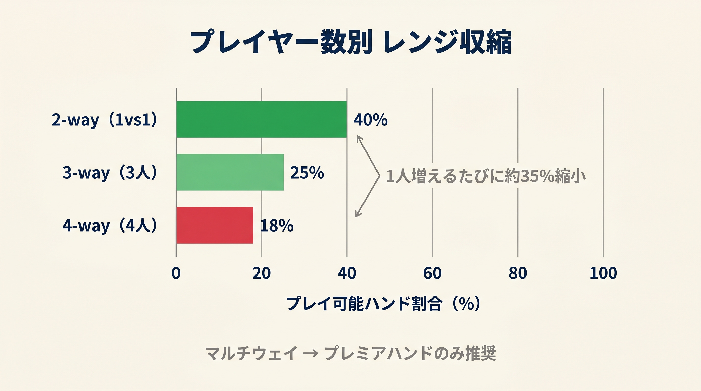

# 第17章　マルチウェイポット：式が通用しないもう1つの場面

<!-- markdownlint-disable MD060 -->
<!-- textlint-disable preset-ja-technical-writing/no-mix-dearu-desumasu -->

> **本章の目標**: 本書のスコア式が**通用しない場面**として**マルチウェイポット**（3人以上）を扱います。同じハンドでも人数が増えると価値が大きく変わるため、調整方針を覚えてください。トーナメント特有のICMやショートスタックのPush/Foldは別の問題として、本シリーズ巻⑥（トーナメント編）に譲ります。

ここまでの章で、本書のスコア式は**2人対戦（ヘッズアップ）のキャッシュゲーム**を前提にしてきました。実戦ではこの前提が崩れる場面のうち、最も頻繁に起きるのがマルチウェイです。

---

<figure><figcaption>2-way/3-way/4-wayのプレイヤー数増加に応じたプレイ可能レンジの収縮を棒グラフで示す</figcaption></figure>

## 17-1 マルチウェイポット（3人以上）

### マルチウェイで起きる変化

2人対戦と3人以上のポットでは、同じハンドの価値が**大きく変わります**。

#### 変化1：勝率の分散

- AKのヘッズアップ勝率：約 **65%**（ランダムハンド相手）
- AKの3人対戦勝率：約 **50%**
- AKの4人対戦勝率：約 **40%**

人数が増えるほど、1人のプレイヤーが**誰かのプレミアムに当たる確率**が上がります。

#### 変化2：オフスーツブロードウェイの劣化

AQo、KQoなどは、ヘッズアップではトップペアを作ればほぼ勝ちです。しかしマルチウェイでは、「トップペア + キッカー負け」「2ペアvsセット」などの事故が頻発します。

AQoはマルチウェイでは**ほぼ機能しない**ハンドです。

#### 変化3：スーテッドコネクターの価値上昇（通説）と実際

「マルチウェイではSC（スーテッドコネクター）が強い」という通説があります。これは**半分正しく、半分間違っています**。

- **正しい側**：人数が増えると「ナッツが必要」になる場面が増え、SCはナッツを作れる
- **間違っている側**：GTOソルバーでは、マルチウェイでも多くのSCをフォールド推奨にする

正確には、「マルチウェイでのSCはほかのハンドより**悪化が小さい**」程度です。過信は禁物です。

#### 変化4：小〜中ポケットペアが本当に強い

マルチウェイで最も価値を上げるのは、**小〜中ペア（22〜88）**です。理由は：

- セット完成率12% は変わらない
- セット完成時に複数人から追加コールが期待できる
- セット以外では簡単にフォールドできる（判断が単純）

セットマイニング（第11章）はマルチウェイで最も威力を発揮します。

### マルチウェイでの戦略調整

本書の式をマルチウェイに使うときは、次のように調整してください。

| ハンドタイプ | マルチウェイでの調整 |
|------------|------------------|
| オフスーツブロードウェイ（AQo、KQo） | **スコアを −2**（大幅に下げる） |
| スーテッドブロードウェイ（AJs、KQs） | スコア ± 0 |
| スーテッドコネクター（76s、87s） | スコア ± 0 |
| 小〜中ペア（22〜88） | **スコアを +2**（より広く参加） |

### スクイーズという選択肢

マルチウェイになりそうな場面では、「**スクイーズ**」（コーラーがいる状況での3ベット）で**フィールドを2人に絞る**のが有効です。

- オープンレイザーが2.5bb → コーラー1人が2.5bb → あなたがBTNで10bb 3ベット
- 目的：両者を降ろすか、1対1（ヘッズアップ）に持ち込む

スクイーズはバリュー中心のリニアレンジで打ちます。AQoのようなオフスーツブロードウェイは、マルチウェイでコールするより**スクイーズしてヘッズアップに持ち込む**ほうが優れます。

#### スクイーズ閾値の計算式

コーラーが増えるほどポットに**デッドマネー**（引き戻せない既積み金）が積まれ、スクイーズが採算に合いやすくなります。本書では**通常の T_3bet に +3 (コーラー1人ぶん)** を加えるシンプルな調整で扱います:

```text
T_squeeze = T_3bet (通常 vs オープナー) + 3 × コール数
```

通常の T_3bet 表 (2.2 節) を使い、コーラー数だけ閾値を上げる発想です。

| 自分視点 | 起点 T_3bet | +1コーラー | +2コーラー | 使うスコア |
|---|---|---|---|---|
| BTN vs UTG | 32 | 35 | 38 | 通常 Score |
| BTN vs HJ  | 32 | 35 | 38 | 通常 Score |
| BTN vs CO  | 24 | 27 | 30 | 通常 Score |
| SB vs UTG  | 30 | 33 | 36 | 通常 Score |
| SB vs BTN  | 24 | 27 | 30 | 通常 Score |
| **BB** vs UTG | 34 | 37 | 40 | **Score_BB** |
| **BB** vs HJ  | 32 | 35 | 38 | **Score_BB** |
| **BB** vs CO  | 28 | 31 | 34 | **Score_BB** |
| **BB** vs BTN | 28 | 31 | 34 | **Score_BB** |

**なぜ +3 なのか**: コーラー 1 人が約 2.5bb をポットに置いていきます。スクイーズが全員フォールドで成功すると、この額がそのままあなたの利益になりますが、同時に**スクイーズサイズも大きくする必要がある**（通常 3-bet の 1.5〜2 倍）ためリスクも増えます。差し引きで「Score 3 ぶんタイトに」が経験則的にちょうど良い調整。

**BB は Score_BB を使う**: BB squeeze は構造的に通常の BB 3-bet の延長なので、suited+6 / conn+4 強化版の Score_BB と BB defense T_3bet 表を起点にします。

**計算例1**（UTG オープン + CO コール、あなたが BTN からスクイーズ検討）

T_squeeze = 32 + 3 = **35**（通常 Score 使用）

- AA (Score=41) → スクイーズ ✓
- KK (38) → スクイーズ ✓
- AKs (35) → 閾値ぴったり → スクイーズ
- AKo (32) → 閾値未満 → コール
- JJ (32) → コール
- A5s (25) → フォールド

**計算例2**（CO オープン + BTN コール + SB コール、あなたが BB からスクイーズ検討）

T_squeeze (BB vs CO) = 28 + 3×2 = **34**（Score_BB 使用、BB の T_3bet=28 を起点）

- QQ (Score_BB=34) → スクイーズ ✓（境界ぴったり）
- AKs (Score_BB=41) → スクイーズ ✓
- KQs (Score_BB=37) → スクイーズ ✓
- AKo (Score_BB=35) → スクイーズ ✓
- 76s (Score_BB=23) → 例外2 (suited 差≤4) で CALL（squeeze はしない）

コーラーが 2 人いる状況では閾値が大幅に上がり、**強ハンドのみのナローなスクイーズレンジ**になります。広めに 3-bet するなら通常 3-bet の表を使うべき局面です。

コーラーが2人いる状況では閾値が大幅に上がり、強ハンドのみの**ナローなスクイーズレンジ**になります。広めに 3-bet するなら通常 3-bet で構わない局面です。

---

## 17-2 トーナメント・ショートスタックは巻⑥へ

トーナメント特有の状況、すなわち**ICM**（賞金構造によるチップ価値の歪み）や**Push/Fold**（15BB以下のオールイン or フォールド戦略）は、本書のスコア式とは別の問題系です。チップ獲得期待値（ChipEV）ではなく**賞金期待値**を最大化する必要があり、バブル近辺ではミドルスタックが最も降りるべきといった反直感的な結論も出てきます。

これらは本シリーズ**巻⑥（トーナメント編）**で正面から扱います。本書（巻①）はキャッシュゲーム100BBに集中し、ICMやPush/Foldには立ち入りません。

---

## 17-3 本書の式が通用する範囲の境界線

改めて、本書の式が**有効な範囲**と**通用しない範囲**を整理します。

### 有効な範囲

- **ヘッズアップポット**（2人対戦）
- **キャッシュゲーム全般**（ChipEVがそのまま金額）
- **100BB前後のディープスタック**

### 注意が必要な範囲

- **3way ポット**：ハンド選択を少し修正すれば使える
- **マルチウェイでのオフスーツブロードウェイ**：スコア −2程度の調整

### 通用しない範囲（巻⑥に譲る）

- **4way 以上のマルチウェイ**：本書の前提が完全に崩れる
- **トーナメント全般**：ICM、バブル、Push/Fold（15BB以下）、サテライト

これらの場面では、本書を離れて巻⑥または専用の学習リソースに進んでください。

---

## 【GTOとのズレ】本書の境界はGTO的にも正当

### なぜ「式が通用しない場面」があるか

これまでの章（特に第8章、第13章）では、本書の式がGTOの近似であることを強調してきました。本章で扱う**マルチウェイ**は、この近似の**適用範囲外**です。

近似の範囲外で使うと、精度が大きく落ちます。これは式の欠陥ではなく、**そもそも別の問題を解くべき**、という話です。

### 適用範囲を明示する誠実さ

本書の立場は次の通りです。

> **本書の式は、ヘッズアップ・キャッシュゲーム・100BBスタックで最大の力を発揮する。これ以外の場面では、別の戦略ツールに移行してほしい。**

この境界を明示するのは、**誠実さの問題**です。どんな式も万能ではなく、適用範囲を知っていることがプロの必要条件です。

### 本書を卒業した後のルート

- **マルチウェイ深掘り**：GTO Wizardのマルチウェイ機能、Upswing Pokerのマルチウェイ記事
- **トーナメント全般**：本シリーズ巻⑥（トーナメント編）

---

## 章のまとめ

- マルチウェイポットではAKの勝率が65% → 40% まで下がる
- オフスーツブロードウェイ（AQo、KQo）はマルチウェイで大きく価値を落とす
- 小〜中ペア（22〜88）はマルチウェイで最も価値を上げる
- マルチウェイになる場面ではスクイーズでヘッズアップに持ち込むのが有効
- 本書の式はヘッズアップ・キャッシュ・100BBで最大の力を発揮する
- 4way以上のマルチウェイは本書の範囲外（適用範囲の問題）
- ICM・Push/Foldなどトーナメント特有の話題は巻⑥（トーナメント編）に譲る

---

## ミニクイズ

### 問1

マルチウェイポットで最も価値を**上げる**ハンドタイプはどれでしょうか。

1. オフスーツブロードウェイ（AQo）
2. スーテッドコネクター（76s）
3. 小〜中ペア（22〜88）

---

### 問2

本書の式が通用する範囲として、本章で挙げられたものはどれでしょうか（複数回答）。

1. ヘッズアップポット
2. 4wayマルチウェイ
3. 100BBのキャッシュゲーム
4. MTTバブル近辺

---

### 問3

マルチウェイになりそうな状況で、AQoを持っているときに本章が推奨する選択肢はどれでしょうか。

1. そのままコールしてマルチウェイで戦う
2. スクイーズ（3ベット）でヘッズアップに持ち込む
3. 即フォールド

---

### 解答

- **問1**：3（小〜中ペアはセット価値が増幅）
- **問2**：1と3（ヘッズアップとキャッシュゲーム）
- **問3**：2（オフスーツブロードウェイはマルチウェイで弱いので、スクイーズでヘッズアップに持ち込むのが優れる）

---

## 出典

- GTO Wizard『10 Tips for Multiway Pots in Poker』
- Upswing Poker『The Ultimate Guide to Preflop Multiway Pots (And Squeezing)』
- GTO Wizard『How To Construct a Squeezing Range』
