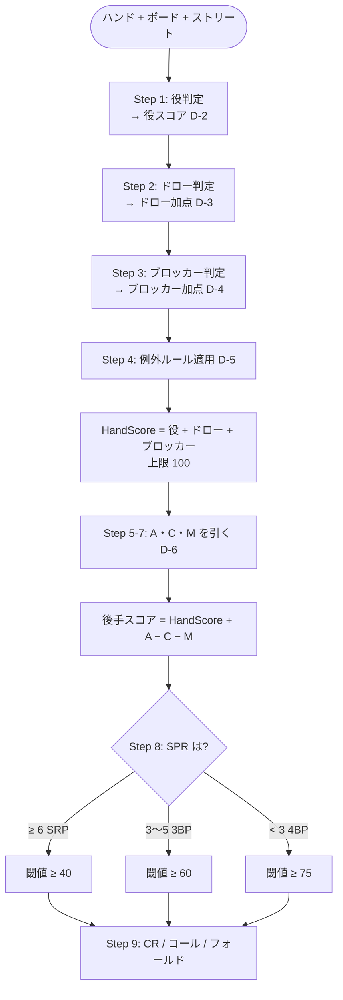
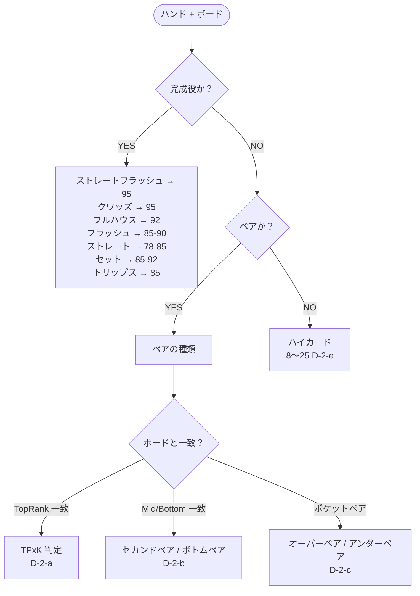
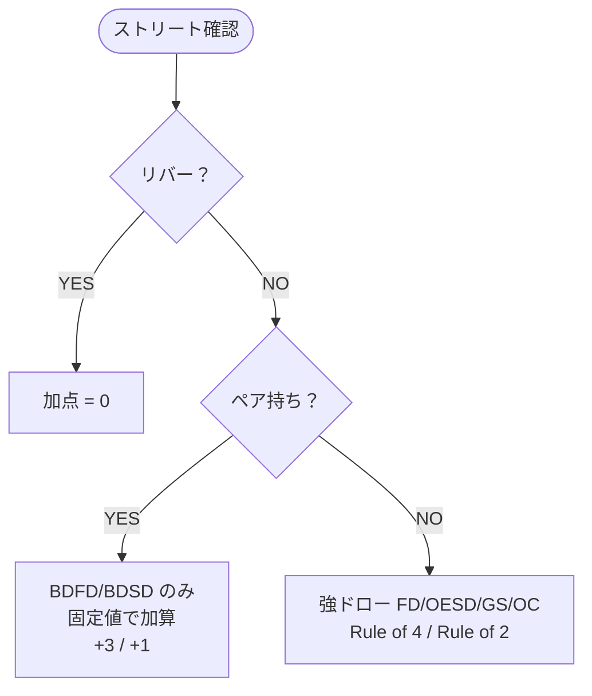
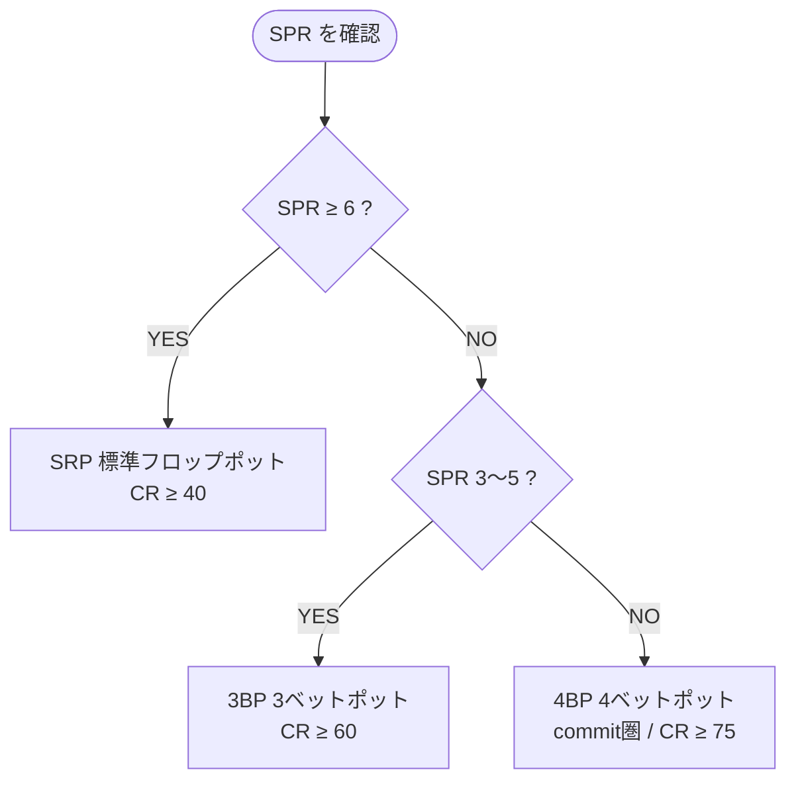

# 付録D　判定フロー完全図表

<!-- markdownlint-disable MD026 MD033 MD036 MD040 MD060 -->

> **この付録の目的**: HandScore 計算から最終アクションまでの**全判定ステップを 1 か所に集約**します。実戦中に「どの値を使うか」を引くチートシート、または学習中に「自分の暗算がどこで詰まるか」を見つける道具として使ってください。

---

## D-1 全体フロー（30秒で判定する）



---

## D-2 Step 1: 役スコアの判定フロー

ハンド + ボードから「役」を 1 つ決め、対応するスコアを引きます。



### D-2-a トップペア (TPxK) の分岐

ボード最高ランクと自分のホール 1 枚が一致 → トップペア。残りのホールカード (キッカー) で 4 分類:

```text
キッカーランク → スコア
  A or K        → TPTK = 70
  Q             → TPGK = 62
  8〜J          → TPMK = 50
  7 以下        → TPWK = 45
```

### D-2-b セカンドペア / ボトムペア

ボード 2 番目のランクと一致 → セカンドペア。最低ランクと一致 → ボトムペア。

```text
セカンドペア + キッカー
  Q+ キッカー   → second_pair_strong = 42
  8〜J キッカー → second_pair_mid    = 35
  7 以下キッカー → second_pair_weak   = 32

ボトムペア (キッカー問わず)  → 32
```

### D-2-c オーバーペア / アンダーペア

ポケットペアがボードのどのカードとも刺さらない場合:

```text
ポケットペア > ボード最高 → オーバーペア
  AA / KK / QQ → overpair_high = 78
  JJ / TT      → overpair_mid  = 72
  99 以下      → overpair_low  = 68

ポケットペア < ボード最高 → アンダーペア
  KK or QQ (ボード Aあり)  → underpair_high = 45
  JJ / TT                  → underpair_mid  = 40
  99 以下                  → underpair_low  = 35
```

### D-2-d 2 ペアの分類

ホール 2 枚がそれぞれボードと一致:

```text
ボード最高 + ボード2番目 → two_pair_top      = 78
ボード最高 + ボード3番目 → two_pair_top_mid  = 75
ボード最高 + (ボード最低)→ two_pair_top_bot  = 72
それ以外 (split)         → two_pair_split    = 68
```

### D-2-e ハイカード（役なし）

```text
A ハイ (ホールに A あり)  → 25
K ハイ                  → 20
Q ハイ                  → 15
J ハイ以下              → 10
完全空振り (BD なし)    → 8
```

---

## D-3 Step 2: ドロー加点の判定フロー

役スコア決定後、ドロー(完成可能な手)があるか判定します。



### D-3-a フロップ・ターンの基本ドロー (役なし時)

| ドロー種別 | アウツ | フロップ加点 (× 4) | ターン加点 (× 2) |
|---|---:|---:|---:|
| フラッシュドロー (FD) | 9 | +36 | +18 |
| OESD | 8 | +32 | +16 |
| GS / インサイド | 4 | +16 | +8 |
| 2 オーバーカード | 6 | +24 | +12 |
| 3 オーバーカード | 3 (3 outs相当) | +12 | +6 |

### D-3-b コンボドロー (重複アウツ控除済み)

| コンボ | アウツ (effective) | フロップ加点 | ターン加点 |
|---|---:|---:|---:|
| FD + OESD | 13 (15-2 重複) | +52 | +26 |
| FD + GS | 12 (9+4-1 重複) | +48 | +24 |
| BDFD + OESD (フロップのみ) | 11 effective | +44 | ─ |
| BDFD + GS (フロップのみ) | 11 effective | +44 | ─ |

### D-3-c バックドアと固定値

```text
バックドアフラッシュ (BDFD): +5 (固定)
バックドアストレート (BDSD): +2 (固定)
ダブルバックドア (BDFD + BDSD): +6
```

ペア + バックドア の特別扱い (Rule of 4 適用なし):

```text
ペア + BDFD のみ: +3 (固定)
ペア + BDSD のみ: +1 (固定)
ペア + BDFD + BDSD: +4
```

### D-3-d 上限・例外

```text
フロップ加点上限: 60 (15+ outs はすべて 60 にクランプ)
ターン加点上限:   30 (15+ outs はすべて 30 にクランプ)
リバー加点:       0 (ドロー完成 / 失敗確定)

モノトーン板 / 3-flush 板 + 役なし FD: × 0.5
  例: モノトーン K♠Q♠7♠ + A♠2♥ → +36 → +18

ペア持ち + オーバーカード: 加点ゼロ
  例: AKo on K72r → TPTK 70、A の OC 加点 0
```

---

## D-4 Step 3: ブロッカー加点

相手のナッツや強ハンドをブロックするカードを保有しているとき:

| ブロッカー種別 | 加点 | 例 |
|---|---:|---|
| ナッツブロッカー | +5 | ナッツフラッシュ A、ナッツストレート上端 |
| 上位セット / ストレートブロッカー | +3 | ペアボードでのトップカード保有 |
| バリューブロッカー | +2 | 中位、相手の TP+ を削減 |
| バックドアブロッカー | +1 | BDFD のスートで相手 FD を削る |

**ルール**: 重複加算なし、最大値のみ採用。

---

## D-5 Step 4: 例外ルール一覧

```text
1. HandScore 上限 100
   役 + ドロー + ブロッカー > 100 のときクランプ
   例: TPTK 70 + FD+OESD 52 = 122 → 100

2. フロップドロー上限 60、ターン上限 30 (D-3-d)

3. モノトーン / 3-flush 板の役なし FD は × 0.5 (D-3-d)

4. ペア + OC の OC 加点はゼロ (D-3-d)

5. ペア + BDFD = +3 / ペア + BDSD = +1 (固定値、D-3-c)

6. straight_flush の判定は近似 (フラッシュ + ストレートで SF と仮判定)
```

---

## D-6 Step 5-7: 後手スコアへの変換係数

```text
後手スコア = HandScore + A − C − M
```

| 係数 | カテゴリ | 値 |
|---|---|---:|
| **A** (ボード補正) | ドライ | +12 |
| | セミウェット | +6 |
| | ウェット | 0 |
| **C** (ベット負担) | 33% pot | 12 |
| | 50% pot | 17 |
| | 75% pot | 22 |
| | 100% pot | 25 |
| | 150% pot (オーバーベット) | 30 |
| **M** (マルチウェイ) | HU (2人) | 0 |
| | 3-way | 12 |
| | 4-way 以上 | 22 |

**暗算メモ**: C ≒ α × 50 (α 値とリバー配分の式に直結)。

---

## D-7 Step 8-9: SPR 別の判定閾値



| SPR 帯域 | CR 閾値 | コール下限 | フォールド | 備考 |
|---|---:|---:|---|---|
| ≥ 6 (SRP) | ≥ 40 | ≥ 20 | < 20 | 標準 |
| 3〜5 (3BP) | ≥ 60 | ≥ 20 | < 20 | CR は Set+ / 強2pair / モンスタードロー |
| < 3 (4BP) | ≥ 75 | ≥ 30 | < 30 | ほぼ commit、コール域も狭く |

---

## D-8 計算例 3 つ

### 例1: TPTK on ドライ板、HU、50% ベット (SRP)

```text
ハンド: A♣K♦   ボード: K♠7♦2♣ (ドライ)
SPR ≈ 17 (SRP)、HU、相手 50% ベット

Step 1: 役 → TPTK (Aキッカー) = 70
Step 2: ドロー → なし = 0
Step 3: ブロッカー → なし = 0
Step 4: HandScore = 70 + 0 + 0 = 70

Step 5: A = 12 (ドライ)
Step 6: C = 17 (50% pot)
Step 7: M = 0 (HU)
後手スコア = 70 + 12 − 17 − 0 = 65

Step 8: SPR 17 → SRP、閾値 ≥ 40
Step 9: 65 ≥ 40 → CR 検討
```

### 例2: FD単独 on ウェット板、HU、75% ベット (SRP)

```text
ハンド: A♥6♥   ボード: K♥7♣2♥ (ウェット)
SPR ≈ 17、HU、相手 75% ベット

Step 1: 役 → A ハイ = 25
Step 2: ドロー → FD (9 outs × 4) = 36
Step 3: ブロッカー → ナッツフラッシュ A ブロッカー = +5
Step 4: HandScore = 25 + 36 + 5 = 66

Step 5: A = 0 (ウェット)
Step 6: C = 22 (75% pot)
Step 7: M = 0 (HU)
後手スコア = 66 + 0 − 22 − 0 = 44

Step 8: SPR 17 → SRP、閾値 ≥ 40
Step 9: 44 ≥ 40 → CR 検討 (セミブラフ CR)
```

### 例3: TPTK on ドライ板、3BP、33% ベット

```text
ハンド: A♣K♦   ボード: K♠7♦2♣ (ドライ)
SPR ≈ 4.8 (3BP)、HU、相手 33% ベット

Step 1: 役 → TPTK = 70
Step 2: ドロー → 0
Step 3: ブロッカー → 0
Step 4: HandScore = 70

Step 5: A = 12 (ドライ)
Step 6: C = 12 (33% pot)
Step 7: M = 0 (HU)
後手スコア = 70 + 12 − 12 − 0 = 70

Step 8: SPR 4.8 → 3BP、閾値 ≥ 60
Step 9: 70 ≥ 60 → CR 検討
   ただし実戦は GTO 混合戦略 (CR 34% / call 66%)。
   境界ハンドは「コール優先」が安全。
```

---

## D-9 簡易判定 (3 分類で 7 割をカバー)

詳細式が苦手な初心者向け。HandScore 暗算なしで「強・中・弱」だけ判定:

| 強度 | HS 目安 | 主な対象 | 行動方針 |
|---|---|---|---|
| **強** | ≥ 65 | セット以上 / 2ペア / TPTK / オーバーペア(高) / モンスタードロー | バリューベット・コミット方向 |
| **中** | 35〜64 | TPGK / TPMK / TPWK上端 / アンダーペア / FD単独 / OESD単独 | コール・SDV保護 |
| **弱** | < 35 | ボトムペア / セカンドペア弱キッカー / ハイカード / BDFDのみ | フォールド・ブラフキャッチ |

3 分類で 7 割の判断が決まります。残り 3 割（境界ハンド）にのみ精密化が必要。

---

## D-10 全式マップ

参考までに、本書で扱う全暗算式の対応表:

| 場面 | 式 | 出力 | 詳細 |
|---|---|---|---|
| プリフロップ | Open Score | オープン / フォールド | 巻① |
| プリフロップ 3bet | プリフロップスコア | 3bet / コール / フォールド | 巻① |
| フロップ攻撃 | Board Score B × T1/T2/T3 ティア | CBet% / チェック | 巻② Ch3-5 |
| フロップ防御 | OOP フォールド閾値（HS<15/35） | CR / コール / フォールド | 巻② Ch6 |
| ターン攻撃 | バレルスコア | バレル / チェックバック | 巻④ Ch8 |
| ターン防御 | 後手スコア (本付録) | CR / コール / フォールド | 巻④ Ch10 |
| リバー攻撃 | α 式 + V:B 比 | バリュー / ブラフ / チェック | 巻④ Ch9 |
| リバー防御 | 後手スコア (本付録) | CR / コール / フォールド | 巻④ Ch11 |
| トーナメント補正 | ICM 補正 (p × 20) | 必要 equity 上昇 | 巻⑥ Ch19 |

---

> **本付録の使い方**
>
> 1. 実戦中に「この手はいくつ?」と迷ったとき、D-2 の役判定を引く
> 2. ドロー加点が分からないとき、D-3 を引く
> 3. 後手スコアの結果が境界 (40 / 60 / 75 付近) のとき、D-7 で SPR を確認
> 4. 初心者は D-9 の 3 分類だけ覚えれば 7 割は判定できる
