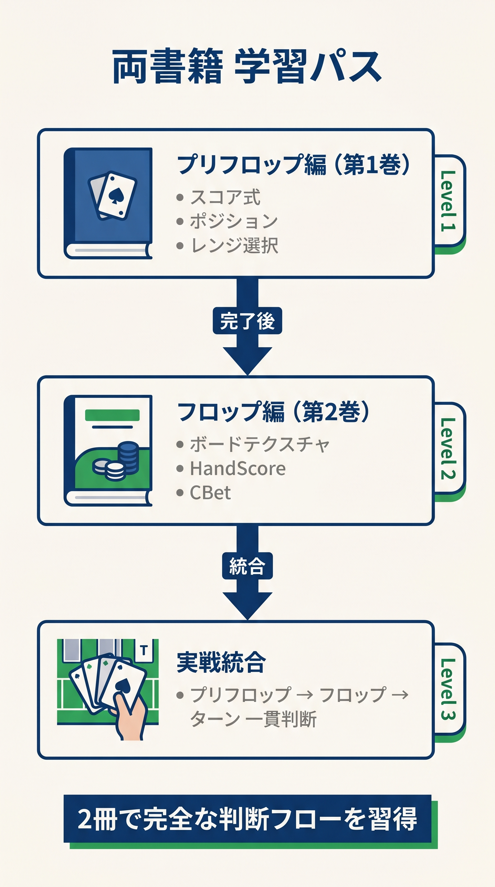

# はじめに　本書の歩き方

<!-- markdownlint-disable MD026 MD033 MD036 MD040 MD060 -->
<!-- textlint-disable preset-ja-technical-writing/no-exclamation-question-mark -->
<!-- textlint-disable preset-ja-technical-writing/no-mix-dearu-desumasu -->
<!-- textlint-disable jtf-style/1.1.3.箇条書き -->

> 本書は「暗算で回せるフロップ判断」の到達点までを一冊にまとめました。ただしすべてを読まなくても、あなたの段階に合った章から始められます。

---

<figure><figcaption>プリフロップ編→フロップ編→実戦統合の3段階学習パス図</figcaption></figure>

## 学習パス診断

以下5問に答えてください。あなたに最適なエントリーポイントを診断します。

### Q1. 本書の前作『プリフロップは計算で勝つ』の基本スコア式（`Score = H + L + ボーナス − ペナルティ`）を暗算できますか？

- はい → Q2へ
- いいえ → **まず前作を読んでください**。本書は前作の知識を前提にしています。

### Q2. BoardScore や HandScore という用語を聞いたことがありますか？

- はい → Q3へ
- いいえ → **Level 1 から開始**（第1章〜第9章）

### Q3. CBet 判定を 4 段階（75%/33%/チェック/フォールド準備）で即答できますか？

- はい → Q4へ
- いいえ → **Level 1 の復習から**（第9章をもう一度）

### Q4. 同じハンドで、ボードやスートによって行動を混合することの意義を理解していますか？

- はい → Q5へ
- いいえ → **Level 2 から開始**（第27章「固定を揺らす」）

### Q5. GTO Wizard 等のソルバーで自分のプレイを週1回以上復習していますか？

- はい → **Level 3 のみ**で十分（第28章「上級統合式」）
- いいえ → **Level 2 + Level 3 の両方**を学習

---

## Level 別の対象読者と到達目標

### Level 1：基本式（第1章〜第26章）

**対象**：前作を読了、フロップで「何をすべきか分からない」が多い人。

**到達目標**：

- BoardScore・HandScoreを正しく計算できる
- 代表的なフロップでCBet判定ができる
- 約100NL〜200NLまでのオンラインで勝率がプラスになる

**想定期間**：平日30分 × 4週間（合計10時間程度）

### Level 2：中級（第27章）

**対象**：Level 1をマスター、「境界ハンドで判断に迷う」が残る人。

**到達目標**：

- R1〜R6を実戦中に適用できる
- 同じハンドで状況により行動を混合できる
- BBディフェンスを式で決定できる
- 約500NLまでで搾取されにくいプレイができる

**想定期間**：Level 1の後、平日30分 × 2週間（合計7時間程度）

### Level 3：上級（第28章）

**対象**：Level 2をマスター、ソルバーを併用し上を目指す人。

**到達目標**：

- マルチウェイ・SPR・相手タイプ・3betポットを式に組み込める
- 一連の判断を30秒以内に実行できる
- 約1kNL以上で通用する基盤を持つ

**想定期間**：Level 2の後、平日30分 × 4週間（合計10時間程度）

---

## 章の使い分けガイド

### 理論から入る読み方（推奨、順番通り）

第1章 → 第2章（用語）→ 第5〜9章（三式）→ 第10〜16章（応用）→ 第17〜20章（状況別）→ 第21〜26章（発展）→ 第27章 → 第28章。

### 実戦重視の読み方（短縮）

第2章（用語）→ 第5章（BoardScore）→ 第8〜9章（HandScore・統合式）→ 第24章（チートシート）→ 第27章 → 第28章。

### スポット別の読み方（問題解決型）

- CBetすべきか迷う → 第9章
- サイズを決められない → 第10章・第27-5節
- チェックレイズの判断 → 第14章・第27-6節
- ドンクベット対応 → 第15章
- マルチウェイ → 第18章・第28章M項
- 3betポット → 第19章・第28章3bP項
- 相手が特殊 → 第20章・第28章E項

---

## 本書で扱わない前提

以下は本書の範囲外です。別書籍や別ツールを推奨します。

| トピック | 推奨リソース |
|---------|-----------|
| ターン・リバー戦略 | 本書では扱わず。GTO Wizard + *Modern Poker Theory* (Acevedo) |
| トーナメント戦略 / ICM | 本書では扱わず。姉妹編（予定）または *Mastering Small Stakes No-Limit Hold'em* |
| メンタル / ティルト管理 | 前作『プリフロップは計算で勝つ』の該当章 |
| バンクロール管理 | 別書籍 |
| ソルバー操作 | 第 26 章で概説、詳細は GTO Wizard 公式ドキュメント |

---

## 本書の構成（目次プレビュー）

### 第I部　フロップの基礎（第1〜6章）

フロップのEV構造、用語の整理、プリフロップから引き継ぐレンジ、初級者のミス、BoardScoreの計算、アウツとエクイティを扱います。

### 第II部　CBet の判断（第7〜11章）

CBetの目的、HandScoreの計算、統合式（基本式）の全体像、サイズ選択、GTOとの乖離点を扱います。

### 第III部　CBet を受ける側（第12〜16章）

ポットオッズ、コール・フォールドの境界、チェックレイズ、ドンクベット対応を扱います。

### 第IV部　コンテクスト調整（第17〜20章）

SPR、マルチウェイ、3betポット、相手タイプ別の調整を扱います。

### 第V部　応用と実戦定着（第21〜23章）

動的レンジ推定、レンジアドバンテージ、実戦ドリルを扱います。

### 第VI部　次への橋渡し（第24〜26章）

チートシート、ターン・リバーへのブリッジ、GTOロードマップを扱います。

### 第VII部　上級統合（第27〜28章）

R1〜R6による混合戦略、M/SPR/E/3bPを含む完全統合式を扱います。

### 付録（第29章）

ボードテクスチャ早見表、169ハンド判断表、Q&A、用語集、数式まとめ、参考文献などを収録しています。
