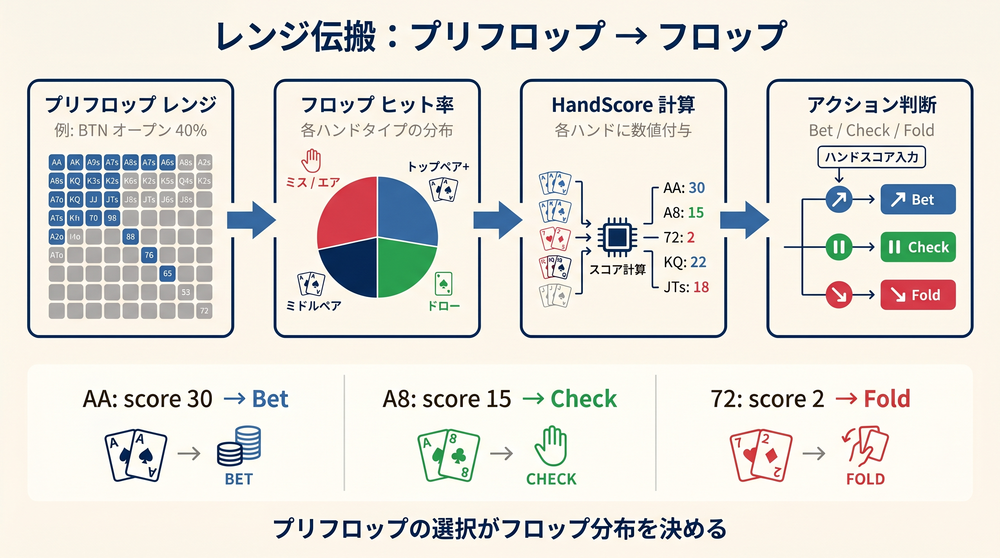
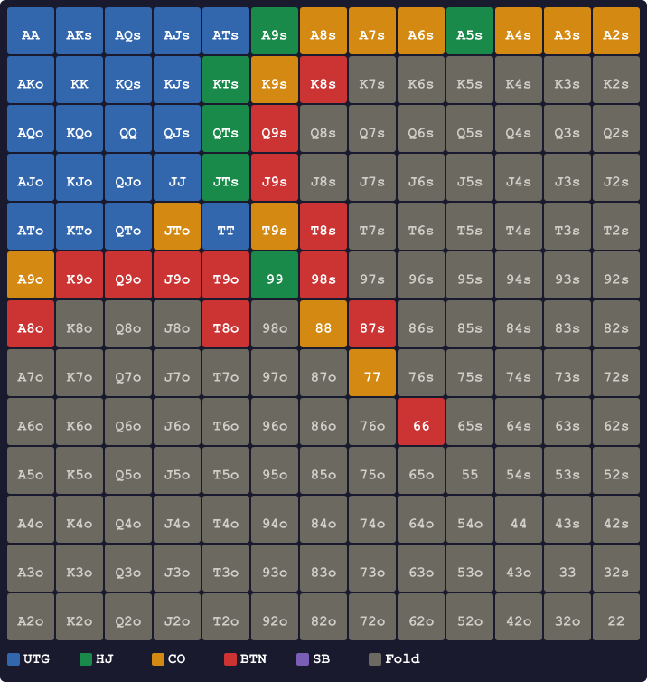
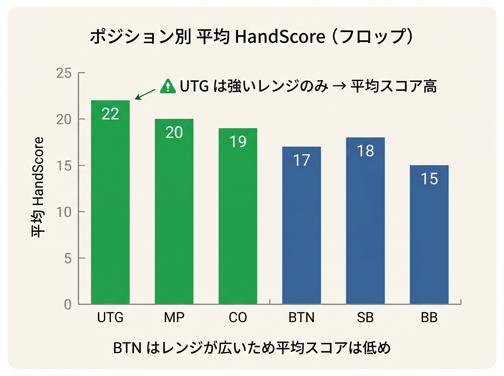

# 第2章　プリフロップから受け継ぐレンジ

<!-- markdownlint-disable MD033 MD040 MD056 MD060 -->
<!-- textlint-disable preset-ja-technical-writing/no-exclamation-question-mark -->
<!-- textlint-disable preset-ja-technical-writing/no-mix-dearu-desumasu -->

> プリフロップで決まったレンジの形は、フロップの最後のカードが開かれる瞬間まで変わらない。相手の手を読むとは、フロップから始まるのではなく、プリフロップのアクションをさかのぼることから始まる。

## はじめに：フロップで「相手の手」を読むために

フロップを3枚見たとき、多くの人はまず「自分の手がどれくらい強いか」を考えます。しかし勝ち組の思考は違います。「相手は何を持ってフロップを迎えたか」を同時に推定しています。

相手のフロップでの手の強さを推定するには、プリフロップのアクションが唯一の手がかりです。「UTGがオープンした」「BBがコールした」「COが3ベットした」——これらの情報から、相手がフロップに持ち込むレンジ（ハンドの集合）がほぼ確定します。

本章では、前作でマスターした閾値（スコア式）を「相手のレンジ推定ツール」として再利用する方法を解説します。プリフロップのアクション別に相手のレンジを把握することが、フロップでの正確な判断の土台となります。

---

## 2-1　ポジション別オープンレンジ——前作の閾値から逆算する

<figure><figcaption>プリフロップレンジがフロップのHandScore計算→アクション判断へ伝搬するフロー図</figcaption></figure>

6-max NLキャッシュゲーム、100BBスタックでの標準的なオープンレンジを確認します。これはGTOソルバーが示す解であり、前作の「スコア式で開けるハンドの集合」と概ね一致します（スコア式はGTOより若干タイト、UTGで約±1%の差）。

### UTG（17〜18%）——後ろに5人いる最タイトポジション

UTGはテーブルで最初にアクションする不利なポジションです。後ろに5人いるため、3ベットやコールを受けやすく、レンジを絞る必要があります。

```
ペア:     TT+（99以下は混合頻度）
スーテッド: ATs+, A5s, KTs+, QTs+, JTs, T9s, 98s
オフスート: AJo+, KQo
```

UTGのレンジは**リニア（強いハンドだけで構成）**です。AA、KK、QQといったプレミアムペアから、スーテッドコネクター（JTs、T9s）まで、平均的に強いハンドが並びます。フロップで相手がUTGのオープンレイザーだとわかれば、そのレンジは非常に強いと推定できます。

### MP/HJ（21〜22%）——少し広げたリニアレンジ

```
ペア:     55+
スーテッド: A2s+, K6s+, Q9s+, J9s+, T9s, 98s, 87s, 76s
オフスート: ATo+, KTo+, QTo+
```

UTGより後ろにいる人数が減るため、ミドルペア（55〜99）やスーテッドコネクターを広げます。

### CO（27〜28%）——スーテッド帯を大きく拡張

```
ペア:     33+
スーテッド: A2s+, K3s+, Q6s+, J8s+, T7s+, 97s+, 87s, 76s
オフスート: A8o+, KTo+, QTo+, JTo
```

COはボタンの直前です。フロップ以降もBTNとSB/BBの3者のうち2者に対してポジションを持ちます。レンジは約28%まで広がり、弱めのスーテッドAx（A2s〜A5s）やスーテッドコネクターが加わります。

### BTN（43〜45%）——最もワイドなレンジ

```
ペア:     33+（22は混合頻度）
スーテッド: A2s+, K2s+, Q3s+, J4s+, T6s+, 96s+, 85s+, 75s+, 64s+, 53s+
オフスート: A4o+, K8o+, Q9o+, J9o+, T8o+, 98o
```

ボタンはフロップ以降で常に最後に行動できる最有利ポジションです。約44%という広いレンジでオープンし、スーテッドコネクターをほぼすべてカバーします。BTNがオープンレイザーであれば、フロップで「弱めのハンドも多く含む広いレンジ」を持っていると推定できます。

### SB（39〜47%）——広いが常に OOP

SBはレーキ設定やゲーム環境によってレンジが変動します。GTOソルバーではBTNと同等かやや広いレンジでオープンしますが、フロップ以降は常にOOP（相手の後ろから行動）という不利を抱えます。

### ポジション別 RFI サマリー

| ポジション | RFI% | レンジの性格 | 平均 HandScore の目安 |
|-----------|------|------------|---------------------|
| UTG | 17〜18% | リニア、最強ハンドのみ | 約 20 |
| MP/HJ | 21〜22% | リニア、Broadway＋中ペア | 約 17 |
| CO | 27〜28% | リニア、スーテッド帯を拡張 | 約 14 |
| BTN | 43〜45% | ほぼ全スーテッド＋広いオフスート | 約 10 |
| SB | 39〜47% | BTN 同等、OOP のため変動あり | 約 13 |

UTGの平均HandScoreが高いのは、スーテッドコネクターや弱いペアがほぼ入っておらず、ブロードウェイハンドとプレミアムペアが中心だからです。BTNは広すぎるレンジのため、平均的な手の強さはUTGより低くなります。

<figure><figcaption>フロップ到達時のプリフロップ RFI レンジ — UTG（17%）から SB（47%）までポジション別レンジ幅を可視化</figcaption></figure>

---

## 2-2　フロップに到達する3つのシチュエーション

プリフロップのアクションによって、フロップに到達する経路は3つに大別されます。

```
SRP（シングルレイズポット）: オープン→コール の2者対決
3ベットポット:              オープン→3ベット→コール
4ベットポット:              オープン→3ベット→4ベット→コール
```

それぞれのシチュエーションで、両者が持ち込むレンジの形は大きく異なります。この違いを理解することが、フロップ戦略の出発点です。

---

## 2-3　SRP（シングルレイズポット）での各プレイヤーのレンジ

SRPは最も一般的なシチュエーションです。オープンレイザーとコーラーの2者が対決します。

### オープンレイザー側

コールを受けた場合、オープンレイザーのレンジは基本的にそのまま維持されます。ただし、以下の点に注意が必要です。

- **コールを選んだということは3ベットしていない**：AA、KK、QQは多くの場合3ベットされるため、コールを受けたオープンレイザーのレンジにはプレミアムペアが減少します
- **ただしアンキャップドではある**：3ベットポットと違い、原則的にはすべてのハンドが存在しうる

### コーラー（BB ディフェンス）のレンジ

BBは唯一「コール」がGTO上も有力なポジションです。プリフロップで既に1BB投資済みであり、最後に行動できるため、より広いレンジでディフェンスできます。

#### 対 UTG オープン（17〜20% ディフェンス）

```
コール（約12〜15%）: 22〜99, A2s〜A9s, 76s〜JTs, KQs, KJs, QJs
3ベット（約5〜7%）:  QQ+, AKs, AKo（バリュー）+ A5s, A4s, A3s（ブラフ）
フォールド（約80%）: 弱いオフスートと中途半端なハンド
```

UTGのタイトなレンジに対し、BBも約80%をフォールドします。「BBはなんでも守れる」という誤解は危険です。対UTGではポットオッズを考慮しても、フォールドが最適なハンドが大多数を占めます。

#### 対 BTN オープン（38〜40% ディフェンス）

```
コール（約25〜30%）: 22〜JJの大部分, A2s〜A9s, 43s〜T9s, Broadway スーテッド
3ベット（約10〜14%）: QQ+, AKs, AKo（バリュー）+ A5s〜A2s, KJs, QJs（ブラフ）
```

BTNの広いレンジに対しては、BBも大幅にディフェンス範囲を拡張します。BTN vs BBのSRPは「両者ともそれなりに広いレンジ」でフロップを迎える状況です。

### SRP のコーラー：BTN・SB のコールドコール

SBがコールドコールする場合、そのレンジは非常に限定的です（約7%）。GTOソルバーではSBのコールドコールを「3ベットorフォールド」に近い形で扱うため、SBがコールドコールした場合は中程度の強さのハンドが中心と推定できます。

```
SB コールドコール代表ハンド:
  ポケットペア: 22〜99（JJ+は3ベット）
  スーテッドAx: A2s〜A9s（一部は3ベットブラフ）
  スーテッドコネクター: 87s, 76s, 65s
  スーテッド Broadway: KJs, QJs, KTs
```

BTNのコールドコール（対CO）も少なく、3ベットと混合戦略を採用します。純粋にコールを選ぶ理由は、ポジションを活かしたプレイアビリティ重視の場合に限られます。

---

## 2-4　3ベットポットのレンジ——ポーラライズ／リニア、そしてキャップ

3ベットポットはフロップ戦略が大きく変わるシチュエーションです。ポットが大きくなり（通常10〜20BB）、SPR（スタック対ポット比）が下がることで、より多くのハンドがコミットポイントに近づきます。

### 3ベッター側のレンジ

3ベットのレンジ構成は、ポジション（IPかOOPか）と相手のフォールド傾向によって変わります。

#### ポーラライズド 3ベット（IP から、またはフォールド率が高い相手に対して）

```
バリュー: QQ+, AKs, AKo
ブラフ:   A5s, A4s, A3s（ブロッカー効果＋ナッツフラッシュポテンシャル）
         スーテッドコネクター: 76s, 65s, 87s の一部
```

ポーラライズドレンジでは、バリューとブラフの間にある「中間強度のハンド」（TT、JJ、AQなど）は3ベットせずフラットコールに回します。このため、「3ベッター＝プレミアムペアか、弱いブラフ」という形のレンジになります。

#### リニア 3ベット（OOP から、またはコールされやすい相手に対して）

```
バリュー層: AA, KK, QQ, JJ, TT, AKs, AKo, AQs
```

OOPから3ベットする場合（例：BBからのレイズ）は、相手がコールしてもよいようにより強いハンドのみで構成します。ブラフコンボを減らし、バリューの密度を高めるリニアな形になります。

### オープンレイザーのコールレンジ——「キャップ」構造の理解

3ベットに対してオープンレイザーがコールすると、そのレンジは「キャップ（capped）」された状態になります。

**キャップとは**：ナッツハンド（最強クラスの手）が存在しない状態のことです。

```
UTG オープン→BB から3ベット→UTG コールの場合のコールレンジ例:
  ペア:     TT〜QQ の一部（QQ は4ベットと混合）
  スーテッド: AJs, ATs, KQs, QJs
  セット目的: 77〜99（ポットオッズ次第）
```

**QQ+、AK が含まれない理由**：これらはほぼ全頻度で4ベットすべきハンドです。コールに回すと、プリフロップでポットを大きく育てる機会を逃し、EV（期待値）を大きく損失します。

このため、「3ベットポットのコーラー＝QQ+/AKを持っていない」という前提でフロップ戦略を立てることができます。

**フロップへの影響**：

- コーラー側は大きなベットに対して抵抗する手段が限られます
- 3ベッター（アンキャップド側）はオーバーベット（125〜200%ポット）を使って最大プレッシャーをかけることができます

---

## 2-5　4ベットポットのレンジ——QQ+、AK 中心の超タイトな対決

4ベットポットは最もレンジが絞られる状況です。ポットは通常30〜50BB以上になり、SPRは非常に低くなります（100BBスタックでSPR 1〜2程度）。

### 4ベット側のレンジ

```
バリュー: AA, KK, QQ（一部混合）, AKs, AKo
ブラフ:   A5s, A4s（Aブロッカー付きスーテッド）
         KJs（ナッツブロッカー価値）
```

4ベット率は通常3〜6%です。バリューのみで構成するとエクスプロイタブルになるため、ブロッカー価値の高いブラフコンボが加わります。

### 4ベットへのコールレンジ

4ベットに対してコールするハンドは極めて限られます。

```
5ベット（オールイン）: KK, AA（ほぼ100%）、AKs（高頻度）
コール:              QQ（スタック・ポット比による）、JJの一部
```

QQが4ベットをコールする場合、そのハンドはフロップでオーバーペアとして機能しますが、AやKが出ると非常に難しい状況になります。このため、QQのコールはスタック比や相手のエクスプロイタブル傾向によって判断が分かれます。

### 4ベットポットのフロップでの推定

4ベットポットに到達した時点で、両者のレンジはほぼ「QQ+、AK」に収束しています。フロップでの判断は、ボードとのインタラクション（例：AやKのオーバーカード）が最大の論点となります。

---

## 2-6　レンジの「平均 HandScore」を出す簡易式

<figure><figcaption>UTG〜BB各ポジションのフロップ平均HandScore比較棒グラフ</figcaption></figure>

相手のプリフロップアクションがわかれば、そのレンジの「平均的な強さ」をHandScoreでざっくり推定できます。本書では以下の簡易式を使います。

### 基本式

```
相手の平均 HandScore ≈ ポジション基準値 ＋ ボード絡み加点

ポジション基準値:
  UTG: 20
  MP/HJ: 17
  CO: 14
  BTN: 10
  SB: 13

ボード絡み加点（フロップがレンジにどれくらい刺さるか）:
  ナッツ級のボードが複数命中する構造 : +5
  ペアやトップペアが多く作られる    : +3
  スーテッドコネクターに刺さるボード  : +2
  レンジ全体にフロップが刺さらない   : −3
```

この簡易式はGTOの厳密なエクイティ計算の代替ではありません。「このポジションのオープンレイザーは、このフロップで平均的に強い手を持っているか弱い手を持っているか」を素早く判断するための目安です。

### 3つの代表例

#### 例1：UTG オープン→BB コール、フロップ K72r（レインボー）

```
UTG ポジション基準値: 20
K72r 調整: ブロードウェイ多い UTG レンジに K が刺さる → +3
推定平均 HandScore: 23 → 「UTG はレンジアドバンテージあり」
```

K72r（ドライなレインボーボード）はUTGのリニアレンジに多くのトップペアやオーバーペアを作ります。一方、BBのディフェンスレンジ（22〜99、スーテッドAx、スーテッドコネクター中心）はKに当たりにくいため、UTG側が圧倒的なレンジアドバンテージを持ちます。UTGがコンティニュエーションベットをほぼ全レンジで打てる場面です。

#### 例2：BTN オープン→BB コール、フロップ T98ss（2枚スペード、連続系）

```
BTN ポジション基準値: 10
T98ss 調整: BTN の広いスーテッドコネクター・ポケットペアに刺さる → +5
推定平均 HandScore: 15（BTN 側）

BB ポジション基準値: 15（対 BTN ディフェンスの中程度のハンド）
T98ss 調整: BB のスーテッドコネクターや 2ペア型に刺さる → +5
推定平均 HandScore: 20（BB 側）
```

T98ssはBTNの広いレンジより、BBのディフェンスレンジ（76s〜JTs、ミドルポケット多数）に多く命中します。BBはT98ssフロップでレンジアドバンテージを持ち、ドンクベットやチェックレイズを検討できる状況です。

#### 例3：UTG 3ベット→CO コール、フロップ AKQr（レインボー）

```
UTG 3ベット側: AA, KK, QQ, AKs, AKo 中心 → AKQ に強烈にヒット
CO コール側: キャップされたレンジ（QQ 以下、AJs、KQs など）
```

AKQrボードは3ベッター（UTG）にとって理想的です。AA（セット）、KK（セット）、AK（2ペア）、AQ（2ペア）、KQ（2ペア）と多くのナッツクラスのハンドが存在します。一方、COのコールレンジはキャップされており、このボードでのナッツ（ストレート：JT）は存在しますが、AA/KKのオーバーペアは含まれていません。UTGはオーバーベットを含む攻撃的な戦略が有効です。

---

## 【GTOとのズレ】GTO Wizard の原則：プリフロップレンジ優先、ボードテクスチャはサブ

本書では「平均HandScore」という簡易指標でレンジの強さを評価しています。しかしGTOソルバーが実際に何を最重要視しているかを理解しておくことが大切です。

GTO Wizardのブログは、フロップ戦略の優先順位を次のように述べています。

> 「フロップでの最適なアクションを決める最大の要因はプリフロップのレンジ構成であり、ボードテクスチャはそのサブ要因に過ぎない」

これはどういう意味でしょうか。例えば「K72rというドライボードではCBetを打つ」という単純なルールは、誰がCBetを打つかによって意味が変わります。

- **UTG（リニアレンジ）vs BB の K72r**：UTGは高頻度・全レンジでCBetできる
- **BTN（ワイドレンジ）vs BB の K72r**：BTNのレンジにはKが少なく、空振りハンドが多い。全レンジCBetは最適ではない

同じK72rでも、レンジの形によってCBet戦略は大きく変わります。「ドライだからCBet」という暗記は、プリフロップのレンジを無視した危険な簡略化です。

**本書の 3 式との関係**：本書の簡易式（平均HandScore + 簡易レンジスコア頻度）はこのGTOの原則を組み込んでいます。ポジション基準値がプリフロップのレンジ情報を反映し、ボード絡み加点がボードテクスチャの調整を加えます。完全なGTO計算の代替にはなりませんが、「プリフロップレンジ優先」という本質を守った設計です。

---

## 章のまとめ

- **UTG→BTN の順でオープンレンジは広くなり、平均 HandScore は低くなる**（UTG:20、MP:17、CO:14、BTN:10）。BBはディフェンス専門のため平均HandScoreは約18と推定されるが、対戦相手のポジションで変動する（詳細は第18章参照）
- **BB ディフェンスは対 UTG で約80%フォールド**。「なんでも守れる」は誤解
- **SRP のコーラーは原則アンキャップド**だが、コールを選んだ時点でプレミアムペアの密度が下がる
- **3ベットポットのコーラーはキャップされる**（QQ+、AKを含まない）。アンキャップド側はオーバーベットが有効
- **4ベットポットは両者ともQQ+、AK 中心**の超タイトな対決
- **平均 HandScore の簡易式**でフロップ前に相手レンジの強さをざっくり推定できる
- **GTO の原則は「プリフロップレンジ優先」**。ボードテクスチャはその次に考える

---

## ミニクイズ

### Q1

BTNが43% のレンジでオープンし、BBがコールしてSRPになりました。フロップは876s（3枚スペード）です。どちらがレンジアドバンテージを持っていますか？

<details>
<summary>解答</summary>

**BB がレンジアドバンテージを持ちます。**

876sはスーテッドコネクターやミドルポケットに非常に刺さるボードです。BBのディフェンスレンジには76s、87s、65sなどのスーテッドコネクターや66、77、88のポケットが多く含まれています。一方、BTNの43% レンジには弱いオフスートやBroadway系も多く、876sには刺さらないハンドも大量にあります。BBは平均的に強い手を持っており、ドンクベットやチェックレイズが有力な選択肢になります。

</details>

---

### Q2

COがオープンし、BBが3ベットしました。COがコールして3ベットポットのフロップを迎えます。COの手がJJであるとき、なぜこれは「キャップされたレンジ」と言えるのでしょうか？

<details>
<summary>解答</summary>

COが3ベットにコールした場合、そのレンジには **QQ+、AK がほぼ含まれません**。これらのハンドは4ベットすべきであり、コールに回すとEVを大きく損失するからです。JJはコールレンジとして残りますが、JJ自体もソルバーによっては混合戦略（一部4ベット）で扱われます。このように「ナッツクラスのハンドが存在しない」という意味でCOのコールレンジはキャップされています。3ベッター（BB）はオーバーベットを使ってCOに最大のプレッシャーをかけることができます。

</details>

---

### Q3

UTGとBTN、それぞれのオープンレンジの「平均HandScore」の目安を答えてください。またその差が生まれる理由を説明してください。

<details>
<summary>解答</summary>

- **UTG：約 20**
- **BTN：約 10**

UTGは後ろに5人いるため、TT+、Broadwayスーテッド、KQoなど強いハンドのみでレンジを構成します。一方BTNは43〜45% という広いレンジでオープンするため、弱めのスーテッドコネクターやオフスートのBroadwayなども多く含みます。レンジが広くなるほど弱いハンドの割合が増え、平均的な手の強さは低くなります。フロップで相手のポジションを確認することで、そのハンドの平均的な強さを素早く推定する手がかりになります。

</details>

---

## 出典

| タイトル | サイト | URL |
|---------|-------|-----|
| Preflop Range Morphology | GTO Wizard | <https://blog.gtowizard.com/preflop-range-morphology/> |
| Range Morphology | GTO Wizard | <https://blog.gtowizard.com/range-morphology/> |
| 6 max Preflop Charts | FreeBetRange | <https://blog.freebetrange.com/article/preflop-charts-open-raise-in-6-max-poker-cash-games> |
| 6-Max Pre-Flop Open Raising Ranges | MicroGrinder | <https://microgrinder.com/poker-strategy-articles/6-max-pre-flop-ranges/> |
| Crush 3-Bet Pots OOP | GTO Wizard | <https://blog.gtowizard.com/crush-3-bet-pots-oop-in-cash-games/> |
| Navigating Range Disadvantage as the 3-Bettor | GTO Wizard | <https://blog.gtowizard.com/navigating-range-disadvantage-as-the-3-bettor/> |
| 4-Bet Pots OOP as the Preflop Caller | GTO Wizard | <https://blog.gtowizard.com/4-bet-pots-oop-as-the-preflop-caller/> |
| 3-Betting 101: Linear vs Polarized | MicroGrinder | <https://microgrinder.com/poker-strategy-articles/3-betting-101/> |
| How to Play vs Preflop 3-Bets | Upswing Poker | <https://upswingpoker.com/vs-3-bet-pre-flop-position-strategy-revealed/> |
| The Ultimate Guide to 6-Handed Poker | Upswing Poker | <https://upswingpoker.com/6-handed-max-poker-strategy/> |
| Interpreting Equity Distributions | GTO Wizard | <https://blog.gtowizard.com/interpreting-equity-distributions/> |
