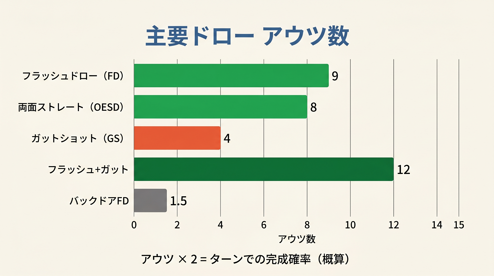
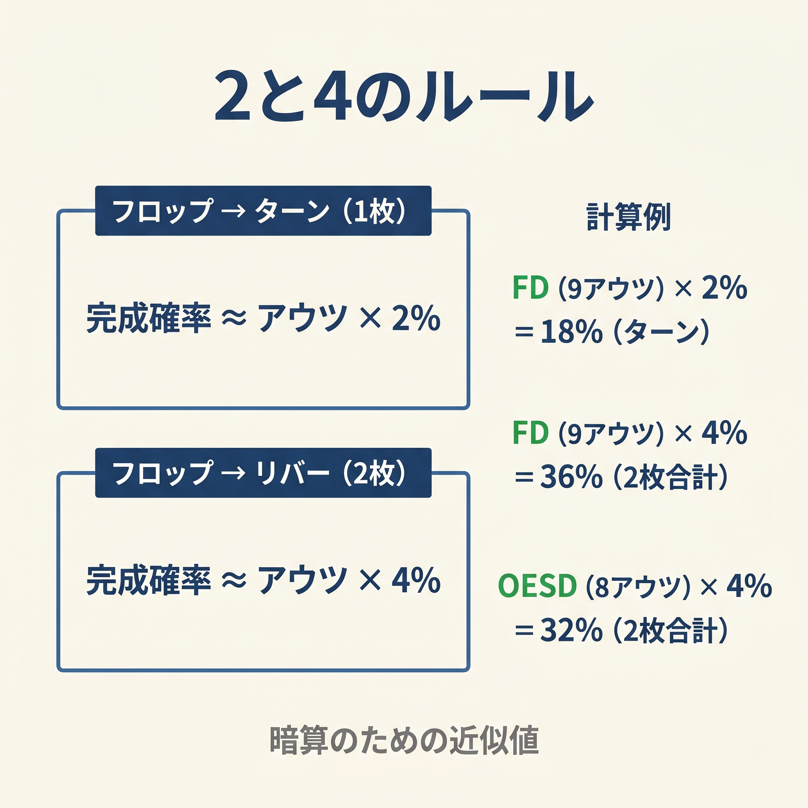
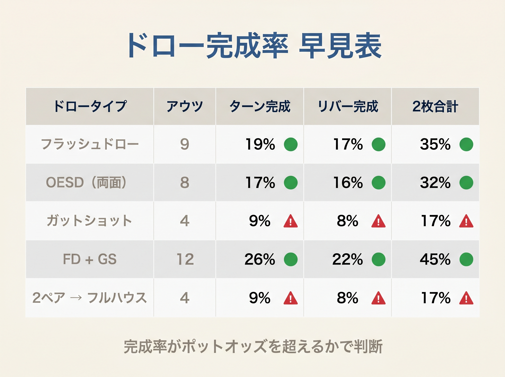

# 第6章　アウツとエクイティ（Rule of 2 and 4）

<!-- markdownlint-disable MD033 MD040 MD060 -->
<!-- textlint-disable preset-ja-technical-writing/no-exclamation-question-mark -->
<!-- textlint-disable preset-ja-technical-writing/no-mix-dearu-desumasu -->

> ドローは「夢」ではなく「数値」で評価する。
> アウツを数え、確率を掛ければ、コールすべきかどうかが見えてくる。

## はじめに

前章で学んだD3チェックリストは「このフロップでレンジ全体が何%ベットするか」を5秒で算出する手順でした。
本章では、自分の個別ハンドがベット対象になるかを判定するための基礎、つまりHandScoreのドロー加点「アウツ × 1.5」の数学的根拠を解説します。

フロップでのドロー判断は、長年ポーカープレイヤーを悩ませてきたテーマです。
しかし **Rule of 2 and 4** という単純な近似式を使えば、
アウツ数さえ数えれば完成確率をほぼ暗算できます。
本章の内容を押さえると、HandScoreのドロー加点が「なぜ × 1.5なのか」が明確になります。

---

<figure><figcaption>フラッシュドロー9 / OESD8 / ガットショット4のアウツ数比較横棒グラフ</figcaption></figure>

<figure><figcaption>アウツ×2%（ターン）/ アウツ×4%（2枚合計）のRule of 2 and 4を図解</figcaption></figure>

<figure><figcaption>FD/OESD/GS等の主要ドローのターン・リバー・2枚合計完成率早見表</figcaption></figure>

## 6-1　アウツとは何か

**アウツ（Outs）** とは、現在の弱い手を完成させてくれるデッキ内の残りカードの枚数です。
たとえばフロップでフラッシュドローを持っているとき、残り13枚ある同スートのカードのうち、
すでに見えている4枚（手札2枚 ＋ ボード2枚）を除いた **9枚** がアウツです。

アウツを数えることで、「このハンドが次のカードで完成する可能性」を具体的に把握できます。
感覚でなく数値として把握することが、正確な判断の出発点となります。

### フロップでの残りカード数

フロップが開いた段階では、次のカードが残っています。

- 手札：2枚
- ボード（フロップ）：3枚
- 見えていない枚数：52 − 2 − 3 = **47枚**

この47枚の中に自分のアウツが含まれています。
ターンが開いた後は46枚になります。

---

## 6-2　Rule of 2 and 4 の基本

**Rule of 2 and 4** は、Phil Gordonが著書 *Phil Gordon's Little Green Book*（Simon Spotlight, 2005）で広めた近似公式です。
アウツ数に定数を掛けるだけで完成確率を暗算できます。

```
フロップ段階（ターン ＋ リバーの2ストリート残り）:
  完成確率（%） ≒ アウツ × 4

ターン段階（リバーの1ストリート残り）:
  完成確率（%） ≒ アウツ × 2
```

### 数学的根拠

フロップ段階で1アウツが2ストリートのいずれかで完成する正確な確率は次の式で計算します。

```
P = 1 − (46/47) × (45/46) = 1 − 45/47 ≒ 4.26%
```

これを丸めると「1アウツあたり約4%」となるため、
アウツ × 4という公式が成立します。

### 計算例

- フラッシュドロー（9アウツ）：9 × 4 = **36%**（実際の正確値：35.0%）
- OESD（8アウツ）：8 × 4 = **32%**（実際の正確値：31.5%）
- ガットショット（4アウツ）：4 × 4 = **16%**（実際の正確値：16.5%）

---

## 6-3　主要ドローのアウツ数と確率一覧

実戦で頻出するドローのアウツ数と正確な確率を示します。

| ドロー | アウツ | ターン完成 | 2ストリート合計 | Rule of 4 | 誤差 |
|--------|--------|-----------|---------------|-----------|------|
| モンスタードロー（FD + OESD） | 15 | 31.9% | **54.1%** | 60% | −5.9% |
| FD ＋ ガットショット | 12 | 25.5% | 45.0% | 48% | −3.0% |
| フラッシュドロー（FD） | 9 | 19.1% | **35.0%** | 36% | −1.0% |
| OESD / ダブルガットショット | 8 | 17.0% | **31.5%** | 32% | −0.5% |
| 2オーバーカード | 6 | 12.8% | 24.1% | 24% | +0.1% |
| ガットショット | 4 | 8.5% | **16.5%** | 16% | +0.5% |

**ダブルガットショット**（Double Belly Buster）とは、2か所の「内側の穴」を持つ形です。
たとえば手札J-7・ボード9-8-5の場合、手元のカードは5・7・8・9・Jの5枚となり、
6が落ちれば5-6-7-8-9、10が落ちれば7-8-9-10-Jでストレートが完成します。
異なる2ランク × 各4枚 = 合計8アウツです。OESDと同等のアウツ数を確保できます。

### 精度の評価

Rule of 4は **9アウツ以下では誤差が±1〜2% 以内**に収まり、実用的な精度を持ちます。
しかし10アウツ以上では過大推定が顕著になります。
15アウツのモンスタードローではRule of 4が「60%」と示すのに対し、実際は「54.1%」で約6%の乖離が生じます。

---

## 6-4　拡張版：10アウツ以上での精度改善

アウツ数が多くなるとRule of 4の精度が落ちます。
この問題を補正するのが次の拡張公式です。

```
エクイティ（%） = (アウツ × 4) − (アウツ − 8)
```

これを整理すると次のようになります。

```
エクイティ（%） = アウツ × 3 + 8
```

### 計算例

- 15アウツのモンスタードロー：(15 × 4) − (15 − 8) = 60 − 7 = **53%**（実際値：54.1%）
- 12アウツのFD＋ガットショット：(12 × 4) − (12 − 8) = 48 − 4 = **44%**（実際値：45.0%）

**8アウツ以下では補正値がマイナスまたはゼロ**になるため、この公式は10アウツ以上のときだけ使います。
実戦では「9アウツ以下は × 4、10アウツ以上は × 3 + 8」と使い分けると精度が向上します。

### Smart Poker Study の「× 2 + 1」方式

ターン段階の計算では「アウツ × 2 + 1」とすると若干精度が上がることも指摘されています。
たとえばフラッシュドロー（9アウツ）：9 × 2 + 1 = **19%**（実際のターン完成率：19.1%）と正確に一致します。

---

## 6-5　ダーティアウツ（ディスカウント）

アウツを数えるとき、**すべてのアウツが「勝ちに貢献する」わけではありません**。
自分の手を改善するが、同時に相手の手をさらに強くしてしまうカードを **ダーティアウツ** と呼びます。

### 例1：フラッシュ vs フラッシュ

自分がK♠9♠（スペードのフラッシュドロー、9アウツ想定）を持ち、
相手がA♠7♠（ナッツフラッシュドロー）を持っていると仮定します。
スペードが来ても相手のナッツフラッシュが完成してしまうため、
そのアウツは実質的に「勝ち」に貢献しません。
実効アウツは9アウツから2〜4アウツを差し引いて計算すべきです。

### 例2：ストレートドローとフラッシュ完成

ボードがツートーンで自分はストレートドローを持っているケースです。
あるアウツが来てボードに3枚目の同スートが出ると、相手がフラッシュを完成させる可能性があります。
このような1〜2枚のカードはアウツから除外するか、0.5アウツとして計算します。

### ディスカウントの実務

実戦では次のように判断します。

1. 相手のハンドレンジを想定する
2. 「このカードが来たら相手の手も強くなるか」を問う
3. 疑わしければ1〜2アウツを差し引く

過剰なディスカウントも危険です。実際には勝てるアウツを除外してしまうと、コール判断が歪みます。
目安として「明らかに不利なアウツ」だけを1〜2枚差し引く程度に留めましょう。

### バックドアドロー（BDFD・BDSD）の扱い

**バックドアフラッシュドロー（BDFD）** は、ターンとリバーの2枚連続で同スートが来る必要があります。
2ストリート連続ヒットが必要なため、通常のアウツとして数えることができません。

実効エクイティへの寄与は次の通りです。

| ドロー | 実質加算エクイティ | HandScore での扱い |
|--------|----------------|-----------------|
| BDFD | 約 +4% | +4点（固定） |
| BDSD | 約 +2% | 本書では BDFD の半分程度 |

本書のHandScoreではBDFDに固定値 +4を加算します。
アウツ × 1.5の枠外で別扱いすることで、過大評価を防ぎます。

---

## 6-6　本書「アウツ × 1.5」係数の位置づけ

本書のHandScoreでは、ドロー加点として **アウツ × 1.5** を採用しています。
この係数がRule of 2 and 4とどのように対応しているかを説明します。

### Rule of 2 との対応

- Rule of 2（ターン段階）：アウツ × 2% ≒ 1ストリートの完成確率
- HandScoreのドロー加点：アウツ × 1.5（点数）

フラッシュドロー（9アウツ）を例に取ると次のようになります。

- Rule of 2が示す1ストリート完成確率：9 × 2 = **18%**
- HandScoreの加点：9 × 1.5 = **13.5点**（小数点以下切り捨てで13点）

### なぜ × 2 ではなく × 1.5 なのか

係数を × 1.5にすることで、次の3つのリスクを25%の割り引きとして内包しています。

| リスク要因 | 内容 |
|-----------|------|
| OOP でのエクイティ実現損失 | アウトオブポジションでは EQR が 75〜90% 程度になるケースが多い |
| ダーティアウツ | 一部のアウツが相手の手も強くする可能性 |
| インプライドオッズ未達 | ドロー完成時に相手がフォールドして追加利益を得られないケース |

### 各ドローの加点まとめ

| ドロー | アウツ | × 1.5 | HandScore 加点 |
|--------|--------|-------|--------------|
| ガットショット | 4 | 6.0 | +6 |
| 2オーバーカード | 6 | 9.0 | +9 |
| OESD / ダブルガットショット | 8 | 12.0 | +12 |
| フラッシュドロー（FD） | 9 | 13.5 | +13 |
| FD ＋ ガットショット | 12 | 18.0 | **+15（キャップ）** |
| モンスタードロー（FD ＋ OESD） | 15 | 22.5 | **+15（キャップ）** |

**キャップ（+15）** の理由：15アウツ以上のモンスタードローでも、
フロップではまだ「ドローであることに変わりない」ため、上限を設けています。
モンスタードローと確定した役（セット以上）を区別するための安全弁です。

---

## 【GTOとのズレ】コラム

GTOソルバーはアウツという概念を使いません。
ソルバーはハンドvsレンジの完全なエクイティ計算（全カード組み合わせ）を行い、
そこから最適な戦略（べット頻度・サイズ）を逆算します。

しかし実戦でソルバーを使えない場面では、Rule of 2 and 4は十分な近似精度を持ちます。

**GTOとのズレが小さいケース：**

- 9アウツ以下のドローでのRule of 4適用（誤差 ±1〜2%）
- IP（インポジション）でのドロー判断

**GTOとのズレが大きいケース：**

- 15アウツ以上でのRule of 4適用（6% 程度の過大推定）
- OOPでのドロー判断（実効エクイティが生エクイティより低下する）

OOP（アウトオブポジション）ではエクイティ実現率（EQR）が低下します。
GTO Wizardの分析によると、OOPの弱いドローや中程度のメイドハンドは
理論エクイティの75〜90% しか実現できないケースが多く報告されています。

このEQRの低下こそが、本書の × 1.5係数（× 2より25% 割り引き）の根拠とも合致します。
近似式として使う限り、Rule of 2 and 4は実用的な判断ツールです。

---

## 章のまとめ

- **Rule of 4** はフロップ段階のエクイティ近似式（アウツ × 4 ≒ 完成確率 %）
- **Rule of 2** はターン段階の近似式（アウツ × 2 ≒ 完成確率 %）
- 9アウツ以下では精度が高く、10アウツ以上では拡張公式（× 3 + 8）を使う
- ダーティアウツは1〜2枚差し引いてリスクを反映させる
- BDFDは通常のアウツとして数えず、固定 +4点を加算する
- 本書の **アウツ × 1.5** はRule of 2（1ストリート分）にOOPリスク等の25%割り引きを内包した実用係数

---

## ミニクイズ

**Q1**　フロップでOESD（オープンエンドストレートドロー）を持っています。
アウツは8枚です。Rule of 4で計算すると2ストリートでの完成確率は何%ですか？
また実際の正確値との誤差はどのくらいですか？

<details>
<summary>解答</summary>

Rule of 4の計算：8 × 4 = **32%**。
実際の正確値は31.5% のため、誤差は約0.5%（わずかに過大推定）です。
9アウツ以下では実用的な精度です。

</details>

---

**Q2**　フロップでFD ＋ OESDの「モンスタードロー」を持っています（15アウツ）。
Rule of 4では何%と計算されますか？また拡張公式（アウツ × 3 + 8）を使うと何%になりますか？

<details>
<summary>解答</summary>

Rule of 4：15 × 4 = **60%**。
拡張公式：15 × 3 + 8 = 45 + 8 = **53%**（実際値：54.1% に近い）。
15アウツのような大きなドローでは拡張公式の方が精度が高いです。

</details>

---

**Q3**　HandScoreで「フラッシュドロー（9アウツ）＋ ガットショット（4アウツ）」を計算するとき、
アウツは合計13アウツです。アウツ × 1.5の計算結果はいくつですか？
また本書のキャップルールではどうなりますか？

<details>
<summary>解答</summary>

アウツ × 1.5：13 × 1.5 = **19.5点**（切り捨てで19点）。
しかし本書ではドロー加点のキャップが **+15点** に設定されているため、
HandScoreへの加点は **+15点** となります。
モンスタードロー以上の加点は上限を設けて過大評価を防いでいます。

</details>

---

## 出典

- Phil Gordon, *Phil Gordon's Little Green Book*, Simon Spotlight, 2005
  - Library of Congress目次：<https://catdir.loc.gov/catdir/toc/ecip0511/2005010872.html>
  - The Poker Bank（"Phil Gordon coined the term" と明記）：<https://www.thepokerbank.com/strategy/mathematics/pot-odds/4-2/>
- Rule of 2 and 4精度分析（CasinoReviews）：<https://www.casinoreviews.net/blog/game-strategies-tips/rule-of-4-and-2-limitations-specifity-of-this-texas-holdem-poker-principle/>
- ドロー確率テーブル（Upswing Poker）：<https://upswingpoker.com/odds-hitting-draw-in-poker/>
- ダブルガットショット定義（PokerZone）：<https://www.pokerzone.com/dictionary/double-gutshot>
- アウツとエクイティ計算（PokerCoaching）：<https://pokercoaching.com/blog/outs-in-poker/>
- アウツ解説2025（Pokerati）：<https://pokerati.com/2025/05/poker-outs/>
- バックドアドロー戦略（Upswing Poker）：<https://upswingpoker.com/backdoor-flush-straight-draw-tips/>
- Equity Realization（GTO Wizard）：<https://blog.gtowizard.com/equity-realization/>
- Smart Poker Study Revised Rule（Podcast \#111）：<https://smartpokerstudy.com/4-2-rule-flop-value-raises-oversized-bets-111/>
