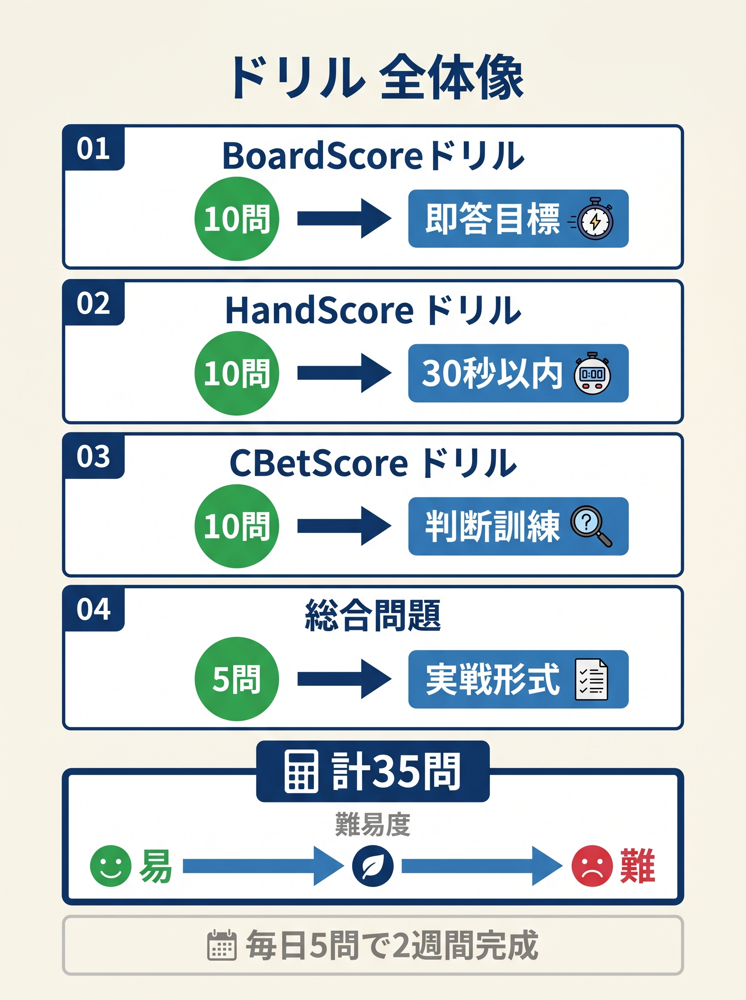

# 第7章　20問ドリル：3秒でフロップ判断

<!-- markdownlint-disable MD036 -->

> **本章の目標**: 本書で学んだ3式（簡易レンジスコア チェックリスト、HandScore、CBet 統合式）を実戦レベルで運用できる状態に定着させます。20問のドリルで**3秒以内に判断できる**練習をします。

前作と同じく、本章は「知識の身体化」を目的とします。各問題は次のフォーマットです。

1. **シチュエーション**：ポジション、ハンド、ボード、プリフロップアクション
2. **あなたの選択肢**
3. **解答**と**使用した公式**

難易度は ★（基本）、★★（応用）、★★★（境界判断）の3段階。まず自分で解いてから解説を読んでください。

---

<figure><figcaption>簡易レンジスコア チェックリスト・HandScore・CBetScore・総合問題の4セクション35問ドリル全体像</figcaption></figure>

## 使用する公式のおさらい

```text
簡易レンジスコア チェックリスト（CBet 頻度%）:
  Step1: モノトーン → 20%（低頻度）
  Step2: ペアボード → ペア表参照（80/50/72/45/75%）
  Step3: ウェット要素確認（連続3枚 / 2-tone / 高ボード連続）
  Step4: トップカード × ウェット判定
    ハイ(A/K/Q)×ドライ=85%、ハイ×ウェット=55%
    ロー(J以下)×ドライ=55%、ロー×ウェット=30%

頻度帯: 70%以上=高頻度(ドライ) / 40〜69%=中頻度 / 40%未満=低頻度(ウェット)

HandScore = 役スコア + ドロー加点 + ブロッカー（0〜100、≒自分のエクイティ%）
  ドロー加点はフロップでは アウツ × 4（Rule of 4 直接）

CBet スコア = HandScore − 簡易レンジスコア頻度補正値 + ポジション係数（IP +20、OOP 0）
  簡易レンジスコア頻度補正値: 高頻度帯→0、中頻度帯→20、低頻度帯→40

判定: ≥60 → CBet 75%、30〜59 → CBet 33%、10〜29 → チェック、<10 → フォールド準備
```

---

## Q1（★）：TPTK on ドライ

あなたはBTN。COフォールド、UTGが2.5bbオープン、あなたがコール。フロップK♣7♦2♠。UTGが33% CBet。手札A♠K♠。どうしますか。

1. フォールド
2. コール
3. レイズ

---

**解答：2（コール）** または **3（レイズ）**

HandScore = TPTK 70 + BDFDなし = **70**。簡易レンジスコア頻度 = K72r → ハイ×ドライ = 85%（高頻度帯）。IP +20。対CBetなのでこの式ではなく、防衛の視点で判断します。

TPTKはUTGのCBetレンジ（KK、AK、AQs、AJsなど）に対して互角以上。コールで全スタック相当のバリューを取りに行くのが基本。アクティブなレイズもレンジアドバンテージ次第で有力。

**使用した公式**：HandScore（TPTK 70）、レンジ読み（UTG Kハイで強め）

---

## Q2（★★）：TPTK on ウェット

あなたはBTN、COが2.5bbオープン、あなたがコール。フロップK♠Q♥J♣。COが75% CBet。手札A♦K♦。どうしますか。

1. フォールド
2. コール
3. レイズ

---

**解答：2（コール）**

HandScore = TPTK 70 + ガットショット（4 アウツ × 4）+16 = **86**（上限 100 でクランプ）。簡易レンジスコア頻度 = KQJr → 連続3枚でウェット要素あり、ハイ×ウェット = **55%**（中頻度帯）。

強いが、相手の75% CBetはセット、二ペア、ストレートのバリューレンジが濃い。レイズするとオーバーコミットで危険。コールでターンを見るのが安全。

**使用した公式**：HandScore（TPTK + ガットショット）、リバースインプライドオッズ。

---

## Q3（★）：OP vs ドライ

BTNでオープン2.5bb、BBがコール。フロップ8♠4♦2♣。あなたはJJ。どうしますか。

1. チェック
2. CBet 33%
3. CBet 75%

---

**解答：2（CBet 33%）**

HandScore = OP（中、JJ）**72**。簡易レンジスコア頻度 = 842r → ロー×ドライ = **55%**（中頻度帯）、補正値20。IP +20。

CBetスコア = 72 − 20 + 20 = **72 → CBet 75%**

ドライボードでJJはオーバーペア、積極的にバリュー。33% Range CBetの方がベターな場面もあり、サイジングは相手次第。ここでは大きく打ってバリューを最大化。

**使用した公式**：CBet統合式。

---

## Q4（★★）：OP vs ウェット

BTNオープン2.5bb、BBコール。フロップT♥9♥8♦。あなたはQQ。どうしますか。

1. チェック
2. CBet 33%
3. CBet 75%

---

**解答：1（チェック）** または **3（CBet 75%）**

HandScore = OP（QQ）**78**。簡易レンジスコア頻度 = T98（2-tone）→ 連続3枚＋ツートーンでウェット要素あり、ロー×ウェット = **30%**（低頻度帯）、補正値40。IP +20。

CBetスコア = 78 − 40 + 20 = **58 → CBet 33%**（境界）

ウェットボードでQQは**危うい**。すでにストレート完成が相手にある可能性（JQ、JK、67）。チェックで相手の動きを見て守る選択も有力。

**使用した公式**：CBet統合式、簡易レンジスコア低頻度帯判定。

---

## Q5（★）：TPGK on ドライ

BTNでA♣K♦ オープン、BBコール。フロップK♠7♥2♦。どうしますか。

1. チェック
2. CBet 33%
3. CBet 75%

---

**解答：2（CBet 33%）**

HandScore = TPTK **70**。簡易レンジスコア頻度 = K72r → ハイ×ドライ = **85%**（高頻度帯）、補正値0。IP +20。

CBetスコア = 70 − 0 + 20 = **90 → CBet 75%**（本書式）

ただし超ドライボードでは33% のRange CBetも標準的。「本書式の推奨は75%」、「GTO標準は33%」のどちらも成立。本書では統合式通り **75%** を推奨。

---

## Q6（★）：TP 弱キッカー

BTNでK♦5♦ オープン、BBコール。フロップK♣7♦2♠。どうしますか。

1. チェック
2. CBet 33%
3. CBet 75%

---

**解答：2（CBet 33%）**

HandScore = TPWK **45**（5 はキッカー J 以下）+ BDFD +5 = **50**。簡易レンジスコア頻度 = K72r → ハイ×ドライ = **85%**（高頻度帯）、補正値 0。IP +20。

CBetスコア = 50 − 0 + 20 = **70 → CBet 75%**

……境界気味だが 70 なので 75% と出る。ただしTPWKは **2ストリートバリューが限界**。初手は33% で打ってターンを考える方が安全。本書式は機械的に75% と出すが、実戦感覚では33% 寄せ。

---

## Q7（★★）：ナッツフラッシュドロー

BTNでA♥T♥ オープン、BBコール。フロップ9♥8♥2♦。どうしますか。

1. チェック
2. CBet 33%
3. CBet 75%

---

**解答：2（CBet 33%）または 3（CBet 75%）**

HandScore = Aハイ 25 + フラッシュドロー（9 アウツ × 4）+36 + ナッツブロッカー（A♥）+5 = **66**。簡易レンジスコア頻度 = 982（2-tone）→ ロー×ウェット = **30%**（低頻度帯）、補正値 40。IP +20。

CBetスコア = 66 − 40 + 20 = **46 → CBet 33%**（セミブラフ）

セミブラフで攻める。フォールドエクイティ + ドロー完成でダブルチャンス。

---

## Q8（★）：OESD

BTNでJ♠T♠ オープン、BBコール。フロップ9♣8♥2♦。どうしますか。

1. チェック
2. CBet 33%

---

**解答：2（CBet 33%）**

HandScore = Jハイ 10 + OESD（8 アウツ × 4）= **42**。簡易レンジスコア頻度 = ロー×ドライ = **55%**（中頻度帯、補正値 20）。IP +20。

CBetスコア = 42 − 20 + 20 = **42 → CBet 33%**

軽いセミブラフで圧力。

---

## Q9（★）：空振りハイカード

BTNでQ♣J♣ オープン、BBコール。フロップA♦7♦2♠。どうしますか。

1. チェック
2. CBet 33%

---

**解答：2（CBet 33%、Range CBet）**

HandScore = Qハイ 15（空振り、Aブロッカーなし）+ BDFD（クラブは2枚じゃないのでなし）= **15**。簡易レンジスコア頻度 = ハイ（A）×ドライ = **85%**（高頻度帯、補正値0）。IP +20。

CBetスコア = 15 − 0 + 20 = **35 → CBet 33%**（境界）

境界寄りだが Range CBet 戦略では**33% の小サイズで打つのも正解**。相手のBBはAにヒットしている確率が低い（Axoの多くは3ベットに回る）ので、フォールド率高い。

---

## Q10（★★）：セット on ドライ

BTNで7♥7♣ オープン、BBコール。フロップ7♠K♣2♦。どうしますか。

1. チェック（スロープレイ）
2. CBet 33%
3. CBet 75%

---

**解答：3（CBet 75%）**

HandScore = セット（ボトムセット）**85**。簡易レンジスコア頻度 = ハイ（K）×ドライ = **85%**（高頻度帯、補正値0）。IP +20。

CBetスコア = 85 − 0 + 20 = **105 → CBet 75%**（上限超え、文句なしの最大級）

ドライボードでもセットは積極的にバリュー。相手がKにヒットしているならTPでスタックオフしてくる。スロープレイは価値を逃す。

---

## Q11（★★）：セット on ウェット

BTNで9♥9♣ オープン、BBコール。フロップ9♠8♥7♣。どうしますか。

1. CBet 33%
2. CBet 75%
3. CBet 125%（オーバーベット）

---

**解答：2（CBet 75%）** または **3（オーバーベット）**

HandScore = セット（トップセット）**92**。簡易レンジスコア頻度 = ロー（9）×ウェット（連続3枚+レインボー）= **30%**（低頻度帯、補正値40）。IP +20。

CBetスコア = 92 − 40 + 20 = **72 → CBet 75%**

ウェットボードでも（むしろウェットだからこそ）**プロテクション重視で大きく**。相手のドローからインプライドオッズを与えない。

---

## Q12（★★）：BB で BTN CBet にフラット

あなたはBB、BTNが2.5bbオープン、SBフォールド、あなたK♦J♦ でコール。フロップK♥7♣2♦。BTNが33% CBet。どうしますか。

1. フォールド
2. コール
3. レイズ

---

**解答：2（コール）**

HandScore = TPGK（Jキッカー）**62** + BDSDなし = **62**。OOPなので実効HandScoreは約62 × 0.8 ≒ 50。

BTNレンジは広い（43%）ので、TPGKはコールで守る。レイズはTPでオーバーコミットリスク。

**使用した公式**：HandScore、実効エクイティ（OOP割引）

---

## Q13（★★）：BB で UTG CBet にフォールド

あなたはBB、UTGが2.5bbオープン、BBでK♣5♣ コール。フロップA♣8♦2♠。UTGが75% CBet。どうしますか。

1. フォールド
2. コール
3. レイズ

---

**解答：1（フォールド）**

HandScore = 空振り（Kハイ、Aハイボード）= **20** + BDFD（クラブ1枚のみなのでなし）= **20**。簡易レンジスコア頻度 = ハイ（A）×ドライ = **85%**（高頻度帯、補正値0）。

UTGの75% CBetは強いバリューレンジ（AA、AK、AQ、AJs）濃厚。空振りでコールは無意味。

**使用した公式**：HandScore（空振り）、UTGのタイトなレンジ読み。

---

## Q14（★★★）：BB vs CO でチェックレイズ

あなたはBB、COが2.5bbオープン、BBで6♠5♠ コール。フロップ9♠8♦7♠（OESD + FD + ガットショット）。COが33% CBet。どうしますか。

1. フォールド
2. コール
3. レイズ（チェックレイズ）

---

**解答：3（チェックレイズ）**

HandScore = 空振り 8 + FD+OESD（モンスタードロー、13 effective outs × 4）= **8 + 52 = 60**。

超モンスタードローはチェックレイズで**セミブラフ + バリュー二役**。相手の33% CBetへの3xレイズで100% pot相当の圧力。

**使用した公式**：HandScore（モンスタードロー）、セミブラフレイズ基準。

---

## Q15（★）：マルチウェイでの TP

UTGオープン2.5bb、COコール、BBコール（3-way）。フロップK♣7♦2♠。あなたはCOでK♠J♦。UTGが33% CBet。どうしますか。

1. フォールド
2. コール
3. レイズ

---

**解答：2（コール）**

TPGKだが3-wayではナッツ基準が上がる。UTGはA、K濃厚、BBはKヒット含む。レイズは過剰、コールでターンを見る。

**使用した公式**：マルチウェイ調整（第16章）

---

## Q16（★★）：3bet ポット IP の CBet

BTNでA♠Q♣ オープン、BBが10bb 3ベット、あなたコール。フロップQ♠7♥2♦。どうしますか。

1. チェック
2. CBet 33%
3. CBet 75%

---

**解答：2（CBet 33%）**

HandScore = TPGK **62**。簡易レンジスコア頻度 = ハイ（Q）×ドライ = **85%**（高頻度帯、補正値0）。IP +20。3bet補正 +8。

CBetスコア = 62 − 0 + 20 + 8 = **90 → CBet 75%**

ただしBBの3ベットレンジにはQQ、KK、AKが多い。本書式は75% を出すが、ウェットな3betポットでは33% 寄せが安全。

**使用した公式**：CBet統合式 + 3bet補正。

---

## Q17（★★★）：3bet ポット OOP のチェック

UTGでA♥K♠ オープン、COが10bb 3ベット、あなたUTGコール。フロップ8♦7♦2♠。どうしますか。

1. チェック
2. CBet 33%
3. CBet 75%

---

**解答：1（チェック）**

HandScore = Aハイ 25 + 2 オーバー（6 アウツ × 4）= **49**。簡易レンジスコア頻度 = ロー（8）×ウェット（連続2枚+ツートーン）= **30%**（低頻度帯、補正値 40）。OOP = 0。3bet補正 +8。

CBetスコア = 49 − 40 + 0 + 8 = **17 → チェック**

3betポットOOPの空振り。相手（CO）の3ベットレンジも強い。チェックで諦める。

**使用した公式**：CBet統合式 + 3bet補正、OOP調整。

---

## Q18（★★）：ドンクベット対応

UTGオープン2.5bb、あなたBTNでコール、BBコール。フロップ7♣6♦5♠。BBが33% ドンクベット。どうしますか。

1. フォールド
2. コール
3. レイズ

---

**解答：2（コール）** または **3（レイズ）**

自分のハンド不明だが、ローコネクターボードでのBBドンクは**ナッツ候補**の可能性高（9-8や8-4、88など）。TP以下なら慎重、セット以上ならレイズ。

**使用した公式**：ドンクベット対応ルール（第14章）

---

## Q19（★）：ウェットモノトーン on チェック

BTNでA♦K♣ オープン、BBコール。フロップK♥9♥5♥（モノトーン）。どうしますか。

1. チェック
2. CBet 33%
3. CBet 75%

---

**解答：1（チェック）**

HandScore = TPTK **70** + ブロッカーなし（ハート1枚もなし）= **70**。簡易レンジスコア頻度 = モノトーン = **20%**（低頻度、補正値40）。IP +20。

CBetスコア = 70 − 40 + 20 = **50 → CBet 33%**（本書式）

ただしモノトーンではBBがナッツフラッシュを持つ可能性。本書式は 33% を出すが、実戦ではチェックバックで情報取得も合理的。**GTO 的にも 25〜33% 小サイズ頻度ベット**が正解。

---

## Q20（★★★）：オーバーペア対大きな CBet（被 CBet）

あなたはBB、UTG 2.5bbオープン、あなたQQでコール。フロップ7♣4♦2♠。UTGが75% CBet。どうしますか。

1. フォールド
2. コール
3. レイズ（チェックレイズ）

---

**解答：2（コール）** または **3（レイズ）**

HandScore = OP（QQ）**78**。UTGの75% CBetはプレミアム中心（KK、AA、QQ、AK）。

- AAに対してOPは当然負け、KKにも負け
- QQに対しては引き分け
- AKには勝つ

コールでターンを見るか、チェックレイズで情報を取って降ろせるハンドを降ろすか。レイズの場合はバリューよりブラフ寄り（相手がAA・KK以外を降ろす）。

**使用した公式**：HandScore、レンジ読み、チェックレイズ判定。

---

## ドリル総合自己評価

- **20問中17問以上正解**：本書の式は完全に身体化完了。付録のチートシートで実戦運用へ
- **12〜16問正解**：まだ迷う場面あり。間違えた問題の章を再読
- **11問以下**：第8章（簡易レンジスコア チェックリスト）〜第10章（CBet統合判定）に戻って復習

---

## 章のまとめ

- 20問で本書3式の運用を網羅的に確認
- 各問に本書式での計算過程と、実戦感覚での微調整を提示
- ★〜★★★の3段階で難易度を変えている
- 本書式の「75% 判定」が実戦では「33% 寄せ」になる境界も正直に示している

---

## 出典

- GTO Wizard AIトレーナー（類似問題の検証）
- Upswing Poker Lab
- Jonathan Little『Cash Game Coaching』
- 本書第5〜22章の各公式
