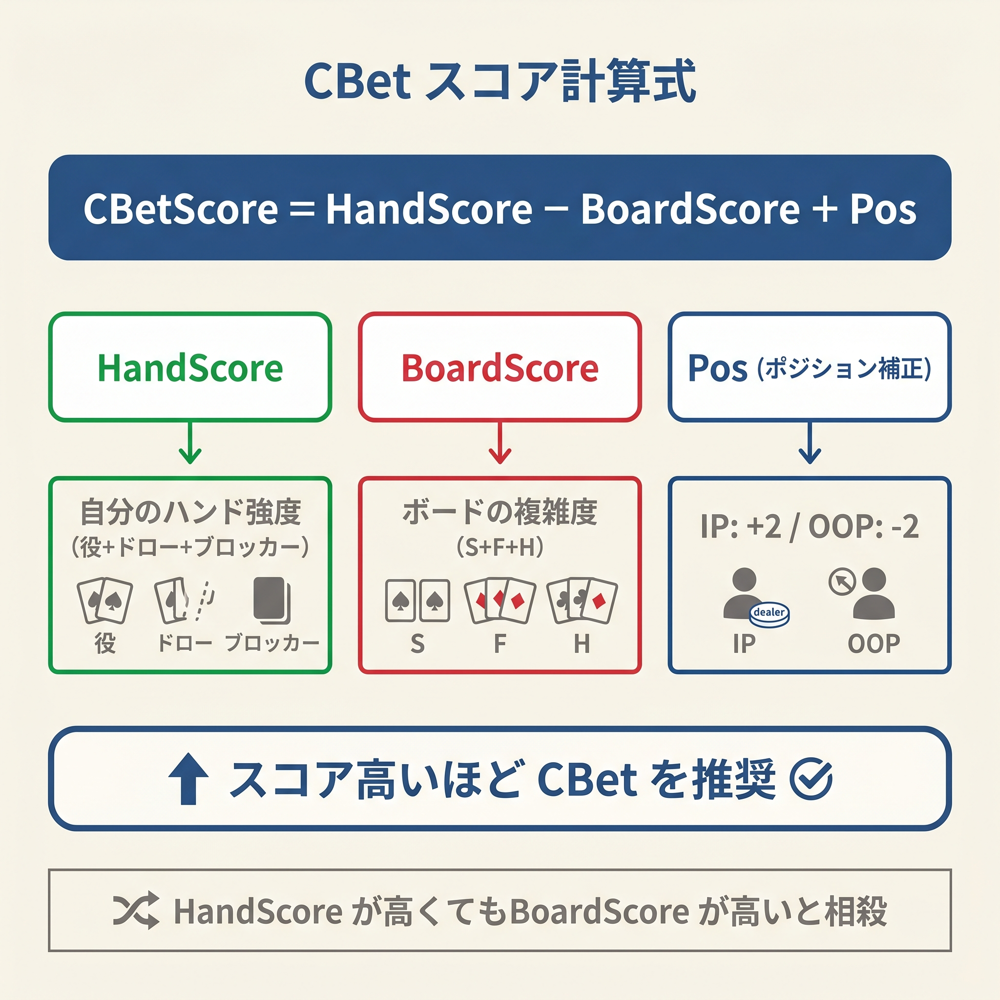
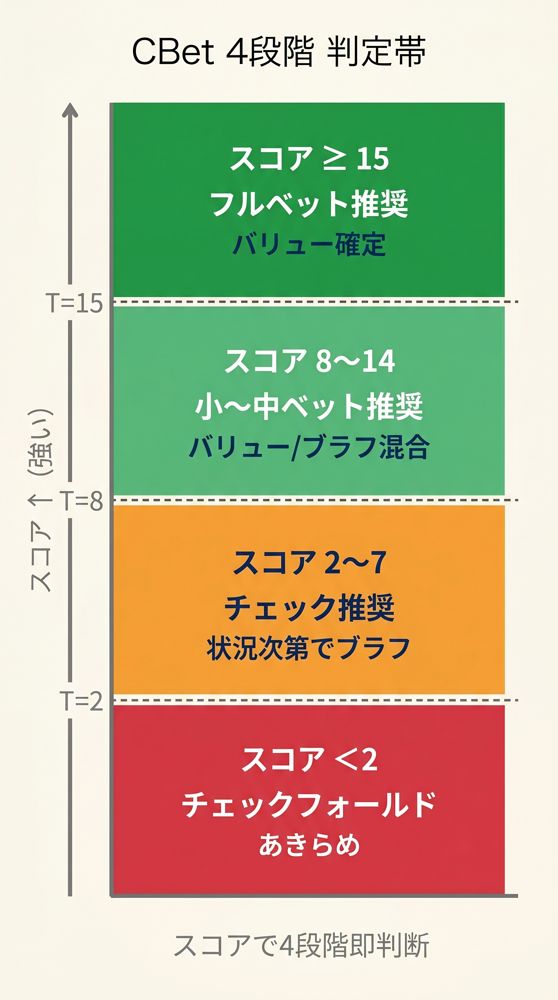
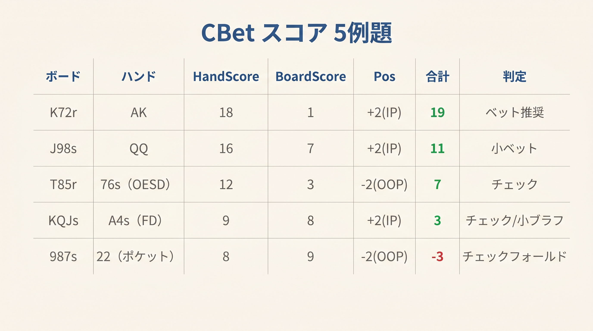

# 第9章　CBet 統合式の全体像

<!-- markdownlint-disable MD036 MD040 MD060 -->
<!-- textlint-disable preset-ja-technical-writing/no-exclamation-question-mark -->
<!-- textlint-disable preset-ja-technical-writing/no-mix-dearu-desumasu -->
<!-- textlint-disable preset-jtf-style/4.3.7.山かっこ<> -->

> 「3つのピースが揃ったとき、判断は直感から計算に変わる。ボードを読み、手の強さを測り、ポジションを加える。それだけで、フロップのほとんどの場面に答えが出る」

---

<figure><figcaption>CBetScore = HandScore - BoardScore + Pos の式構造と各要素説明</figcaption></figure>

<figure><figcaption>CBetスコア≥15/8-14/2-7/<2の4段階判定帯縦型図</figcaption></figure>

<figure><figcaption>5種類のボード×ハンド組み合わせのCBetスコア計算例一覧表</figcaption></figure>

## 導入　―― 3式が1本に結合するとき

第5章でBoardScoreを学びました。ボードのウェット度を数値化し、相手のドロー頻度とCBetの通りにくさを測る式です。スコアが高いほどウェット（CBetが通りにくい）、低いほどドライ（CBetが通りやすい）です。

第8章ではHandScoreを学びました。フロップでの手の強さを役スコア・ドロー加点・ブロッカーの和として数値化する式です。

本章ではこの2つの式と**ポジション係数**を結合した**CBet 統合式**を導入します。3つの要素を組み合わせるだけで「CBet 75%」「CBet 33%」「チェック」「チェック・フォールド準備」の4択に着地できます。

本書のフロップ編は、この統合式を中核に据えています。バリュー・ブラフ・プロテクションの目的（第7章）も、ボードのウェット度（第5章）も、手の強さ（第8章）も、すべてがこの1本の数式に収束します。本章はフロップ判断の集大成です。

---

## 9-1　統合式の定義

```
CBet スコア = HandScore − BoardScore + ポジション係数

ポジション係数
  IP（ボタン、CO 側）: +3
  OOP（ブラインド側）: 0

判定
  ≥ 15 → CBet 75%（強ハンドで価値最大化）
  8〜14 → CBet 33%（軽いサイズで幅広く）
  2〜7 → チェック（後続ストリートで判断）
  < 2 → チェック・フォールド準備
```

式の外形はシンプルです。HandScore（手の強さ）からBoardScore（ウェット度の減点）を引き、ポジション係数を加えるだけです。計算は暗算で完結します。

「−BoardScore」の項は直感的です。ウェットなボード（BoardScoreが高い）ほどスコアが下がり、CBetしにくくなります。ドライなボード（BoardScoreが低い）ほどスコアが上がり、CBetしやすくなります。

この式はヘッズアップのSRP（シングルレイズドポット）を前提として設計されています。マルチウェイや3betポットへの適用については9-5節で扱います。

---

## 9-2　各項の意味

### HandScore 項：手の絶対的な強さ

HandScoreは式の土台です。強いハンド（セット、オーバーペア、TPTK）はHandScoreが高く、弱いハンド（ハイカードのみ、ボトムペア）は低くなります。

| ハンド例 | HandScore の構成 | スコア |
|---------|----------------|-------|
| セット（例：77 on K72r） | 役 30 | 30 |
| TPTK（KQ on K72r） | 役 15 | 15 |
| アンダーペア（77 on K72r） | 役 6 | 6 |
| 空振り+BDFD（AQ on K72r、スーテッド） | 役 0 + BDFD 4 | 4 |
| OESD（例：JT on 987r の場合の TP） | 役 + OESD 12 | 役+12 |

HandScoreが高いほど、ボードやポジションに関わらずCBetが正当化されやすくなります。セット（30点）であれば、ウェットボードやOOPでも統合スコアが高くなるため積極的にベットできます。

### −BoardScore 項：ウェット度の減点

BoardScoreを引く理由は「ウェットなボードほどCBetが通りにくい」という直感を数式に反映するためです。BoardScoreが高い（ウェット）ほど差し引き幅が大きく、スコアが下がります。BoardScoreが低い（ドライ）ほど差し引き幅が小さく、スコアへの影響も小さくなります。

| BoardScore | −BoardScore の値 | ボードの特徴 |
|------------|-----------------|------------|
| 0（K72r 相当） | 0 | 完全ドライ、CBet が通りやすい |
| 1〜3 | −1〜−3 | ドライ寄り、Range CBet が有効 |
| 4〜6 | −4〜−6 | 中立〜セミウェット、ハンド強度で判断 |
| 7〜8（987ss 相当） | −7〜−8 | ウェット、チェック主体 |
| 9〜11 | −9〜−11 | 超ウェット、ほぼチェック |

「ドライボードではブラフが通りやすく、ウェットボードでは通りにくい」という定性的な知識が、−BoardScoreという数値に変換されています。

### ポジション係数：情報アドバンテージの数値化

IP（ボタン、COなど）の +3は、ポジションアドバンテージを定量化したものです。

GTO Wizardのデータによれば、BTN（IP）がBBに対してSRPでCBetする頻度は全フロップ平均で **53〜64%** です。一方、OOPプレイヤーのCBet頻度は約 **28%** 程度（UTG vs BBの例）にとどまります。IPとOOPの頻度差は **25〜35%ポイント**に達します。

この差を統合式のスコアスケールに換算すると、1点あたり約1.5〜2% ポイントの頻度差に対応します。IP +3点は約4.5〜6% ポイントの頻度上昇に相当し、「IPは広くCBet、OOPは絞る」という方向性を正確に反映しています。

ただし +3という絶対値は教育的設計値です。「閾値を超えるか否か」の判定がわかりやすくなるよう、HandScore・BoardScoreと整合するよう調整されています。

---

## 9-3　判定しきい値の根拠

### 15以上 → CBet 75%

スコア15以上は、強ハンドかつドライボードかつ有利なポジションが揃った状態です。GTO Wizardが分析するドライボード（K72r、A62rなど）ではBTNのCB頻度が **75%〜100%** に達します。

GTOデータでも「ドライ高カードボード・ペアボード・レインボーのdisconnectedボード」は高頻度CBetが正当化されます。これらはBoardScore 0〜3に相当し、統合スコアが15以上になりやすいボードです。

75% というサイズは「価値を最大化しつつ、相手のドローに正しいオッズを与えない」という両立点です。

### 8〜14 → CBet 33%

スコア8〜14は「CBetするが確信度は中程度」の領域です。GTO WizardはK44フロップでのBTNのCB頻度を **42.8%**、J75rで **40%** と明示しています。これらはBoardScore 3〜6のセミウェット領域に相当し、統合スコア8〜14の境界域と一致する傾向があります。

33% という小さいサイズには2つの意味があります。第1にリスクを抑えつつフォールドエクイティを確保する点、第2にバリューとブラフを同じサイズで打つことでレンジバランスを保つ点です。これがRange CBetの本質です。

### 2〜7 → チェック

スコア2〜7は、手の強さとボードのドライ度がCBetの条件を満たさない領域です。GTO Wizardは接続されたウェットボード（987、JT8など）を「CB頻度が最も低い部類」と分類しています。

このスコア帯ではチェックしてターンで情報を得ることが最善です。チェックには「相手の反応を見る」「フリーカードを与えて後続でポットを大きくする」「チェックレイズの選択肢を保持する」という複数の価値があります。

### 2未満 → チェック・フォールド準備

スコア2未満は、ハンドが弱く、ボードも不利で、ポジションも劣位の状態です。OOPでウェットボードを外したハンドがこの領域に入ります。

GTO WizardはモノトーンボードでCB頻度とサイズが「急激に低下する」と明記しています。このスコア帯ではCBetのリスクが収益を上回るため、チェックして次のストリートへの対処を考えます。ターンやリバーでのコールを「フォールドで良い」と事前に心構えておくことで、損失を限定できます。

---

## 9-4　代表例5つで計算の流れを確認する

### 例1：KQ on K72r IP（TPTK、ドライボード）

```
HandScore = 15（トップペア・良キッカー）
BoardScore = 0（K72r: 完全ドライ）
ポジション係数 = +3（IP）

CBet スコア = 15 − 0 + 3 = 18
→ CBet 75%
```

KQはK72rでトップペア・トップキッカーに近い強いハンドです。ボードは完全ドライでフォールドエクイティが最大化されています。IPからの75% CBetで相手の弱いキングやポケットペアからバリューを取ります。

GTO Wizardの分析でもK72rはBTNの高頻度CBetが正当化されるボードの代表例です。スコア18は「積極的にCBetすべき」というGTOの方向性と一致します。

---

### 例2：JJ on 982r IP（オーバーペア、ドライボード）

```
HandScore = 20（オーバーペア）
BoardScore = 2（982r: ほぼドライ）
ポジション係数 = +3（IP）

CBet スコア = 20 − 2 + 3 = 21
→ CBet 75%
```

JJはオーバーペアとして現在勝っていますが、相手が76やT7などのストレートドローを持つ可能性があります。982rはBoardScore 2のほぼドライなボードで、相手のドロー完成前にプロテクションCBetを打ちます。

スコア21は強ハンドとドライボードの組み合わせが高水準を示しています。75% CBetでエクイティデナイアルを実行します。

---

### 例3：77 on K72r IP（アンダーペア）

```
HandScore = 6（アンダーペア）
BoardScore = 0（K72r: 完全ドライ）
ポジション係数 = +3（IP）

CBet スコア = 6 − 0 + 3 = 9
→ CBet 33%
```

77はK72rでアンダーペアです。現在相手にKが当たっていれば負けています。しかしボードが完全ドライであるためポジション補正が加わり、スコア9に到達します。

33% の小さいサイズで打つことで、ブラフとバリューを混在させたバランスのとれたCBetになります。GTO WizardがK44フロップで42.8% のCB頻度を示すように、このスコア帯は「する価値はあるが確信度は低い」領域です。

---

### 例4：AT on 987ss IP（空振り、ウェットボード）

```
HandScore = 0（ハイカードのみ）
BoardScore = 7（987ss: 接続されウェット）
ポジション係数 = +3（IP）

CBet スコア = 0 − 7 + 3 = −4
→ チェック・フォールド準備
```

ATは987ssで何も作れていません。ガットショットも持ちません（Aは9-8-7のストレートに貢献しない）。ボードは接続されたツースート（two-suit）で相手のレンジが直撃しやすい状態です。

GTO Wizardは「接続されたウェットボードはCB頻度が最も低い」と明示しています。スコア−4はチェック・フォールドの準備をすべき最低水準です。IPであってもこの組み合わせではCBetの期待値はマイナスになります。

---

### 例5：AQ on K72r IP（空振り、BDFD あり）

```
HandScore = 0（ハイカードのみ）+ 4（BDFD） = 4
BoardScore = 0（K72r: 完全ドライ）
ポジション係数 = +3（IP）

CBet スコア = 4 − 0 + 3 = 7
→ チェック（後続ストリートで判断）
```

AQはスーテッドであればBDFD（バックドアフラッシュドロー）を持ちます。K72rのドライボードはCBetに有利ですが、HandScoreがわずか4点と低いため、統合スコアは7にとどまります。

チェックは「情報を取る」判断です。ターンでAやQがヒットすればトップペアに昇格し、次のストリートで積極的にCBetできます。また空振りのまま進んでも、相手がチェックバックすればリバーで改善の機会が残ります。

---

## 9-5　統合式の限界

本書の統合式は強力なヒューリスティックですが、すべての状況に適用できるわけではありません。以下の3つの限界を把握することで、式を正しく使えます。

### 限界1：レンジ全体のバランスは反映されない

統合式はハンド個別のスコアを計算します。しかしGTOが重視する「レンジ全体のバランス」（バリューとブラフの比率、保護のためのチェックバック）は反映されません。

GTO Wizardは「SBはほぼどのフロップでもレンジ全体を単一アクションでまとめることはない」と明記しています。同じHandScoreのハンドでも、レンジの中でのブロッカー構成や保護の必要性によってCBetかチェックかが変わる場面があります。

本書の式は「大きな失点を防ぐ最小限のフレームワーク」として機能します。境界スコア付近（スコア7〜9、14〜16）ではGTOの混合戦略との乖離が生じる可能性があります。

### 限界2：マルチウェイには直接適用できない

統合式はヘッズアップ（1対1）のSRPを前提として設計されています。3人以上のマルチウェイポットには直接適用できません。

GTO Wizardは「マルチウェイポットではRange CBetを止め、ゴミは諦め、バリューベットの閾値を上げ、中程度のハンドはチェックバックせよ」と明示しています。

目安として、3-wayではCB頻度を最大50% に抑制し、4-way以上では強いバリューかナッツドロー以外はチェックが推奨されます。ヘッズアップCB頻度70% 前後が、3-wayでは50% 以下に低下するという大きな変化があります。

マルチウェイで統合式を参照する場合は、スコアに関わらず閾値を **+5 点** 引き上げる補正（20以上で75%、13〜19で33% など）を適用することで近似的に対応できます。

### 限界3：3bet ポットでは係数調整が必要

3betポットではSPR（スタック対ポット比）が3.5〜5程度まで下がります。SPRが低いとOOPの不利が縮小し、GTO Wizardも「3betポットではOOPでも高頻度CBetが正しいことが多い」と述べています。

また3bet側は相手のコール範囲より強いレンジを持っているため、OOP 0の係数は3betポットでは実態より低くなります。

3betポットでは「OOPでも +1〜+2点を加算」する補正を検討してください。詳細は第19章（3betポットの低SPR戦略）で扱います。

---

> **補足（第27章への接続）**: 本章の統合式は「スコア15以上なら75%、8〜14なら33%」という単一しきい値による決定論です。境界付近（スコア13〜16や7〜9）のハンドは相手に行動パターンを読まれやすくなります。第27章のR1（3バンド化）では、これら2本のしきい値にT±2の混合ゾーンを設けて搾取耐性を高める方法を扱います。

## 【GTOとのズレ】GTO の2軸分離と本書統合式の対応

GTO WizardはCBet判断を**2軸**で整理しています。

**軸1：レンジアドバンテージ → 頻度（frequency）を決める**

「レンジアドバンテージが大きいほど、より高頻度でベットする」という原則です。プリフロップレイザーはほぼすべてのボードでレンジアドバンテージを持つため、頻度の基準は高めです。

**軸2：ナッツアドバンテージ → サイズ（sizing）を決める**

「ナッツアドバンテージがある側がサイズを上げ、ない側は下げる」という原則です。K62rのような高カードドライボードでは「頻度高・小サイズ（33%）」が最適で、QJTのような高ナッツアドバンテージボードでは「頻度低・大サイズ（75〜100%）」が最適です。

本書の統合式はこの2軸をどのように内包しているでしょうか。

| GTO の軸 | 本書統合式での対応 |
|---------|----------------|
| レンジアドバンテージ → 頻度 | −BoardScore とポジション係数が主に担う。ドライボード（−BoardScore 小）+ IP = 高スコア → 高頻度 CBet |
| ナッツアドバンテージ → サイズ | 判定しきい値（≥15 で 75%、8〜14 で 33%）が担う。高スコア = 強ハンドかつドライ = ナッツに近い → 大サイズ |

2軸の分離は完全ではありませんが、方向性は整合しています。高スコア（15以上）は「レンジアドバンテージあり・ナッツに近い」状況に対応し、75% の大サイズが正当化されます。中スコア（8〜14）は「レンジアドバンテージあり・ナッツとは言えない」状況に対応し、33% の小サイズ（Range CBet）が適切です。

GTOとの主要な乖離は「混合戦略の欠如」です。GTOソルバーは同じハンドを50% の確率でベット・50% でチェックという形でランダム化することがありますが、本書の式はそれを単純化して1つのアクションに集約しています。この単純化は実戦のスピードを優先した教育的選択です。

---

## 章のまとめ

- **統合式の構造**：CBetスコア = HandScore − BoardScore + ポジション係数（IP +3、OOP 0）
- **4段階の判定**：スコア ≥15で75%、8〜14で33%、2〜7でチェック、<2でチェック・フォールド準備
- **HandScore 項**は手の絶対的な強さを担う。役スコア・ドロー加点・ブロッカーの和
- **−BoardScore 項**はウェット度の減点。ウェットなボード（高スコア）ほど減点が大きく、CBetしにくくなる
- **ポジション係数 +3**はIPとOOPのCBet頻度差（約25〜35%ポイント）を数値化したもの。GTOデータで裏付けられた方向性を持つ
- **しきい値**はGTO Wizardの実測値（K44=42.8%、J75r=40%、632r=62.5%）と概ね整合する
- **3つの限界**：レンジバランス非考慮、マルチウェイ不適用、3betポットでの係数調整必要
- **GTO の2軸**（レンジアドバンテージ→頻度、ナッツアドバンテージ→サイズ）は統合式に内包されており、方向性は整合している

---

## ミニクイズ

### Q1

ヘッズアップBTN vs BBのSRPです。ボードは **A-8-4 レインボー（A84r）**、あなたのハンドは **A9（オフスート）**で、IP（ボタン）からアクションします。

- AのHandScore = 15（トップペア・良キッカー）とします
- A84rのBoardScore = 2とします
- IPのポジション係数 = +3

CBetスコアを計算し、適切なアクションを選んでください。

A. CBet 75%
B. CBet 33%
C. チェック。

**答え：A（CBet 75%）**

計算：15 − 2 + 3 = **16**。スコア16は閾値15を超えるためCBet 75% です。A84rはドライボードでAのトップペアは強力です。相手のAを持たないハンド（88以下のペア、ドロー）からバリューを取るためにベットします。

---

### Q2

ヘッズアップBTN vs BBのSRPです。ボードは **T-9-7 スーテッド 2枚（T97ss）**、あなたのハンドは **QQ（ポケット）**でIP（ボタン）です。

- QQ on T97はオーバーペアでHandScore = 20
- T97ssのBoardScore = 7とします
- IPのポジション係数 = +3

CBetスコアを計算し、適切なアクションを選んでください。

A. CBet 75%
B. CBet 33%
C. チェック（後続ストリートで判断）

**答え：C（チェック）**

計算：20 − 7 + 3 = **16**。スコアは閾値15を超えますが、T97ssは非常にウェットなボードです。

実戦では「ちょうど閾値付近」のケースはチェックに傾けるのが安全です。T97ssでは相手がOESD（JT、86など）やフラッシュドロー、セット（TT、99、77）を持つ可能性が高く、積極的な75% CBetは逆に相手にコールのオッズを与えることになります。チェックしてターンで状況を見極める判断が安定します。

この例は「閾値付近ではボードの動的リスクを考慮する」という学びを示しています。

---

### Q3

次のうち、統合式の限界として**正しくない**記述はどれですか？

A. マルチウェイポットではスコアを参考にできない
B. 3betポットではOOP係数に補正が必要になることがある
C. スコアが同じハンドは常に同じアクションが最適である
D. レンジ全体のバランスは統合式では考慮されない。

**答え：C が正しくない記述（＝誤りを含む選択肢）**

スコアが同じハンドでも、レンジの中でのブロッカー構成・保護の必要性・相手のテンデンシーによって最適なアクションが変わる場合があります。統合式はあくまでヒューリスティックであり、GTOの混合戦略を完全に再現するものではありません。A・B・Dはいずれも本章で解説した正当な限界です。

---

## 出典

- [Flop Heuristics: IP C-Betting in Cash Games](https://blog.gtowizard.com/flop-heuristics-ip-c-betting-in-cash-games/) (GTO Wizard)
- [The Mechanics of C-Bet Sizing](https://blog.gtowizard.com/the-mechanics-of-c-bet-sizing/) (GTO Wizard)
- [C-Betting As the OOP Preflop Raiser](https://blog.gtowizard.com/c-betting-as-the-oop-preflop-raiser/) (GTO Wizard)
- [Aggregate Flop Strategy: SB C-Betting in SRP](https://blog.gtowizard.com/aggregate-flop-strategy-sb-c-betting-in-srp/) (GTO Wizard)
- [Exploiting Excessive C-Betting by IP](https://blog.gtowizard.com/exploiting-excessive-c-betting-by-ip/) (GTO Wizard)
- [C-Betting OOP in 3-Bet Pots](https://blog.gtowizard.com/c-betting-oop-in-3-bet-pots/) (GTO Wizard)
- [10 Tips for Multiway Pots in Poker](https://blog.gtowizard.com/10-tips-multiway-pots-in-poker/) (GTO Wizard)
- [Flop C-Betting Decision Flowchart](https://pages.pokercoaching.com/flopcbetting) (Jonathan Little / PokerCoaching, 2021)
- [When and How Much to Continuation Bet](https://jonathanlittlepoker.com/cbet/) (Jonathan Little, 2021)
- [Doug Polk On C-Bet Sizing](https://www.cardplayer.com/poker-news/21174-upswing-poker-doug-polk-on-c-bet-sizing) (CardPlayer / Upswing Poker, 2017)
- [C-Betting in Poker – How to Build the Optimal Strategy](https://pokercoaching.com/blog/c-betting-in-poker/) (PokerCoaching)
- [Continuation Betting 101](https://pokercoaching.com/blog/continuation-betting-101/) (PokerCoaching)
