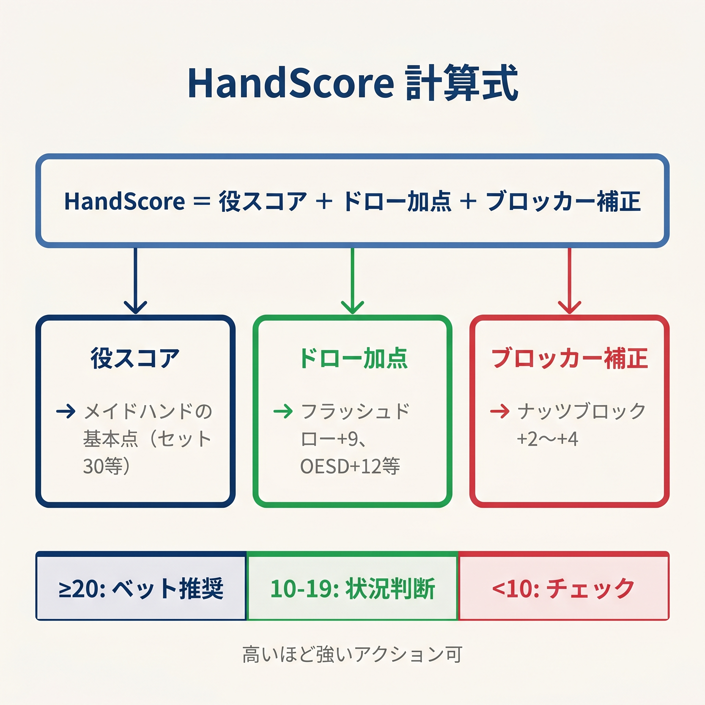
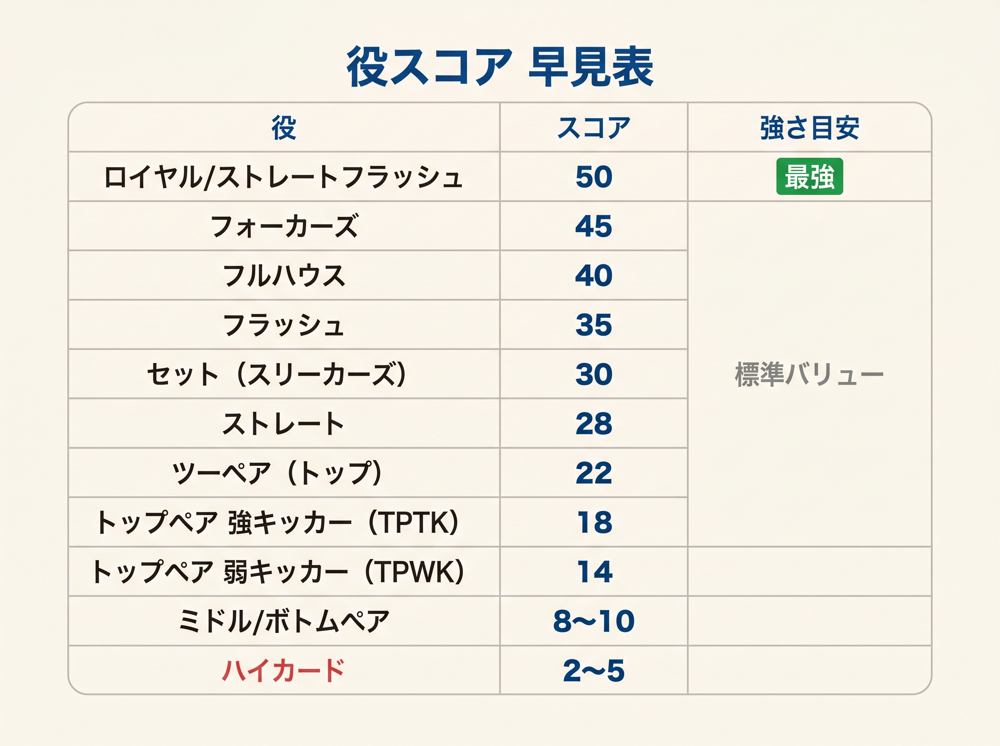
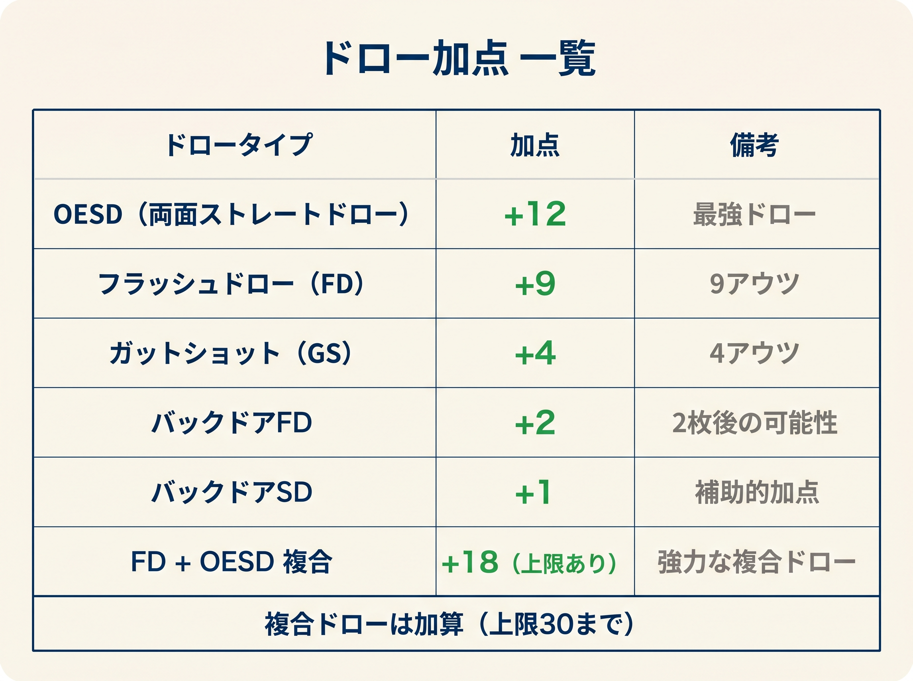
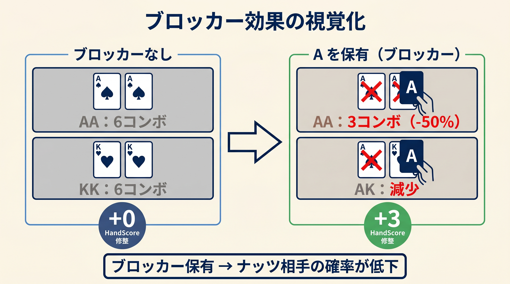

# 第9章　HandScore：フロップでの手の強さを数値化

<!-- markdownlint-disable MD033 MD040 MD060 -->
<!-- textlint-disable preset-ja-technical-writing/no-mix-dearu-desumasu -->
<!-- textlint-disable preset-jtf-style/4.2.9.ダッシュ(-) -->

> 🗺️ **現在地**:巻② / **[II 部 基礎・連続派]** / ch9「HandScore」（ハンド評価のコア ★★★、GTO 校正済）
> （本書全体の道具マップは「はじめに」末尾を参照）

フロップを見た瞬間、あなたは何を考えますか。
「トップペアが取れた」「フラッシュドローがある」——そこまでは分かっても、
「この手でベットすべきか」という判断になると途端に迷いが生じます。
第8章で簡易レンジスコア チェックリストによってCBet頻度の基準値を算出しました。
本章では「自分の手の強さ」を同じように数値化するHandScoreを導入します。
これが本書の中核となる第2の式です。

---

<figure><figcaption>HandScore = 役スコア + ドロー加点 + ブロッカー補正の式構造図</figcaption></figure>

<figure><figcaption>セット30・TPTK18・TPGK15・TPWK6等の役スコア早見テーブル</figcaption></figure>

<figure><figcaption>OESD +14 / FD +13 / GS +10のドロー加点一覧テーブル</figcaption></figure>

<figure><figcaption>ブロッカー保有時の相手ナッツコンボ減少とHandScore+3補正の視覚化</figcaption></figure>

## ボードだけでは判断できない

第8章でK♥7♦2♣ に簡易レンジスコア チェックリストを適用すると、トップK・レインボー・非ウェットの「ハイドライ」ボードとなりCBet基準頻度は85%になります。
ドライボードでCBetしやすいというのは正しい方向性です。
しかし、同じボードでも手が違えばまったく判断が変わります。

- KQを持っていれば、トップペア・グッドキッカー（TPGK）
- K5を持っていれば、トップペア・弱キッカー（TPWK）
- 77を持っていれば、セット
- JJを持っていれば、オーバーペア（ただしKにやられるリスクあり）
- A♥9♥ を持っていれば、ハイカードのみ

セット保有者とAハイ保有者が同じ判断をすれば、どちらかは致命的な誤りを犯します。
HandScoreは「自分の手がこのボードに対してどれほど強いか」を1つの数値で表し、
次章のCBet統合式に接続するための橋渡し役を担います。

---

## HandScore の定義

```
HandScore = 役スコア + ドロー加点 + ブロッカー
```

この式の三要素はそれぞれ独立した根拠を持ちます。
順番に見ていきましょう。

---

## 役スコア：確定した役の基礎点

フロップ時点で「すでに完成している役」を次のように点数化します。本書の値は **GTO Wizard の公開ソルバー解（PokerBench, 1456 サンプル）で校正済**で、ベット頻度との単調性を持ちます。

| ハンド | 役スコア |
|--------|:--------:|
| セット以上（セット、ストレート、フラッシュ） | 30 |
| オーバーペア | 20 |
| トップペア・トップキッカー（TPTK） | 18 |
| 2 ペア | 18 |
| トップペア・良キッカー（TPGK、A/K/Q） | 15 |
| セカンドペア・良キッカー（Q 以上） | 9 |
| トップペア・中キッカー（TPMK、8-T） | 8 |
| トップペア・弱キッカー（TPWK、J 以下） | 6 |
| アンダーペア（ポケットペア） | 6 |
| ボトムペア | 4 |
| セカンドペア・弱キッカー（J 以下） | 3 |
| ハイカードのみ（空振り） | 0 |

### なぜこの数値なのか

セットとトップペアの間には圧倒的な差があります。エクイティデータを見ると、セット vs トップペアで **約96%** のファボリットになります。この差は点数にも反映すべきです。

オーバーペアと TPTK がほぼ同点（20点 vs 18点）なのは、エクイティが拮抗しているからです。オーバーペア vs アンダーペアでは **約80%** のファボリットになります。

完成役の中では「セット以上」が別格、TPTK と 2 ペアが同等水準（18点）、TPGK が 1 段下、というのが GTO 整合の階層です。

### TPTK・TPGK・TPMK・TPWK の四段階

トップペアはキッカーの強さによって 4 段階に分けます。

- **TPTK（18点）**：キッカーがトップカードより高い最高キッカー。**K♥Q♠ on K♦7♣2♥** は K ペアでキッカー Q→ Q が K より下なので技術的には TPGK ですが、AK on K72r のような「Aキッカー」のときは TPTK と呼びます
- **TPGK（15点）**：トップペアでキッカーが Q 以上（K の K72r で AK / KQ など）。バリューは取れる
- **TPMK（8点）**：キッカーが 8-T（K の K72r で KT / K9 / K8）。**bet と check が拮抗するゾーン**
- **TPWK（6点）**：キッカーが J 以下のうち下半分（K の K72r で K5 / K3）。**ほぼショーダウン狙い、bet すべきではない**

この分類が重要な理由は、同じ「トップペア」でも将来のアクションに対するバリューが大きく違うからです。GTO Wizard の実測によれば、TPWK の bet 頻度は **約 9.6%**(つまり 9 割は check)、TPMK でも **約 23.5%**。TPWK で 3 ストリートのバリューベットを目指すと、相手の Kx より上のキッカー（K7, K8, KT, KJ, KQ, AK）に常に負けて stacks off するリスクが高いからです。

### セカンドペアの 2 段階

セカンドペアはキッカーで二分割します:

- **セカンドペア・良キッカー（9点）**:キッカーが Q 以上。GTO bet 頻度 **約 38.5%**で、bluff catcher としても機能
- **セカンドペア・弱キッカー（3点）**:キッカーが J 以下。GTO bet 頻度 **約 3.6%**でほぼ check 一択

ランダムなレンジ全体の中でトップペアを持っている相手は **約33%** にすぎず、残りの 67% に対してはセカンドペアが勝っている計算になります。ただし、セカンドペア・弱キッカーは大きなアクション（レイズやリレイズ）が来たときは素直に後退するのが賢明です。

---

## ドロー加点：未来のエクイティを現在点に換算する

フロップではまだ 2 枚のカードが残っています。ドローは「現在は役がないが、今後役になりうる期待値」を持ちます。次の表で覚えてください。

| ドローの種類 | アウツ数 | ドロー加点 |
|------------|:------:|:--------:|
| FD + OESD（モンスタードロー） | 15 | **+17** |
| FD + ガットショット | 12 | +14 |
| **OESD（裸）** | 8 | **+14** |
| フラッシュドロー（FD） | 9 | +13 |
| **ガットショット（裸）** | 4 | **+10** |
| 2オーバーカード | 6 | +7 |
| BDFD（バックドアフラッシュドロー） | 実効 ~3 | +4 |
| BDSD（バックドアストレートドロー） | 実効 ~3 | +2 |

### 公式ではなく表で覚える理由

「アウツ × N」のような単一係数では GTO 実測と整合しません。具体的には:

- ガットショット 4 アウツ → **GTO 上の bet 頻度 63.4%** でフラッシュドロー（62.2%）と同等。係数だと 4 × 2.5 = 10 相当
- OESD 8 アウツ → **bet 頻度 90.5%** でメイドハンド級。係数だと 8 × 1.75 = 14 相当
- FD 9 アウツ → bet 頻度 62.2%。係数だと 9 × 1.44 = 13 相当

つまりドロー種別ごとに係数が違います。**表で直接覚える**方式を採用しているのはこのためで、表は 8 行だけなので暗記負担は小さいです。

### 各ドローの戦略的意味

- **OESD（+14）**: メイドハンドではないがメイドハンド級の積極性で扱える。実 GTO bet 頻度 90.5% は TPGK（50%）を超えてセット以上に近い
- **ガットショット（+10）**: 4 アウツでも積極的に bet 候補。ストレート完成時にナッツに近い & 相手のレンジに脅威を与える
- **FD（+13）**: 9 アウツの強ドロー。ハーフポット bet が標準
- **モンスタードロー FD+OESD（+17）**: 100% bet。メイドハンドより強い場合もある（"フリーロール" 状態）

### BDFD の扱い

バックドアフラッシュドロー（BDFD）は、ターンとリバーの両方で同じマークが落ちる必要があります。実効アウツ約 3 枚として **+4 点**の固定加点。「あるとちょっとお得」程度の感覚が適切です。

ナッツ BDFD（A♠ を持って、ボードに ♠ が 1 枚）は **+6** と高めに評価できます（巻③ 第3章）。フロップの段階では本書の +4 で十分です。

---

## ブロッカー：相手のナッツを消す価値

ブロッカーは、自分の手札が「相手が特定の強いハンドを持つ可能性を排除する」効果です。

| ブロッカーの種類 | 加点 |
|----------------|------|
| ナッツブロッカー（例：スペード3枚ボードで A♠ を保有） | +3 |
| 上位セットブロッカー（例：K♠K♥ on K♦8♣3♠ のKK → セットをブロック） | +2 |

### なぜ +3 なのか

GTO Wizardの分析によると、ナッツブロッカーを持つことで相手のナッツコンボ数を最大 **12.7%** 削減できます。
この効果は「フォールドエクイティの向上」として現れます。
ブラフ時に相手がコールできる強いハンドが減ることで、ブラフの成功率が上がります。
フロップ段階では保有コンボがまだ多いため効果は限定的で、+3という控えめな加点が妥当です。

### ブロッカーを使う場面

ブロッカー加点は、主にブラフや半ブラフの文脈で機能します。
バリューハンドを持っているときは、相手のコールしてくるコンボ数を減らさない方が得なので、
ブロッカー加点を意識するのは「ドローや弱いハンドでどう動くか」を決めるときです。

---

## 具体例：HandScore を計算してみる

### 例1：KQ on K♦7♣2♥（ドライボード）

- K♥Q♠ を保有
- フロップはK♦7♣2♥（レインボー、スキャッター）
- ヒット：トップペア（K）、キッカー Q

計算：。

- 役スコア：TPGK（良キッカー Q）→ **15**
- ドロー加点：BDFDがある場合 +4、なければ0（ここでは仮にBDFDなしとする）→ **0**
- ブロッカー：特になし → **0**
- **HandScore = 15**

次章の9マスマトリクスでは、HandScore 15（強ハンド・境界値）× 簡易レンジスコア頻度85%（ハイドライ）の組み合わせとなりCBet 75% の判断になります。

### 例2：7♥7♣ on 7♠K♣2♦（セット）

- 7♥7♣ を保有
- フロップは7♠K♣2♦（レインボー）
- ヒット：ボトムセット

計算：。

- 役スコア：セット → **30**
- ドロー加点：なし → **0**
- ブロッカー：上位セット（KKK / 222）をブロックはしていない → **0**
- **HandScore = 30**

セットはそれだけで最高役スコアを誇ります。
次章のマトリクスでもHandScore 30（強）× 簡易レンジスコア頻度85%で「CBet 75% 以上」判断になる強いハンドです。

### 例3：A♥T♥ on 9♥8♥7♦（モンスタードロー）

- A♥T♥ を保有
- フロップは9♥8♥7♦（1枚フラッシュドローボード）
- ヒット：完成役なし。ただしOESD（6かJでストレート完成）+ FD（ハート9枚）

計算：。

- 役スコア：空振り → **0**
- ドロー加点：OESD + FD = 15アウツ → **+17**
- ブロッカー：ナッツブロッカーなし → **0**
- **HandScore = 17**

役スコアゼロにもかかわらずTPTK と同等の評価です。OESD + FD は相手の 1 ペアに対して **54〜60%** のファボリットになります。この手はセミブラフとして積極的に戦え、GTO 上の bet 頻度は実測 **100%**（最高クラス）です。

### 例4：K5o on K♦7♣2♥（TPWK）

- K♠5♣ を保有
- フロップはK♦7♣2♥（レインボー）
- ヒット：トップペア、キッカー 5（J 以下）

計算：。

- 役スコア：TPWK（弱キッカー 5）→ **6**
- ドロー加点：なし → **0**
- ブロッカー：特になし → **0**
- **HandScore = 6**

TPGK（15点）と比べて 9 点も低い評価です。次章の 9 マスマトリクスでは **H1（弱）バケツ** に入り、ほぼチェック一択。GTO 実測でも TPWK の bet 頻度は **9.6%**(約 9 割チェック) で、本書の判定と整合しています。

「トップペアだから bet」は誤り。**キッカー J 以下のトップペアは showdown 狙いの中ハンド**として扱ってください。

### 例5：JJ on K♦8♣2♥（オーバーペア病に注意）

- J♠J♣ を保有
- フロップはK♦8♣2♥（レインボー）
- ヒット：オーバーペア（ただしKより小さい）

計算：。

- 役スコア：オーバーペア → **20**
- ドロー加点：なし → **0**
- ブロッカー：特になし → **0**
- **HandScore = 20**

点数だけ見れば高い評価ですが、注意が必要です。
JJを持っているとき、フロップにオーバーカードが落ちる確率は **57%** もあります。
K♦8♣2♥ のボードではKがオーバーカードとして存在しており、相手がKヒットしているケースを常に意識しなければなりません。
オーバーペアの20点はあくまで「スタートラインの評価」です。
相手のレンジ構成やポジションを加味して、チェック・コール路線を選ぶべき場面も多いです。

---

## TPWK とセカンドペアの境界

実戦でよく迷う判断が「TPWK（6点）とセカンドペア（3-9点）の選択」です。

**K♠5♣ on K♦7♣2♥**（K72ドライボード）の場合：。

- トップペアがあるのでTPWKの **6点**を使います（キッカー 5 は J 以下なので弱キッカー枠）
- セカンドペア（7）はボードに無いハンドなので関係なし

**Q♠7♣ on K♦7♣2♥**（同じボード）の場合：。

- 7 がヒットしているのはセカンドカード（ミドルカード）なので、セカンドペア
- キッカーが Q（≥ Q）なのでセカンドペア・良キッカー → **9点**
- TPWK の 6 点よりむしろ高評価になる

**ポイント**:キッカーが弱いトップペア（K5o）よりも、キッカーが強いセカンドペア（QQでない単独 Q + 7）の方が高得点。これは GTO 実測 (TPWK=9.6%、セカンドペア強=38.5%) と整合します。

分類の基準は「どのカードがヒットしたか」です。
フロップの一番高いカードにヒットしていればトップペア、2番目ならセカンドペア、一番低いカードならボトムペアになります。
キッカーの強弱はトップペアの中での細分類に使います。

---

## 複合ハンドの扱い

メイドハンドとドローを両方持っている場合は、役スコアとドロー加点を両方足します。

例：K♥Q♥ on K♣T♥2♥（TPGK + バックドアフラッシュドロー）

- 役スコア：TPGK → **15**
- ドロー加点：BDFD → **+4**
- ブロッカー：特になし → **0**
- **HandScore = 19**

FDが完成している場合（例：K♥Q♥ on K♣9♥2♥ でハートが3枚ならFD）：。

- 役スコア：TPGK → **15**
- ドロー加点：FD（9アウツ）→ **+13**
- ブロッカー：特になし → **0**
- **HandScore = 28**

セットに迫る点数になります。
役とドローの組み合わせが強さを大きく左右することが分かります。

---

## ボードテクスチャによる EV の変化

HandScoreは「ハンド単体の評価」ですが、同じハンドでもボードが変わると実際のEV（期待チップ）は大きく変わります。

Upswing Pokerの分析によれば：。

| ボード | ハンド | EV（チップ） |
|--------|--------|------------|
| T-9-3 レインボー | AT（TPTK） | **67.8** |
| T-9-8 コネクテッド | AT（TPTK） | **37.9** |

同じTPTKでも、コネクテッドボードではEVがほぼ半分になります。
HandScoreの「18点」というスコアは変わらなくても、簡易レンジスコア チェックリストで算出されるCBet基準頻度が低いボードでは最終的な判断も慎重方向にシフトします。
HandScoreはハンドの評価、簡易レンジスコアはボードのレンジ頻度評価——この2つが次章の9マスマトリクスで組み合わさることで、初めて正確な判断が得られます。

---

## 【GTOとのズレ】：ソルバーは連続値、本書は離散値

GTOソルバーはすべての手を「エクイティ」という連続値で評価します。
AK on K♦7♣2♥ とKQ on K♦7♣2♥ の間にも数%のエクイティ差が存在し、
最適な混合戦略（例：AKは80% でベット、KQは70% でベット）が導き出されます。

一方、HandScoreは離散値（18点、15点、10点…）で分類します。
このため、次のような「ズレ」が生じます。

**ズレが小さい場面：**

- ドライボードのトップペア以上：HandScoreの分類とGTOの推奨が概ね一致
- モンスタードローのセミブラフ：どちらも積極的なアクションを支持

**ズレが大きい場面：**

- 「15点（TPGK）と13点（FD）の間のような境界」：GTOではハンドごとに細かく違う周波数を設定するが、本書では同じ分類になる場合がある
- Range CBet：GTOではドライボードでレンジ全体を高頻度・小サイズでCBetすることがある。しかし本書ではHandScoreが低い手はチェックを推奨するケースもある
- ミックス戦略：GTOはある手を「50% の確率でベット、50% でチェック」のように混合するが、本書は単一の判断（ベットかチェック）に落とし込む

**実戦での対処法：**

本書のHandScoreを使った判断は「最善に近い判断」を高速で出すことを目的としています。
GTOの細かいミックス戦略と完全一致させることは目指していません。
初級者から中級者の段階では「おおむね正しい方向」に動けることの方が重要です。
将来GTO Wizardなどのソルバーを使い始めたとき、HandScoreの分類がソルバーの推奨と近い位置にあることで、スムーズな移行ができます。

---

## まとめ

- **HandScore = 役スコア + ドロー加点 + ブロッカー**（3要素の合計）
- 役スコアは **セット以上 30 / OP 20 / TPTK 18 / TPGK 15 / セカンドペア強 9 / TPMK 8 / TPWK 6 / アンダーペア 6 / ボトムペア 4 / セカンドペア弱 3 / 空振り 0**
- ドロー加点は表で覚える（公式は廃止）:**FD+OESD +17 / OESD +14 / FD +13 / FD+ガット +14 / ガットショット +10 / 2 オーバー +7 / BDFD +4 / BDSD +2**
- ブロッカーは限定的な加点（+2〜+3点）
- バケツ:**H3 ≥14（強）/ H2 7-13（中）/ H1 <7（弱）**
- 同じハンドでもボードが変わるとEVは大きく変化する（HandScoreは一定だが、統合式の入力が変わる）
- スコアは GTO Wizard 実測（PokerBench, 1456 サンプル）で校正済み——ベット頻度との単調性を持つ
- GTOソルバーは連続値、本書は離散値——細かいズレは許容し「方向性の正しさ」を優先する
- JJ on KハイボードのようにHandScoreが高くても文脈的に危険な手は存在する（オーバーペア病に注意）

次章では、このHandScoreの強度分類（強・中・弱）と第8章の簡易レンジスコア チェックリストで得たCBet基準頻度（高・中・低）を9マスマトリクスで組み合わせた実践的な判断フローを学びます。

---

## ミニクイズ

### Q1

9♠9♥ を保有し、フロップがJ♦9♣3♥（レインボー）の場合、HandScoreを計算してください。

<details>
<summary>解答</summary>

- 役スコア：ミドルセット → **30**
- ドロー加点：なし → **0**
- ブロッカー：なし → **0**
- **HandScore = 30**

セットは役スコアだけで最高点を叩き出します。
次章のマトリクスでは、簡易レンジスコアでJ♦9♣3♥のCBet基準頻度（トップJかつ非ウェットで55%）とHandScore 30（強）を組み合わせてCBetサイズを決定します。

</details>

---

### Q2

A♣K♣ を保有し、フロップがK♠Q♣J♣（クラブ2枚＋コネクテッド）の場合、HandScoreを計算してください。

<details>
<summary>解答</summary>

- 役スコア：トップペア（K）、キッカー A → **TPTK = 18**
- ドロー加点：クラブが2枚あるのでFD（9アウツ）→ **+13**
- ブロッカー：なし → **0**
- **HandScore = 31**

TPTK + FDという強力な複合ハンドです。
ただしボードはKQJコネクテッド（ウェット・2-tone）なので、簡易レンジスコアでのCBet基準頻度は55%に下がります。
次章のマトリクスではHandScore 31（強）× 簡易レンジスコア頻度55%（ハイウェット）となり、強いハンドながらCBetサイズを慎重に選ぶ場面です。

</details>

---

### Q3

次の3つのハンドをK♦8♣2♥ ボードで評価し、HandScoreが高い順に並べてください。
（a）J♠J♥（b）K♣9♣（c）8♦8♠。

<details>
<summary>解答</summary>

（a）J♠J♥：オーバーペア = **20点**

（c）8♦8♠：セカンドカード（8）でセット = **30点**

（b）K♣9♣：トップペア（K）、キッカー 9 → TPWK境界付近。9はJより低いのでTPWK = **10点**

高い順：（c）30点 →（a）20点 →（b）10点。

（a）のオーバーペア（JJ）は20点と高いですが、K♦8♣2♥ ボードではKヒットのリスクがあることを忘れてはなりません。
（c）のセットが圧倒的に強く、積極的にポットを拡大すべきです。

</details>

---

## 出典

- [Beginners Equity Guide to Standard Situations – PokerListings](https://www.pokerlistings.com/poker-guides/beginners-equity-guide-to-standard-situations-in-no-limit-holdem)
- [How to Play Top Pair Top Kicker in Cash Games – Upswing Poker](https://upswingpoker.com/top-pair-top-kicker/)
- [How to Play Top Pair Weak Kicker – Upswing Poker](https://upswingpoker.com/top-pair-weak-kicker/)
- [5 Easy Ways to Stop Overplaying Your Overpairs – BlackRain79](https://www.blackrain79.com/2019/01/overplay-overpair.html)
- [Checking Flops with Overpairs: When Should You Do It? – Upswing Poker](https://upswingpoker.com/when-to-check-overpairs/)
- [How to Play Combo Draws on the Flop – PokerListings](https://www.pokerlistings.com/strategy/playing-combo-draws-on-the-flop)
- [Understanding Blockers in Poker – GTO Wizard Blog](https://blog.gtowizard.com/understanding-blockers-in-poker/)
- [Equity Realization – GTO Wizard Blog](https://blog.gtowizard.com/equity-realization/)
- [Developing a Feel for Equities – FlopTurnRiver](https://flopturnriver.com/poker-strategy/developing-feel-equities-in-no-limit-holdem-part-5-hitting-pairs-20478/)
