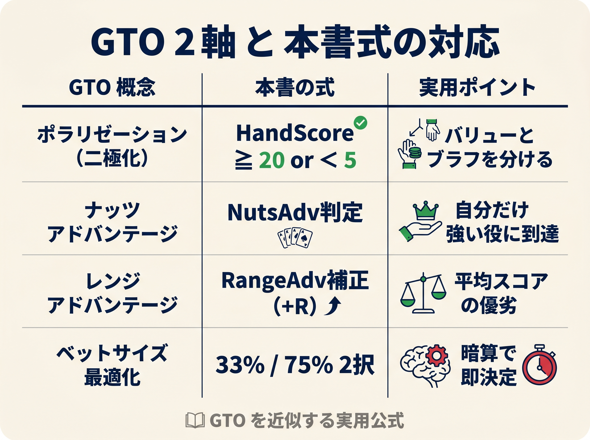

# 第12章　この式が GTO と外れるところ：CBet 編

<!-- markdownlint-disable MD060 -->
<!-- textlint-disable preset-ja-technical-writing/no-exclamation-question-mark -->
<!-- textlint-disable preset-ja-technical-writing/no-mix-dearu-desumasu -->

本書のCBet統合式は、フロップの判断を「数字で再現」するための道具です。
しかし、その式はGTOソルバーが出す最適解とは構造的に異なります。
本章では「どこで、どのように外れるのか」を具体的に示したうえで、「それでも初級者にとっては十分な理由」を説明します。
GTOを知ったうえでシンプルにするのと、知らずにシンプルにするのでは、結果に大きな差が生まれます。

---

<figure><figcaption>GTO2軸（ポラリゼーション・NutsAdv・RangeAdv）と本書式の対応テーブル</figcaption></figure>

## 導入：CBet 式は GTO の近似、完璧ではない

本書のCBet判断フロー（「簡易レンジスコア チェックリストで頻度帯を確認し、9マスマトリクスでハンド別アクションを決める」方式）は、GTOソルバーの膨大な出力から「初級者が実行できる形」に圧縮した近似です。
近似には必ずズレが生じます。
大切なのは「ズレがどの方向にあるか」を理解しておくことです。

GTOソルバーは3つのことを同時に行います。

1. 相手のレンジ全体を評価し、レンジアドバンテージを計算する
2. 混合戦略（ベット○%、チェック○%）でバランスを取る
3. 複数のベットサイズを場面ごとに使い分ける

本書の式はこれらを「決定論的なスコアと閾値」に置き換えています。
そのズレを把握することが、式の限界を知り、上達のロードマップを描くうえで不可欠です。

---

## 12-1　マルチウェイでは式が通用しない（第16章で詳述）

最初に最も重要なズレを予告しておきます。
本書の判断フローはヘッズアップ（1対1）を前提に設計されています。
マルチウェイ（3人以上）では、同じHandScoreや同じ簡易レンジスコア頻度帯でもベットの採算が大きく変わります。

GTO Wizardは「マルチウェイポット10のヒント」でこう述べています。

> "Stop rangebetting. Give up more often with trash.
> Tighten your value betting thresholds."

ヘッズアップでは相手が広く守備しなければ搾取されます。
しかしマルチウェイでは防御コストが複数プレイヤーに分散されるため、各プレイヤーは個別に狭い守備で済みます。
結果としてブラフの期待値が大幅に下がり、CBet頻度はヘッズアップの50〜70%から20〜30%程度へ急落します。

本書では第16章でマルチウェイ専用の調整ルールを設けています。
本章で扱う乖離ポイントは、すべてヘッズアップ（またはヘッズアップに近い状況）での話です。

---

## 12-2　モノトーンの逆説：危険だからこそ小さく打つ

モノトーンフロップ（3枚が同じマーク、例：K♠8♠3♠）は、簡易レンジスコア チェックリストではStep 1で即座に「20%（低頻度帯）」と判定されます。
低頻度帯のボードはチェック寄りに設計されています。

ところがGTOソルバーの分析では、モノトーンフロップはむしろ「小サイズで高頻度ベット」が最適とされます。

この逆説の理由は以下の2点です。

**理由1：フロップ完成フラッシュは実は少ない。**
モノトーンフロップで相手がすでにフラッシュを完成させている確率は5〜6%程度にすぎません。
大半の相手はフラッシュドローを持っているか、あるいはフラッシュとは無関係の役を持っているだけです。

**理由2：ブロッカーを持つハンドがコーリングレンジを絞る。**
フラッシュドローを持つ側は相手のフラッシュ可能性を下げるため、大きなベットにより自信を持ってコールできます。
だからこそGTOは小さいサイズで、広いレンジのまま打ちます。

**本書との乖離まとめ：**
GTOは「危険だからこそ小サイズで高頻度ベット」、本書は「危険だからチェック」という方向です。
初級者にとって「チェック寄り」は機会損失にはなりますが、大きなミスを防ぐ効果もあります。
モノトーンフロップで小さく打つ技術は、本書を卒業した後の次のステップです。

---

## 12-3　ペアードボードの逆説：本書が保守的すぎる場面

ペアードフロップの簡易レンジスコアモデルでは **AA/KK/QQ を個別のパターン** に分離し、GTO 実測値（AA-X ≈ 100%、KK-X ≈ 90%、QQ-X ≈ 80%）に直接対応させています。

| ボード | 簡易レンジスコア 新モデル | GTO CBet 頻度（IP） | 誤差 |
|--------|------------|-------------------|------|
| AA-X | 100% | 約100%（小サイズ） | ≈0 |
| KK-X | 90% | 約90% | ≈0 |
| QQ-X | 80% | 約80% | ≈0 |
| JJ-TT 中低ペア | 72% | 約60〜70% | +2〜12% |
| A/K ハイ + ローペア | 45% | 約43% | ≈0 |

なぜペアードボードが高頻度かというと、相手（BB）がトリップスを持っている確率が非常に低いからです。ペアードボードではレイザー側のレンジアドバンテージが絶大で、「レンジ全体で小さく打ち続ける」のが最適になります。

**本書との残存乖離：**
ハイペアード（AA/KK/QQ）の簡易レンジスコア頻度はGTOと整合しましたが、本書式ではHandScoreが低いハンド（弱めの手）はチェックバックします。GTOではAA-X/KK-X上の弱いハンドも含めた**レンジベット**が正解であり、この部分の乖離は残ります。また TT-X（中低ペア 72% vs GTO 55〜60%）は本書がやや高めです。

---

## 12-4　混合戦略の不在：決定論の損失は小さい

GTOでは「同じハンドをAという場面でベット60%・チェック40%でランダムに混ぜる」という混合戦略（ミックス戦略）が頻繁に登場します。
これは相手に「チェックを見てハンドを読む」機会を与えないための設計です。

本書の式は純粋戦略（決定論）です。
HandScoreが閾値以上なら必ずベット、未満なら必ずチェックと決まります。

この違いによるEVの損失はどの程度でしょうか。

**Run It Once の研究によると、対称的な逸脱（あるハンドを予定より多くベットし、別のハンドを同量少なくベット）はトイゲームでEV損失がゼロ**です。
実際のマルチストリートゲームでは累積的な損失が生じますが、GTO Wizardの原則研究では、混合ノードで発生する2つのアクションのEV差は多くの場合0.5〜2bb程度にとどまります。

また、人間が混合戦略を「正確に」実装するのは困難です。
「なんとなく60:40」で混ぜようとすると、感覚頼りになり「なんとなく混合」という最悪のパターンに陥ります。
純粋戦略（決定論）は実装が完全になるため、エラーが生じません。

**本書との乖離まとめ：**
混合戦略の欠如は理論上のEV損失を生みますが、その損失は小さく、実装エラーのコストより低いと考えられます。
初級者にとって「確実に実行できる純粋戦略」は「不完全に実行する混合戦略」より優れています。

---

## 12-5　プリフロップレンジ優先、テクスチャは従：本書は逆

GTO Wizardの研究は、CBet戦略の主ドライバーについてこう結論づけています。

> "Pre-flop range dynamics, not board texture, are the primary drivers of continuation betting strategy."
> — GTO Wizard, Flop Heuristics: IP C-Betting in Cash Games

GTOの視点では、CBet**頻度**はレンジアドバンテージ（レンジ全体での形勢）が決定し、CBet**サイズ**はナッツアドバンテージ（強いハンドの偏り）が決定します。
ボードテクスチャは「プリフロップで確立されたアドバンテージを拡大または縮小する」補助的な役割です。

しかし本書の構造では簡易レンジスコア チェックリスト（テクスチャ評価）が頻度判定の中核に置かれています。
プリフロップレンジとの相互作用は明示的にモデル化されておらず、テクスチャを主ドライバーとして扱っています。

**乖離が顕在化する典型例：**

BTN vs BBでフロップがT♦9♣8♠（ウェット）のとき、簡易レンジスコア頻度は低頻度帯（30%程度）となりチェックが推奨されやすくなります。
しかしBTNのオープンレンジはBBより幅広く、GTOでは中程度の頻度でCBetを継続します。

逆にUTG vs BBでK♥7♣2♦（ドライ）のときは、UTGのレンジアドバンテージが大きく本書式とGTOの結論が一致します。

**本書との乖離まとめ：**
テクスチャを主に見る本書式は、レンジアドバンテージが大きいポジション（UTG等）の「ドライボード」では正確に機能します。
しかし「テクスチャはウェットだがレンジ有利」という複雑な場面では精度が落ちます。
この構造的限界は、本書の用途（初級者向け暗算ルール）の範囲内では許容できます。

---

## 12-6　それでも本書式を使う理由：GTO Wizard 自身がシンプル化を推奨（2025年）

ここまでで5つの乖離ポイントを示しました。
では本書式を使う理由は何でしょうか。

**GTO Wizard 自身が「シンプル化」の方向に舵を切っています。**

2025年にリリースされた**Single Size Solutions（シングルサイズ・ソリューション）**では、ライブラリを50倍以上に拡大しながらも、各スポットで「最高EVの1サイズのみ」を提示する方針を採用しました。
GTO Wizardはその設計思想をこう説明しています。

> "Taking out mixed frequencies and multiple bet sizes will result in a drop in EV, but it will make the strategy much easier to implement, giving you an advantage at the tables."
> — GTO Wizard, Single Size Solutions Are Live（2025年）

複数サイズより1サイズのほうが実テーブルでの実装精度が上がり、トータルEVが向上するというのが実証的な立場です。
さらに「2サイズ対3サイズ」でEV差は最小化されると示しており、シンプル化の損失は理論上の最適から小さいことが確認されています。

本書の式が「閾値で判定する純粋戦略」を採用する姿勢は、GTO Wizardの「Simplified Solutions」の思想と同じ方向です。
GTOを完全実装するよりも、「確実に実行できるシンプルなルール」のほうが実戦で勝てるという考え方です。

**もう一つの根拠：相手も GTO を実装していない。**
GTOからの逸脱が大きなEV損失を生むのは、相手が完璧なGTOを実行している場合のみです。
初級〜中級のゲームでは相手も非最適なプレイをしており、シンプルな決定論的戦略でも正の期待値を確保できます。

### GTO との乖離マップ（まとめ）

| ボードタイプ | 本書式の判定 | GTO の正解 | 乖離の方向 |
|-------------|------------|-----------|-----------|
| ドライ・レインボー | 中頻度ベット | 高頻度・小サイズ | 本書がやや少なめ |
| モノトーン | 低頻度ベット | 中頻度・小サイズ | 本書が少なすぎ |
| ハイペアード（AA/KK/QQ-X） | AA100%/KK90%/QQ80% | 同左 | 簡易レンジスコア頻度は整合（ただしレンジベットは未実装） |
| ウェット・コネクテッド | 中〜高頻度 | 中頻度・大サイズ | 本書がサイズ小さめ |
| マルチウェイ | 式をそのまま適用 | 大幅頻度減少 | 本書が多すぎ（第16章で対処） |

---

## まとめ

- 本書のCBet統合式はヘッズアップを前提とした決定論的な近似である
- GTOとの主な乖離ポイントは「マルチウェイ」「モノトーン」「ハンドスコア閾値」の3つ
- ハイペアード（AA/KK/QQ）の頻度は簡易レンジスコアでGTO整合済み
- マルチウェイは第16章で対処。モノトーンとHandScore閾値は「稼ぎ損ね」だが大きなミスではない
- 混合戦略の欠如によるEV損失は小さく、人間の実装エラーより小さい
- プリフロップレンジを主ドライバーにするGTOと、テクスチャを主ドライバーにする本書とは構造的に異なるが、多くの場面で結論は重なる
- GTO Wizard自身が2025年にシンプル化（Single Size Solutions）を推奨しており、本書の方向性は支持されている
- 「GTOを知ったうえでシンプルにしている」と「知らずにシンプルにしている」は、上達の速度と限界の意識において大きく異なる

> **巻③ で深掘り**:本章は巻② 内のズレ要約。**全章横断の「GTO とのズレ統合マップ」**は巻③ 付録 K にあり、4 源泉（離散化 / 単一決定 / モデル簡略 / シナリオ前提）× 13 章 × ズレ大小マトリクスで詳細整理されている。

---

## ミニクイズ

**Q1.** BTN vs BBで、フロップがA♠A♦7♣（エースペアード）のとき、GTOはどのような戦略を取るでしょうか？本書式と比較してください。

**解答：** GTOはこのボードでBTNから約100%の高頻度でCBetします（小サイズ、ポットの約1/3）。BBがエースを持っている確率が低く、BTNのレンジアドバンテージが絶大だからです。本書式ではHandScoreが低いハンド（例：ポケットペア中程度）はチェックバックになります。この場面では本書式のほうがチェック頻度が高く、稼ぎ損ねが生じます。

**Q2.** モノトーンフロップで「チェックよりも小さくベットする」のが正しい理由を説明してください。

**解答：** フロップ時点でフラッシュが完成している確率は5〜6%程度にすぎません。大半の相手はフラッシュドローを持っているか、フラッシュ無関係の役だけです。したがって、フラッシュ未完成の強いハンドでバリューを取る機会があります。危険なボードだからこそ「相手を大きく釣ることはせず、小さいサイズで広く打ち続ける」のがGTOの考え方です。本書は初級者の安全を優先してチェック寄りにしていますが、将来的には小サイズCBetを覚えることが成長への道です。

**Q3.** 本書式が決定論（純粋戦略）を採用している理由を、GTO Wizardの姿勢と関連づけて説明してください。

**解答：** GTO Wizardは2025年にSingle Size Solutionsを導入し「混合頻度と複数サイズを取り除くとEVはわずかに下がるが、実テーブルでの実装精度が上がりトータルEVが向上する」と説明しています。本書の決定論的な閾値判定も同じ発想です。混合戦略を不完全に実行するEV損失より、シンプルなルールを完全に実行するほうがトータルで有利だという実証的な立場に基づいています。

---

> **補足（次巻への接続）**: 本章で列挙したGTOとのズレのうち、「境界CBetの決定論的な扱い」「サイズパターンの固定化」「チェックレンジの弱さ」の3点は、次巻の混合戦略ルールを適用することで部分的に縮まります。残る乖離（レンジ全体の同時最適化など）は次巻で引き続き整理します。

## 出典

- GTO Wizard, "Flop Heuristics: IP C-Betting in Cash Games", <https://blog.gtowizard.com/flop-heuristics-ip-c-betting-in-cash-games/>
- GTO Wizard, "Aggregate Flop Strategy: SB C-Betting in SRP", <https://blog.gtowizard.com/aggregate-flop-strategy-sb-c-betting-in-srp/>
- GTO Wizard, "Maximizing Value on Monotone Flops", <https://blog.gtowizard.com/maximizing-value-on-monotone-flops/>
- GTO Wizard, "10 Tips for Multiway Pots in Poker", <https://blog.gtowizard.com/10-tips-multiway-pots-in-poker/>
- GTO Wizard, "Single Size Solutions Are Live", <https://blog.gtowizard.com/single-size-solutions-are-live-new-pricing-50x-more-solutions/（2025年）>
- GTO Wizard, "Principles of GTO", <https://blog.gtowizard.com/principles-of-gto/>
- GTO Wizard, "Exploitative Dynamics", <https://blog.gtowizard.com/exploitative-dynamics/>
- Upswing Poker, "10 Spots to Continuation Bet 100%", <https://upswingpoker.com/when-to-c-bet-everything/（2024年）>
- PokerCoaching.com, "C-Betting On Paired Boards", <https://pokercoaching.com/blog/c-betting-on-paired-boards/>
- Run It Once, "Theory: Symmetrical Deviations from Mixed Betting Frequencies", <https://www.runitonce.com/nlhe/theory-do-symmetrical-deviations-from-mixed-betting-frequencies-lose-ev-in-gto/>
