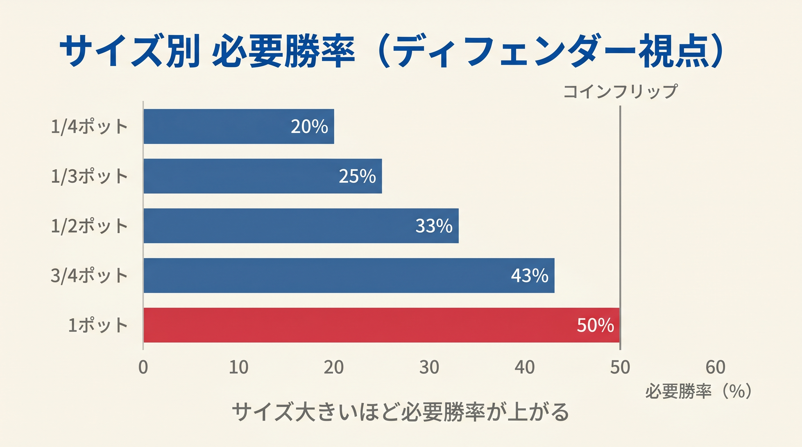
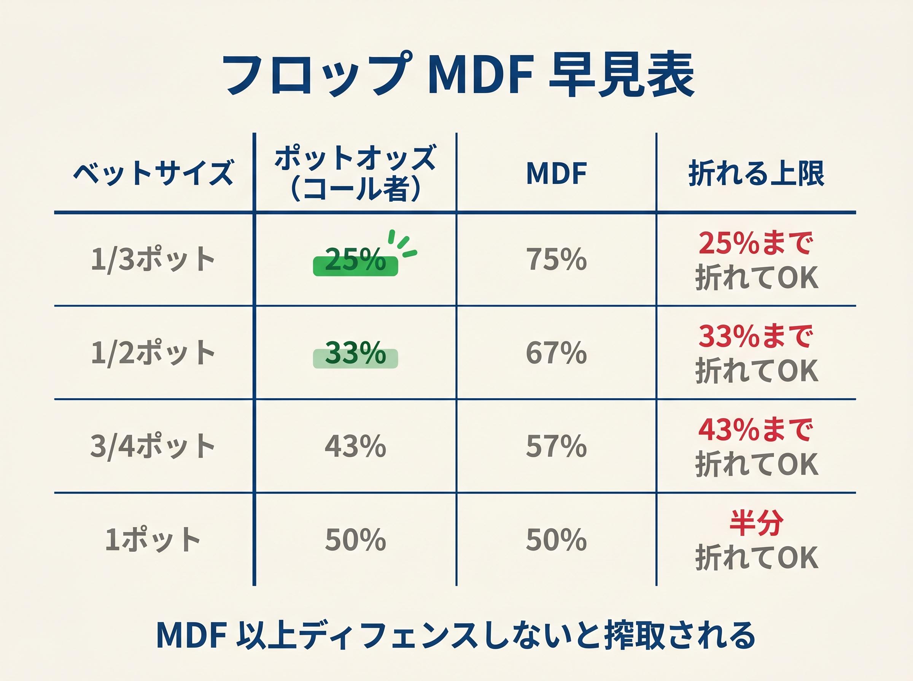

# 第12章　ポットオッズと防衛感覚（MDF 軽量化版）

<!-- markdownlint-disable MD033 MD036 MD040 MD060 -->
<!-- textlint-disable preset-ja-technical-writing/no-exclamation-question-mark -->
<!-- textlint-disable preset-ja-technical-writing/no-mix-dearu-desumasu -->

> 相手の CBet に毎回フォールドするプレイヤーは、ブラフを打つ側に「無料の利益」を渡している。
> 「折りすぎない」という感覚を身につけるだけで、勝率は大きく変わる。

## はじめに

前章まで「CBetを打つ側」の判断を学んできました。
第III部の本章からは「CBetを受ける側」の視点に切り替えます。

相手がCBetを打ってきたとき、あなたはどう応じますか？
手が弱いからとりあえずフォールド、というパターンに陥っていないでしょうか。
実は「折りすぎ」はポーカーで最もコストの高い習慣のひとつです。

本章ではポットオッズの基本を確認し、「ベットサイズに応じてどのくらいの頻度でコールすれば良いか」という防衛感覚を身につけます。
MDF（Minimum Defense Frequency）の計算式を暗記する必要はありません。
まず「感覚のルール」を覚え、式はコラムで参照する程度で十分です。

---

<figure><figcaption>1/4〜1ポットの各ベットサイズに対するディフェンダーの必要勝率（20%〜50%）棒グラフ</figcaption></figure>

<figure><figcaption>フロップのベットサイズ別MDF（最低防御頻度）早見テーブル</figcaption></figure>

## 12-1　CBet に対する3つの基本的な応答

フロップで相手がCBetを打ってきたとき、あなたの選択肢は3つです。

| 選択肢 | 意味 | 使いどころ |
|--------|------|-----------|
| **コール** | ハンドを続ける | エクイティが十分にあるとき |
| **フォールド** | ハンドを捨てる | エクイティが低く、実現見込みもないとき |
| **レイズ** | 逆にプレッシャーをかける | 強い役・強いドロー、または読みがあるとき |

この3択の中で、初級者が最も多く失敗するのは「フォールドしすぎ」です。
手が強くないからといって、毎回フォールドするとどうなるでしょうか。

相手は「ベットすれば毎回通る」と認識します。
すると相手はブラフを打ち続けるだけで、リスクなしに利益を積み上げられます。
これが「過剰フォールド」が相手に利益を与える仕組みです。

**感覚ルール：33% のような小さいベットには基本コール、75% 以上になって初めて絞る。**

この1行が本章の核心です。以降でその根拠と実践的な使い方を説明します。

---

## 12-2　ポットオッズの復習（フロップ版）

ポットオッズとは「このコールにかかるコストと、見返りのバランス」を示す指標です。
計算式は次の通りです。

```
必要勝率（%）= コール額 ÷（コール後の総ポット）× 100
```

具体例で確認しましょう。
ポットが100チップで、相手が50チップをベットしてきた場面を想定します。

```
コール後の総ポット = 100（既存ポット）+ 50（相手のベット）+ 50（自分のコール）= 200
必要勝率 = 50 ÷ 200 = 0.25 → 25%
```

つまり自分のハンドがこの場面で25% 以上の勝率を持っていれば、コールは数学的に正当化されます。

### ベットサイズ別の必要勝率一覧

| ベットサイズ（ポット比） | 必要勝率 | 感覚的な覚え方 |
|----------------------|---------|-------------|
| 33%（1/3 ポット） | 約 20% | 5回に1回勝てれば OK |
| 50%（1/2 ポット） | 約 25% | 4回に1回勝てれば OK |
| 75%（3/4 ポット） | 約 30% | 3回に1回勝てれば OK |
| 100%（ポットサイズ） | 約 33% | 3回に1回強く勝てれば OK |

この数値と「自分のハンドの実際の勝率」を比べてコール判断を下します。

### 計算なしで判断するコツ

「必要勝率を暗算するのが面倒」という方は、次のルールで代用できます。

- 相手のベットが **ポットの半分以下** → 多くのハンドでコールが成立しやすい
- 相手のベットが **ポットの3/4 以上** → 手が弱ければフォールドも視野に入れる
- **ポットサイズ以上のオーバーベット** → ハンドの強さを慎重に評価する

---

## 12-3　防衛感覚：ベットサイズ別の「コールする割合」

ポットオッズは「このハンドをコールすべきか」という**個別の判断**に使います。
一方、「自分がどのくらいの頻度でコールしているか」という大局的な視点も必要です。

相手がブラフを打っても利益にならないよう、自分のレンジ全体でそこそこの頻度でコールする必要があります。
この考え方を **MDF（Minimum Defense Frequency、最低防衛頻度）** と呼びます。

式を暗記する必要はありません。
大切なのは「ベットサイズに応じた防衛の目安」を感覚として持つことです。

### 防衛感覚の目安表

| ベットサイズ | 防衛感覚の目安 | 具体的に言うと |
|------------|-------------|-------------|
| 33%（小さいベット） | 4回中3回はコール以上 | ほとんどのハンドでコール |
| 50%（中くらいのベット） | 3回中2回はコール以上 | 多くのハンドでコール |
| 75%（大きめのベット） | 半分強はコール | 弱いハンドから絞り始める |
| 100%（ポットサイズ） | 半分はコール | 強いハンドに絞る |

「半分コール」という感覚に違和感を覚える方もいるでしょう。
ポットサイズのベットに半分コールするのは多すぎると感じるでしょうが、これが「ブラフを抑止するために必要な防衛」です。

### 感覚ルールのおさらい

本章のシンプル原則をもう一度確認します。

> **33% ベットに対しては基本コール、75% 以上で初めて絞る。**

33% のような小さいベットは相手にとってリスクが少なく、ブラフの可能性が高まります。
だからこそ、こちらも高い頻度でコールしてブラフを罰する必要があります。
75% 以上の大きいベットは相手にとってリスクが大きく、バリューの可能性が高くなります。
ここで初めてフォールド頻度を上げても良いのです。

---

## 12-4　OOP 補正：必要勝率を +5〜7% 上乗せする

ポットオッズの計算は「自分がIP（インポジション）にいる場合」を基準にしています。
しかしOOP（アウトオブポジション、相手より先に行動する側）では状況が変わります。

### OOP の不利

OOPでは次のような不利があります。

- 相手がチェックしてきてから行動できない（ターン・リバーでの行動権を後出しされる）
- 相手のベットによって自分のエクイティが「剥奪」されやすい
- 自分がチェックした後に相手にフリーカードを与えるリスクがある

この「ポジションの不利」により、OOPではエクイティの実現率が低下します。
GTO Wizardのデータによると、OOPプレイヤーのエクイティ実現率はIPの約79% 程度になる場合があります。

### 実務的な OOP 補正

計算を複雑にしないために、次のシンプルなルールを使います。

```
OOP での必要勝率 = ポットオッズの必要勝率 + 5〜7%
```

具体例で確認します。

| ベットサイズ | IP での必要勝率 | OOP での目安 |
|------------|-------------|------------|
| 33% | 20% | 25〜27% |
| 50% | 25% | 30〜32% |
| 75% | 30% | 35〜37% |
| 100% | 33% | 38〜40% |

BB（ビッグブラインド）ポジションはほぼ常にOOPになるため、この補正を意識することが特に重要です。

---

## 12-5　実戦での簡易判定（HandScore を使った決め方）

本書のHandScoreを使うと、コール判断を素早く行えます。

### 判定の流れ

1. 自分のHandScoreを計算する
2. 相手のベットサイズを確認する
3. 補正（OOPの場合は +5〜7%）を加える
4. ハンドの勝率と必要勝率を比較する

### HandScore から勝率を推定する簡易換算

正確な勝率計算は複雑ですが、HandScoreを次のように使います。

| 状況 | HandScore の目安 | 推定勝率（大まかな目安） |
|------|---------------|-------------------|
| セット以上 | 30以上 | 70%超（強いコール・レイズ推奨） |
| トップペア以上 | 15〜29 | 40〜70%（基本コール） |
| セカンドペア・弱いペア | 8〜14 | 20〜40%（サイズ次第でコール） |
| ハイカード・ドローのみ | 7以下 | 20%未満（フォールド傾向） |

### 実例：50% CBet に対する判断

ポット100チップ、相手が50チップをベット（50% サイズ）した場面を考えます。
必要勝率は25%（IP）または30〜32%（OOP）です。

**ケース1：A♠K♦ / K♥7♦2♣（TPTK）**

- HandScore = 18（トップペア・トップキッカー）
- 推定勝率：約65〜70%
- 判定：25% を大きく上回る → **コール以上（レイズも検討）**

**ケース2：T♥9♥ / K♠7♣2♦（完全な空振り、ガットショットのみ）**

- HandScore = 6（ガットショット4アウツ × 1.5 = 6点、役スコア0）
- 推定勝率：フロップ時点で約16〜20%
- IPなら25% 未満 → **フォールド寄り**、OOPならほぼフォールド

**ケース3：8♦8♣ / K♠7♦3♣（アンダーペア）**

- HandScore = 6（アンダーペアの役スコア6点）
- 推定勝率：約25〜35%（相手のレンジ次第）
- 判定：ボーダーライン → 相手のプレースタイルを加味して判断

---

## 【GTOとのズレ】コラム

### 厳密な MDF 計算式

本章で「感覚論中心」と説明してきたMDFには、厳密な計算式があります。

```
MDF = ポット ÷（ポット + ベット）
```

ポット100チップ、ベット50チップの場合で計算すると次のようになります。

```
MDF = 100 ÷（100 + 50）= 100 ÷ 150 ≒ 67%
```

これは「50% ベットに対してレンジ全体の67% はコールまたはレイズで防衛すべき」という意味です。
本章の防衛感覚の表（3回中2回はコール以上）はこの値と対応しています。

### MDF とポットオッズの違い

両者は似ているようで、対象が異なります。

| 概念 | 対象 | 目的 | 使いどころ |
|------|------|------|-----------|
| MDF | レンジ全体 | ブラフを無価値にする | 勉強時、バランス構築 |
| ポットオッズ | 個別ハンド | このハンドのコールが得かどうか | 実戦での個別判断 |

ポットオッズは「今の手でコールが得かどうか」を判断し、MDFは「自分が全体として折りすぎていないか」を確認するものです。
実戦では両方を意識する必要がありますが、手順としては「まずポットオッズで個別判断、次にMDFで全体チェック」が実用的です。

### 本書が感覚論を選ぶ理由

計算式を暗記しても実戦では使いこなせないことが多いです。
なぜなら、ポーカーの判断は「今の手だけ」では決まらず、相手のレンジ・ポジション・スタック深度など多くの変数が絡むからです。

公式を一発計算するよりも「33% ベットには基本コール、大きいベットで初めて絞る」という感覚を体に染み込ませた方が、実戦での判断速度と精度が上がります。

### GTO Wizard のデータ：「過剰フォールドが正解の場合もある」

重要なことをお伝えします。
GTO Wizardのデータによると、BBは全フロップベットサイズに対してMDFを下回る防衛頻度が最適とされています。

これは「MDFより折っていいケースもある」という意味です。
なぜでしょうか。MDFは「相手が0エクイティのピュアブラフを持っている場合」を前提とした計算です。
しかし実際の相手のベットにはある程度のエクイティ（セミブラフ）が含まれていることが多く、MDFよりも少ないコールで十分なケースがあります。

つまり感覚論として「折りすぎない」を意識しつつも、MDFを厳格に守ることが目標ではありません。
「明らかに折りすぎていないかチェックする目安」としてMDFを活用するのが正しい使い方です。

---

## 章のまとめ

- 相手のCBetに**毎回フォールドすることが最大の損失源**であり、「折りすぎない感覚」が最重要
- **感覚ルール：33% ベットには基本コール、75% 以上で初めて絞る**
- ポットオッズの必要勝率はベットサイズに応じて変わる（33% → 20%、50% → 25%、75% → 30%、100% → 33%）
- OOP（特にBB）では必要勝率に **+5〜7% を上乗せ**して判断する
- MDFの計算式「ポット ÷（ポット + ベット）」は暗記不要だが、「折りすぎていないかのチェック目安」として参照できる
- GTO WizardのデータではBBは全サイズでMDFを下回る防衛が最適な場合もあり、感覚論（折りすぎない）で十分に対応可能

---

## ミニクイズ

**Q1**　ポット100チップで、相手が33チップをベットしてきました（33% サイズ）。
このコールに必要な最低勝率は何%ですか？また防衛感覚の目安（4回中何回コールすれば良いか）はどう表現されますか？

<details>
<summary>解答</summary>

必要勝率の計算：
コール後の総ポット = 100 + 33 + 33 = 166
必要勝率 = 33 ÷ 166 ≒ **20%**

防衛感覚の目安：**4回中3回はコール以上**

33% の小さいベットには高い頻度で防衛することで、相手のブラフが無効化されます。

</details>

---

**Q2**　BB（OOP）でポット120チップ、相手が90チップをベット（75% サイズ）してきました。
IPでの必要勝率は何%ですか？OOP補正後の目安は何%になりますか？

<details>
<summary>解答</summary>

IPでの必要勝率の計算：
コール後の総ポット = 120 + 90 + 90 = 300
必要勝率 = 90 ÷ 300 = **30%**

OOP補正（+5〜7%）を加えると **35〜37%** が目安です。

BB（OOP）でこのベットに応じる場合は、推定勝率が35% 以上あるハンドを基準にコールを検討します。

</details>

---

**Q3**　次の2つのハンドで、50% サイズのCBetに対するコール判断を比べてください。

- ハンドA：セカンドペア（HandScore 8）、IP
- ハンドB：ガットショットのみ（HandScore 6）、OOP（BB）

<details>
<summary>解答</summary>

50% ベットへの必要勝率：。

- IP：25%
- OOP（BB）：30〜32%

**ハンドA（セカンドペア、IP）**：
HandScore 8のセカンドペアの推定勝率は約25〜35% 程度です。
IPで必要勝率25% のボーダーラインにあり、相手のレンジ・ボードテクスチャを考慮しながらコールが視野に入ります。

**ハンドB（ガットショットのみ、OOP）**：
HandScore 6（アウツ4枚、勝率約16〜20%）に対してOOPの必要勝率30〜32% は大幅に上回ります。
フォールドが基本です。インプライドオッズ（完成時の見返り）が大きくない限り、コールは損になります。

</details>

---

## 出典

- MDF & Alpha（GTO Wizard）：<https://blog.gtowizard.com/mdf-alpha/>
- Minimum Defense Frequency vs Pot Odds in Poker（Upswing Poker）：<https://upswingpoker.com/minimum-defense-frequency-vs-pot-odds/>
- Minimum Defense Frequency（PokerCoaching）：<https://pokercoaching.com/blog/mdf-poker/>
- Mathematical Misconceptions in Poker（GTO Wizard）：<https://blog.gtowizard.com/mathematical-misconceptions-in-poker/>
- Equity Realization（GTO Wizard）：<https://blog.gtowizard.com/equity-realization/>
- Pot Odds in Poker（PokerCoaching）：<https://pokercoaching.com/blog/pot-odds-in-poker/>
- Pot Odds（Upswing Poker）：<https://upswingpoker.com/pot-odds-step-by-step/>
- 3 Spots You Should Actually Consider MDF（Upswing Poker）：<https://upswingpoker.com/mdf-vs-no/>
- How (and When) to Use MDF Profitably（PLO Mastermind）：<https://plomastermind.com/mdf-poker/>
