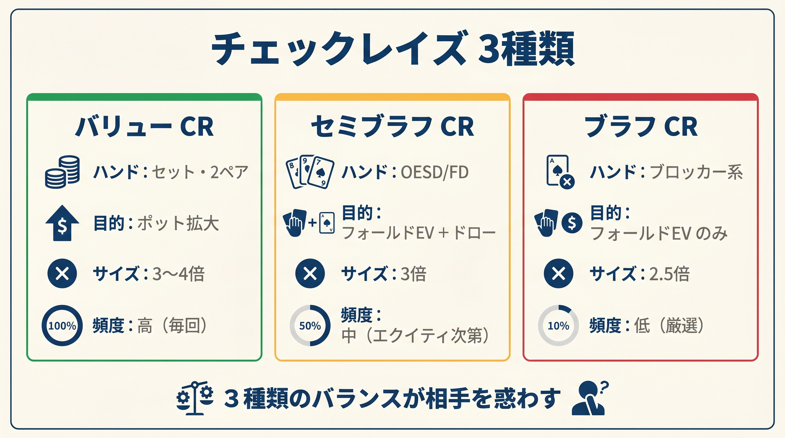
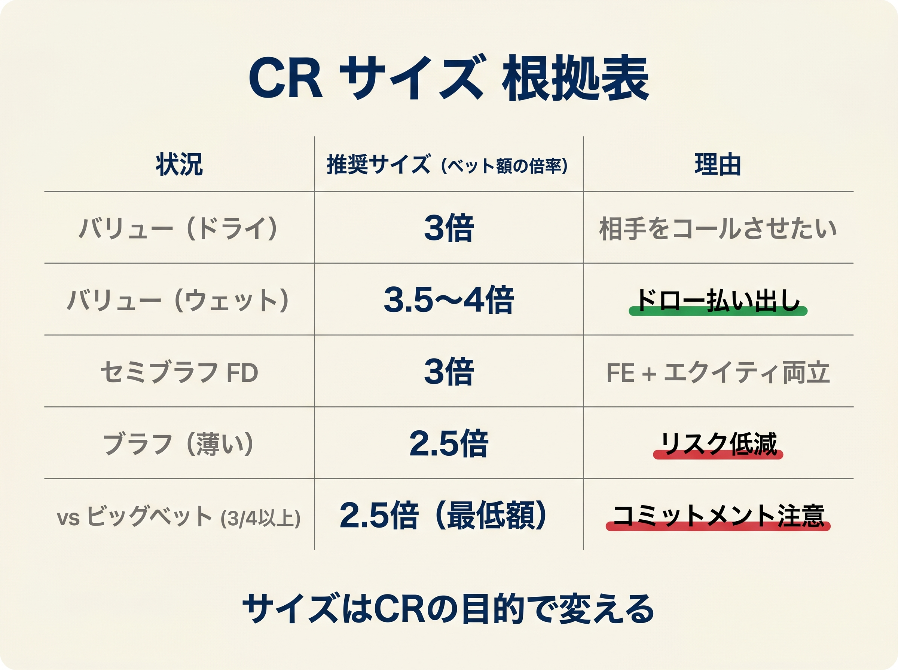

# 第14章　チェックレイズの簡易判定

<!-- markdownlint-disable MD036 MD040 MD060 -->

OOP（アウトオブポジション）でのプレイは常に苦しいものです。
しかし、チェックレイズという武器を正しく使えば、不利なポジションを逆手に取って相手を圧倒できます。
この章では、「いつ・どんなハンドで・何サイズで」チェックレイズするかを、本書の数式に沿って整理します。

---

## 14-1　チェックレイズとは何か

<figure><figcaption>バリューCR（セット）/ セミブラフCR（OESD/FD）/ ブラフCRの3種チェックレイズ比較</figcaption></figure>

チェックレイズとは、フロップでチェックしたあと、相手のCベットに対してレイズを返すアクションです。
単純にミスリードして強さを隠す技術と思われがちですが、実際はそれ以上の意味があります。

**OOPプレイヤーにとっての意義**

BBやSBはポストフロップで常にIPプレイヤー（ボタンやCO）より後に行動することになります。
毎ストリートで情報が遅れるため、ポット獲得やバリュー獲得が難しくなります。
チェックレイズはこの構造的な不利を補う、OOP唯一の「攻撃的防御手段」です。

具体的には次の2つの効果があります。

- **ナッツを含ませる**：BBがチェックレンジ全体に強ハンドを混在させることで、IPは安易な小サイズCBetを連発しにくくなります。
- **ポットを急拡大する**：バリューハンドでポットを大きくして、ターン・リバーでの回収額を最大化できます。

チェックレイズは主に2種類に分類できます。

| 種別 | 目的 | 代表ハンド |
|------|------|-----------|
| バリューレイズ | コールされても勝てる強ハンドでポットを大きくする | セット、ツーペア、TPTK（小サイズCBet時） |
| セミブラフレイズ | 改善可能なドローでフォールドを取りつつエクイティも確保する | OESD、ガットショット+BDFD |

---

## 14-2　バリューチェックレイズ

バリューチェックレイズは、相手がコールし続けても期待値がプラスになるほど強いハンドで行います。

**主要候補ハンド**

- **セット（80%頻度でレイズ推奨）**：最も典型的なバリューレイズ候補です。残り20%はコールにしてレンジをバランスさせます。
- **ツーペア**：セットに次ぐ強度。ウェットボードではレイズ頻度を上げてドロー勢の実現を妨げます。
- **TPTK（トップペア・トップキッカー）**：相手の小サイズCBet（33%ポット前後）に限り、ソルバーはTPTKのチェックレイズを採用します。大サイズCBetに対してはコールが優先されます。

**役割との対応**

本書の判定ルールでは、第9章の役割分類（攻める / ショーダウンバリュー / 守る / 捨てる）に基づきバリューチェックレイズ候補を判断します。

```
セット以上          : 攻める → バリューレイズ最優先
2ペア              : 攻める → バリューレイズ候補
トップペア＋FD     : 攻める → バリューレイズ候補
ショーダウンバリュー（TP/OP）: CR なし → コール
```

第13章の役割別判断表：攻める手 vs 33% CBet → チェックレイズ ✓。ショーダウンバリュー（TPTK・TPGK・TPMK・オーバーペア、FDなし）はCRではなくコールが推奨です。

**具体例：K♦7♣2♥（レインボー）でBBがK♣7♠（ツーペア）を持つ場合**

- 役割：2ペア（K と 7 でヒット）→ **攻める**
- 相手がボタンから33%ポットのCBetを打ってきた局面
- 推奨アクション：チェックレイズ（サイズは後述）

このボードでツーペアを持つBBは、相手のレンジ全体に対して大幅有利です。
すぐにレイズしてポットを大きくすることが正解です。

---

## 14-3　セミブラフチェックレイズ

現時点では弱くても、アウツ（改善の見込み）があるハンドでのチェックレイズです。
コールされても「改善してポットを取れる可能性」があるため、純粋なブラフとは性質が異なります。

**主要候補ハンド**

- **OESD（両方向ストレートドロー、8アウツ）**：アウツ数が多く、フォールドしなくても十分な期待値があります。
- **ガットショット + BDFD（バックドアフラッシュドロー）**：合計実効アウツ約4〜7。単独では弱いですが、組み合わせることでセミブラフとして成立します。
- **ナッツフラッシュドロー（9アウツ）**：フォールドを取れなくてもアウツで逆転できます。

**役割との対応**

```
OESD（8アウツ）         : 攻める → セミブラフ候補
ナッツFD（9アウツ）      : 攻める → セミブラフ候補
FD + OESD（モンスター）  : 攻める → 強力なセミブラフ候補
FD + ガットショット      : 攻める → セミブラフ候補
ガットショット単独（4）  : 守る → ボード次第でセミブラフ候補
非ナッツFD 単独          : 守る → コール優先
```

本書ルール：**攻める手（OESD・ナッツFD・モンスタードロー・トップペア＋FD）** → セミブラフチェックレイズ候補。

**具体例：9♥7♠5♥でBBがJ♥T♥（OESD+ナッツFD）を持つ場合**

- ドロー加点：OESD+FD = 15アウツ相当 → +15（キャップ）
- 役割：モンスタードロー（OESD＋ナッツFD、15アウツ）→ **攻める**
- 相手がボタンから小サイズCBetを打ってきた局面
- 推奨アクション：セミブラフチェックレイズ

ただし、この手は**エクイティが非常に高い（67%超え）ため、後述のGTOコラムも参照**してください。

---

## 14-4　チェックレイズのサイズ目安

<figure><figcaption>バリュー/セミブラフ/ブラフ別チェックレイズサイズ（2.5〜4倍）根拠テーブル</figcaption></figure>

チェックレイズのサイズは、相手のCBetの大きさを基準に設定します。

**経験則：相手のベットの約3倍（簡易目安）**

最も使いやすい目安は「相手のベットの3倍」です。
例として、100BBのシングルレイズドポット（SRP）で相手が33%CBetしてきた場合を計算します。

```
ポット：100BB × 0.1 + 100BB × 0.1 = 20BB（SRP想定）
相手CBet：20BB × 33% = 6.6BB ≒ 7BB
チェックレイズサイズ：7BB × 3 = 21BB ≒ ポットの55%
```

GTO分析でも「100BBスタック、33%CBetに対して55%ポット相当のチェックレイズ」がバランスポイントとされています。

**状況別サイズ調整**

| 状況 | 推奨サイズ |
|------|-----------|
| SRP標準（100BB前後） | 相手ベットの2.5〜5倍 |
| 33%CBetに対する典型 | 相手ベットの約3倍（ポットの55%相当） |
| 40BBスタック時 | 相手ベットの2.5倍（ターン展開を残す） |
| 20BB以下のスタック時 | 小サイズレイズ（スタック全体との兼ね合い） |

**小さすぎるレイズは禁物**

相手の広いレンジ全体がコールできてしまう小サイズレイズは逆効果です。
最低でもポットの33%以上のレイズを心がけましょう。

---

## 14-5　どのボードでチェックレイズするか

チェックレイズの効果は、ボードによって大きく変わります。

**レンジアドバンテージが鍵**

OOPプレイヤー（BBなど）がチェックレイズで主導権を握れるのは、自分のレンジがボードに有利に絡んでいる局面に限られます。

**チェックレイズ推奨ボード（ロー〜ミドルボード）**

- 9♥7♠5♥（ロー・ウェット）
- 6♠4♦3♥（ローコネクテッド）
- 8♠5♦2♣（ロー・レインボー）
- T♦6♠4♥（ミドル）

これらのボードではBBがセット・ツーペア・ストレートドローを豊富に持ちます。
チェックレイズ頻度が**15%以上**に達することもあります。

**チェックレイズ非推奨ボード（ハイボード）**

- K♣J♥T♠（高カード・コネクテッド）→ IPプリフロップアグレッサーが有利
- A♥A♠K♥（IPに圧倒的有利）
- A♠K♠9♦ → チェックレイズ頻度は**5%以下**

ハイボードではIPプレイヤーのレンジが上位ハンドで満たされており、OOPが強ハンドを主張しにくい状況です。

**相手のCBet頻度も考慮する**

相手が小サイズ（33%ポット前後）で高頻度にCBetしてくるプレイヤーには、チェックレイズを積極的に活用してください。
逆に大サイズCBet（60〜70%ポット以上）はポラライズドレンジを示すため、コールかフォールドが最適です。
大サイズCBetへのレイズは状況を悪化させることが多いため推奨しません。

---

## 14-6　ブラフ：バリュー比（2:1が基本）

チェックレイズのブラフ・バリュー比は、GTO理論では**ブラフ：バリュー = 2:1**が基本値です。

**なぜ2:1なのか**

通常のCBetでは「ブラフ：バリュー = 1:1」程度が均衡とされることが多いですが、チェックレイズでは異なります。
チェックレイズのブラフはエクイティを持つドローが主体のため、純粋なエクイティゼロのブラフより多く混ぜてもバランスが保てます。

**MDF（最小ディフェンス頻度）との関係**

```
相手が40%フォールドすれば均衡が成立する設計

バリューコンボが21ある場合 → ブラフは42コンボを目標とする
（バリュー21 + ブラフ42 = 合計63コンボ）
```

チェックレイズに対して相手が40%フォールドすると想定して、ブラフを組み込みます。
この比率が崩れると、相手にエクスプロイトされるリスクが生じます。

**実戦での意識**

毎回厳密に計算する必要はありません。
「バリューを1回使ったらブラフを2回織り交ぜる」という感覚を身につけましょう。

---

## 14-7　簡易判定ルール（3ステップ）

ここまでの内容を、実戦で即使える3ステップに整理します。

```
Step 1：OOPか確認する
  NOなら → チェックレイズは基本不要（コール or フォールドを検討）
  YESなら → Step 2へ

Step 2：ボードのレンジアドバンテージを確認する
  ローボード（9以下中心）・ミドルボード → 自分有利 → Step 3へ
  ハイボード（A/K/Qトップ） → 相手有利 → チェックコール or フォールド

Step 3：ハンドの役割を確認する（第9章の役割分類）
  ┌ 攻める手（セット・2ペア・OESD・ナッツFD・トップペア＋FD）
  │        → バリュー or セミブラフチェックレイズ（相手ベットの2.5〜3x）
  ├ ショーダウンバリュー（TPTK/TPGK/TPMK/オーバーペア、FDなし）
  │        → コール
  ├ 守る手（TPWK・セカンドペア以上・ペア＋中ドロー・非ナッツFD）
  │        → チェックコール
  └ 捨てる手（アンダーペア・役なし）
           → 小ベットはコール気味（後手下限ライン）、大ベットはフォールド
```

**役割別まとめ（HU・33% CBet・ドライ板基準）**

| 役割 | 典型ハンド | 推奨アクション |
|------|----------|--------------|
| 攻める | セット・2ペア・OESD・ナッツFD・トップペア＋FD | バリュー or セミブラフチェックレイズ |
| ショーダウンバリュー | TPTK・TPGK・TPMK・オーバーペア（FDなし） | チェックコール |
| 守る | セカンドペア以上・ペア＋中ドロー・非ナッツFD | チェックコール |
| 捨てる（大ベット） | TPWK（ウェット）・アンダーペア・役なし | フォールド |
| 捨てる（小ベット） | 同上 | コール気味（後手下限ライン） |

ウェット板や大サイズCBetでは「守る手」や「ショーダウンバリュー」から「フォールド」に切り替えるハンドが増えます。詳細は第13章の役割別判断表を参照してください。

**SPRによる補正**

- **SPR 1〜3（低SPR）**：バリューレイズ有効、ブラフは非推奨。
- **SPR 3〜6（中SPR）**：チェックレイズが最も機能するゾーンです。バランスを取りながら積極的に活用してください。
- **SPR 6超（高SPR）**：ナッツ級バリューか高エクイティドローに絞ってください。

---

## 14-8　IP 側のチェックレイズ応答

これまでOOP側の「チェックレイズを打つ判断」を説明してきました。本節ではIPプレイヤーが**OOPのチェックレイズに直面したとき**の応答を整理します。

### IP の3択（フォールド/コール/リレイズ）

| IP 役割 | 典型ハンド | 推奨アクション | 根拠 |
|---------|----------|------------|------|
| 攻める | セット・2ペア・OESD・ナッツFD・TP+FD | **リレイズ（またはオールイン）** | K72r 100%、KJ7r 61%、T98r 52% |
| ショーダウンバリュー | TPTK・TPGK・TPMK・オーバーペア | **コール** | K72r 72%、KJ7r 77%、T98r 44% |
| 守る | セカンドペア・FD・ガットショット | **コール** | K72r 72%、KJ7r 77%、T98r 44% |
| 捨てる | TPWK（ウェット）・アンダーペア・空振り | **フォールド** | K72r 80%、KJ7r 83%、T98r 95% |

TexasSolver（3ボード×33% CBet、BTN vs BB、HU）の実測値です。

### ウェット板の注意

ウェット板（T♥9♦8♣ など）では攻める手も約 50% のみリレイズで残り 48% はコールです。
相手のCRレンジに多くのドローが含まれるため、攻める手でも「ターン待ち」のコールが合理的になります。

> **実戦ルール**：攻める → リレイズ（ウェット板はコールも可）、ショーダウンバリュー → コール、守る → コール、捨てる → フォールド

### マルチウェイでの IP 応答

3-way 以上では IP のリレイズも同様に慎重になります。攻める手でもウェット板・マルチウェイではコール優先で良いでしょう。

---

> **補足（次巻への接続）**: 本章のチェックレイズ判定は役割分類による判断ですが、チェックレンジ保護（強ハンドの一部をチェックに回す）の観点は扱っていません。次巻のチェックレンジ保護ルールでは、オフスートのプレミアムハンドをスート判定でチェック候補に回すことで「チェック＝弱い」という等式を崩す方法を扱います。

## 14-9　ドンクベット：デフォルトは打たない

ドンクベットとは、OOP（例：BB）がフロップで IP のCBetを待たずに先制ベットするアクションです。

### なぜデフォルトで打たないか

GTO 的にはフロップのドンクベット頻度はほぼゼロです。理由は2つあります。

1. **CBetを誘発した方が得**: チェックして IP にCBetさせれば、チェックレイズ or コールの選択肢が生まれます。先にドンクすると相手にフォールドされて小ポットを取るだけになりがちです。
2. **レンジバランスが崩れる**: ドンクレンジを持つとチェックレンジが弱くなり、IP に搾取されやすくなります。

### 3条件が揃ったときだけ検討

次の3条件が**すべて**揃う場合のみ、ドンクベットを検討します。

```
ドンクベット検討条件（3つ全て揃う場合のみ）:
  1. ナッツアドバンテージあり（自分だけがナッツを持てるボード）
  2. SPR ≤ 3（クローズしたいポットサイズ）
  3. IP にチェックバックされると困る強ハンド
```

### チェックレイズとの使い分け

| 状況 | 推奨アクション |
|------|-------------|
| 3条件すべて揃う | ドンクベット（33〜50%ポット） |
| IPのCBetを誘発したい（大半の場面） | チェック → コール or チェックレイズ |
| それ以外 | チェック（デフォルト） |

サイズは33〜50%ポットが目安です。大きすぎるドンクは相手にフォールドされて小ポットを取るだけになります。

---

### ドンクが有効なターンカード早見表

フロップドンクが稀ですが、ターンでのドンク（ターンドンク）はフロップでチェックコールした後に主導権を取る手段として、以下の条件で有効性が上がります。

**有効条件 3 つ**

① **コーラーレンジに多いドロー完成カード**

コーラー（BB）のレンジにストレートドローやフラッシュドローが多く含まれるボードで、それらが完成するターンカードが落ちた場合です。

- 例：J♠5♣3♦ フロップ後のターン 2 / 3 / 4 / 5 / 6（ローストレート系の完成カード）
- コーラーだけがナッツを作れる形になるため、ドンクでポットを奪いに行けます。

② **低ボードのペアカード**

ロースモールカードがターンで重なり、コーラーが 2 ペアを完成させられるカードです。

- コーラーのレンジにボトムペア・セカンドペアが多く、そのペアカードが落ちると一気に 2 ペアが完成します。
- IPの C-Bet レンジはこのカードを恐れるため、ドンクでフォールドを取りやすくなります。

③ **コーラーの 2 ペア完成カード**

コーラーが保有する 2 枚のカードのどちらかがペアになるターンカードです。フロップのボードカードと絡んで 2 ペアが完成する形が代表例です。

**サイズと頻度の目安**

- サイズ：約20%ポット（バリュー兼プロテクションの小ドンク）
- BTN 相手は UTG 相手よりドンク頻度が大幅に低下します（例：18% → 7%）。
- ドンクレンジは二極構造が基本で、ナッツ近辺の強ハンドと薄いワンペアが主体です。

> **出典**: GTO Wizard「Turn Donk Bets」<https://blog.gtowizard.com/turn-donk-bets/>

---

## 【GTOとのズレ①】チェックレイズの構造的役割

チェックレイズは単なる強ハンドの表現手段ではなく、OOPレンジ全体を守る構造的な機能を持っています。

チェックレイズレンジを持たないと、相手は33%ポットの小ベットを安全に100%打てるようになります。
OOPがチェックレイズを混ぜることで、相手は小ベットに対してもリスクを感じざるを得なくなります。
これを「OOPレンジのアンキャップ（上限解除）」と呼び、相手に完全な情報アドバンテージを与えないための防衛機能です。

本書の判定ルール（攻める手 → CR）は「いつCRを打つか」を決める基準ですが、頻度ゼロにするとレンジ全体が弱体化します。
セミブラフCRを混ぜてバランスを保つことが、GTOの意図する「保護」の本質です。

> **出典**: GTO Wizard「Round Out Your Defense: The Power of Raising」<https://blog.gtowizard.com/round-out-your-defense-the-power-of-raising/>

---

## 【GTOとのズレ②】超強コンボドローはコールが有利な場合がある

本章の判定ルールは「12アウツ以上ならセミブラフ候補」としていますが、GTOには1つの重要な例外があります。

**エクイティが高すぎるとチェックレイズが最善ではない**

GTO Wizardの分析によれば、エクイティが67%を超えるコンボドロー（例：J♠T♠ on 9♥8♥7♣ などの15アウツ前後）は、チェックレイズよりもチェックコールで実現した方が高EVなケースがあります。

**理由**

- チェックレイズで相手がフォールドすると、巨大なエクイティの実現機会を失います。
- 相手にコールさせてターン・リバーでエクイティを現金化した方が、トータルEVが高くなります。
- 超強コンボドローは「フォールドを強制しなくていい手」です。

**判断の分岐**

```
コンボドローのエクイティ推定
  ～66%（OESD単独、FD+ガット 等）  → セミブラフチェックレイズ候補
  67%以上（OESD+ナッツFD 等）      → チェックコール → ターンで積極的に打つ
```

本書の簡易ルールを使う場合、15アウツ以上のモンスタードロー（例：OESD+ナッツFD）は「セミブラフよりコール優先」と覚えておいてください。

---

## まとめ

- チェックレイズはOOPプレイヤーが使える最強の攻撃的防御手段です。
- **役割判定（第9章・第13章）** でCR判断。**攻める手** → バリュー or セミブラフCR、**ショーダウンバリュー（TPTK/TPGK/TPMK/OP）** → チェックコール（CRなし）、**守る手** → チェックコール、**捨てる手** → フォールド（小ベットは後手下限ライン）。
- サイズは相手ベットの**約3倍**が簡易目安（SRP・33%CBet時は約55%ポット相当）。
- ローボードはチェックレイズ頻度15%以上、ハイボードは5%以下が目安です。
- SPR 3〜6が最もバランスの取れたチェックレイズゾーンです。
- 超強コンボドロー（67%以上エクイティ）はGTO的にコールが高EVな場合があります。
- **IP が CR を受けた場合**：攻める → リレイズ（ウェット板はコールも可）、守る → コール、捨てる → フォールド。
- **ドンクベットはデフォルトNG**：ナッツアドバンテージあり + SPR ≤ 3 + IPチェックバックが困る、の3条件揃った場合のみ33〜50%で検討。

---

## ミニクイズ

**Q1.** BBでT♦6♠4♥のフロップを迎えました。自分のハンドは8♥7♥（OESDで8アウツ）です。相手ボタンが33%ポットのCBetをしてきました。本書の簡易判定では次のどれが正解ですか。

1. チェックフォールド
2. チェックコール
3. チェックレイズ（セミブラフ）

**A1.** 正解は**3**です。
T♦6♠4♥はミドルボードで、BBのレンジが有利に絡みやすいボードです。
OESDは8アウツ（ドロー加点+14）で「ドロー加点+14以上のセミブラフ候補」に該当します。
相手の小サイズCBetに対してセミブラフチェックレイズが最適なアクションです。

---

**Q2.** 同じボードT♦6♠4♥で、自分のハンドがT♠5♣（トップペア弱キッカー・TPWK）です。ドローはありません。推奨アクションはどれですか。

1. バリューチェックレイズ
2. チェックコール
3. チェックフォールド（相手の大サイズCBet時）

**A2.** 正解は**2または3**です。
T♠5♣ は TPWK（弱キッカー）で「捨てる手」に分類されます。GTO 上もキッカー J 以下のトップペアは **bet 頻度わずか 9.6%** でほぼチェック扱いです。
役割判定では「捨てる」→ 小サイズCBetにはコール気味（MDF）、大サイズCBetにはフォールド。
相手が小サイズCBetならチェックコール、大サイズCBetならフォールドを検討してください。

---

**Q3.** 67%を超えるエクイティを持つコンボドロー（例：OESD+ナッツFD）でセミブラフチェックレイズを打つことは、GTOの観点から最善といえますか。

**A3.** **必ずしも最善ではありません。**
GTO Wizardの分析では、エクイティが高すぎるコンボドローはチェックコールでエクイティを実現した方が高EVになる場合があります。
フォールドを強制する必要がない強さを持つ手は、コールでターン・リバーに進んだ方がトータルEVが高くなるケースがあります。

---

## 出典

- Upswing Poker「5 Winning Check-Raising Strategies You Should Try」<https://upswingpoker.com/check-raising-strategies/>
- Upswing Poker「How to Check-Raise Like a High Stakes Pro」<https://upswingpoker.com/check-raise-poker-strategy-flop-c-bet/>
- GTO Wizard Blog「Defending vs BB Check-Raise on Paired Flops」<https://blog.gtowizard.com/defending-vs-bb-check-raise-on-paired-flops/>
- GTO Wizard Blog「Picking the Right Semi-Bluffs」<https://blog.gtowizard.com/picking-the-right-semi-bluffs/>
- GTO Wizard Blog「Check-Raising a Single Pair」<https://blog.gtowizard.com/check-raising-a-single-pair/>
- BlackRain79「Check Raising the Flop Strategy」<https://www.blackrain79.com/2020/04/check-raise-flop.html>
- PokerCoaching「Optimal Strategy For Check Raising」<https://pokercoaching.com/blog/check-raising/>
- SplitSuit Poker「SPR Strategy」<https://www.splitsuit.com/spr-poker-strategy>
- Upswing Poker「How to Win More Chips with Your Bluff-to-Value Ratios」<https://upswingpoker.com/what-is-bluff-to-value-ratio/>
- GTO Wizard「Round Out Your Defense: The Power of Raising」<https://blog.gtowizard.com/round-out-your-defense-the-power-of-raising/>
- GTO Wizard「Turn Donk Bets」<https://blog.gtowizard.com/turn-donk-bets/>
