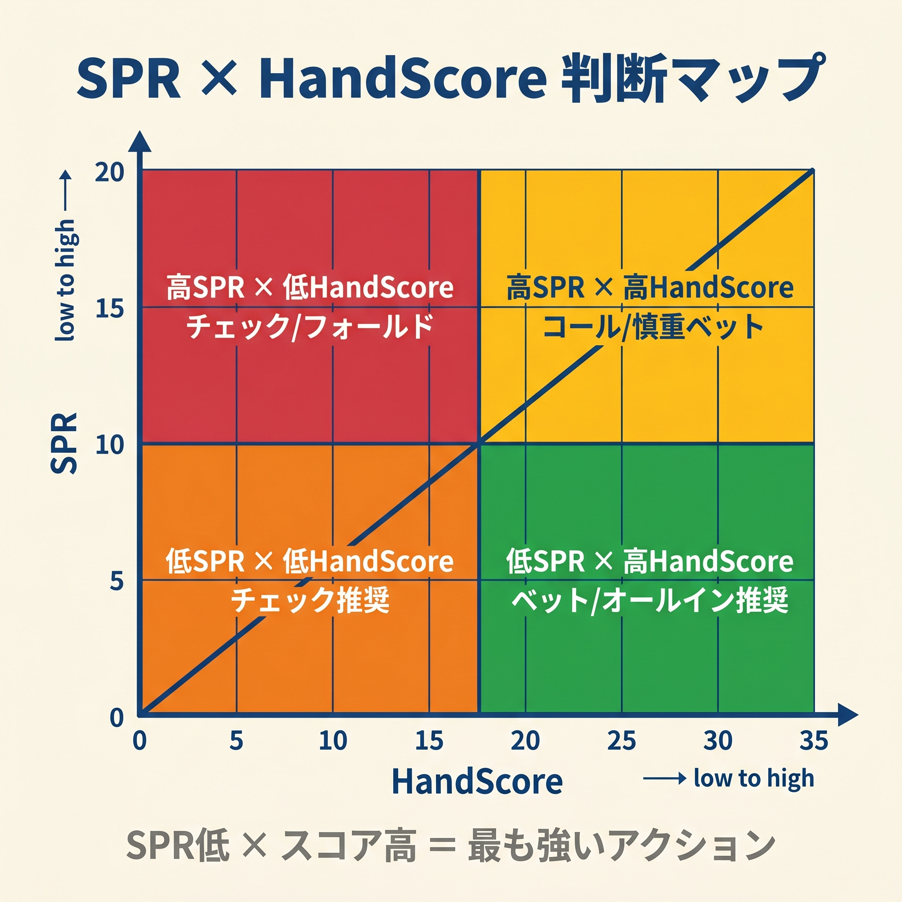
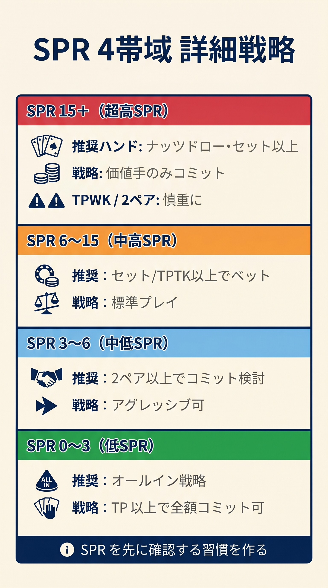

# 第15章　SPR による戦略の切り替え

<!-- markdownlint-disable MD036 MD040 MD060 -->
<!-- textlint-disable preset-ja-technical-writing/no-exclamation-question-mark -->
<!-- textlint-disable preset-ja-technical-writing/no-mix-dearu-desumasu -->

フロップで「どこまで強気に押せるか」を決めるのは、ハンドの強さだけではありません。
残りスタックとポットの比率、つまりSPR（Stack-to-Pot Ratio）が、その答えを数値で教えてくれます。
SPRを把握することで、「トップペアでオールインすべきか」「スーテッドコネクターに価値があるか」を直感ではなく根拠をもって判断できるようになります。

---

<figure><figcaption>SPRとHandScoreを2軸にした4象限判断マップ（低SPR×高スコア=最強アクション）</figcaption></figure>

<figure><figcaption>SPR 0-3 / 3-6 / 6-15 / 15+の4帯域と各詳細戦略の縦型図</figcaption></figure>

## 15-1　SPR の定義と計算

### SPR とは何か

SPRとは「フロップ開始時点のエフェクティブスタック ÷ ポットサイズ」で求める数値です。
この数値が大きいほどスタックが深く、小さいほど浅いことを意味します。

```
SPR = エフェクティブスタック ÷ フロップ時点のポットサイズ
```

- **エフェクティブスタック**：参加プレイヤー全員のスタックのうち最小のもの
- SPRはフロップ以降でのみ使用し、プリフロップには適用しません

### 計算例で感覚をつかむ

最も理解しやすい方法は、自分がよく経験するシナリオで計算してみることです。

| シナリオ | ポット | エフェクティブスタック | SPR |
|---------|-------|-------------------|-----|
| SRP: BTN 2.5bb オープン、BB コール（100bb 開始） | 5.5bb | 97.5bb | **≈ 17.7** |
| 3betポット: BTN 2.5bb→BB 10bb 3bet→BTN コール | 20.5bb | 90bb | **≈ 4.4** |
| ミドルスタックの例（$23 ポット、$190 残り） | $23 | $190 | **≈ 8.3** |
| ショートスタック例（$100 ポット、$150 残り） | $100 | $150 | **≈ 1.5** |

**注目すべき点**は、SRP（≈ 17.7）と3betポット（≈ 4.4）の差です。
プリフロップで3betコールしただけで、スタック深度は約4分の1になります。
この差がポストフロップ戦略の大部分を決定します。

---

## 15-2　SPR 区分と戦略（≤3 / 3〜6 / 6〜15 / ≥15）

SPRは大きく4つの帯域に分けて考えると実戦で使いやすくなります。

| 区分 | SPR 値 | 典型的な発生状況 |
|------|--------|---------------|
| 低 | ≤ 3 | 4betポット、ショートスタックの SRP |
| 中低 | 3〜6 | 3betポット（100bb）、SRP（30bb） |
| 中高 | 6〜15 | SRP（100bb 標準）の大部分 |
| ディープ | ≥ 15 | SRP（150bb 以上）、初期トーナメント |

### SPR ≤ 3：トップペアでコミット必至

SPRが3以下では、ポットがスタックを大きく支配します。
1回のポットサイズベットとレイズで、あっという間にスタックオフに到達します。

**コールに必要なエクイティ**

- SPR = 1：コールに必要なエクイティは約33%
- SPR = 2：コールに必要なエクイティは約40%

エクイティ33〜40% は「トップペア以上」で簡単に達成できます。
つまり、SPR ≤ 3の状況ではトップペアトップキッカー（TPTK）が自動的なスタックオフハンドになります。

**戦略の要点**

- TPTKやオーバーペアはスタックオフ確定で進める
- チェックレイズはバリューもブラフも頻度を上げられる
- ブラフの実効性は低下（フォールドエクイティが小さいため）
- フラッシュドロー保有時は「チェック→ジャム」が有効

**手牌の価値変化**

スーテッドコネクターや小ペアは低SPRではインプライドオッズが消えてしまいます。
ワンペア系ハンドの相対的価値が上がる帯域です。

### SPR 3〜6：セミブラフが最も効果的な帯域

3betポット（100bbスタート）のSPR ≈ 4.4がこの帯域の代表例です。
マルチストリートの判断余地が残りつつ、1〜2回のポットサイズベットでコミットに向かいます。

**戦略の要点**

- トップペアは強いが「自動スタックオフ」ではなく、ボードと相手レンジを考慮する
- フォールドエクイティとエクイティ実現が両立するため、セミブラフが最も機能する帯域
- インポジションは小さめのCBet（ポットの50〜66%）が最適
- アウトオブポジションはチェックレイズを活用したレンジバランスが重要

**手牌の価値**

ストロングドロー（ナッツフラッシュドロー + ペアなどのコンボドロー）が高いEVを持ちます。
弱いワンペアはポットコントロールを意識してください。

### SPR 6〜15：ポストフロップスキルが勝敗を分ける

標準的なSRP（100bb開始、SPR ≈ 17.7）の大部分がこの帯域に近い性質を持ちます。
フロップ→ターン→リバーとトリプルバレルしてようやくスタックオフになるため、マルチストリートの判断が支配します。

**戦略の要点**

- トップペアはポットコントロールを優先（自動スタックオフは危険）
- ベットサイジングは大きめ（ポットの66〜75%）でポットをビルドし、ナッツハンドで回収
- リバースインプライドオッズに注意（セカンドフラッシュ、ノンナッツストレートは要警戒）
- ボードダイナミクスへの対応とマルチストリートプランニングが勝敗を分ける

**手牌の価値**

セット、ナッツストレート、ナッツフラッシュドローが高い価値を持ちます。
KJoやAToなどのミドルワンペア系は価値が低下する帯域です。

### SPR ≥ 15：ディープスタック特有の戦略

SRPで150bb以上のディープスタック、または初期トーナメントで発生します。
ポットサイズベットをフロップ・ターン・リバーと継続してもまだスタックが残ります。

**戦略の要点**

- ワンペア系ハンドの価値が大幅に低下（「AToはスタックオフ不可」レベル）
- ナッツに近いハンド（セット、ナッツストレート、ナッツフラッシュ）が大量のチップを回収
- スーテッドコネクターの真価が発揮される帯域
- ポジション有利プレイヤーの優位がさらに拡大する

**SPR 13 以上でスーテッドコネクターが真価を発揮**

56s、97s、A2sなどのスーテッドコネクターは、SPR 13以上で十分なインプライドオッズを持ちます。
ストレート・フラッシュが完成したとき、相手から大きな支払いを引き出せるからです。

---

## 15-3　コミットメントスレッショルド

### 「どこまで強ければスタックオフできるか」を数値で決める

コミットメントスレッショルドとは、あるSPR水準において「スタックオフが数学的にプラス期待値になる最低ハンド強度」の閾値です。

**基本原則**：SPRが低くなるほどコミットに必要なハンド強度は下がり、SPRが高くなるほどナッツに近いハンドのみが正当化されます。

| SPR | コールに必要なエクイティ（概算） | コミット可能なハンドの目安 |
|-----|--------------------------|------------------------|
| 1 | 約 33% | トップペア以上、強いドロー |
| 2 | 約 40% | トップペア以上 |
| 4〜5 | 約 45% | トップツーペア以上、セット |
| 8 以上 | 約 47% 以上 | セット、ナッツストレート・フラッシュ |

### ハンドの「ロバストネス」を理解する

GTO Wizardが提唱する「ロバストネス」の概念も、コミットメントスレッショルドと密接に関係しています。

**ドロー系ハンド**は、相手レンジが強化されてもエクイティを保持しやすい特性があります。
例えば、ナッツフラッシュドローは相手がセットを持っていても約36% のエクイティを維持します。

**ワンペア系ハンド**は、相手レンジが強化されると急速にエクイティが低下します。
トップペアが相手のセットと対峙した場合、エクイティは約10% 台に落ちることもあります。

深いスタック（高SPR）ほどロバスト性の高いハンドが有利になります。
これが「高SPRではワンペアの価値が下がる」理由の本質です。

---

## 15-4　SRP vs 3betポットの SPR 差（17.7 vs 4.4）

### なぜ 3betポットはこんなに「浅く」なるのか

プリフロップでの3betとコールは、ポットを急激に膨らませます。

**シングルレイズドポット（SRP）の例**

```
BTN 2.5bb オープン → BB コール
フロップポット: 5.5bb
エフェクティブスタック: 97.5bb
SPR = 97.5 ÷ 5.5 ≈ 17.7
```

**3betポットの例**

```
BTN 2.5bb → BB 10bb 3bet → BTN コール
フロップポット: 20.5bb
エフェクティブスタック: 90bb
SPR = 90 ÷ 20.5 ≈ 4.4
```

3betポットのSPRはSRPの約 **4分の1** です。
プリフロップで3betコールをした瞬間に、ゲームの性質が根本的に変わります。

### 戦略への影響

| 項目 | SRP（SPR ≈ 17） | 3betポット（SPR ≈ 4） |
|------|-------------|-------------------|
| CBet サイズ | 大きめ（66% 以上） | 小さめ（50% 以下） |
| トップペアの価値 | 中程度（ポットコントロール優先） | 高い（スタックオフ可） |
| チェックレイズの攻撃性 | 中程度 | 高い（バリュー・ブラフとも増加） |
| プレイの複雑性 | マルチストリート判断が支配 | 1〜2 ストリートで決着しやすい |

**実戦例①**：3betポットでAAを持ちフロップでトップセット（例： K72 on KK2）が決まった場合、SPR ≈ 4ゆえに即スタックオフが正解です。

**実戦例②**：SRPでAAを持ちSPR ≈ 17のフロップでは、ボードのテクスチャとターン・リバーのプランを考えながら慎重に進める必要があります。

---

## 15-5　低 SPR のセミブラフジャム

### 低 SPR では「フォールドエクイティ + エクイティ実現」が両立する

SPR ≤ 3〜4では、セミブラフジャム（チェックレイズオールインやジャム）が強力な武器になります。

**成立条件**

1. 残りスタックが少なく（SPR ≤ 2〜4）、ジャムが「ポット程度以下の追加リスク」に収まる
2. 相手に一定のフォールドエクイティが残っている

### ドロー別の成立度

**フラッシュドロー（エクイティ ≈ 36%）**

フロップでナッツフラッシュドローを持ちSPR ≈ 2の場合を考えてください。
エクイティ約36% にフォールドエクイティが加われば、チェックジャムはほぼ確実に +EVです。
相手がコールしても36% の確率でベストハンドになれます。

**OESD（エクイティ ≈ 32%）**

ストレートドローは単独ではエクイティが若干下がりますが、フォールドエクイティと合わせれば低SPRでのジャムを正当化できます。

**コンボドロー（フラッシュ + ペアなど、エクイティ 50% 以上）**

コンボドローは低SPRではほぼ確定的な +EVジャムになります。
エクイティ50% 以上なら、フォールドエクイティがゼロでもイーブン以上です。

### 注意点

- SPRが中以上（6以上）になると、ジャムのリスクが大きくなりすぎます
- SPR 6以上では、段階的なベット（フロップでバリュー、ターンで継続）を選好してください
- 弱いドロー（ガットショット単独など）は低SPRでもフォールドエクイティが不十分なら避けます

---

## 15-6　高 SPR のインプライドオッズ活用

### インプライドオッズとは何か

高SPR環境では、現時点でのポットオッズが悪くても問題ありません。
将来のストリートで回収できる期待額（インプライドオッズ）が大きいため、投機的なハンドでの継続が正当化されます。

**SPR とインプライドオッズの関係**

- SPRが高い → インプライドオッズが大きい → 投機的ハンドに価値
- SPRが低い → インプライドオッズが小さい → 投機的ハンドの価値が消える

### SPR 13 以上がスーテッドコネクターの目安

スーテッドコネクターがストレートやフラッシュを完成させたとき、相手から「隠れた強さ」ゆえに大きな支払いを引き出せます。
ただし、これが成立するためには残りスタックが十分に深くなければなりません。

| ハンドタイプ | インプライドオッズの最低目安 |
|------------|-------------------------|
| スーテッドコネクター（56s、97s など） | 20:1 以上 |
| スモールペア（セット狙い） | 10:1 以上 |
| スーテッドエース（A2s など） | 15〜20:1 以上 |

スモールペアはセット率が約12%（8:1）ですが、高SPRではセット成立時にスタック全体を回収できます。
セット率が低くても、1回の回収額が大きければトータルでEVがプラスになります。

### リバースインプライドオッズに注意

高SPRでは「ナッツ未満のメイドハンド」が罠にはまりやすくなります。

**危険なハンドの例**

- セカンドフラッシュ（ナッツではないフラッシュ）
- ノンナッツストレート

相手がナッツを持っている場合、これらのハンドは全スタックを失う可能性があります。
SPR ≥ 15のディープスタック環境では、ナッツに近いハンドのみが本来の価値を発揮します。

---

## 【GTOとのズレ】：ロバストネス概念と混合戦略

本章で説明したSPR区分は、実戦での意思決定を単純化するための有用なフレームワークです。
ただし、GTOとはいくつかの点でズレが生じます。

### ズレの内容

**GTO は「ロバストネス」で混合戦略を構築する**

GTO Wizardの分析によれば、高SPR環境でのワンペアはフォールドと保持を混合します。
「SPR 8以上はトップペアでコミットしない」という単純なルールは、GTO的には正確ではありません。
ボードのテクスチャ、相手のレンジ、ポジションによって、コミット頻度は変わります。

**ドロー系の「ロバストネス」はより複雑**

本書では「ドロー系はエクイティを保持しやすい」と説明しました。
しかしGTOでは、ドローの種類（ナッツドローか否か）、相手レンジとの絡み方によって、フォールドすべきドローも存在します。

**単純なしきい値は「外れやすい境界」がある**

SPR 3を厳密な切り替えポイントとして扱うのは過度の単純化です。
実際にはSPR 2.5〜4の帯域は「グレーゾーン」であり、ハンドの具体的な強さで判断が変わります。

### 実用上の推奨

上記のズレを知りつつ、まずは本章のしきい値を実戦で使ってください。
「SPR ≤ 3ならTPTKでコミット」「SPR ≥ 13ならスーテッドコネクターで継続」という指針は、多くの状況で十分な判断精度を与えます。
より精度を上げたい場面では、GTO WizardのSPR分析機能で個別状況を確認することをお勧めします。

---

## まとめ

- **SPR = エフェクティブスタック ÷ フロップポット**。この数値が戦略全体を左右します
- SRPのSPR ≈ 17.7と3betポットのSPR ≈ 4.4は約4分の1の差であり、ゲームの性質が根本的に異なります
- **SPR ≤ 3**：TPTKでスタックオフ確定。セミブラフジャムも機能しやすい
- **SPR 3〜6**：セミブラフが最も効果的。トップペアはボードと相手を見て判断
- **SPR 6〜15**：マルチストリートプランニングが支配。ポットコントロールを優先
- **SPR ≥ 15**：スーテッドコネクター・スモールペアが真価を発揮。ワンペアの価値は大幅低下
- **コミットメントスレッショルド**：SPRが高いほど、コミットには強いハンドが必要
- **ロバストネス**：ドロー系はエクイティを保持しやすく、高SPRほど有利

---

## ミニクイズ

**問題 1**

BTNが2.5bbでオープンし、BBがコールしました（両者100bbスタート）。
フロップのポットは5.5bb、エフェクティブスタックは97.5bbです。
SPRを計算してください。また、あなたがBBでTPTKを持っている場合、スタックオフは正当化されますか？

**解答：** SPR = 97.5 ÷ 5.5 ≈ 17.7。このSPRではスタックオフは正当化されません。SPR ≈ 17.7は「コンテクスト調整帯域」であり、ポットコントロールが基本です。TPTKでスタックオフが正当化されるのはSPR ≤ 3前後です。

---

**問題 2**

3betポット（BTN 2.5bb→BB 10bb 3bet→BTNコール、100bb開始）のフロップで、BBがナッツフラッシュドローを持ちSPR ≈ 4.4です。
チェックレイズオールインは正当化されますか？

**解答：** はい、正当化されます。SPR 3〜6はセミブラフが最も効果的な帯域です。ナッツフラッシュドローのエクイティ約36% にフォールドエクイティが加わり、チェックレイズオールインは +EVになります。

---

**問題 3**

SPR ≥ 15のディープスタック環境で、56sを持ちフロップでストレートドローとフラッシュドローの両方を引いた（コンボドロー）とします。
この状況でジャムが正当化されるSPRの目安はいくつですか？また、なぜスーテッドコネクターは高SPRで有利なのでしょうか？

**解答：** SPR 13以上がスーテッドコネクターの最低目安です。高SPRでは、ストレートやフラッシュ成立時に相手から全スタックを回収できるインプライドオッズが大きくなります。コンボドローはエクイティが50% 以上になることも多く、フォールドエクイティがゼロでもEVがイーブン以上になります。

---

## 出典

- GTO Wizard - Stack-to-pot ratio: <https://blog.gtowizard.com/stack-to-pot-ratio/>
- Upswing Poker - Stack-to-Pot Ratio: 3 Hands: <https://upswingpoker.com/stack-to-pot-ratio-poker-hands/>
- Upswing Poker - Single-Raised Pots vs 3-Bet Pots: <https://upswingpoker.com/single-raised-pots-vs-3-bet-pots/>
- PokerCoaching - Mastering SPR: <https://pokercoaching.com/blog/poker-spr/>
- 888poker - SPR in Poker: <https://www.888poker.com/magazine/strategy/spr-in-poker>
- GTO Wizard - Visualizing implied odds: <https://blog.gtowizard.com/visualizing-implied-odds/>
- GTO Wizard - Picking the Right Semi-Bluffs: <https://blog.gtowizard.com/picking-the-right-semi-bluffs/>
- GTO Wizard - C-Betting OOP in 3-Bet Pots: <https://blog.gtowizard.com/c-betting-oop-in-3-bet-pots/>
- SplitSuit Poker - SPR Strategy And Concept: <https://www.splitsuit.com/spr-poker-strategy>
