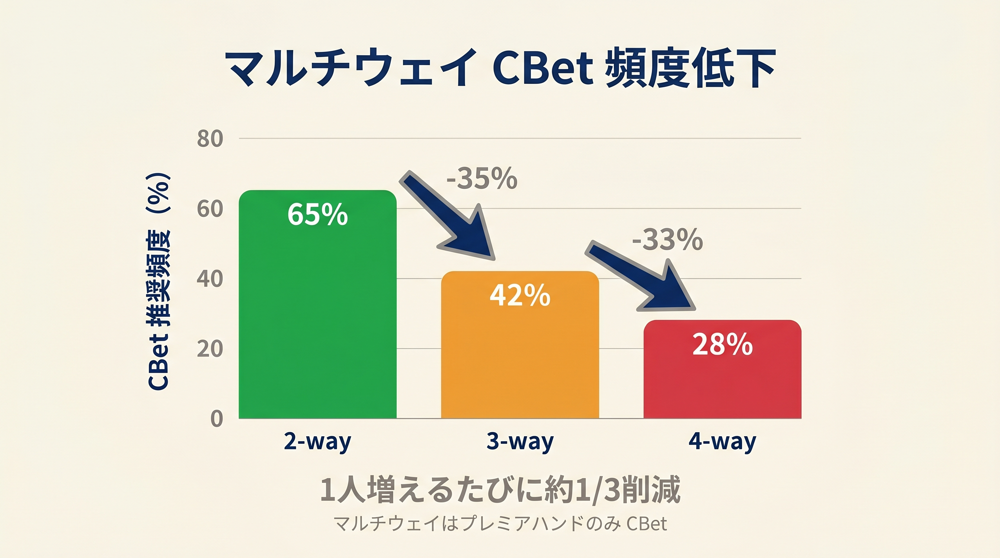
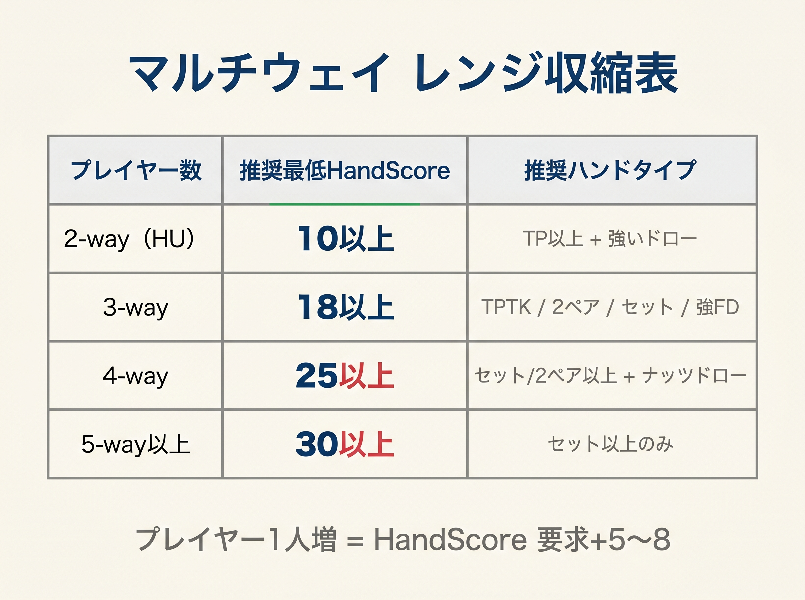

# 第16章　マルチウェイのフロップ

<!-- markdownlint-disable MD060 -->
<!-- textlint-disable preset-ja-technical-writing/no-mix-dearu-desumasu -->

> **本章の目標**: 本書の3式はヘッズアップ（2人対戦）前提で設計されています。3人以上のマルチウェイでは、**式の前提が崩れる**ため別ルールが必要です。本章でその別ルールを示します。

前章までのCBet統合式は、「自分vs相手1人」を前提に組まれています。しかし実戦ではフロップに3人、4人で入ることも珍しくありません。このとき同じ式を使うと、**過剰な CBet**や**不適切なバリューベット**で大きく損失を出します。

本章では、マルチウェイで何が変わるか、どう調整すべきかを整理します。

---

## 16-1 マルチウェイで起きる4つの変化

プレイヤーが増えると、フロップ戦略は以下の4点で変わります。

1. **CBet 頻度が激減する**：相手が多いほどフォールドを引き出しにくい
2. **エクイティが急落する**：同じAKでもHU 65% → 4-way 40%
3. **ナッツの必要性が上がる**：トップペア1つでは足りない
4. **ブラフ成功率が乗算的に下がる**：V1 70% × V2 40% = 28%

---

## 16-2 CBet 頻度の激減

<figure><figcaption>2-way 65% / 3-way 42% / 4-way 28%のCBet頻度低下を示す棒グラフ</figcaption></figure>

GTO Wizardのマルチウェイ解析によれば、CBetの頻度はヘッズアップ比で劇的に下がります。

| 状況 | ポットサイズ CBet 頻度 |
|------|--------------------|
| ヘッズアップ（HU） | 約 18% |
| マルチウェイ（3-way） | 約 **1.3%** |

ポットサイズのような大きなCBetは、マルチウェイではほぼ消えます。チェック頻度はヘッズアップ比で +11ポイント増え、**チェックが主戦略**になります。

### なぜこうなるか

相手1人だけなら、フォールドを引き出せる確率は一定（ドライボードで50〜60%）です。しかし相手2人になると、**両者のフォールド確率を掛け算**する必要があります。仮に各相手のフォールド率が50% なら、両方降りる確率は50% × 50% = **25%** に下がります。

**ブラフ CBet の成功率は乗算的に減少する**。これがマルチウェイの第一原則です。

---

## 16-3 エクイティの急落

同じハンドでも、相手が増えるほどエクイティが下がります。

| ハンド | HU | 3-way | 4-way |
|--------|------|--------|--------|
| AA | 85% | 73% | 64% |
| KK | 82% | 70% | 62% |
| AK | 65% | 50% | 40% |
| QQ | 80% | 66% | 57% |

AKの **65% → 40% は 25 ポイント**の急落です。マルチウェイでは「強い手」と思っていたハンドが**中堅ハンドに格下げ**されます。

---

## 16-4 ナッツの必要性が上がる

<figure><figcaption>2-way〜5-way以上のプレイヤー数別推奨HandScoreしきい値テーブル</figcaption></figure>

GTO WizardのPhil Galfondによる分析では、4-way K♣T♥6♠ フロップでAAを持っていた場合、**誰かがトップペア以上の確率は約 69%** に達します。つまりAAであっても、すでに**40% 程度は負けている可能性**があるということです。

AAで75% ポットベットを打ち、1人がコールしただけで、40% の確率でビート済みです。**ワンペアでスタックを入れるのは危険**です。

### 新しい基準

マルチウェイでのバリューベットの基準は、ヘッズアップより**1段階厳しく**します。

- **HU でバリュー**：トップペア以上
- **3-way でバリュー**：オーバーペア以上
- **4-way でバリュー**：ツーペア以上

---

## 16-5 オフスーツブロードウェイの失墜

Upswing Pokerは「**AQo はマルチウェイポットでプレイすべきではない**」と明言しています。理由は：

- トップペア（Q）を作っても、相手のAKやAQにキッカー負け
- 2オーバーカードでは4-wayで6 outsが効きにくい（相手のレンジと衝突）
- セカンドベスト症候群（トップペアで積んで負ける）が発生しやすい

AQo、KQo、KJoといった**オフスーツブロードウェイは、マルチウェイで価値が激減**します。プリフロップでこれらがマルチウェイになる場面では、**3ベットでヘッズアップに持ち込む**のがGTO的にも正しい選択です。

---

## 16-6 相対的に価値が上がるハンド

逆に、マルチウェイで**相対価値が上がる**ハンドもあります。

### 小〜中ペア（22〜99）

- セットヒット時に複数ストリート価値ベット可能
- 4-wayなら支払側の数が増えるので、インプライドオッズが増大
- 「ミスすれば降りる」判断が明確

### スーテッドコネクター

- ナッツフラッシュドロー、ナッツストレートドローはマルチウェイでも強い
- 4-wayで作れる「稀なナッツ」が相対的にレア価値
- ただし**絶対値では下がっている**（ほかの全員のエクイティも下がるので、フォールドエクイティ不足）

---

## 16-7 ベットサイズ：33% が基準

マルチウェイでCBetを打つ場合、サイズは**25〜33% ポットを基準**にします。理由は：

- 大きなベットは複数相手のコールを引き出せない（ブラフ成功率低下）
- 小さいベットなら、ナッツ候補だけをコールさせやすい
- BTNのIPマルチウェイでは、クォーターポット（25%）を **56.2% の頻度**で使うとのGTOデータあり

### 大きなベットが正当化される条件

次の条件が2つ以上揃ったときのみ、50%+ サイズを検討します。

1. ナッツアドバンテージがある（自分だけが作れる強いハンド多数）
2. IP（ポジションあり）
3. SPRが低い（3以下、コミット前提）

それ以外は **33% 基準**で打つか、打たないかの二択です。

---

## 16-8 マルチウェイ用の役割調整

第9章の役割分類（攻める / ショーダウンバリュー / 守る / 捨てる）をマルチウェイに適用する際は、ベット・CR の条件をより厳しくします。

### 先手（IP CBet）の基準

| 状況 | ベットできる手 | レンジベット（捨てる手小ベット） |
|------|------------|--------------------------|
| HU | 攻める + ドライ板なら捨てる | 高頻度板のみ可 |
| 3-way | 攻める（上位）のみ。ショーダウンバリューはコール | 消滅 |
| 4-way+ | セット以上・2ペア・モンスタードローのみ | 消滅 |

### 後手（OOP vs CBet）の基準

| 状況 | CR できる手 | コール | フォールド |
|------|-----------|--------|---------|
| HU | 攻める手全般 | ショーダウンバリュー・守る手全般 | 捨てる手（大ベット） |
| 3-way | 攻める上位（セット・2ペア・モンスタードロー） | 攻める下位・ショーダウンバリュー・守る | 捨てる手 |
| 4-way+ | セット以上のみ | その他の攻める・ショーダウンバリュー・守る | 捨てる手 |

### 具体例（3-way、K72r ドライ、33% CBet）

- TPTK（IP）= ショーダウンバリュー → ベット ✓
- アンダーペア（IP）= 捨てる、3-way → チェック（HU ではドライ板レンジベット可だが 3-way では不可）

**4-way ではさらに厳しく**、攻める手でもセット・2ペア・強ドロー以外はチェックに回します。

また、ハンドタイプごとに次の補正を意識します。

| ハンドタイプ | マルチウェイでの影響 |
|------------|------------------|
| オフスーツブロードウェイ（AQo、KQo） | セカンドベスト症候群リスク大、 **注意** |
| 小ペア（22〜99） | セットヒット時のインプライドオッズが増大 |
| スーテッドコネクター | ナッツ級に化けるとマルチウェイでも強い |

M 係数は HU データ（TexasSolver）から理論的に導出した値です。実際のマルチウェイ GTO は MonkerSolver 等で別途確認が必要ですが、実戦では「マルチウェイは閾値が上がる」と覚えるだけで十分です。

---

> **補足（次巻への接続）**: マルチウェイでは混合戦略ルールの揺らしは効果が薄れます。次巻でその理由を扱い、限定的なルールのみ適用するという棲み分けを示します。

---

## 16-9 3ベットポットのフロップ戦略

3ベットポットは、SRP（シングルレイズドポット）とは別の戦略が必要な状況です。第15章で示したSPR帯域「3〜6」が、まさに3ベットポットの典型域です。

SRPではフロップ開始時のSPRが約17あり、まだ「序盤の入口」です。しかし3ベットポットでは開始SPRがすでに4〜5であり、**フロップ時点で中盤戦が始まっています**。残りスタックが少ない状態での判断は、SRPとは根本的に異なります。

第15章のSPR帯域「3〜6 = 3ベットポット典型域」を前提に、このSPRの状況ではどのようにCBetを判断すべきかを本節で整理します。

### SPRとCBetの関係

典型的な3ベットポットの例で確認します。

- BTN 2.5bb オープン → BB 9bb 3ベット → BTN コール（100bb開始）
- フロップ開始ポット：約19bb、残りスタック：91bb
- SPR = 91 ÷ 19 ≈ **4.8**

このSPR4.8から、各CBetサイズを打った後のSPRは以下のように推移します。

| CBetサイズ | ベット額 | 残りスタック | ポット（CBet後） | ターン開始SPR |
|-----------|---------|------------|---------------|-------------|
| 33%（≈6.3bb） | 6.3bb | 84.7bb | 31.3bb | **≈2.7** |
| 50%（≈9.5bb） | 9.5bb | 81.5bb | 38bb | **≈2.1** |
| 75%（≈14.3bb） | 14.3bb | 76.7bb | 47.6bb | **≈1.6** |

**33% CBetでも次のストリートはSPR≈2〜3**、つまりほぼコミット圏です。SRPで33% CBet後のSPRが約8であることと比べると、どれほど状況が違うかが分かります。

### 本書式の3ベットポット補正

SRPでの9マスマトリクス（第10章）を3ベットポット用に調整します。ポイントは**ブラフコストの急上昇**です。

```
3ベットポット（SPR 3〜6）でのCBet判断:
  H3（HandScore ≥ 14）: CBet 33%推奨
    → ポットを膨らませてターンでコミット方向へ進む
  H2（HandScore 7〜13）: CBet 25〜33%（選択的）
    → 強めのドロー・セカンドペア良キッカーのみ
  H1（HandScore ≤ 6）: チェック推奨
    → ブラフのコストが高い（相手はコールで事実上コミット）

SRPでH1をレンジベットできた理由:
  SRP（SPR≈17）でのレンジベット → 残りSPR≈8 → まだ3ストリート余裕
  3ベットポット（SPR≈4.8）でのブラフ → 残りSPR≈2 → 相手がコールで事実上コミット
  → ブラフの「降ろせればOK」が成立しにくい
```

### 4つの判断パターン

**パターン1：H3 × 3ベットポット**

AK on K♠7♦2♣（TPTK、HandScore = 18）の場合、33% CBetを推奨します。このハンドはH3（HandScore ≥ 14）を満たしており、SPR4.8からターンでコミット方向へ進めるポジションにあります。ドライボードで相手のコールレンジが弱い場面では、小さなCBetで価値を積み上げることができます。

**パターン2：H2 × 3ベットポット**

JTs on K♠7♦2♣（ガットショット + 2オーバー、HandScore ≈ 12〜13）の場合、33% セミブラフは選択肢に入りますが選択的です。このHandScoreはH2の下限付近であり、ドロー完成時の強さとSPRを踏まえて判断します。フォールドエクイティが期待できるボード・相手レンジの場合のみ検討し、コール期待値が取れない場合はチェックが無難です。

**パターン3：H1 × 3ベットポット**

66 on K♠7♦2♣（アンダーペア、HandScore = 6）の場合、チェックを推奨します。H1ハンドでブラフを打つと、相手はコールするだけでSPR≈2〜3の状態になり事実上コミット済みです。SRPであればレンジベットの一部として打てたこのハンドも、3ベットポットでは打つリスクが大きく上回ります。

**パターン4：SPR < 3の場合（4ベットポット後など）**

SPRが3を下回る状況（4ベットポット後や深いCBetを打った後）では、トップペア以上であれば**スタックオフが確定に近い**判断となります。第15章のSPR「1〜2 = オーバーペア以上でスタックオフ」の基準を参照し、迷わずオールインに向かいます。

### まとめ：3ベットポットのフロップCBet原則

3ベットポットではSRPのレンジベット戦略が使えません。**H3のみCBet 33%、H2は選択的、H1はチェック**という絞り込みが基本方針です。SRPとの最大の違いは「ブラフのコストがコミット水準に達する」点であり、これを常に意識して判断します。

---

## 16-10 3BP OOP後手 ─ BB 3-bettorがIPのCBetを受けたとき

3ベットポットでIPがフロップCBetを打ってきた場合、OOPのBB（3-bettor）はどう対応するか。本節ではBBが3ベットしてIPにコールされた立場での後手判断を整理します。

### ポジション関係の整理

3ベットポットのよくある形：

- BB が9bb 3ベット → BTN がコール
- フロップ：BB（OOP）が先にアクションを迎える
- IPのBTNがCBetを打ってきた → BBが後手として対応する

BBは3ベットしたことで**強いレンジ**を持ってフロップを迎えています。SRPでBBがコールレンジで後手に回る場面とは根本的にレンジ構成が異なります。

### 後手スコア式（3BP版）

OOP後手の判断式はSRPと同じ式を使います。ヘッズアップ（M=0）であることも同じです。

```
後手スコア = HandScore + A − 3 − C
  A（ボード価値）: ドライ=3、セミ=2、ウェット=1
  C（CBetサイズペナルティ）: 33%→3、50%→4、75%→6
  M（マルチウェイ補正）: 0（ヘッズアップのため）

判定:
  後手スコア ≥ 8 → チェックレイズ（CR）
  後手スコア 0〜7 → コール
  後手スコア < 0 → フォールド
```

### 計算例

**K♠7♦2♣（ドライ、A=3）、IP が33%（C=3）CBet**

| BBのハンド | HandScore | 後手スコア = HS+3−3−3 | 判定 |
|----------|----------|---------------------|------|
| AA（オーバーペア） | 20 | 20+3−3−3 = **17** | CR推奨（混合） |
| AK（TPTK） | 18 | 18+3−3−3 = **15** | CR推奨（混合） |
| JJ（アンダーペア） | 6 | 6+3−3−3 = **3** | コール |
| A5s（空振り+BDFD） | 0+4=4 | 4+3−3−3 = **1** | コール |

> **GTO検証注記**: TexasSolverによると、AA（後手スコア17）でのCR頻度は46%、AK（後手スコア15）では34%でした。後手スコア≥8は「CRを推奨する」ですが、GTOはバランスのためコールも混ぜます。実戦ではCRを主軸にしつつ時々コールを混ぜる混合戦略が最善です。

**T♠9♠8♣（ウェット、A=1）、IP が50%（C=4）CBet**

| BBのハンド | HandScore | 後手スコア = HS+1−3−4 | 判定 |
|----------|----------|---------------------|------|
| KK（オーバーペア） | 20 | 20+1−3−4 = **14** | CR推奨（混合） |
| QJ（OESD） | 12 | 12+1−3−4 = **6** | コール |
| 44（アンダーペア） | 6 | 6+1−3−4 = **0** | コール（ギリギリ） |

### SRP後手との違い

同じ式でも、3BPでは2点が大きく異なります。

**① BBのレンジが強い**

BBの3ベットレンジはSRPコールレンジより大幅に絞られています。44のようなスモールペアや弱いスーテッドコネクターはほぼ3ベットレンジに含まれません。「後手スコア < 0 → フォールド」は3BPでは稀にしか起きません。

**② SPRが低く、コール後がコミット圏**

フロップ時点のSPRは3〜5しかありません。IPのCBetをコールした後のSPRはさらに下がり、ターンでほぼコミット状態になります（次巻の3BPターン判断を参照）。コールは「このハンドをリバーまで争う」意思表示に近く、SRPより重みがあります。

### まとめ：3BP OOP後手の原則

- 式はSRP後手と同じ（後手スコア = HandScore + A − 3 − C）
- BBの3ベットレンジは強いため、H1手は少なく、フォールドは稀
- SPRが低いため、コールすれば次のストリートでほぼコミット
- CR判断（後手スコア≥8）は積極的に実行してよい、コールも重い決断と認識する

---

## 【GTOとのズレ】マルチウェイは本書の範囲外

本書の統合式は**ヘッズアップ専用**です。マルチウェイはそもそも本書式の前提が崩れるため、「調整する」というより「**別ルール**」で対応するのが正しい姿勢です。

### GTO Wizard の見解

GTO Wizardは「**Stop rangebetting. Tighten your value betting thresholds.**」とマルチウェイでのRange CBet禁止を明言しています。ブラフCBetの乗算的減少と、ナッツ必要性の上昇がその根拠です。

### 本書の立場

マルチウェイでの最善解は、**本書式を使わず、次のシンプルルール**に従うことです。

- **デフォルトはチェック**
- **ナッツ級（セット以上）のみバリュー CBet 33%**
- **ドロー（FD、OESD）はポットオッズが合う場合はコール、合わない場合はフォールド**
- **トップペアで積まない**

これだけで、マルチウェイの大事故は9割防げます。

### 3ベットポットのGTO

GTO Wizardの実測では、3ベットポットのIPフロップCBet頻度はSRPより低く（約55〜60%）、サイズは33〜50%が中心です。本書の"H3のみCBet 33%"はGTOより若干タイトですが、初心者が過剰ブラフで損失するリスクを避けるために意図的にタイトな設定にしています。

### 将来の学習

マルチウェイを本格的に学ぶなら、**MonkerSolver**のようなマルチウェイ対応ソルバーが次のステップです（次巻で紹介）。

---

## 章のまとめ

- マルチウェイではプレイヤー増加で4つの変化が起きる
- CBet頻度激減（HU 18% → 3-way 1.3%）
- エクイティ急落（AK 65% → 4-way 40%）
- ナッツ必要性上昇（AAでも4-wayで40% ビート済み）
- ブラフ成功率は乗算的減少
- オフスーツブロードウェイ（AQo、KQo）は失墜
- 小ペア・スーテッドコネクターは相対価値上昇
- ベットサイズは25〜33% 基準
- **M 係数で補正**：先手スコア = HandScore+A−M、後手スコア = HandScore+A−3−C−M（M=3 for 3-way、M=6 for 4-way+）
- デフォルトはチェック、ナッツ級のみCBet、トップペアで積まない
- 3ベットポット（SPR≈4〜5）ではフロップ開始時点から中盤戦
- 33% CBetでも次のストリートがSPR≈2〜3となり、ほぼコミット圏
- H3のみCBet 33%推奨。H2は選択的。H1はチェック（SRPのレンジベット不可）

---

## ミニクイズ

### 問1

4-wayのK♣T♥6♠ フロップで、AAを持っていたとき、誰かがトップペア以上を持っている確率として最も近いのはどれでしょうか。

1. 約30%
2. 約50%
3. 約69%
4. 約90%

### 問2

マルチウェイで価値が上がるハンドはどれでしょうか（複数回答）。

1. AQo
2. 77（ポケットペア）
3. KQo
4. 76s（スーテッドコネクター）

### 問3

マルチウェイでブラフCBetの成功率が低い主な理由は何でしょうか。

1. ポットが大きいから
2. 複数相手のフォールド率を掛け算する必要があるから
3. チップが足りないから

---

### 解答

- **問1**：3（約69%）
- **問2**：2と4
- **問3**：2（フォールドエクイティの乗算的減少）

---

## 出典

- GTO Wizard『10 Tips for Multiway Pots in Poker』
- GTO Wizard『Playing In Position Against Two Callers』
- Upswing Poker『Multiway Pots Flop Bet Strategy』
- Upswing Poker『How to Play Ace-Queen Offsuit』
- Phil Galfond『Mastering Multi-Way Pots』
- SplitSuit『C-Betting Bluffs On Multi-Way Flops』
- poker.pro『Multiway Muscle: Big-Bet Windows』
- GTO Wizard - C-Betting OOP in 3-Bet Pots: <https://blog.gtowizard.com/c-betting-oop-in-3-bet-pots/>
- GTO Wizard - IP vs OOP in 3-Bet Pots: <https://blog.gtowizard.com/3-bet-pots/>
