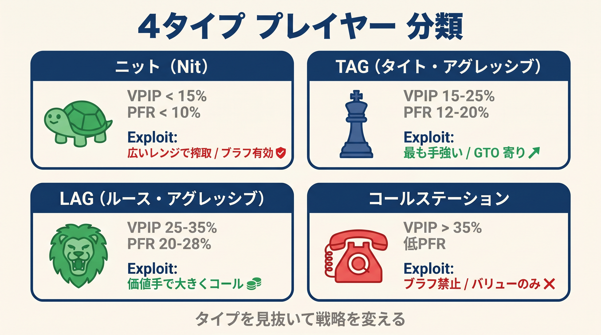

# 第17章　相手タイプとスタック深度によるしきい値調整

<!-- markdownlint-disable MD036 MD040 MD060 -->
<!-- textlint-disable preset-ja-technical-writing/no-mix-dearu-desumasu -->

本書で学んだ判断フロー（簡易レンジスコア チェックリスト・ハンド役割分類・CBet統合判定）は、100BBの標準的な状況を前提として設計されています。
しかし実戦では、対面する相手のプレースタイルや両者のスタック深度によって、最適な判断基準が大きく変わります。
本章では「式を現場で動かす」最終調整技術として、相手タイプ別の搾取戦略とスタック深度補正を体系的に解説します。

---

<figure><figcaption>ニット・TAG・LAG・コールステーションの4タイプ特性とエクスプロイト戦略グリッド図</figcaption></figure>

## 17-1　相手タイプ4分類

ポーカーの相手を分類する最もシンプルな指標が、VPIP（自発的にポットへ参加した割合）とPFR（プリフロップでレイズした割合）の2つです。
この2つの数値の組み合わせで、相手のプレースタイルをおおむね4つに分類できます。

| タイプ | VPIP / PFR目安 | プレースタイルの特徴 |
|--------|----------------|----------------------|
| Nit（タイト・パッシブ） | 12〜18 / 8〜14 | ヒットしないとフォールド、リレイズは本物のみ |
| TAG（タイト・アグレッシブ） | 19〜25 / 17〜23 | バランスされたレンジ、GTO近似のプレイ |
| コーリングステーション（ルース・パッシブ） | 40〜60 / 5〜15 | なんでもコール、フォールドしない |
| マニアック（ルース・アグレッシブ） | 30〜50 / 25〜45 | 広いレンジでベット・レイズを繰り返す |

分類の重要なポイントはVPIPとPFRの「ギャップ（差）」です。
ギャップが大きいほどパッシブ（コールが多い）、ギャップが小さいほどアグレッシブ（レイズが多い）と判断できます。
たとえばVPIP45・PFR12のプレイヤーはギャップが33もあり、典型的なコーリングステーションです。
VPIP22・PFR20のプレイヤーはギャップが2しかなく、攻撃的なTAGまたはLAGと判断します。

### VPIP/PFRの2軸マトリクス

```
              PFR低（〜12%）    PFR中（12〜22%）   PFR高（22%+）
VPIP低（〜20%）  Nit              TAG               ほぼ存在しない
VPIP中（20〜35%）Passive Reg      Solid TAG         LAG
VPIP高（35%+）  コーリングステーション  -           マニアック
```

ライブカジノやオンラインの低レートでは、100ハンド観察すれば大まかな傾向をつかめます。
精度を高めるには1000ハンド以上のサンプルが理想的ですが、フロップの判断を始める前に「この相手はどのタイプか」を仮設定するだけでも、CBet戦略は大きく改善します。

---

## 17-2　各タイプへのCBet調整

相手のタイプが分かれば、本書の統合式で算出したCBetスコアの「しきい値」を相手に合わせてずらすことができます。
標準的なしきい値（CBetスコア8以上でCBet実行）を基準として、各タイプへの調整を確認します。

### Nit（タイト・パッシブ）への対応

Nitはヒットしないとフォールドする傾向が強く、フォールドツーCBet（相手のCBetに対してフォールドした割合）が70%を超えることも珍しくありません。
この相手には、ブラフCBetを積極的に増やすことが正解です。

**しきい値の調整**：CBetスコアのしきい値を8→3まで引き下げ、エアを含む幅広いレンジでCBetを実行します。

具体的な戦術は以下のとおりです。

- フォールドツーCBetが70%以上なら、エアハンドでも1バレルCBetを打つ
- コールされたらターンはチェックバックして諦める（ワンアンドダン）
- レイズを受けたら即フォールド（Nitが弱いハンドでレイズすることは極めて少ない）

**実例**：K♠7♥2♣（簡易レンジスコア頻度85%、高頻度帯・ドライ）でAhJhを持つ場合、役割は「捨てる」（空振り）。通常はレンジベット対象（高頻度板）ですが、対Nitならエアでも積極的にCBet33%を打ちます。コールされたターンはチェックバックで降りるラインが合理的です。

### TAG（タイト・アグレッシブ）への対応

TAGはGTOに近いバランスされたプレイをする相手です。
過度なブラフは逆用されるリスクがあり、標準的なCBet戦略をほぼそのまま適用するのが基本です。

**しきい値の調整**：しきい値は変更しない（8のまま維持）。

ただし、HUDデータや観察からTAGの特定の偏りを見つけたときだけ、その部分を搾取します。
たとえば「フロップをコールした後にターンでフォールドが多い」TAGには、フロートを使ったターン奪取戦略が機能します。

### コーリングステーションへの対応

コーリングステーションは何でもコールする相手です。
ブラフCBetは完全にEVマイナスになります。フォールドしてくれないため、ブラフは損するだけです。

**しきい値の調整**：ブラフCBetのしきい値を「無限大」に設定（＝ブラフゼロ）。バリューCBetのしきい値は下げて薄いバリューでも積極的にベットします。

具体的な戦術は以下のとおりです。

- ブラフは一切打たない
- セカンドペアやアンダーペアでも積極的にバリューCBetを打つ
- CBetサイズを大きくする（ポットの75%以上）
- チェックレイズを極端に警戒しない（コーリングステーションはほとんどコールで済ます）

**実例**：T♥9♣8♦（簡易レンジスコア頻度30%、低頻度帯・ウェット）でT♠A♦を持つ場合、役割は「ショーダウンバリュー」（TPMK相当）。通常はウェットボードでチェックが選択肢に入ります。しかし対コーリングステーションなら、ショーダウンバリュー以上はすべてCBet75%を打つ方針に切り替えます。

### マニアックへの対応

マニアックは広いレンジでベット・レイズを繰り返す相手です。
こちらがCBetを打っても積極的にコール・レイズしてくるため、ブラフCBetのEVは低くなります。

**しきい値の調整**：ブラフCBetのしきい値を8→13に引き上げ、バリューベットの手でナッツクラスはトラップ（スロープレー）を選択します。

具体的な戦術は以下のとおりです。

- ナッツクラスの手（セット、フラッシュ完成など）はチェックコールまたはチェックレイズで誘導する
- 相手が自らバレルを打ってくれるため、ポットは自然に膨らむ
- ターンで大きなレイズを仕掛けると、マニアックをオーバーエクステンドさせやすい
- ブラフCBetは減らし、相手のレイズに対してはナッツ以外は降りる準備をする

---

## 17-3　スタック深度補正

本書の3式は100BBのスタックを前提として設計されています。
スタック深度が変わると、ハンドの価値・CBetサイズの最適値・判断基準が大きく変化します。

### ディープ（150BB以上）

150BB以上のディープスタックでは、スーテッドコネクター（98s、87s）や小ポケットペア、スーテッドエースの価値が大幅に上昇します。
インプライドオッズが最大化するため、ストレートやフラッシュを完成させたときの見返りが標準スタックより格段に大きくなります。

**CBet戦略の調整**

- フロップCBetサイズは小さく（ポットの33〜50%）してポットコントロールを優先する
- 1ペアハンドは慎重に扱う（後続ストリートで2回以上のレイズに耐えられない）
- ブラフのバレル数を増やせる（スタックが深いため多ストリートのプレッシャーが機能する）
- ナッツポテンシャルのない手（弱いトップペアなど）は早期に降りやすくする

**実例**：8♠7♠6♣（簡易レンジスコア頻度30%、低頻度帯・ウェット）でA♣A♥を持つ場合、標準100BBではCBet33%で手軽にポットをコントロールします。しかしディープ150BBでは、相手がセット、OESD+FD、フラッシュドローを持つ場合のインプライドオッズが高く、チェックバックでポットを小さく保つ選択肢も検討します。

### 標準（100BB）

本書の全章におけるデフォルトの前提条件です。
SPRはおおむね8〜12の範囲に収まり、GTO基準のCBet頻度・サイズが最もよく機能します。
式の数値や判断基準は標準スタックを基準に設計されているため、この条件でそのまま適用できます。

### ショート（40BB以下）

40BB以下のショートスタックでは、SPRが2〜4程度になります。
この状態では複雑なポストフロップライン（フロート、トリプルバレルなど）は成立しません。

**CBet戦略の調整**

- フロップCBetはほぼ「コミット（オールイン覚悟）」と同義になる
- プリフロップでオールインを見据えた意思決定が主体となる
- ドロー系ハンドの価値は大幅に低下（後続ストリートで資金が尽きる）
- プレミアムハンド以外はプリフロップでフォールドが最善になりやすい

**しきい値の変更**：ショートスタックではフロップの役割判定より「コミットできる強さか否か」の二択判断に移行します。攻める手（オーバーペア以上。ただしショーダウンバリュー相当のハンドはコミット寄りに判断）またはショーダウンバリューならコミット、守る・捨てる手なら慎重なポットコントロールを選択します。

| スタック深度 | 目安BB | フロップSPR目安 | CBetサイズ | 特徴 |
|------------|--------|--------------|------------|------|
| ディープ | 150BB以上 | 12〜20 | 33〜50% | ドロー価値↑、ナッツ志向 |
| 標準 | 100BB | 8〜12 | 33〜75% | 本書のデフォルト |
| ショート | 40BB以下 | 2〜4 | コミット判断 | プリフロップ決着志向 |

---

## 17-4　相手のCBet頻度を読む

相手がCBetを打つ頻度（フロップCBet%）は、HUDがなくても観察で推定できます。
この数値を読むことで、相手のCBetに対する最適な対応策が決まります。

### CBet頻度別の解釈と搾取法

| CBet頻度 | 解釈 | 搾取方法 |
|----------|------|----------|
| 70%以上 | 過剰CBet（エアを多く含む） | コール範囲を広げる、フロートしてターンで奪う |
| 50〜65% | GTO近似（対処しにくい） | ボードテクスチャとほかの観察で補完判断 |
| 30%以下 | タイトCBet（ほぼヒットのみ） | コールは強いハンドのみ、フォールド多用 |

### マルチストリートパターンの読み方

相手のフロップCBet頻度だけでなく、ターンCBet頻度を合わせて観察することで、より精度の高い搾取が可能です。

**ワンアンドダンタイプ（フロップ高・ターン低）**

フロップCBetが80%前後でもターンCBetが33%以下に落ちる相手は、フロップで広くCBetを打ちターンでは諦めるタイプです。
このタイプへの最も有効な搾取がフロートです。

フロートとは、フロップでCBetにコールしてハンドを持ち越し、相手がターンでチェックしてきたときにベットを打ってポットを奪う戦術です。

**過剰バレラータイプ（フロップ高・ターン高）**

フロップCBet75%・ターンCBet70%のような相手は、複数ストリートにわたってブラフを打ち続けるタイプです。
ターンでのフロートまたはチェックレイズが機能します。

**搾取可能な閾値まとめ**

- フォールドツーCBet70%以上 → エア含む幅広いレンジでCBetを打つ（コールされたら降りる）
- フォールドツーCBet35%以下 → バリューのみCBet、ブラフは控える

---

## 17-5　VPIP/PFRからタイプを推定する

HUDを使わない環境でも、観察から相手をおおまかに分類できます。
注目するポイントは以下の4つです。

**1. プリフロップのオープン頻度**

多くのハンドでプリフロップをオープンする相手（全体の30%以上）はVPIPが高いと推定できます。
ほとんどプレイしない相手（10%未満）はNitです。

**2. レイズとコールの比率**

コールが多くレイズが少ない相手はパッシブ、コールよりレイズが多い相手はアグレッシブと分類します。

**3. 3ベットの頻度**

3ベットをほぼしない相手（3ベット率2%以下）はパッシブ、頻繁に3ベットする相手（8%以上）はアグレッシブです。

**4. フォールド後の継続率**

CBetを受けてもコールし続ける相手はコーリングステーション、きれいにフォールドする相手はNitかTAGです。

**100ハンド以内の簡易判定フロー**

```
1. プリフロップ参加頻度を見る
   → 高い（30%以上）: ルース系
   → 低い（20%未満）: タイト系

2. 参加ハンドでレイズかコールか
   → レイズ多: アグレッシブ → TAG or マニアック
   → コール多: パッシブ → Nit or コーリングステーション

3. CBetを受けたときの反応
   → ほぼフォールド: Nit
   → ほぼコール: コーリングステーション
   → レイズが混じる: TAG or マニアック
```

---

## 17-6　5つのエクスプロイト軸（GTO Wizard）

GTO Wizardが定義する「フロップの5つのエクスプロイタブルなアンバランス」は、相手の搾取ポイントを体系的に整理するフレームワークです。
各軸の偏りを発見したとき、その逆を突くことでEVを最大化できます。

### 軸1：CBet頻度の偏り

- **偏りの発見**：CBet頻度が70%以上（過剰）または30%以下（タイト）
- **搾取**：過剰CBetにはコール範囲を広げる・フロートする。タイトCBetにはフォールド多用・コールは強ハンドのみ

### 軸2：CBetサイズの偏り

- **偏りの発見**：常に小サイズ（20%ポット以下）または常に大サイズ（100%以上）
- **搾取**：常に小サイズならレイズでプレッシャーをかける。常に大サイズなら強いハンドでコールし、弱いハンドは切る

### 軸3：チェックレンジの弱さ

- **偏りの発見**：OOPでのチェック後に弱いハンドしか持っていない（チェックコールやチェックフォールドが多い）
- **搾取**：相手がチェックしてきたら積極的にベットを打ち、ポットを奪う

### 軸4：降りすぎ傾向

- **偏りの発見**：フォールドツーCBetが70%を超える
- **搾取**：ブラフCBetの頻度を増やす。しきい値をCBetスコア3まで引き下げ、エアでも打つ

### 軸5：コールしすぎ傾向

- **偏りの発見**：フォールドツーCBetが30%以下、コールが異常に多い
- **搾取**：ブラフをゼロにして、バリューハンドのベット頻度とサイズを増やす

これら5つの軸を組み合わせて観察することで、相手の「最も搾取できる弱点」を特定できます。
実戦では1つの軸だけが偏っていることは少なく、複数の軸が同時に偏っているケースが多いです。

---

## 【GTOとのズレ】エクスプロイトはGTOから意図的に逸脱する技術

本章で解説した相手タイプ別調整は、GTO戦略から意図的に「ずれる」技術です。

GTO（ゲーム理論最適）戦略は、どんな相手に対しても搾取されない均衡戦略です。
しかし、GTO戦略は「搾取されない」ことを保証するだけで、相手の偏りを最大限に利用することはしません。
相手が明らかなミスを繰り返している場面で、GTO通りに打つことはむしろ機会損失です。

たとえばコーリングステーションに対してGTO通りにブラフを交えたバランスを取ると、ブラフCBetの分だけEVが失われます。
コーリングステーションには「ブラフをゼロにしてバリューを最大化する」というGTOから外れた戦略が、実際の利益を最大化します。

**エクスプロイトとGTOの使い分け**

| 状況 | 選択する戦略 |
|------|-------------|
| 相手のプレースタイルが不明 | GTOベースの標準的なCBet |
| 相手の明確な偏りを発見した | エクスプロイト（意図的なGTOからの逸脱） |
| 相手がTAGまたは未分類 | GTOバランスを維持しながら観察を続ける |

重要なのは、エクスプロイトが有効なのは「相手の偏りが存在するとき」だけです。
偏りが確認できない相手に対してエクスプロイトを試みると、自分が搾取されるリスクが生じます。
まずGTOベースを守り、偏りを発見したときだけ意図的に逸脱する、という順序で実践してください。

---

## まとめ

- 相手タイプはVPIP/PFRで4分類できる（Nit、TAG、コーリングステーション、マニアック）
- NitにはブラフCBetを増やし、コーリングステーションにはブラフゼロ・バリュー最大化で対応する
- TAGにはGTOバランスを維持、マニアックにはナッツをトラップしてCBetを絞る
- スタック深度はSPRで管理し、ディープなら小サイズ・ショートではコミット判断に移行する
- 相手のCBet頻度（フロップ・ターン）を読むことでフロート搾取の機会を特定できる
- GTO Wizardの5つのエクスプロイト軸（CBet頻度・サイズ・チェックレンジ・降りすぎ・コールしすぎ）を搾取の判断基準に使う
- エクスプロイトはGTOから意図的に逸脱する技術であり、相手の偏りが確認できたときにのみ有効

---

## クイズ

**Q1**：VPIP50・PFR8の相手と対戦しています。あなたはIPでA♣K♣を持ち、2♠5♥9♣のドライボードが出ました。CBetを打つとしたら、ブラフ（エア含む幅広いレンジ）とバリュー（強いハンドのみ）のどちらの方針を優先すべきでしょうか。

**A1**：バリュー重視が正解です。VPIP50・PFR8はVPIPとPFRのギャップが42と非常に大きく、典型的なコーリングステーションです。コーリングステーションにはブラフCBetのEVはマイナスになるため、バリューハンドのみCBetを打つ方針に切り替えます。AK（ハイカード2枚）はこのボードでヒットしていないため、CBetは控えてチェックバックが適切です。

**Q2**：相手のフロップCBet頻度が82%、ターンCBet頻度が31%です。あなたがフロップでコールしたとき、ターンで最も有効な戦術は何でしょうか。

**A2**：フロートが有効です。フロップ高・ターン低の組み合わせはワンアンドダンタイプの特徴です。ターンでチェックしてきたら積極的にベットを打ち、ポットを奪います。

**Q3**：スタック150BBのディープスタック戦で、フロップに6♥7♥8♦（簡易レンジスコア頻度30%、低頻度帯・ウェット）が出ました。あなたはT♠T♣を持っています。標準100BBと比較して、ディープスタックではどのような点に注意してCBetサイズを選ぶべきでしょうか。

**A3**：ディープスタックでは相手のスーテッドコネクターや小ポケットペアの価値が上昇しており、インプライドオッズが高くなっています。このウェットボードでは、CBetサイズは33〜50%の小サイズに抑えてポットコントロールを優先します。オーバーペアのTTは1ペアのため、後続ストリートで大きなレイズに対しては降りる準備も必要です。

---

## 出典

- [Different types of poker players and how you exploit them | BluffTheSpot](https://www.bluffthespot.com/blog/player-types)
- [Poker Playing Styles and How to Exploit Them | Ultimate Poker Coaching](https://ultimatepokercoaching.com/blog/poker-playing-styles-and-how-to-exploit-them/)
- [How to Crush Calling Stations in Poker | Pokercode](https://www.pokercode.com/blog/calling-stations)
- [LAG Poker Strategy: Crush Loose Aggressive Players | PokerCoaching](https://pokercoaching.com/blog/lag-poker/)
- [Play Like, or Against a Poker Maniac | 888poker](https://www.888poker.com/magazine/strategy/how-to-beat-a-poker-maniac)
- [The Five Imbalances of Exploitative Poker | GTO Wizard](https://blog.gtowizard.com/the-five-imbalances-of-exploitative-poker/)
- [How Stack Sizes Change Your Range | GTO Wizard](https://blog.gtowizard.com/how-stack-sizes-change-your-range/)
- [Deep Stack Poker: How To Adjust Your Strategy | Pokercode](https://www.pokercode.com/blog/deep-stack-poker-strategy)
- [Mastering SPR and Effective Stack Depth | PokerCoaching](https://pokercoaching.com/blog/poker-spr/)
- [Make These Two Profitable Exploits with HUD Statistics | Smart Poker Study](https://smartpokerstudy.com/make-these-two-profitable-exploits-with-hud-statistics/)
- [Exploiting Excessive C-Betting by OOP | GTO Wizard](https://blog.gtowizard.com/exploiting-excessive-c-betting-by-oop/)
- [VPIP and PFR - Poker Statistics | PokerCopilot](https://pokercopilot.com/poker-statistics/vpip-pfr)
- [GTO vs Exploitative Play | Upswing Poker](https://upswingpoker.com/gto-vs-exploitative-play-game-theory-optimal-strategy/)
