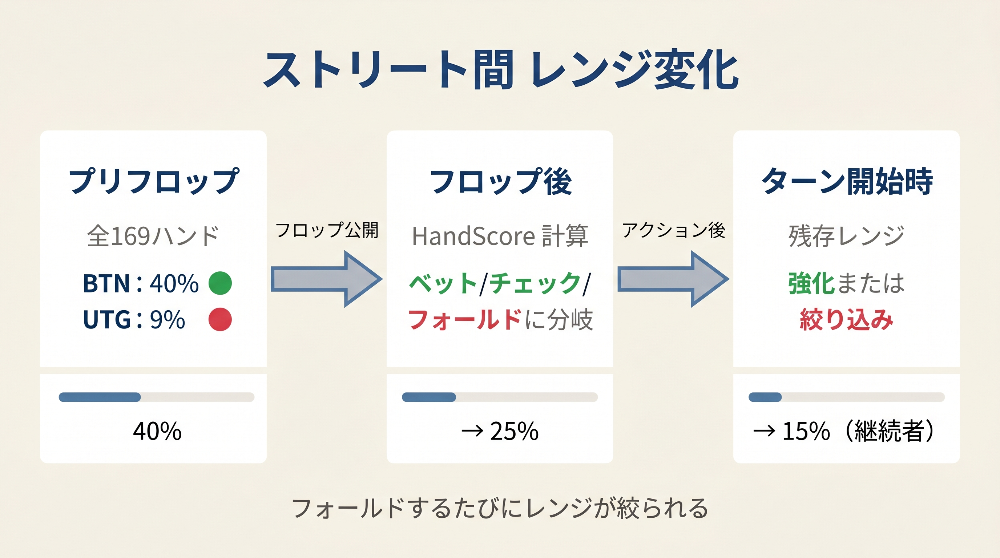

# 第18章　アクションからレンジを絞る（入門）

<!-- markdownlint-disable MD033 MD036 MD040 MD060 -->

> **本章の目標**: 相手のフロップアクション（CBetサイズ・チェック）から、相手のHandScore帯を大まかに読む感覚を身につけます。精密なベイズ更新は巻3 第7章で扱います。

前章までの本書式は「自分のハンドで何をすべきか」を決めるものでした。本章ではその式を**相手側に当てはめ**、相手がどのくらい強いかを大まかに推定します。

---

<figure><figcaption>プリフロップ→フロップ→ターンのストリート間レンジ変化（40%→25%→15%）図</figcaption></figure>

## 18-1　CBetサイズが教えること

フロップで相手が CBet を打ったとき、**サイズ**が相手のレンジに関する重要な情報を持っています。

第10章の先手スコアは「スコアが高いほど大きなサイズを選ぶ」という設計です。この**逆方向に読む**と：

| CBetサイズ | 相手のHandScore帯 | レンジの性質 |
|-----------|----------------|------------|
| 75%+ | H3（≥ 15）中心 | ポラライズ（強いバリュー or ブラフ）|
| 33% | H2（8〜14）中心 | リニア（レンジ全体でベット）|

### 使い方

相手のCBetサイズを見た瞬間に「このサイズならHandScore帯はこのくらい」と脳内で変換します。

- **75% CBetを受けた** → 相手はH3中心 → コール/フォールドを慎重に。後手スコアで判断（第13章）
- **33% CBetを受けた** → 相手はH2だが空振りも混在 → チェックレイズ機会あり

---

## 18-2　チェックバックが教えること

相手（IP）がフロップでチェックバックしたとき：

- 先手スコア < 7 → チェックバック（第10章）の逆読み
- 主に **H1（HandScore ≤ 7）**：ブランク空振り・弱いドロー
- ただし約5% は H3 のトラップ（セットのスロープレイなど）が混入する

→ **ターンで積極的にプロービングベットを検討**。相手のレンジが弱い場合、先手ベットが通りやすくなります。

---

## 18-3　自分の戦略への反映（3択）

相手のHandScore帯を読んだあとは、第13章の後手スコアで具体的な判断をします。

| 相手のCBet後の自分の状況 | 推奨方針 |
|----------------------|--------|
| 自分がH3（≥ 15） | 後手スコアを計算 → コール or チェックレイズ |
| 自分がH2（8〜14） | 後手下限ラインを基準にコールを検討 |
| 自分がH1（≤ 7） | 後手スコア < 0 → フォールド |

本章はその前段として「相手のHandScore帯を大まかに読む」だけに役割を絞ります。

---

> **巻3へのブリッジ**: 本章は「CBetサイズ→相手のHandScore帯」という入門的な逆読みです。より精密な「ベイズ更新による確率的レンジ絞り込み」は **巻3 第7章「フロップアクションによる絞り込み」** で扱います。サイジング4区分（33%/50%/75%/OB）の精密解釈、連鎖的な多段更新（フロップ→ターン）はそちらへ進んでください。

---

## 【GTOとのズレ】：ベイズ更新の省略

本章の「サイズ→HandScore帯」対応表は、GTOソルバーが行うベイズ更新を大幅に簡略化しています。

| 本章の近似 | 実際のGTO |
|---------|---------|
| HandScore帯は3区分 | コンボ単位で正確に頻度が決まる |
| チェック＝弱い（5%トラップ注意） | 混合戦略で強ハンドも一定割合チェック |
| サイズ2区分（33%/75%） | 33%/50%/75%/OB の4区分で精密化 |

「方向性を読む」という目的には十分です。精度を上げたい場合は巻3へ進んでください。

---

## 章のまとめ

- **75% CBet → 相手はH3中心**（強バリューorブラフ）、**33% CBet → H2中心**（レンジベット）
- **チェックバック → 相手はH1中心**（ただしトラップ5%）→ ターンでプロービング検討
- 自分の具体的なアクションは第13章の後手スコアに委ねる
- 精密なレンジ更新（ベイズ更新・多段更新）は **巻3 第7章** へ

---

## ミニクイズ

### 問1

BTNが K♣7♦2♠ で 75% CBetを打ってきました。相手のHandScore帯として最も近いのはどれでしょうか。

1. H1（≤7）中心
2. H2（8〜14）中心
3. H3（≥15）中心

### 問2

相手IPがフロップでチェックバックしました。ターンで自分（OOP）が取るべき姿勢として最も適切なのはどれですか。

1. チェックして様子見
2. プロービングベットを検討する
3. ポットサイズのオーバーベットで圧力

---

### 解答

- **問1**：3（75% CBet → H3中心）
- **問2**：2（相手のレンジがH1寄りのためプロービングが有効）

---

## 出典

- GTO Wizard『Range Advantage』『Nuts Advantage』
- 本書第10章（先手スコア）、第13章（後手スコア）
- 巻3 第7章（精密ベイズ更新）
