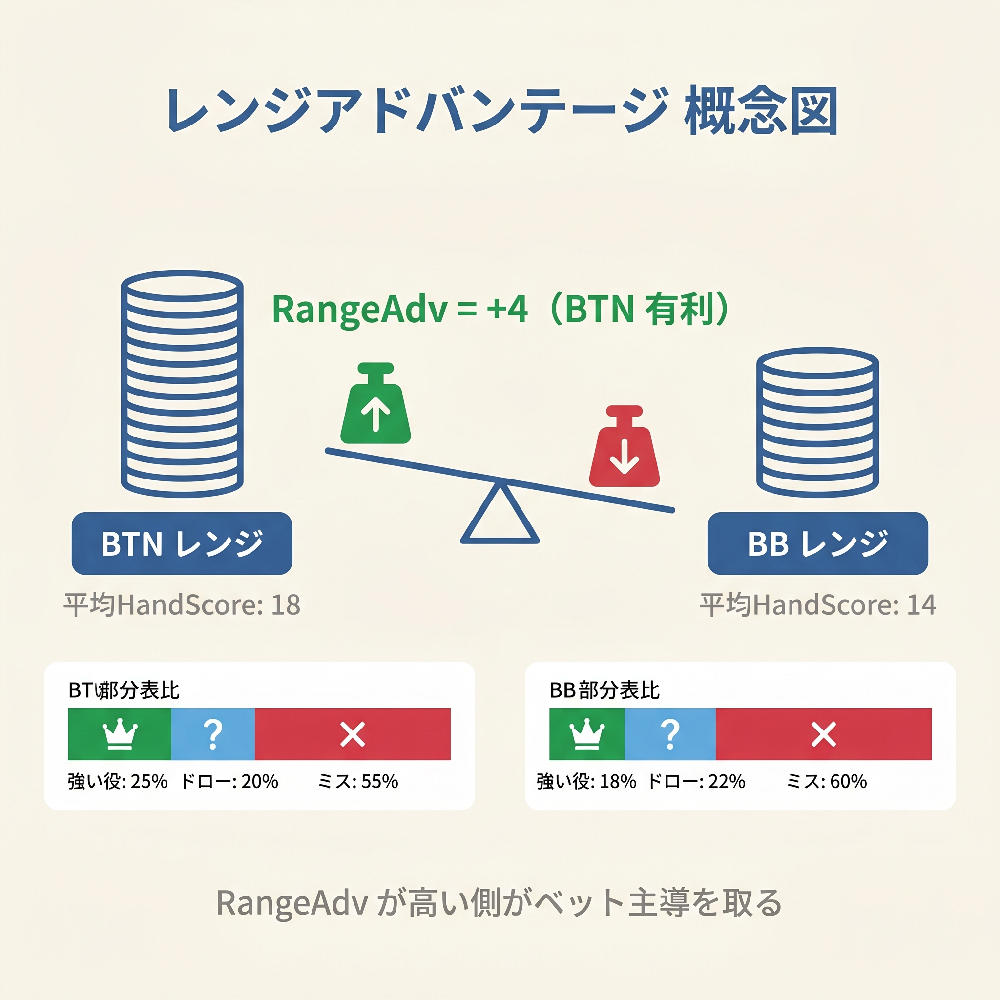
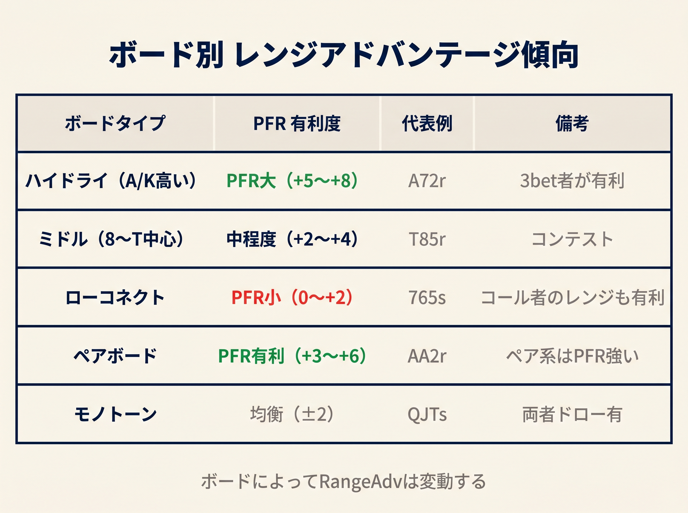

# 第22章　レンジアドバンテージとナッツアドバンテージの判定

<!-- markdownlint-disable MD040 MD060 -->
<!-- textlint-disable preset-ja-technical-writing/no-exclamation-question-mark -->
<!-- textlint-disable preset-ja-technical-writing/no-mix-dearu-desumasu -->

フロップで「ベットすべきか」を悩んでいるとき、本書のCBet統合式は頼りになる道具です。しかし、自分のハンドだけを見て判断していると、大切な視点が抜け落ちます。それが**レンジ全体の比較**です。相手のレンジと自分のレンジを対比し、どちらが優位にあるかを見極めることで、CBet頻度とサイズの両方を正確に設計できます。この章では、その羅針盤となる2つのアドバンテージ概念を解説します。

---

<figure><figcaption>BTN vs BBの平均HandScore差（+4）をバランス天秤で示すレンジアドバンテージ概念図</figcaption></figure>

<figure><figcaption>ハイドライ・ミドル・ローコネクト・ペア・モノトーン別のレンジアドバンテージ傾向テーブル</figcaption></figure>

## 22-1　レンジアドバンテージとは

レンジアドバンテージとは、特定のフロップ上で、自分のレンジ全体が相手レンジより高い平均エクイティを持つ状態を指します。個別ハンドの強さではなく、**レンジ全体のエクイティ分布**を比較する概念です。

たとえばUTGオープンのレンジは、AA-22・AK-AJ・KQなど強めのハンドが中心です。BBのディフェンスレンジは、スーテッドコネクターや中低カードを含む幅広い構成になります。このとき、K♠7♦2♣というドライボードが落ちると、UTGレンジに含まれるKx・AA・KK・QQは大きなエクイティを持ちます。一方でBBのレンジには、このボードでエクイティを持てないハンドが大量に存在します。つまりUTGがレンジアドバンテージを持つ状況です。

レンジアドバンテージが大きいほど、**ベット頻度を高められます**。相手のレンジはキャップ（上限）されており、こちらのベットに対してフォールドかコールかの厳しい選択を迫られます。逆にアドバンテージが小さい側がベットすると、相手に簡単にコールまたはレイズされるリスクがあります。

### HandScoreによる数値判定

本書では第8章で定義したHandScoreを使い、レンジアドバンテージを数値化します。

**判定フロー：**

1. 両プレイヤーの代表レンジをボード上でHandScore評価する
2. 各レンジの平均HandScoreを算出する
3. 差が5点以上ならアドバンテージあり（CBet推奨）
4. 差が10点以上なら強いアドバンテージ（大きなサイズも検討可）
5. 差が5点未満ならほぼイーブン（慎重なCBet）

この基準は本書オリジナルの簡易化アプローチです。GTO Wizardなどのソルバーを代替するものではなく、実戦判断の補助ツールとして活用してください。

---

## 22-2　ナッツアドバンテージとは

ナッツアドバンテージとは、ボード上で最強クラスのハンド（ツーペア以上）のコンビネーション数が、相手より多い状態を指します。レンジの平均強度ではなく、**最強ハンドの保有比率**で決まる点がレンジアドバンテージとの根本的な違いです。

ナッツアドバンテージが大きい側は、**ベットサイズを大きくできます**。大きなベットを前にした相手は「フォールドか、またはコールしてスタックを危険にさらすか」という二択を迫られます。このとき相手レンジにナッツが少なければ、コールは長期的に損になりやすく、フォールドが増えます。つまりナッツアドバンテージは、オーバーベットや大きなバリューベットを正当化する根拠になります。

### 2つのアドバンテージの比較

| 概念 | 判断基準 | 戦略への影響 |
|------|---------|------------|
| レンジアドバンテージ | レンジ全体の平均エクイティ | ベット頻度（大きいほど高頻度）|
| ナッツアドバンテージ | 最強ハンドのコンビネーション数 | ベットサイズ（大きいほど大サイズ）|

一方のアドバンテージだけを持つケースもあります。たとえばレンジアドバンテージはあるがナッツアドバンテージはない、という状況では「高頻度・小サイズ」のCBetが最適解になります。

### ナッツアドバンテージの数値判定

ツーペア以上のコンボ数を両プレイヤーで比較します。

- 自分のコンボ数が相手の1.5倍以上ならナッツアドバンテージあり（大きなサイズを推奨）
- コンボ数がほぼ同数ならナッツはイーブン（サイズは慎重に選ぶ）

---

## 22-3　GTO Wizard 原則：レンジアド → 頻度、ナッツアド → サイズ

GTO Wizardは、2つのアドバンテージとポジションの関係を次の原則として示しています。

> 「レンジアドバンテージはベット頻度を決め、ナッツアドバンテージはベットサイズを決める。ポジションは両方を増幅させる。」
>
> （出典：[The Mechanics of C-Bet Sizing | GTO Wizard](https://blog.gtowizard.com/the-mechanics-of-c-bet-sizing/)）

この原則を4象限マトリクスで整理すると、戦略の全体像が見えます。

| | ナッツアドあり | ナッツアドなし |
|-|------------|------------|
| **レンジアドあり** | 高頻度 × 大サイズ（理想形）| 高頻度 × 小サイズ（レンジベット）|
| **レンジアドなし** | 低頻度 × 大サイズ（選択的強ハンドのみ）| チェック推奨 |

右上の「高頻度 × 小サイズ」は、レンジベット戦略と呼ばれます。自分のレンジが平均的に優勢なため、ほぼ全ハンドで小さなベットを打ちます。右下の「低頻度 × 大サイズ」は、ごく強いハンドだけで大きなベットを打つ形です。

ポジション（IP）を持つ側はこの優位性がさらに増幅されます。後から行動できるため、相手のアクションを見てから判断できます。これにより、同じレンジアドバンテージを持つ場合でも、IPの方がより高い頻度とサイズでCBetできます。

---

## 22-4　代表ボードでのアドバンテージ評価：UTG vs BB

ここではUTGがオープン、BBがコールするシングルレイズドポット（SRP）を前提に、3つの代表ボードを比較します。

### K♠7♦2♣（レインボー・ドライ）

| 項目 | 評価 |
|------|------|
| BoardScore | 0（完全ドライ）|
| レンジアドバンテージ | UTG（大）|
| ナッツアドバンテージ | UTG（大）|
| 推奨CBet頻度（UTG）| 76〜91% |
| 推奨サイズ | 33% pot |

UTGのタイトなレンジにはKx・KK・AA・QQが多数含まれます。BBはKで降り札となるハンドを大量に持ち、ツーペア以上のコンボ数でもUTGが圧倒します。これは4象限マトリクスの左上「高頻度 × 大サイズ」が理想ですが、ボードがドライなため相手のコール頻度が低く、小さなサイズでも十分な圧力をかけられます。そのため「高頻度 × 小サイズ」のレンジベットが最適解です。

UTGは両アドバンテージを保有するため、33% potのスモールサイズで全体または大部分のレンジをベットします。

### T♠9♦8♣（コネクテッド・セミウェット）

| 項目 | 評価 |
|------|------|
| BoardScore | 7〜8（ウェット）|
| レンジアドバンテージ | BB有利 |
| ナッツアドバンテージ | BB有利 |
| 推奨CBet頻度（UTG）| 約44%（低め）|
| 推奨サイズ | 33〜50% pot |

BBのディフェンスレンジにはスーテッドコネクター（JTs・T9s・87s・76s等）が多数含まれます。このボードではJTでストレート完成、T9・98でツーペアが作れるため、BBがナッツアドバンテージを持ちます。さらにレンジ全体のエクイティでもBBが逆転します。

UTGはプリフロップで強いレンジを持ちますが、このボードではそれが機能しません。UTGのCBet頻度は約44%まで低下し、強いハンド（セット、オーバーペア+）に絞ったベットが推奨されます。

### A♠7♦6♣（セミコネクテッド）

| 項目 | 評価 |
|------|------|
| BoardScore | 4〜5（セミウェット）|
| レンジアドバンテージ | UTG（大）約66% vs 34% |
| ナッツアドバンテージ | UTG（AA・AX・KK-QQが多数）|
| 推奨CBet戦略 | レンジベット |
| 推奨サイズ | 25〜30% pot |

UTGはAを大量保有しており、Aハイボードでの平均HandScoreが大幅に高くなります。BBはAハイボードで多くのハンドがエクイティ不足となり、UTGが両アドバンテージを独占します。

K72との違いは、中カードの6・7がフラッシュドローやストレートドローの可能性を若干加える点です。それでもUTGの優位は揺らがないため、25〜30% potという非常に小さなサイズでレンジ全体をベットする戦略が成立します。

---

## 22-5　BTN vs BB のレンジ構造

BTN vs BBはフロップで最も頻繁に発生する対決であり、全ポジション対決の中で最も均衡に近いと言われます。それでもBTNが全体的に優位です。

| 指標 | BTN | BB |
|------|-----|----|
| プリフロップエクイティ | 57.4% | 42.6% |
| フロップでの優位性 | ほぼ全フロップで有利 | 中低カード連続ボードのみ |
| 例外ボード | 低中カード連続（6♣5♦4♥等）| 9♣7♠5♥など |

BBが完全にレンジアドバンテージを取り返せるボードは稀です。最もBBに有利なフロップ（654レインボー等）でも、BBのエクイティは52%未満程度に留まります。

このためBTN側は幅広くCBetを検討できます。BBは基本的に全レンジをチェックし、チェックレイズや遅延プレイで対抗します（BB側のCBet率は約2%）。BTNが57.4%のエクイティアドバンテージを持つ状況では、HandScoreが低くてもポジション係数（+3）が加わり、CBet統合式の判定が上がりやすい点も意識してください。

（出典：[Range Advantage in Poker 2026](https://www.vip-grinders.com/poker-strategy/range-advantage/)）

---

## 22-6　3betポットのレンジ

3betポットでは、3betした側がほぼすべてのフロップで両アドバンテージを持つ傾向があります。

**3bet側のレンジ特徴：**

- タイトな3betレンジ（AA・KK・QQ・JJ・AK・AQ等が中心）
- ビッグペアやブロードウェイカードが多く、ナッツアドバンテージを確保
- コールした相手のレンジはキャップされる（KK+・AKなどを3betで除外されている）

3betポットではSPRが低く（約3〜4）、スタック全体を使う判断が早い段階で迫られます。3bet側がIP（ボタン・CO側）の場合は、ほぼ全フロップでCBetが有利です。大きなサイズ（ポットの50〜75%）でも正当化できます。

3bet側がOOP（ブラインド側）の場合でも、レンジアドバンテージが大きいため高頻度のCBetが正解です。ポジション不利を補うために積極的にベットし、主導権を維持します。特にブランクフロップ（相手のコールレンジに絡まないボード）ではCBet頻度がさらに高まります。

**3betポット vs フラットコールポットの比較：**

| 比較項目 | 3betポット | SRP（フラットコールポット）|
|---------|----------|----------------------|
| SPR | 約3〜4 | 約8〜12 |
| 3bet側のレンジアドバンテージ | ほぼ全フロップで大 | ボード依存 |
| 推奨CBet頻度 | 70%以上 | 44〜91%（ボード依存）|
| 推奨サイズ | 25〜75% | 25〜75% |
| コミット判断 | 早い（SPR低）| 遅い（SPR高）|

（出典：[C-Betting IP in 3-Bet Pots | GTO Wizard](https://blog.gtowizard.com/c-betting-ip-in-3-bet-pots/)、[C-Betting OOP in 3-Bet Pots | GTO Wizard](https://blog.gtowizard.com/c-betting-oop-in-3-bet-pots/)）

---

## 22-7　本書式での判定：HandScore平均差を使う

本書のHandScoreを応用した2つのアドバンテージ判定をまとめます。

### レンジアドバンテージの判定

**ステップ1：** 両プレイヤーの代表レンジを特定する。

- UTGオープン：タイトな線形レンジ（AA-22・AK-AJ・KQ等）
- BBディフェンス：幅広いレンジ（スーテッドコネクター・中低カード含む）
- BTNオープン：広いレンジ（ほぼ全ハンドの約40〜50%）

**ステップ2：** ボードとの絡みやすさを確認する。

- 高カード（A・K・Q）ボード → オープンレイザー有利
- 低中カード連続ボード（987等）→ BBディフェンダー有利
- レインボードライボード → 平均HandScoreが高い側が有利
- フラッシュ・ストレートドロー豊富なボード → どちらのレンジが絡むか確認

**ステップ3：** HandScore差で判定する。

```
平均HandScore差 = 自分レンジの平均 − 相手レンジの平均

差が 5点以上  → アドバンテージあり（CBet推奨）
差が10点以上  → 強いアドバンテージ（大きなサイズも検討）
差が 5点未満  → ほぼイーブン（慎重なCBet）
```

### ナッツアドバンテージの判定

```
ナッツ判定 = 自分のツーペア以上コンボ数 ÷ 相手のツーペア以上コンボ数

1.5倍以上  → ナッツアドバンテージあり（大きなサイズ推奨）
1.5倍未満  → ナッツはイーブン（サイズは慎重に）
```

### 判定の統合例：K♠7♦2♣でのUTG vs BB

| 項目 | UTG | BB |
|------|-----|----|
| 代表ハンド | KK・AK・QQ | 76s・54s・J8s |
| ボード上の平均HandScore（概算）| 約18〜20点 | 約5〜8点 |
| HandScore差 | 約12点（UTG優位）|（差が10点以上）|
| ツーペア以上コンボ数 | 多（KK・77・22）| 少（ほぼなし）|
| ナッツ比率 | 2倍以上 | − |

**判定：** UTGはレンジアドバンテージ（強・10点差超）かつナッツアドバンテージ（1.5倍超）を保有。→ 高頻度（76〜91%）× 小サイズ（33%）のレンジベットが最適解。

---

## 【GTOとのズレ】個別ハンドではなくレンジ全体の話

本章の判定基準は「レンジ全体のHandScore平均」を使います。これはGTOの考え方に近いアプローチですが、実際のGTO解析と比べると重要なズレがあります。

**GTOが見ているもの：**

GTO解析では、各ハンドのエクイティをレンジ全体の分布として捉え、「エクイティの形」（偏り方）まで考慮します。たとえば、平均エクイティが同じ60%でも、「強いハンドが少なく中程度が多い形」と「強いハンドが多く弱いハンドも多い形」では、最適なベット戦略が異なります。

GTO Wizardはエクイティ分布の「ピーク」と「フラット度」も分析します。これにより、同じレンジアドバンテージでも異なるCBet戦略が導かれることがあります。

**本書のHandScore判定の限界：**

本書の平均HandScore差（5点・10点基準）は、分布の形ではなく平均値のみを比較します。そのため次のケースでは判定精度が下がります。

- 「トップペア多数・ブラフも多数」という二極化レンジ
- 両プレイヤーがドロー主体になるウェットボード
- マルチウェイポット（プレイヤーが増えるほど個別レンジが複雑化）

**実戦での使い方：**

本書式は「どちらが有利か」の大まかな判断には有効です。しかし「どのサイズが最適か」を精緻に計算したい場合は、GTO WizardやPioSolverでの確認を推奨します。本書の判定で方向性を決め、実戦経験を積みながら感覚を磨いていきましょう。

---

## まとめ

- **レンジアドバンテージ**はレンジ全体の平均エクイティで決まり、**ベット頻度**を決定する
- **ナッツアドバンテージ**はツーペア以上のコンボ数で決まり、**ベットサイズ**を決定する
- GTO Wizard原則：「レンジアド → 頻度、ナッツアド → サイズ、ポジションは両方を増幅」
- K♠7♦2♣ではUTGが両アドバンテージを持ち、高頻度（76〜91%）× 小サイズ（33%）が最適
- T♠9♦8♣ではBBがレンジ・ナッツ両アドバンテージを逆転し、UTGのCBet頻度は約44%に低下
- A♠7♦6♣ではUTGが約66% vs 34%のレンジアドバンテージを持ち、25〜30%のレンジベットが有効
- BTNはプリフロップエクイティ57.4%を持ち、ほぼ全フロップでBBより有利
- 3betポットでは3bet側がほぼ全フロップで両アドバンテージを保有し、高頻度CBetが推奨
- 本書式判定：HandScore差5点以上でアドバンテージあり、10点以上で強いアドバンテージ
- ナッツ判定：ツーペア以上コンボ数が相手の1.5倍以上でナッツアドバンテージあり

---

## ミニクイズ

**Q1.** UTGがBBに対してA♠K♦3♣（レインボー）のフロップでCBetを検討しています。このボードでのアドバンテージ判定はどうなりますか？また推奨される戦略は何ですか？

**A1.** UTGはAを多く保有し、レンジアドバンテージ（大）を持ちます。ナッツアドバンテージもUTGが優位（AK・AA・KK等）です。4象限マトリクスの「高頻度 × 小サイズ」に該当し、25〜33% potのレンジベット（全ハンドまたは大部分のハンドでCBet）が推奨されます。

---

**Q2.** BTN vs BBでフロップが8♣6♦4♥（レインボー）になりました。このボードでのアドバンテージはどちらにありますか？

**A2.** このボードはBBのディフェンスレンジに有利な低中カード連続系です。BBの例外ボードの1つに近く、BBがレンジアドバンテージを部分的に取り返す可能性があります。それでもBTNのプリフロップエクイティ（57.4%）は依然として優位であり、BB側が完全に逆転するには至りません。BTNは選択的CBet（強いハンドに絞る）を検討し、BBはチェックレイズやフロップでの積極策を取りやすい場面です。

---

**Q3.** 3betポットでフロップが落ちました。3bet側（IP）がほぼ全フロップでCBetを推奨される理由を2つ答えてください。

**A3.**（1）3betレンジはAA・KK・QQ・AK等のビッグハンドが中心のため、ほぼ全フロップでレンジアドバンテージとナッツアドバンテージの両方を持ちます。（2）IPのポジション優位（後から行動できる）がアドバンテージをさらに増幅させます。加えてSPRが低い（約3〜4）ため、相手のコールレンジがコミット圧力を受けやすい点も理由の1つです。

---

## 参考文献

- [Range Advantage in Poker 2026: Board Texture & Frequencies](https://www.vip-grinders.com/poker-strategy/range-advantage/)
- [Dominating with Nut Advantage: A Key Edge in Poker Strategy](https://pokercoaching.com/blog/dominating-with-nut-advantage-a-key-edge-in-poker-strategy/)
- [Mastering Range Advantage: A Key to Winning Poker Strategy](https://pokercoaching.com/blog/range-advantage/)
- [The Mechanics of C-Bet Sizing | GTO Wizard](https://blog.gtowizard.com/the-mechanics-of-c-bet-sizing/)
- [Interpreting Equity Distributions | GTO Wizard](https://blog.gtowizard.com/interpreting-equity-distributions/)
- [C-Betting IP in 3-Bet Pots | GTO Wizard](https://blog.gtowizard.com/c-betting-ip-in-3-bet-pots/)
- [C-Betting OOP in 3-Bet Pots | GTO Wizard](https://blog.gtowizard.com/c-betting-oop-in-3-bet-pots/)
- [Early Position Bets Facing The Big Blind](https://pokercoaching.com/blog/early-position-bets-facing-the-big-blind/)
- [How to Use Positional, Range, and Nut Advantages to Maximize Profit](https://upswingpoker.com/nut-range-positional-advantage/)
