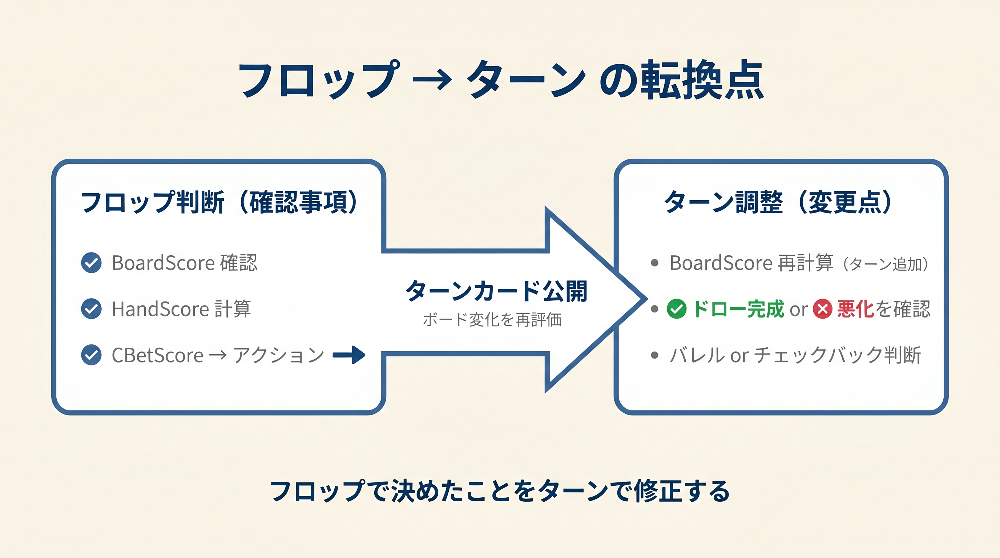

# 第25章　ターン・リバーへのブリッジ

> **本章の目標**: 本書はフロップ特化ですが、実戦ではターン・リバーにもつながります。**本書を卒業した後、次にどう進むか**を示す橋渡しの章です。

本書のここまででフロップ判断はマスターできました。しかし1ハンドは、フロップで終わるとは限りません。相手がコールしてきたら、ターン・リバーと続きます。

本章では、ターン以降で必要になる**4つの重要概念**を軽く紹介します。いずれも次の姉妹編（『ターン・リバーは連鎖で勝つ』仮題）で本格的に扱いますが、今の段階でも知っておくと実戦で迷いが減ります。

---

<figure><figcaption>フロップの3ステップ判断からターンへの転換（ボード再評価・バレル判断）フロー図</figcaption></figure>

## 25-1 Delayed CBet（遅延 CBet）

### 概念

**Delayed CBet** は、「フロップでチェック → ターンで初めてベット」というラインです。IPプレイヤーが主に使います。

### なぜ使うか

- **フロップでレンジアドバンテージがない場合**：チェックバックで情報収集
- **相手のチェックは弱さのシグナル**：ターンで取りに行ける
- **自分のレンジを読まれない**：チェック→ベットの混合戦略

### 頻度の目安

GTOデータでは、フロップをチェックバックした後のターンCBet頻度は**約 50〜60%**。相手がフロップでチェックしているレンジに対して、ターンで攻めるのが基本戦略です。

---

## 25-2 Double Barrel（2バレル）

### 概念

**Double Barrel** は、「フロップでCBet → ターンで再度CBet」の連続攻撃です。

### 打つ条件

ターンカードが以下の場合、Double Barrelが推奨されます。

1. **自分のレンジを強化する**：A、K、Qのような高カード
2. **相手のレンジを弱化する**：相手が通常ヒットしないカード
3. **ドローカード**：相手のドローが完成してしまうカード（自分がTP以上なら速く取る）

### 打たない条件

- ターンカードが相手のレンジにヒットしやすい
- 自分のレンジが変化しない
- ドローが完成して相手がマークしやすい

### Double Barrel の頻度

GTOでは、フロップでCBetした後のターンCBet頻度は**約 50〜70%**。フロップの80% から少し下がりますが、依然として高頻度です。

---

## 25-3 Triple Barrel（3バレル）とリバーの2分岐

### 概念

**Triple Barrel** は、フロップ → ターン → リバーの3ストリート連続CBet。最もアグレッシブなラインです。

### リバーの2分岐

リバーでは、あなたのアクションは**バリュー か ブラフ** の2分岐になります。

- **バリュー**：相手がより弱いハンドでコールしてくれる
- **ブラフ**：相手がより強いハンドを降りてくれる

それ以外（ブラフキャッチにバリューベットする、バリューハンドで降ろしに行くブラフベット）は、ほぼ常に間違いです。

### リバーでのバリュー/ブラフ比

GTOでは、リバーのベットレンジは**バリュー 2 : ブラフ 1**（ポット比1:1のとき）が理論値。ブラフが足りないと読まれ、多すぎると搾取されます。

---

## 25-4 ポット管理とコミットメント

### SPR がすべてを決める

ターン以降の判断は、**残りの SPR**で大半が決まります。

- **SPR ≤ 1**：コミット済み、TPでもオールイン
- **SPR 1〜3**：セミコミット、強いTPでもスタックオフ覚悟
- **SPR 3+**：まだ降りる自由あり

### コミットメントスレッショルド

「スタックの1/3以上を投入したら、もう降りられない」という経験則。1/3を超えたら、そのポットは**勝ちに行く**以外に選択肢はありません。

### 3 ストリートのポット進化

100BBスタックでの典型的なポット進化：。

- **フロップ**：6.5bb（SRP、SPR約17）
- **ターン**：33% CBet後22bb（SPR約4.5）
- **リバー**：33% CBet後44bb（SPR約1.5、コミット）

フロップでは柔軟性があっても、リバーではコミット済み。この進化を**意識して**フロップから計画すべきです。

---

## 25-5 ストリート間の連鎖

### 「意図」を早くから持つ

優れたプレイヤーは、フロップでのCBetを打つ前に**ターン・リバーの計画**を持っています。

例：BTNでK♠Q♠ オープン、BBコール。フロップK♣7♦2♣。

- フロップ：TPGK + BDFD → 33% CBet
- **ターンカード別の計画**：
  - K/Q（自分のレンジ強化）：Double Barrel 66%
  - クラブ（FD完成）：Double Barrel 75%（バリュー + プロテクション）
  - A（相手のレンジ強化）：チェック
  - ロー（7以下）：33% 継続

こうした計画を持たずにCBetを打つと、ターンで迷って悪手を打ちます。

---

## 25-6 本書から次へ

### 本書でできること

- プリフロップ（前作）とフロップ（本書）の判断を暗算で行う
- 3式で90% 以上の状況をカバー
- 境界ハンドは暗記で補填

### 本書で**できないこと**

- ターン・リバーのストリート固有の判断
- Delayed CBet、Triple Barrel、Floatの精密実装
- レンジ全体のバランス構築

### 次の学習対象

本書の次は、姉妹編が選択肢の1つ。あるいは：。

- **GTO Wizard の AIトレーナー**でポストフロップ全体を学ぶ
- **Matthew Janda『Applications of NLHE』**で理論の土台を固める
- **Run It Once**、**Upswing Lab** の有料コースでポストフロップ専門コース

詳細は第26章で示します。

---

## 25-7 フロップマスターの証

次のことができれば、あなたは**フロップマスター**です。

- 相手のCBetに対して、瞬時に**正しい対応**を選べる
- ボードテクスチャを見た瞬間に**自分のレンジ有利/不利**がわかる
- 自分のCBetが**バリュー / ブラフ / プロテクション**のどれかを言語化できる
- SPRを常に意識して、ターン以降の計画を持てる

これができれば、相手がフロップで打ってくる時の対応が自動化します。あとは**ターン・リバーの応用**を積み重ねるだけです。

---

## 【GTOとのズレ】ストリート間の最適化

GTOでは**全ストリートを一括最適化**します。リバーのブラフ比率から逆算してターンのアクションを決め、さらに逆算してフロップを決める。この「逆算」はソルバーの得意技ですが、人間の脳では困難です。

本書は**フロップ単体の最適化**に徹し、ターン・リバーへの連結は「計画を持つ」という緩やかな指針にとどめます。厳密な連鎖最適化は、本書の範囲を超えます。

---

## 章のまとめ

- Delayed CBetは「フロップチェック → ターンベット」のラインでIPが主に使う
- Double Barrelは「ターンが自分のレンジを強化するか相手を弱化するか」で判断
- Triple Barrelはフロップから一貫した計画が必要
- リバーのアクションはバリュー orブラフの2分岐、中途半端は悪手
- SPRはすべてを決める、コミットメントスレッショルドは1/3
- フロップでCBetする前にターン・リバーの計画を持つ
- 本書卒業後はGTO Wizard、Janda、Run It Onceなどへ

---

## ミニクイズ

### 問1

Delayed CBetとは何でしょうか。

1. 相手より先に打つCBet
2. フロップでチェックした後、ターンで打つCBet
3. リバーで初めて打つCBet

### 問2

Double Barrel（ターンCBet継続）が推奨されるターンカードとして最も適切なのはどれでしょうか。

1. 相手のレンジにヒットするカード
2. 自分のレンジを強化するか、相手のレンジを弱化するカード
3. 完全にランダムなカード

### 問3

コミットメントスレッショルドの目安は、スタックの何分の一でしょうか。

1. 1/10
2. 1/3
3. 1/2

---

### 解答

- **問1**：2（フロップチェックバック後のターンベット）
- **問2**：2（自分を強化or相手を弱化）
- **問3**：2（1/3を超えたらコミット）

---

## 出典

- Upswing Poker『What is a Delayed C-Bet』
- GTO Wizard『Double Barreling Strategy』
- Upswing Poker『Turn and River Strategy』
- Phil Galfond『Stacking Off Considerations』
- 本書第9章、第17章（SPR）、第23章（ドリル）
