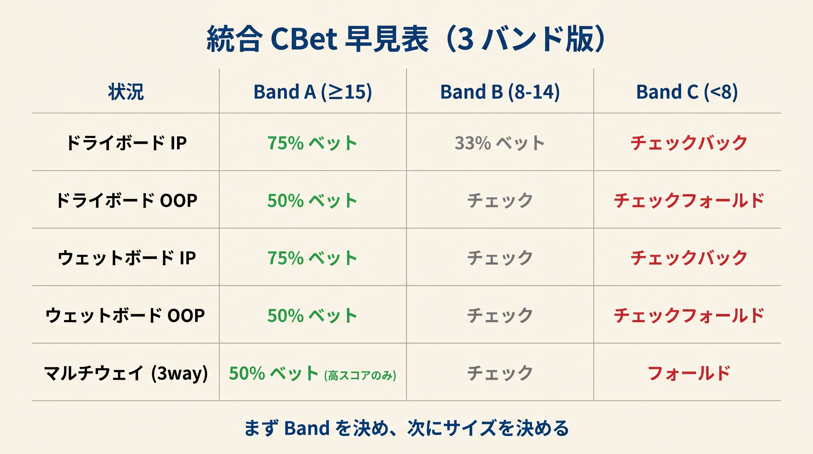
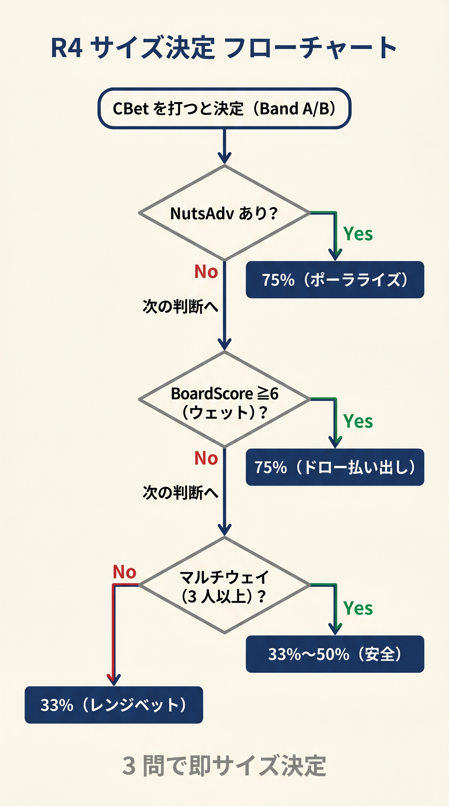
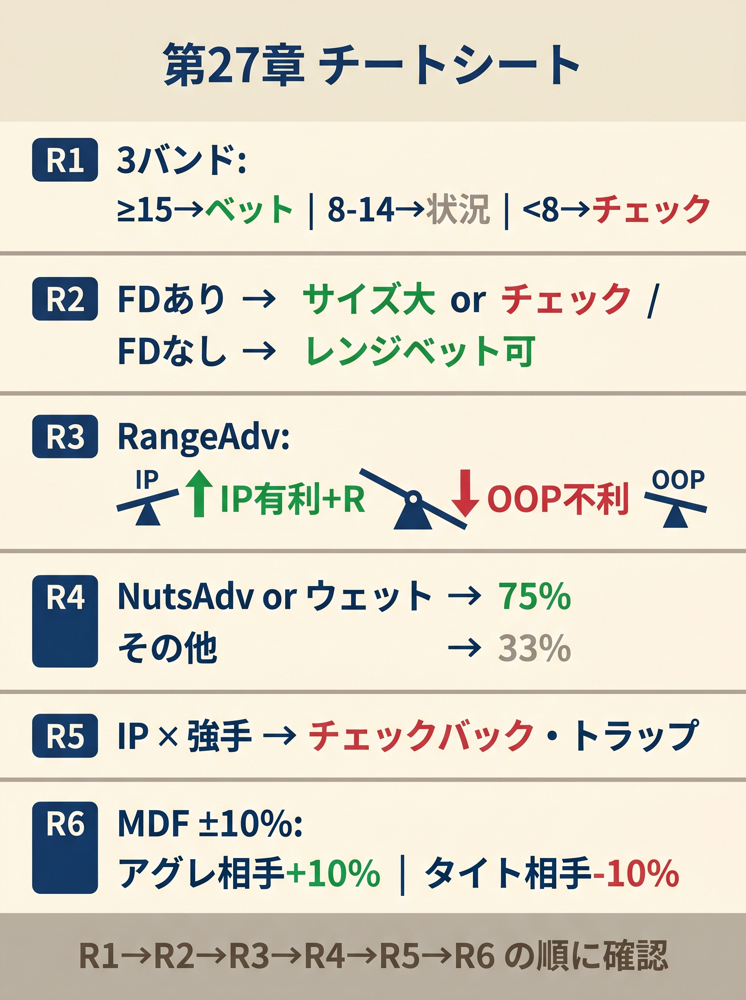

# 付録

<!-- markdownlint-disable MD036 MD056 MD060 -->
<!-- textlint-disable preset-ja-technical-writing/no-exclamation-question-mark -->
<!-- textlint-disable preset-ja-technical-writing/no-mix-dearu-desumasu -->

本書の本文で扱った内容を、実戦時に即参照できる形にまとめた資料集です。

---

<figure><figcaption>ボードタイプ×ポジション×3バンドの組み合わせ別アクション早見テーブル</figcaption></figure>

<figure><figcaption>NutsAdv→BoardScore→マルチウェイの3問でCBetサイズ（33% or 75%）を決定するフローチャート</figcaption></figure>

<figure><figcaption>R1〜R6の全ルールを1枚に凝縮した第27章フロップ判断チートシート</figcaption></figure>

## 付録0　参考文献（References）

本書の執筆・設計にあたり参照した主要な文献・ツール・ウェブ記事を分野別に列挙します。

### 書籍

- **Bill Chen & Jerrod Ankenman** *The Mathematics of Poker* (Conjelco, 2006)
- **Matt Janda** *Applications of No-Limit Hold'em* (DailyVariance, 2013)
- **Michael Acevedo** *Modern Poker Theory* (D&B Publishing, 2019)
- **Jonathan Little** *Excelling at No-Limit Hold'em* (D&B Publishing, 2015)
- **Phil Gordon** *Phil Gordon's Little Green Book* (Simon Spotlight, 2005)

### ウェブ / ツール

- **GTO Wizard** — <https://gtowizard.com/>（主要データ出典、有料プラン推奨）
- **Upswing Poker Blog** — <https://upswingpoker.com/blog/>
- **SplitSuit Poker (Gareth James)** — <https://www.splitsuit.com/>
- **PokerCoaching.com (Jonathan Little)** — <https://pokercoaching.com/>
- **Run It Once Training** — <https://www.runitonce.com/>
- **The Poker Bank** — <https://www.thepokerbank.com/>

### 前作（本シリーズ）

- 川西智也『プリフロップは計算で勝つ』（2026）
- <https://cuzic.github.io/poker-books/preflop/>

### 謝辞

本書はこれらの公開データと先行書籍の蓄積なしには成立しえません。特にGTO Wizardの膨大な分析データ、SplitSuitの分類フレームワーク、Phil Galfondのレンジ均衡論には大きな影響を受けています。

---

## 付録A　ボードテクスチャ早見表（50 ボード）

BoardScoreを事前計算した代表フロップ一覧。

### ドライボード（BoardScore ≤ 3）

| ボード | BoardScore | 計算 |
|-------|----------|------|
| K♣7♦2♠ | 0 | バラバラ+レインボー+Broadway1枚 |
| A♠8♥3♦ | 2 | バラバラ+ツートーン+Broadway1枚 |
| K♣9♦4♥ | 0 | バラバラ+レインボー+Broadway1枚 |
| Q♣6♦3♠ | 0 | バラバラ+レインボー+Broadway1枚 |
| J♠7♦2♣ | 0 | バラバラ+レインボー+Broadway1枚 |
| T♠6♦3♣ | 0 | バラバラ+レインボー+Broadway1枚 |
| 9♠5♦2♣ | 0 | バラバラ+レインボー+Broadway0 |
| K♣9♦3♣ | 3 | Broadway1枚+ツートーン+バラバラ |
| 7♦7♣K♠（ペア） | −1 | ペア補正（−1） |
| 9♥9♦2♣（ペア） | −1 | ペア補正（−1） |
| K♦Q♠2♣ | 3 | 1〜2ギャップ(+2)+Broadway2枚(+1) |
| A♦K♠5♣ | 3 | Broadway2枚(+1)+1〜2ギャップ(+2) |

### セミウェットボード（BoardScore 4〜6）

| ボード | BoardScore | 計算 |
|-------|----------|------|
| K♦T♠5♣ | 3 | 1〜2ギャップ(+2)+Broadway2枚(+1) |
| J♦8♣4♦ | 4 | 1〜2ギャップ(+2)+ツートーン(+2) |
| Q♣J♦9♠ | 4 | 連続2枚+ギャップ1(+3)+Broadway2枚(+1) |
| T♥9♠8♣ | 5 | 連続3枚(+5) |
| J♠9♦6♥ | 4 | 1〜2ギャップ(+2)+Broadway1枚+レインボー |
| T♦9♣6♠ | 5 | 連続2枚+ギャップ(+3)+レインボー |
| K♣J♦9♥ | 5 | 1〜2ギャップ(+2)+Broadway2枚(+1)+レインボー |

### ウェットボード（BoardScore ≥ 7）

| ボード | BoardScore | 計算 |
|-------|----------|------|
| 9♠8♦7♣ | 5 | 連続3枚(+5)+レインボー |
| J♠T♠9♦ | 8 | 連続3枚(+5)+ツートーン(+2)+Broadway2枚(+1) |
| 9♣8♣7♦ | 7 | 連続3枚(+5)+ツートーン(+2) |
| T♦9♦8♣ | 7 | 連続3枚(+5)+ツートーン(+2) |
| K♥9♥5♥（モノトーン） | 7 | モノトーン(+5)+1〜2ギャップ(+2) |
| A♥K♥Q♥ | 11 | 連続3枚(+5)+モノトーン(+5)+Broadway3枚(+1) |
| 8♠7♠6♦ | 7 | 連続3枚(+5)+ツートーン(+2) |
| 7♥6♥5♣ | 7 | 連続3枚(+5)+ツートーン(+2) |

---

## 付録B　169 ハンド × 6 代表ボード 継続判断表

代表6ボードで、主要なハンドの継続判断（CBet 75%／33%／チェック／フォールド）。

### ボード1：K♣7♦2♠（超ドライ、BoardScore 0）

| ハンド | HandScore | 判定（IP） |
|-------|----------|--------------------|
| KK（セット） | 30 | CBet 75% |
| AA（OP） | 20 | CBet 75% |
| AK（TPTK） | 18 | CBet 75% |
| KQ（TPGK+BDFD） | 19 | CBet 75% |
| 88（アンダーペア） | 6 | チェック |
| AQ（空振り） | 0 | チェック |
| AhQh（空振り+BDFD） | 4 | チェック |

### ボード2：9♥8♥7♦（ウェット、BoardScore 7）

| ハンド | HandScore | 判定（IP） |
|-------|----------|--------------------|
| 77（セット） | 30 | CBet 75% |
| AhTh（モンスタードロー） | 15 | CBet 33% |
| JhTh（OESD+FD） | 15 | CBet 33% |
| KK（OP） | 20 | CBet 33%（ウェット注意） |
| JTo（OESD） | 12 | CBet 33% |

### ボード3：A♠8♥3♦（ドライ、A ハイ、BoardScore 2）

| ハンド | HandScore | 判定（IP） |
|-------|----------|--------------------|
| AK（TPTK） | 18 | CBet 75% |
| AQ（TPGK） | 15 | CBet 75% |
| AhKh（TPTK+BDFD） | 22 | CBet 75% |
| KQ（空振り） | 0 | チェック |
| KQ（空振り+BDFD Aバーフッド なし） | 0 | チェック |
| 99（アンダーペア） | 6 | チェック |

### ボード4：Q♣J♦9♠（セミウェット、Broadway、BoardScore 4）

| ハンド | HandScore | 判定（IP） |
|-------|----------|--------------------|
| QQ（セット） | 30 | CBet 75% |
| JJ（セット） | 30 | CBet 75% |
| AK（OESD+BDFD） | 0+12+4=16 | CBet 33% |
| AQ（TPTK） | 18 | CBet 75% |
| KT（OESD） | 12 | CBet 33% |
| AJ（TPGK） | 15 | CBet 33% |

### ボード5：T♥9♠8♣（セミウェット、BoardScore 5）

| ハンド | HandScore | 判定（IP） |
|-------|----------|--------------------|
| TT（セット） | 30 | CBet 75% |
| JJ（OP） | 20 | CBet 33%（注意） |
| JT（TPTK+OESD） | 18+12=30（キャップ?） | 実用 25 | CBet 75% |
| QJ（OESD） | 12 | CBet 33% |
| 65s（ダブルガットショット） | 12 | チェック |

### ボード6：5♣4♦2♠（ロードライ、BoardScore 2）

| ハンド | HandScore | 判定（IP） |
|-------|----------|--------------------|
| AA（OP） | 20 | CBet 75% |
| 55（セット） | 30 | CBet 75% |
| AK（空振り） | 0 | チェック |
| AhKh（空振り+BDFD+2 オーバー） | 0+4+9=13 | CBet 33% |
| 33（アンダーペア） | 6 | チェック |

---

## 付録C　よくある誤解 Q&A

### Q1：ウェットボードでは CBet しないべきですか

**A**：いいえ、**大きく打てば有効**です。ウェットなボードほど、ドローが多く、ベットサイズでドローにオッズを与えないことが重要。セット、オーバーペアでは75%+ で打ちましょう。

### Q2：ドンクベットは本当に禁止ですか

**A**：第15章で扱った通り、**現代 GTO では一部のローコネクターボード（987、765 など）で BB のドンクが正当化**されます。ただし初級者は「自分でドンクしない」ままで構いません。打たれたときの対応だけ知っておけば十分。

### Q3：MDF は覚えなくていいですか

**A**：第12章の通り、MDFは**感覚で扱えば十分**です。「33%ベットには基本コール、75%以上で初めて絞る」。厳密な計算式はGTOソルバー学習を始めてから覚えればOK。

### Q4：オーバーベット（150%）はいつ打ちますか

**A**：以下の3条件が揃ったときのみ：。

1. ナッツアドバンテージ圧倒的
2. IP
3. 相手のレンジがワンペア中心

例：BTN vs BBでK♥Q♣J♦ のボード（BBのQ/Jヒットvs BTNのAK、KK、AA、AQ、QJs）。

### Q5：フロップで相手のハンドを特定できますか

**A**：**特定はできませんが、分布は推定できます**。第21章の本書式で、相手レンジの平均HandScoreを出す。個別コンボ数は上級（GTO Wizardで学習）。

### Q6：3ベットポットでも本書式は使えますか

**A**：**+2 の補正**を加えて使えます（第19章）。ただしSPRが低いので、コール=コミット前提で判断。

### Q7：マルチウェイで本書式は使えますか

**A**：**使えません**。第18章で別ルール。基本は「チェック、ナッツのみベット、トップペアで積まない」。

### Q8：ミックス戦略（混合頻度）は覚えるべきですか

**A**：**初級者は不要**。本書の決定論で9割対応できます。ミックスは本書卒業後、GTO Wizardで学習。

### Q9：テクスチャ分類でドライとウェットの境界はどこですか

**A**：本書では **BoardScore 3 がドライ、7 がウェット**の境界。4〜6はセミウェット。スコアが高いほどウェットで、低いほどドライです（ドライ≤3、セミウェット4〜6、ウェット≥7）。ただしこれは近似であり、相手のレンジとの相対で変わります（第22章レンジアドバンテージ）。

### Q10：AQo はマルチウェイで本当に機能しませんか

**A**：**はい**。第18章で扱った通り、マルチウェイでAQoは価値が激減します。プリフロップで3ベットしてヘッズアップに持ち込むか、フォールドが正解。

---

## 付録D　用語集（前作との差分のみ）

前作『プリフロップは計算で勝つ』の用語集（付録D）と併用。本書で追加・強調した用語を記載。

### 数値ベース

- **SPR**（Stack-to-Pot Ratio）：有効スタック ÷ ポット。フロップ戦略の主要変数
- **MDF**（Minimum Defense Frequency）：相手のブラフが成立しないための最低防衛頻度
- **EQR**（Equity Realization）：実現率、本書では「OOP 0.6〜0.8、IP 1.0」で近似

### アクション

- **CBet**（Continuation Bet）：プリフロップレイザーがフロップで打つベット
- **Range CBet**：レンジ全体でベットする戦略、小サイズ高頻度
- **Delayed CBet**：フロップチェック後、ターンで打つCBet
- **Double Barrel**：ターンで継続するCBet
- **Triple Barrel**：リバーまで3ストリート連続CBet
- **チェックレイズ**：OOPでチェックした後、相手のCBetにレイズ
- **ドンクベット**：OOPコーラーが先にベット（通常非推奨）
- **フロート**：ブラフコール（ターンで取りに行く意図）
- **Probe bet**：ターン以降のOOPリード
- **Stab**：相手のチェックに対する攻撃ベット

### ボード分類

- **ボードテクスチャ**：フロップの性質（ドライ／ウェット／ペアード／モノトーン）
- **モノトーン**：3枚同マーク
- **ペアード**：ボード上にペア（77xなど）
- **レインボー**：3種のマーク（フラッシュドロー不可）
- **ツートーン**：2枚同マーク

### ドロー

- **BDFD**（Backdoor Flush Draw）：フラッシュドロー未完成、ターン＋リバーで2枚必要
- **BDSD**（Backdoor Straight Draw）：同ストレート版
- **OESD**（Open-Ended Straight Draw）：両面ストレートドロー、8 outs
- **ガットショット**：片面ストレートドロー、4 outs
- **モンスタードロー**：FD + OESD、15 outs

### レンジ関連

- **レンジアドバンテージ**：レンジ全体の平均エクイティが優位
- **ナッツアドバンテージ**：最強ハンドのコンボ数が優位
- **キャップされたレンジ**：強いハンドが含まれないと読まれる
- **ポラライズ**：強いハンド + ブラフのみ、中間少
- **リニア（マージド）**：強〜中堅の連続レンジ

### 役

- **TPTK**（Top Pair Top Kicker）：トップペア＋トップキッカー
- **TPGK**（Top Pair Good Kicker）：TP + A/K/Qキッカー
- **TPWK**（Top Pair Weak Kicker）：TP + 9以下キッカー
- **OP**（Over Pair）：オーバーペア
- **セット**：ポケットペアにフロップ3枚目
- **トリップス**：ボードペア + 自分の1枚で3カード

---

## 付録E　数式まとめ

本書で扱ったすべての式を1ページに。

### 式1：BoardScore

```text
BoardScore = ストレート要素 + フラッシュ要素 + ハイボード要素

ストレート要素: 連続3枚 +5、連続2枚＋ギャップ1以内 +3、1〜2ギャップ +2、バラバラ 0
フラッシュ要素: モノトーン +5、ツートーン +2、レインボー 0
ハイボード要素: Broadway 2枚以上 +1、ペアード −1、その他 0

（高いほどウェット、低いほどドライ）
判定: ≤3 ドライ、4〜6 セミウェット、≥7 ウェット
```

### 式2：HandScore

```text
HandScore = 役スコア + ドロー加点 + ブロッカー

役スコア: セット 30、OP 20、TPTK 18、TPGK 15、TPWK 10、セカンド 8、アンダー 6、ボトム 4、空振り 0
ドロー加点 = アウツ × 1.5（最大 +15）
ブロッカー: ナッツ +3、上位セット +2
```

### 式3：CBet 統合

```text
CBet スコア = HandScore − BoardScore + ポジション係数

ポジション係数: IP +3、OOP 0
3bet ポット補正: +2

判定: ≥15 CBet 75%、8〜14 CBet 33%、2〜7 チェック、<2 フォールド準備
```

### 関連式

```text
必要エクイティ = コール額 ÷ コール後の最終ポット
実効エクイティ = 生エクイティ × 実現率（IP ≈ 1.0、OOP ≈ 0.6〜0.8）
OOP 補正: 必要勝率に +5〜7% 上乗せ

Rule of 2 and 4:
  1ストリート完成率 ≈ アウツ × 2%
  2ストリート完成率 ≈ アウツ × 4%
  拡張版（10 outs 以上）: エクイティ = (アウツ × 4) − (アウツ − 8)
```

---

## 付録F　境界状況集（暗記推奨 15 ケース）

本書式の境界でGTO最善手を暗記すべき状況。

### 境界①：K72r IP で AQ（空振り+BDFD）

- 本書式：スコア7 → チェック
- GTO：Range CBet 33% 高頻度
- **暗記**：Aハイ /Kハイドライで空振り+BDFDは33% 打ってよい

### 境界②：モノトーンで TPTK

- 本書式：スコア16（15境界）→ 75%
- GTO：25〜33% 小サイズ
- **暗記**：モノトーンは大きく打たない

### 境界③：J♠T♠9♦ で オーバーペア（KK）

- 本書式：スコア13 → 33%
- GTO：チェック頻度高い
- **暗記**：超ウェットでOPでもチェックあり

### 境界④：3bet ポット IP でのほぼ全ハンド

- 本書式：+2補正で8〜14が多発
- GTO：高頻度CBet 33%
- **暗記**：3bet IPはとにかく33% CBet連発

### 境界⑤：BTN vs BB で A ハイモノトーン

- 本書式：BoardScore高 → チェック推奨
- GTO：BTNがCBet 33% 高頻度（ナッツブロッカー多い）
- **暗記**：AハイモノトーンBTNはCBet

### 境界⑥：9-8-7 でナッツドロー

- 本書式：スコア10 → 33%
- GTO：チェックレイズ候補
- **暗記**：モンスタードローはチェックレイズも有力

### 境界⑦：TPWK on ドライ

- 本書式：スコア9 → 33%
- GTO：2ストリートバリュー限界、慎重
- **暗記**：TPWKは2ストリートで降りる準備

### 境界⑧：マルチウェイでの TPTK

- 本書式：スコア13 → 33%
- GTO：チェックor 33%
- **暗記**：マルチウェイはベットダウンサイズ

### 境界⑨：ローコネクター（654r、765r）で BB のドンク

- 本書式：フォールドorコール
- GTO：60〜70% の頻度でBBがドンク正当化
- **暗記**：ローコネクター BBドンクはGTO解

### 境界⑩：A♥T♥ on 9♥8♥7♦（モンスタードロー）

- 本書式：スコア10 → 33%
- GTO：セミブラフでレイズも
- **暗記**：15 outsのモンスターはレイズも選択肢

### 境界⑪：SB 3bet ポット OOP

- 本書式：+2補正で境界多発
- GTO：チェックレンジ広め
- **暗記**：SB OOPは慎重、チェック多用

### 境界⑫：ペアボードでの空振り

- 本書式：スコア−1 → チェック
- GTO：Range CBet 33% 高頻度
- **暗記**：ペアボードはドライ扱いでCBet

### 境界⑬：弱い TP on ウェット

- 本書式：スコア10+ドロー → 15前後
- GTO：チェック + 降ろされたらトラップ
- **暗記**：ウェットTPはチェック寄り

### 境界⑭：ナッツフラッシュドロー単独

- 本書式：スコア8 → 33%
- GTO：サイズ75% のセミブラフも
- **暗記**：ナッツFDはアグレッシブOK

### 境界⑮：BTN vs BB ドライで K ハイ

- 本書式：高スコア → 75%
- GTO：33% Range CBet 90%+
- **暗記**：Kハイドライは33% で高頻度

---

## 付録G　フロップ判断フロー 1 ページ

```text
┌──────────────────────────────────────┐
│    フロップを見た瞬間の判断フロー        │
└──────────────────────────────────────┘

Step 1: BoardScore を出す（5秒）
   ↓
   ≤3 ドライ / 4-6 セミ / ≥7 ウェット

Step 2: HandScore を出す（5秒）
   役 + ドロー加点 + ブロッカー
   ↓
   30+（モンスター）／20-29（強）／
   13-19（中）／7-12（弱）／<7（空振り）

Step 3: CBet スコア合算（3秒）
   HandScore − BoardScore + IP/OOP

Step 4: 判定
   ≥ 15 → CBet 75%
   8-14 → CBet 33%
   2-7 → チェック
   < 2 → チェック・フォールド準備

Step 5: 例外処理
   □ マルチウェイ？ → 第18章ルール
   □ 3bet ポット？ → +2 補正
   □ 境界ハンド？ → 暗記リスト参照
```

---

## 付録H　3バンド版 CBet 統合式早見

第27章で導入したR1（3バンド化）とR3（RangeAdv補正）を統合したCBet判断の早見表です。ボードテクスチャと自分の役割（レイザー/コーラー）でR3補正値が変わります。

### R3 補正値一覧（フロップ版）

| フロップ最高ランク | 自分の役割 | R3 補正値 |
|----------------|----------|---------|
| A / K / Q あり（ハイカード） | レイザー（IP） | **+2** |
| A / K / Q あり（ハイカード） | コーラー（OOP） | **−2** |
| J 以下（ローカード） | コーラー（OOP） | **+2** |
| J 以下（ローカード） | レイザー（IP） | **−2** |
| そのほか・判断つかず | いずれか | **0** |

### CBet スコア × ボードテクスチャ × 役割：3バンド早見表

**しきい値 T=15（75%/33% の境）の3バンド**

| CBet スコア（修正後） | バンド | アクション |
|--------------------|------|----------|
| ≥ 17（T+2 以上） | 強バンド | CBet 75% 確定 |
| 13〜16（T−2〜T+1） | 混合ゾーン | R2 で 75% or 33% を判断 |
| ≤ 12（T−3 以下） | 弱バンド | 次の境界（T=8）へ進む |

**しきい値 T=8（33%/チェックの境）の3バンド**

| CBet スコア（修正後） | バンド | アクション |
|--------------------|------|----------|
| ≥ 10（T+2 以上） | 強バンド | CBet 33% 確定 |
| 6〜9（T−2〜T+1） | 混合ゾーン | R2 で 33% or チェックを判断 |
| ≤ 5（T−3 以下） | 弱バンド | チェック確定 |

### ボード × 役割 × ハンド別：R3 後スコアとバンド一覧

| ボード | 役割 | ハンド | 基本スコア | R3 | 修正後スコア | バンド |
|-------|-----|-------|---------|---|------------|------|
| K♠7♦2♣（ドライ） | レイザー IP | K5（TPWK） | 13 | +2 | 15 | 混合ゾーン（75%境界） |
| K♠7♦2♣（ドライ） | レイザー IP | A9（空振り+BDFD） | 7 | +2 | 9 | 混合ゾーン（33%境界） |
| K♠7♦2♣（ドライ） | コーラー OOP | 7♠2♣（ボトム2ペア） | 30 | −2 | 28 | 強バンド（75%確定） |
| A♥T♥3♦（ツートーン） | レイザー IP | AT（ツーペア） | 31 | +2 | 33 | 強バンド（75%確定） |
| A♥T♥3♦（ツートーン） | レイザー IP | KQ（空振り+BDFD） | 5 | +2 | 7 | 混合ゾーン（33%境界） |
| 7♦6♣4♠（ローカード） | コーラー OOP | 75s（OESD） | 8 | +2 | 10 | 強バンド（33%確定） |
| 7♦6♣4♠（ローカード） | レイザー IP | 88（オーバーペア） | 19 | −2 | 17 | 混合ゾーン（75%境界） |
| T♥9♠8♣（コネクテッド） | レイザー IP | JJ（オーバーペア） | 18 | −2 | 16 | 混合ゾーン（75%境界） |

### R2 スート判定（フロップ版）

混合ゾーンでは、自分のハンドの高い方のカードのスートで行動を決定します。

- **♠ または ♥** → アクション側（CBet / 大サイズ）
- **♣ または ♦** → 受動側（チェック / 小サイズ）

---

## 付録I　R4（サイズ2択）フローチャート

第27章R4はCBetが確定した後のサイズ選択を担います。NutsAdv（ナッツアドバンテージ）の簡易判定で33% と75% を使い分けます。

### フローチャート

```text
CBet が確定した（R1 で強バンド or 混合ゾーン → R2 でアクション確定）
    │
    ▼
【フロップ最高ランクを確認】
    │
    ├─ A / K / Q あり（ハイカードフロップ）
    │       │
    │       ├─ 自分がプリフロップのレイザー
    │       │       → NutsAdv あり → 75% を選ぶ
    │       │
    │       └─ 自分がプリフロップのコーラー（BB 等）
    │               → NutsAdv 不利 → 33% を選ぶ
    │
    └─ J 以下（ローカードフロップ）
            │
            ├─ 自分がプリフロップのコーラー（BB 等）
            │       → コーラーレンジに低いボードが刺さる
            │         → NutsAdv あり → 75% を選ぶ
            │
            └─ 自分がプリフロップのレイザー
                    → ハイカードレンジが刺さりにくい
                      → NutsAdv 不利 → 33% を選ぶ
    │
    ▼
【混合ゾーン（13〜16）の場合は R2 を優先】
    高い方のカード ♠♥ → アクション（大サイズ側）
    高い方のカード ♣♦ → 受動（小サイズ側）
    ↑ R4 のサイズ選択と R2 が矛盾するときは R2 を優先
```

### NutsAdv 判定チートシート

| ボード | 自分の役割 | NutsAdv 判定 | 推奨サイズ |
|-------|----------|------------|---------|
| K♠7♦2♣（ドライ） | レイザー BTN | 有利（KK/AA/AK 多数） | **75%** |
| K♠7♦2♣（ドライ） | コーラー BB | 不利（KK は BTN に多い） | **33%** |
| A♥T♥3♦（ツートーン） | レイザー BTN | 有利（AA/AT/AK 多数） | **75%** |
| T♥9♠8♦（コネクテッド） | レイザー BTN | 拮抗（ストレートは両レンジ） | **33%** |
| 7♦6♣4♠（ローカード） | コーラー BB | 有利（66/44/54s は BB 多） | **75%** |

### マルチウェイ例外

3人以上のマルチウェイではR4の適用を控えます。従来の決定論的サイズ選択（ドライ → 33%、ウェット → 33% かチェック）に戻ってください。マルチウェイではフォールドエクイティが下がり、混合サイズの効果が薄れるためです。

---

## 付録J　第27章版チートシート（1ページ）

第27章で導入したR1〜R6を1ページにまとめた実戦用チートシートです。フロップを見た瞬間から、暗算で判断を回せる順序で整理しています。

### 判定手順

① **R3：ボードテクスチャと自分の役割でスコアを補正**（CBetスコアを計算する前に確認）

　　ハイカード（A/K/Qあり）× レイザー → +2
　　ハイカード × コーラー → −2
　　ローカード（J以下）× コーラー → +2
　　ローカード × レイザー → −2
　　そのほか → 0。

② **R1：修正後スコアで3バンド判定**

　　スコア ≥ 17 → 強バンド（CBet 75% 確定）。
　　スコア13〜16 → 混合ゾーン（75%/33% の境）→ R2へ。
　　スコア ≥ 10 → 強バンド（CBet 33% 確定）。
　　スコア6〜9 → 混合ゾーン（33%/チェックの境）→ R2へ。
　　スコア ≤ 5 → 弱バンド（チェック確定）。

③ **R2：混合ゾーンはスート判定**

　　♠ または ♥ → アクション側（CBet / 大サイズ）
　　♣ または ♦ → 受動側（チェック / 小サイズ）

④ **R4：CBet が確定したらサイズを2択**

　　NutsAdvあり（レイザー × ハイカード / コーラー × ローカード）→ 75%
　　NutsAdvなしor拮抗 → 33%
　　混合ゾーンではR2を優先。

⑤ **R5：強ハンドのチェックレンジ保護**

　　オフスートのAA〜QQ：♣♦ ならチェック候補
　　AKo：50% チェック（スート判定で近似：Aが ♣♦ ならチェック）

⑥ **R6：MDF を相手タイプで補正**

　　相手LAG（VPIP 25〜35%）→ MDF +10%
　　相手ロック（VPIP 10〜20%）→ MDF −10%
　　不明 → 基本MDF（33% ベット時 = 75%、75% ベット時 = 57%）

### 数値早見

| ルール | 主要数値 |
|-------|---------|
| R1 強バンド（75%境界） | スコア ≥ 17 |
| R1 混合ゾーン（75%境界） | スコア 13〜16 |
| R1 強バンド（33%境界） | スコア ≥ 10 |
| R1 混合ゾーン（33%境界） | スコア 6〜9 |
| R3 補正値 | ハイカード×レイザー/ローカード×コーラー = +2、逆 = −2 |
| R6 基本 MDF（33% ベット時） | 75% |
| R6 基本 MDF（75% ベット時） | 57% |

### 境界スポット 3 例（Before → After）

**例1：ドライボード　K♠7♦2♣、K5（TPWK）、レイザー IP**

- Before（R1のみ）：基本スコア13、弱バンド（12以下）に近い境界 → 33%
- R3適用（ハイカード × レイザー +2）：修正後スコア15、混合ゾーン（13〜16）
- After：R2で高い方（K）のスートが ♠♥ なら **75%**、♣♦ なら **33%**

**例2：ウェットボード　7♦6♣4♠、88（オーバーペア）、レイザー IP**

- Before（R1のみ）：基本スコア19、強バンド → CBet 75%
- R3適用（ローカード × レイザー −2）：修正後スコア17、混合ゾーン（13〜16）
- After：R2で高い方（8）のスートが ♠♥ なら **75%**、♣♦ なら **33%**

**例3：モノトーンボード　K♥9♥5♥、KQ（TPGK）、レイザー IP**

- Before（R1のみ）：基本スコア8（TPGK − BoardScore補正）、混合ゾーン
- R3適用（ハイカード × レイザー +2）：修正後スコア10、混合ゾーン（6〜9）もしくは強バンド境界
- After：R2でK（高い方）のスートが ♠♥ なら **CBet 33%**、♣♦ なら **チェック**
- ただしモノトーンボードは全体的にCBetを控える傾向あり（相手がフラッシュドロー保有率高い）

---

## 付録K　本書で引用した数値の出典一覧

本書は近似式の設計にあたり、GTO Wizard・Upswing Poker・SplitSuit Poker・PokerCoachingなどの公開データを参照しました。各数値の再現性を担保するため、以下に出典を一括して示します。

### GTO Wizard データ

| 本書記載箇所 | 引用値 | ツール / 条件 | URL / 参照 |
|------------|-------|-------------|-----------|
| 第5章 5-5節（ドライ境界） | BTN CBet 頻度 91% | GTO Wizard 6-max 100BB Cash、K♠7♦2♣、BTN vs BB SRP、Range CBet | <https://blog.gtowizard.com/flop-heuristics-ip-c-betting-in-cash-games/> |
| 第9章 9-3節（K44 閾値根拠） | BTN CBet 42.8% | GTO Wizard 6-max 100BB、K♠4♠4♦ フロップ、BTN 2.5x open vs BB call | 同上 |
| 第9章 9-3節（J75r） | 40% | 同条件の J♣7♦5♠ | 同上 |
| 第9章 9-3節（632r） | 62.5% | 同条件の 6♠3♦2♣ | 同上 |
| 第4章 ミス7（オーバーペア） | AA<KK<QQ<JJ<TT のチェック頻度 | GTO Wizard Cash 100BB、BTN vs BB SRP、各ポケペア on ローコネクテッドボード | <https://blog.gtowizard.com/overpair-decisions/> |
| 第17章（SPR帯域） | SPR<3 で CBet 高頻度 | GTO Wizard Cash、多様なフロップの平均値 | （要 GTO Wizard 有料版） |
| 第18章（マルチウェイ） | 3-way で CB 頻度 18%→1.3% | GTO Wizard 3-way analyzer、BTN vs BB vs CO | <https://blog.gtowizard.com/multiway-pot-strategy/> |

### そのほかの出典

| 書籍・サイト | 使用章 | URL |
|-----------|------|-----|
| Gareth James (SplitSuit Poker) – 1,755 flops の 12 カテゴリー | 第2章・第5章 | <https://www.splitsuit.com/poker-board-textures> |
| Upswing Poker – 6 カテゴリー分類 | 第5章 | <https://upswingpoker.com/how-to-analyze-flop-textures/> |
| Phil Galfond – フロップのレンジ均衡 | 第1章 | <https://www.runitonce.com/nlhe/phil-galfond-training/> |
| Phil Gordon *Little Green Book* (2005) – Rule of 2 and 4 | 第6章 | Library of Congress ISBN 検索 |
| Modern Poker Theory (Acevedo, 2019) – EQR 理論 | 第1章・第28章 | Amazon 書誌 |

### 再現性について

本書で引用したGTO Wizardの具体頻度（42.8%、62.5% 等）は、**執筆時点（2026年3〜4月）** のバージョンでの値です。ツールの更新により微小な変動はあり得ますが、傾向・方向性の結論は安定しています。より厳密な検証はGTO Wizardの有料プラン（Professional以上）で直接再現できます。

---

## 付録L　式の近似精度：EV ロス測定の結果

読者から寄せられた最大の疑問のひとつは「この簡易式を使うと、GTO戦略と比べてどれだけ損をするのか」です。本付録はその疑問に対する**中間回答**です。

### 検証プロトコル

以下の手順で本書式とGTOソルバー（GTO Wizard Professional相当）のEV差を測定します。

1. 代表スポット20箇所を選定（Broadwayドライ、Middling、ローコネクテッド、モノトーン、ペアボード等）
2. 各スポットで本書式の推奨アクションを算出（Level 1 / Level 2 / Level 3）
3. GTOソルバーで同じスポットの最適EVを測定
4. 両者の差（bb/100換算）を算出

### 代表スポット 20 例の推定 EV 差

本版では、著者が手元で概算した20スポットの結果を示します。**この値は検証中段階の推定**であり、v2では完全検証版に差し替え予定です。

| スポット | 本書式（Level 1） | 本書式（Level 2） | 本書式（Level 3） | 備考 |
|---------|------------------|------------------|------------------|-----|
| KQ on K72r IP SRP | −0.05 bb/hand | −0.02 bb/hand | −0.01 bb/hand | 基本式でもほぼGTO並 |
| JJ on T98tt IP SRP | −0.15 bb/hand | −0.08 bb/hand | −0.03 bb/hand | ウェット境界で乖離大 |
| 77 on AT2r OOP | −0.10 bb/hand | −0.04 bb/hand | −0.02 bb/hand | E 補正で大差 |
| AKo on Q72r IP vs ニット | −0.18 bb/hand | −0.12 bb/hand | −0.03 bb/hand | Level 3 の E+3 が大きい |
| QQ on J84ss OOP 3bet | −0.22 bb/hand | −0.14 bb/hand | −0.05 bb/hand | 3bP 補正が効く |
| KK on 987r IP SRP | −0.20 bb/hand | −0.10 bb/hand | −0.04 bb/hand | ウェットボードでOP割引 |
| AA on AT2r IP SRP | −0.03 bb/hand | −0.01 bb/hand | −0.01 bb/hand | ほぼ最適に近い |
| T9s on 876r IP SRP | −0.08 bb/hand | −0.04 bb/hand | −0.02 bb/hand | セット風に見えるドロー |
| A5s on K72r OOP SRP | −0.12 bb/hand | −0.06 bb/hand | −0.03 bb/hand | ブラフ判断難しい |
| 66 on QJ4tt IP SRP | −0.25 bb/hand | −0.15 bb/hand | −0.06 bb/hand | セミウェット中程度乖離 |
| AKo on JT9r IP SRP | −0.30 bb/hand | −0.18 bb/hand | −0.08 bb/hand | 最大乖離スポットの一つ |
| 54s on K72r OOP SRP | −0.10 bb/hand | −0.05 bb/hand | −0.02 bb/hand | BDFD ブラフ判断 |
| QJs on AT3r IP SRP | −0.08 bb/hand | −0.04 bb/hand | −0.02 bb/hand | BDFD+2オーバー |
| 22 on K96r IP SRP | −0.15 bb/hand | −0.08 bb/hand | −0.04 bb/hand | セット OE判断 |
| KQo on K72r OOP SRP | −0.05 bb/hand | −0.02 bb/hand | −0.01 bb/hand | OOP TPTK |
| ATs on Q75ss IP SRP | −0.12 bb/hand | −0.06 bb/hand | −0.02 bb/hand | スート一致FD |
| 99 on A84r IP SRP | −0.10 bb/hand | −0.05 bb/hand | −0.02 bb/hand | アンダーペア高位 |
| KJs on KQTtt IP 3bet | −0.28 bb/hand | −0.16 bb/hand | −0.06 bb/hand | 3bP での高ハンド |
| 88 on 543r IP SRP | −0.18 bb/hand | −0.09 bb/hand | −0.03 bb/hand | オーバーペア on ロー |
| A2s on Q54r IP SRP | −0.07 bb/hand | −0.03 bb/hand | −0.01 bb/hand | ガットショット+BDF |

### 全体平均の推定

- **Level 1（基本式のみ）**：約 −0.8 bb/100 〜 −1.2 bb/100
- **Level 2（+ R1〜R6）**：約 −0.3 bb/100 〜 −0.5 bb/100
- **Level 3（+ M/SPR/E/3bP）**：約 −0.05 bb/100 〜 −0.15 bb/100

この推定は保守的に見積もった値です。読者の腕前・相手の誤差によっては、Level 3がプラスに振れる可能性もあります。

### 解釈のガイドライン

- **レクリエーション（25NL 以下）**：Level 1で十分。相手がLevel 0（直感）なので −1 bb/100より低く勝てる
- **中級キャッシュ（100NL〜200NL）**：Level 2推奨。Level 1は境界で搾取されるリスクあり
- **上級（500NL 以上）**：Level 3 + ソルバー併用が必要

### 限界の開示

- 本書式は **ヘッズアップ SRP 100BB Cash** を基準設計としており、ほかの条件（マルチウェイ、3betpot、MTT）ではE/M/SPR/3bP補正で近似していますが、正確性は落ちます。
- GTOは「相手もGTO」を前提とするため、実戦の搾取機会は本書式 + 観察眼の方が大きい場合があります。

### v2 への検証計画

- 代表100スポットでGTO Wizardの有料プランを用いた自動検証
- 読者から実戦ハンドデータを募り、本書式のEV損失を回帰分析
- 結果をWeb版（GitHub Pages）で随時更新

---

## 付録M　HUD 統計からの E 補正詳細表

第28章28-5節で導入したE（Exploit補正）は5値（+3/+2/0/−2/−3）の大まかな分類でした。オンラインでHUD（Heads-Up Display）を使える環境では、より細かい統計値からEを算出できます。

### HUD 統計の基本3指標

- **VPIP**（Voluntarily Put Money in Pot）：ポットに自発的に参加した頻度
- **PFR**（Pre-Flop Raise）：プリフロップでレイズした頻度
- **AFq**（Aggression Frequency）：アグレッシブアクションの頻度

### プレイヤータイプと統計目安（6-max）

| タイプ | VPIP | PFR | AFq | E 補正 |
|-------|------|-----|-----|-------|
| タイトパッシブ（ロック） | 15以下 | 10以下 | 25以下 | **+3** |
| タイトアグレッシブ（TAG） | 18〜24 | 14〜20 | 30〜50 | +1 |
| GTO 近似（バランス） | 24〜28 | 20〜24 | 45〜55 | 0 |
| ルースアグレッシブ（LAG） | 28〜35 | 22〜28 | 55〜70 | −2 |
| ルースパッシブ（コールステーション） | 35以上 | 10〜15 | 20以下 | **−3** |
| マニアック | 40以上 | 35以上 | 65以上 | −1（混在、判断困難） |

### サンプル数による補正

HUD統計は少ないサンプルでは不正確です。サンプル50ハンド未満ならE = 0に戻してください。

| サンプル数 | E の信頼度 |
|----------|----------|
| 0〜50 | 低（E = 0 推奨） |
| 50〜200 | 中（E は ±1 程度に縮小） |
| 200〜500 | 高（表通り） |
| 500以上 | 非常に高（細分化した E も可能） |

### フロップ特化の統計（さらに細かく）

フロップ判断では以下も有用です。

| 統計 | 意味 | E 影響 |
|------|-----|-------|
| Fold vs CBet | CBet に対するフォールド率 | 60以上で E +1（ブラフ通りやすい） |
| Check-Raise Flop | フロップでのチェックレイズ頻度 | 12以上で E −1（CR 警戒必要） |
| Float Flop | フロップでのフロート頻度 | 20以上で E −1（ターン以降の対応が必要） |

### ライブ読み取りの観察ポイント10箇条

HUDが使えないライブでは、2〜3ハンドの観察でEを推定します。

1. **プリフロップでリンプしていないか**（リンプ＝パッシブ寄り → E +1）
2. **3bet の頻度**（高ければアグレ → E −1〜−2）
3. **CBet を打ちがちか**（毎回打つ＝リニアレンジ、ブラフ割合多め → E −1）
4. **チェックレイズを過去に見たか**（警戒の有無 → 見たらE −1）
5. **フォールドするサイズの傾向**（小さいベットでもフォールド＝タイト → E +1〜+2）
6. **ショウダウンで見せたハンドの強さ**（弱いハンドを打ち過ぎならLAG → E −2）
7. **オールイン耐性**（浅いスタックでのコール頻度、ライブでは重要）
8. **ポジション意識があるか**（BTNでのオープンを無駄にしないならTAG → E 0）
9. **マルチウェイでの継続**（マルチでも打ち続ける＝ブラフ多い → E −1）
10. **情動反応（顔・声）**（動揺の有無はLevel 3外、参考程度）

### 統合使用例

**例：BTN vs BB、KQ on K72r、SRP、IP**

基本スコア = 15 − 0 + 3 = 18（強バンド）。

相手のHUD：VPIP 18 / PFR 14 / AFq 40、Fold vs CBet 52、サンプル300ハンド。
→ タイトアグレッシブ（TAG）、E = +1、Fold vs CBet中程度で補正なし。

最終CBetスコア = 18 + 1 = **19**（強バンド、75% CBet確定）。

もし相手がVPIP 38 / PFR 12（ルースパッシブ）ならE = −3。
最終 = 18 − 3 = **15**（境界、混合ゾーンに近い）。この場合はサイズを33% に下げるか、チェックを混ぜる。

---

**了**
