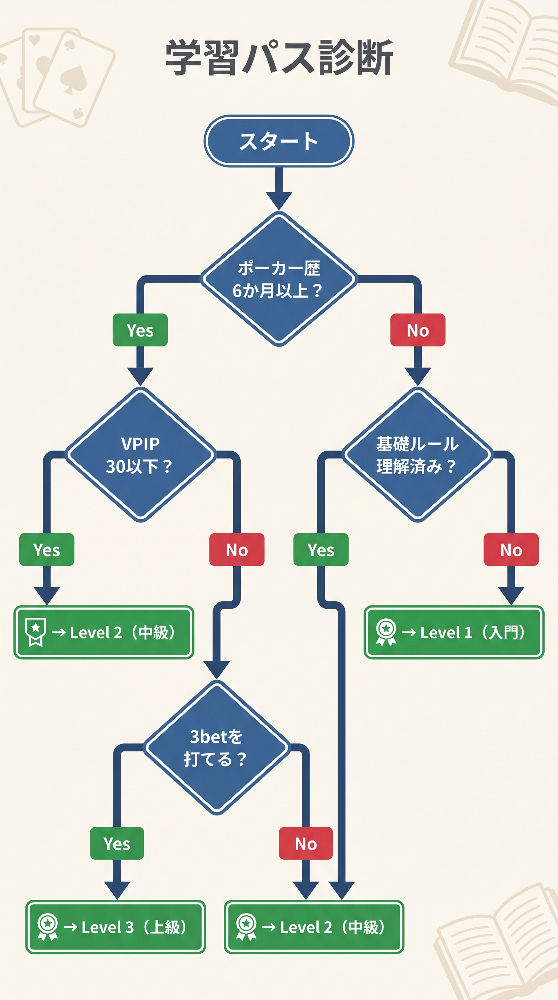
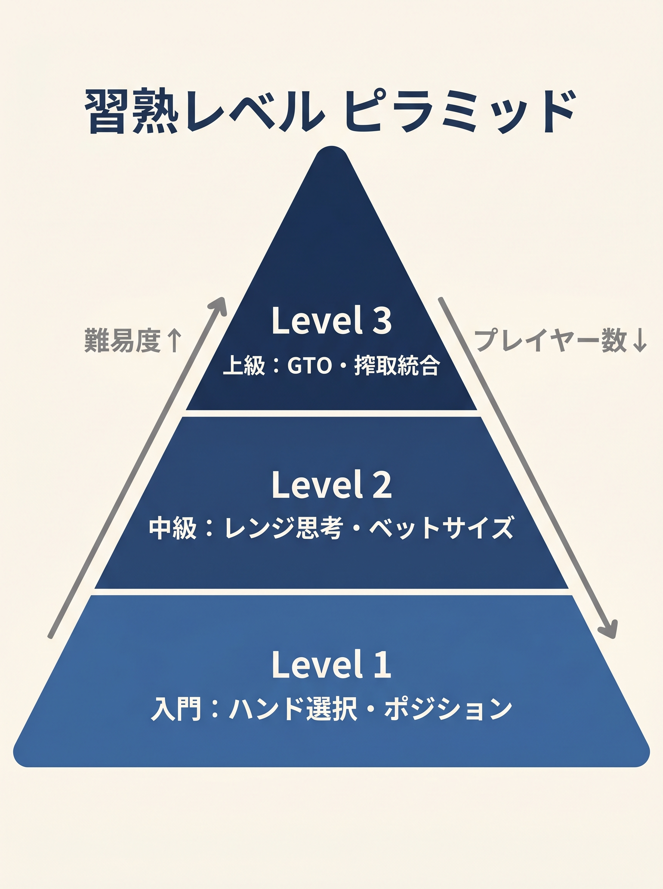

# はじめに　本書の歩き方

<!-- markdownlint-disable MD026 MD033 MD036 MD040 MD060 -->
<!-- textlint-disable preset-ja-technical-writing/no-exclamation-question-mark -->
<!-- textlint-disable preset-ja-technical-writing/no-mix-dearu-desumasu -->
<!-- textlint-disable jtf-style/1.1.3.箇条書き -->

> 本書は「暗算で回せるプリフロップ判断」を一冊にまとめました。169 ハンド × 6 ポジション の表を丸暗記する必要はありません。式を使えば、どのハンドでどのポジションからオープンすべきかを再現できます。

---

<figure><figcaption>Q1〜Q4のYes/No分岐でLevel 1/2/3への学習パスを診断するフローチャート</figcaption></figure>

<figure><figcaption>Level 1（入門）/ Level 2（中級）/ Level 3（上級）の3段階ピラミッド図</figcaption></figure>

## 本書の位置づけ

本書は**プリフロップに特化した入門書**です。テキサスホールデムでのプリフロップ判断（オープンレイズ、3bet、コール、フォールド）を、暗算可能な計算式に落とし込みました。

**前提知識**は必要ありません。ポーカーのルール（カードの配り方、ハンドランキング、ベットアクションの仕組み）を最低限理解していれば、第1章から読み始められます。

**フロップ以降（ポストフロップ）は扱いません。** フロップ・ターン・リバーの戦略は姉妹編『フロップは構造で勝つ』を参照してください。

---

## 学習パス診断

以下5問に答えてください。あなたに最適なエントリーポイントを診断します。

### Q1. ポーカーのハンドランキング（ロイヤルフラッシュ〜ハイカード）を覚えていますか？

- はい → Q2へ
- いいえ → **第2章から開始**してください（ハンドランキングと用語を整理します）

### Q2. ポジション名（UTG、MP、CO、BTN、SB、BB）を即答できますか？

- はい → Q3へ
- いいえ → **第2章・第0章（用語集）から開始**してください

### Q3. 本書の基本スコア式（`Score = H + L + ボーナス − ペナルティ`）を暗算できますか？

- はい → Q4へ
- いいえ → **Level 1 から開始**（第5章〜第7章）

### Q4. GTO ソルバー（GTO Wizard 等）で自分のプレイを週 1 回以上復習していますか？

- はい → **Level 2 のみ**で十分（第21章「固定を揺らす」）。基本式の確認も第19章（チートシート）で十分
- いいえ → **Level 1 + Level 2 の順**で学習してください（第1章から順に）

---

## Level 別の対象読者と到達目標

### Level 1：基本式（第1章〜第16章）

**対象**：ポーカーを始めたばかり、プリフロップで毎回悩む人。

**到達目標**：

- 基本スコア式を暗算できる
- 各ポジションのしきい値でオープン判断ができる
- ポットオッズと実現率を使ってコール判断ができる
- 約25NL〜50NL（低ステークス）で勝率がプラスになる

**想定期間**：平日30分 × 4週間（合計10時間程度）

### Level 2：中級（第21章）

**対象**：Level 1をマスター、「境界ハンドで判断に迷う」が残る人。

**到達目標**：

- R1〜R5を実戦中に適用できる
- 同じハンドで状況により行動を混合できる
- 3bet判断をスコア式で決定できる
- 約100NL〜200NLで搾取されにくいプレイができる

**想定期間**：Level 1の後、平日30分 × 2週間（合計7時間程度）

### Level 3：姉妹編（フロップ編）への発展

**対象**：Level 2をマスターした人。ポストフロップに進む段階。

**到達目標**：

- 姉妹編『フロップは構造で勝つ』のBoardScore / HandScore / CBet統合式を習得
- フロップ段階での判断を式で決定できる
- 約500NL以上で通用する基盤を持つ

**想定期間**：姉妹編のLevel 1〜3（基本式、中級R1〜R6、完全統合式）で合計20時間程度。

---

## 章の使い分けガイド

### 理論から入る読み方（推奨、順番通り）

第0章（用語）→ 第1章（動機づけ）→ 第2章（数値化）→ 第3〜4章（式の発想）→ 第5〜7章（基本式）→ 第8章（GTOとのズレ）→ 第9〜12章（対応判断）→ 第13〜16章（応用）→ 第17章（マルチウェイ）→ 第18〜20章（定着）→ 第21章。

### 実戦重視の読み方（短縮）

第5章（基本式）→ 第7章（しきい値）→ 第19章（チートシート）→ 第12章（3bet）→ 第17章（マルチウェイ）→ 第21章。

### スポット別の読み方（問題解決型）

- オープン判断で迷う → 第5〜7章、付録A・B
- ポットオッズが分からない → 第9章
- 3betをいつ打つか分からない → 第12章、付録F
- セットマイニングの判断 → 第11章
- マルチウェイで迷う → 第17章
- SB・BBの特殊対応 → 第15章
- 相手タイプ別の調整 → 第14章
- 式をすべてまとめて確認したい → 付録E・G・H・I

---

## 本書で扱わない前提

以下は本書の範囲外です。別書籍や別ツールを推奨します。

| トピック | 推奨リソース |
|---------|-----------|
| フロップ以降の判断 | 姉妹編『フロップは構造で勝つ』 |
| ターン・リバー戦略 | GTO Wizard + *Modern Poker Theory* (Acevedo) |
| MTT 精密 ICM 解析 | ICMIZER（icmizer.com） |
| Push/Fold チャート（15BB 以下） | Upswing Poker、PokerCoaching の Push/Fold 表 |
| ソルバーの操作方法 | GTO Wizard 公式ドキュメント |
| メンタル / ティルト管理 | Jared Tendler *The Mental Game of Poker* |

---

## 本書の構成（目次プレビュー）

### 第 I 部　基礎：判断を数値化する（第1〜4章）

プリフロップの重要性、カードとポジションの数値化、式で覚えるという発想、初心者の典型的ミスを扱います。

### 第 II 部　オープンレイズの簡易式（第5〜8章）

基本スコア式の全体像、ボーナス・ペナルティの意味、ポジション別しきい値、GTOとの乖離点を扱います。

### 第 III 部　対オープンのアクション（第9〜13章）

ポットオッズ、実現率、セットマイニング、3betスコア式、GTOとの乖離点を扱います。

### 第 IV 部　補正と応用（第14〜17章）

相手タイプとスタック深度、SB・BBの特殊性、4bet・オールイン、マルチウェイ・ICMを扱います。

### 第 V 部　実戦定着と次への橋渡し（第18〜21章）

20問ドリル、1枚チートシート、GTO学習ロードマップ、混合戦略（R1〜R5）を扱います。

### 付録

ポジション別レンジチャート、スコア早見表、境界ハンド集、用語集、数式まとめ、参考文献などを収録しています。
