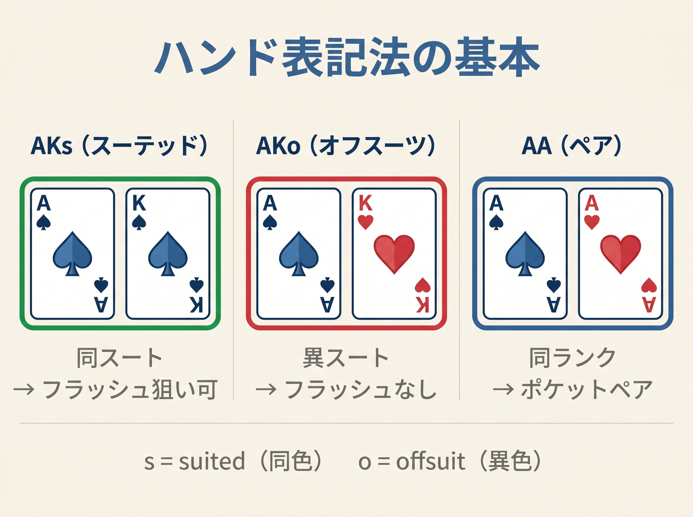
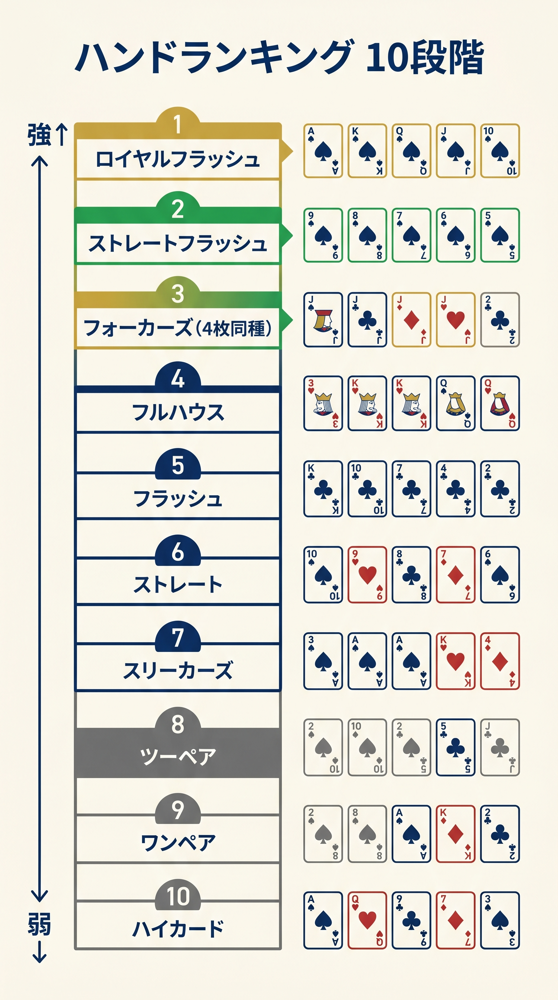

# 第0章　本書を読むための基礎用語

<!-- markdownlint-disable MD060 -->
<!-- textlint-disable preset-ja-technical-writing/no-exclamation-question-mark -->

> **本章の目標**: 本書を読み通すために**最低限知っておくべき用語**を、カテゴリー別に整理します。すでにポーカーの基本ルールを知っている方は飛ばして構いません。

本書では専門用語を初出時に定義しますが、読み進めるうちに「あの用語は何だっけ？」と迷う場面があるはずです。本章はその**参照用ハブ**として機能します。付録Dにさらに詳細な用語集も用意しているので、迷ったら本章か付録Dに戻ってください。

---

<figure><figcaption>AKs・AKo・AAの3種類のハンド表記法を視覚的に対比する図</figcaption></figure>

<figure><figcaption>ハンドランキング10段階を強い順に並べた縦型ラダー図</figcaption></figure>

## 0-1 テキサスホールデムの基本的な流れ

**テキサスホールデム**は、各プレイヤーに2枚のカード（**ホールカード**）が配られ、5枚の共通カード（**ボード**）を順に開きながら、最強の役を競うゲームです。賭け合いは4段階あります。

| 段階 | 名称 | 意味 | 共通カード枚数 |
|------|------|------|------------|
| 1 | **プリフロップ**（Preflop） | 手札2枚だけで判断する最初の賭け合い | 0 |
| 2 | **フロップ**（Flop） | 共通カード3枚が一度に開かれる | 3 |
| 3 | **ターン**（Turn） | 4枚目の共通カードが開かれる | 4 |
| 4 | **リバー**（River） | 5枚目（最後）の共通カードが開かれる | 5 |
| 5 | **ショーダウン**（Showdown） | 手札+共通で最強の5枚を作って比較 | 5 |

本書が扱うのは**プリフロップのみ**です。

### 1回のゲームの呼び方

配られてから勝敗が決するまでの1回分のゲームを **ハンド**（Hand）と呼びます。「1,000ハンドプレイした」は「1,000回ゲームをした」の意味です。**同じ「ハンド」という語で「手札」を指す場合もある**ので、文脈で読み分けてください。

---

## 0-2 ポジション：6人卓の席名

本書は **6-max**（6人卓）を前提にします。各席には名前と戦略上の意味があります。

| 略称 | 名称 | 戦略的意味 |
|-----|------|-----------|
| **SB** | Small Blind | 強制ベット（0.5 BB）を出す席 |
| **BB** | Big Blind | 強制ベット（1 BB）を出す席 |
| **UTG** | Under The Gun | プリフロップで最初に行動する席（最も早い） |
| **MP** | Middle Position | 2番目に行動する席（HJ とも呼ばれる） |
| **CO** | Cutoff | BTN の1つ前 |
| **BTN** | Button | 最後に行動できる**最強の席** |

### ポジションは毎ハンド移動する

毎ハンドごとにディーラーボタン（BTN）が時計回りに1つ移動し、全員が順番にすべてのポジションを経験します。

### IP と OOP

ポストフロップで**相手より後に行動できる**状態を **IP**（In Position）、**先に行動しなければならない**状態を **OOP**（Out Of Position）と呼びます。IPは情報優位があり、実現率が高い有利な立ち位置です（詳しくは第2章・第10章）。

---

## 0-3 ハンドの書き方（表記規則）

本書では、2枚の手札を次のように表記します。

| 表記 | 意味 |
|------|------|
| **AA** | エース2枚（ポケットエース、ペア） |
| **AKs** | エースとキング、**同じマーク**（suited） |
| **AKo** | エースとキング、**違うマーク**（offsuit） |
| **T** | 10（テン） |
| **J / Q / K / A** | ジャック / クイーン / キング / エース |
| **2〜9** | そのままの数字 |

例：A♠ K♠ なら「AKs」、A♠ K♥ なら「AKo」、7♦ 2♣ なら「72o」。

### ハンドの種類（169通り）

2枚のカードの組み合わせは、個別のマークの違いを無視して整理すると次の通りです。

- **ペア**：13通り（AA〜22）
- **スーテッド**（同マーク）：78通り
- **オフスーツ**（異マーク）：78通り
- **合計：169通り**

これがレンジ表でよく見る「13 × 13のマトリクス」の正体です。

### 具体的なコンボ数

実際のカードの組み合わせ（コンボ）は以下のようになります。これはブロッカー計算で重要です。

- **ペア**：C(4,2) = 6コンボ（例：AAは6種類）
- **スーテッド**：4コンボ（各マーク1通り）
- **オフスーツ**：12コンボ（4 × 3）
- **合計：1,326 コンボ**（169 × 平均7.8）

---

## 0-4 アクション：できること

各プレイヤーが自分の番で選べるアクションは6つです。

| アクション | 意味 |
|-----------|------|
| **フォールド**（Fold） | 手札を捨ててそのハンドを降りる |
| **チェック**（Check） | まだベットがないときに「見送る」（無料で次を待つ） |
| **コール**（Call） | 相手のベット額と同額を出して勝負を続ける |
| **ベット**（Bet） | 最初にチップを賭ける |
| **レイズ**（Raise） | 相手のベットに上乗せして再度賭ける |
| **オールイン**（All-in） | 手持ちの全チップを賭ける |

### プリフロップ特有のアクション名

| 名称 | 意味 |
|------|------|
| **リンプ**（Limp） | レイズせずに BB と同額だけ払って参加する（本書では原則禁止） |
| **オープンレイズ**（Open Raise / OR） | 最初にレイズして参加する行為 |
| **3ベット**（3-bet） | オープンレイズに対する再レイズ |
| **4ベット**（4-bet） | 3ベットに対する再レイズ |
| **5ベット**（5-bet） | 4ベットに対する再レイズ（通常オールイン） |
| **スチール**（Steal） | ブラインドを奪う目的のオープンレイズ（主に BTN から） |
| **スクイーズ**（Squeeze） | オープン＋コールの後に打つ3ベット |

---

## 0-5 お金の単位

本書はすべての金額を **BB（ビッグブラインド）単位**で表記します。

- **1 BB** = ビッグブラインド1個分の金額
- **2.5 BB オープン** = BBの2.5倍のレイズ（例：$1/$2のゲームなら $5）
- **100 BB スタック** = BBの100倍のチップ保有量

### スタック関連用語

| 用語 | 意味 |
|------|------|
| **スタック**（Stack） | 自分の持ちチップ総額 |
| **有効スタック**（Effective Stack） | 自分と相手のうち**少ない方**のスタック（勝負できる上限） |
| **ポット**（Pot） | テーブル中央に集まったチップの合計 |
| **ブラインド**（Blind） | 強制的に出すベット（SB・BB） |
| **アンテ**（Ante） | 全員が出す強制ベット（主にトーナメント） |

### bb/100 とは

プレイヤーの収支を表す標準指標です。

- **bb/100** = 100ハンドあたり何BB勝ったか（または負けたか）
- 例：「+5 bb/100」は「100ハンドで平均 +5 BBの利益」
- 勝ち組プレイヤーの目安は **+5〜+10 bb/100**

---

## 0-6 役の強さ（ハンドランキング）

5枚のカードで作る役。強い順に：。

| 順位 | 役 | 例 |
|-----|------|----|
| 1 | **ロイヤルフラッシュ** | A-K-Q-J-T 同マーク |
| 2 | **ストレートフラッシュ** | 連続5枚が同じマーク |
| 3 | **フォーカード**（クワッズ） | 同ランク4枚 |
| 4 | **フルハウス** | 3枚組＋ペア |
| 5 | **フラッシュ** | 同マーク5枚 |
| 6 | **ストレート** | 連続5枚（マーク問わず） |
| 7 | **スリーカード / セット** | 同ランク3枚 |
| 8 | **ツーペア** | 2つのペア |
| 9 | **ワンペア** | 1つのペア |
| 10 | **ハイカード** | 役なし、最高カードで勝負 |

### セット（Set）とトリップス（Trips）

どちらも「3カード」ですが違いがあります。

- **セット**：ポケットペアにボード上の3枚目のカードが落ちて3カードになったもの（隠れやすい）
- **トリップス**：ボードにペアが落ち、自分の1枚と合わせて3カードになったもの（見えやすい）

第11章のセットマイニングで扱うのは「セット」のほうです。

---

## 0-7 戦略の重要概念

本書を読み進めるうえで必ず触れる用語です。

| 用語 | 意味 |
|-----|------|
| **EV**（Expected Value、期待値） | 長期的な平均利益。EV > 0 なら長期で勝てる判断 |
| **レンジ**（Range） | 特定のプレイヤーが持ちうるハンドの集合 |
| **エクイティ**（Equity） | ポットに対する自分の取り分の期待値（≒ 勝率） |
| **ブロッカー**（Blocker） | 相手の強いハンドの組み合わせを減らすカード |
| **ポットオッズ**（Pot Odds） | コール額に対するポットの比率から出す必要勝率 |
| **インプライドオッズ** | 将来のストリートで追加で取れる額を含む期待値 |
| **GTO** | Game Theoretic Optimal、搾取されない理論最適戦略 |
| **実現率**（EQR） | 生エクイティのうち実際にEVとして回収できる割合 |
| **後手下限** | 英語: Minimum Defense Frequency（最低防衛頻度）。相手のベットに対してフォールドしすぎないための限界値。文脈により「後手下限ライン」（守る対象）／「後手下限確率」（数値）と使い分ける |

### 代表的な統計指標

トラッキングソフトで自動計測されるデータです。

| 指標 | 意味 | 勝ち組目安（6-max） |
|------|------|-------------------|
| **VPIP** | 自発的にポットに参加した割合 | 約 21% |
| **PFR** | プリフロップでレイズした割合 | 約 18% |
| **RFI** | 最初にレイズした頻度（ポジション別） | UTG 18%〜BTN 45% |

VPIP ＞ PFRです（コール参加もVPIPに含まれるため）。両者の差が大きい（例：VPIP 35、PFR 10）プレイヤーは「コール多めの弱いプレイヤー」と読めます。

---

## 0-8 本書に頻出する略号まとめ

迷ったら本章に戻ってください。

| 略号 | 意味 | 初出章 |
|-----|------|------|
| BB / SB | ビッグ / スモールブラインド | 第0章 |
| UTG / MP / CO / BTN | ポジション名 | 第0章・第2章 |
| IP / OOP | ポジションあり / ポジションなし | 第0章・第2章 |
| EV | 期待値 | 第3章 |
| EQR | 実現率 | 第10章 |
| GTO | ゲーム理論最適戦略 | 第3章 |
| 後手下限 | 最低防衛頻度（旧 MDF） | 第9章 |
| RFI | 最初のレイズ頻度 | 第2章 |
| VPIP / PFR | プリフロップ統計 | 第1章 |
| bb / bb/100 | 金額単位 / 100手あたり収支 | 第0章・第1章 |
| SPR | スタック・ポット比率 | 第3章 |
| ICM | 独立チップモデル（トーナメント） | 第17章 |

---

## 章のまとめ

- 本書は**プリフロップのみ**を扱う（フロップ以降はほか書・姉妹編に譲る）
- 前提は **6-max（6人卓）、100 BB スタック、キャッシュゲーム**
- ハンド表記は **AKs**（スーテッド）・**AKo**（オフスーツ）・**AA**（ペア）
- アクションは**フォールド・チェック・コール・ベット・レイズ・オールイン**の6つ
- 金額は **BB 単位**、収支は **bb/100**
- IP（後から動ける）が有利、OOP（先に動く）が不利
- 専門用語に迷ったら本章または付録Dを参照

本章を踏まえて、第1章からいよいよ本編に入ります。

---
