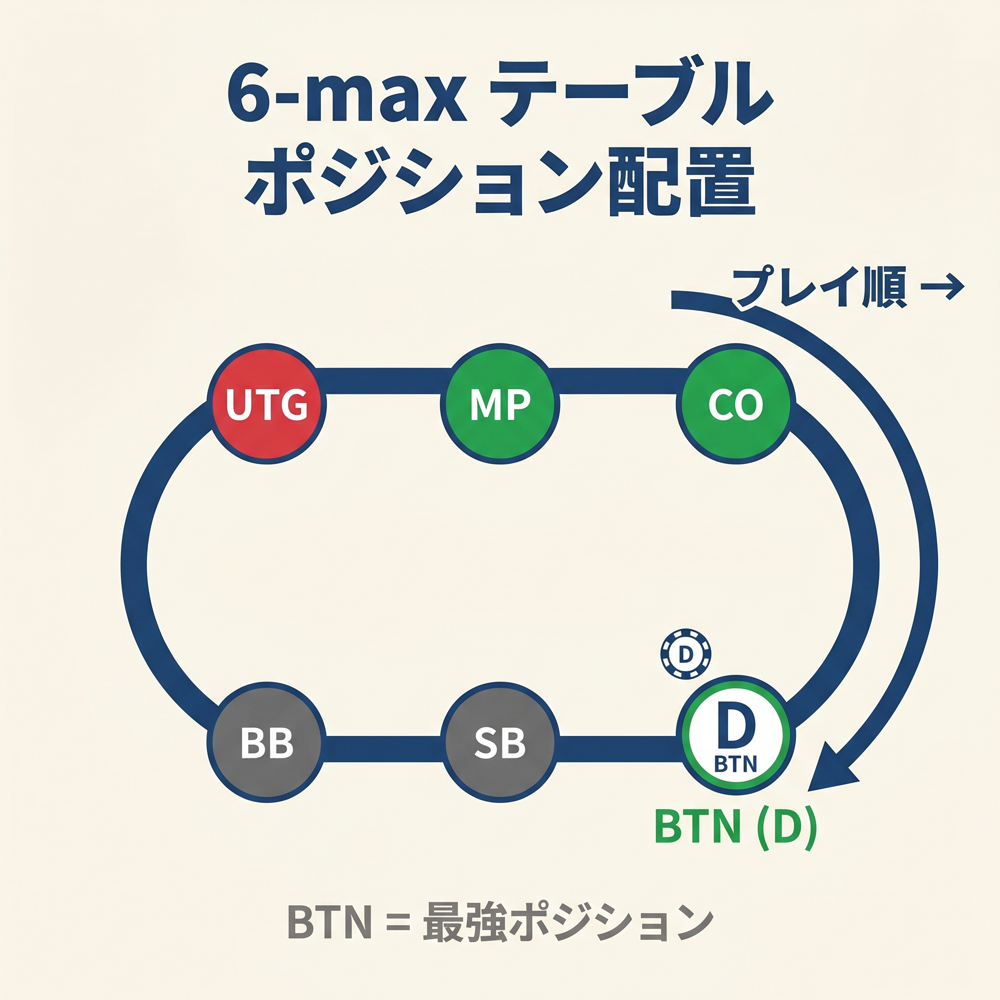
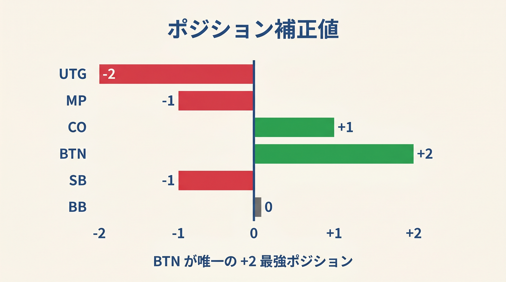
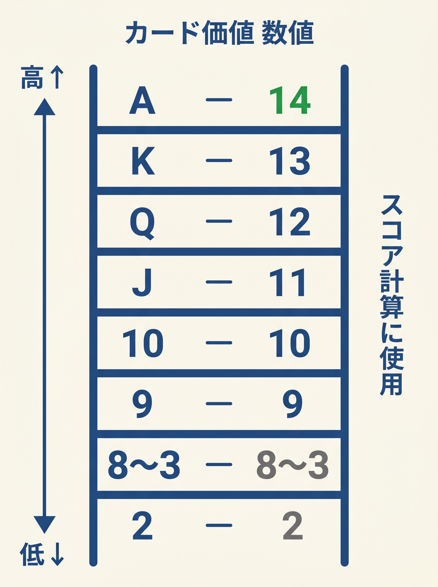

# 第2章　カードとポジションを数値化する

<!-- markdownlint-disable MD060 -->
<!-- textlint-disable preset-ja-technical-writing/no-mix-dearu-desumasu -->

> **本章の目標**: 計算式で使う2つの基礎単位、カード数値とポジション補正を身につけます。この章を読み終えるころには、手札とポジションを見ただけで、頭のなかに必要な数字が浮かぶようになります。

計算式を使うには「入力」が必要です。本書の計算式が求める入力は2つだけ、**カードの数値**と**ポジションの補正値**です。本章ではこの2つを定義します。一度覚えてしまえば、以降すべての章で同じルールが使えます。

---

<figure><figcaption>6-maxテーブルの俯瞰図にUTG/MP/CO/BTN/SB/BBの各ポジションをラベルで示す図</figcaption></figure>

<figure><figcaption>UTG -2 〜 BTN +2 の各ポジション補正値を横棒グラフで視覚化</figcaption></figure>

<figure><figcaption>A=14からQ=2までのカードランク数値一覧ラダー（スコア計算の基礎）</figcaption></figure>

## 2-1 カードを数値化する

### A=14、K=13、…、2=2

本書では、スターティングハンドの2枚を以下の通り数値化します。

| カード | 数値 |
|-------|-----|
| A | 14 |
| K | 13 |
| Q | 12 |
| J | 11 |
| T（10） | 10 |
| 9 | 9 |
| 8 | 8 |
| … | … |
| 2 | 2 |

Aが14である理由は、ポーカーにおけるAの特殊性にあります。Aはストレートの最高値（A-K-Q-J-T）にも最低値（A-2-3-4-5）にも使えます。この「最大値としての性質」から、数値化するならトップに置くのが自然です。プログラムでポーカーハンドを評価する標準的なアルゴリズムでも、このA=14スケールが採用されています。

### Chen Formulaとの違い

ポーカー界には古典的な簡易式として **Chen Formula**（ビル・チェン、2000年ごろ考案）があります。こちらは独自のスケールを使います。

| カード | Chen値 | 本書 |
|-------|-------|------|
| A | 10 | 14 |
| K | 8 | 13 |
| Q | 7 | 12 |
| J | 6 | 11 |
| T以下 | 半分（Tなら5） | そのまま |

Chen Formulaは「ハンド間の実用的な強さの差」を非線形に表現しようとした試みです。AとKの差を2点、KとQの差を1点などで表します。

本書は別の方針を採ります。**カードランクはそのまま数値化し、ペアやスーテッドといった役の価値はボーナスとペナルティで調整する**という方針です。このほうが計算が直感的で、暗算しやすくなります。

### 覚えるコツ

A、K、Q、Jは「14、13、12、11」と連続するのでセットで覚えれば十分です。T以下は「そのままの数字」なので覚えることはありません。

重要なのは、**手札を見た瞬間に数値に変換する癖**です。A♣J♠ が配られたら、反射的に「14と11」と頭のなかでつぶやきましょう。

---

## 2-2 6-maxのポジションを覚える

### 6つのポジション

本書は6人卓（6-max）を前提とします。オンラインキャッシュゲームで最も一般的な形式です。

6-maxには6つのポジションがあります。

| 略称 | フルネーム | 位置 |
|-----|-----------|------|
| UTG | Under The Gun | 最初に行動する席 |
| MP | Middle Position（HJ） | 2番目に行動 |
| CO | Cutoff | BTN直前 |
| BTN | Button | ディーラーボタン（最後に行動） |
| SB | Small Blind | スモールブラインド |
| BB | Big Blind | ビッグブラインド |

※ 6-maxのMPは「HJ（Hijack、ハイジャック）」と呼ばれることもあります。本書ではMPで統一します。

### 名前の由来を知ると覚えやすい

それぞれの名前には意味があります。

- **UTG（アンダー・ザ・ガン）**：軍事スラングで「砲口の下」を意味します。最初に行動する席は、ほかプレイヤーの動きを見ずに決断する必要があり、常に圧力にさらされている状態を表現しています
- **MP / HJ**：HJは「ハイジャック」の略。COとBTNより先に動いて、盗む（ハイジャックする）席の意味
- **CO（カットオフ）**：昔、カードを「カット」する役割を担った席の名残
- **BTN（ボタン）**：ディーラーを示すトークン（ボタン）がこの席に置かれることから
- **SB / BB**：強制ベット（ブラインド）を出す席

### ポジションは毎ハンド回る

各ハンドが終わるごとに、ディーラーボタンが時計回りに1つ移動します。全員が順番にすべてのポジションを経験する仕組みです。

つまり、「どのポジションでも勝てる戦略」ではなく、**「それぞれのポジションで最適に振る舞う戦略」**が必要になります。同じカードが配られても、ポジションによって最適解は違うのです。

---

## 2-3 ポジションには定量的な価値差がある

### BTN と BB の差は圧倒的

「ポジションは力なり（Position is Power）」という言葉があります。これは標語ではなく、数字で裏付けられた事実です。

GTO WizardのBTN vs BB分析によれば、この2人が1対1で戦った場合のエクイティは次の通りです。

| ポジション | 平均エクイティ | 平均獲得額 |
|-----------|-------------|-----------|
| BTN | 57.4% | 4.04 BB |
| BB | 42.6% | 2.06 BB |

同じカードが配られる確率は等しいはずです。それでも、**ポジションの違いだけで獲得額に約2倍の差**が生まれます。

### 勝ち組プレイヤーのbb/100

実際のプレイヤーデータから見た、勝ち組の各ポジションでのbb/100（100手あたりのビッグブラインド収支）は次の通りです。

| ポジション | bb/100（勝ち組の目安） |
|-----------|---------------------|
| BTN | +30〜+40 |
| CO | +24〜+28 |
| MP | +17〜+21 |
| UTG | +12〜+17 |
| SB | −10〜−20 |
| BB | −30〜−40 |

SB / BBがマイナスなのは、強制ベットがある席だからです。勝ち組でもブラインドではマイナス収支が普通で、「いかに失点を減らすか」が課題になります。

### 実現率（EQR）という別次元の不利

ポジションの価値は、獲得額だけでは語れません。**実現率**（Equity Realization, EQR）という別の角度があります。

実現率とは、「自分の生のエクイティを、どれだけポットの取り分として実現できるか」の割合です。IP側（後から行動できる側）は、しばしば生エクイティ以上を実現します。

GTO Wizardが示す具体例では、9♠-3♠-2♦ のフロップにおいてBTN vs BBは次の通りです。

- **BTN（IP）**：実現率 **118.1%**（エクイティを上回る取り分）
- **BB（OOP）**：実現率 **79.1%**（エクイティを下回る取り分）

同じハンドを持っていても、後から動ける側は「自分の持ち分以上」を勝ち取り、先に動かなければならない側は「持ち分未満」しか手にできません。これは後続ストリートの意思決定の自由度から生まれる差です。

---

## 2-4 ポジション補正値を覚える

### 本書で使う補正値

本書では、ポジションの価値差を「補正値」として数値化します。

| ポジション | 補正値 |
|-----------|-------|
| UTG | −2 |
| MP | −1 |
| CO | 0 |
| BTN | +2 |
| SB | −1 |
| BB | （対オープン時のみ使用） |

この補正値は、ポジションの相対的な強さを表す**概念的な指標**です。実際のプリフロップ判断では、この補正値から導かれる**しきい値**を直接使います（第5章・第7章で詳述）。しきい値は補正値を2倍程度に拡大して調整されており、暗算時はしきい値の数字だけを覚えれば十分です。

### 補正値の根拠

この数値は、GTO推奨RFI（Raise First In、最初にレイズする頻度）の差を単純化したものです。

GTO推奨RFI（6-max、100bb）の参考値は次の通りです。

- UTG約17.6%
- MP約21.4%
- CO約27.8%
- BTN約43.5%

COを基準（0）にしたとき、UTGは約10ポイント低く、BTNは約16ポイント高くなっています。これを「整数の補正値」に圧縮したのが本書の −2 〜 +2です。

### SBが −1 である理由

SBはRFIだけ見ると約39〜47%で、CO以上の広さに感じられます。しかし、これはポストフロップ不利を織り込んで「3ベットかフォールド」の戦略を採る結果であり、実際のbb/100はCOよりずっと低くなります。

本書ではSBを「UTGより少しマシな程度」と評価して −1としています。詳しくは第15章で扱います。

---

## 2-5 SBという「特殊ポジション」の予告

SBは本書で最も扱いにくいポジションです。理由は構造的です。

- プリフロップではBBより先に行動する（早めの席）
- ポストフロップでは**全員に対して常に最初に行動する**（最もOOP）

つまりSBは、プリフロップでは2番目に早い席ですが、フロップ以降は全ストリートで最悪の位置を引き受けます。この矛盾がSBの戦略を独特にします。

SBのエクイティ実現率は35〜60%と、ポジションの中で最も低い水準です。極端なケースでは45%の生エクイティを持っていても、実際には35%程度しか手にできないこともあります。

このため、現代GTOはSBで「3ベットかフォールド」を基本戦略として採用し、コール（コンプリート含む）はごく限定的です。SBの扱いは第15章で本格的に掘り下げます。まずは「SBは特別枠だ」と覚えておいてください。

---

## 【GTOとのズレ】ポジションはRFI頻度で語るべきか

本章では補正値を「−2〜+2」という整数で表現しました。これはシンプルさを重視した結果です。GTO的に厳密であろうとするなら、別の指標で語る必要があります。

### GTOが実際に使う指標

GTOソルバーは、各ポジションのRFIを「頻度の分布」として出力します。

- UTG：17.6%のハンドをオープン、残りはフォールド
- MP：21.4%、CO：27.8%、BTN：43.5%
- さらに境界のハンドに対しては、GTOは「ミックス戦略」（例：60%オープン・40%フォールド）を採ります

本書の補正値は、この頻度差を整数化した近似です。厳密性を捨てて、実戦で暗算できる形に落とし込んでいます。

### 誤差はどこに出るか

補正値が整数であるため、以下の誤差が生まれます。

- **UTGの −2 は若干きつめ**：GTOのUTG RFIは17.6%なので、本書の式で計算すると少しタイトに絞りすぎる可能性があります
- **BTNの +2 はほぼ妥当**：BTNはほぼ4割超のハンドを開くので、+2で整合しています
- **SBの −1 は実現率を織り込んだ主観的判断**：純粋なRFI頻度からは導けない値です

厳密なGTO頻度を学びたい読者は、最終章（第20章）で紹介するGTO Wizardなどのソルバーツールで直接確認してください。本書の目的は、暗算で回せる近似の提供です。

---

## 章のまとめ

- カードはA=14、K=13、…、2=2で数値化する
- Chen Formulaなどとは別のスケールを採用し、加減計算しやすくする
- 6-maxのポジションはUTG、MP、CO、BTN、SB、BBの6つ
- BTN vs BBのエクイティ差は57.4% vs 42.6% で、ポジションの価値は圧倒的
- IP側の実現率は118%超、OOP側は79%程度（BTN vs BBの一例）
- 本書の補正値はUTG −2、MP −1、CO 0、BTN +2、SB −1
- 補正値はGTOのRFI頻度差を整数で近似したもの
- SBは「プリフロップは早く、ポストフロップは最も遅い」特殊ポジション

---

## ミニクイズ

### 問1

次のハンドを本書の数値化ルールに従って、2つの数字に直してください。

1. A♣ J♠
2. T♦ 8♦
3. K♥ 7♣

---

### 問2

本書の補正値について、正しい記述はどれでしょうか。

1. UTGからBTNへの補正値の差は4点です
2. SBはRFIが高いので +2です
3. COを基準（0）にすると、MPは +1です

---

### 問3

実現率（EQR）について、正しい記述はどれでしょうか。

1. IPとOOPで実現率は同じ
2. IP側は自分のエクイティ以上を実現できることがある
3. OOP側は必ずエクイティの半分しか実現できない

---

### 解答

- **問1**：（1）14と11、（2）10と8、（3）13と7
- **問2**：1（−2と +2の差は4点。SBはポストフロップOOPのため −1）
- **問3**：2（BTN vs BBの例でBTNは118%を実現、BBは79%にとどまる）

---

## 出典

- GTO Wizard『Equity Realization』（2022〜）
- RangeConverter『6 max 100bb Poker Charts』（2024）
- Upswing Poker『The Ultimate Guide to 6-Handed Poker』（2023）
- 888poker『Chen Formula』（2022）
- PokerStrategy『Common Spots: BTN vs BB』
- PokerNews『Hijack Definition』
- Upswing Poker『Small Blind Strategy』
