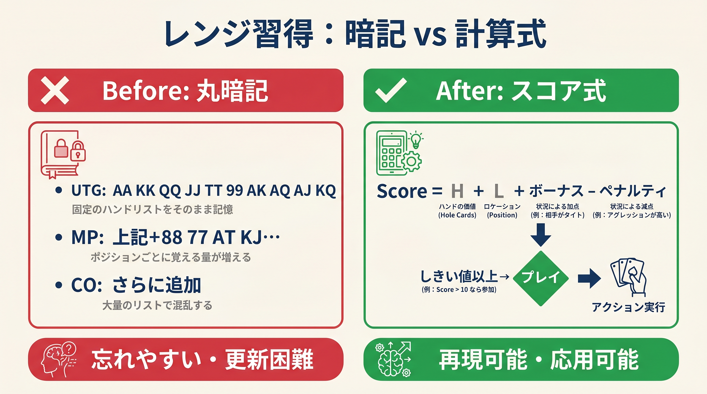

# 第3章　式で覚えるという発想

<!-- markdownlint-disable MD060 -->
<!-- textlint-disable preset-ja-technical-writing/no-exclamation-question-mark -->
<!-- textlint-disable preset-ja-technical-writing/no-mix-dearu-desumasu -->

> **本章の目標**: なぜ暗記ではなく計算式で判断すべきなのか、その理論的な根拠を確認します。EVの定義、認知科学、GTOとの関係、そして先行事例としてのChen Formulaを通じて、本書のアプローチを正当化します。

本書のアプローチは「計算式で判断を再現する」というものです。なぜこれが有効なのでしょうか。本章では4つの角度から答えます。第一に**EVの基本式**、第二に**人間の記憶容量の限界**、第三に**直感の正体**、そして第四に**3変数による近似の有効性**です。

---

<figure><figcaption>レンジの丸暗記と計算式アプローチのBefore/After対比図</figcaption></figure>

## 3-1 EVはすべてのポーカー判断の基礎

### 期待値の式

ポーカーのあらゆる判断は、**期待値**（Expected Value, EV）を最大化することに帰着します。EVの定義式はシンプルです。

```text
EV = 勝率 × 獲得額 − 敗率 × 損失額
```

たとえば、ポット100ドルに対して50ドルのブラフを打つとします。相手が40%でフォールドすると仮定すると、次のように計算できます。

```text
EV = 0.40 × 100 − 0.60 × 50
   = 40 − 30 = +10ドル
```

このブラフを長期的に続ければ、1回あたり平均10ドルの利益が出るということです。

### Sklanskyの「ポーカーの根本定理」

デビッド・スクランスキー（David Sklansky）は、1978年の著書『Theory of Poker』でこの考え方を体系化しました。これは**「ポーカーの根本定理」**と呼ばれます。

> 「もしあなたが相手のカードを見た場合と同じ行動を取るなら、相手は損をする。もし違う行動を取るなら、あなたが損をする」

ここから導かれる実用的な結論は明確です。**すべての判断は最大EVを目指せばよい**、ということです。

本書の計算式は、このEV最大化という目標を、暗算できる形に翻訳したものです。

---

## 3-2 暗記できないから計算する

### ワーキングメモリの限界

人間の短期記憶には厳密な限界があります。認知心理学者ジョージ・ミラーは1956年、**人間が一度に保持できる情報は7±2個**であると発表しました。その後、ネルソン・コーワンが2001年により厳密に**4±1個**と再定義しています。

実用上、同時に扱える情報の塊（チャンク）は3〜5個が限界、というのが現代の定説です。

### 1,014マスは構造的に覚えきれない

ここで本書が繰り返し指摘している問題に戻ります。

- 169ハンド × 6ポジション = **1,014マス**
- さらに「対オープン」「3ベットを受けたとき」など状況が加わる

3〜5チャンクしか保持できない脳で、1,000を超えるマス目の暗記は不可能です。これは努力や意志の問題ではなく、**脳の構造的な限界**なのです。

### エキスパートは「チャンク」で考える

ではトッププレイヤーはどうしているのでしょうか。答えは**チャンキング**にあります。

認知科学者Chase & Simonによる1973年のチェス研究では、熟練プレイヤーは盤面を「個々の駒」ではなく「意味のあるパターン」として認識していました。ランダムに配置された盤面では、熟練者と初心者の記憶力に差はありませんでした。つまり、パターン化された情報だけが彼らの記憶に残るのです。

ポーカーでも同じです。エキスパートは「AJoをUTGから」という個別の状況を覚えているのではなく、「UTGのオープンレンジは約10%」というチャンクで考えます。**計算式は、このチャンキングを体系的に実現する手段**です。

---

## 3-3 先行事例：計算式は新しい発想ではない

### Chen Formula

本書と似たアプローチは過去にも提案されてきました。最も有名なのが、数学者ビル・チェン（Bill Chen）が考案した**Chen Formula**です。2000年ごろ、ルー・クリーガーの著書『Hold'em Excellence』に掲載されました。

採点ルールの概要は次の通りです（詳細は第2章で触れました）。

- 最高位カード：A=10、K=8、Q=7、J=6、以下は半分
- ペア：スコア × 2
- スーテッド：+2点
- ギャップ：ペナルティあり

Chen Formulaは現代の実戦では粗すぎると評価されていますが、**「手の強さを数値化して比較できる」**という発想の原型として重要です。本書のスコア式は、この流れをより現代的に再構築したものと言えます。

### Sklansky Hand Groups

デビッド・スクランスキーとメイソン・マルムースは1988年の著書『Hold'em Poker for Advanced Players』で、169種類のスターティングハンドを**8つのグループ**に分類しました。

- **Group 1**（最強）：AA、KK、QQ、JJ、AKs
- **Group 2**：TT、AQs、AJs、KQs、AKo
- ……
- **Group 8**：プレイ可能な最弱域

ポジションに応じて「Group 5まで」「Group 3まで」と判断する仕組みです。169ハンドを8グループに圧縮することで、暗記負荷を劇的に下げました。

これも**チャンキングによる判断の体系化**であり、本書のアプローチと思想は共通です。ただしグループ分けは現代のGTO基準では粗く、本書は「ポジション × スコア」という別の切り口で再設計しています。

---

## 3-4 計算は直感に内面化される

### カーネマンの「システム1とシステム2」

ノーベル経済学賞受賞者のダニエル・カーネマン（Daniel Kahneman）は、著書『Thinking, Fast and Slow』で、人間の思考を2つのシステムに分けて論じました。

|  | システム1 | システム2 |
|--|-----------|-----------|
| 速度 | 速い・自動的 | 遅い・意識的 |
| 特性 | 直感・パターン認識 | 論理・計算 |
| 負荷 | 低い | 高い |

重要な洞察はここです。**エキスパートの「直感」は、実はシステム2による反復学習がシステム1に内面化されたもの**なのです。生まれつきの才能ではなく、計算の蓄積が形を変えたものです。

### Negreanuの証言

ポーカーの世界チャンピオン、ダニエル・ネグラヌ（Daniel Negreanu）はMasterClassで次のように語っています。

> 「計算式があれば、何度もやるうちに呼吸するように自然になる」

彼自身のプロセスは次の通りです。

1. 相手のレンジを意識的に（システム2で）分析する
2. それを長年繰り返すうちに、無意識の直感（システム1）に変わる
3. 最終的には、テーブル上で計算していると感じないほど自然になる

### Brunsonの視点

「ポーカーの父」と呼ばれるドイル・ブランソン（Doyle Brunson）も同じことを示唆しています。

> 「ポーカーで唯一報酬が得られるのは、質の高い決断をすることだ」

彼の言う「直感」は、過去の状況に対する無意識の分析である、とも述べています。つまり、計算の積み重ねによって作られた直感です。

本書の立ち位置は明確です。**今は計算式を意識的に使ってください**。やがて計算していると感じないほど自然になります。そのときには、本書は不要になっているはずです。

---

## 3-5 プリフロップは3変数で近似できる

### レンジ × ポジション × スタック

プリフロップの期待値は、大きく3つの変数で近似できます。

1. **ハンドのレンジ強度**：スターティングハンドの本質的な強さ
2. **ポジション**：情報優位と実現率の差
3. **スタック深度**：戦略の複雑さを決める有効スタックの量

本書の計算式は、この3変数を1つの数式に統合しています。

- レンジ強度 → **カードの数値 + ボーナス − ペナルティ**（Score）
- ポジション → **しきい値の違い**（UTG 24 / MP 22 / CO 21 / BTN 18 / SB 22）
- スタック深度 → **しきい値の調整（第14章）**

ポジションは Score を補正するのではなく、**しきい値だけが違います**。同じハンドの Score は全ポジションで同じ値です。

### なぜ100BBを標準とするのか

本書は基本的に**100BB（ビッグブラインド100個分）**のスタックを前提に進めます。理由は4つあります。

1. **業界標準**：キャッシュゲームの標準バイインは100BBです
2. **戦略複雑さのバランス点**：浅すぎず深すぎず、プリフロップもポストフロップも両方重要になる深度です
3. **ほかの深度への応用が容易**：100BBでの判断を基準にしておけば、補正で対応できます
4. **最頻出シナリオ**：オンライン・ライブ問わず、多くのハンドがこの深度で進みます

ショートスタック（40BB以下）とディープスタック（150BB以上）は別ルールが必要です。それは第14章で扱います。

---

## 【GTOとのズレ】決定論的簡易式が「決めつけてしまう」もの

本章の核心は、「EV最大化を計算式で近似する」という方針です。ここで1つ、GTOとの大きなズレがあります。**本書の式は決定論である**という点です。

### GTOのミックス戦略

ゲーム理論最適戦略（GTO）は、境界ハンドに対して**頻度的なアクション**を採用します。

たとえば、COからのあるハンドについて、GTOソルバーは「70%レイズ、30%フォールド」と出力することがあります。相手がこの頻度を読めないため、搾取されない戦略になるのです。

本書の式では、境界を跨いだかどうかで「100%レイズ」か「100%フォールド」のどちらかに決定します。この差こそが、GTOと簡易式の根本的なズレです。

### なぜ決定論でも勝てるのか

GTO Wizard自身が公式ブログで次のように述べています。

> 「GTO戦略を簡略化する方法として、ミックス頻度を省いた『覚えやすいシンプルGTO』を推奨する。EVの低下はあるが、実装が格段にしやすくなる」

決定論的簡略化でも勝てる理由は次の3つです。

1. **ミックスが必要なのは境界ハンドのみ**：コアなバリューハンドと明らかなフォールドハンドは決定論で問題ありません
2. **相手もGTOを実装していない**：初心者〜中級者帯では、相手の非GTO行動による損失のほうが、あなたの簡略化による損失より圧倒的に大きくなります
3. **大きなミスを避けるほうが優先**：境界ハンドでの微小な差より、「UTGから72oを開ける」といった破滅的ミスを避けることが本質です

**本書の式は「プロ用の完璧解」ではなく、「初心者〜中級者の実用解」**です。境界で数bb/100を失う代わりに、暗算で回せる形を手に入れる。このトレードオフが、本書のアプローチの核です。

---

## 3-6 本書の戦略：「計算 + 境界暗記」のハイブリッド

### 二層構造の戦略

本書は単純に「式だけで勝つ」とは主張しません。実際の戦略は**二層構造**です。

1. **第一層（全体の 9 割を担う）：計算式**
   プレミアムハンド、明確な弱ハンド、ほとんどの中堅ハンドは、本書のスコア式でGTOとほぼ同じ結論に到達します。169 × 6 = 1,014マスの大部分はこの層で処理します。

2. **第二層（残り 1 割、特に効く 12 ハンド）：境界暗記**
   しきい値の近辺（±1点）にあるハンドは、式では拾えない要素（ブロッカー効果、Wheel可能性、ドミネーションリスク）が効きます。ここでは**GTO の最善手を個別に暗記**します。

### なぜこの分担が合理的か

1,014マスの全体を丸暗記するのは認知科学的に不可能です。しかし、**境界の 12 ハンドだけなら現実的に覚えられます**。暗算で9割を処理し、境界の暗記で残りの1割を穴埋めする。これが最小の記憶負荷で最大のEVを取る戦略です。

### 境界ハンドの具体リスト

12の境界ハンドは、本書の**付録 F**にまとめてあります。それぞれについて：。

- 本書スコアの計算結果
- 本書のしきい値との比較
- GTOの推奨アクション
- **両者が外れる理由**（ブロッカー、ドミネーション、実現率など）
- 実戦での覚え方

をセットで提示しています。本書を読み終えたら、付録Fの12ハンドだけは意識的に暗記してください。この層を足すだけで、本書の実用的強度が大きく上がります。

---

## 章のまとめ

- ポーカーのあらゆる判断はEV（期待値）の最大化に帰着します
- Sklanskyは1978年『Theory of Poker』で「最大EVが正しい決断」と定理化しました
- 人間のワーキングメモリは3〜5チャンクが限界で、1,014マスの暗記は構造的に不可能です
- エキスパートは個別情報ではなく「チャンク」で判断しています
- Chen FormulaやSklansky Hand Groupsは、本書と同じ方向性を持った先行事例です
- カーネマンのシステム1/2理論では、直感は反復された計算の内面化です
- Negreanu、Brunsonも「計算が直感になる」プロセスを証言しています
- プリフロップはレンジ × ポジション × スタックの3変数で近似できます
- 本書は100BBを標準とし、ほかの深度は補正で扱います
- 本書の式は決定論（100% or 0%）ですが、初心者〜中級者帯では実用上問題ありません
- 本書の戦略は「式で9割＋境界12ハンドの暗記で1割」のハイブリッドです
- 境界ハンドの詳細は付録Fにまとめて参照できます

---

## ミニクイズ

### 問1

EV（期待値）の基本式として正しいのはどれでしょうか。

1. 獲得額 − 損失額
2. 勝率 + 敗率
3. 勝率 × 獲得額 − 敗率 × 損失額

---

### 問2

人間のワーキングメモリについて、正しい記述はどれでしょうか。

1. 訓練すれば100個程度のチャンクを同時に保持できます
2. 理論的な上限はおよそ3〜7チャンク程度です
3. ポーカーのプロは1,000マスのレンジ表を完全暗記しています

---

### 問3

本書の計算式が「決定論的」であることの意味として、最も適切なのはどれでしょうか。

1. GTOと完全に同じ結果を出す
2. 境界ハンドでも必ず「100%レイズ」か「100%フォールド」に決める
3. スタック深度を無視している

---

### 解答

- **問1**：3
- **問2**：2（Millerの7±2、Cowanの4±1）
- **問3**：2（GTOのミックス戦略を簡略化しているのが本書の近似）

---

## 出典

- David Sklansky『The Theory of Poker』（1978）
- Miller, G. A.『The Magical Number Seven, Plus or Minus Two』（1956）
- Cowan, N.『The Magical Number 4 in Short-Term Memory』（2001）
- Chase, W. G. & Simon, H. A.『Perception in Chess』（1973）
- Daniel Kahneman『Thinking, Fast and Slow』（2011）
- MasterClass『How to Think at the Poker Table | Daniel Negreanu』
- Pokerology『Doyle Brunson and the Strategies That Shaped Modern Poker』
- GTO Wizard『What is GTO in Poker?』（2023〜）
- The Poker Bank『The Chen Formula』／『Sklansky and Malmuth Starting Hand Groups』
