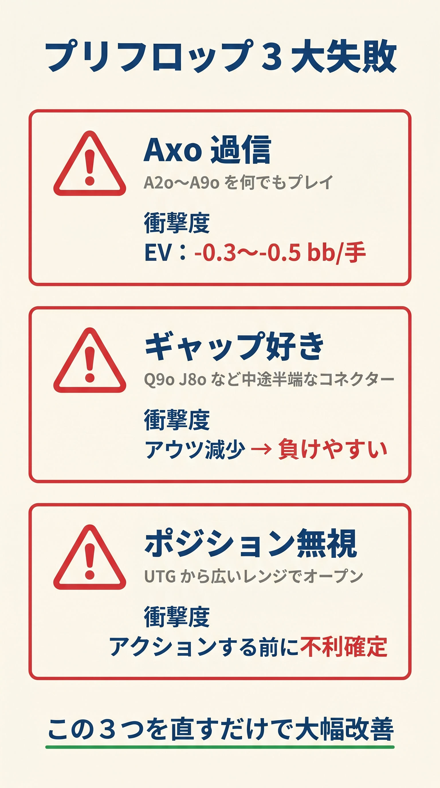
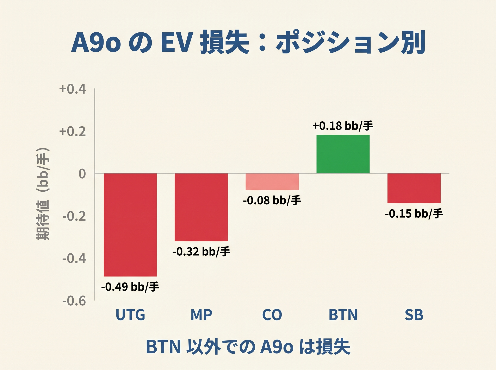

# 第4章　初心者がやりがちなプリフロップの失敗

<!-- markdownlint-disable MD060 -->
<!-- textlint-disable preset-ja-technical-writing/no-mix-dearu-desumasu -->

> **本章の目標**: プリフロップでの典型的な失敗パターンを6つ取り上げ、なぜそれが損なのかをGTOデータと照らして示します。読後に「自分もやっていた」と気づければ、本書の式を読み進める動機になります。

プリフロップの失敗には、**誰もが通る定番パターン**があります。本章ではその中から特に破壊力の強い6つを取り上げます。各項目では「どんな状況で起きるか」「なぜ間違いか」「正しい判断」をセットで示します。

---

<figure><figcaption>Axo過信・ギャップ好き・ポジション無視の3大プリフロップ失敗を列挙した縦型図</figcaption></figure>

<figure><figcaption>A9oをUTG/MP/CO/BTN/SBでプレイした場合のEV損失を棒グラフで示す</figcaption></figure>

## 4-1 リンプ：最大級の赤字行動

### どんな状況で起きるか

「ちょっと弱いから様子を見たい」「フォールドするのはもったいない」という心理から、**リンプ**（レイズせずにビッグブラインドと同額だけ支払って参加する行為）でポットに入る。初心者に最も多いミスです。

### なぜ間違いか

リンプは次の3つの意味で損をします。

1. **ポットを取るチャンスを放棄する**：レイズなら全員が降りた場合にブラインドを獲得できるのに対し、リンプではそれが起きない
2. **イニシアチブを失う**：フロップ以降にベットする主体になれず、選択肢が狭まる
3. **多人数ポットに誘う**：後ろのプレイヤーに安く見る権利を与え、エクイティが分散する

オンラインプロのMike Fowldsが74万ハンドのデータから報告した例では、ロジャック（6-maxの最初のポジション）でのリンプは**約 −120bb/100**の損失でした。これは極端なケースですが、リンプが構造的に赤字であることは明らかです。

### 例外はあるか

現代GTOでも、ヘッズアップのSBや14BB以下の浅いスタックでは、ごく限られたリンプ戦略が採られます。しかし、100BB前後のキャッシュゲームで早〜中ポジションからリンプするのは、GTO的には存在しない行動です。

### 正しい判断

**「コールかフォールド」ではなく「レイズかフォールド」で考える**。プレイする価値があるならレイズ、なければフォールド。この二択に絞るだけで、プリフロップの判断は劇的に改善します。

---

## 4-2 ポジション × レンジの逆転

### どんな状況で起きるか

- 「BTNだけど強い手じゃないから」とタイトにフォールドする
- 「UTGだけど面白そうだから」とルースにオープンする

### なぜ間違いか

ポーカーの基本原則は**「良いポジションは広く、悪いポジションほど狭く」**です。これを逆に実践すると、ポジションの価値（第2章で見た57.4% vs 42.6% の差）を自ら放棄することになります。

GTO推奨のオープン頻度を再掲します。

| ポジション | GTO推奨 | 典型的ミス |
|-----------|--------|-----------|
| UTG | 約 17〜18% | 20%超でオープン |
| MP | 約 21〜24% | UTG並みにタイト |
| CO | 約 27〜30% | 中間（ミスは少ない） |
| BTN | 約 43〜51% | 40%未満でタイト |

BTNで40%を切るプレイヤーは、**本来取れるはずの数十bb/100を自分から手放している**ことになります。

### 正しい判断

BTNでは「これを入れてもいいか」ではなく、「これを捨てる明確な理由があるか」と問い直してください。UTGでは「Aがあるから」「連番だから」といった雑な理由でのオープンは封印しましょう。

---

## 4-3 弱いAxをUTGから開く

### どんな状況で起きるか

A7o、A9o、AToなどをUTGからオープンする。「Aがついているから強い」という素朴な感覚に基づく行動です。

### なぜ間違いか

UTGのGTO推奨オープンレンジは全ハンドの約17.6%です。この17.6%に含まれるAxは **ATs+ と AJo+** のみ。A2o〜A9oのオフスーツは**原則フォールド**が正解です。

特にA9oは、第1章で触れた通り **-0.49bb/手**（100手で約 -49bb、つまり -49bb/100）の損失になります。A7o、A5oはさらに損失が大きくなります。

### スーテッドなら違うか

A2s〜A9sはオフスーツよりはマシですが、それでもUTGでは基本フォールドです。A3sやA5sはボードカバレッジ（自分のレンジに多様性を持たせる目的）として採用される場合がありますが、それは中〜上級者の話。初心者は「UTGのAxはAJo+ / ATs+ のみ」と覚えれば十分です。

### 正しい判断

| UTGでのAx | 扱い |
|----------|------|
| AJo+ | オープン |
| ATs+ | オープン |
| A2s〜A9s | 基本フォールド（BTN以降で検討） |
| A2o〜A9o | 全ポジションで原則フォールド |

---

## 4-4 スーテッド過信：K3sを何でも開く

### どんな状況で起きるか

「スーテッドだから少し強い」という感覚で、K3sやQ4sをUTGや早いポジションから開く。

### なぜ間違いか

スーテッドのボーナスは、「フラッシュドローが成立しやすい」点に限られます。フロップでフラッシュドローが入る確率は約11%、そこからリバーまでに完成する確率は約35% で、総合的に見ても勝率に与える影響は数%程度。これだけでは、弱いキッカーのリスクを補えません。

K3sの問題は、**ボードにKが落ちたときに相手に必ずドミネートされる**ことです。相手はKQ・KJ・KTなどでキッカー勝ちしており、大きなポットを落としやすくなります。

### Kxsの正しい採用ライン

| ポジション | 採用開始の Kxs |
|-----------|-------------|
| UTG〜MP | K採用は KQs のみ |
| HJ | K8s〜 から |
| CO | K6s〜 から |
| BTN | K2s まで全採用 |
| SB | K2s まで全採用（3ベット優先） |

BTNではK2sまで広く開いてよいのに、UTGではKQs以外のKxsは全部フォールド。ポジション次第でKxsの扱いは真逆になります。

---

## 4-5 セットマイニングの25倍ルール

### どんな状況で起きるか

22〜66で誰かのオープンにコールして、「セットが入れば大儲け」を狙う。よくある戦略ですが、スタックを見ずに実行すると赤字になります。

### セットマイニングの数学

- フロップでセットが入る確率：**約 11.8%**（約8.5回に1回）
- 残り88%の確率では、まともな手にならない
- 長期的に黒字にするには、**セット成立時にコールの約25倍を回収する必要がある**

つまり、**コール額 × 25 ≤ 相手のエフェクティブスタック** が最低条件です。

### 具体例

- 3BBコール → 相手のスタック75BB以上で成立
- 5BBコール → 相手のスタック125BB以上で成立
- 2.5BBコール → 相手のスタック62.5BB以上で成立

相手が50BBしか持っていない状況で22をコールしても、セット成立時に取れる最大額は50BBのみ。25倍ルールを満たさず、**典型的な赤字行動**です。

本書では第11章で「15倍ルール」を扱いますが、これはインプライドオッズ（セット成立後に追加で取れる金額）を見込んだもう少し緩めの基準です。25倍ルールは「相手のスタックの上限だけで成立するか」の厳しめの線と考えてください。

### 正しい判断

- 55〜66はCO以降、22〜44はBTN以降を目安に開く（キャッシュ100BB想定）
- 対オープンへのコール：エフェクティブスタックがコール額の25倍以上あるときのみ
- アンティありのトーナメント条件下では基準が変わるが、本書では扱わない（巻⑥参照）

---

## 4-6 SBからのコール過多

### どんな状況で起きるか

「ポットオッズが良いから」とSBからコール（コールド・コールまたはリンプコンプリート）で参加する。

### なぜ間違いか

SBは第2章で触れた通り、**プリフロップは早い席、ポストフロップは最悪の席**という矛盾を抱えたポジションです。コールして参加すると、次の問題が生じます。

1. **ポストフロップ全ストリートで最初に行動**（OOP）：実現率が35〜60%まで落ち込む
2. **BBからのスクイーズ**：自分のコールを見たBBが3ベットしてくる危険
3. **キャップされたレンジ**：「コールするということはAAもKKもない」と読まれる

### 正しい判断

SBでは**「3ベットかフォールド」**を基本戦略にします。実用 GTO（poker-coaching 6-max GTO チャート）では SB は対 RFI で **コールド・コール頻度 0%**、3ベットかフォールドのみで運用します。コールはごく限定的な場面（ヘッズアップ、浅いスタック、特殊シナリオ等）に限られます。

SBの具体戦略は第15章で深掘りします。本章では「SBでコールしたくなったら、まず3ベットかフォールドを検討する」と覚えてください。

---

## 【GTOとのズレ】これらのミスはGTOでも明確に「誤り」

本章で挙げた6つのミスは、いずれも**GTOが一貫して「誤り」と判定するパターン**です。つまり、本書の簡易式に従うだけで、これらの破壊的なミスはすべて回避できます。

### 簡易式で十分な理由

これらのミスの損失は、境界ハンドでのミックス戦略の誤差（数bb/100）とは桁が違います。

- リンプの損失：数十〜100bb/100単位
- UTGからのA9oオープン：49bb/100
- BTNでタイトすぎる：数十bb/100

境界での微細な誤差を気にするより、**明確に赤字となるミスを排除するほうがEV改善への寄与は大きい**のです。本書の計算式は、まさにこの「明確な赤字行動を避ける」ための道具として設計されています。

### 相手のミスを搾取する前に

上級者は「相手のミスをエクスプロイト（搾取）する」ことでさらなるEVを積み上げます。しかし、搾取の前提は**自分が同じミスをしないこと**です。本章で挙げたミスを自分が続けていれば、搾取する以前に搾取される側に回ります。

まずは本書の式で自分のミスを減らす。搾取は次のステップです。

---

## 章のまとめ

- リンプは最大級の赤字行動で、ロジャック位置の実測値は −120bb/100に達した例もある
- 「BTNでタイト、UTGでルース」はポジション価値を自ら放棄する逆パターン
- UTGのAxはAJo+ / ATs+ のみで、A2o〜A9oは全ポジション原則フォールド
- K3s〜K6sなど弱いKxsを早いポジションから開くのはGTO的にも非採用
- セットマイニングは「コール額 × 25 ≤ 相手スタック」が成立条件
- SBからのコールは「3ベットかフォールド」を基本とし、コールは限定的に
- これらのミスの損失は、ミックス戦略の誤差よりはるかに大きい
- 本書の簡易式で十分にこれらを回避できる

---

## ミニクイズ

### 問1

6-maxでリンプが最も推奨されないポジションはどれでしょうか。

1. UTG〜MP
2. BTN
3. BB

---

### 問2

UTGから「Aがついているから」と開くと、本書の推奨から外れるハンドはどれでしょうか（複数回答）。

1. AJo
2. A9o
3. A5o
4. ATs

---

### 問3

22でのセットマイニングが成立する条件として、最も適切なのはどれでしょうか。

1. 自分のスタックが100BB以上あること
2. コール額 × 25 ≤ 相手のエフェクティブスタック
3. 相手のオープンサイズが大きいこと

---

### 解答

- **問1**：1（UTG〜MPからのリンプは −120bb/100クラスの損失になりうる）
- **問2**：2と3（AJoとATsはUTGでのオープン対象、A9oとA5oは原則フォールド）
- **問3**：2（セット成立率12% から逆算すると、インプライドオッズを含めて約25倍が必要）

---

## 出典

- Upswing Poker『12 Preflop Mistakes to Avoid at All Costs』（2024）
- Upswing Poker『Why Limping is Usually Bad』（2024）
- Upswing Poker『How to Play King-X Suited Hands』（2024）
- Upswing Poker『Set Mining』／『Effective Stack Size』（2024）
- GTO Wizard『Preflop Range Morphology』／『The Curious Case of Open-Limping Buttons』（2024）
- GTO Wizard『Heads up - Exploiting SB's Preflop Mistakes』（2024）
- SplitSuit Poker『Hands To Play UTG in Live Poker』（2025）
- Mike Fowlds, Medium『Poker: limping in early position』
