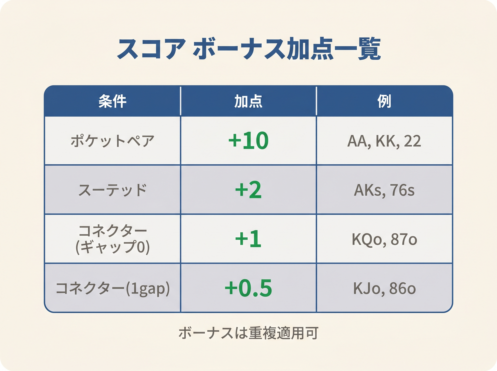
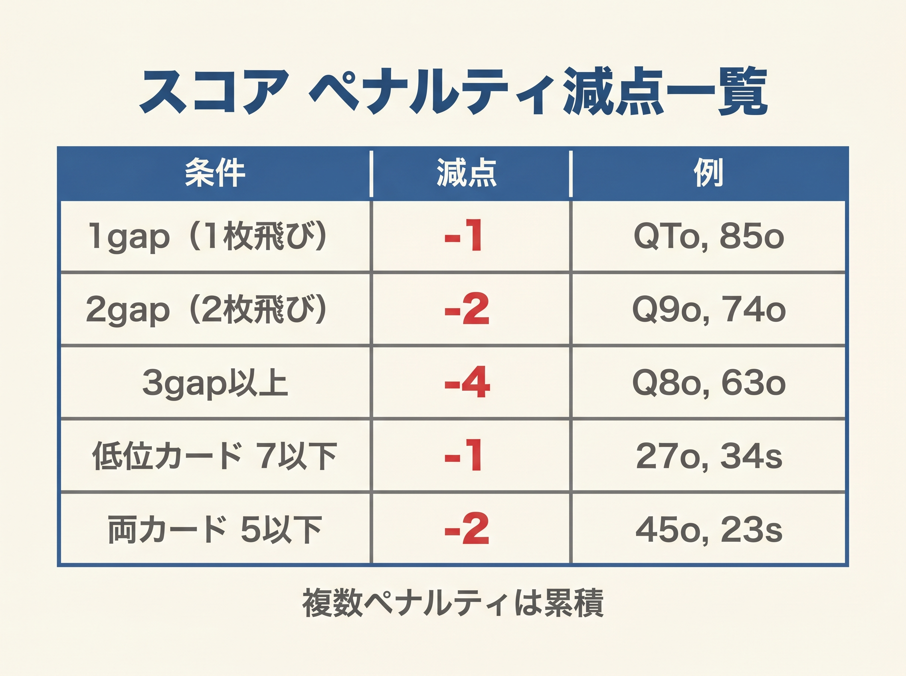

# 第5章　基本スコア式の全体像

<!-- markdownlint-disable MD036 MD060 -->
<!-- textlint-disable preset-ja-technical-writing/no-exclamation-question-mark -->
<!-- textlint-disable preset-ja-technical-writing/no-mix-dearu-desumasu -->
<!-- textlint-disable preset-jtf-style/4.3.7.山かっこ<> -->

> **本章の目標**: 本書の中核である「基本スコア式」を導入します。10のサンプルハンドで実際に計算し、暗算で式を回す感覚を体得します。

ここまでの4章は、計算式アプローチの「前提」を整える章でした。カードとポジションの数値化（第2章）、計算で判断する意義（第3章）、避けるべきミス（第4章）。本章からいよいよ**実装**に入ります。

本章で提示する**基本スコア式**は、オープンレイズをするかどうかを1つの数字で判定するための道具です。手札を見た瞬間にH + L + ボーナス − ペナルティを計算し、ポジション別しきい値と比較する。これだけで、レンジ表の代わりになります。

---

<figure><figcaption>Score = H + L + ボーナス - ペナルティ の式構造と各変数の説明図</figcaption></figure>

<figure><figcaption>ペア+10・スーテッド+3・コネクター+1のボーナス加点テーブル</figcaption></figure>

<figure><figcaption>ギャップ・低カードによるペナルティ減点テーブル（差5以上 -1・両方9未満 -1）</figcaption></figure>

<figure><figcaption>UTG 23 / MP 22 / CO 21 / BTN 18 / SB 20 のポジション別プレイしきい値ラダー</figcaption></figure>

## 5-1 スコア式の全体像

### 1行で表すと

本書の基本スコア式は次の1行です。

```text
Score = H + L + ボーナス − ペナルティ
```

各項目の意味は次の通りです。

- **H**：高い方のカード値（A=14、K=13、Q=12、J=11、T=10、…、2=2）
- **L**：低い方のカード値
- **ボーナス**：ペアやスーテッドなど、手役の可能性を足す
- **ペナルティ**：ギャップや低カードのリスクを引く

### ボーナスとペナルティの詳細

| 種別 | 条件 | 値 |
|------|------|-----|
| ボーナス | **ペア**（同じ数字2枚） | +10 |
| ボーナス | **スーテッド**（同じマーク） | +3 |
| ボーナス | **コネクター**（差 = 1） | +1 |
| ボーナス | **ギャップ2以内**（差 = 2 または 3） | +0.5 |
| ペナルティ | **ギャップ4以上**（差 = 5 以上） | −1 |
| ペナルティ | **両方のカードが9未満** | −1 |

「差」は、2枚のカード値の差の絶対値です。たとえばAKなら14 − 13 = 1、AJなら14 − 11 = 3、A9なら14 − 9 = 5です。

**重要な適用規則**：

- **ペアには「両方9未満」ペナルティは適用しない**。たとえば44は4+4+10=18（ペナルティ −1は引かない）。ペアは別カテゴリーのハンドとして独立した価値を持つためです。
- **ペアには「コネクター」「ギャップ」ボーナス／ペナルティも適用しない**（差=0のため対象外）。
- **ペアにはスーテッドボーナスも適用しない**（2枚が同じ数字だと必ず違うマーク）。

ボーナスとペナルティの「なぜその値か」は次章（第6章）で詳しく解説します。本章ではまず式を動かしてみることに集中します。

### 0.5の扱い

計算の途中で0.5が登場することがあります。しきい値はすべて整数なので、端数はそのまま残して比較すれば問題ありません。たとえばスコア25.5はしきい値24を超えるのでオープン、しきい値26を下回るので非オープンです。

---

## 5-2 ポジション別しきい値

計算したスコアを、ポジションごとのしきい値と比較します。

| ポジション | しきい値 |
|-----------|----------|
| UTG | 23 |
| MP | 22 |
| CO | 21 |
| BTN | 18 |
| SB | 20 |

判断ルールは1行です。

**スコア ≥ しきい値 → オープンレイズ、スコア < しきい値 → フォールド**

しきい値は第2章のポジション補正値（UTG −2 〜 BTN +2）と対応しています。UTGは最もタイト、BTNは最もルース。SBは「常にOOPになる不利」を織り込んでUTGより少し緩い20に設定しています。

---

## 5-3 10例題で計算を体感する

ここからは、10のサンプルハンドで実際に計算してみます。目標は、各ハンドを**3秒以内**でスコア化できるようになることです。

### 例1：AA（スコア = 38）

- H = 14（A）、L = 14（A）
- ペア：+10

```text
14 + 14 + 10 = 38
```

全ポジションで余裕のオープン。最強クラスのハンドです。

---

### 例2：AKs（スコア = 31）

- H = 14、L = 13
- スーテッド：+3
- 差 = 1（コネクター）：+1

```text
14 + 13 + 3 + 1 = 31
```

全ポジションでオープン。AA〜JJ、TT、AKsが28以上に並びます。

---

### 例3：77（スコア = 24）

- H = 7、L = 7
- ペア：+10

```text
7 + 7 + 10 = 24
```

**UTGしきい値23を1点上回る**。UTGでもオープンできる最も低いペアです。境界のハンドは設計上の基準点になっています。

---

### 例4：22（スコア = 14）

- H = 2、L = 2
- ペア：+10

```text
2 + 2 + 10 = 14
```

BTNしきい値18も下回る。本書ではフォールド扱いです（GTOとの差は後述）。

---

### 例5：AJo（スコア = 25.5）

- H = 14、L = 11
- 差 = 3（ギャップ2以内）：+0.5

```text
14 + 11 + 0.5 = 25.5
```

UTGしきい値24を超えるのでUTGオープン可。ただしこれはGTOよりやや積極的で、実戦ではやや控えめに構える判断もあります。

---

### 例6：KTs（スコア = 26.5）

- H = 13、L = 10
- スーテッド：+3
- 差 = 3（ギャップ2以内）：+0.5

```text
13 + 10 + 3 + 0.5 = 26.5
```

UTGしきい値23を超えるのでUTGオープン可。スーテッドのブロードウェイは強めに評価されます。

---

### 例7：QJs（スコア = 27）

- H = 12、L = 11
- スーテッド：+3
- 差 = 1（コネクター）：+1

```text
12 + 11 + 3 + 1 = 27
```

スーテッドコネクターは「スーテッド+3」と「コネクター+1」の両方を受けるため、見た目より高いスコアになります。

---

### 例8：T9s（スコア = 23）

- H = 10、L = 9
- スーテッド：+3
- 差 = 1（コネクター）：+1
- 両方9未満？　9は9未満ではないので、ペナルティなし

```text
10 + 9 + 3 + 1 = 23
```

UTGしきい値23にちょうど一致。UTG以降でオープン。

---

### 例9：K3s（スコア = 18）

- H = 13、L = 3
- スーテッド：+3
- 差 = 10（ギャップ4以上）：−1

```text
13 + 3 + 3 − 1 = 18
```

BTNしきい値18にちょうど一致。BTNギリギリのオープン対象です。**スーテッドでも弱いキッカーはBTNに近づくまで開けられない**という原則の数値的な確認です。

---

### 例10：72o（スコア = 7）

- H = 7、L = 2
- 差 = 5（ギャップ3以上）：−1
- 両方9未満：−1

```text
7 + 2 − 1 − 1 = 7
```

全ポジションで圧倒的にフォールド。ポーカーで最弱とされる72oは、本書式でもはっきり最弱域です。

---

## 5-4 スコアの「相場観」を掴む

ここまでの10例から、スコアの感覚を整理します。

| スコア帯 | 代表ハンド | 判定 |
|---------|-----------|------|
| 30以上 | AA、KK、QQ、JJ、TT、AKs | 全ポジでオープン |
| 26〜29 | 99、88、AKo、AQs、ATs、QJs | 全ポジでオープン |
| 23〜25 | 77、AJo、JTs、T9s、A9s | UTG 以降でオープン |
| 21〜22 | 66、98s | CO 以降でオープン |
| 18〜20 | 44、55、K3s、87s | BTN 以降でオープン |
| 17以下 | 76s、65s、72o | フォールド |

「手札を見てスコアが22以上ならとりあえずMPまで開ける」「18を下回るならBTN以外は降ろす」といったざっくりした感覚が、スコア式の運用上の武器になります。

---

> **補足（第21章への接続）**: 本章の式はスコアがしきい値を超えたら100%オープン、未満なら100%フォールドという単一の閾値で動きます。この決定論的な境界付近では、第21章で導入するR1（3バンド化）を使って混合ゾーンを設けることで、搾取されにくいプレイに近づけます。

## 【GTOとのズレ】スコア式が苦手な3つのハンド群

本書のスコア式は、プレミアムハンド〜中堅ハンドではGTOとよく整合します。しかし、**3つのハンド群で系統的にGTOより過小評価**する弱点があります。

### 弱点1：65s〜54s（下位スーテッドコネクター）

- 65s：スコア14（BTN閾値18を下回る → 全フォールド判定）
- GTO：CO・BTNからオープン

理由は「両方9未満のペナルティ −1」が下位のスーテッドコネクターに重くのしかかることです。実際には、これらのハンドはポストフロップでのナッツ率が高く、EVは本書スコアより高めに出ます。

**補足ルール**：65s〜54sはBTNに限り例外的にオープン可と覚えても構いません。

### 弱点2：22〜55（小ペア）

- 22：スコア14、33：16、44：18
- GTO：BTNから22+ をオープン対象

本書では22と33はBTN閾値18を下回るので全フォールド判定になります。しかしGTOではBTNで22+ を開きます（浅めなセットマイン狙いと多人数での潜在価値）。

**補足ルール**：22〜44もBTNに限り例外的にオープン可と覚えておきましょう。

### 弱点3：A2s〜A5s（スモール・スーテッドエース）

- A5s：スコア21（CO以降でオープン）、A2s：スコア18（BTN以降でオープン）
- GTO：UTGからA5s、A4s、A3sを開く（ブロッカー効果）

本書スコアは **Aのブロッカー効果**（相手のAAやAKが減る）を評価していません。GTOではAxsのブロッカー効果を高く評価し、UTGからもオープン、3ベットブラフ候補としても活用します。本書ではA5sはCO、A2s〜A4sはBTNまで待つ判定になります。

**補足ルール**：A2s〜A5sは中〜上級者はUTG・MPでの採用を検討する価値があります。初心者のうちは「本書スコアに従って控えめに」で十分です。

### 簡易式としての割り切り

この3つの弱点は、**初心者が「やりすぎて損する」側ではなく、「控えめすぎて機会損失する」側**にあります。言い換えれば、本書スコアに従って落とすハンドは、実戦で大事故につながるハンドではありません。

境界の数%のハンドでGTOより得られるEVを少し逃しても、**破滅的なミスを避ける方が初心者の収支改善には効果的**です。これが本書の立場です。

---

## 章のまとめ

- 基本スコア式は `Score = H + L + ボーナス − ペナルティ`
- ボーナス：ペア+10、スーテッド+3、コネクター+1、ギャップ2以内+0.5
- ペナルティ：ギャップ4以上−1、両方9未満−1
- ポジション別しきい値：UTG 23 / MP 22 / CO 21 / BTN 18 / SB 20
- スコア ≥ しきい値ならオープン、未満ならフォールド
- 77（スコア24）はUTGしきい値23を1点上回る境界の基準点です
- 76s=16、72o=7など弱いハンドははっきり低スコアになる
- 本書スコアは65s・小ペア・スモールAsの3群で系統的に過小評価する
- それらの弱点は「控えめすぎる損失」であり、大事故には繋がらない

---

## ミニクイズ

### 問1

次のハンドのスコアを計算してください。

1. JJ
2. 99
3. AQs

---

### 問2

次のハンドはどのポジションからオープンできるでしょうか（本書のしきい値に従う）。

1. KQs（スコア = 28）
2. JTs（スコア = 24）
3. 98s（スコア = 20）

---

### 問3

本書のスコア式がGTOと乖離するハンドとして、本章で指摘されたものはどれでしょうか（複数回答）。

1. AA
2. 65s
3. 22
4. A2s

---

### 解答

- **問1**：(1) 32（11+11+10）、(2) 28（9+9+10）、(3) 29.5（14+12+3+0.5）
- **問2**：（1）KQs=29はUTGからすべてオープン可、（2）JTs=25はUTGからすべてオープン可、（3）98s=21はCO以降でオープン可
- **問3**：2、3、4（65sと22とA2sはいずれも本書で過小評価されるハンド）

---

## 出典

- ThePokerBank『The Chen Formula』
- ThePokerBank『Sklansky and Malmuth Starting Hand Groups』
- 888 Poker『GTO Open Raising Strategies』（2020年代）
- GTO Wizard『Preflop Range Morphology』（2024）
- Upswing Poker『How to Play Six-Five Suited』（2024）
- Wikipedia『Texas hold'em starting hands』
