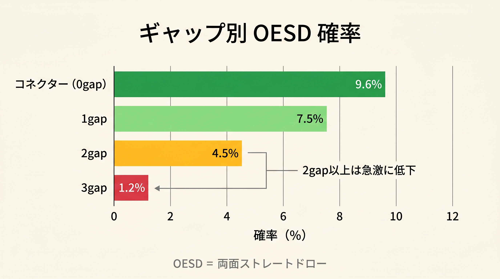

# 第6章　ボーナスとペナルティの意味

<!-- markdownlint-disable MD060 -->
<!-- textlint-disable preset-ja-technical-writing/no-exclamation-question-mark -->
<!-- textlint-disable preset-ja-technical-writing/no-mix-dearu-desumasu -->

> **本章の目標**: 前章で導入した基本スコア式の各項目について、「なぜその値なのか」を確率データとともに理解します。丸暗記ではなく、**理屈で覚える**ことが目的です。

前章で、基本スコア式のボーナスとペナルティは次の6項目でした。

- ペア：+10
- スーテッド：+3
- コネクター（差1）：+1
- ギャップ2以内（差2〜3）：+0.5
- ギャップ4以上（差5以上）：−1
- 両方9未満：−1

本章ではこれらの値の裏付けを順に見ていきます。数字の根拠がわかれば、境界での判断で迷ったとき自分で調整できるようになります。

---

<figure><figcaption>スーテッドハンドのフラッシュ完成率11%とEV上乗せ3-5%を示すテーブル</figcaption></figure>

<figure><figcaption>コネクター9.6% → 1gap 7.5% → 2gap 4.5% のOESD確率減衰を横棒グラフで示す</figcaption></figure>

## 6-1 ペア +10 の根拠

### セットが入る確率は約11.8%

ポケットペアの最大の魅力は、**フロップでセット（3枚のペア）が完成する確率**の高さです。

- セット成立確率：**約 11.8%**（およそ8.5回に1回）
- 出典：Upswing Poker『What Are The Odds of Flopping Poker Hands?』

セットはボードに隠れやすい強烈な手で、相手が気付かずに大量のチップを投入してくれます。この「隠れた強さ」がペアの第一の価値です。

### ペアはオーバーカードに対して優勢

ペアは「コインフリップ」と呼ばれる状況でも、実は有利です。

| マッチアップ | ペアのエクイティ |
|-------------|----------------|
| ポケットペア vs 2 オーバーカード | 約 55% |
| QQ vs AKo | 約 57% |
| 55 vs AK | 約 54% |
| AA vs ランダムハンド | 約 85% |

2枚のオーバーカード（例：AK）を持った相手に対しても、小さいペアは少し有利です。これは**プリフロップの段階ですでに勝率優位**があることを意味します。

### Sklansky Hand Groupsでの位置

1988年の古典『Hold'em Poker for Advanced Players』では、169ハンドをグループ1〜9に分類しています。**すべてのポケットペアがグループ1〜7に入ります**。グループ9（ほぼ全フォールド）に入るペアは存在しません。

これはペアがほかのハンドと比べて、一段階上の「基礎価値」を持つことを示しています。

### なぜ +10 か

ペアの価値は「セット率12%」と「ショーダウン優位（55%以上）」の二重構造です。これをほかのボーナス（スーテッド +3、コネクター +1）と同じ数値帯で扱うと、ペアの強さが埋もれてしまいます。

そこで本書は **一桁大きい +10** で差別化します。77（スコア24）がUTGしきい値にちょうど収まるように、値を逆算した形でもあります。

---

## 6-2 スーテッド +3 の根拠

### フラッシュドローの成立確率

スーテッド（同じマーク）のハンドの利点は、フラッシュの可能性です。

- フロップでフラッシュドローが成立：**約 11%**
- ドロー成立後にリバーまでにフラッシュ完成：**約 35%**
- フロップでいきなりフラッシュ完成：約0.8%

つまり、スーテッドハンドを配られた約11% の場面では、フロップから「**最低でも35%の勝率を持つドロー**」を抱えられます。

### エクイティ差は3〜5%

実測データでは、スーテッドとオフスーツのエクイティ差は概ね次の通りです。

- AKs vs AA：AKsのエクイティ約17%
- AKo vs AA：AKoのエクイティ約12%
- **差：約 5%**（スーテッド化によるエクイティ改善）

ハンド全体を見ると、スーテッドであることで **平均 3〜5%** のエクイティ改善になります。

### プレイアビリティという隠れた価値

スーテッドの真の価値は、ポストフロップの選択肢の多さにあります。

- **ナッツ級のドロー**：両方のホールカードを使ったフラッシュは負けにくい
- **セミブラフが強くなる**：フラッシュドロー＋ペアなどの組み合わせでベット継続しやすい
- **降りる判断が明確**：ドロー外しなら潔く降りられる

これらを合わせて、本書では **+3** としています。内訳のイメージは「フラッシュドロー価値 +2 + プレイアビリティ加算 +1」です。エクイティ改善（3〜5%）だけなら +2 ですが、ナッツ級ドローの作りやすさやセミブラフの効きやすさといった**実現率（ポストフロップ EV）への寄与**が +1 上積みされる構造です。

---

## 6-3 コネクター（差 1）+1 の根拠

### ストレートドローの成立確率

連続した数字のカード（76、JT、AKなど）の利点は、ストレートを作れることです。

| ドロータイプ | 確率 |
|-------------|------|
| 何らかのストレートドロー | 約 **26.2%** |
| OESD（両面ストレートドロー） | 約 **9.6%** |
| ガットショット | 約 16.6% |
| フロップでストレート完成 | 約 1.3% |

フロップを見たときに、**26%の確率でストレート系のドロー**が入っているというのは大きな武器です。

### OESDの価値

OESD（Open-Ended Straight Draw、両面ストレートドロー）は、残り2枚のボードでストレートを完成させる確率が約32% のドローです。これはフラッシュドロー（約35%）とほぼ同じ強さを持ちます。

### スーテッドコネクターの相乗効果

**スーテッドコネクター**（76s、98sなど）は、フラッシュとストレートの両方のドローが期待できます。

- フラッシュドロー：11%
- OESD：9.6%
- 重複や組み合わせドローを含めると、**約 35% の確率で何らかの強いドローが入る**

これが、スーテッドコネクターが「小さい数字なのに強い」理由です。本書スコアでは、**スーテッド +3 とコネクター +1 の両方が加算**される仕組みになっています。

### なぜ +1 か

コネクター単独の価値は OESD 9.6%（フラッシュドロー 11% よりやや低い）程度のドロー期待値です。プレイアビリティ寄与もスーテッドより限定的なため、**スーテッドボーナス +3 の約 1/3 にあたる +1** を設定しています。

---

## 6-4 ギャップ2以内（差 2〜3）+0.5 の根拠

### ストレートドローは段階的に減る

ギャップが広がるほど、ストレートドローの成立確率は急速に減少します。

| タイプ | 全ストレートドロー | OESD |
|-------|------------------|------|
| コネクター（差 1） | 26.2% | 9.6% |
| 1-gapper（差 2、例：KJ） | 21.9% | 7.3% |
| 2-gapper（差 3、例：KT） | 17.9% | 4.5% |

- 出典：PokerRailbird『Straight Draw Poker Odds by Connector Type』

OESDだけを見ると、1-gapperはコネクターの約75%、2-gapperは約47% まで低下します。

### +0.5 はコネクター +1 の半分

この減少率を反映して、1-gapperと2-gapperにはコネクター（+1）の **半分にあたる +0.5** を与えています。ゼロではなく +0.5を残すのは、境界での微妙な差を拾うためです。

たとえばAJo（差3、ギャップ2）は14 + 11 + 0.5 = 25.5。端数の0.5が、しきい値周辺で小さな差を生むことがあります。

---

## 6-5 ギャップ4以上（差 5 以上）−1 の根拠

### ストレート形成ルートがほぼ消える

差が5以上（K8、Q7、J6など）になると、ストレートを作れる並びが激減します。

- 2-gapper：OESD 4.5%
- 3+-gapper：OESDはほぼ0%相当

たとえばK8の場合、K（13）と8の差は5。5枚組のストレートには両方を同時に含めることができません（8-9-T-J-Q-Kなら6枚必要）。つまり**両方のホールカードを使ったストレートは作れない**のです。K単独のストレート（T-J-Q-K-A）や8単独のストレート（4-5-6-7-8など）は可能ですが、その場合1枚のホールカードが「死に札」になり、**ドロー系の価値はほぼゼロ**と見なせます。

### ショーダウン勝負になる

ギャップが大きいハンド（K8oなど）は、「高カードがあるからショーダウンで勝つ」という路線でプレイする必要があります。しかしポストフロップの選択肢が少なく、相手にコントロールされやすいハンドです。

### なぜ −1 か

−1は「あってほしくない性質」の最小ペナルティ単位です。ストレート潜在力がゼロに近いハンドは、スコア上でコネクターと差がつくようになっています。

---

## 6-6 両方 9 未満 −1 の根拠

### 低いカード同士の3つの弱み

8以下の2枚（65、74、83など）には、次の3つの構造的弱みがあります。

1. **キッカー負けしやすい**：フロップでペアを作っても、相手のトップペアに常に負ける
2. **ペア負けしやすい**：自分が6ペアを作っても、相手のAペアや9ペアに押し潰される
3. **高カード勝負ができない**：フロップに何も絡まない場合、降りるしかない

### 65sでも勝率は控えめ

65sは典型的なスーテッドコネクターですが、ランダムハンドへのエクイティは約48%。高カードのハンド（AKsで約65%）に比べると見劣りします。

### ストレートの「高さ」が負ける

65sで両方のカードを使えるストレートは「2-3-4-5-6、3-4-5-6-7、4-5-6-7-8、5-6-7-8-9」の4通り。JTsも同様に4通り（7-8-9-T-J、8-9-T-J-Q、9-T-J-Q-K、T-J-Q-K-A）です。本数は互角ですが、**65s のストレートは低く、相手の上位ストレートに負けるリスク**があります。たとえば4-5-6-7-8のボードで自分が65s、相手が89なら、9-8-7-6-5の上位ストレートで負けます。JTsではこの「上位に負ける」リスクがほぼありません。

### なぜ −1 か

このペナルティは「価値はあるが状況が限定的」という中程度のマイナスです。−1にとどめているのは、スーテッドコネクター（65sなど）ではまだ戦えるからです。極端なペナルティ（−3や −5）は過剰で、実際にプレイ可能なハンドを捨てすぎてしまいます。

---

## 6-7 値の相対関係を俯瞰する

| 要素 | 値 | 根拠となる確率 |
|------|-----|---------------|
| ペア | +10 | セット率 12% ＋ ショーダウン優位 55%〜 |
| スーテッド | +3 | フラッシュドロー 11% ＋ エクイティ向上 3〜5% ＋ プレイアビリティ |
| コネクター | +1 | OESD 9.6% ＋ 全ストレートドロー 26.2% |
| ギャップ2以内 | +0.5 | OESD 4.5〜7.3%（コネクターの半分程度） |
| ギャップ4以上（差5以上） | −1 | ストレート潜在力ほぼゼロ |
| 両方9未満 | −1 | キッカー負け、ドミネーション |

この階層構造を見ると、ペアがいかに突出した価値を持つかがわかります。スーテッド +3 とコネクター +1 は「ペアの 3/10 と 1/10」程度に位置付けられています。

---

## 【GTOとのズレ】精密さ vs 暗算しやすさ

### 本書の値は近似値である

本章で示した値は、すべて**近似**です。実際のEV差は連続値で、状況によっても変動します。たとえばスーテッドの価値は、「同じマークのコネクター」と「広くギャップのあるスーテッド」では異なります。

GTOソルバーはこれらを連続的に評価しますが、**暗算では連続値を扱えません**。そこで本書は「整数（または0.5刻み）」に丸めています。

### 丸めによる誤差はどこに出るか

- **AQs と AKs を同じ +3 評価**：実際にはAKsのほうがもう少し強い
- **77 と 22 のペア +10 は同じ**：実際にはペアの強さはランクで変わる
- **65s と JTs のコネクター +1 は同じ**：JTsのほうがドローの質で勝る

これらの差は、実戦では数bb/100のレベルです。完全な最適解を捨てて、暗算できる形を手に入れるというトレードオフです。

### 上級者向けの補正

境界で迷ったときは、次の経験則で調整してください。

- **高いカード同士は少し上積み**：JTsやKQsは +1するイメージ
- **低いカード同士は少し割引**：65sや54sは −1するイメージ
- **ブロッカー効果のある Axs は上積み**：A5s、A4sなどは +2程度の上乗せを想定

本書の式で違和感が出たら、この3つの軸で微調整できます。

---

## 章のまとめ

- ペア +10は「セット率12%」と「オーバーカード相手の55% 優位」の二重構造
- スーテッド +3は「フラッシュドロー 11%」「エクイティ差3〜5%」「プレイアビリティ加算」の三層
- コネクター +1は「OESD 9.6%」と「全ストレートドロー 26.2%」
- ギャップ2以内 +0.5はコネクターの半分程度のストレート期待値を反映
- ギャップ4以上（差5以上） −1はストレート潜在力がほぼゼロになる
- 両方9未満 −1はキッカー負けとドミネーションリスク
- 値はすべて近似で、暗算しやすさとのトレードオフがある
- 違和感があれば「高いカードは上積み、低いカードは割引」で微調整する

---

## ミニクイズ

### 問1

ポケットペアがフロップでセットになる確率として最も近いのはどれでしょうか。

1. 約2%
2. 約12%
3. 約30%
4. 約50%

---

### 問2

スーテッドとオフスーツの平均エクイティ差として最も近いのはどれでしょうか。

1. 約1%
2. 約4%
3. 約10%
4. 約20%

---

### 問3

本書のスコア式における「両方9未満 −1」のペナルティが適用されるハンドはどれでしょうか（複数回答）。

1. 76s
2. T9s
3. 85s
4. A5s

---

### 解答

- **問1**：2（約11.8%）
- **問2**：2（約3〜5%、代表例で約4%）
- **問3**：1と3（76sと85sは両方9未満。T9sは10と9で片方9以上、A5sはAがあるため対象外）

---

## 出典

- Upswing Poker『What Are The Odds of Flopping Poker Hands?』
- Upswing Poker『Odds of Hitting a Draw in Poker』
- Upswing Poker『Set Mining Poker Tips』
- Upswing Poker『Raw Equity vs Realized Equity』
- PokerRailbird『Straight Draw Poker Odds by Connector Type』
- 888 Poker『Flush Poker Odds』／『Straight Poker Odds』
- CardFight『AKs vs AKo Statistics』
- SplitSuit Poker『How Do Suited Connectors Hit』（2026）
- ThePokerBank『Sklansky and Malmuth Starting Hand Groups』
