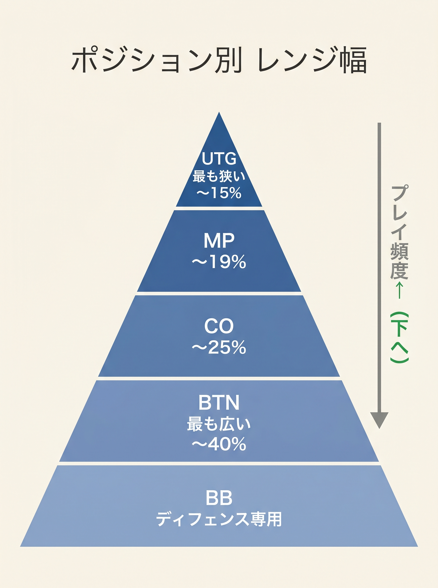
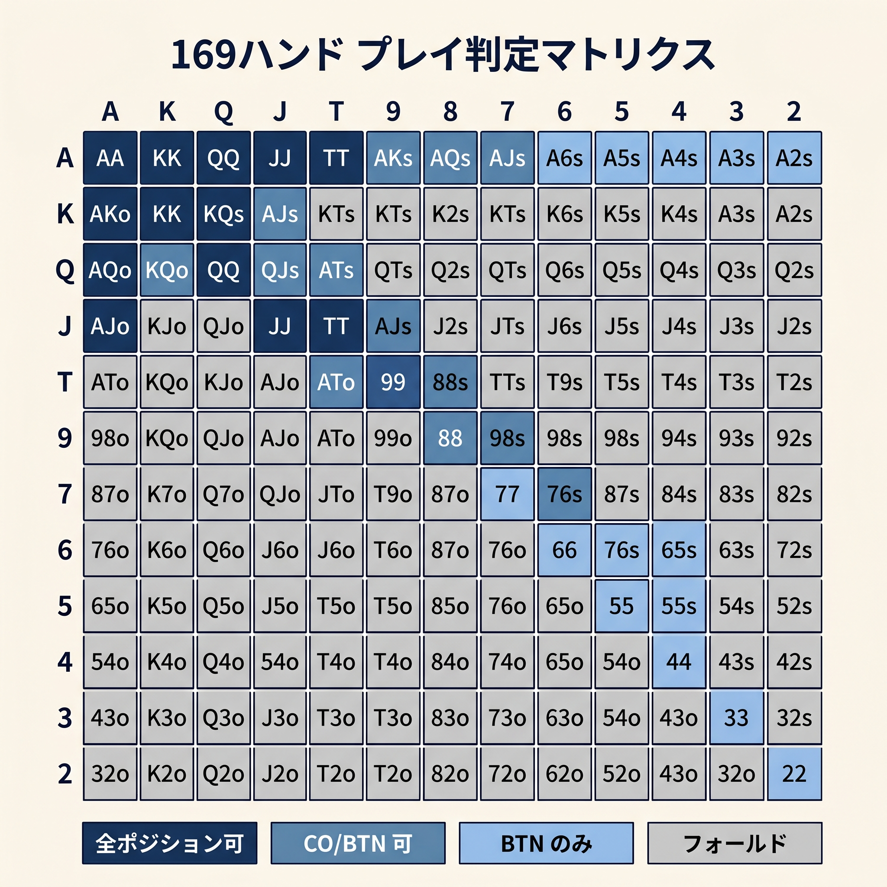

# 第7章　ポジション別しきい値で決める

<!-- markdownlint-disable MD060 -->
<!-- textlint-disable preset-ja-technical-writing/no-exclamation-question-mark -->
<!-- textlint-disable preset-jtf-style/4.3.7.山かっこ<> -->

> **本章の目標**: 計算したスコアを「ポジション別しきい値」と比較し、実際のアクションに変換します。10問の判断例を通じて、計算 → 比較 → アクションの流れを身体化します。

前章までで、スコア式の全体像とボーナス・ペナルティの意味が揃いました。残るは**「どう使うか」**です。本章では、計算結果を最終アクション（オープンレイズかフォールドか）に変換する最後のステップを扱います。

---

<figure><figcaption>UTG（最も狭い）からBTN（最も広い）へのレンジ幅ピラミッド図</figcaption></figure>

<figure><figcaption>169ハンドをポジション別しきい値で色分けしたマトリクス図</figcaption></figure>

## 7-1 しきい値とGTOレンジの対応

### 本書のしきい値（再掲）

| ポジション | しきい値 |
|-----------|----------|
| UTG | 23 |
| MP | 22 |
| CO | 20 |
| BTN | 18 |
| SB | 22 |

### GTOレンジとの整合性

本書のしきい値を超えるハンドの割合と、GTO推奨のRFI（Raise First In、最初にレイズする頻度）を比べると、次のようになります。

| ポジション | 本書でオープン可 | GTO推奨RFI |
|-----------|-----------------|-----------|
| UTG | 約 16〜17% | 約 17.0% |
| MP | 約 21〜22% | 約 21.4% |
| CO | 約 27〜28% | 約 27.8% |
| BTN | 約 43〜45% | 約 43.3% |
| SB | 約 21〜23% | 約 24.3%（raise） |

全ポジションでGTOとの差が±2%以内に収まっています。つまり、**本書のしきい値でオープンする頻度は、GTOとほぼ同じ割合**になります。

なお SB の GTO 戦略は「raise + limp」の混合で表面上 raise + limp 合計は約 60% に達します。本書は「raise か fold」のシンプル戦略を採るため、SB のしきい値は raise レンジ（約 24%）に合わせて 22 と MP 並みに設定しています。

### 判断ルールは1行

```text
スコア ≥ しきい値 → オープンレイズ
スコア < しきい値 → フォールド
```

例：あなたはUTGでAKoを持っています。スコアは14 + 13 + 1 = 28。UTGしきい値は23。28 ≥ 23なのでオープン。以上です。

---

## 7-2 境界ハンド10選の判断

ここからは、しきい値の境界にある10ハンドを具体的に見ていきます。各ハンドは「計算 → 比較 → アクション」の流れで示します。

### 例1：77 を UTG から

- スコア：7 + 7 + 10 = **24**
- UTGしきい値：23 → 24 > 23でオープン
- **判断：オープン**

77はUTG開きの下限ハンドとして設計された基準点です。66以下のペアはMP以降で扱います。

### 例2：66 を MP から

- スコア：6 + 6 + 10 = **22**
- MPしきい値：22 → 22 ≥ 22で境界ぴったり
- **判断：オープン**

66はMPオープンの下限ハンドです。UTGでは開けないが、MPに回れば入れるという典型例。

### 例3：AJo を UTG から

- スコア：14 + 11 + 0.5 = **25.5**
- UTGしきい値：23 → 25.5 > 23
- **判断：オープン（ただし注意）**

本書スコアではAJoをUTGで開くと判定されます。しかしGTOではAJoのUTGオープンは**混合戦略（一部フォールド）**が主流で、純粋なオープン対象はAQo+ までが標準です。

つまり、本書スコアはAJoをやや**過大評価**しています。実戦では「UTGのAJoはギリギリ開けられるが、慎重に」と覚えておいてください。

### 例4：AJo を CO から

- スコア：**25.5**（同上）
- COしきい値：20 → 25.5 > 20
- **判断：オープン（余裕あり）**

COからならAJoは余裕のオープン対象です。同じAJoでも、ポジションで扱いが真逆にならないまでも、大きく変わります。

### 例5：QJs を UTG から

- スコア：12 + 11 + 3 + 1 = **27**
- UTGしきい値：23 → 27 > 23
- **判断：オープン（ただし注意）**

GTOではQJsのUTGオープンは混合です。HJ以降が標準。本書はスーテッド +3とコネクター +1が両方効いて過大評価気味になります。

### 例6：A9s を UTG から

- スコア：14 + 9 + 3 − 1 = **25**（差 = 5 → ギャップ4以上ペナルティ −1）
- UTGしきい値：23 → 25 > 23
- **判断：オープン**

A9sはGTO的にもUTGレンジの下限付近。整合性のある判定です。

### 例7：K9s を MP から

- スコア：13 + 9 + 3 = **25**（差 = 4 → ペナルティ適用外）
- MPしきい値：22 → 25 > 22
- **判断：オープン**

K9sはギャップが4（差 = 4）ですが、新しいペナルティ適用は差5以上からなのでペナルティなし。スーテッドボーナスも加わりスコア25と余裕のMPオープンです。

### 例8：98s を CO から

- スコア：9 + 8 + 3 + 1 = **21**
  - 両方9未満？　9は9未満ではないのでペナルティなし
- COしきい値：20 → 21 > 20でオープン
- **判断：オープン（1点上回る）**

### 例9：JTs を UTG から

- スコア：11 + 10 + 3 + 1 = **25**
- UTGしきい値：23 → 25 > 23
- **判断：オープン**

JTsはスーテッドコネクターの代表。UTGでも余裕のオープン対象です。

### 例10：44 を BTN から

- スコア：4 + 4 + 10 = **18**
- BTNしきい値：18 → 18 ≥ 18で境界ぴったり
- **判断：オープン**

44はBTNオープンの下限。33以下は本書スコア17以下でフォールド判定になります（ただしGTOではBTNで22+ を開くので、この弱点は前章で触れました）。

---

## 7-3 「1点下なら降りる」ルール

### 迷ったら下げる

計算した結果、スコアがしきい値を**1点下回った**とします。たとえばUTGでスコア22。このとき、あなたは迷います。「もう少しで開けられたのに」という気持ちが湧いてくるでしょう。

本書の推奨は**即フォールド**です。

### なぜ「迷ったら下げる」が正解か

理由は3つあります。

1. **境界ハンドのEVはほぼゼロ**：スコアがしきい値付近のハンドの期待値は、GTO解析によれば約0〜0.1 bb/hand。オープンするか折るかによらず1ハンドあたりの差は微小で、どちらを選んでも大きな損はありません
2. **ポストフロップの難しさが本質的コスト**：境界ハンドは、開けた後にフロップ以降で難しい判断を連続することになります。この判断コストはEV差より大きい損失源です
3. **フォールドのEVは常にゼロ**：迷う手を降ろしても「ゼロ」で、マイナスにはなりません

### プロも「Edge-Passing」を推奨する

Upswing Pokerが記事で紹介している**Edge-Passing**（微弱なエッジを見送る）という考え方があります。初心者〜中級者は、わずかなエッジを取るよりも、大きなミスを避けるほうが収支に効きます。

> 「フォールドは0、マイナスにはならない」

これを胸に、迷ったら降ろしてください。

---

## 7-4 しきい値の微調整

### 場面別の調整方針

しきい値は固定ではなく、状況に応じて微調整できます。

#### アンティがある場合（しきい値を1〜2点下げる）

アンティ（全員が強制的に出すベット）があると、ポットが最初から膨らんでいるため、スチール（ブラインドやアンティを奪うレイズ）の期待値が上がります。

- アンティなし：UTGしきい値23
- アンティあり（1BB相当）：UTGしきい値21〜22に下げる

各ポジションで同じく1〜2点下げるイメージです。

#### タイトな相手が多い場合（しきい値を1点下げる）

テーブル全体が明らかにタイト（VPIPが低い）なら、あなたのオープンに対して降りてくる率が高まります。スチール頻度を少し上げられます。

- UTG：23 → 22
- BTN：18 → 17

#### ルースな相手が多い・マルチウェイの場合

逆にルース気味の相手が多いと、スチールが通りません。しきい値を下げる意味は薄いです。むしろ：。

- **スーテッドコネクター（65s、87sなど）の価値は上がる**：多人数ポットで化ける可能性
- **オフスーツのブロードウェイ（AJo、KQo）の価値は下がる**：ヘッズアップで真価を発揮するタイプのため

### 慣れるまでは固定でよい

これらの微調整は、本書の式の運用に慣れてから取り組んでください。最初のうちは固定しきい値を守るだけで十分です。微調整は第14章で深掘りします。

---

> **補足（第21章への接続）**: 本章のしきい値表はポジションごとに1本の閾値で判断しますが、境界付近のハンドは決定論的に扱うことで相手に頻度を読まれるリスクがあります。第21章のR1では、この表の各しきい値にT±2の混合ゾーンを追加した「3バンド版しきい値表」として発展させます。

## 【GTOとのズレ】本書がやや広めに開いてしまうハンド

### 過大評価の2ハンド

本章の判断例で見た通り、本書スコアは以下の2ハンドを**GTOより広めに開く**傾向があります。

| ハンド | 本書 | GTO |
|--------|------|-----|
| AJo | UTG 以降でオープン | CO 以降が標準 |
| QJs | UTG 以降でオープン | HJ 以降が標準 |

### なぜ過大評価するのか

AJoの場合：AとJの数値が14と11と大きいため、H + Lのベース値が25と高くなります。オフスーツのドミネーションリスク（相手のKKやAKにキッカー勝ちされる）を式が反映できていません。

QJsの場合：スーテッド +2とコネクター +1が両方効くため、スコアが26まで上がります。しかし実戦では、ポストフロップで役を作りきれないとキッカー勝負になり、ドミネートされやすい性質があります。

### どう対処するか

2つの方針があります。

1. **本書のままでよしとする**：境界ハンドの誤差は数bb/100レベル。本書の簡易式の設計思想（暗算できる近似）の範囲内です
2. **経験則で下げる**：「AJoとQJsはUTGでは1ランク下げてMP以降で開ける」と個別に覚える

本書のスタンスは1番です。微細な誤差より、全体像を掴むことを優先します。

---

## 章のまとめ

- スコア ≥ しきい値 → オープン、未満 → フォールドという単純ルール
- 本書のしきい値はGTOのRFI頻度と±2%以内で一致する
- 77はUTG下限ペア（スコア24）、66はMP下限ペア（スコア22）、55はCO下限ペア（スコア20）、44はBTN下限ペア（スコア18）
- AJoとQJsは本書スコアでやや過大評価され、UTGオープン判定になる
- 「1点下回ったら降ろす」が初心者の合理的なルール
- しきい値はアンティ・相手タイプ・マルチウェイで微調整できる
- 微調整は慣れてからでよい（第14章で深掘り）

---

## ミニクイズ

### 問1

次のハンドをUTGから開くかどうか、本書の判定で答えてください。

1. AQs（スコア = 28.5）
2. KTs（スコア = 25.5）
3. 66（スコア = 22）

---

### 問2

あなたはCOでQTsを持っています。スコアは12 + 10 + 3 + 0.5 = 25.5でした。本書の判定はどれでしょうか。

1. オープンレイズ
2. フォールド
3. コール

---

### 問3

本書のスコアがGTOより「やや広めに開く」ハンドとして、本章で指摘されたものはどれでしょうか（複数回答）。

1. AJo
2. AA
3. QJs
4. 77

---

### 解答

- **問1**：（1）開ける、（2）開ける、（3）開けない（22 < 23）
- **問2**：1（COしきい値20を超えるのでオープン）
- **問3**：1と3（AJoとQJsが本書で過大評価される）

---

## 出典

- GTO Wizard『Preflop Range Morphology』（2023〜2024）
- freebetrange『6 max Preflop Charts: Open Raise』（2024）
- PokerStrategy『UTG Pre-flop Ranges』（2023）
- PokerCoaching『Implementable GTO Charts』（2024）
- MicroGrinder『6-Max Pre-Flop Open Raising Ranges』（2023）
- Upswing Poker『Edge-Passing: When Folding Profitable Hands is Right』（2024）
- Upswing Poker『The Ultimate Guide to 6-Handed Poker』（2024）
- 888poker『6 Max Opening Ranges』（2024）
