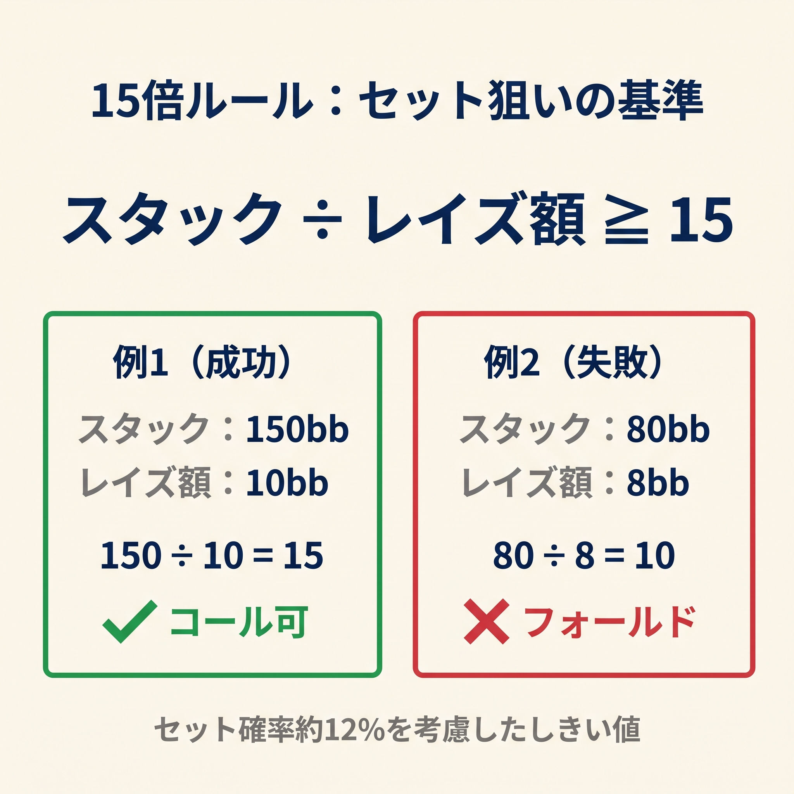
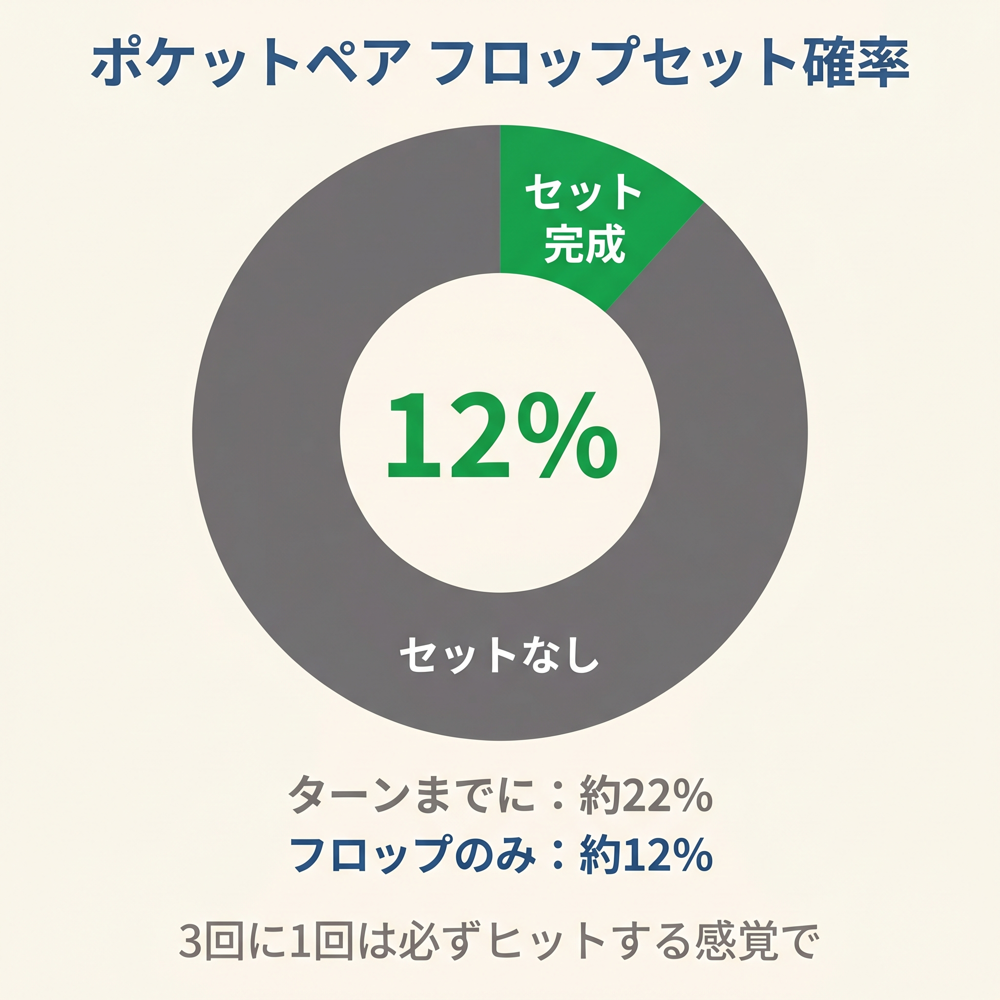

# 第11章　セットマイニング15倍ルール

<!-- markdownlint-disable MD060 -->
<!-- textlint-disable preset-ja-technical-writing/no-exclamation-question-mark -->
<!-- textlint-disable preset-ja-technical-writing/no-mix-dearu-desumasu -->
<!-- textlint-disable preset-jtf-style/4.3.7.山かっこ<> -->

> **本章の目標**: 小ペア（22〜66）で対オープンにコールする判断を「15倍ルール」で瞬時に決められるようになります。なぜ15倍なのか、第4章の25倍ルールとどう使い分けるのかを学びます。

ポーカーで最もワクワクするハンドの1つが、**セット**（ポケットペアにフロップで3枚目のランクが落ちた状態）です。相手はあなたがセットを持っているとは気付きにくく、強いハンド（トップペアなど）で大量のチップを入れてきてくれます。

しかし、セットは**約8.5回に1回しか入りません**。残り7.5回はフロップで諦めるしかないハンドです。この非対称性をどう扱うか。それが本章のテーマです。

---

<figure><figcaption>スタック÷レイズ額≥15のセット狙いコール基準を式と例で示す図</figcaption></figure>

<figure><figcaption>ポケットペアのフロップセット確率12%を示すパイチャート</figcaption></figure>

## 11-1 セットマイニングの数学

### セットが入る確率は約 12%

ポケットペアを持ってフロップを見たとき、同じランクのカードが1枚以上出る確率は次のように計算できます。

- 1枚目がハズレる確率：48/50
- 2枚目がハズレる確率：47/49
- 3枚目がハズレる確率：46/48
- 全部ハズレる確率 ≈ 88.2%
- **セット以上が入る確率 ≈ 11.8%（約 8.5 回に 1 回）**

オッズ表記では **7.5 対 1**（ハズレ7.5回に対し1回セット）となります。

### ポットオッズだけでは絶対に足りない

3BBのオープンに3BBコールすると、コール時の最終ポットは約7.5BB。ポットオッズは3 / 7.5 = 40%。これは必要勝率40% を意味します。

しかしセットが入る確率は12%。ポットオッズだけでは**明らかに赤字**です。セットマイニングは**インプライドオッズ**（セット完成後に追加で取れる額）があってはじめて成立します。

---

## 11-2 15倍ルールの導出

### ブレイクイーブン条件

セットが入るのは約8.5回に1回。残り7.5回はコール額を失います。ブレイクイーブン（損益ゼロ）には次が必要です。

```text
コール額 × 8.5 ≤ セット完成時の回収額
```

### 実戦での回収率は約 60%

セットが入ったからといって、必ず相手のスタック全額を取れるわけではありません。相手がフォールドすることもありますし、セット完成後にさらに上のセット（オーバーセット）で負けることもあります。

経験則として、**セット完成時に相手のスタックの約 60% を回収できる**と見積もります。

### 式を解く

60% 回収を前提に式を展開すると次のようになります。

```text
コール額 × 8.5 = 相手スタック × 0.60
相手スタック = コール額 × 8.5 ÷ 0.60 ≈ コール額 × 14.2
```

切り上げ、バッファを持たせた実用値が **15倍ルール** です。

```text
コール額 × 15 ≤ 相手の有効スタック
```

---

## 11-3 15倍ルール vs 25倍ルール

第4章で紹介した「25倍ルール」は、本章の15倍ルールをより保守的にした版です。使い分けの指針を整理します。

| ルール | 前提 | 適用場面 |
|--------|------|---------|
| **15倍ルール** | 60%回収前提・IP・インプライドオッズが効く | BTN、CO、ディープスタック、ルースな相手 |
| **25倍ルール** | 保守的（回収率が低い想定） | SB、BB などOOPの位置、相手を読みにくい状況 |

一般的には以下のイメージで使い分けます。

- **IP・ルースな相手・100BB以上**：15倍ルール
- **OOP・タイトな相手・スタックが微妙**：25倍ルール（より厳しい）

迷ったときは**大きい側（25倍）**を採用しましょう。フォールドのEVはゼロですが、成立しないセットマインに突っ込むと赤字になります。

---

## 11-4 具体例

### 必要スタック早見表

| コール額 | 15倍ルール（IP） | 25倍ルール（OOP） |
|---------|-----------------|------------------|
| 2.5 BB | 37.5 BB 以上 | 62.5 BB 以上 |
| 3 BB | 45 BB 以上 | 75 BB 以上 |
| 5 BB | 75 BB 以上 | 125 BB 以上 |
| 10 BB | 150 BB 以上 | 250 BB 以上（ほぼ不成立） |

### ケーススタディ

**ケース1**：COが3BBオープン、BTNに座るあなたは22を持つ。相手の有効スタック100BB。

- 15倍チェック：3 × 15 = 45BB ≤ 100BB → **コール成立**
- IPなので15倍ルールで十分

**ケース2**：UTGが3BBオープン、BBに座るあなたは55を持つ。相手の有効スタック80BB。

- BBはOOPなので25倍ルールで判断
- 25倍チェック：2 × 25 = 50BB ≤ 80BB → **コール成立**（コール額は差額2BB）
- ただしOOPのため実現率も考慮し、総合的に判断

**ケース3**：HJが3BBオープン、BTNに座るあなたは33を持つ。相手の有効スタック40BB。

- 15倍チェック：3 × 15 = 45BB > 40BB → **フォールド**
- 相手のスタックが浅くてセットマインが成立しない

**ケース4**：UTGが3BBオープン、HJ に座るあなたは22を持つ。相手の有効スタック200BB。

- 15倍チェック：3 × 15 = 45BB ≤ 200BB → **コール成立**（余裕あり）
- ディープスタックではセットマイニングが最大限に活きる

---

## 11-5 成立する状況の3条件

セットマイニングが成功するのは、次の3つが揃ったときです。

1. **相手のスタックが深い（100BB 以上）**：回収額が大きい
2. **相手がオーバーバリュー型**：セット完成時にトップペアやオーバーペアで大量のチップを入れてくれる
3. **IP である**：フロップで相手の動きを見てから判断できる

この3つが揃うと、セットマイニングは本書のスコア式と並ぶ「固い」戦略になります。

---

## 11-6 成立しない状況の4条件

逆に、以下の状況ではセットマイニングは赤字行動になります。

### 条件1：相手のスタックが浅い（50BB 以下）

40BBスタックの相手に対する22のセットマイニングを計算してみましょう。

- コール額3BB、必要スタック45BB
- 相手は40BBのみ
- **15倍ルールが成立しない**

GTO Wizardの分析でも、30BB以下ではUTGから33や22はオープンレンジから完全に外れます。浅いスタックでは小ペアは別戦略（オールインorフォールド）になります。

### 条件2：タイトすぎる相手

相手がトップペア程度ではスタックを入れない保守派なら、セット完成時でも大きなポットになりません。回収率60% の前提が崩れ、実質的に赤字になります。

### 条件3：3ベットポット

相手から3ベットが飛んできた状況では、コール額が急激に大きくなります。3ベットが10BBの場合：

- 15倍チェック：10 × 15 = 150BB
- 通常の100BBスタックでは成立しない

3ベットポットでは、小ペアは基本フォールドです（例外：相手の3ベットが極端に広い場合のコール）。

### 条件4：マルチウェイ

「マルチウェイならポットが大きくなってインプライドオッズが上がる」と思いがちですが、実戦ではそう単純ではありません。

- 複数人がいるほど、1人あたりから取れる額は減る
- 相手のセット率の高いハンド（AAなど）との衝突リスクが上がる
- OOP側はマルチウェイで実現率がさらに下がる

マルチウェイではむしろ、保守的に（25倍ルールに寄せて）判断するのが無難です。

---

## 11-7 セット以外でも勝てる場面

セットマイニング = セットだけを狙う、と考えると視野が狭くなります。実戦では、セット以外でも勝てる場面があります。

### ケース1：オーバーカードなしのボード

フロップが7♦4♣2♠ のようにオーバーカードが来なかった場合、あなたの66はオーバーペアとしてトップペア相手にバリューを取れます。セット率12% に加えて、この**「オーバーカードなしフロップ率」**が約20% あります（相手のレンジ次第）。

### ケース2：ストレートドロー

55〜99などの低めの中ペアは、フロップ6-7-8のようにストレートドローが入ることもあります。ここで強いセミブラフを打てる場面があります。

### ケース3：隠れた強さ

セットの何が強いかと言えば、**相手に完全に読まれないこと**です。ボードに自分と同じランクが1枚落ちている時点で「ペアが1枚できた」と相手は見ますが、3枚揃ったセットまでは想定しません。この「隠れた強さ」がオーバーベットやスタックオフを誘発します。

これらを合わせると、セットマイニングの真の価値はセット確率12% + αの「おまけ」にあります。

---

## 【GTOとのズレ】現代GTOは小ペアの扱いがやや広い

### GTO推奨のオープンレンジ

現代のGTOソルバーは、100BBを前提に次のようなオープンレンジを提示します。

- **UTG**：66+ オープン（55以下は基本フォールド）
- **HJ**：55+ オープン
- **CO**：33+ オープン
- **BTN**：22+ オープン（ほぼすべてのペアを含む）

BTNからは **22+ をすべて開く**のが標準です。これは「GTOは小ペアの潜在価値を高く評価している」ことを意味します。

### 第5章の本書スコアとの対比

本書のスコア式では次のようになっていました。

- 22：スコア14（BTNしきい値18未満）→ フォールド
- 33：スコア16（BTNしきい値18未満）→ フォールド
- 44：スコア18（BTNしきい値18）→ ぎりぎりオープン

つまり、**本書スコアは 22 と 33 の BTN オープンを逃している**ことになります。これは第5章でも触れた「過小評価」の1つです。

### 対策：補助ルールを覚える

この弱点をカバーするため、BTNに関しては次の補助ルールを使うとよいでしょう。

> **BTN限定補助ルール**：BTNから**22+ はすべてオープン**（スコアに関わらず暗記で対応）

本書スコア式から外れますが、GTOが22+を全てBTNオープン対象とすることに整合する運用です。

### 15倍ルールはGTOとは独立

15倍ルールは、あくまで**対オープンでのコール判断**のための簡易式です。GTOソルバーはセット単独目的ではなく、ボード全体のEVで判断しますが、その結果として「浅いスタックでは小ペアのコールは不成立」という結論はGTOも同じです。

本書の15倍ルールは、**GTOの結論を暗算できる形に落としたもの**と言えます。

---

## 章のまとめ

- セットが入る確率は約12%（8.5回に1回）
- ポットオッズだけではセットマイニングは赤字
- 15倍ルール：コール額 × 15 ≤ 相手の有効スタック
- 25倍ルール：より保守的な版（OOP時や不確実時）
- 必要スタック目安：2.5BBコールは37.5BB、3BBコールは45BB、5BBコールは75BB
- 成立する3条件：ディープスタック、オーバーバリュー型相手、IP
- 成立しない4条件：浅いスタック、タイト相手、3ベットポット、マルチウェイ
- セット以外にもオーバーペア・ストレートドローで勝つ場面あり
- 本書スコア式は22と33のBTNオープンを逃している（補助ルールで対処）

---

## ミニクイズ

### 問1

セットマイニングが成立する条件として、正しい組み合わせはどれでしょうか。

1. 浅いスタック + タイト相手
2. ディープスタック + ルース相手 + IP
3. マルチウェイ + OOP + タイト相手

---

### 問2

あなたはBTNで22を持っています。COが4BBオープン。COの有効スタックは50BB。15倍ルールで判断するとどうなるでしょうか。

1. コール成立
2. フォールド推奨
3. どちらでもよい

---

### 問3

15倍ルールと25倍ルールの使い分けとして、最も適切なのはどれでしょうか。

1. 15倍は常に優先
2. 15倍はIP、25倍はOOPという使い分け
3. 25倍は浅いスタックのみに使う

---

### 解答

- **問1**：2（3条件すべて揃うのが理想）
- **問2**：2（4 × 15 = 60BB ≤ 50BBが満たされないのでフォールド）
- **問3**：2（IPなら15倍で十分、OOPなら25倍の保守的ルールが安全）

---

## 出典

- PokerNews『Set Mining 101: Do You Have the Right Odds to Hit Your Set?』（2024）
- Upswing Poker『What is Set Mining in Poker?』（2023〜2024）
- BlackRain79『Is Set Mining Profitable?』（2019）
- Mike Fowlds, Medium『Set mining for fun and profit and the rule of 15/25/35』（2023）
- 888poker『Set Mining in Poker』（2023）
- GTO Wizard『How Stack Sizes Change Your Range』（2024）
- SplitSuit『Small Pocket Pair Preflop Strategy』（2026）
- Natural8『When to Set Mine with a Pocket Pair』
- Thinking Poker『Mailbag: Set Mining』
