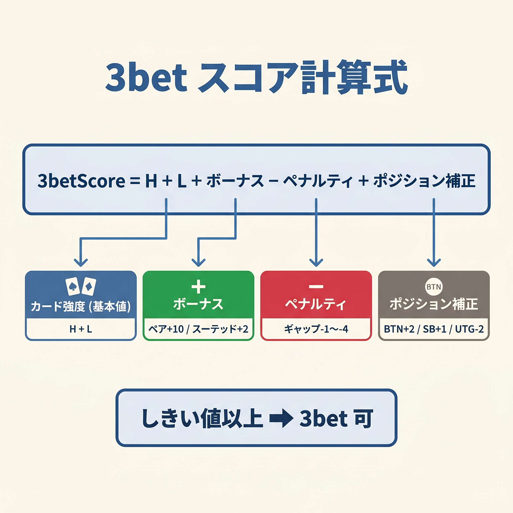
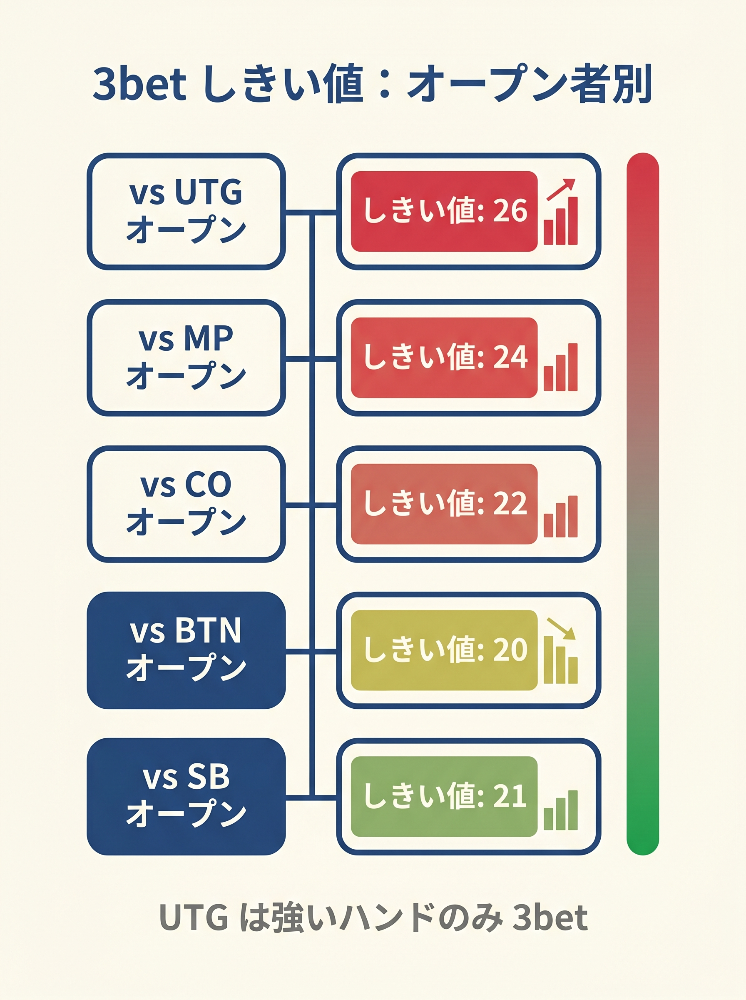
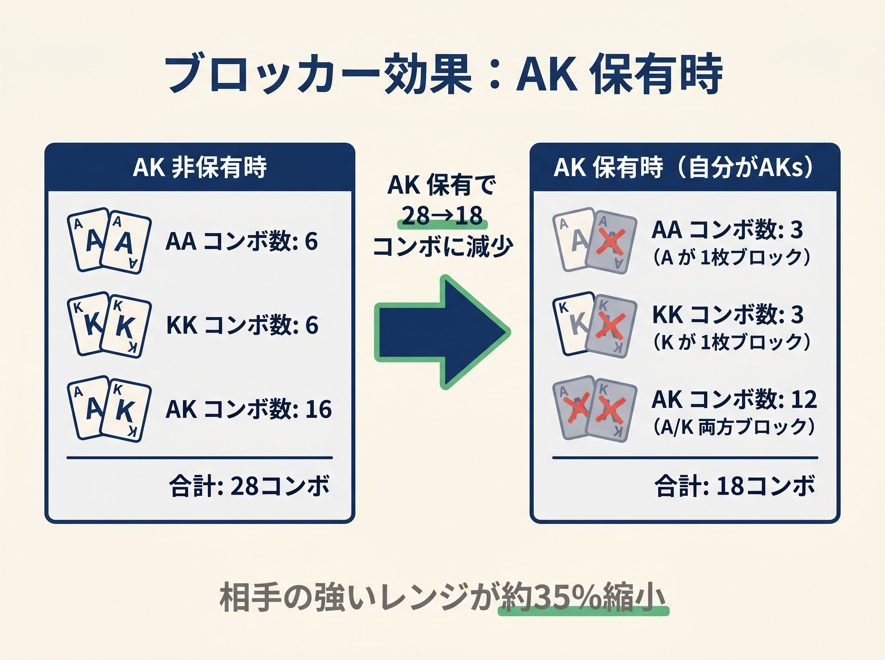

# 第12章　3ベット — プリフロップスコアによる二段判定

<!-- markdownlint-disable MD060 -->
<!-- textlint-disable preset-ja-technical-writing/no-exclamation-question-mark -->
<!-- textlint-disable preset-ja-technical-writing/no-mix-dearu-desumasu -->

> **本章の目標**: 対オープンに対する「3ベット / コール / フォールド」の判断を、第5章で導入した**プリフロップスコア**と **二段閾値表**で決定論的に下せるようになります。ブロッカー効果の活用と、コール閾値 T_call の存在意義（同じスコアでもポジションが違うとコールになる理由）を学びます。

対オープンには3つの選択肢がありました。**コール、フォールド、3ベット（リレイズ）**。これまでの章（第9〜11章）では主にコールとフォールドの判断を扱ってきました。本章からは、**攻撃側**のアクションである3ベットを取り上げます。

3ベットは、プリフロップで最もプレッシャーを与えられるアクションです。一発でポットが大きくなり、相手は高い精度で応じなければなりません。ただし、外せば大きく損失を被る諸刃の剣でもあります。

---

<figure><figcaption>プリフロップスコア式の構造と各コンポーネントの説明図（3-bet 判定への適用）</figcaption></figure>

<figure><figcaption>対UTG〜対SBオープン者別の3betしきい値ラダー（26 → 20）</figcaption></figure>

<figure><figcaption>AK保有時に相手のAA/KK/AKコンボが16→12に減少するブロッカー効果の視覚化</figcaption></figure>

## 12-1 3ベットの目的はバリューとブラフの2種類

### バリュー3ベット

QQ+、AKのような**強いハンド**で3ベットし、ポットを大きくして価値を取るプレイです。相手がAK、QQ、JJあたりでコールすれば、大きなポットで有利な勝負ができます。

### ブラフ3ベット

A5s、KTsのような**ブロッカー付きハンド**で3ベットし、相手を降ろすプレイです。

ブラフ3ベットの狙いは2つ。

1. **フォールドエクイティを取る**：相手が降りればそこで利益確定
2. **レンジバランスを維持する**：「この人の3ベットは強い手だけ」と読まれないための多様化

この**「バリュー + ブラフ」の組み合わせ**がGTO的な3ベット戦略です。ブラフを混ぜることで、相手はあなたの3ベットに対してタイトにフォールドできなくなります。

---

## 12-2 プリフロップスコアと二段閾値の全体像

### 第5章のプリフロップスコアを使う

3ベット判断には専用の式は要りません。第5章で導入した**プリフロップスコア**（H + L + ペア +10 + スーテッド +3 + コネクター + ブロッカー − ペナルティ）をそのまま使います。

```text
Score = H + L
      + ペアボーナス +10 (ペアのみ)
      + スーテッドボーナス +3
      + コネクター: 差1=+1 / 差2-3=+0.5
      + ブロッカー: A=+3 / K=+2 / AK 両方=+4
      − ペナルティ: 差4以上=−1 (A 含むと免除) / 両カード 9 未満=−1
```

このスコアはオープン判断（第7章）でも、これからの 3ベット判断・コール判断・4ベット判断（第16章）すべてで共通です。

### 二段閾値による 3 つの判断

3ベットの判断には**二段閾値**を使います。閾値が 1 つではなく 2 つあるのは、「3ベット不実行 = フォールド」とは限らないからです。

```text
Score ≥ T_3bet           → 3ベット
T_call ≤ Score < T_3bet  → コール
Score < T_call            → フォールド
```

- **T_3bet（3ベットしきい値）**: これを超えればプレッシャーをかける
- **T_call（コールしきい値）**: 3ベットには届かないが、ポジション優位を活かせる強さ

例: BTN で **KQo（Score = 28）** を持って UTG オープンを受けた場合、対UTG しきい値 T_3bet=32 には届かないので 3ベット不実行。しかし T_call=28 を満たしているので**コール**します。

### ブロッカーはプリフロップスコアに組み込み済み

3ベット判断に重要な「Aブロッカー +3」「Kブロッカー +2」「AK両方 +4」は、第5章のプリフロップスコアに**最初から組み込まれています**。3ベット用に別計算する必要はありません。

---

## 12-3 ブロッカーの威力

### 組み合わせ数で見る効果

ポーカーのハンドは「コンボ数」で数えられます。相手がどのハンドを持っているかの組み合わせが、ブロッカーで変わります。

| 自分の保有 | 相手のAA | 相手のAK | 相手のKK |
|-----------|---------|---------|---------|
| なし | 6通り | 16通り | 6通り |
| A 1枚 | **3通り**（半減） | 12通り（25%減） | 変化なし |
| K 1枚 | 変化なし | 12通り（25%減） | **3通り**（半減） |
| AK（A+K） | 3通り | **9通り**（44%減） | 3通り |

※ 自分がAKを持つと、残りデッキにAが3枚、Kが3枚。相手のAKコンボは3 × 3 = 9通りになります。16 → 9は約44%減。

Aを1枚持っているだけで、相手のAAが半分になります。これはブラフ3ベットを成功させるうえで大きなアドバンテージです。

### スコア式 B 項の根拠

本書のスコア式ではBを次のように設定しています。

| 条件 | B |
|------|---|
| A を含む | +3 |
| K を含む | +2 |
| A・K 両方 | +4（+5 にはしない） |

AのほうがKよりブロッカー効果が大きいので +3と +2に差をつけています。AKの両方を持つと +5ではなく +4なのは、「効果が重複するが完全には累積しない」ことを反映したものです。実際、AKoの場合はAAとKKを両方ブロックしますが、相手の4ベットレンジ全体への影響は +3+2=5相当ではなく、+4程度に収まります。

### プレイアビリティも大事

ただし、ブロッカー効果はあくまで**ボーナス要素**です。実際の研究では、「キャッシュゲームの3ベット成功にはブロッカーよりプレイアビリティ（フロップ以降のEV）のほうが3倍重要」と指摘されています。ブロッカーだけを見て突っ込むと、フロップ以降で処理できず事故を起こします。

---

## 12-4 ポジション別 二段閾値表

3ベットの「誰に対して」だけでなく「自分が誰か」もしきい値に影響します。BTN は CALL レンジが広く、CO/HJ/SB は CALL レンジがほとんどありません。

### BTN（CALL レンジ広い）

| 相手のポジ | T_3bet | T_call |
|---|---|---|
| 対 UTG | **32** | **28** |
| 対 HJ  | **32** | **27** |
| 対 CO  | 24 | 24 |

`T_3bet ≤ Score → 3ベット` / `T_call ≤ Score < T_3bet → CALL` / `Score < T_call → FOLD`

### CO・HJ（IP 3ベット中心、CALL レンジなし）

| 自分 \ 相手 | UTG | HJ |
|---|---|---|
| HJ | 28 | — |
| CO | 28 | 28 |

T_3bet = T_call なので**実質的に 3ベット or フォールド**の二択です。CO で UTG オープンに対して中堅ハンド（KQo, AJs など）を持っていても、コールはほぼせずフォールドが基本。

### SB（3ベット or フォールド）

| 対 UTG | 対 HJ | 対 CO | 対 BTN |
|---|---|---|---|
| 30 | 30 | 28 | 24 |

SB はポジション最弱なのでコールせず、3ベットでイニシアチブを取るか降りる方針。

### BB（wide defense）

BB は別表（第15章）で扱います。1bb 払い済のためポットオッズが好く、ワイドにコールできるのが特徴です。

### GTO頻度との対応

この閾値は GTO チャートとの整合検証で **約 92.7% の精度**でレンジを再現します。GTO の 3ベット頻度は次のとおり。

- BTN vs UTGオープン: 3ベット約 **7.5%** / コール約 **8.5%** / フォールド **84%**
- BTN vs COオープン: 3ベット約 **12%** / コール約 **6%** / フォールド **82%**

vs UTG で T_3bet=32 / T_call=28 の二段構造が、3ベット頻度 7.5% とコール頻度 8.5% を境界の 5 点差で再現しています。

---

## 12-5 代表ハンド5選（BTN vs UTG オープン）

すべてプリフロップスコアで計算します。BTN vs UTG の閾値は **T_3bet=32 / T_call=28**。

### 例1：AKo（Score = 32）

- H + L = 14 + 13 = 27
- ブロッカー（A・K 両方）: +4
- コネクター（差1）: +1

```text
14 + 13 + 4 + 1 = 32
```

T_3bet=32 をちょうど満たす。**3ベット**。AKs（Score=35）はもちろん 3ベット。

### 例2：KQo（Score = 28）— 本章の主役

- H + L = 13 + 12 = 25
- ブロッカー（K）: +2
- コネクター（差1）: +1

```text
13 + 12 + 2 + 1 = 28
```

T_3bet=32 には届かないので 3ベット不実行。だが T_call=28 を満たすので**コール**。

KQo は「強そうだがプレミアムではない」典型例。BTN なら **コールでフロップを見るのが GTO 整合**。CO や HJ なら T_call が無いので**フォールド**になります。同じハンドでもポジションで判断が変わるのが二段閾値の威力です。

### 例3：A5s（Score = 25）

- H + L = 14 + 5 = 19
- スーテッド: +3
- ブロッカー（A）: +3
- コネクター: なし（差9）
- ペナルティ: 差9 だが A 含むので免除

```text
14 + 5 + 3 + 3 = 25
```

T_call=28 にも届かない → **フォールド**（本式の判定）。ただし A5s は GTO で「BTN vs UTG では 3ベット 60% / コール 40%」のミックス戦略を採ります。本書の式では境界落ちですが、上級者は混合戦略の3ベットブラフコンボとして使えます（第13章【GTOとのズレ】）。

### 例4：QJo（Score = 24）

- H + L = 12 + 11 = 23
- コネクター（差1）: +1

```text
12 + 11 + 1 = 24
```

T_3bet=32 にも T_call=28 にも届かないので**フォールド**。BTN でもフォールド推奨。「強そうだが BTN でフォールド」は意外ですが、UTG オープンレンジ（QQ+/AK 中心）に対して QJo はドミネートされる側です。CO/HJ オープン（より広いレンジ）に対しては別判断（第14章 閾値補正）。

### 例5：76s（Score = 16）

- H + L = 7 + 6 = 13
- スーテッド: +3
- コネクター（差1）: +1
- ペナルティ（両方9未満）: −1

```text
7 + 6 + 3 + 1 − 1 = 16
```

どの閾値も満たさない。**フォールド**。ただし 76s は実戦の暗黙オッズが大きく、IP かつ深スタックなら GTO 上はコール候補（補助ルール: SC 暗黙オッズ）。本式では捉えきれない「ポストフロップでの強さ」のため、深スタック IP では別判断。

### プリフロップスコア早見一覧（BTN vs UTG）

```text
T_3bet=32 (3ベット):  AA(41) KK(38) QQ(34) JJ(32) AKs(35) AKo(32) AQs(32.5)
T_call=28 (コール):   TT(30) 99(28) AQo(29.5) AJs(31.5) ATs(30) KQs(31) KQo(28) KJs(29.5)
< 28 (フォールド):    残りすべて (88以下、A9o以下、KTo以下 等)
```

---

## 12-6 ポーラライズ vs リニア

### 2つのレンジ構成

3ベットレンジの作り方には、2つの方向性があります。

- **ポーラライズ**（二極化）：最強ハンド（QQ+、AK）とブラフ（Axs、KTs）だけで3ベット。中堅ハンドはコール
- **リニア**（連続）：最強から中堅までの連続した強いハンドで3ベット

### どう使い分けるか

- **対 UTG（相手が強い）**：ポーラライズが有効。中堅は降ろしにくいので、超強ハンドとブラフの組み合わせで対抗
- **対 BTN（相手が広い）**：リニア寄り。相手のレンジが広いので、中堅ハンドでもバリューになる
- **IP**：ポーラライズしやすい（ポジション優位でブラフを決められる）
- **OOP**：リニア気味（ブラフは降ろされにくいのでバリュー寄せ）

### 本書式はどちらを出すか

本書のプリフロップスコア＋二段閾値は、**対UTGでポーラライズ気味、対BTNでリニア気味**になるよう自動的に設計されています。BTN vs UTG では T_3bet=32（プレミアムのみ）と T_call=28（中堅でコール）の二段構造で、ポーラライズ的な「最強で3ベット、中堅でコール」が自然に出ます。一方、BTN vs CO では T_3bet=T_call=24 と単一閾値に近く、3ベットレンジが広がりリニア気味になります。

---

> **補足（第21章への接続）**: 本章の二段閾値判定は決定論的ですが、A5s/A4s/KTs のような境界付近のハンドは相手に頻度を読まれやすくなります。第21章の R1/R2（3バンド化・スート判定）で混合ゾーンを設け、R3（+R補正）で相手のオープンポジションに応じた閾値補正を加えることで、この問題を暗算の範囲内で改善できます。

## 【GTOとのズレ】ミックス戦略を決定論で近似している

### A5sの60-40ミックスを本書はどう扱うか

GTO WizardはA5sをBTN vs UTGのスポットで「**60%3ベット、40%コール**」と指示します。本書の式では、A5s のスコア 25 が T_call=28 に届かず**フォールドと判定**します。

ここで少しズレが出ます。

### ズレの影響は小さい

しかし、ミックス戦略の「レイズ側60%」を本書が逃しても、実戦での損失は軽微です。理由は2つ。

1. **A5sのフォールド（またはコール）戦略も弱くない**：GTO的にはコール/フォールドでも成立する選択肢
2. **3ベットブラフは境界ハンドが多く、誤差が分散する**：A5sだけでなくA4s、K9s、QTsなど複数が境界に並ぶため、個別ハンドの誤差は相殺される

### ブラフ3ベットを「全部やる or 全部やらない」問題

もしあなたが「A5sは3ベット候補」と覚えた場合、毎回3ベットすると**相手に頻度が読まれます**。本書のスコア式ではA5sはフォールド判定なので、そもそも3ベットしません。

結果として、本書の式に従う初心者は、**ブラフ3ベットを意識的に入れない**ことになります。これは短期的には損失（バリュー3ベットだけだと読まれやすい）ですが、初心者段階では問題ありません。3ベットブラフを始めるのは、バリュー3ベットで勝ち方を覚えた後です。

### 発展：自分でブラフを加えたいなら

本書を卒業し、ブラフ3ベットを戦略に加えたくなったら、次のルールで拡張できます。

> **対 UTG のとき、スコアが 22〜27 の範囲にあるスーテッドでブロッカー付き**（A5s=25、A4s=24、A3s=23、A2s=22 など）を、**ハンドの 50% で3ベット、50% でフォールド**に混ぜる。

この「スコア22〜27帯」（T_call=28 を下回る Ax スーテッド系）が、GTOでミックス戦略が効く境界帯と一致します。

### 3betレンジがポーラード型になる理由

GTOの3betレンジは「ポーラード型（二極化型）」になります。ポーラードレンジとは、AA/KK/AKといったナッツハンドとA5s/A4sといったブラフ的ハンドで構成し、JJ/TT/AQsなどの中間ハンドを除外する構成です。

なぜ中間ハンドを3betから外すのでしょうか。**リニアレンジ（中間ハンドを含む3bet）は相手にシンプルなコールで対応されやすいからです。**中間ハンドで3betすると、相手はプレミアムハンドとブラフの両方に対してタイトに動けるため、3betの脅威が薄れます。

一方、ポーラードレンジはナッツとブラフが混在するため、相手は「コールしたらナッツに捕まるかもしれない」という恐怖を持ち続けます。これがフォールドエクイティを高める設計です。

**「JJやTTがコールを混ぜるのはなぜか」** という疑問もここで解決します。JJ/TTは中間ハンドの典型で、ポーラード戦略の一部としてコールレンジに回される設計です。無理に3betして4betを返されると困るハンドを、コールレンジに置くことで安定した運用ができます。ただし相手のオープンポジションが広い（CO/BTN）場合は、JJ/TTもバリュー3betとして機能します。

<figure><figcaption>3ベット vs UTG（ポーラライズ型） — 赤がバリュー、オレンジがブロッカー付きブラフ、青がコール</figcaption></figure>

<figure><figcaption>3ベット vs BTN（リニア型） — vs UTGより広いバリュー範囲でオーバーオール3bet頻度が上がる</figcaption></figure>

---

## 章のまとめ

- 3ベット判断には専用のスコア式を作らず、第5章の**プリフロップスコア**をそのまま使う
- 判定は**二段閾値**: T_3bet 以上で 3ベット / T_call 以上で コール / それ未満で フォールド
- BTN は CALL レンジが広い（vs UTG: T_3bet=32, T_call=28）
- CO/HJ/SB は CALL レンジがほぼなく、実質 3ベット or フォールド
- BB は wide defense で別表（第15章）
- 主要例: AKo(32) → 3ベット、KQo(28) → BTN ならコール / それ以外フォールド、A5s(25) → フォールド（GTO ブラフコンボは上級者向け）
- ポーラライズは対UTG（T_3bet と T_call の差が大きい）、リニアは対BTN（T_3bet=T_call）で効果的
- 本書式はミックス戦略を決定論で近似しており、3ベットブラフコンボ（A2s-A5s 等）は捉えきれない
- 発展: 第13章【GTOとのズレ】で混合戦略の上級者向け解説

---

## ミニクイズ

### 問1

プリフロップスコアにおいて、AK 両方を含むハンドのブロッカーボーナスはいくつでしょうか。

1. +3
2. +4
3. +5

---

### 問2

AKs のプリフロップスコアを計算してください。

ヒント: H + L + スーテッド + コネクター + ブロッカー(AK両方)

---

### 問3

次のハンドを **BTN vs UTG オープン**でどう判断しますか（T_3bet=32, T_call=28）。

1. AKo（Score=32）
2. KQo（Score=28）
3. AJs（Score=31.5）
4. A5s（Score=25）

---

### 解答

- **問1**：2（+4。+3 と +2 を足した +5 ではなく、効果が完全には累積しないので +4）
- **問2**：14 + 13 + 3 + 1 + 4 = **35**（プレミアム、全ポジション 3ベット）
- **問3**:
  1. AKo（32）→ T_3bet=32 を満たす → **3ベット**
  2. KQo（28）→ T_call=28 を満たす → **コール**（同じ BTN でも CO/HJ なら T_call なしでフォールド）
  3. AJs（31.5）→ T_3bet=32 にわずかに届かず、T_call=28 を満たす → **コール**
  4. A5s（25）→ T_call=28 に届かない → **フォールド**（ただし GTO はブラフ 3ベット混合）

---

## 出典

- Upswing Poker『3-Bet Preflop Strategy & Range Charts』（2024）
- Upswing Poker『Polarized Ranges vs Linear (Merged) Ranges Explained』（2024）
- SplitSuit Poker『Understanding 3-Bet Ranges In 2026』
- SplitSuit Poker『Poker Combos & Blockers 101 In 2026』
- GTO Wizard『A Beginner's Guide to Poker Combinatorics』
- GTO Wizard『PKO Versus Classic: Responding to 3-Bets』
- GTO Wizard『Preflop Range Morphology』
- Pokercode『Understand How to Use Blockers the Right Way』
- Poker.Pro『Constructing 3-Bet And vs. 3-Bet Ranges』
- Betting Data Lab『Poker 3Bet Range Strategy for Cash Games』
- 888 Poker『Big Blind 3betting vs IP Opponents』
