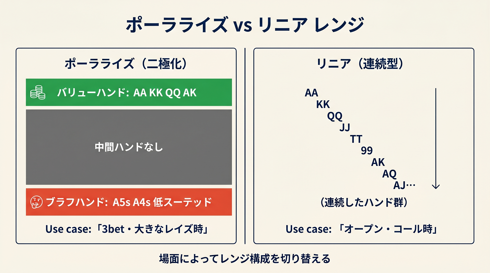
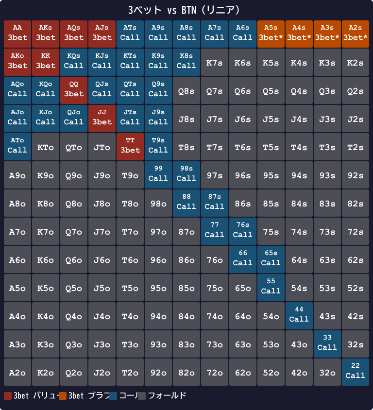

# 第13章　この式がGTOと外れるところ：3bet編

<!-- markdownlint-disable MD060 -->
<!-- textlint-disable preset-ja-technical-writing/no-mix-dearu-desumasu -->

> **本章の目標**: 第III部（第9〜12章）で構築した対オープン戦略の中でも、特に3ベットスコア式がGTOと系統的にズレるポイントを総まとめします。第8章（オープン編のGTOとのズレ）の3ベット版です。

本章は第III部の締めくくりです。第8章でオープンレイズ側のGTOとの乖離を整理したように、**対オープンのアクション、特に3ベット**における乖離を体系化します。

第12章の3betスコア式は、ブロッカーボーナスまで組み込んだ本書で最も複雑な式でした。それでもGTOとはズレます。どこで、どのくらいズレるのか。そしてなぜそれでも使い続けるのか、という問いに答えます。

---

<figure><figcaption>ポーラライズレンジ（バリュー+ブラフ二極化）とリニアレンジ（連続型）の対比図</figcaption></figure>

<figure><figcaption>ポーラライズ型（vs UTG） — 最強ハンドとブロッカーブラフのみ3ベット、中堅はコール</figcaption></figure>

<figure><figcaption>リニア型（vs BTN） — 中堅ハンドもバリュー3ベット対象に入り、全体的に広いレンジ</figcaption></figure>

## 13-1 ポーラライズとリニアの切り替えを本書は扱わない

### GTOは状況で使い分ける

第12章でも触れた通り、GTOは3ベットレンジを**ポーラライズ（二極化）**と**リニア（連続）**で使い分けます。

- **対 UTG（IP、相手がタイト）**：ポーラライズ。超強ハンド（AA〜QQ、AKs）＋ ブロッカーブラフ（A5s、A4s）
- **SB vs BTN（OOP、相手がワイド）**：リニア。88+、AJo+、ATs+、KQs、KJs、QJs

### 本書の式は切り替えない

本書のスコア式は、相手ポジションでしきい値を変えるだけです（対UTG 23、対BTN 18）。「ポーラライズ構造を作る」「リニア構造を作る」という使い分けはしません。

結果として、次のようなズレが生まれます。

- **対 UTG で中堅スーテッド（QJs、JTs）の3ベット判定が境界**：ポーラライズ戦略では通常これらはコール推奨で、本書が境界で3ベットにすると読み取られやすい
- **SB vs BTN で A4s を開きすぎる**：SBはリニアレンジで対応、A4sはブラフとしては過剰

### この程度の誤差は受容範囲

これらのズレによるEV損失は、**1ハンドあたり 0.02〜0.08 bb** 程度です。第8章でも触れた通り、境界での小さな誤差よりも、**3ベット自体を正しく打つこと**のほうが実戦では重要です。

---

## 13-2 バリュー/ブラフ比が本書では不足する

### 理論的な最適比率

GTOの均衡を保つためのバリュー/ブラフ比は、ポットサイズベットなら **バリュー 2 : ブラフ 1**（ブラフ33%）とされます。3ベットでも近い比率が求められます。

### 本書式はバリュー重視

本書の3betスコア式は、スコアがしきい値を超えたらすべて3ベットという決定論です。スコアが高いハンド（AA、KK、QQ、AKなど）がまず対象に入り、**ブロッカー付きの低スコアハンド（A5s、A4s など）は境界に並ぶ**構造です。

問題は、境界でのコール判定が多いため、**ブラフ3ベットが系統的に不足**することです。結果として、あなたの3ベットは「強い手だけ」と相手に読まれやすくなります。

### 低ステークスでは致命的ではない

この問題は、相手が精密に頻度を読む高ステークスでは致命的です。しかし低〜中ステークスでは、そもそも相手も頻度を読んでいないため、**バリュー寄りの3ベットでも十分に機能**します。

本書を卒業してブラフ3ベットを加えたくなったら、第12章末で紹介した「スコア20〜22帯のスーテッドブロッカーを50% で混ぜる」拡張ルールを使ってください。

---

## 13-3 IP と OOP の3ベット頻度差

### GTOの実測頻度

GTOソルバーによる3ベット頻度は、ポジションで大きく変わります。

- **SB vs BTN（OOPの典型）**：3ベット頻度 **約 14〜18%**
- **BTN vs HJ（IPの典型）**：3ベット頻度 **約 9〜12%**

OOPのほうが**むしろ高い頻度**で3ベットします。これは直感と反しますが、OOPではコールレンジが弱くなりすぎないよう、3ベットを多めにする必要があるためです。

### 本書の扱い

本書のしきい値は「相手のポジション」で決まっており、「自分のポジション」は直接反映されません。結果として：

- SB vs BTNで3ベット頻度がGTOより少ない（SBは特に3ベット多めが正解）
- BTN vs BBで3ベット頻度がGTOより多い（IPのポーラライズはやや絞る方が正解）

この対処として、本書では第15章でSB・BBの特殊性を別章で扱う予定です。SBからの3ベットは「基本3ベットorフォールド」という別ルールで補います。

---

## 13-4 スーテッドの4ベット耐性

### A5s の驚きのエクイティ

A5sがブラフ3ベットに選ばれる理由のもう1つは、**4ベット耐性の高さ**です。

相手の4ベットレンジ（AA、KK、QQ、AK）に対するA5sのエクイティは **約 31%**。比較すると：

- A5o：約26%
- 98o：約27%
- KJo：約28%（ただしドミネーションリスク）

A5sは、4ベットされてコールした場合でも、**フラッシュとホイールストレート**で一発逆転の芽があります。これがGTOでA5sを積極的に3ベットブラフに使う理由です。

### 本書式は31%を反映しきれない

本書の3betスコア式は、A5sを境界に置いています（スコア21.5）。対COしきい値19や対BTNしきい値18は超えますが、対UTGしきい値23には届きません。

GTOではA5sを対UTG 3ベットに**約 70% の頻度**で採用しますが、本書式ではコール判定です。この差は、ブラフ3ベットの不足として前述の問題に直結します。

---

## 13-5 本書が外れるハンド一覧

### 過小評価（本書はコール or フォールドだが、GTO は3ベット）

| ハンド | 本書判定 | GTO推奨 | 理由 |
|--------|---------|---------|------|
| A2s〜A5s | 対UTGでコール | 対UTGで3ベット混合 | ブロッカー＋4ベット耐性 |
| K5s〜K8s | 対UTGでフォールド気味 | 対UTGで3ベット混合 | キングブロッカー |

### 過大評価（本書は3ベットだが、GTO はコール）

| ハンド | 本書判定 | GTO推奨 | 理由 |
|--------|---------|---------|------|
| QJs、JTs（対UTG境界） | 3ベット境界 | コール中心 | ポーラライズ戦略では中堅スーテッドはフラット |
| A9s（対MP） | 3ベット境界 | コール寄り | 中堅価値でバリュー取りづらい |

なお、JJ・TTは3betスコア式で計算すると16.5〜17程度になり、本書でも自動的にコール判定（対UTGしきい値23未満）になります。GTOの「対UTGではJJ・TTはコール中心」と一致しており、**本書の過大評価ではありません**。

### 乖離の総EV影響

これらすべてを合わせても、総EV損失は **1時間あたり 3〜8 bb** 程度です（標準的なプレイペースを想定）。この数字は、相手が1〜2個のミスをするだけで吸収できる範囲です。

---

## 13-6 低ステークスでは式の精度より頻度のほうが重要

### BlackRain79の指摘

ポーカーコーチのBlackRain79は「マイクロステークスでGTOを厳密に遵守することは利益を損なう」と述べています。低レートの相手は、そもそも3ベットへの対応が粗いためです。

- マイクロ〜ローステークスの3ベット対応フォールド率：**約 65〜70%**
- GTO均衡での対応フォールド率：約55%

この10〜15%の超過フォールドは、**「3ベットした時点で約3分の2のポットが取れる」**ことを意味します。ブロッカーの精密な選別より、**3ベットすること自体**が利益を生みます。

### 実戦的な示唆

低ステークスでは、本書の「境界で3ベット」判定を**むしろ緩めて**、スコア19〜21帯のブロッカー付きハンド（A4s、A5s、K9sなど）を積極的に3ベットするほうがEVが高まります。

ただし、これはエクスプロイト戦略（相手の傾向を利用する戦略）であり、GTO均衡からの逸脱です。本書の式を守って3ベットを打つか、エクスプロイトで広げるかは、相手次第で選んでください。

---

## 13-7 なぜ本書の3ベットスコア式でも勝てるのか

### 簡易化は正当な設計選択

GTO Wizardは次のように述べています。

> 「Simplified Solutions（簡易化戦略）は、複雑な戦略を雑に実装するより常に優れる」

Matthew Jandaも2013年の著書で「**目標は完璧なバランスではなく、ブラフすべきスポット・バリューすべきスポットを認識する直感**」と述べています。

### 3ベットを「打つこと」が第一歩

初心者にとって、3ベットは怖いアクションです。「3ベットをやってみる」という行為自体が最初のハードルです。本書の3betスコア式は、**3ベット対象のハンドを明確に示すことで、そのハードルを下げる**ことに主眼を置いています。

完璧なGTO頻度は、本書を卒業してから学べば十分です。まずは「スコア式に従って3ベットを打つ」習慣を作ることが、初心者の最大のEV改善につながります。

---

> **補足（第21章への接続）**: 本章で解説したポーラライズとリニアの使い分けは、第21章のR3（+R補正）で近似できます。対UTG（R=+2）ではバリューハンドの基準が実質的に上がりポーラライズ寄りになり、対BTN（R=−2）では中堅ハンドも3ベット候補に入りリニア寄りに近づきます。

## 【GTOとのズレ】発展：ブラフ3ベットを自分で加える方法

### レベル1：決定論（初心者）

本書のスコア式通りに、スコアがしきい値を超えたら3ベット、それ以外はコールまたはフォールド。

### レベル2：スコア 20〜22帯の混合（中級者）

対UTG 3ベットに、スコア20〜22帯のスーテッドブロッカー（A5s、A4s、K9s、QTs）を **50%の頻度で**混ぜる。スマホの秒針やランダム時計で判定する。

### レベル3：ポーラライズ構造（上級者）

対UTGにはAA〜QQ、AKの **バリューハンド** とA5s、A4sの **ブラフハンド** のみで3ベットし、中堅ハンド（JJ、TT、99、AJ、KQs）はすべてコールに回す。

### レベル4：GTO Wizard でソルバー確認（準プロ）

個別ポジションの頻度をGTO Wizardで確認し、自分のプレイを照らし合わせる。**本書を卒業した後の学習ルート**です。詳細は第20章で紹介します。

---

## 章のまとめ

- 本書の3ベットスコア式は、ポーラライズとリニアの切り替えをしない
- バリュー/ブラフ比が本書ではバリュー寄りに偏る傾向がある
- SB vs BTNはOOPなのに3ベット頻度が高い（14〜18%）、本書はこれを反映しにくい
- A5sは4ベットレンジへのエクイティ31%と高く、GTOはブラフ3ベットに70%採用
- 本書の過小評価：A2s〜A5s、K5s〜K8s（ブロッカー未反映）
- 本書の過大評価：対UTGのQJs、JTs境界（ポーラライズ戦略ではコール中心）
- 低ステークスではむしろ3ベット頻度を上げる方がEVが高い
- 「3ベットすること自体」が初心者の第一歩、精度は後から学べばよい
- 発展：スコア20〜22帯の混合で、ブラフ3ベットを段階的に取り込む

---

## ミニクイズ

### 問1

GTOが3ベットレンジをポーラライズにするのはどの状況でしょうか。

1. 相手が広いレンジ（BTN）をオープンしたとき
2. 相手が狭いレンジ（UTG）をオープンしたとき
3. 常にポーラライズが最適

---

### 問2

A5sが3ベットブラフ候補として優れている理由のうち、本章で挙げられたものはどれでしょうか（複数回答）。

1. Aブロッカー効果で相手のAA・AKを減らす
2. 4ベットされてもコール時にエクイティ約31%
3. ナッツフラッシュとホイールストレートの一発逆転がある

---

### 問3

低ステークスで「GTOより広く3ベット」が成立する理由として、最も適切なのはどれでしょうか。

1. 低ステークスの相手は3ベット対応のフォールド率がGTO均衡より高いから
2. 低ステークスはアンテがないから
3. 低ステークスはスタックが浅いから

---

### 解答

- **問1**：2（相手が狭いレンジのときポーラライズが有効）
- **問2**：1、2、3（すべて正解）
- **問3**：1（相手のフォールド率超過がブラフ成功率を高める）

---

## 出典

- Upswing Poker『3-Bet Preflop Strategy』（2024）
- Upswing Poker『Polarized vs Linear Ranges Explained』（2024）
- SplitSuit Poker『Understanding 3-Bet Ranges In 2026』
- GTO Wizard『Simplified Solutions and a New Interface』（2023）
- GTO Wizard『Mixed Strategies in Poker』（2024）
- BlackRain79『Why GTO is a Mistake for Micro Stakes』
- Matthew Janda『Applications of No-Limit Hold'em』（2013）
- Betting Data Lab『Poker 3Bet Range Strategy for Cash Games』
