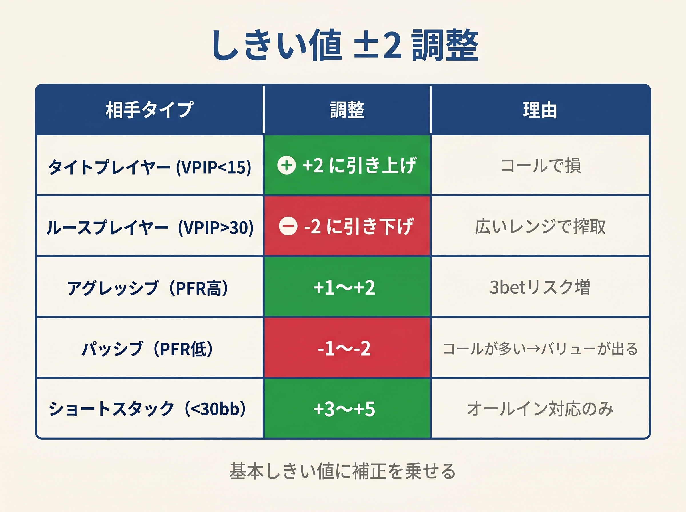

# 第14章　相手タイプとスタック深度で閾値を動かす

<!-- markdownlint-disable MD060 -->

> **本章の目標**: 固定されたしきい値を「現場に合わせて動かす」技術を学びます。相手のタイプ（タイト / ルース）とスタック深度で、本書の式を柔軟に調整できるようになります。

ここまでの章で、本書のしきい値は固定でした。UTGは23、BTNは18、SBは22——いつでも同じです。しかし実戦では、相手や状況によってこの数字を**動かす**べき場面があります。

本章では、**2つの調整軸**を導入します。

1. **相手のタイプ**：タイトかルースか
2. **スタック深度**：ディープ（150BB+）かショート（40BB以下）か

これらを組み合わせることで、本書の式を**動的に**運用できるようになります。

---

<figure><figcaption>相手タイプ別のしきい値±2調整テーブル（タイト/ルース/アグレッシブ/パッシブ/ショート）</figcaption></figure>

## 14-1 相手のタイプを見極める

### VPIP / PFR を使う

第1章で紹介した **VPIP**（Voluntarily Put In Pot）と **PFR**（Preflop Raise）は、相手のタイプを瞬時に把握する道具です。

- **VPIP**：ハンドを自発的にプレイした割合（ブラインド強制投入以外）
- **PFR**：プリフロップでレイズした割合

### プレイヤータイプ分類表

| VPIP | PFR | タイプ | 特徴 |
|------|-----|-------|------|
| 10〜14% | 8〜12% | **極タイト（ロック）** | 参加が少なすぎる。勝ち組のフルリング |
| 15〜24% | 13〜20% | **タイト・アグレッシブ（TAG）** | 標準的な勝ち組 |
| 25〜35% | 20〜28% | **ルース・アグレッシブ（LAG）** | 攻撃的で上手い人 |
| 30〜45% | 5〜15% | **ルース・パッシブ** | コーラー、カモ候補 |
| 45%+ | 5%未満 | **極ルース・パッシブ** | 最大のカモ |

VPIPとPFRの差が大きい（例：VPIP 40、PFR 8）ほど、相手は「コーラー」つまり弱い相手です。

### ソフトウェアがないときの見極め

オンラインでHUDを使っていない場合や、ライブでは、20〜30ハンド観察すれば相手のタイプは見えてきます。

- **参加率が高い**（10ハンドに4回以上参加）→ ルース
- **レイズが多い**（参加時ほぼ常にレイズ）→ アグレッシブ
- **毎回コールで参加**（レイズしない）→ パッシブ

---

## 14-2 しきい値の調整ルール

### タイト相手：しきい値 +2

VPIPが20%を下回るタイト相手に対しては、**しきい値を +2 する**のが基本です。

**理由**：タイト相手は参加する時に強いハンドを持つ確率が高い。したがって、自分の参加基準も厳しくする必要があります。

例：タイト相手がMPからオープン → 自分のCO（通常しきい値20）を **22 に上げる**。

### ルース相手：しきい値 −2

VPIPが30%を超えるルース相手に対しては、**しきい値を −2 する**。

**理由**：ルース相手は弱いハンドで参加するため、こちらのバリュー取得EVが増します。マージナルハンドでの参加も黒字化しやすくなります。

例：ルース相手がMPからオープン → 自分のCOを **18 に下げる**。

### スチール機会の逆説

興味深いことに、**タイト相手はブラインドを簡単に手放します**。したがって、ブラインドスチール（BTNやCOからの単純なスチールレイズ）の成功率が上がります。

実際には2つの対応が同時に必要です。

1. **対オープン（相手が動いた後）**：タイト相手にはしきい値を +2（慎重に）
2. **スチール（相手が反応する前）**：タイト相手にはしきい値を −1程度（積極に）

少しややこしいので、まずは「対オープンでの調整」だけを覚えてください。

---

## 14-3 コーラーへの特別対応

VPIPは高いがPFRが極端に低い「コーラー」（VPIP 35%、PFR 8% など）は、別の扱いが必要です。

### ブラフ禁止、バリュー最大化

コーラーは降りないのが基本です。そのため：。

- **ブラフ3ベットは不適**：相手がフォールドしないため機能しない
- **バリュー3ベットは最大限に**：コーラーがコールして大きなポットになる
- **スーテッドコネクターは価値↑**：マルチウェイでナッツを作りやすい

### 具体的な調整

- VPIP 35%+ PFR 10%未満のコーラーがオープンに参加している → **3ベットレンジをバリューのみに絞る**（ブロッカーブラフ系A5s、A4sは降ろす）
- 同じ相手にスーテッドコネクター（65s、87s）でコールする価値が高まる（実現できれば強い）

---

## 14-4 スタック深度による調整

### ディープスタック（150BB 以上）

**調整**：スーテッド（S）とコネクター（C）のボーナスを **+1** 上乗せ。

**理由**：SPR（Stack-to-Pot Ratio）が高くなると、セットやナッツフラッシュが入ったときに相手のスタックを全部取れる期待値が上がります。ドロー系のハンドが「化ける」機会が増えるのです。

**具体例**：

- 65sの通常スコア = 13（フォールド判定）
- ディープ時：S+1（通常 +2 →+3）、C+1（通常 +1 →+2）→ **15**
- これでもBTNしきい値18には届かないが、境界ハンドは参加寄りになります

より実戦的な運用：ディープスタックでは「BTNなら22+ をすべてオープン」「COなら55+ オープン」など、小ペアとスーテッドコネクターの採用ラインを下げます。

### ショートスタック（40BB 以下）

**調整**：

- S（スーテッド）ボーナスを **無視**
- C（コネクター）ボーナスを **無視**
- B（ブロッカー）を **+1 上乗せ**

**理由**：SPRが4以下になると、ドロー系ハンドのインプライドオッズが消失します。プリフロップでの決着（オールイン）が増えるため、**ブロッカー効果が最重要**になります。

**具体例**：

- A5sのショートスタック3ベット
  - 通常：14 + 2.5 + 3 + 2 = 21.5（スーテッド + ブロッカー）
  - ショート調整：14 + 2.5 + 4（ブロッカー +1）= **20.5**
- スーテッドを無視、ブロッカーを重視する運用です

---

## 14-5 スタック深度別戦略の全体像

### ディープ（150BB+）

- 小ペア、スーテッドコネクターの価値が最大化
- オフスーツブロードウェイ（AJo、KQo）の価値は相対的に下がる
- **「ポストフロップ能力が最も問われる深度」**
- 本書の式 + ディープ補正で十分対応可能だが、最も差がつく帯

### 標準（80〜120BB）

- 本書のしきい値をそのまま使う
- 最もバランスの取れた深度で、本書のターゲット

### ミドルスタック（40〜80BB）

- セットマイニングが弱まる（コール額の15倍が成立しづらくなる）
- ミドルペア（88、77）のオープンが少し絞られる
- 本書のしきい値でほぼ対応可能

### ショート（20〜40BB）

- プッシュ・フォールド領域に入り始める
- ドロー系ハンドが機能しない
- A-Xoハンドの価値が上がる（4ベットオールイン候補として）
- 第16章で扱う

### 激ショート（20BB以下）

- **本書の範囲外**。Push/Fold とトーナメント特有の ICM は巻⑥で扱う

---

## 14-6 GTOとエクスプロイトのバランス

### GTO戦略とは何か

**GTO**（Game Theoretic Optimal）は、相手がどんな戦略を取ってきても搾取されない戦略です。相手が精密な場合、これが最適です。

### エクスプロイト戦略とは

**エクスプロイト戦略**は、相手の特定の傾向を利用して利益を最大化する戦略です。例：。

- 相手がブラフ頻度が低い → 自分もブラフを減らす（バリュー取得に集中）
- 相手が3ベットに対してタイトにフォールド → 自分の3ベット頻度を上げる

### 使い分けの原則

- **GTO相手（精密な上級者）**：本書のしきい値をそのまま
- **TAG相手（普通の勝ち組）**：本書のしきい値をそのまま + 微調整
- **ルース・パッシブ（コーラー）**：フルエクスプロイト（バリュー最大化）
- **極ルース・アグレッシブ（マニアック）**：しきい値を少し上げてバリューで対応

GTO Wizardの分析では、「相手の不均衡が大きいほど、自分のレンジバランスを崩してもEVは上がる」ことが定量的に示されています。明らかなカモには、GTOを捨ててエクスプロイトに全振りするのが合理的です。

---

> **補足（第21章への接続）**: 本章の±2調整は相手タイプとスタック深度の2軸による粗い近似ですが、第21章のR6（MDF±10%）と組み合わせると、相手のプレイスタイルに応じたディフェンス頻度も同じ枠組みで扱えるようになります。

## 【GTOとのズレ】本書のしきい値調整は連続値ではない

### 実際のGTOは連続的に最適化

GTOソルバーは、相手のレンジとスタック深度を連続値として受け取り、**精密な最適解**を出します。本書の「+2 or −2」は、これを大雑把に近似したものです。

### 2軸の近似で十分な理由

実戦で最も影響が大きいのは、**相手のタイプ**（VPIPを1軸で見る）と**スタック深度**（3段階で見る）です。本書は2軸の粗い調整で、総合EVの大半を捕捉します。

残る微細な差（ハンドごとの頻度調整、ボード別の戦略変化）は、本書を卒業した後の学習ルートで習得します。

### 調整しすぎの罠

初心者がやりがちな失敗は、**過剰な調整**です。

- 「相手がちょっとルースだからしきい値−5」
- 「AAが2回続けてAKに負けたから、AKを格下げ」

調整は **±2 まで**が本書の推奨です。それ以上の調整は、本書のスコア式で扱える精度を超えており、ミスを招きます。

---

## 章のまとめ

- しきい値は相手のタイプとスタック深度で動的に調整できる
- VPIP / PFRでタイプを分類：TAG、LAG、コーラー、マニアック
- タイト相手：しきい値 +2（自分も絞る）
- ルース相手：しきい値 −2（マージナルまで拾う）
- コーラー相手：ブラフ禁止、バリュー最大化
- ディープ（150BB+）：S・Cボーナスに +1上乗せ
- ショート（≤40BB）：S/C無視、Bに +1上乗せ
- GTO相手にはそのまま、明らかなカモにはフルエクスプロイト
- 調整は ±2まで、過剰な調整はミスを招く

---

## ミニクイズ

### 問1

VPIP 35%、PFR 8% の相手はどのタイプでしょうか。

1. TAG（タイト・アグレッシブ）
2. LAG（ルース・アグレッシブ）
3. ルース・パッシブ（コーラー）

---

### 問2

ディープスタック（150BB+）でのしきい値調整として、本章で挙げられたものはどれでしょうか。

1. しきい値を全体的に +2する
2. スーテッド・コネクターのボーナスに +1上乗せ
3. ブロッカーのボーナスに +1上乗せ

---

### 問3

コーラー相手に対する3ベット戦略として、本章で推奨されたものはどれでしょうか。

1. ブラフ3ベットを増やす
2. バリュー3ベットのみに絞る
3. 3ベットを完全にやめる

---

### 解答

- **問1**：3（VPIPが高くPFRが低いのでコーラー）
- **問2**：2（スーテッドとコネクターが化けやすいため）
- **問3**：2（コーラーは降りないのでバリューに徹する）

---

## 出典

- PokerTracker『VPIP and PFR Guide』
- GTO Wizard『GTO vs Exploitative Play』
- Upswing Poker『How to Adjust to Player Types』
- BlackRain79『Reading Opponents Guide』
- GTO Wizard『How Stack Sizes Change Your Range』（2024）
- Upswing Poker『Effective Stack Size and Poker Strategy』
