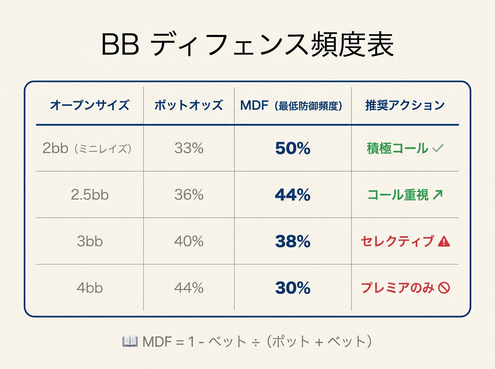
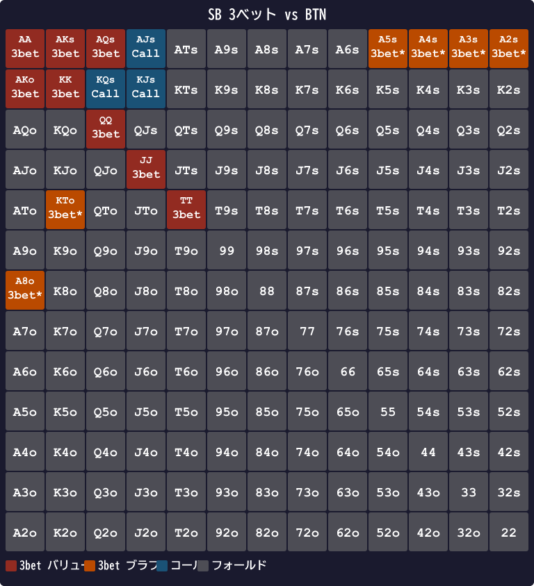

# 第15章　SBとBBの特殊性

<!-- markdownlint-disable MD060 -->

> **本章の目標**: ブラインドの2席、SB（スモールブラインド）と BB（ビッグブラインド）の特殊な戦略を扱います。「SBは3ベットかフォールド」「BBは広くディフェンス」という基本ルールの背景を理解します。

SBとBBは、本書のほかのポジションと構造が違います。**強制的にチップを投入している**という、ほかにない特徴を持つ席です。この特徴が、戦略の根本を変えます。

本章では、SBとBBの戦略を独立に扱い、両者で**逆方向に動く**理由を明確にします。

---

<figure><figcaption>SBとBBのプリフロップ判断ツリー（オープン・3bet・コール・フォールドの分岐）</figcaption></figure>

<figure><figcaption>オープンサイズ別BBのポットオッズとMDFライン早見表</figcaption></figure>

## 15-1 SB戦略：3ベットかフォールドが基本

### 3つの構造的理由

SBがコールより「3ベットかフォールド」を選ぶ理由は、3つの構造的問題にあります。

#### 理由1：BBからのスクイーズリスク

SBがコールすると、BBは自分のハンドを安く見られる立場で攻撃を仕掛けやすくなります。BBが **3ベット（スクイーズ）**で返してきたら、SBはOOPで対応しなければなりません。

- SBがコール → BBが3ベット → SBはコールするか降ろす
- どちらを選んでも、SBはOOPで不利を背負う

「**コールは罠**」と言われる所以です。

#### 理由2：エクイティ実現率が最悪クラス

第10章で触れた通り、SBの実現率は **35〜60%** と極端に低い値です。生エクイティが45% あっても、実戦では35% しか取り切れないケースもあります。

3ベットすれば、主導権を握れます。相手のオープンレンジ全体をフォールドに追い込むか、狭いレンジとのヘッズアップに持ち込むことで、実現率の低さを補います。

#### 理由3：キャップされたレンジ問題

SBがコールすると、相手からは「3ベットしなかった＝強い手ではない」と読まれます。これが**キャップされたレンジ**問題で、ポストフロップで攻撃を受けやすくなります。

### スクイーズ圧力の定量化

3つの理由のうち、「スクイーズリスク（理由1）」が最も強力です。数字で示します。

SBがBTN 2.5bb オープンにコールした場面を考えます。

```text
BTN レイズ 2.5bb → SB コール 2.5bb → BB がスクイーズ可能
```

GTOBase のデータによると、SB cold-call 後に BB がスクイーズする頻度は **約 20〜25%** です。これが意味することを計算してみましょう。

- SB が投入したコール額：2.5 bb
- BB スクイーズ発生確率：22%（中間値）
- スクイーズされた場合の SB の期待損失：2.5 bb（フォールド一択の場面が多い）

コールを 100 回行ったとして：22 回はスクイーズで 2.5 bb を失います。残り 78 回はフロップへ進みますが、OOP の実現率低下（35〜60%）が効いてきます。

**結論：「コールした回数 × 0.55 bb」がスクイーズタックスとして取られる計算**になります。3ベットすればこのタックスがゼロになるため、同等の手牌なら3ベットの方がEVが高くなります。

### GTO推奨頻度

SBがBTN 2.5bbオープンに直面したときの実用 GTO（poker-coaching 6-max GTO チャート）推奨頻度は次の通りです。

| アクション | 頻度 |
|----------|------|
| フォールド | 約 **85%** |
| コールド・コール | **0%**（実用 GTO は採らない） |
| 3ベット | 約 **15%** |

つまり、**SB は対 BTN オープンに対して「3ベットかフォールド」のみ**で運用します。コールド・コールは実用 GTO チャートでは採用されません（理論上の混合戦略では一部混ざる可能性はあるが、実装可能形では 0%）。

### vs BTN の SB 3ベットレンジ

具体的な3ベットハンドは次のようになります。

- **バリュー**：TT+、AQs+、AKo
- **準バリュー**：AJs、ATs、A9o
- **ブラフ（ブロッカー付き）**：A8o、A5s、KTo、Q9s、J8s

BTNのオープンレンジが約43% と広いため、SBはほぼすべてのコール候補を3ベットに転換する「リニア（マージド）」構成になります。

---

## 15-2 BB戦略：広くディフェンスする

### BBが広くディフェンスできる2つの理由

#### 理由1：1BB 投入済みのポットオッズ

BBは強制的に1BB投入しています。BTNが2.5bbオープンしてきたとき：

- 追加コール額 = 2.5 − 1 = 1.5 bb
- 最終ポット = 5.5 bb
- 必要勝率 = 1.5 / 5.5 ≈ **27%**

SBより低い必要勝率で呼べます。**構造的に有利な立場**です。

#### 理由2：最後のアクション権

BBはプリフロップで最後に動ける席です。SBのアクションを見てから判断できます。SBがフォールドしていれば、BTNとBBのヘッズアップ。状況判断が完全にできる場面が多いのです。

### BB defense 専用スコア (Score_BB)

BB はほかのポジションと違って、**スーテッドとコネクターを高く評価**します。1bb 払い済のポットオッズで、暗黙オッズ込みのコールが成り立つからです。

```text
Score_BB = H + L
         + ペアボーナス +10
         + スーテッドボーナス +6   ← 通常 +3 → +6 (倍)
         + コネクター: 差1=+4 / 差2-3=+2  ← 通常 +1/+0.5 → 4倍
         + ブロッカー: A=+3 / K=+2 / AK=+4  (通常と同じ)
         − ペナルティ:
             差4以上 (A 含むと免除) −1  (通常と同じ)
             両カード 9 未満 (offsuit のみ) −2  (suited 免除)
```

スーテッドコネクター 76s の Score を比較すると:

| ハンド | 通常 Score | Score_BB | 計算 |
|---|---|---|---|
| 76s | 16 | **23** | 7+6+6 (s)+4 (差1)−0 (suited 9未満免除) |
| 32s | 8 | **15** | 3+2+6+4−0 (suited 免除) |
| K2s | 19 | **22** | 13+2+6+0 (差11、conn なし)+2 (K)−1 (差≥4) |
| AKs | 35 | **41** | 14+13+6 (s)+4 (差1)+4 (AK) |
| AKo | 32 | **35** | 14+13+0+4 (差1)+4 (AK) |
| KQo | 28 | **31** | 13+12+0+4 (差1)+2 (K) |
| AQs | 32.5 | **37** | 14+12+6+2 (差2)+3 (A) |
| QQ | 34 | 34 | ペア（係数変化なし） |
| JJ | 32 | 32 | ペア（係数変化なし） |
| 99 | 28 | 28 | ペア（係数変化なし） |

### BB defense フロー (4 ステップ)

```text
Step 1: Score_BB ≥ T_3bet（相手ポジションで変わる→下表参照）→ 3-bet
Step 2: ペアハンド (22-AA)                       → CALL  ★例外
Step 3: スーテッドで差 ≤ 4 (32s〜AKs まで)        → CALL  ★例外
Step 4: T_call ≤ Score_BB < T_3bet               → CALL
Step 5: それ以外                                 → FOLD
```

★ **2 つの例外** が BB の本質:

- **ペアは無条件 CALL** — set mining 狙い (深スタックなら必ず 15× 取れる)
- **suited 差 ≤ 4 は無条件 CALL** — SC + 小ギャップスーテッドの暗黙オッズ

### BB の閾値表

| レイザー | T_3bet | T_call |
|---|---|---|
| vs UTG | **34** | **24** |
| vs HJ  | **32** | **23** |
| vs CO  | **28** | **22** |
| vs BTN | **28** | **18** |
| vs SB  | **32** | **18** |

### T_3bet がポジションで変わる理由

相手のオープンポジションが広いほど BB の T_3bet は低くなります。

- **vs UTG（T_3bet=34）**: UTG は約 17% のタイトなレンジ（QQ+/AK 中心）でオープンします。このレンジにブラフ 3ベットはほぼ機能しないため、T_3bet=34（AA/KK/QQ/AKs レベル）まで絞ります。
- **vs CO/BTN（T_3bet=28）**: CO は約 28%、BTN は約 43% の広いレンジでオープンします。相手のフォールド率が高く、T_3bet=28（AKo/QQ レベル）でも 3ベットが成立します。
- **T_call も同方向に動く**: UTG は T_call=24（弱い手でコールしにくい）、BTN は T_call=18（広くコールできる）と設定されています。

**vs SB の特別な理由**: SB は T_open=22（HJ 相当のタイトさ）でオープンします。GTO の SB raise 頻度（24.3%）が HJ（21.4%）より高く見えるのは、GTO が raise+limp+fold の複合戦略を採るためです。本書の raise-only モデルでは T_open=22 が両ポジション共通で約 22% を再現します。BB は SB のオープンに対しフロップで **IP（先に行動しない側）** になるため、コールレンジを BTN と同じ T_call=18 まで広げられます。GTO 精度 82.2%（GTO の二極化ブラフレンジは線形スコアでは再現不可）。

### BBディフェンス頻度（ポジション別）

GTOが推奨するBBディフェンス（コール + 3ベット）の頻度は、相手のポジションで変わります。

| 相手のポジション | 相手のオープンレンジ | BB ディフェンス頻度 |
|----------------|---------------------|------------------|
| UTG | 約 17% | 約 **29%**（5.7% 3bet + 23% call） |
| HJ  | 約 21% | 約 **31%** |
| CO  | 約 28% | 約 **36%** |
| BTN | 約 43% | 約 **57%**（半分以上、最広）|
| SB  | 約 32% | 約 **43%**（BvB、IP 優位でコール広め）|

相手のレンジが広いほど、BB も広くディフェンスします。**特に対BTN は 57%（半分以上）守る**ことになります。本書の Score_BB + 例外ルールは GTO チャートとの整合 **約 83.4%** で、混合戦略の境界以外をほぼ正確に再現します。

### ポストフロップの現実も忘れない

BBは実現率79% と、SBより高いがやはりOOPです。第10章で扱った通り、**必要勝率 +5〜7%** の上乗せが必要です。

たとえば27% のポットオッズを満たしても、実効的には **34% 以上の生エクイティ**が欲しいところです。72o（生エクイティ30%）のコールが赤字になるのはこのためです。

---

## 15-3 SB と BB が「逆方向に動く」理由

SBとBBは、プリフロップではどちらもOOPに見えますが、戦略は真逆です。

| 項目 | SB | BB |
|------|-----|-----|
| 基本戦略 | 3ベットかフォールド | 広くコール＋3ベット |
| コール頻度 | **0%**（実用 GTO は cold-call しない） | 約 **43%**（対BTN） |
| 3ベット頻度 | 約 **7〜15%**（相手による） | 約 **6〜13%**（相手による） |
| 実現率 | 35〜60% | 79% |

### なぜ違うのか

- **SB は ポストフロップで全員にOOP**：最も厳しい位置
- **BB は SB がフォールドすれば最後のアクション**：情報は拾える

結果として、SBは「コールすると損」、BBは「コールしないと損」という真逆の構造になります。

---

## 15-4 現代GTOでのSBリンプ戦略

### キャッシュゲームではほぼ無視

第4章で触れた通り、100BBのキャッシュゲームではSBのリンプは**ほぼ採用されません**。GTO WizardやGTOBaseでも、「SBはノーリンプ（常にレイズかフォールド）」が標準です。

### ショートスタックでは話が変わる（巻⑥へ）

スタックが浅くなる（25BB 以下など）とリンプが混合戦略として登場し、さらに浅いとオールイン or フォールドだけになります。これらはトーナメント特有の局面なので、本シリーズ**巻⑥（トーナメント編）**で扱います。本書はキャッシュゲーム 100BB 前提のため、SB のリンプは扱いません。

### SBリンプに直面したBBの対処

ライブゲームや初心者テーブルで SB がリンプしてきた場合、BB は次のように対応します。

- **アイソレートレイズ**：Score ≥ 18（BTN しきい値）のハンドで 3〜4BB レイズ。SB のリンプレンジをフォールドさせるか、有利なレンジでの HU に持ち込みます。
- **チェック**：Score < 18 の弱ハンドはそのままフロップへ。HU の小ポットなので損失は限定的です。

### HU（ヘッズアップ）も例外

2人対戦のヘッズアップでは、SBはディーラーボタンの位置になります（SB = BTN）。ポストフロップでIPになるため、リンプも多用されます。この特殊ケースは本書の対象外です。

---

## 15-5 ブラインドスチールの採算

### スチール成功率の実測

ポジション別の「スチール試行がフォールドされる率」の典型値は次の通りです。

| 場面 | フォールド率 |
|------|------------|
| SB の Fold to Steal（対BTNスチール） | **70〜90%** |
| BB の Fold to Steal | **60〜80%** |
| BTN からのスチール総合フォールド率 | 約 **72%** |

マイクロステークスではフォールド率がさらに高く（SB 90%、BB 80%）、**BTN スチールは非常に高確率で成立**します。

### スチール採算ライン

2.5BBオープンのスチールが成立する条件：

- スチール成功で獲得する額：1.5BB（SB 0.5 + BB 1）
- 失う額：2.5BB（コールされた時の最大リスク）
- 必要フォールド率 = 2.5 / (1.5 + 2.5) = **62.5%**

実測の72%フォールド率は、この採算ラインを大きく上回っています。**BTNからのスチールは、ほぼ全自動で利益**になるアクションです。

本書のBTNしきい値（18）が低く設定されているのは、このスチール利益を取り込むためです。

---

> **補足（第21章への接続）**: 本章では対BTNのBBディフェンス頻度を「約57%」として単一のルールで扱っていますが、ハンドごとにコール・フォールド・3ベットを揺らす混合版については第21章21-5節で詳しく扱います。対ポジション別の防御しきい値と3バンド化（R1）を組み合わせた運用方法を示しています。

## 【GTOとのズレ】SBのコール 7% 枠を本書は無視

### 本書の扱い

本書のしきい値では、SBに対してオープンに対するコール判定を特に設けていません。「SBは3ベットかフォールド」という単純ルールで統一しています。

### GTOの扱い

GTOはSBでも7% 程度のコール頻度を持ちます。具体的には、次のようなハンド：

- AJs、KQs、KJs（プレミアム系でコール）
- 88、77、66（小ペアでコール）

これらは**バリューハンドを3ベットに回すとキャップが強まる**ため、一部をコールに残す意図があります。

### 本書が無視してよい理由

- **3ベット一択でも EV 差は小さい**：SBの7% コール戦略から得られるEVは、本書の単純化による損失を上回らない
- **初心者がコールを選ぶと実現率の罠に落ちやすい**：72oのような罠ハンドに引っかかるリスク
- **SB コールドコール頻度は実データでは 0.14% 程度**（GTOBase）：実質的にほぼゼロ

本書の「SBは3ベットかフォールドのみ」は、**初心者向けの強力な安全策**です。中〜上級者になったら、AJsやKQsでのSBコールを混ぜる選択肢を検討してください。

> **注**: AJs（プリフロップスコア=31.5）などは本書スコア式では3ベット判定になります。しかしGTOはこれらを**バリューバランス目的でSBからコールに残す**こともあります。「SB のみ、スコアが3ベット閾値を超えていてもコールを選ぶ例外がある」という点は本書式の限界として覚えておいてください。

<figure><figcaption>SB 3ベット vs BTN — 実用 GTO は 3ベットかフォールドのみ。図中の青セルは理論上の混合戦略にだけ登場する候補で、本書は採用しない</figcaption></figure>

<figure><figcaption>BBディフェンス vs UTG — フォールド約71%、コール約23%、3ベット約6%（合計29%が守備）。弱いオフスートはほぼフォールド</figcaption></figure>

<figure><figcaption>BBディフェンス vs BTN — vs UTGより大幅に広いコール範囲。スーテッドコネクターや小ペアまで守備範囲に入る</figcaption></figure>

---

## 章のまとめ

- SBは構造的に3つの不利を抱える：スクイーズリスク、低実現率、キャップされたレンジ
- SB対BTNのGTO頻度：85% フォールド、7% コール、8% 3ベット
- BBは1BB投入済み＋最後のアクション権で広くディフェンスできる
- BBのディフェンス頻度：対UTG 約 29%、対CO 約 36%、対BTN 約 57%（実用 GTO チャート実測）
- 実現率はSB 35〜60%、BB 79%（どちらもOOPだがSBのほうが厳しい）
- キャッシュゲーム100BBではSBリンプはほぼ採用されない
- BTNからのブラインドスチールは実測フォールド率72%で高採算
- 本書はSBのコール7% 枠を無視し、「3ベットかフォールド」で単純化

---

## ミニクイズ

### 問1

SBがコールよりも「3ベットかフォールド」を選ぶ主な理由として、本章で挙げられたものはどれでしょうか（複数回答）。

1. BBからのスクイーズリスク
2. エクイティ実現率の低さ
3. キャップされたレンジになるリスク
4. ポットオッズが良すぎる

---

### 問2

BBの対BTN 2.5bbオープンに対するディフェンス頻度（コール + 3ベット合計）として、実用 GTO 推奨に最も近いのはどれでしょうか。

1. 約20%
2. 約40%
3. 約57%
4. 約80%

---

### 問3

キャッシュゲーム100BBスタックで、SBのリンプ戦略として正しいのはどれでしょうか。

1. 常にリンプで参加する
2. ほぼ使わない（3ベットかフォールドが基本）
3. 弱いハンドだけリンプする

---

### 解答

- **問1**：1、2、3（すべて正解）
- **問2**：3（約 57%、13.4% 3bet + 43.4% call。相手のレンジが広いため BB も半分以上守る）
- **問3**：2（100BBキャッシュではSBリンプは採用されない）

---

## 出典

- Upswing Poker『Small Blind Strategy Tips』
- GTO Wizard『MDF & Alpha』
- GTO Wizard『How Stack Sizes Change Your Range』（2024）
- GTOBase『GTO Solutions 6-max Cash Library』
- PokerCoaching『Small Blind Strategy When Facing a Raise』
- PokerCoaching『MDF Poker』
- Raise Your Edge『How to Defend Your Big Blind』
- Run It Once『SB vs BTN GTO Calling Range』
- MyHoldemPokerTips『HUD Stats Stealing Blinds』
- Poker Copilot『Blind Stealing Guide』
