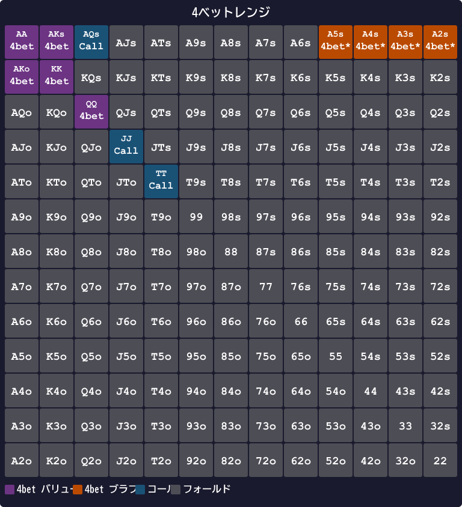

# 第16章　4bet・オールインの簡易EV式（軽め）

<!-- markdownlint-disable MD060 -->

> **本章の目標**: 4ベットとオールインの判断を、**「QQ+ と AK だけで8割正解」**というシンプル原則に集約します。本書で最も「覚えなくていい章」ですが、知らないと大事故に繋がる最低限のルールを扱います。

本章は本書で最も**軽め**の章です。4ベットとオールインは、プリフロップで最も大きなポットがかかるアクションですが、頻度は低く、判断もシンプルに済ませられます。

「QQ+ とAKだけで4ベット」「4ベット返しはQQ以外フォールド」という2つのルールを覚えれば、**破滅的な事故の大半を避けられます**。

---

<figure><figcaption>4betレンジのバリュー（60-70%）とブラフ（30-40%）の二重構造図</figcaption></figure>

<figure><figcaption>コール額とポット別のオールイン必要エクイティ早見表</figcaption></figure>

## 16-1 4ベットの目的とレンジ

### 4ベット = 3ベットへのリレイズ

順を追うと次のようになります。

1. オープンレイズ（誰かが2.5bb開ける）
2. 3ベット（ほかのプレイヤーが8〜10bbに上げる）
3. **4ベット**（元のオープンレイザーが22〜25bbに再度上げる）
4. 5ベット（通常オールイン）

4ベットは**プレミアムハンドの戦い**です。相手の3ベットに対して「私のほうが強い」と宣言するアクションです。

### 4ベットレンジの構成

GTOの4ベットレンジは大きく2種類のハンドで構成されます。

- **バリュー**：AA、KK、QQ、AK
- **ブラフ**：A5s、A4s、A3s、A2s（スーテッドエース）

バリューは「3ベットレンジに対してエクイティ優位」のハンド、ブラフは「ブロッカー効果＋4ベット耐性」を持つハンドです。

### 「Score ≥ 33 で 4ベット」

本書ではプリフロップスコアに **T_4bet = 33** という単一閾値を当てるだけで、QQ+/AK の 4ベットルールが自動再現されます:

| ハンド | Score | T_4bet=33 | 判定 |
|---|---|---|---|
| AA | 41 | ≥33 ✓ | 4-bet |
| KK | 38 | ≥33 ✓ | 4-bet |
| QQ | 34 | ≥33 ✓ | 4-bet |
| AKs | 35 | ≥33 ✓ | 4-bet |
| AKo | 32 | <33 | 3-bet にコール / フォールド |
| JJ | 32 | <33 | コール / フォールド |
| AQs | 32.5 | <33 | コール / フォールド |
| TT | 30 | <33 | コール |

**AA / KK / QQ / AKs** が自動的に 4-bet 域 ≥ 33 に入ります。これだけで全4ベットハンドの **7〜8割**を占めます。AKo / AQs / JJ は混合戦略 (上級者向け、本式では fold 寄り) なので、初心者は **「Score 33 以上で 4-bet、未満は 3-bet を受けてコールかフォールド」** という単一ルールで十分。

### 5-bet (4-bet 受け、コミット判断)

相手の 4-bet にも更にプッシュバックする場合:

| ハンド | Score | T_5bet=39 | 判定 |
|---|---|---|---|
| AA | 41 | ≥39 ✓ | 5-bet オールイン |
| KK | 38 | <39 | コール (タイト寄り推奨) |
| QQ 以下 | <34 | <39 | フォールド |

「QQ 以下フォールド」のルールが自動再現されます。AA のみ純粋に 5-bet コミット、KK は状況次第。

### BB が 4-bet 受け / 5-bet を判断するとき

**重要**: BB が 3-bet または squeeze した後に opener が 4-bet で返してきた場合、5-bet/コール/フォールドの判断は **通常 Score（Score_BB ではない）** + T_5bet=39 で行います。

理由は次の通り:

1. **5-bet pot は equity 勝負**: ポットが 30bb+ になり、ほぼ all-in 確定の局面。Score_BB が反映する suited+6 / conn+4 の「ポストフロップ実現率の良さ」は、5-bet コミット後はほぼ無関係
2. **GTO 整合**: KQs を例にとると Score_BB=37 ≥ T_5bet=39（不可ではないが届かず）、通常 Score(KQs)=31 → どちらでも 5-bet しないが、KK を超える hand が 5-bet しないので意味は同じ
3. **シンプル化**: BB であっても 5-bet 帯（AA のみ純戦略 / KK は状況依存）は他ポジと同じルールで判断できる

BB が 3-bet で AKs (Score_BB=41) を打ち、4-bet 返しを受けたとき、判断は通常 Score(AKs)=35 < 39 で **コール**（フォールドはしない、4-bet を受けてフロップへ）。これが標準ルートです。

BB が cold 4-bet（opener + 3-bettor の後で 4-bet）するケースは上級者向けで、本書では扱いません。BB の 4-bet は事実上 squeeze の延長として処理し、Score_BB + T_squeeze（第17章）で判断してください。

---

## 16-2 FE込みEV公式

4ベットブラフの成立を考える場合、次の公式で評価します。

```text
EV = (相手が降りる確率 × ポット) − (コールされた時の損失)
```

- **相手が降りる確率**：Fold Equity（FE）
- **ポット**：4ベットした時点でのポット規模
- **コールされた時の損失**：相手の5ベットレンジvs自分のハンドの差

### ブレイクイーブン降り率

ブラフ4ベットの損益分岐フォールド率は次の式で出ます。

```text
必要フォールド率 = 4ベットで失う額 ÷ (ポット + 4ベットで失う額)
```

例：オープン2.5bb、3ベット10bb、4ベット25bb、相手が5ベットでオールインしたら自分は90bb残を失う。

- 4ベットが降ろされた時の利益：ポット（10 + 0.5 + 1 + 2.5 = 14bb）
- 4ベット後コールされた時の損失：コールされた場合にさらに取りに行く必要があるため、複雑

シンプルに考えると、**ブラフ4ベットは相手の3ベッターの半分以上がフォールドすれば機能**する、と覚えておけば十分です。本書の初心者段階では、この複雑な計算には踏み込みません。

---

## 16-3 4ベットサイズの目安

| 状況 | 推奨サイズ |
|------|----------|
| IP（BTN、CO など） | 3ベットの **約 2.3〜2.5 倍**（絶対値で 22〜25bb） |
| OOP（UTG・HJ など） | 3ベットの **約 2.5〜3 倍**（絶対値で 25〜30bb） |

IPは少し小さく、OOPは少し大きくするのが基本です。

覚え方：

- 3ベット10bbに対して → IPなら **22〜25bb 4ベット**
- 3ベット12bbに対して → OOPなら **30bb 4ベット**

---

## 16-4 「4ベット返しはQQ以外フォールド」ルール

### 典型シナリオ

あなたがQQで4ベットしました。相手が5ベットオールインしてきました。さて、どうするか。

### 各ハンドのエクイティ

相手の5ベットオールインレンジ = {QQ+, AK}（標準で全34コンボ。自分がQQなどを保有する場合は手札でブロックされたコンボを差し引く）に対するエクイティ：

| 自分のハンド | エクイティ | アクション |
|------------|----------|-----------|
| AA | 約 80%+ | **コール（余裕）** |
| KK | 約 58% | **コール** |
| QQ | 約 **41%** | **コール**（境界） |
| JJ | 約 **37%** | **フォールド**（アンダードッグ） |
| TT | 約 28% | **フォールド** |
| AK | 約 **46%** | **コール**（約互角） |

### ルールの要点

- **AA・KK・QQ・AK はコール**：ほぼ互角以上または必要エクイティ（約38%）を満たす
- **JJ 以下はフォールド**：必要エクイティを下回る

「QQ+ とAKだけコール、それ以外フォールド」で、判断は完結します。

### QQ の難しさ

QQが境界ハンドなのは、ポーカーでよく言われる通りです。相手の5ベットレンジがタイト（KK+ のみ）ならQQはフォールド、標準レンジ（QQ+ AK）なら互角。

ライブの場合は相手の5ベットが特にタイトな傾向があるので、QQのフォールドも選択肢です。オンラインの標準では、QQはコール推奨です。

---

## 16-5 AKの扱い

AKは「プレミアムだがペアではない」微妙な立ち位置のハンドです。

### 4ベット or コール

対3ベットでAKの扱いは次のようになります。

- **AKo（オフスーツ）**：ほぼ常に4ベット（バリュー）
- **AKs（スーテッド）**：IPならコールも有力、OOPならほぼ4ベット

AKsはコールでフロップを見る価値がある（ナッツフラッシュの可能性）ため、4ベット以外の選択肢もあります。

### 対5ベットオールイン

相手の5ベットオールインに対して、AKのエクイティは約46%（相手レンジQQ+ AKの場合）。

- ポットが大きくなっているため、46% でも**コール有利**
- 「**AK は4ベットコール以上で続ける、フォールドしない**」が基本

唯一の例外は、相手が明らかにタイトで「5ベット = KK+ のみ」と読める場合。このときだけAKはフォールドです。

---

## 16-6 ショートスタック（Push/Fold）は巻⑥へ

有効スタックが20BB以下になると「レイズ → コール → フロップ」の流れは消え、**プッシュかフォールドの二択**になります。これはトーナメント終盤の典型的な状況で、本書のディープスタック向けスコア式とは別問題です。

詳しい Push/Fold レンジは本シリーズ**巻⑥（トーナメント編）**で扱います。本書（巻①）はキャッシュゲーム 100BB を前提とし、20BB 以下の局面には立ち入りません。

---

## 16-7 対5ベット戦略

### 5ベットへのコール判断

あなたが4ベットし、相手が5ベットで返してきました。コールすべきか。

### 必要エクイティの計算

```text
必要エクイティ = コール額 ÷ (ポット + コール額)
```

典型的な例：ポット125BB、コール額75BB。

- 必要エクイティ = 75 / 200 = **37.5%**

### コール可能なハンド

相手の5ベットレンジがQQ+ AKの場合（自分の手札で一部のコンボがブロックされる）：

- AA：約80%+ → **コール**
- KK：約58% → **コール**
- QQ：約41% → **コール**（ぎりぎり上回る）
- AK：約46% → **コール**
- JJ：約37% → **フォールド**（37.5%にわずかに届かず）
- AQ：約25% → **フォールド**

**「QQ+ とAKだけコール、それ以外フォールド」**のルールが、ここでも一貫して機能します。

---

## 【GTOとのズレ】ブラフ4ベットを本書は扱わない

### GTOはブラフ4ベットを含む

GTOの4ベットレンジには、バリュー（AA〜QQ、AK）のほかに**ブラフ4ベット**が含まれます。最良のブラフ候補は、AA・AK・KKを同時にブロックできる **A5s、A4s、A3s、A2s** です。

### 本書が省略する理由

1. **4ベット頻度は低い**：1回のセッションで数回しか発生しない
2. **実装ミスのコストが大きい**：4ベットを打った後、5ベットされて降りるのはかなり痛い
3. **初心者はバリューだけで十分**：7〜8割のEVはバリュー4ベットでカバーできる

本書の「QQ+ とAKだけ4ベット」は、**初心者向けの安全策**として設計されています。

### いつブラフ4ベットを加えるか

本書を卒業して第20章の学習ロードマップに進んだら、次のルールでブラフ4ベットを追加できます。

> **IP限定**：相手が3ベットを打ってきたとき、A5s、A4s、A3s、A2s のいずれかで4ベットを打つ。頻度は全体の 20〜30% 程度に抑える。

ただし、これは**上級者の技**です。本書を読んでいる段階では手を出さないでください。

<figure><figcaption>4ベットレンジ — 紫がバリュー、オレンジがブロッカー付きブラフ（A5s〜A2s）。JJ/TT/AQsはコールでフロップへ</figcaption></figure>

---

## 章のまとめ

- 4ベットは「QQ+ とAKだけ」で8割正解
- バリュー4ベット：AA、KK、QQ、AK
- 本書は**ブラフ4ベットを扱わない**
- 4ベットサイズ：IP約2.3〜2.5倍、OOP約2.5〜3倍
- 4ベット返しはQQ以外フォールド（JJ以下は37% 以下のエクイティで赤字）
- AKは相手の5ベットにコール以上で続ける（46%エクイティで有利）
- 20BB以下のPush/Foldは巻⑥（トーナメント編）に譲る
- 対5ベットの必要エクイティは約37.5%、QQ+ とAKだけがコール可
- 発展：IP限定でA5s等のブラフ4ベットを20〜30%で混ぜる

---

## ミニクイズ

### 問1

本書が推奨する4ベットレンジはどれでしょうか。

1. AAのみ
2. AA、KK、QQ、AK（QQ+ とAK）
3. すべてのペアとブロードウェイハンド

---

### 問2

あなたはJJで4ベットしました。相手が5ベットオールインしてきました。相手の5ベットレンジをQQ+、AKと推定します。どうしますか。

1. コール（強いハンドだから）
2. フォールド（エクイティ約37% で必要37.5% に届かず）
3. 再レイズ

---

### 問3

AKが対5ベットオールインでコール推奨となる主な理由として、本章で挙げられたものはどれでしょうか。

1. AKは相手のレンジに対してエクイティ約46%で互角
2. ポットがすでに大きくなっている
3. AKはブロッカー効果が強く相手のAA・KKを減らす

---

### 解答

- **問1**：2（QQ+ とAK）
- **問2**：2（JJのエクイティは約37%で、必要37.5%をわずかに下回る）
- **問3**：1、2、3（すべて正解）

---

## 出典

- Upswing Poker『4-Bet Strategy』
- GTO Wizard『Preflop All-In Equity Tables』
- GTO Wizard『5-Bet Pot Analysis』
- Upswing Poker『How to Play Ace-King in Cash Games』
