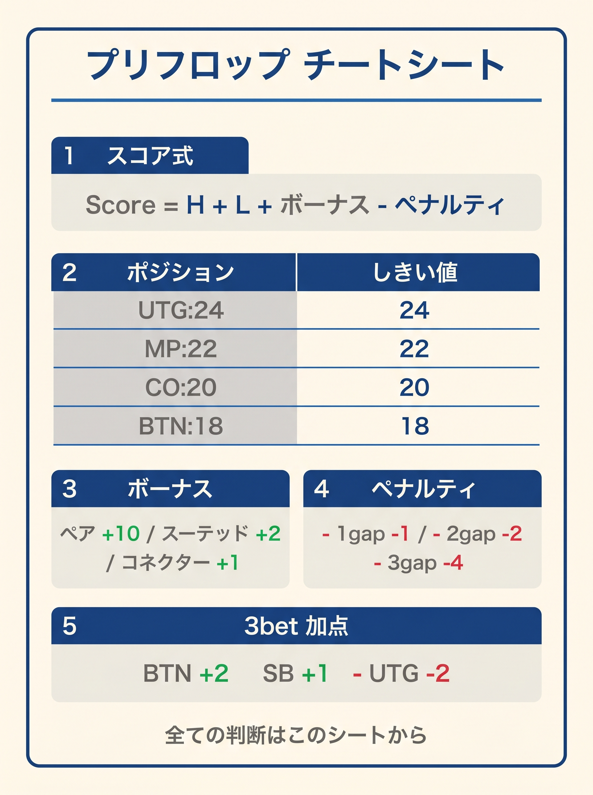

# 第19章　1枚チートシートと暗記術

<!-- markdownlint-disable MD040 -->
<!-- textlint-disable preset-ja-technical-writing/no-exclamation-question-mark -->
<!-- textlint-disable preset-jtf-style/4.3.7.山かっこ<> -->

> **本章の目標**: 本書で学んだすべての公式・しきい値・ルールを**1枚のチートシート**に凝縮し、日常の実戦で使い続けられるツールを手渡します。記憶に定着させる**語呂合わせ**と**1日5分の練習メニュー**も提示します。

19章をかけて学んできた本書の内容は、実は**1枚に収まります**。本章ではそのチートシートを示し、さらに実戦で使うための暗記術と練習メニューを提供します。

---

<figure><figcaption>スコア式・しきい値・ボーナス・ペナルティを1枚にまとめたプリフロップチートシート</figcaption></figure>

## 19-1 1枚チートシート

以下が、本書の全エッセンスを凝縮した**1枚チートシート**です。印刷して手元に置いておくことを推奨します。

```text
==========================================
  プリフロップスコア チートシート
==========================================

■ カード数値
  A=14  K=13  Q=12  J=11  T=10  2〜9=そのまま

━━━━━━━━━━━━━━━━━━━━━━━━━━━━━━
【プリフロップスコア（共通式）】
━━━━━━━━━━━━━━━━━━━━━━━━━━━━━━

Score = H + L + ボーナス − ペナルティ
※ 全シーン（RFI / 3-bet / 4-bet / 5-bet / Squeeze）で同じ式
※ BB defense は Score_BB（係数強化版）

ボーナス
  ペア              +10
  スーテッド          +3
  コネクター 差1     +1
  コネクター 差2〜3   +0.5
  ブロッカー A=+3 / K=+2 / AK 両方=+4

ペナルティ
  差4以上            −1（A 含むと免除）
  両方9未満          −1

━━━━━━━━━━━━━━━━━━━━━━━━━━━━━━
【RFI (オープン)】 T_open
━━━━━━━━━━━━━━━━━━━━━━━━━━━━━━

  UTG≥24  HJ≥22  CO≥20  BTN≥18  SB≥22

→ Score ≥ T_open でオープン、未満でフォールド
→ 迷ったら「1点下なら降りる」

━━━━━━━━━━━━━━━━━━━━━━━━━━━━━━
【対 RFI 二段閾値】 T_3bet / T_call
━━━━━━━━━━━━━━━━━━━━━━━━━━━━━━

Score ≥ T_3bet → 3-bet
T_call ≤ Score < T_3bet → CALL
Score < T_call → FOLD

  BTN vs UTG: 32 / 28      BTN vs HJ: 32 / 27
  BTN vs CO:  24 (単一)
  CO/HJ vs UTG/HJ:  28 (単一)
  SB vs UTG:  30   SB vs HJ:  30
  SB vs CO:   28   SB vs BTN: 24

━━━━━━━━━━━━━━━━━━━━━━━━━━━━━━
【4-bet / 5-bet】
━━━━━━━━━━━━━━━━━━━━━━━━━━━━━━

T_4bet=33 (全ポジ共通)
  → AA(41), KK(38), QQ(34), AKs(35) のみ 4-bet
  → AKo(32), JJ(32), AQs(32.5) は閾値未満で 3-bet コール/フォールド

T_5bet=39 (全ポジ共通)
  → AA(41) のみ 5-bet (オールイン)、KK は閾値未満でコール

━━━━━━━━━━━━━━━━━━━━━━━━━━━━━━
【BB defense (Score_BB + 例外)】
━━━━━━━━━━━━━━━━━━━━━━━━━━━━━━

Score_BB = 通常スコア式で
  スーテッド +6 (通常 +3 → +6)
  コネクター 差1 +4 / 差2〜3 +2
  両方9未満は offsuit のみ −2 (suited 免除)

判定フロー:
  Step 1: Score_BB ≥ T_3bet → 3-bet
  Step 2: ペアハンド → CALL（例外1: set mining）
  Step 3: スーテッド差≤4 → CALL（例外2: 暗黙オッズ）
  Step 4: T_call ≤ Score_BB < T_3bet → CALL
  Step 5: Score_BB < T_call → FOLD

T_3bet / T_call:
  vs UTG: 34 / 24    vs HJ:  32 / 23
  vs CO:  28 / 22    vs BTN: 28 / 18    vs SB: 32 / 18

━━━━━━━━━━━━━━━━━━━━━━━━━━━━━━
【Squeeze (1 オープン + 1 コール後の 3-bet)】
━━━━━━━━━━━━━━━━━━━━━━━━━━━━━━

T_squeeze = T_3bet (vs オープナー) + 3 × コール数

  BTN squeeze vs UTG + 1 caller: 32 + 3 = 35
  BTN squeeze vs CO  + 1 caller: 24 + 3 = 27

━━━━━━━━━━━━━━━━━━━━━━━━━━━━━━
【ポットオッズ・実現率・セットマイニング】
━━━━━━━━━━━━━━━━━━━━━━━━━━━━━━

必要勝率 = コール額 ÷ 最終ポット
  2bb → 22%  2.5bb → 27%  3bb → 31%  4bb → 35%

実効勝率 = 生勝率 × 実現率
  IP≈1.0  OOP≈0.6〜0.8
  → OOP なら必要勝率に +5〜7% 上乗せ

セットマイニング: コール額 × 15 ≤ 相手スタック (IP)
                 コール額 × 25 ≤ 相手スタック (OOP)

━━━━━━━━━━━━━━━━━━━━━━━━━━━━━━
【補助ルール】
━━━━━━━━━━━━━━━━━━━━━━━━━━━━━━

・SC 暗黙オッズ: 65s〜T9s で IP 深スタックなら CALL 寄り
・小ペア set mining: 22-77 で 15× 条件成立なら CALL
・3-bet ブラフコンボ (上級): A2s〜A5s, K9s, QJs を混合
・BB wide call: BB は IP オープン vs suited で T_call−3 まで広く CALL

━━━━━━━━━━━━━━━━━━━━━━━━━━━━━━
【重要ルール集】
━━━━━━━━━━━━━━━━━━━━━━━━━━━━━━

1. リンプ禁止: 常に「レイズかフォールド」
2. SB は「3-bet かフォールド」が基本
3. BB は wide defense (Score_BB + 例外フロー)
4. タイト相手: しきい値 +2 / ルース相手: −2
5. ディープ (150BB+): S・C ボーナス +1
6. ショート (≤40BB): S/C 無視、B +1
7. マルチウェイ: オフスーツ BW は −2、小ペアは +2
8. 迷ったら降ろす
9. 式で 9 割、境界ハンドの暗記で 1 割（付録 F）

━━━━━━━━━━━━━━━━━━━━━━━━━━━━━━
【境界暗記ハンド（付録 F 参照）】
━━━━━━━━━━━━━━━━━━━━━━━━━━━━━━

UTG オープン (T_open=24):
  77 (Score=24) → 開ける（最下限）
  AJo (Score=28.5) → 開ける（A ブロッカー込み）
  KQs (Score=31) → 開ける

BTN オープン (T_open=18):
  22 (Score=14) → 開けない（補助ルール set mining 対象外）
  K7s (Score=24) → 開ける
  65s (Score=14) → 開けない（補助ルール SC で IP 限定 CALL）

BTN vs UTG 3-bet (T_3bet=32 / T_call=28):
  AKo (Score=32) → 3-bet
  JJ (Score=32)  → 3-bet (T_4bet=33 で 4-bet は不可)
  KQo (Score=28) → CALL
  AJs (Score=31.5) → CALL
  A5s (Score=25) → FOLD（GTO はブラフ 3-bet 混合、上級者向け）

BB vs BTN (T_3bet=28 / T_call=18, Score_BB):
  KQo (Score_BB=31) → 3-bet
  88 (Score_BB=26) → 例外1 (ペア) で CALL（T_3bet=28 未満）
  T9s (Score_BB=22) → CALL（例外2: スーテッド差≤4 でも CALL）

==========================================
```

このチートシートが本書の**すべて**です。これが頭に入っていれば、実戦で迷うことはほとんどなくなります。

---

## 19-2 暗記術：語呂合わせ

### しきい値の語呂合わせ

T_open は覚えにくい数字ですが、次の語呂で記憶できます。

> **「UTG=24、HJ=22、CO=20、BTN=18、SB=22」**
>
> = **「24・22・20・18 と 2 ずつ下がり、SB は HJ と同じ 22 に戻る」**

UTG だけ 24（最もタイト）、そこから HJ=22 → CO=20 → BTN=18 と 2 ずつ下がり、SB は **22**（HJ と同じタイト、OOP のため BTN より絞る）と覚えます。

T_3bet (BTN) は **「対 UTG=32、対 HJ=32、対 CO=24（単一）」**。「BTN は前ポジに対しては 32、CO 相手は 24 でリニア」。

### ボーナス・ペナルティの語呂合わせ

> **「ペア10、スーテッド3、コネクター1、ギャップ0.5、ペナルティ−1」**

「10→3→1→0.5→−1」とステップダウンする階段をイメージ。**10-3-1-0.5-1** のリズムで唱えます。

### ブロッカーの語呂合わせ

> **「A は 3、K は 2、AK は 4（2+3 だと 5 だが重複減衰で 4）」

### セットマイニングの語呂合わせ

> **「IPは15倍、OOPは25倍」**
>
> = **「イチゴ（15）にニゴ（25、苦いやつ）」**

---

## 19-3 記憶を助ける3つの視覚化

### 視覚化1：T_open とポジションの対応

```
UTG ──── 24
HJ  ──── 22
CO  ──── 20
BTN ──── 18
SB  ──── 22
BB  ──── （Score_BB + 例外フロー）
```

「UTG→BTN は 2 ずつ下がりタイト→ルースに開く、SB は OOP なので HJ と同じ 22 に戻る」という形で覚えられます。

### 視覚化2：プリフロップスコア帯とハンド群

```
スコア
 41 ─── AA（最強）
 38 ─── KK
 35 ─── AKs
 32 ─── AKo、JJ、AQs（T_3bet 帯）
 28 ─── KQo、99（T_call 帯）
 25 ─── A5s、JTs
 24 ─── 77（UTG T_open）
 22 ─── 66（HJ T_open）
 20 ─── A4o、CO T_open
 18 ─── 44、BTN T_open
 15 ─── 33、SB T_open
 14 ─── 22
  7 ─── 72o（最弱）
```

「数字がスコア、ハンドが代表例」という地図を頭に描きます。

### 視覚化3：判断フロー

```
手札 → 数値化 → スコア計算 → しきい値比較 → アクション
                                              │
                     ┌────────────────────────┤
                     ↓                        ↓
                  ≥ しきい値               < しきい値
                  (オープン)                 (フォールド)
```

この「→」の流れを何度も頭の中でなぞることで、判断が自動化されます。

---

## 19-4 1日5分の練習メニュー

### Step 1：ハンド数値化（1分）

ランダムに10ハンドを挙げて、瞬時に数字に変換する練習です。

- AQo → 14、12
- 98s → 9、8
- K3o → 13、3
- ……

**目標**：1ハンドあたり1秒以内。

### Step 2：スコア計算（2分）

同じ10ハンドを使って、スコアを計算します。

- AQo：14 + 12 + 0.5 (差2) + 3 (Aブロッカー) = 29.5
- 98s：9 + 8 + 3 (s) + 1 (差1) − 1 (両方9未満) = 20
- K3o：13 + 3 + 2 (Kブロッカー) − 1 (差10≥4) = 17
- ……

**目標**：1ハンドあたり3秒以内。

### Step 3：判断（2分）

ランダムにポジションを設定し、そのポジションでのアクションを決めます。

- AQo UTG → 29.5 ≥ 24 → オープン
- 98s CO → 20 = 20 → オープン（ぎりぎり）
- K3o HJ → 17 < 22 → フォールド
- ……

**目標**：1ハンド × 1ポジションあたり5秒以内。

### 週の学習計画

- **月〜金**：1日5分の基本練習
- **土**：実戦プレイ（練習の成果を試す）
- **日**：実戦で迷ったハンドの振り返り

合計1週間で **30分**。これだけで、本書の式は完全に身体化できます。

---

## 19-5 ランダム練習用ハンドリスト

練習の際に使えるランダムなハンド20個を用意しました。

```text
1.  A♠ K♠     (AKs)
2.  J♦ J♥     (JJ)
3.  9♣ 7♣     (97s)
4.  5♥ 5♠     (55)
5.  K♦ 2♠     (K2o)
6.  Q♣ J♣     (QJs)
7.  A♥ 5♣     (A5o)
8.  T♦ T♣     (TT)
9.  8♠ 7♦     (87o)
10. 4♥ 4♣     (44)
11. A♦ T♠     (ATo)
12. K♥ Q♠     (KQo)
13. 6♣ 2♣     (62s)
14. 3♦ 3♥     (33)
15. J♣ T♦     (JTo)
16. A♠ 9♠     (A9s)
17. Q♥ 6♥     (Q6s)
18. 9♦ 9♣     (99)
19. 5♠ 3♠     (53s)
20. K♣ 9♦     (K9o)
```

各ハンドについて、次の質問に答える練習をしてください。

- スコアはいくつか？
- UTG、CO、BTNそれぞれでオープンすべきか？

**解答例**（参考）：

- AKs = 14+13+3 (s)+1 (差1)+4 (AKブロッカー) = **35**（全ポジオープン）
- 97s = 9+7+3 (s)+0.5 (差2)−1 (両方9未満) = **18.5**（BTN T_open=18 ぎりぎりオープン、CO 以上はフォールド）
- K2o = 13+2+2 (Kブロッカー)−1 (差11≥4) = **16**（全ポジフォールド）
- A9s = 14+9+3 (s)+3 (Aブロッカー) = **29**（差5≥4 だが A 免除、9 は両カード9未満ペナルティ対象外。UTG オープン可）

---

## 19-6 本書卒業の目安

次のチェックリストをすべてクリアできたら、本書を卒業する準備ができています。

- [ ] ハンドを見た瞬間に数値化できる（1秒以内）
- [ ] 任意のハンドについてプリフロップスコアを3秒以内に計算できる
- [ ] 自分のポジションの T_open / T_3bet / T_call を即答できる
- [ ] 第18章の20問ドリルを80%以上正答できる
- [ ] ポットオッズの暗算（2bb → 22% など）ができる
- [ ] セットマイニング15倍ルールを瞬時に適用できる
- [ ] プリフロップスコアでブロッカー付きハンドの判定ができる（A=+3, K=+2, AK=+4）
- [ ] T_4bet=33 で「QQ+/AKs だけ 4-bet」のルールを守れる
- [ ] T_5bet=39 で「AA だけ 5-bet」のルールを守れる
- [ ] BB defense の Score_BB と 5 ステップフローを使える
- [ ] SB では「3-bet かフォールド」を徹底できる
- [ ] マルチウェイで本書の式が通用しない場面を認識できる（トーナメント／ICM は巻⑥に進む）

---

## 章のまとめ

- 本書の全エッセンスは 1 枚のチートシートに凝縮できる
- T_open は「24・22・20・18・22」（UTG だけ 24 でタイト、SB は HJ と同じ 22 で OOP 補正）
- T_3bet (BTN) は対 UTG=32、対 HJ=32、対 CO=24
- T_4bet=33（QQ+/AKs のみ）、T_5bet=39（AA のみ）
- BB defense は Score_BB + 5 ステップフロー
- ボーナスは「10・3・1・0.5」、ブロッカーは「A=3、K=2、AK=4」
- セットマイニングは「IPは15倍、OOPは25倍」
- 毎日 5 分の練習で式は身体化できる
- 週 30 分の継続で、1 か月以内に卒業できる水準に到達する
- 本書卒業のチェックリストで自己評価できる

次章（第20章）では、本書を卒業した後の**学習ロードマップ**を示します。GTOツールの使い方、次に読むべき本、実戦でのデータ分析など、さらに高みを目指す方法を紹介します。

> **補足（第21章への接続）**: 本章は決定論的判断に特化しています。境界付近での混合戦略は第21章で扱い、付録に拡張版チートシートを収録しています。
