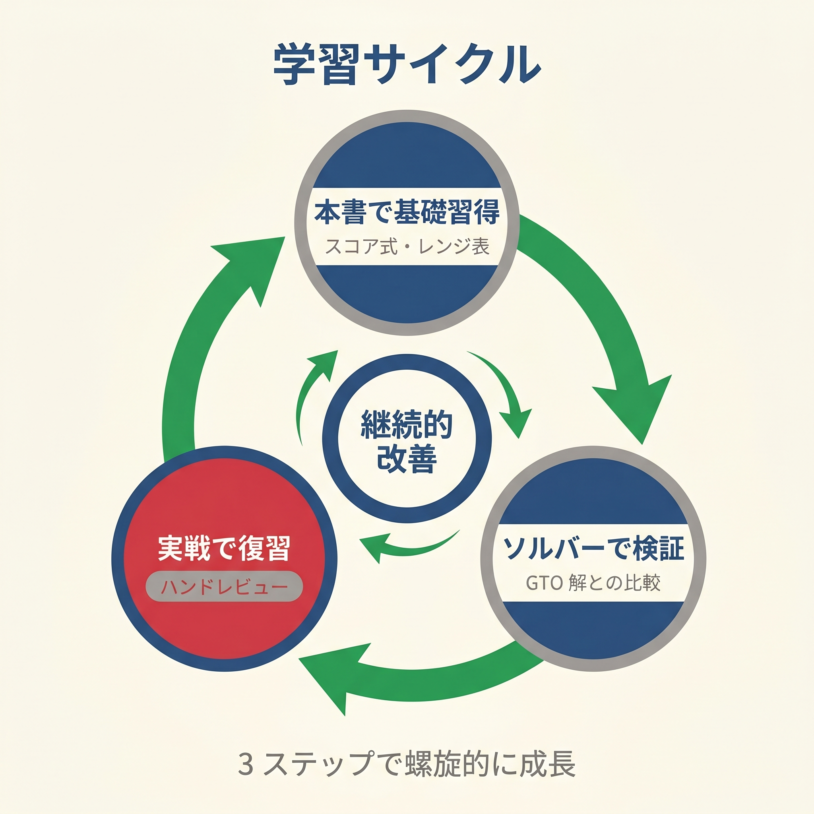

# 第20章　簡易式からGTOへ：学習ロードマップ

<!-- textlint-disable preset-ja-technical-writing/no-mix-dearu-desumasu -->
<!-- textlint-disable preset-jtf-style/4.2.9.ダッシュ(-) -->

> **本章の目標**: 本書を卒業した読者のために、次に学ぶべきツール・書籍・コミュニティを紹介します。本書の簡易式から、現代のGTOへとスムーズに移行するためのロードマップです。

本書を最後まで読んでくださり、ありがとうございました。最終章の目標は、あなたが**本書の外の世界**に踏み出す手助けをすることです。

本書の式は、プリフロップ判断の「入口」を開くための道具でした。実戦で使える簡易解を手に入れた今、次に目指すべきは**現代のGTO戦略**そのものです。

---

<figure><figcaption>本書→ソルバー→実戦復習の3ステップ学習ループ図</figcaption></figure>

## 20-1 GTO Wizardから始める

### なぜ GTO Wizard か

**GTO Wizard**（[gtowizard.com](https://gtowizard.com)）は、2020年代以降最も使われているGTO学習ツールです。特徴は：

- **ブラウザーで動く**（インストール不要）
- **プリフロップチャートの基本閲覧が無料**（全機能利用には有料プラン登録が必要）
- **AIによるマルチウェイソルバー**も利用可能（2024年機能）
- **日本語対応も進んでいる**

本書を読み終えた方が最初に触るべきツールです。

### 無料版でできること

- 全ポジションのプリフロップチャート閲覧（6-max、フルリング対応）
- デイリートレーナー（1日1問、プリフロップ判定の練習）
- プリフロップレポート（100BBキャッシュのみ、機能限定版）
- 10BB以下のマルチウェイプリフロップ解析

これだけでも**本書の内容を GTO 視点で確認する**には十分です。

### 有料版の価値（2025年機能）

2025年3月に公開された **「GTO Reports」** が強力です。自分のポーカートラッカーのデータを読み込ませると、**「あなたのEV損失が大きいスポット」をランキング表示**してくれます。

- VPIP、PFR、RFIなどの統計を自動分析
- GTOベンチマークとのズレを可視化
- EV損失順のミスリストで、**優先的に直すべきスポット**を指摘

有料版は月額 $39〜$99（プランによる）程度。本格的に上を目指すなら、数ヶ月分を投資する価値があります。

---

## 20-2 そのほかのソルバー

### PIOSolver（上級者向け）

- **用途**：NLHEのポストフロップ解析の業界標準
- **価格**：$249〜$1,099（機能による）
- **難易度**：高い（操作習得に時間が必要）

ポストフロップを本格的に学びたい段階で検討すべきツール。ただし**プリフロップには使えません**（プリフロップレンジは別途用意する必要あり）。

### MonkerSolver（マルチウェイ対応）

- **用途**：PLO、マルチウェイのプリ・ポスト両対応
- **価格**：€499
- **特徴**：マルチウェイポット（3人以上）の解析ができる数少ないツール

第17章で扱ったマルチウェイを本格的に勉強したいなら、これが頼りになります。

### RangeConverter（プリソルブドレンジ購入）

- **用途**：既に計算済みのプリフロップレンジを購入・利用
- **価格**：都度購入制（レンジ1セット $20〜）
- **特徴**：自分でソルバーを動かさず、完成品を入手できる

時間をかけたくない人向け。ただし、ソルバー結果の「読み方」を学ぶ機会は減ります。

---

## 20-3 推薦図書のロードマップ

本書の後に読むべき書籍を、難易度順に紹介します。

### Step 1：『GTO Poker Simplified』O'Kearney & Carter（2022）

- **目的**：GTOの全体像を掴む
- **特徴**：「Simplified」の名の通り、読みやすく整理されている
- **本書との関係**：本書の思想「簡易化」を引き継いで、GTOの全ストリートをカバー

本書を読了した読者が**最初に手に取るべき1冊**です。

### Step 2：『Applications of No-Limit Hold'em』Matthew Janda（2013）

- **目的**：現代レンジ思考の基礎を体系的に
- **特徴**：やや古いが、理論の土台は今も通用する
- **本書との関係**：本書の「レンジ思考」の理論版

やや難易度が上がりますが、ゲーム理論的な基礎を身につけるために必読。

### Step 3：『Modern Poker Theory』Michael Acevedo（2019）

- **目的**：ソルバーベースの本格的GTO学習
- **特徴**：プリフロップチャートに約300ページ、最も包括的
- **本書との関係**：本書のプリフロップ式を**GTOの詳細な頻度**に発展させる

本書で基礎を固めた読者には、**完成形の教科書**として機能します。

### Step 4：『Beyond GTO: Poker Exploits Simplified』O'Kearney & Carter（2024）

- **目的**：エクスプロイト戦略の応用
- **特徴**：GTOの上に「相手の弱点を突く」層を重ねる
- **本書との関係**：第14章の「相手タイプ別調整」の完全版

GTOを学んだ後、実戦でさらに勝率を上げるための最終段階。

---

## 20-4 トラッキングソフト

### なぜトラッキングが重要か

あなたの実際のプレイデータ（VPIP、PFR、3bet率など）を計測することで、「自分はどこがGTOから外れているか」が具体的にわかります。

感覚ではなく数字で自分を把握する——これが上級者への第一歩です。

### 2大トラッキングソフト

#### PokerTracker 4

- **対応**：PokerStars、888poker、WPT Globalなど
- **価格**：$79.99（買い切り）
- **機能**：HUD、リアルタイム統計、ハンド履歴分析

#### Hold'em Manager 3

- **対応**：同上
- **価格**：$89（買い切り）
- **機能**：PokerTrackerとほぼ同等、UIが異なる

どちらでも構いません。好みで選んでください。

### 最初にチェックすべき2つの統計

本書を卒業した段階では、**VPIP と PFR**の2つだけ見れば十分です。

- **VPIP 15〜24%**（6-max）：勝ち組ゾーン
- **PFR は VPIP の 80〜95%**：タイト・アグレッシブの指標

この2つが狙い通りの範囲にあれば、プリフロップの大枠は合っています。

---

## 20-5 学習ルーチンのすすめ

### 週あたり4〜6時間でOK

プロを目指さないのであれば、**週4〜6時間**の学習で十分な上達が見込めます。

### 推奨ルーチン

#### 毎日の習慣（15分）

- **セッション前**：GTO Wizardのデイリートレーナーで5問
- **セッション後**：その日の「迷ったハンド」を3つメモ

#### 週1回の深掘り（60分）

- **トピック選定**：1つのスポット（例：「CO vs BTNの3ベット」）を決める
- **ソルバーで確認**：GTO Wizardでそのスポットを開く
- **自分のハンド履歴と照合**：トラッキングソフトで実際のプレイと比較

#### 月1回のレビュー（60分）

- **勝敗分析**：勝ちハンド・負けハンドで最大ポットの10〜20個を振り返り
- **統計確認**：VPIP / PFR / 3bet率を自分の目標値と照合

「1トピックに2週間」のペースで進めると、**年間 20〜25 トピック**をマスターできます。

---

## 20-6 日本語リソース

### YouTube

#### 世界のヨコサワ

- **チャンネル登録者**：約89万人（2024年時点）
- **特徴**：日本語のポーカー入門〜中級解説で圧倒的
- **おすすめコンテンツ**：プリフロップ解説、トーナメント実況

#### POKER GUILD

- **特徴**：GTO寄りの本格的な戦略解説
- **対象**：中級者以上

### 書籍（日本語）

- 世界のヨコサワ著各種（2024年）
- **注意**：GTO Wizardのような最新ソルバー前提の日本語書籍はまだ少ないため、英語書籍との併用を推奨

### コミュニティ

- **DISBOARD のポーカータグ**：Discordサーバーを検索できる
- **3Million Poker Club**：有料サロン（月額課金制）
- **X（旧Twitter）**：日本人ポーカープロのアカウントをフォロー

コミュニティに参加すると、「自分ひとりで考え込まない」環境が手に入ります。わからない時に聞ける相手がいるのは大きな力になります。

---

## 20-7 学習のマインドセット

### 完璧を目指さない

本書でも繰り返し強調してきた通り、**ポーカーは近似の連続**です。GTO Wizardが示す頻度を完璧に再現しようとしても、人間の脳では不可能です。

大切なのは：

1. **方向性が合っている**こと
2. **大きなミスを避ける**こと
3. **継続して学ぶ**こと

「今日より1%うまく」を積み重ねれば、1年後には劇的に変わっています。

### 結果より過程

短期の勝敗に一喜一憂せず、**「正しい判断の蓄積」**を評価軸にしてください。第1章で示した大数の法則は、プロセスを信じる人に報酬を与えます。

### 仲間を作る

1人で学ぶより、仲間と学ぶほうが長続きします。コミュニティ、SNS、リアルの勉強会、どれでも構いません。**「学び続けられる環境」**が最大の武器です。

---

## 20-8 最後に：本書を卒業する読者へ

本書の式は、**プリフロップ判断の「入口」**を開くための道具でした。ここまで読み終えたあなたは、すでに多くの初心者プレイヤーより一段階上の視点を持っています。

次の目標は、**「計算している感覚がなくなる」**ことです。

第3章で触れた通り、プロの直感は「システム2（意識的な計算）で繰り返されたものがシステム1（無意識の直感）に内面化されたもの」でした。あなたも本書の式を何千回と繰り返すうちに、計算していると感じないレベルに到達します。

そのとき、本書は役目を終えます。

---

## 章のまとめ

- GTO Wizardが最初に触るべきツール（無料版で十分始められる）
- PIOSolver、MonkerSolverは段階的に導入
- 推薦図書：GTO Poker Simplified → Janda → Acevedo → Beyond GTO
- トラッキングソフト：PokerTracker 4かHold'em Manager 3
- 最初にチェックすべき統計：VPIPとPFRの2つ
- 週4〜6時間の学習で上達できる
- 日本語リソース：世界のヨコサワ、POKER GUILD、コミュニティ
- 完璧を目指さず、方向性と継続を重視する
- いずれ計算している感覚がなくなるまで反復する

---

## エピローグ

テキサスホールデムのプリフロップは、世界一有名なカードゲームの最も重要な一瞬です。

本書の計算式が、あなたのその一瞬に、ほんの少しでも光を当てられたなら幸いです。

レンジ表という巨大な山を前に立ち尽くしていた読者が、自分の力で登り始められるようになる。そんな道具を届けることが、本書の目標でした。

プリフロップで勝負の8割が決まる。

その8割を、あなた自身の計算で切り拓いてください。

ポーカーテーブルで、あなたに幸運と、それ以上の**技術の勝利**がありますように。

---

## 出典

- GTO Wizard公式サイト（gtowizard.com）
- PokerTracker 4公式サイト
- Hold'em Manager 3公式サイト
- Dara O'Kearney & Barry Carter『GTO Poker Simplified』（2022）
- Matthew Janda『Applications of No-Limit Hold'em』（2013）
- Michael Acevedo『Modern Poker Theory』（2019）
- Dara O'Kearney & Barry Carter『Beyond GTO: Poker Exploits Simplified』（2024）
- PokerCoaching『Study Plan for Serious Players』
- 世界のヨコサワYouTube Channel
