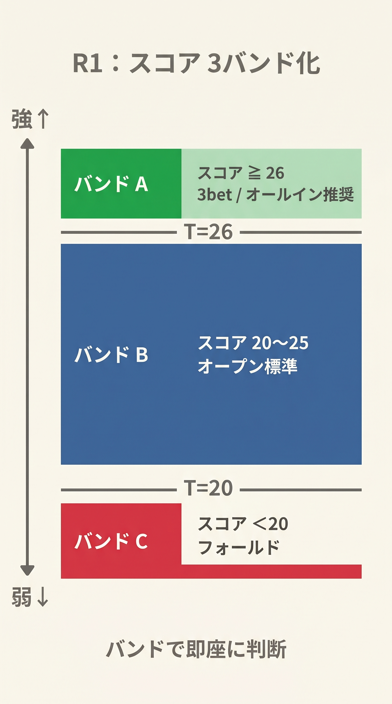
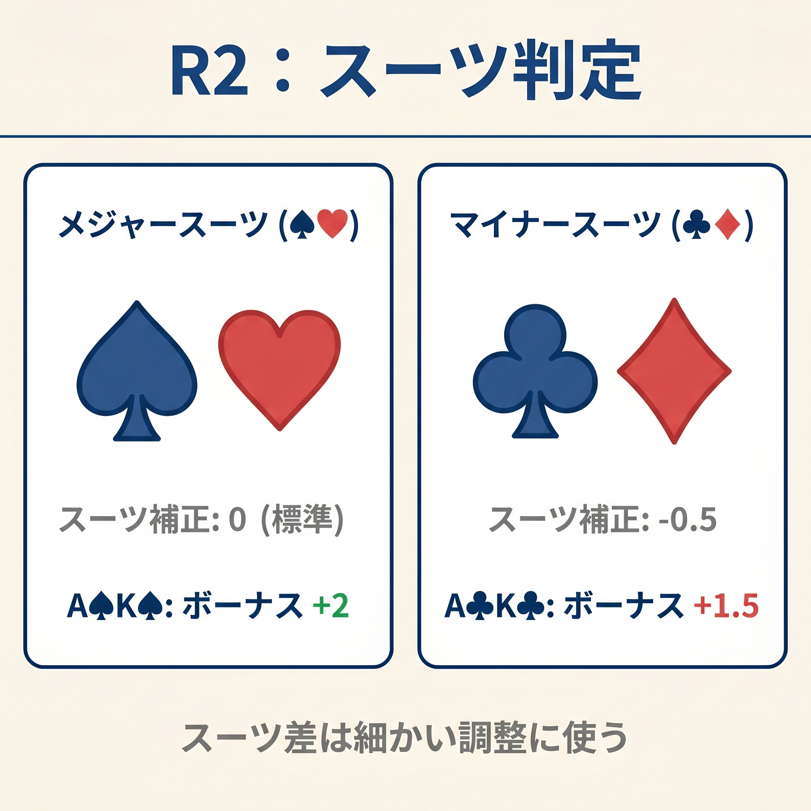
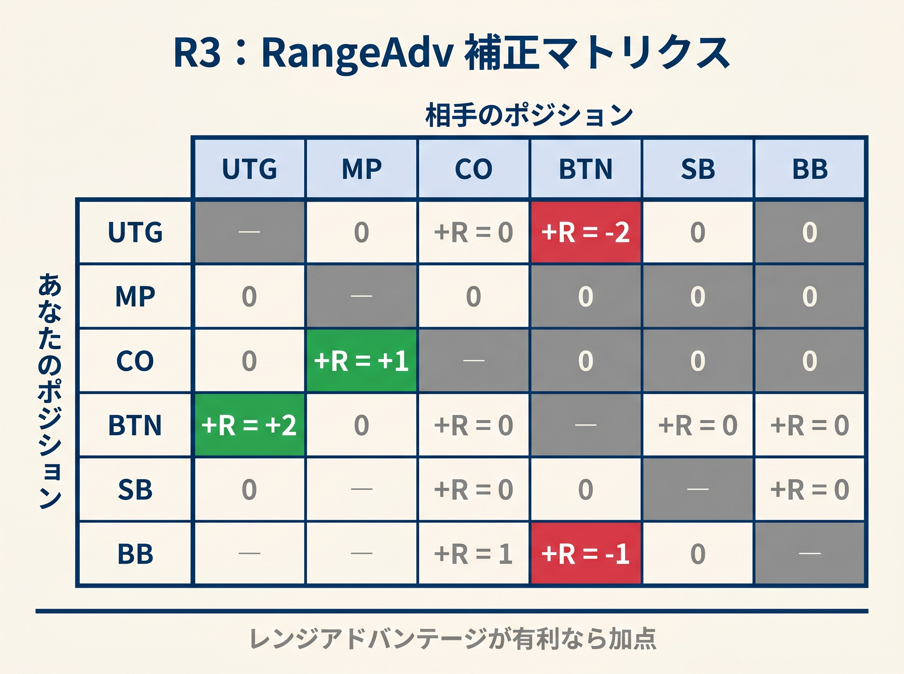
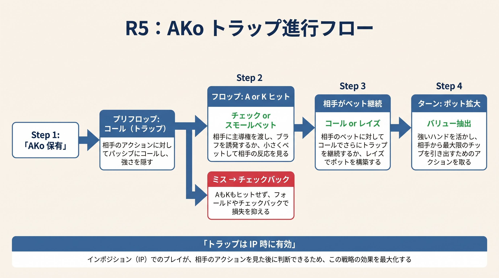
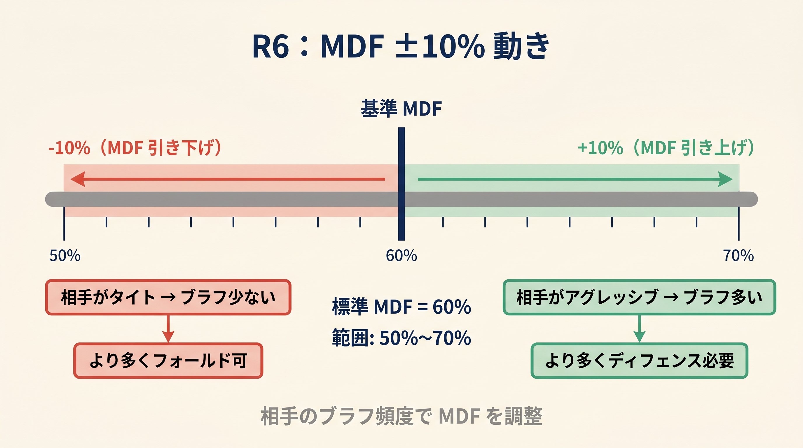

# 第21章　固定を揺らす ― 境界での混合戦略

<!-- markdownlint-disable MD036 MD060 -->
<!-- textlint-disable preset-ja-technical-writing/no-mix-dearu-desumasu -->

> **本章の目標**: 第5章〜第20章で学んだ「単一しきい値による0/1判断」を拡張し、境界付近で意図的に判断を揺らす5つのルールを習得します。暗算可能な整数演算のまま、搾取されにくいプレイに近づけます。

第20章までで、本書のプリフロップ判断フレームはひとつの完成形に達しました。基本スコア式とポジション別しきい値で、初心者〜中級者の多くのミスを防ぐことができます。

しかし、ひとつ根本的な問題が残っています。**「境界で常に同じ行動をする」ことは、賢い相手に搾取されます**。

本章では、この問題を解決するための5つのルールを導入します。いずれも暗算可能な整数演算で、これまでの式を「置き換え」るのではなく「上乗せ」するものです。

---

<figure><figcaption>スコア≥26（バンドA）/ 20-25（バンドB）/ <20（バンドC）の3バンド分類図</figcaption></figure>

<figure><figcaption>♠♥（メジャー）vs ♣♦（マイナー）のスーツ補正比較図</figcaption></figure>

<figure><figcaption>ポジションマッチアップ別RangeAdv補正値マトリクス（+2〜-2）</figcaption></figure>

<figure><figcaption>AKoでのトラップ進行（プリフロップコール→フロップチェック→ターンバリュー）フロー図</figcaption></figure>

<figure><figcaption>相手のアグレッシブ度に応じたMDF±10%調整範囲スライダー図</figcaption></figure>

## 21-1 なぜ境界で混合するのか

### 決定論が読まれる構造

本書の判断ルールは「スコアがしきい値を超えたらオープン、未満ならフォールド」という**決定論的**なものです。これは学習コストを下げる上で正しい設計ですが、熟練した相手には弱点になります。

**事例1：UTGの3ベット境界がバレる**

あなたが常に同じスコア式で3ベットを判断するとします。BTN vs UTGのT_3betしきい値は32です。AKo（スコア32）は常に3ベット、KQs（スコア31）は常にコール。この一貫性は、観察力のある相手に数百ハンドで読まれます。「あの人はAKo以上で3ベットしてくる」と学習されると、相手は4ベットレンジをそれに最適化します。AKo以上の3ベットに対してタイトに4ベットすれば、あなたのバリュー3ベットだけを搾取できます。

**事例2：BTNスチールのフォールドラインがバレる**

BTNで毎回スコア18以上を開き、17以下は全フォールドするとします。あなたがBTNからフォールドするタイミングを数回観察した相手は「18を下回るハンドは持っていない」と確信します。すると、あなたの3ベット頻度が上がり、BTNオープンに対してブラフ3ベットを乱用してきます。

これらの問題に共通するのは「**境界付近のハンドが100%の確率で同じ行動をとる**」という予測可能性です。

### 混合戦略の直感的な意味

GTOが推奨する混合戦略は、同一のハンドを「何%の確率でアクションA、残りをアクションB」と実行します。たとえばGTO Wizardが「A5sをBTN vs UTGで60%3ベット・40%コール」と言うとき、これはその場の文脈や乱数で行動を変えることを意味します。

問題は、この「乱数生成」を暗算で実行できないという点です。サイコロを持ち歩いたり、スマートフォンのランダム関数を呼んだりするわけにはいきません。

本章の解決策は次の通りです。

**「真の乱数ではなく、ハンド自体が持つ視覚情報（スート）を疑似乱数として使う」**

この方法は、個々のハンドを見ただけで行動が決まるため暗算不要です。しかし、169種類のハンド全体でレンジを俯瞰すると、アクションとパスが半々に分散します。相手があなたのパターンを読むためには、手札をすべて知る必要があり、現実的に不可能です。

---

## 21-2 3バンド化：しきい値を帯に広げる（R1）

### R1の定義

従来の判断は「しきい値T以上ならアクション、未満なら受動」の2値でした。R1では、この境界に**5点幅の混合ゾーン（T±2）**を設けます。

```text
Score ≥ T+3           → 強バンド（100%アクション）
T−2 ≤ Score ≤ T+2    → 混合ゾーン（R2で決定）
Score ≤ T−3          → 弱バンド（100%受動）
```

- **強バンド**：しきい値より3以上高い。スコアの余裕があるので迷わず実行
- **混合ゾーン**：しきい値の±2の幅。ここでR2（スート判定）を使う
- **弱バンド**：しきい値より3以上低い。スコアが足りないので迷わずパス

T は既存の T_open（UTG=24, HJ=22, CO=20, BTN=18, SB=22）をそのまま使います。

### ポジション別 3 バンド表

オープンレイズの場合（T_open に ±を適用）。

| ポジション | T_open | 弱バンド（スコア） | 混合ゾーン | 強バンド |
|-----------|---|-----------------|-----------|---------|
| UTG | 24 | ≤21 | 22〜26 | ≥27 |
| HJ | 22 | ≤19 | 20〜24 | ≥25 |
| CO | 20 | ≤17 | 18〜22 | ≥23 |
| BTN | 18 | ≤15 | 16〜20 | ≥21 |
| SB | 22 | ≤19 | 20〜24 | ≥25 |

たとえば UTG でスコア 23 のハンドは、決定論ルールでは「24 未満なのでフォールド」と一律に判断されます。R1 のもとでは「混合ゾーン」に入るため、次節の R2 で最終判断を下します。

3-bet の場合は二段閾値 (T_3bet / T_call) がすでに「強・混合・弱」の 3 段階を実現しているので、追加の R1 表は不要です。Score < T_call が弱バンド、T_call ≤ Score < T_3bet が混合ゾーン、Score ≥ T_3bet が強バンドに対応します。

### 既存ルールとの互換性

R1を使わない場合、引き続き従来のTで判断して構いません。強バンドと弱バンドは従来の判断と完全に一致しており、変化するのは混合ゾーンのみです。本書の基本ルールを「ベースライン」として、R1〜R6は上位オプションという位置づけです。

---

## 21-3 暗算でミックスする：スート判定ルール（R2）

### R2の定義

混合ゾーンに入ったハンドは、**ハンドの左側カード（高い方）のスートで行動を決定**します。

```text
♠（スペード）または ♥（ハート）  → アクション側（ベット／3ベット／オープン）
♣（クラブ）または ♦（ダイヤ）   → 受動側（チェック／コール／フォールド）
```

「高い方のカード」とは、2枚のカードのうち数字が大きい方です。同じ数字（ペア）の場合は、左手で持っているカードを基準にしても構いません。

### なぜ「高い方のカードのスート」なのか

2つの理由があります。

第一に、**高い方のカードは常に明確**です。どちらが高いカードかを迷うことはありません。KTsならKが高い方、JJなら両方が同じ数字なので左手側を基準にするという規則も一貫しています。

第二に、**恣意性を排除できます**。「好きな方のスートで決めてよい」とすると、人は無意識にアクション寄りの判断をします。「必ず高い方のカードのスート」と固定することで、自分の感情バイアスを入れる余地をなくせます。これが疑似乱数として機能する重要な前提です。

### 具体例

**例1：JJ（スコア32）**

スコア32はBTNしきい値18の強バンド（18+2=20以上）なので、R2は不要。スートに関わらず100%オープンです。

**例2：UTGでK9o（スコア23）**

UTGのしきい値24。混合ゾーンは22〜26。スコア23は混合ゾーンに入ります。

- Kが♠または♥（スペードかハート）→ UTGからオープン
- Kが♣または♦（クラブかダイヤ）→ UTGではフォールド

同じK9oでも、スートによって行動が変わります。

**例3：BTNで7♠6♥（スコア13）**

BTNしきい値18の弱バンドは15以下。スコア13は弱バンドなのでフォールドです。R2は不要。

**例4：BTNでJ♣T♠（スコア22）**

BTNの混合ゾーンは16〜20。スコア22は強バンドなのでオープン確定です。R2は不要。

---

## 21-4 レンジ優位を式に入れる：+R補正（R3）

### R3の定義

プリフロップスコア（共通式）に、**対戦相手のオープンポジションに基づくレンジ優位補正**を加えます。

```text
R（補正値）：
  +2 … 相手が強いレンジ（UTG/HJ）からオープン → 自分が3-bet するとき不利
  −2 … 相手が弱いレンジ（BTN）からオープン → 自分が3-bet するとき有利
   0 … CO/SB からのオープン（中程度）
```

プリフロップスコアに R を加算します。

```text
Score（修正）= プリフロップスコア + R
```

### 対オープン者別Rの一覧

| 相手のオープンポジション | レンジ強度（概算） | R値 |
|----------------------|----------------|-----|
| UTG | 最も強い（約15〜18%） | +2 |
| HJ | 強い（約21〜25%） | +2 |
| CO | 中程度（約25〜28%） | 0 |
| BTN | 広い（約40〜43%） | −2 |
| SB | 中程度（約18〜20%） | 0 |

R=+2 のときは「相手のレンジが強いので、より高いスコアがないとバリューにならない」という意味で、自分の修正後スコアを T_3bet / T_call と比較します。R=−2 はその逆で、修正後スコアが低くなり混合ゾーン (T_call 域) や 3-bet 域に入りやすくなります。

### 例題：BTN vs UTG オープンの 3-bet スポット

状況：UTG がオープン、あなたは BTN で KTs（プリフロップスコア = 28.5）を持っています。BTN vs UTG の T_3bet=32 / T_call=28。

R3 を適用します。相手は UTG なので R=+2。

```text
修正後スコア = 28.5 + 2 = 30.5
T_3bet=32, T_call=28
```

修正後スコア 30.5 は T_call=28 を超え T_3bet=32 に届かない → **コール**（T_call 域）。R3 で押し上げてもまだ 3-bet 域には届きません。

一方、A5s（プリフロップスコア = 25）の場合：

```text
修正後スコア = 25 + 2 = 27
```

T_call=28 にわずかに届かず、本書の決定論ルールでは**フォールド**。混合ゾーン（T_call 直下 ±2）として、上級者は R2 スート判定で 50% コール混合を導入できます。A♠/A♥ → コール、A♣/A♦ → フォールド。

### R3の理論的背景

GTO Wizard は、相手のオープンレンジが強いほどこちらの 3-bet レンジを絞ることを推奨します。UTG オープンに対する BTN の 3-bet 頻度は約 7.5%、BTN オープンに対する BB の 3-bet 頻度は約 12〜15% という差があります。

この差は「しきい値の変更」でも表現できますが、それでは相手ごとに 5 つのしきい値を覚えなければなりません。R3 の設計は「既存の T_3bet/T_call はそのまま、スコアだけを ±2 補正する」という形にすることで、暗算の単純さを保ちます。

---

## 21-5 BBディフェンスの揺らし

### BBの境界問題

第15章でBBのディフェンス頻度を学びました。実用 GTO（poker-coaching 6-max GTO チャート）が推奨する対BTNのBBディフェンス頻度は約 57%（13.4% 3bet + 43.4% call）です。しかし、どのハンドでコールし、どのハンドでフォールドし、どのハンドで3ベットするかは、単一の閾値では表現できません。

BBにはオープンレイズの概念がないため、「しきい値T」そのものはありません。代わりに、**対戦相手のオープン額とポットオッズ**がディフェンス判断の基準になります。

### BBのスコア式

BBでの判断は、基本スコア式を次のように応用します。

```text
BB_score = H + L + ボーナス − ペナルティ
```

これは第5章の基本スコア式と同じです。BBのスコアをポジション別の「対XX防御しきい値」と比較します。

| 相手のオープンポジション | BB defense T_3bet / T_call (Score_BB) | 根拠 |
|----------------------|-------------|------|
| 対 UTG | **34 / 24** | 相手レンジが強いため絞る |
| 対 HJ | **32 / 23** | 中程度の絞り |
| 対 CO | **28 / 22** | 相手レンジが広いため緩める |
| 対 BTN | **28 / 18** | BTN は最も広いため大幅緩め |
| 対 SB | **30 / 22** (HU) | SB-BB HU では幅広く守備 |

**対SBの防御しきい値について**：SBはリンプよりも3ベットかフォールドが基本（第15章参照）です。SBがリンプした場合、BBはほぼ全ハンドで確認（チェック）できます。問題はSBが完全オープンレイズした場合で、その際のBBは「対UTGより少し緩く、対COよりは絞る」ラインの16〜17程度が適切です。本書では16を基準にします。

### 3ベット・コール・フォールドの3バンド化

R1の考え方をBBのディフェンスに適用します。

対BTNオープンの場合（防御しきい値T=14）：

```text
Score ≥ 16（T+2）      → 3ベット候補（バリューまたはブラフ）
14〜15（T〜T+1）       → 混合ゾーン（R2でコールor3ベット判断）
10〜13（T−4〜T−1）    → コール
Score ≤ 9（T−5以下）  → フォールド
```

BBには「コール」というオプションが豊富にあるため、混合ゾーンは「コールか3ベット」の選択になります。弱バンドは「フォールド」です。

### ポットオッズとR3の統合

BB防御の場面でも、R3のレンジ優位補正を適用できます。対BTNのR=−2（BTNは広いレンジ）なので、スコアに−2を加えます。スコアが下がるということは、3ベット候補となるハンドが絞られ、コールでのディフェンスが主体になるという意味です。

対UTGの場合はR=+2でスコアが上がり、フォールドするハンドが増えます。これはGTOの推奨と一致しています。

---

## 21-6 強ハンドの一部チェック（R5）

### チェックレンジの保護とは

第12章のプリフロップスコア式は「強いハンドは常に3-bet」という決定論的な設計でした。AA、KK、QQ、AK はすべて積極的にアクションします。

しかし、GTOは**強ハンドの一部をチェック（コール側）にまわす**ことを推奨します。この理由は2つあります。

1. **チェックレンジを強化する**：チェック後のアクションにAAやKKが混じると、相手はあなたのチェックを「弱い手」と断定できなくなります
2. **スローイングのEV**：特にオフスートの強ハンドは、3ベットして大きなポットを作るより、コールでスタックを温存しつつポストフロップで罠をかける方が有利な場面があります

### R5の定義

| ハンド | スーテッド | オフスート |
|-------|-----------|-----------|
| AA〜QQ | 100%3ベット | **20%コール（チェック・スロープレイ）** |
| AK | 100%3ベット | **50%コール（トラップ候補）** |

スーテッドはドロー価値が高いので3ベットで価値を最大化します。オフスートは絵牌の価値が中心で、ポストフロップでも十分に強いので一部をコールに回します。

### なぜAKオフスートは50%コールなのか

AKoは最強クラスのハンドですが、以下の3つのスポットでコールが有効です。

**スポット1：相手がタイトな3ベットに対して4ベットしてくる可能性が低い場面**

あなたがBBでAKoを持ち、BTNがオープン。SBがスクイーズ3ベット。ここでAKoをコールすると、BTNとSBの3人（もしくはBTNが降りてSBとの2人）でポストフロップに進めます。SBの3ベットレンジにAQs、KQsなどが多い場合、AKoはドミネートしており、コールで多くのEVを回収できます。

**スポット2：UTGが強いレンジで3ベットしてきた場面**

UTGが3ベットするとき、そのレンジはQQ+、AKs中心です。あなたがAKoで4ベットすると、相手はAAs/KKsで5ベットオールインできます。コールで3ベットポットに入り、フロップでAかKが落ちた際に大きく取る方が、5ベットシナリオを回避できます。

**スポット3：相手がブラフ3ベット頻度の高いLAGのとき**

LAGの3ベットに対してAKoで4ベットすると、相手のブラフが全降りします。コールで呼び込み、フロップで相手のコンティニュエーションベットを誘う方が、大きなポットを作れます。

### R5とR2の組み合わせ

R5はAA〜QQとAKoの「一部チェック（コール）」比率を定めます。具体的なハンドごとに適用する際、R2のスート判定を利用できます。

「AAoの20%をコールにまわす」という代わりに、「AA♣♦（クラブまたはダイヤのAA）はコール、AA♠♥はいつも通り3ベット」と読み替えれば、確率比率はおよそ50:50になります。計画書では20%としていますが、スート判定を疑似乱数として使う場合は50:50になります。厳密な20%を再現するには、別途ルーチンが必要です。

本書では、実用的な近似として「♣♦のAA〜QQはコール候補」と覚えておきましょう。これは50%コールになりますが、GTOの20%より多めでもEVは大きく変わりません（暗算の単純さを優先）。

---

## 21-7 MDFラインの揺らし（R6）

### MDFの復習

MDF（英語: Minimum Defense Frequency、最低防御頻度）は「相手のベットに対してフォールドしすぎるとブラフを許してしまう」限界値です。

```text
MDF = 1 − ベット額/（ポット + ベット額）
```

たとえば相手がポットサイズ100BBのポットに対して50BBベット（ポットの50%）してきた場合：

```text
MDF = 1 − 50 / (100 + 50) = 1 − 50/150 ≒ 67%
```

67%以上のハンドでコール（もしくは3ベット）しないと、相手のブラフが利益を出します。

### R6の定義

基本のMDFを計算した後、相手のプレイスタイルに応じて±10%補正します。

```text
相手がバリュー寄り（頻度低いベット、大サイズ、ブラフが少ない）
  → MDF −10%（より多くフォールドしてよい）

相手がブラフ寄り（連続ベット、小サイズ繰り返し、LAG傾向）
  → MDF +10%（より広くディフェンスが必要）

判断つかず
  → 基本のMDFをそのまま使用
```

### 相手タイプの判定

第14章で学んだVPIP/PFRによる分類を使います。

| VPIP | PFR | タイプ | MDFへの影響 |
|------|-----|--------|-----------|
| 10〜20% | 高い | TAG / ロック | −10%（バリュー寄り） |
| 25〜35% | 高い | LAG | +10%（ブラフ寄り） |
| 35%以上 | 低い | コーラー | −10%（ブラフしない） |
| 不明 | 不明 | 不明 | 補正なし |

### 実戦でのR6の使い方

たとえばポットベット（100%）に直面した場合の基本MDFは50%です。

- 相手がLAG（VPIP30%、PFR25%）なら +10% → MDF60%
- 相手がロック（VPIP15%、PFR13%）なら −10% → MDF40%

MDF40%とは「60%フォールドしてよい」という意味です。ロックの大型ベットはほぼバリューなので、かなり多くフォールドして構いません。

実際のハンド選択への影響は「手持ちのコール候補を強い順に並べ、MDF分だけ上位を残す」という形です。100BBポットへの50BBベット、MDFが60%の場合、あなたのレンジの上位60%だけコールし残り40%はフォールドします。

---

## 21-8 境界ハンド20例（Before → After）

R1〜R6を統合した判断を、代表的な20の境界スポットで確認します。各行の列は「ハンド / ポジション / 旧判定 / 新バンド判定 / スート別挙動」です。

| # | ハンド | 状況 | プリフロップスコア | 本書判定 | バンド | スート♠♥ | スート♣♦ |
|---|-------|------|-------|------|-------|---------|---------|
| 1 | A9o | UTG オープン | 26 | オープン (T_open=24) | 強バンド | オープン | オープン |
| 2 | A9o | HJ オープン | 26 | オープン (T_open=22) | 強バンド | オープン | オープン |
| 3 | KTs | UTG オープン | 28.5 | オープン | 強バンド | オープン | オープン |
| 4 | QJs | UTG オープン | 27 | オープン | 強バンド | オープン | オープン |
| 5 | JTs | CO オープン | 25 | オープン (T_open=20) | 強バンド | オープン | オープン |
| 6 | T9s | BTN オープン | 23 | オープン (T_open=18) | 強バンド | オープン | オープン |
| 7 | 98s | CO オープン | 21 | オープン (T_open=20) | 強バンド | オープン | オープン |
| 8 | 98s | HJ オープン | 21 | フォールド (< 22) | 混合ゾーン | オープン | フォールド |
| 9 | A5s | BTN vs UTG 3-bet | 25 (+2=27) | フォールド (< T_call=28) | 混合ゾーン | 3-bet | コール |
| 10 | KTs | BTN vs UTG 3-bet | 28.5 (+2=30.5) | コール (T_call 域) | 混合ゾーン | 3-bet | コール |
| 11 | A5s | SB vs BTN 3-bet | 25 (−2=23) | フォールド (< 24) | 混合ゾーン | 3-bet | コール |
| 12 | QTs | CO vs HJ 3-bet | 25.5 (+0=25.5) | フォールド (< 28) | 弱バンド | フォールド | フォールド |
| 13 | KQo | SB vs BTN 3-bet | 28 (−2=26) | 3-bet (≥ 24) | 強バンド | 3-bet | 3-bet |
| 14 | JTo | BTN オープン | 22 | オープン | 強バンド | オープン | オープン |
| 15 | T8s | BTN オープン | 21.5 | オープン (T_open=18) | 強バンド | オープン | オープン |
| 16 | 65s | BTN オープン | 14 | フォールド（補助 SC で IP 限定 CALL） | 弱バンド | フォールド | フォールド |
| 17 | AAo | BTN vs CO 3-bet | 41 | 4-bet (≥ T_4bet=33) | — | 4-bet | 4-bet（R5: 一部 call 可）|
| 18 | AKo | CO vs UTG 3-bet | 32 | 3-bet 受け CALL (< T_4bet=33) | — | 3-bet | コール（50% 混合可）|
| 19 | 77 | UTG オープン | 24 | オープン (= T_open) | 混合ゾーン | オープン | フォールド |
| 20 | 88 | UTG オープン | 26 | オープン | 強バンド | オープン | オープン |

**注意事項**：

- #9〜#13はR3を適用したスコアを示します。カッコ内が補正値です
- #17〜#18はR5の適用例です。バンド判定ではなくスーテッドかオフスートかで行動が変わります
- #19の77はスコア24でUTGのしきい値23を1点上回る。R1では混合ゾーン（22〜25）に入ります

---

## 21-9 練習問題（10問）

R1〜R6を実際に使う練習です。前半5問はR1/R2、後半5問はR3〜R6の統合問題です。

---

### 問1

UTGでA3s（スコア23）を持っています。R1とR2を適用した場合、手の左側カードのスートが♥のとき、どのように判断しますか。

**しきい値**：UTG = 24

**解答**

UTGの3バンド：弱バンド≤21、混合ゾーン22〜26、強バンド≥27。

スコア23は混合ゾーンに入ります。A（高い方のカード）のスートが♥なのでアクション側。**UTGからオープンします**。

♣か♦であればフォールドです。

---

### 問2

BTNでT9o（スコア20）を持っています。R1を適用した場合、何バンドに入りますか。

**しきい値**：BTN = 18

**解答**

BTNの3バンド：弱バンド≤15、混合ゾーン16〜20、強バンド≥21。

スコア20は混合ゾーンに入ります。T（高い方のカード）のスートが♠または♥なら**BTNオープン**、♣または♦なら**フォールド**です。

---

### 問3

HJ で 77（プリフロップスコア 24）を持っています。R1 を適用すると何バンドですか。また R2 を使う必要はありますか。

**しきい値**：HJ T_open=22

**解答**

HJ の 3 バンド：弱バンド≤19、混合ゾーン 20〜24、強バンド≥25。

スコア 24 は混合ゾーンです（24 は 20-24 の上限値）。本書の決定論ルールでは「Score ≥ T_open=22 で開ける」のでオープンですが、R1 では混合ゾーンに入り R2 を適用する必要があります。

7♠/7♥ → オープン、7♣/7♦ → フォールドという混合戦略になります。

---

### 問4

CO で K9s（プリフロップスコア = 13+9+3+2−1 = 26）を持っています。R1 でのバンドを判断し、R2 が必要な場合は適用してください。手の左側カードのスートは K♦ です。

**しきい値**：CO T_open=20

**解答**

CO の 3 バンド：弱バンド≤17、混合ゾーン 18〜22、強バンド≥23。

スコア 26 は強バンドです。**スートに関わらず CO オープン確定**。K♦ でもオープンです。

---

### 問5

UTG で 77（プリフロップスコア = 24）を持っています。R1 適用後、7 のスートが♣（クラブ）でした。R2 を適用するとどうなりますか。

**しきい値**：UTG T_open=24

**解答**

UTG の混合ゾーンは 22〜26。スコア 24 は混合ゾーンの中央値です。

高い方のカードである 7（ペアなので片方）のスートが♣。これは受動側（♣♦）なので**フォールドです**。

77 は決定論ルール（R1 なし）では「T_open=24 ちょうどでオープン」ですが、R1 適用後は混合ゾーンに入り、スートによってフォールドすることがあります。これが「境界を揺らす」効果です。

---

### 問6

BTN で A4s（プリフロップスコア = 14+4+3+3 = 24、A 含むのでギャップペナルティ免除）を持っています。UTG がオープンしてきました。R3（+R 補正）を適用した場合、スコアはいくつになりますか。また BTN vs UTG の T_3bet=32 / T_call=28 と比較してどうなりますか。

**解答**

相手は UTG なので R=+2。

```text
修正後スコア = 24 + 2 = 26
T_3bet=32, T_call=28
```

修正後スコア 26 は T_call=28 にわずかに届きません。本書の決定論ルールでは**フォールド**。混合ゾーン（T_call 直下 ±2）として、上級者は R2 スート判定で 50% コール混合を導入できます。A♠/A♥ → コール、A♣/A♦ → フォールド。

---

### 問7

BB で K8s を持っています。Score_BB を計算し、BTN オープンに対する判定を求めてください。R3 (R=−2) も適用します。

**解答**

K8s の Score_BB = 13 + 8 + 6 (BB suited+6) + 0 (差5、conn 範囲外) + 2 (Kブロッカー) − 1 (差4以上ペナルティ、A 免除なし) = 28

R=−2 を適用：28 + (−2) = **26**。

BB vs BTN の T_3bet=28 / T_call=18。修正後スコア 26 は T_3bet=28 にわずかに届かないので **コール**（T_call 域）。R3 補正で 3-bet を押し戻し、コールに振り直す例。

---

### 問8

あなたは BB で Q7o（Score_BB = 12+7−1 (差5 で差4以上ペナルティ) = 18）を持っています。UTG が 3bb オープンしてきました。R3（対 UTG R=+2）を適用し、BB vs UTG の T_3bet=34 / T_call=24 と比較してください。

**解答**

対 UTG の R=+2 を適用。

```text
修正後 Score_BB = 18 + 2 = 20
T_3bet=34, T_call=24
```

修正後スコア 20 は T_call=24 にも届かない → **フォールド**。混合ゾーンには入らず、決定論的に降りる。

注：実戦で「ポットオッズ + 例外2 (suited 差≤4)」のような補助ルールが効くスポットでは別判断になりますが、Q7o offsuit はそれらに該当しません。

---

### 問9

相手がLAG傾向（VPIP32%、PFR26%）です。相手がポットの75%ベット（ポット100BB、ベット75BB）をしてきました。基本のMDFを計算し、R6を適用した最終のMDFを求めてください。

**解答**

基本のMDF：

```text
MDF = 1 − 75 / (100 + 75) = 1 − 75/175 ≒ 57%
```

相手はLAG傾向なのでブラフ寄り。R6の+10%補正を適用。

```text
最終のMDF = 57% + 10% = 67%
```

あなたはレンジの上位67%でディフェンス（コールまたは3ベット）する必要があります。33%だけフォールドできます。

---

### 問10

あなたはBBでAKo（スコア32）を持っています。BTNがオープンし、SBが3ベット。R5を適用した場合、どのような行動選択肢がありますか。またAKoがオフスートの場合のR5の推奨は何ですか。

**解答**

AKoはオフスートです。R5によれば**AKオフスート = 50%コール（トラップ候補）**です。

スート判定を使う近似として、Aのスートで判断します。A♠またはA♥なら4ベット（アクション側）、A♣またはA♦ならコール（受動側・トラップ）です。

コールを選んだ場合、ポストフロップでSBのコンティニュエーションベットに対して積極的に反撃できます。SBの3ベットレンジにAQs、KQs、QQなどが混じっていれば、AKoはドミネートしており大きなEVがあります。

---

## 21-10 【GTOとのズレ】第21章版

### 本章の修正でどれくらいGTOに近づくか

本章のR1〜R3・R5・R6を導入することで、第5章〜第20章の単純スコア式が持っていたGTOとのズレが**部分的に縮まります**。

**改善が見込まれる点**

1. **境界ハンドの頻度ズレが半減する**：R1とR2で混合ゾーンを設けると、境界ハンドは50%の確率でアクションし、50%でパスします。GTOが推奨する「40〜60%の混合」に、これは有意に近い近似です。

2. **3ベットレンジの歪みが縮まる**：R3で対UTG/BTNのR補正を入れると、相手ポジションに応じた3ベット頻度が変化します。GTO Wizardの推奨頻度（対UTG約7.5%、対BTN約12%）との乖離が減ります。

3. **チェックレンジが強化される**：R5でAAやAKoの一部をコールに回すと、相手はあなたのコールに対して機械的なブラフベットを打ちにくくなります。ポストフロップのEV損失を減らせます。

**残るズレ**

本章の修正後も、以下のズレは残ります。

- **頻度の粒度が粗い**：スート判定による疑似混合は50:50固定です。GTOが推奨する37:63や45:55という細かい頻度は再現できません。

- **多次元性の欠落**：GTOのミックス戦略は、スタック深度・ポットサイズ・相手の3ベットレンジ・ポジションをすべて同時に評価します。本書のR1〜R6はこれを1変数ずつ独立に近似しており、相互作用を無視しています。

- **個別ハンドの精度**：170種のハンド全体でレンジとして見れば近似精度は高まりますが、特定のハンド（たとえばJTs♦♣のBTNオープン判断）ではGTOと逆の行動をとる場合があります。

**どこまで許容するか**

本書のアプローチは「暗算可能な近似で、致命的なミスを除く」という哲学に基づいています。R1〜R6をすべて適用した後も、GTOとのEVギャップは存在します。しかし、そのギャップは「相手が完璧にあなたを搾取できる場合」にのみ問題になります。

マイクロステークスやミドルステークスの多くの相手は、あなたのスート判定パターンを解析する能力を持っていません。実戦での期待値は、GTOとの理論的ギャップより、テーブル全体の相手の誤りから得る利益の方が圧倒的に大きいのです。

**次のステップ**

本章のルールに慣れたら、以下の順序で学習を深めることを推奨します。

1. GTO WizardやGTOBaseの無料ハンド分析で、境界ハンドの推奨頻度を確認する
2. 特定のスポット（たとえば「BTN vs UTGでのA5s」）に絞って、GTOの混合比率を暗記する
3. より細かい頻度調整が必要と感じたら、ソルバー学習（第20章のロードマップ参照）へ進む

本書は「計算で判断する習慣」を作るための入口です。R1〜R6は、その習慣を持ったプレイヤーが次のレベルに向かう橋渡しです。

---

## 章のまとめ

- 決定論的な0/1判断は、賢い相手に頻度を読まれて搾取される
- **R1（3バンド化）**：しきい値T±2で混合ゾーンを設ける。強バンドと弱バンドは従来の判断と一致する
- **R2（スート判定）**：混合ゾーンでは高い方のカードのスートで行動を決定する。♠♥はアクション側、♣♦は受動側
- **R3（+R 補正）**：プリフロップスコアにレンジ優位補正を加える。対 UTG/HJ は +2、対 BTN は −2、対 CO/SB は 0
- **R5（チェックレンジ保護）**：AAoはスート判定でコール候補に、AKoは50%コール（スート判定で近似）
- **R6（MDF±10%）**：相手がブラフ寄りなら+10%、バリュー寄りなら−10%の補正をMDFに加える
- BBディフェンスは対ポジション別防御しきい値と3バンド化で判断する。対SBの防御しきい値は16
- 全ルールは独立に使える。最初はR1だけ覚え、慣れたらR3、R5、R6と段階的に導入してよい
- これらの修正後もGTOとの頻度ズレは残る。実戦では相手の誤りからの利益が理論ギャップを上回る

---

## ミニクイズ

### 問A

UTGでA8o（スコア25）を持っています。R1を適用した場合、何バンドに入りますか（UTGしきい値24）。

1. 強バンド（オープン確定）
2. 混合ゾーン（R2で判断）
3. 弱バンド（フォールド確定）

---

### 問B

R2（スート判定）で「受動側（チェック・コール・フォールド）」に対応するスートの組み合わせはどれですか。

1. ♠と♥
2. ♣と♦
3. ♠と♣

---

### 問C

対BTNの3betスポットでR3のR値（+R補正値）はいくつですか。

1. +2
2. 0
3. −2

---

### 解答

- **問A**：2（混合ゾーン。22〜26がUTGの混合ゾーン）
- **問B**：2（♣と♦が受動側）
- **問C**：3（BTNは広いレンジなのでR=−2。スコアが下がり3ベット基準が下がる）

---

> **次章への接続（第22章）**: 本章の R1〜R6 は「境界付近の決定論的パターンを崩す」という目的で設計されました。しかし、オープン判断の GTO 一致率は依然 89.5% に留まります。
> 第22章では、この残りの 10.5% を「5 つの名前付き補正」で体系的に解消します。スコア式を書き換えずに名前付きカテゴリルールを上乗せするアプローチで、GTO 一致率を 94.6% に引き上げます。さらにポジション別例外表を加えると 100% 一致に到達します。

## 出典

- GTO Wizard『Preflop Range Morphology』（2024）
- GTO Wizard『MDF & Alpha: When to Continue vs. Bets』（2024）
- Upswing Poker『3-Bet Preflop Strategy & Range Charts』（2024）
- GTOBase『GTO Solutions 6-max Cash Library』
- SplitSuit Poker『Understanding 3-Bet Ranges In 2026』
- PokerCoaching『How to Balance Your Checking Range』
- Raise Your Edge『Mixed Strategies and GTO Approximation』
