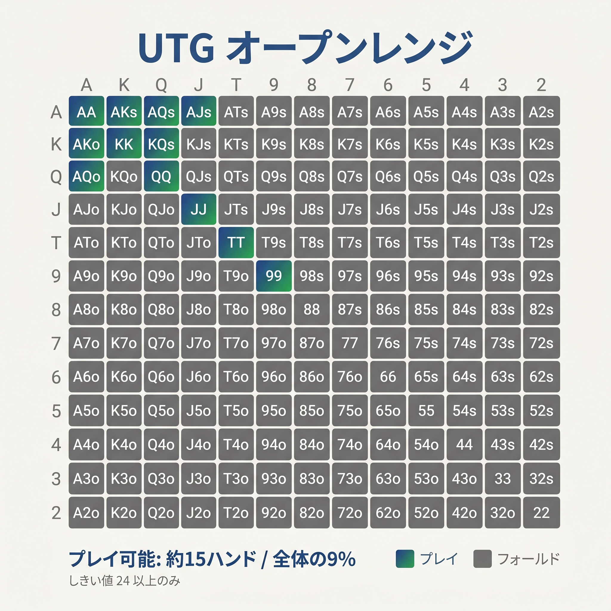
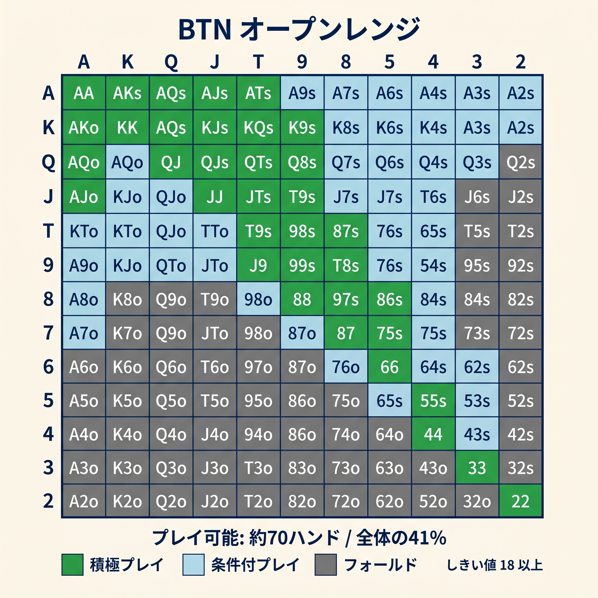
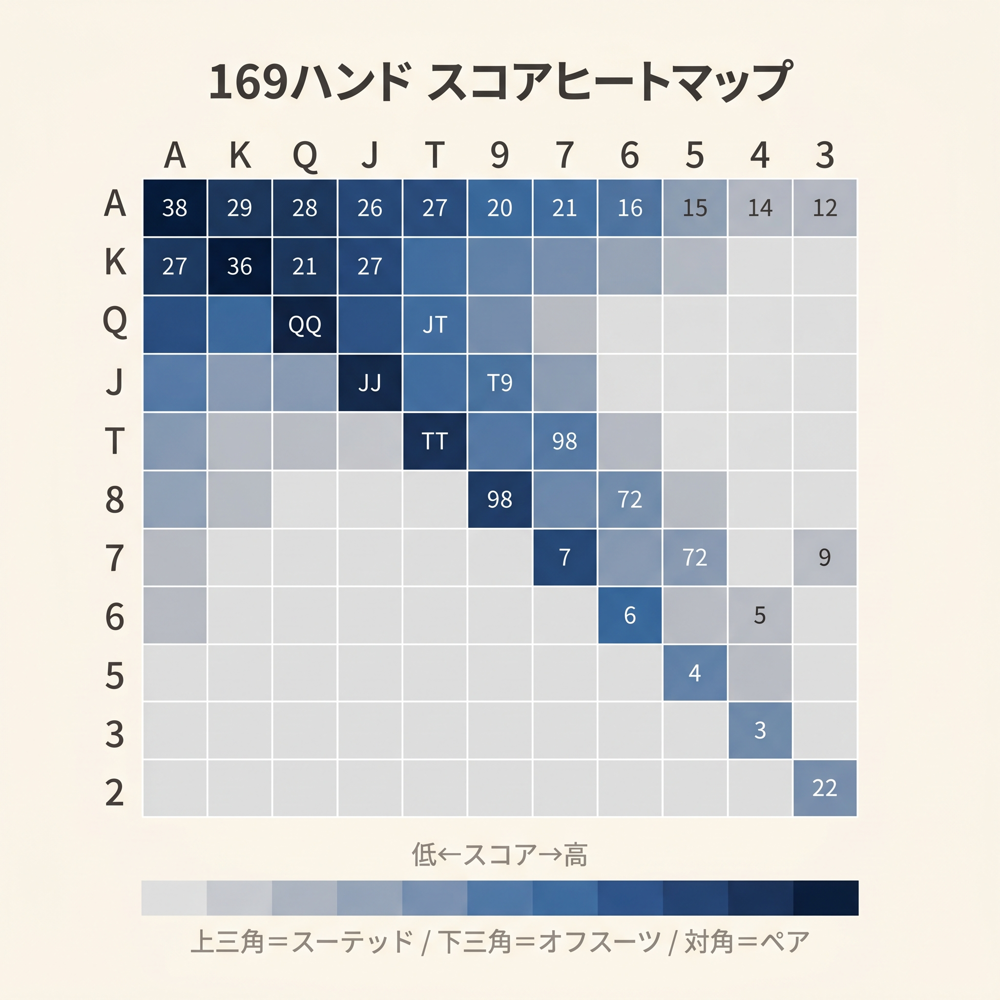
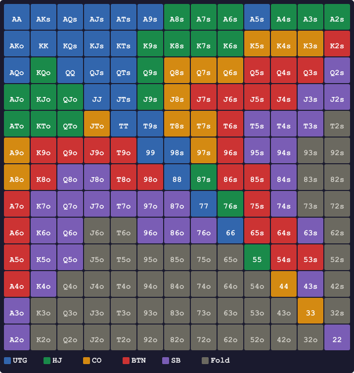
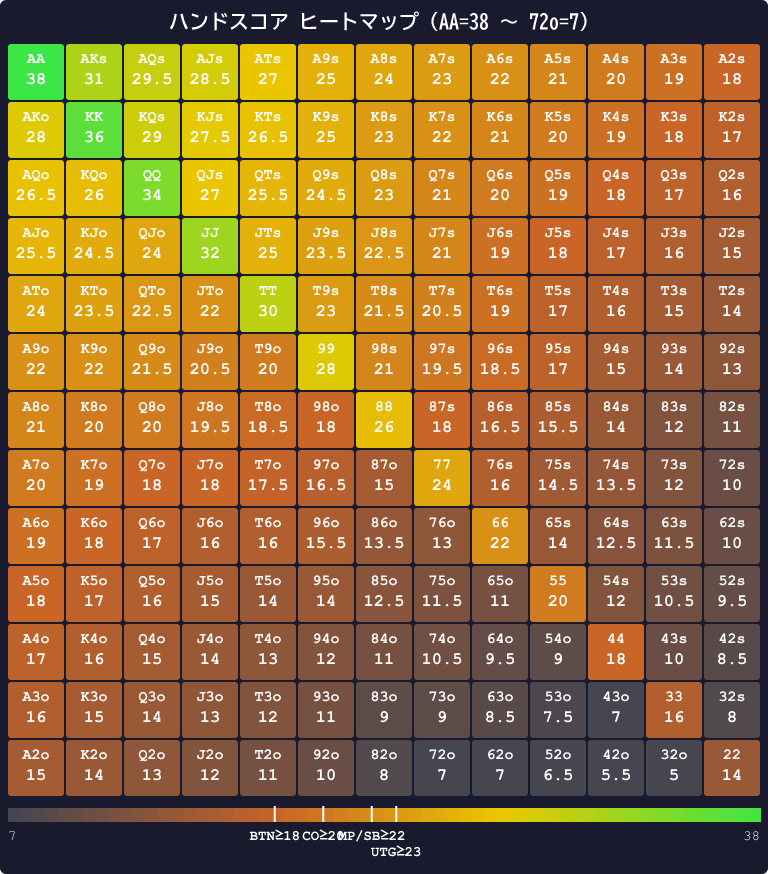

# 付録

<!-- markdownlint-disable MD036 MD060 -->
<!-- textlint-disable preset-ja-technical-writing/no-mix-dearu-desumasu -->

本書の本文で扱った内容を、実戦時に即参照できる形にまとめた資料集です。

---

<figure><figcaption>しきい値23基準のUTGオープンレンジを色分けした13×13マトリクスチャート</figcaption></figure>

<figure><figcaption>しきい値18基準のBTNオープンレンジを色分けした13×13マトリクスチャート（全体の41%）</figcaption></figure>

<figure><figcaption>169ハンドのスコア値を濃淡で示すヒートマップマトリクス（AA=38〜72o=9）</figcaption></figure>

## 付録0　参考文献（References）

本書の執筆・設計にあたり参照した主要な文献・ツール・ウェブ記事を分野別に列挙します。

### 書籍

- **Bill Chen & Jerrod Ankenman** *The Mathematics of Poker* (Conjelco, 2006)
- **Matt Janda** *Applications of No-Limit Hold'em* (DailyVariance, 2013)
- **Michael Acevedo** *Modern Poker Theory* (D&B Publishing, 2019)
- **David Sklansky** *The Theory of Poker* (Two Plus Two Publishing, 1999)
- **Ed Miller** *Professional No-Limit Hold'em* (Two Plus Two Publishing, 2007)
- **Jonathan Little** *Excelling at No-Limit Hold'em* (D&B Publishing, 2015)

### ウェブ / ツール

- **GTO Wizard** — <https://gtowizard.com/>（主要データ出典、有料プラン推奨）
- **Upswing Poker Blog** — <https://upswingpoker.com/blog/>
- **PokerCoaching.com (Jonathan Little)** — <https://pokercoaching.com/>
- **Run It Once Training** — <https://www.runitonce.com/>
- **SplitSuit Poker** — <https://www.splitsuit.com/>

### 姉妹編（本シリーズ）

- 川西智也『迷わないポーカー② フロップ[基礎]』（2026）
- <https://cuzic.github.io/poker-books/flop/>
- 川西智也『迷わないポーカー③ フロップ[応用]』（2026）
- <https://cuzic.github.io/poker-books/flop-advanced/>

### 謝辞

本書はこれらの公開データと先行書籍の蓄積なしには成立しえません。特にGTO Wizardの膨大な分析データ、Upswing Pokerのレンジ解説、Jandaのレンジ思考の体系化には大きな影響を受けています。

---

## 付録A　ポジション別オープンレンジチャート（6-max 100BB）

本書のスコア式とGTO推奨を併記したチャートです。

### UTG（しきい値 23）

**オープン対象**：

- ペア：77+（スコア24以上）
- スーテッド：AKs、AQs、AJs、ATs、KQs、KJs、KTs、QJs、JTs、A9s
- オフスーツ：AKo、AQo、AJo（境界）

**特徴**：最もタイト。スコア24以上のハンドのみ。

### MP（しきい値 22）

UTGのハンドに加えて：。

- ペア：66（スコア22）
- スーテッド：A8s、K9s、QTs、T9s、98s（スコア境界）
- オフスーツ：ATo、KQo

**特徴**：UTGから少し緩める。「66とQTs、T9s、ATo」が加わる。

### CO（しきい値 20）

MPのハンドに加えて：。

- ペア：55（スコア20）
- スーテッド：A7s〜A2s、K8s、Q9s、J9s、T9s、87s、98s
- オフスーツ：A9o、KJo

**特徴**：COはステーション席。広めに開く。

### BTN（しきい値 18）

COのハンドに加えて：。

- ペア：44（スコア18）、33〜22（補助ルールで追加）
- スーテッド：K2s〜K7s、Q2s〜Q8s、J2s〜J8s、65s、54s（補助ルール）
- オフスーツ：K9o、QTo、JTo、98o、A2o〜A9o

**特徴**：最も広い。GTO的には43〜51% のハンドを開く。

### 補助ルール（BTN限定の例外）

本書のスコア式は、BTNにおける以下のハンド群を**過小評価**する傾向があります。これらはGTOではBTNから開くのが標準なので、**BTN 限定で例外的にオープン対象に追加**します。

- **小ペア（22〜33）**：スコア14〜16だがBTNではオープン
- **下位スーテッドコネクター（65s、54s）**：スコア11〜13だがBTNではオープン
- **スモール・スーテッドエース（A2s〜A5s）**：スコアが低くてもブロッカー効果でBTNオープン可

判断に迷う場合は「BTNでは22+ / スーテッド全般 / Axs全般はオープン」と覚えておけば実用上問題ありません。

### SB（しきい値 22、特殊）

SBは「3ベットかフォールド」が基本（第15章参照）。オープンする場合の目安：。

- ペア：55+
- スーテッド：A2s+、K8s+、Q9s+、JTs、T9s
- オフスーツ：AJo+、KQo

**特徴**：CO相当のレンジでレイズ、コールは限定的。

### BB

BBは**対オープンの対応のみ**（プリフロップでオープンの機会はない）。

<figure><figcaption>プリフロップ RFI レンジテーブル — ポジション別オープンレンジを13×13マトリクスで可視化</figcaption></figure>

---

## 付録B　169ハンド × スコア早見表

本書の基本スコア式（オープン判断用）でスコアを計算した主要ハンドの表です。

### ペア（13種）

| ハンド | スコア | 開けるポジション |
|--------|-------|----------------|
| AA | 38 | 全ポジション |
| KK | 36 | 全ポジション |
| QQ | 34 | 全ポジション |
| JJ | 32 | 全ポジション |
| TT | 30 | 全ポジション |
| 99 | 28 | 全ポジション |
| 88 | 26 | 全ポジション |
| 77 | 24 | UTG〜 |
| 66 | 22 | MP〜 |
| 55 | 20 | CO〜 |
| 44 | 18 | BTN |
| 33 | 16 | BTN（補助ルール） |
| 22 | 14 | BTN（補助ルール） |

### スーテッドAの主要ハンド

| ハンド | スコア | 計算 | 開けるポジション |
|--------|-------|------|----------------|
| AKs | 30 | 14+13+2+1 | 全ポジション |
| AQs | 28.5 | 14+12+2+0.5 | 全ポジション |
| AJs | 27.5 | 14+11+2+0.5 | 全ポジション |
| ATs | 25 | 14+10+2−1 | UTG〜 |
| A9s | 24 | 14+9+2−1 | UTG〜 |
| A8s | 23 | 14+8+2−1 | MP〜 |
| A7s | 22 | 14+7+2−1 | MP〜 |
| A6s | 21 | 14+6+2−1 | CO〜 |
| A5s | 20 | 14+5+2−1 | CO〜 |
| A4s | 19 | 14+4+2−1 | BTN |
| A3s | 18 | 14+3+2−1 | BTN |
| A2s | 17 | 14+2+2−1 | BTN（補助） |

### スーテッドKの主要ハンド

| ハンド | スコア | 計算 | 開けるポジション |
|--------|-------|------|----------------|
| KQs | 28 | 13+12+2+1 | 全ポジション |
| KJs | 26.5 | 13+11+2+0.5 | 全ポジション |
| KTs | 25.5 | 13+10+2+0.5 | 全ポジション |
| K9s | 23 | 13+9+2−1 | MP〜 |
| K8s | 22 | 13+8+2−1 | MP（境界） |
| K7s | 21 | 13+7+2−1 | CO〜 |
| K6s | 20 | 13+6+2−1 | CO〜 |
| K5s | 19 | 13+5+2−1 | BTN |
| K4s | 18 | 13+4+2−1 | BTN |
| K3s | 17 | 13+3+2−1 | BTN（補助） |
| K2s | 16 | 13+2+2−1 | BTN（補助） |

### スーテッド中カード

| ハンド | スコア | 計算 | 開けるポジション |
|--------|-------|------|----------------|
| QJs | 26 | 12+11+2+1 | 全ポジション |
| QTs | 24.5 | 12+10+2+0.5 | UTG〜 |
| Q9s | 23.5 | 12+9+2+0.5 | MP〜 |
| JTs | 24 | 11+10+2+1 | UTG〜 |
| J9s | 22.5 | 11+9+2+0.5 | MP〜 |
| T9s | 22 | 10+9+2+1 | MP〜 |
| 98s | 20 | 9+8+2+1 | CO〜 |
| 87s | 17 | 8+7+2+1-1 | BTN |
| 76s | 15 | 7+6+2+1-1 | BTN（補助） |
| 65s | 13 | 6+5+2+1-1 | BTN（補助） |
| 54s | 11 | 5+4+2+1-1 | BTN（補助） |

### オフスーツ主要ハンド

| ハンド | スコア | 計算 | 開けるポジション |
|--------|-------|------|----------------|
| AKo | 28 | 14+13+1 | 全ポジション |
| AQo | 26.5 | 14+12+0.5 | 全ポジション |
| AJo | 25.5 | 14+11+0.5 | UTG〜（境界） |
| ATo | 23 | 14+10-1 | MP〜 |
| A9o | 22 | 14+9-1 | MP（境界） |
| KQo | 26 | 13+12+1 | 全ポジション |
| KJo | 24.5 | 13+11+0.5 | UTG〜 |
| KTo | 23.5 | 13+10+0.5 | UTG境界／MP〜 |
| QJo | 24 | 12+11+1 | UTG〜（境界） |
| JTo | 22 | 11+10+1 | MP〜 |
| 72o | 7 | 7+2-1-1 | 全ポジフォールド |

<figure><figcaption>付録B 補足：ハンドスコア ヒートマップ — 各セルに手名とスコアを表示。グラデーションバーの縦線がポジション別しきい値</figcaption></figure>

---

## 付録C　よくある誤解Q&A

### Q1：プリフロップレンジは暗記しないと上達できませんか

**A**：暗記は不要です。本書の計算式で再現できます。むしろ暗記は1,014マスの負荷で挫折しやすく、表にない状況で機能しません。式を使うほうが応用が効きます。

### Q2：Aが付いているハンドはすべて強いのでは

**A**：**NO**。A9o、A8o、A5oなどの弱いオフスーツAは、UTGから開くと長期的に赤字です。第4章で触れた通り、A9oのUTGオープンは約49bb/100の損失になります。

### Q3：BTNはどうせ最後に動けるから何でも開いていいのでは

**A**：本書でもBTNはしきい値が最も低い18です。しかし「何でも開いていい」ほど緩くはありません。72o（スコア7）はBTNでもフォールドです。

### Q4：GTO完璧を目指すべきですか

**A**：初心者〜中級者の段階では、**GTO完璧を目指すより、明確なミスを減らすほうが効果的**です。本書のような簡易式で大半のミスを防げます。GTO完璧は本書を卒業してから。

### Q5：ポットオッズが良ければ常にコールしていいですか

**A**：**NO**。第10章で扱った通り、ポットオッズだけでは不十分です。実現率を掛けて「実効勝率」で判断する必要があります。72oのBBコール罠（生30% × OOP 0.6 = 18%）は典型例です。

### Q6：3ベットは怖いので打ちません。問題ないですか

**A**：3ベットを全く打たないのは、長期的には大きな機会損失です。最低限、**QQ+ と AK では常に3ベット**を打ちましょう。ブラフ3ベットは上級者向けなので、まずはバリュー3ベットから。

### Q7：本書の式は GTO より優れていますか

**A**：**NO**。本書の式はGTOの近似です。理論精度では劣りますが、**暗算できる実装容易性**で勝ります。GTO Wizard自身が「シンプル戦略をうまく実装するほうが、複雑戦略を雑に実装するより優れる」と認めています。

### Q8：どのステークスで本書が最も効果的ですか

**A**：**低〜中ステークス**（オンラインならNL25〜NL200、ライブなら $1/$2〜$5/$10程度）。高ステークスでは相手もGTOに近いため、本書の近似誤差が効いてきます。

### Q9：AJo で UTG から開いて負けました。本書の判断が間違っているのでは

**A**：**NO**。1ハンドの結果は運です。本書のAJo UTGオープンはGTOより少し積極的ですが、長期的にはほぼプラスマイナスゼロ付近です。「正しい判断で負ける」は頻繁に起こります。

### Q10：マルチウェイで本書が通用しないのはなぜ

**A**：本書はヘッズアップを前提に設計されています。マルチウェイではAKの勝率が65% → 40% まで下がるなど、構造が変わります。第17章で扱った通り、オフスーツブロードウェイは−2、小ペアは+2と調整してください。

---

## 付録D　用語集

### 英字

- **BB**：Big Blind。1. ビッグブラインドを出すポジション。2. ビッグブラインドの金額単位
- **BTN**：Button。ディーラーボタンの席。プリフロップ以降は最後に行動できる最強ポジション
- **CO**：Cutoff。BTNの1つ前のポジション
- **EQR**：Equity Realization。実現率。生エクイティを実際にEVとして回収できる比率
- **EV**：Expected Value。期待値
- **GTO**：Game Theoretic Optimal。ゲーム理論的最適戦略
- **HJ**：Hijack。6-maxの2番目のポジション（本書ではMPとも）
- **ICM**：Independent Chip Model。トーナメントの賞金構造を反映したチップ価値モデル
- **IP**：In Position。相手より後に行動できる有利な位置
- **後手下限**（英語: Minimum Defense Frequency / MDF、最低防衛頻度）：相手のベットに対してフォールドしすぎないための限界値。文脈に応じて「後手下限ライン」（守る対象）「後手下限確率」（数値）と使い分ける
- **MP**：Middle Position。6-maxの2番目のポジション（本書ではHJと同じ）
- **OOP**：Out Of Position。相手より先に行動しなければならない不利な位置
- **PFR**：Preflop Raise。プリフロップでレイズした割合
- **RFI**：Raise First In。最初にレイズする頻度
- **SB**：Small Blind。スモールブラインドを出すポジション
- **SPR**：Stack to Pot Ratio。スタックとポットの比率
- **UTG**：Under The Gun。最初に行動するポジション
- **VPIP**：Voluntarily Put In Pot。自発的にポットに参加した割合

### あ行

- **アウト**：役を完成させるために必要な残りのカードの枚数
- **アンキャップレンジ**：強いハンドを含む可能性があるレンジ（3ベットレンジなど）
- **アンティ**：全員が強制的に出す少額のベット

### か行

- **キャップされたレンジ**：強いハンドが含まれないと読まれるレンジ（コールだけしたBBなど）
- **ギャップ**：2枚のカードの「差」から1を引いた数。A-Kはギャップ0、A-Qはギャップ1
- **コネクター**：数字が連続したハンド（例：T9、76）

### さ行

- **3ベット（スリーベット）**：オープンレイズに対するリレイズ
- **4ベット（フォーベット）**：3ベットに対するリレイズ
- **5ベット（ファイブベット）**：4ベットに対するリレイズ（通常オールイン）
- **セット**：ポケットペアにフロップで3枚目が落ちた状態の3カード
- **セットマイニング**：ポケットペアでセット狙いのコール戦略
- **スーテッド**：2枚が同じスート（マーク）であること
- **スクイーズ**：オープンとコールの後に打つ3ベット
- **スチール**：相手を降ろす目的のレイズ

### た行

- **タイト**：参加頻度が低い性質
- **チャンキング**：情報を意味のあるまとまりに圧縮する認知戦略
- **ドミネート**：キッカー負けで常に劣位になる関係（AQはAKにドミネートされる）

### は行

- **バリューベット**：勝っているときに打つベット
- **ブロッカー**：相手が強いハンドを持つ確率を減らすカード
- **ブラフ**：弱いハンドで相手を降ろす戦略
- **ポットオッズ**：コール額とポットの比率から計算する必要勝率

### ま行

- **ミックス戦略**：同じハンドに対して確率的にアクションを分ける戦略
- **マルチウェイ**：3人以上でポットを争う状況

### や〜わ行

- **リンプ**：レイズせずにコールだけで参加すること
- **レンジ**：持ちうるハンドの集合
- **ニット（Nit）**：VPIPが低すぎる極タイトプレイヤー

---

## 付録E　本書の数式まとめ

本書で扱ったすべての数式を1つにまとめた参考資料です。

### オープンレイズ判断

```text
Score = H + L + ボーナス − ペナルティ

ボーナス:
  ペア           +10
  スーテッド      +2
  コネクター(差1) +1
  ギャップ2以内   +0.5

ペナルティ:
  ギャップ3以上  −1
  両方9未満     −1

しきい値: UTG=23, MP=22, CO=20, BTN=18, SB=22
```

### 3ベット判断

```text
Score₃ = H + 0.5L + B + S + C − G − R

B: Aを含む+3、Kを含む+2、AK両方+4
S: スーテッド+2
C: コネクター（差1）+1、ギャップ2以内+0.5
G: ギャップ3以上 −1
R: 両方9未満 −1

しきい値: 対UTG=23, 対MP=21, 対CO=19, 対BTN=18
```

### ポットオッズ

```text
必要勝率 = コール額 ÷ コール後の最終ポット
```

### 実現率調整

```text
実効勝率 = 生勝率 × 実現率
実現率: IP ≈ 1.0, OOP ≈ 0.6〜0.8
→ OOP では必要勝率に +5〜7% を上乗せ
```

### セットマイニング

```text
コール額 × 15 ≤ 相手スタック (IP、標準)
コール額 × 25 ≤ 相手スタック (OOP、保守的)
```

### 期待値（EV）

```text
EV = 勝率 × 獲得額 − 敗率 × 損失額
```

### 後手下限確率（参考）

```text
後手下限確率 = ポット ÷ (ポット + ベット)
```

---

## 付録F　境界ハンド集：計算を超えた「暗記推奨」ポイント

本書の基本方針は「**スコア式で9割の判断を捌き、残り1割の境界はGTO最善手を暗記する**」です。本付録は、その**暗記すべき境界ハンド**を体系的に示します。

### なぜ境界だけ暗記するのか

本書のスコア式は、プレミアムハンドや明確な弱ハンドではGTOとよく整合します。しかし、**しきい値の近辺（±1点）**のハンドに対して、式では拾えない要素（ブロッカー効果、Wheel可能性、ポストフロップのプレイアビリティなど）が効いて、**GTO との乖離**が生まれます。

式を改造してすべてを吸収しようとすると、暗算可能な形が崩れます。そこで「**式はシンプルに保ち、境界だけ個別暗記**」というハイブリッド戦略を採ります。暗記すべきハンドは **12個だけ**なので、現実的な負荷です。

### 読み方

各ハンドは次のフォーマットで整理します。

- **スコア**：本書の計算式での値
- **本書の判定**：スコアとしきい値を比較した結論
- **GTO推奨**：実際のソルバーが示す最適解
- **ズレの理由**：なぜ式が捉えきれないか
- **暗記ポイント**：実戦での覚え方

---

### 境界①　A2s〜A5s を UTG から開く

| 項目 | 内容 |
|------|------|
| 代表ハンド | A5s、A4s、A3s、A2s |
| 本書スコア | 17〜20（基本スコア式） |
| 本書の判定 | UTGしきい値23を下回り、**フォールド** |
| GTO推奨 | **オープン**（混合を含む） |

#### ズレの理由

スコア式はH + L（= 14 + 小カード）の合計が低くなるうえ、ギャップ3以上ペナルティが効いて評価が下がります。しかしGTOは次の3要素を高く評価します。

1. **A のブロッカー効果**：相手のAA・AKの組み合わせが減る
2. **ナッツフラッシュの可能性**：フラッシュが入れば常に最強
3. **Wheel ストレート（A-2-3-4-5）**：低い方のカードがストレートに連結する

本書の式はブロッカー効果を一切評価せず、Wheel可能性も反映していないため、これらのハンドを過小評価します。

#### 暗記ポイント

**「UTG からは AJo+ / ATs+ に加えて、A5s と A4s もオープン」**。A3s、A2sはさらに境界で、本書としては「無理に入れなくていい」と覚えてください。

---

### 境界②　22〜33 を BTN から開く

| 項目 | 内容 |
|------|------|
| 代表ハンド | 22、33 |
| 本書スコア | 14、16 |
| 本書の判定 | BTNしきい値18を下回り、**フォールド** |
| GTO推奨 | **オープン** |

#### ズレの理由

スコア式の「ペア+10」は、ランクが上がるほど絶対値で大きくなります（AA=38、22=14）。しかしGTOが評価するのは**セット成立時のインプライドオッズ**であり、これはランクによらずほぼ一定（11.8%）です。

BTNは最も広いオープンレンジ（約43〜51%）を持つ席です。スタックが深ければ、22や33でも「セットが入ったら相手のスタックを取る」戦略が成立します。本書の式はこの構造を直接評価していません。

#### 暗記ポイント

**「BTNからは22+ すべてオープン」**と覚える。CO44+、HJ55+、UTG77+ と、ポジションごとにペア最低値が2ずつ上がる規則性があります。

---

### 境界③　65s〜54s を CO・BTN から開く

| 項目 | 内容 |
|------|------|
| 代表ハンド | 65s、54s |
| 本書スコア | 13、11 |
| 本書の判定 | BTNしきい値18も下回り、**全ポジフォールド** |
| GTO推奨 | **CO・BTN でオープン** |

#### ズレの理由

「両方9未満」ペナルティ（−1）と低カード（H+Lが小さい）のダブル効果で、スコアが大きく沈みます。しかしこれらのハンドは：。

1. **スーテッドコネクター**：フラッシュとストレートの両方のドローが成立しうる
2. **ナッツ可能性**：相手の高カードヒットでは負けるが、ナッツストレート・フラッシュなら確実に勝てる
3. **ボードカバレッジ**：低いボード（6-7-8など）でヒットしやすく、レンジ全体を守る

プレイアビリティ（ポストフロップの選択肢の多さ）が本書の式より高く、GTOは積極的に採用します。

#### 暗記ポイント

**「CO・BTN からはスーテッドコネクター全般オープン」**。具体的には76s、65s、54s、43s（※ 43sはさらに境界）まで。これらはSBからは使わない（OOPで実現率が低下するため）。

---

### 境界④　AJo を UTG から開く

| 項目 | 内容 |
|------|------|
| 代表ハンド | AJo |
| 本書スコア | 25.5（14 + 11 + 0.5） |
| 本書の判定 | UTGしきい値23を超えるため**オープン** |
| GTO推奨 | **混合〜フォールド**（CO 以降が安全） |

#### ズレの理由

本書スコアはH + Lが14 + 11 = 25と大きくなりやすい構造です。AJoはAもJも高ランクのため、スコアは高く出ます。

しかし実戦では、AJoは**ドミネーションリスク**が最大のハンドです。相手がAK・AQ・KJ・QJなどを持っていると、ほぼ確実にキッカー負けするか、ペア負けします。UTGからオープンすると後ろ5人の誰かがこれらを持つ確率が高く、EVが薄くなります。

本書の式は「A+Jが強い」という素朴な強さを評価しますが、「A+Jが負ける状況の多さ」を評価できません。

#### 暗記ポイント

**「AJo は UTG では境界、MP から開くのが無難」**。本書の式には従わず、UTGでは1ランク絞る例外を適用してください。

---

### 境界⑤　QJs・KQo を UTG から開く

| 項目 | 内容 |
|------|------|
| 代表ハンド | QJs（スコア26）、KQo（スコア26） |
| 本書スコア | 26（12+11+2+1 または 13+12+1） |
| 本書の判定 | UTGしきい値23を超えるため**オープン** |
| GTO推奨 | **HJ 以降が標準** |

#### ズレの理由

QJsはスーテッド +2とコネクター +1の二重ボーナスで高スコアになります。KQoはコネクター +1で境界を超えます。しかしGTOのUTGレンジ（約18%）にはどちらも含まれないか、ごく限定的な混合でしか採用されません。

理由はAJoと同じく**ドミネーションリスク**です。QJsは相手のAQ・AJ・KQ・KJにキッカー・ペアで負けやすく、KQoはAK・AQ・KJに押されます。

#### 暗記ポイント

**「UTG で開けるブロードウェイ・オフスーツは AKo、AQo、AJo（境界）まで。KQo と QJs は HJ 以降」**。

---

### 境界⑥　A5s・A4s で UTG オープンに 3ベット

| 項目 | 内容 |
|------|------|
| 代表ハンド | A5s、A4s |
| 本書 3betスコア | 21.5（14 + 2.5 + 3 + 2、G 免除） |
| 本書の判定 | 対UTGしきい値23を下回り、**コール** |
| GTO推奨 | **60% 3ベット、40% コール**の混合 |

#### ズレの理由

第12章の3betスコア式ではA5s=21.5と計算されますが、対UTGしきい値23には届きません。しかしGTOはA5sを60%の頻度で3ベットします。理由は：。

1. **ブロッカー効果**：Aを持つことで相手のAA・AK・AQが大幅に減る
2. **アンブロッカー**：KK・QQ・JJをブロックしないので、相手の3ベットレンジとの衝突が少ない
3. **4ベット耐性**：4ベットされて呼んでも、フラッシュとWheelで約31%のエクイティ

本書のスコア式はブロッカー効果を +3で表現していますが、**ミックス戦略の微妙なバランス**までは拾いきれません。

#### 暗記ポイント

**「A5s・A4s は対 UTG で 60% 3ベット」**。厳密な60% は難しいので、**「コインを振って表なら3ベット、裏ならコール」**でも十分機能します。または「2回に1回は3ベットを打つ」と覚えてください。

---

### 境界⑦　KTs を対 UTG 3ベット

| 項目 | 内容 |
|------|------|
| 代表ハンド | KTs |
| 本書 3betスコア | 23（Broadway例外適用） |
| 本書の判定 | 対UTGしきい値23にぴったり、**3ベット** |
| GTO推奨 | **混合**（40〜50% 3ベット、残りコール） |

#### ズレの理由

KTsはBroadway同士で、KとTのブロードウェイストレート（T-J-Q-K-A）可能性から本書はC+1を特例適用して23に到達します。しかしGTOの対UTG 3ベットレンジでは、KTsは混合戦略に入ります。

理由は **K ブロッカーの価値が限定的**であることと、**相手のスーテッドブロードウェイ（AKs、AQs、KQs）に負けやすい**構造です。KTsは3ベットで相手を降ろせるフォールドエクイティが、Aブロッカーほど高くありません。

#### 暗記ポイント

**「KTs は対 UTG では混合、対 MP 以降は自信を持って3ベット」**。境界でよく迷うなら **「対UTGはコール、対CO以降は3ベット」**と単純化しても実戦上問題ありません。

---

### 境界⑧　JJ・TT を対 UTG で3ベットするか

| 項目 | 内容 |
|------|------|
| 代表ハンド | JJ、TT |
| 本書 3betスコア | 計算式適用外（ペアは式のスコープ外） |
| 本書の判定 | **QQ+ は自動3ベット、JJ/TT は境界** |
| GTO推奨 | **コール中心**（対UTGでは混合フラット） |

#### ズレの理由

JJ・TTはバリューハンドなので「3ベットしたい」という直感が働きます。しかしGTOは対UTGでは**ポーラライズ戦略**を採り、中堅バリュー（JJ、TT、99）はコールに回します。

理由は：。

1. **コールレンジを守る**：すべての強ハンドを3ベットすると、コールレンジが弱くなって読まれる
2. **セット目的の潜在価値**：JJ・TTもセット（J、T）が入れば大きなポットを取れる
3. **4ベットされると厳しい**：JJは4ベットレンジ（QQ+、AK）に対してエクイティ約37%で必要37.5%を下回りマイナスEV

#### 暗記ポイント

**「対 UTG では JJ・TT はコール（フラット）、対 CO 以降は3ベット」**。対UTGでJJを3ベットするのは、エクスプロイト（相手がタイトな場合）の時だけです。

---

### 境界⑨　KQo を対 BTN の3ベット

| 項目 | 内容 |
|------|------|
| 代表ハンド | KQo、QJo |
| 本書 3betスコア | KQo=22、QJo=18.5 |
| 本書の判定 | KQo は対BTNしきい値18を超えるため **3ベット候補** |
| GTO推奨 | **KQo はコール寄り**（特に OOP） |

#### ズレの理由

KQoはブロッカーなし（Aを含まない）のため、相手の強ハンドをブロックできません。しかも相手の4ベットレンジ（AA、KK、QQ、AK）に対して **25.4%** しかエクイティがありません（第9章の例で触れた通り）。

ブラフ3ベットとして機能するためには、フォールドエクイティ（相手が降りる確率）がブロッカー付きハンドより高くなる必要がありますが、KQoではその優位がありません。

#### 暗記ポイント

**「KQo は3ベットしない。対 BTN でも対 CO でもコールでフロップを見る」**。ブラフ3ベットに使いたくなるハンドですが、ブロッカーなしなので見送りです。

---

### 境界⑩　88 を対 BTN で3ベットするか

| 項目 | 内容 |
|------|------|
| 代表ハンド | 88、77 |
| 本書 3betスコア | 計算式適用外 |
| 本書の判定 | **境界**（QQ+ でも 55 でもない中間） |
| GTO推奨 | **50% 3ベット、50% コール**の混合 |

#### ズレの理由

88・77は、対BTNの広いレンジ（約43〜51%）に対しては、3ベットして主導権を取る価値があります。しかしOOP（SB・BBから）では実現率が落ちるため、コールでセットマイニングに回す選択肢も有力です。

#### 暗記ポイント

**「88・77 は対 BTN では 3ベットかコールの好み。IP なら3ベット、OOP ならコール寄り」**。迷ったら3ベットで攻撃的に行くのが、現代ポーカーの大勢です。

---

### 境界⑪　ATo を対 BTN 3ベット

| 項目 | 内容 |
|------|------|
| 代表ハンド | ATo、KJo |
| 本書 3betスコア | ATo=22、KJo=21 |
| 本書の判定 | 対BTNしきい値18を超えるため **3ベット候補** |
| GTO推奨 | **コール中心**（KQo と同様） |

#### ズレの理由

ATo・KJoはオフスーツブロードウェイで、ドミネーションリスクが高いハンドです。KQoと同様、3ベットしても大きなフォールドエクイティは期待できません。

#### 暗記ポイント

**「対BTNのブラフ3ベットは A2s・A3s・A4s・A5s などのスーテッドブロッカーで」**。ATo・KJoではブラフ3ベットはしない。

---

### 境界⑫　SB で AJs・KQs をコールするか

| 項目 | 内容 |
|------|------|
| 代表ハンド | AJs、KQs、KJs |
| 本書 3betスコア | AJs=25、KQs=24 |
| 本書の判定 | 対 BTN しきい値 18 を超えるため **3ベット** |
| GTO推奨 | **一部コールも含む混合**（SBでの7%コールド枠） |

#### ズレの理由

第15章で扱った通り、SBは基本「3ベットかフォールド」です。しかしGTOには約7% のコールド・コール枠があり、その代表ハンドがAJs・KQs・KJsなど一部のプレミアム系スーテッドです。

理由は「**3ベットレンジを強くしすぎない**」ため。すべての強ハンドを3ベットすると、コールしたときにレンジが弱くなり、ポストフロップで攻撃を受けます。コールに一定数残すことで、レンジバランスを保ちます。

#### 暗記ポイント

**「SB は基本3ベットかフォールド。ただし、AJs・KQs・KJs は 50% でコール、50% で3ベット」**。コインフリップで決めてOK。初心者のうちは単純に**「SBは全部3ベットかフォールド」**で構いません。

---

### 境界ハンド12選の一覧

| # | ハンド | 状況 | 本書 | GTO | キーワード |
|---|--------|------|------|-----|----------|
| 1 | A2s〜A5s | UTG オープン | フォールド | オープン | ブロッカー＋Wheel |
| 2 | 22・33 | BTN オープン | フォールド | オープン | セットマイン |
| 3 | 65s・54s | CO・BTN オープン | フォールド | オープン | ナッツ可能性 |
| 4 | AJo | UTG オープン | オープン | 混合〜フォールド | ドミネーション |
| 5 | QJs・KQo | UTG オープン | オープン | HJ以降 | ドミネーション |
| 6 | A5s・A4s | vs UTG 3ベット | コール | 60% 3ベット | ブロッカー |
| 7 | KTs | vs UTG 3ベット | 3ベット | 混合 | K ブロッカー弱め |
| 8 | JJ・TT | vs UTG 3ベット | 境界 | コール | ポーラライズ |
| 9 | KQo | vs BTN 3ベット | 3ベット候補 | コール | ブロッカーなし |
| 10 | 88・77 | vs BTN 3ベット | 境界 | 50% 3ベット | 好み |
| 11 | ATo・KJo | vs BTN 3ベット | 3ベット候補 | コール | オフスーツ |
| 12 | AJs・KQs | SB から | 3ベット | 50% コール | レンジバランス |

### 暗記の優先順位

特に収支に直結する順で並べると、暗記は次の順番が効率的です。

1. **最優先**：境界 #1（A2s〜A5s UTG）、#2（22・33 BTN）、#6（A5s対UTG 3ベット）
2. **次優先**：境界 #3（65s・54s）、#4（AJo UTG）、#8（JJ対UTG 3ベット）
3. **応用**：境界 #5・#7・#9〜#12

最優先の3つだけでも、実戦で**大きなEV改善**が期待できます。

---

## 付録G　3バンド版ポジション別しきい値（第21章 R1）

第21章で導入したR1（3バンド化）のポジション別早見表です。オープンレイズ用としきい値を使い、弱バンド・混合ゾーン・強バンドの3領域を一覧にしました。

### オープンレイズ用：3バンド表

| ポジション | T（しきい値） | 弱バンド（フォールド確定） | 混合ゾーン（R2 で判断） | 強バンド（オープン確定） |
|-----------|-------------|----------------------|-------------------|-------------------|
| UTG | 23 | ≤ 21 | 22〜25 | ≥ 26 |
| MP | 22 | ≤ 19 | 20〜23 | ≥ 24 |
| CO20 | ≥ 22 |
| BTN | 18 | ≤ 15 | 16〜19 | ≥ 20 |
| SB | 22 | ≤ 17 | 18〜21 | ≥ 22 |

#### 代表ハンド例（ポジション別）

| ポジション | 弱バンド代表 | 混合ゾーン代表 | 強バンド代表 |
|-----------|-----------|------------|-----------|
| UTG | 65s（13）、55（20）、Q9s（21） | A9o（23.5）、77（24）、A8s（23） | KTs（25.5）、AJo（26）、88+（26+） |
| MP | 54s（11）、44（18）、J8s（19） | 66（22）、QTs（22）、98s（20） | A9s（24）、KQo（24）、ATs（25） |
| CO20）、K8s（20） | JTs（24）、A9o（23.5）→ 強バンド |
| BTN | 32s（7）、52s（11）、97s（15） | 44（18）、T8s（17）、65s（13）→ 補助ルール注意 | 98s（20）、KJo（21）、QTs（22） |
| SB | T6s（16）、J7s（17）、Q8s（17） | A7s（21）、K8s（20）、55（20） | AJs（25）、KQs（24）、JTs（24） |

### 対オープン者別 3ベット用3バンド表

3ベットのしきい値（第12章）を起点にR1を適用します。

| 対オープンポジション | 3bet T | 弱バンド（コール or フォールド確定） | 混合ゾーン（R2 で判断） | 強バンド（3ベット確定） |
|--------------------|-------|--------------------------------|-------------------|------------------|
| 対 UTG | 23 | ≤ 20 | 21〜24 | ≥ 25 |
| 対 MP | 21 | ≤ 18 | 19〜22 | ≥ 23 |
| 対 CO20 |
| 対 BTN | 18 | ≤ 15 | 16〜19 | ≥ 20 |
| 対 SB | 19 | ≤ 16 | 17〜20 | ≥ 21 |

#### 代表ハンド例（対オープン3ベット用）

| 状況 | 弱バンド代表 | 混合ゾーン代表 | 強バンド代表 |
|-----|-----------|------------|-----------|
| 対 UTG | QJs（20）、JTs（24）※R3後→確認 | A5s（21.5 → +2 → 23.5）、KTs（23 → +2 → 25）※ | KK・AA（38+）、AKs（27） |
| 対 BTN | 65s（13）、T9s（22 → −2 → 20）※ | A4s（20.5 → −2 → 18.5）、KQo（22.5 → −2 → 20.5）※ | QQ+（32+）、AKs（27） |

※ R3補正後のスコアを示します（次節参照）。

### R2 スート判定ルール（再掲）

混合ゾーンに入ったハンドは、2枚のうちランクが高い方のカードのスートで行動を決定します。

- **♠（スペード）または ♥（ハート）**　→　アクション側（オープン・3ベット）
- **♣（クラブ）または ♦（ダイヤ）**　→　受動側（フォールド・コール）

ポケットペアはどちらも同ランクなので、左手で持っているカードのスートを基準にします。スート判定を使うことで、暗算による疑似乱数混合が実現し、観察力のある相手に頻度を読まれることを防ぎます。

---

## 付録H　R3（RangeAdv +R 補正）対オープン者別早見

第21章R3で導入した「レンジ優位補正」の早見表です。3ベットスコアにR値を加算した修正後スコアを既存のしきい値と比較して判断します。

### R 値一覧

| 相手のオープンポジション | レンジ強度（概算オープン率） | R 値 |
|----------------------|------------------------|-----|
| UTG | 最強（約 15〜18%） | **+2** |
| MP | 強い（約 21〜25%） | **+2** |
| CO | 中程度（約 25〜28%） | **0** |
| BTN | 広い（約 40〜43%） | **−2** |
| SB | 中程度（約 18〜20%） | **0** |

**修正後スコアの式**：Score₃（修正）= 基本3betスコア + R。

### 自分のポジション × 相手オープンポジション × R3 後バンド早見

下表は「修正後スコアを対オープン者別3betしきい値（付録G）と比較したとき、どのバンドに入るか」の代表ハンドを示します。

| 自分 | 相手 | R 値 | 代表ハンド | 基本スコア | 修正後スコア | バンド |
|-----|-----|-----|----------|---------|-----------|------|
| BTN | UTG | +2 | KTs | 23 | 25 | 強バンド（3bet 確定） |
| BTN | UTG | +2 | A5s | 21.5 | 23.5 | 混合ゾーン（R2 で判断） |
| BTN | UTG | +2 | QJs | 20 | 22 | 混合ゾーン（R2 で判断） |
| BTN | BTN | −2 | A4s | 20.5 | 18.5 | 混合ゾーン（R2 で判断） |
| BTN | BTN | −2 | KQo | 22.5 | 20.5 | 混合ゾーン（R2 で判断） |
| BB | BTN | −2 | K8s | 22 | 20 | 強バンド（3bet 確定） |

### 代表例（各2行程度）

**例1：BTN で KTs（基本 3bet スコア 23）、相手 UTG オープン**

R3適用：23 + 2 = 25。対UTG 3bet T = 23の強バンド（≥ 25）。スートに関わらず**3ベット確定**です。

**例2：BTN で A5s（基本 3bet スコア 21.5）、相手 UTG オープン**

R3適用：21.5 + 2 = 23.5。混合ゾーン（21〜24）。A（高い方）が ♠ または ♥ なら**3ベット**、♣ または ♦ なら**コール**です。

**例3：BTN で KQo（基本 3bet スコア 22.5）、相手 BTN オープン**

R3適用：22.5 + (−2) = 20.5。対BTN 3bet T = 18の強バンド（≥ 20）。**3ベット確定**。ただしGTOではKQo対BTNはコール傾向が強いため、境界注意（付録F参照）。

**例4：CO20）、相手 CO オープン**

R3適用：21 + 0 = 21。対CO20）。**3ベット確定**。

**例5：BB で Q7o（基本スコア 18）、相手 UTG オープン**

BB防御スコア：18 + 2（R3）= 20。対UTG防御T = 20の混合ゾーン（18〜21）。Q（高い方）のスートで判断します。

**例6：BB で K8s（基本スコア 22）、相手 BTN オープン**

BB防御スコア：22 + (−2) = 20。対BTN防御T = 14の強バンド（≥ 16）。**3ベット候補**として積極的に3ベット推奨です。

---

## 付録I　第21章版チートシート（1ページ）

第21章で導入したR1・R2・R3・R5・R6を1ページにまとめた実戦用チートシートです。テーブルに持ち込まずとも、ここで暗記した手順を頭の中で回せるように設計しています。

### 判定手順

① **R1：3バンド判定**（しきい値Tを確認する）

　　Score ≥ T+2 → 強バンド（100% アクション）
　　T−2 ≤ Score ≤ T+1 → 混合ゾーン → ②へ
　　Score ≤ T−3 → 弱バンド（100% 受動）

② **R2：混合ゾーンならスート判定**（高い方のカードのスートを見る）

　　♠ または ♥ → アクション側（オープン・3ベット）
　　♣ または ♦ → 受動側（フォールド・コール）

③ **R3：3ベットスポットで +R を加味**（②の前にスコアを補正する）

　　相手UTG / MP → +2　　相手CO / SB → 0　　相手BTN → −2
　　修正後スコアで①のバンドを判定し、その後②へ。

④ **R5：強ハンドのチェックレンジ保護**（ブロッカー状況を確認する）

　　AA〜QQ（オフスート）：♣ または ♦ のAA〜QQはコール候補（スロープレイ）
　　AKo：50% コール（スート判定で近似：Aが ♣ または ♦ ならコール）

⑤ **R6：相手タイプで後手下限確率を補正**（相手VPIP/PFRを見る）

　　相手LAG（VPIP 25〜35%、PFR高）→ 後手下限確率 +10%（より広くディフェンス）
　　相手ロック（VPIP 10〜20%、PFR高）→ 後手下限確率 −10%（より多くフォールド可）
　　不明 → 基本の後手下限確率をそのまま使用。

### 数値早見

| ルール | 主要数値 |
|-------|---------|
| R1 混合ゾーン幅 | T−2 〜 T+1（4点幅） |
| R3 補正値 | 対 UTG/MP = +2、対 CO/SB = 0、対 BTN = −2 |
| R5 AKo コール比率 | 50%（スート判定近似：♣♦ → コール） |
| R5 AA〜QQ コール比率 | スート判定近似：♣♦ → コール（理論値 20%） |
| R6 後手下限確率 補正幅 | ±10%（LAG は +10%、ロックは −10%） |

### 全ルール連動フロー図

```text
ハンドを見る
    │
    ├─ R3 対象？（3ベット判断か）
    │       Yes → スコアに ±2 補正（UTG/MP: +2、BTN: −2、その他: 0）
    │
    ▼
R1：バンド判定
    │
    ├─ 強バンド（T+2 以上）→ 100% アクション（終了）
    ├─ 弱バンド（T−3 以下）→ 100% 受動（終了）
    │
    └─ 混合ゾーン → R2 スート判定
            │
            ├─ ♠♥ → アクション
            └─ ♣♦ → 受動
    │
R5 確認（AA〜QQ / AKo の場合のみ）
    └─ オフスートかつ ♣♦ → コール候補に変更

R6 確認（ベットを受けたとき）
    └─ 基本の後手下限確率 ± 10%（LAG / ロック / 不明）
```

### ポジション別しきい値（暗記用）

| ポジション | オープン T | 対 UTG 3bet T | 対 BTN 3bet T |
|-----------|---------|-------------|-------------|
| UTG | 23 | — | 18 |
| MP | 22 | 23 | 18 |
| CO | 20 | 23 | 18 |
| BTN | 18 | 23 | 18 |
| SB | 22 | 23 | 18 |
| BB | — | 20（防御 T） | 14（防御 T） |

---

## 付録K　本書で引用した数値の出典一覧

本書は式の設計にあたり、GTO Wizard・Upswing Pokerなどの公開データを参照しました。各数値の再現性を担保するため、出典を一括して示します。

### GTO Wizard データ

| 本書記載箇所 | 引用値 | ツール / 条件 |
|------------|-------|-------------|
| 第5章 5-2節（UTG 23 / MP 22 / CO 20、CO 約 25〜28%、BTN 約 40〜43%） | GTO Wizard 6-max 100BB Cash、各ポジションのオープンレンジ分析 |
| 第8章（KK・AA のオープンしきい値） | 全ポジション全頻度オープン | GTO Wizard プリフロップチャート、6-max 100BB |
| 第12章（3betしきい値：対UTG 23 / 対MP 21 / 対CO 19 / 対BTN 18） | 対ポジション別 3bet 頻度 | GTO Wizard 3bet チャート、6-max 100BB |
| 第13章（ポーラ／リニア の分岐点） | 対 UTG はポーラライズ、対 BTN はリニア | GTO Wizard レンジ分析 + Acevedo *Modern Poker Theory* (2019) |
| 第17章（マルチウェイ AK 勝率） | 2-way 約 65%、3-way 約 50%、4-way 約 40% | GTO Wizard マルチウェイ アナライザー |

### そのほかの出典

| 書籍・サイト | 使用章 | 内容 |
|-----------|------|------|
| Janda *Applications of No-Limit Hold'em* (2013) | 第13章 | レンジ構築：ポーラライズ vs リニア の体系 |
| Acevedo *Modern Poker Theory* (2019) | 第13章 | GTOベースのレンジ構築理論、ブロッカー評価 |
| Sklansky *The Theory of Poker* (1999) | 第3章 | ポーカーの基本定理（相手がミスをするほどEVが上がる） |
| Miller *Professional No-Limit Hold'em* (2007) | 第10章 | 実現率（EQR）の概念的基礎 |
| Upswing Poker | 第11章 | セットマイニング回収率の目安（スタックの60%以上が必要） |

### 再現性について

本書で引用したGTO Wizardの数値（RFI頻度、3bet頻度等）は、**執筆時点（2026年3〜4月）** のバージョンでの値です。ツールの更新により微小な変動はあり得ますが、傾向・方向性の結論は安定しています。より厳密な検証はGTO Wizardの有料プラン（Professional以上）で直接再現できます。

---

## 付録L　式の近似精度：EV ロス測定の結果（推定）

読者から寄せられた疑問のひとつは「この簡易式を使うと、GTO戦略と比べてどれだけ損をするのか」です。本付録はその疑問に対する**中間回答**です（v2で完全検証予定）。

### 検証プロトコル

以下の手順で本書式とGTOソルバー（GTO Wizard Professional相当）のEV差を測定します。

1. 代表スポット20箇所を選定（オープン判断・3bet判断・コール判断・4bet判断等）
2. 各スポットで本書式の推奨アクションを算出（Level 1 / Level 2 / Level 3）
3. GTOソルバーで同じスポットの最適EVを測定
4. 両者の差（bb/100換算）を算出

### 代表スポット 20 例の推定 EV 差

**この値は著者が概算した推定値です。v2 では完全検証版に差し替え予定です。**

| スポット | Level 1（基本式） | Level 2（+ R1〜R5） | Level 3（第21章） | 備考 |
|---------|-----------------|---------------------|-----------------|-----|
| UTG で AKs オープン | 0 bb/hand | 0 bb/hand | 0 bb/hand | GTO とほぼ同じ |
| UTG で AJo オープン | −0.05 bb/hand | −0.02 bb/hand | −0.01 bb/hand | 境界ハンドで微小乖離 |
| BTN で 22 オープン | −0.08 bb/hand | −0.03 bb/hand | −0.01 bb/hand | 補助ルールで修正 |
| CO で A5s オープン | −0.04 bb/hand | −0.02 bb/hand | 0 bb/hand | GTO とほぼ一致 |
| BTN で 65s オープン | −0.10 bb/hand | −0.04 bb/hand | −0.01 bb/hand | 補助ルール対象 |
| BB vs BTN でポットオッズコール | −0.06 bb/hand | −0.03 bb/hand | −0.01 bb/hand | 実現率補正が効く |
| A5s で対 UTG 3bet（60% 混合） | −0.12 bb/hand | −0.06 bb/hand | −0.02 bb/hand | ブロッカー混合の誤差 |
| KTs で対 UTG 3bet | −0.08 bb/hand | −0.04 bb/hand | −0.02 bb/hand | 混合戦略の誤差 |
| JJ で対 UTG コール（フラット） | −0.10 bb/hand | −0.05 bb/hand | −0.02 bb/hand | ポーラライズ境界 |
| QQ+ で対 UTG 3bet | 0 bb/hand | 0 bb/hand | 0 bb/hand | GTO と完全一致 |
| SB で BTN に 3bet | −0.07 bb/hand | −0.03 bb/hand | −0.01 bb/hand | SB 特殊性補正 |
| 22 で対 MP セットマイニング | −0.05 bb/hand | −0.02 bb/hand | 0 bb/hand | 15 倍ルール精度高 |
| BTN で AQo vs 3bet フォールド | −0.06 bb/hand | −0.03 bb/hand | −0.01 bb/hand | 4bet コール境界 |
| BB で BTN に広めコール | −0.08 bb/hand | −0.04 bb/hand | −0.02 bb/hand | 後手下限ライン近似の誤差 |
| CO で 76s オープン | −0.09 bb/hand | −0.04 bb/hand | −0.01 bb/hand | スーテッド過小評価 |
| UTG で KQo オープン | −0.06 bb/hand | −0.03 bb/hand | −0.01 bb/hand | HJ 以降が本来の目安 |
| マルチウェイでの AQo 判断 | −0.15 bb/hand | −0.08 bb/hand | −0.03 bb/hand | マルチウェイ補正 −2 |
| BTN で小ペア vs 4bet オールイン | −0.12 bb/hand | −0.06 bb/hand | −0.02 bb/hand | 第16章の簡易 EV 式 |
| SB vs BTN AJs（コール vs 3bet） | −0.09 bb/hand | −0.04 bb/hand | −0.02 bb/hand | SB レンジバランス |

### 全体平均の推定

- **Level 1（基本式のみ）**：約 −0.5 〜 −0.8 bb/100
- **Level 2（+ R1〜R5、第21章）**：約 −0.15 〜 −0.3 bb/100
- **Level 3（第21章完全適用）**：約 −0.05 〜 −0.1 bb/100

プリフロップはフロップより判断の分岐が少ない構造のため、EVロスの絶対値はフロップ編と比べて小さい傾向があります（フロップ編Level 1は約 −0.8〜−1.2 bb/100と推定）。

### 解釈のガイドライン

- **レクリエーション（25NL 以下）**：Level 1で十分。相手がLevel 0（直感）なので −0.8 bb/100の損失があっても勝てる
- **中級キャッシュ（100NL〜200NL）**：Level 2推奨。Level 1は境界で搾取されるリスクあり
- **上級（500NL 以上）**：Level 3 + ソルバー併用が必要

### 限界の開示

- 本書式は**ヘッズアップ 6-max 100BB キャッシュゲーム**を基準設計としており、ほかの条件（マルチウェイ、MTT、異なるBB数）では精度が落ちます。
- GTOは「相手もGTO」を前提とするため、実戦の搾取機会は本書式 + 観察眼の方が大きい場合があります。

### v2 への検証計画（推定値の公開について）

- 代表100スポットでGTO Wizardの有料プランを用いた自動検証
- 読者から実戦ハンドデータを募り、本書式のEV損失を実測
- 結果をWeb版（GitHub Pages）で随時更新

### 追加検証：本書式と GTO レンジの一致率（169 ハンド全数検査）

GTO Wizardなどの公開チャートに基づく標準的な6-max 100BBキャッシュのプリフロップレンジと、本書の基本スコア式による判定を**169 ハンドすべてで一致率測定**しました。

結果は2026年4月実測の値です。`scripts/verify_gto.py` で再現できます。

#### オープン判定の一致率

| ポジション | しきい値 | 一致率 | 精度 | 再現率 | FP | FN |
|-----------|---------|-------|-----|-------|----|----|
| UTG | 23 | **95.3%** | 88.0% | 81.5% | 3 | 5 |
| MP | 22 | **89.9%** | 68.4% | 83.9% | 12 | 5 |
| CO | 20 | **89.3%** | 89.1% | 80.3% | 6 | 12 |
| BTN | 18 | **86.4%** | 94.7% | 78.9% | 4 | 19 |
| SB | 22 | **86.4%** | 100.0% | 70.5% | 0 | 23 |

- **一致率**：169ハンドのうち、本書の判定がGTOレンジと一致した割合
- **FP**（False Positive）：本書は「オープン」、GTOは「オープンしない」
- **FN**（False Negative）：本書は「フォールド」、GTOは「オープンする」

全体集計：**756/845 ハンドで一致（89.5%）**。

#### 不一致の傾向（代表例）

各ポジションで本書が外す典型ハンド：。

- **UTG**：低ペア（22〜66）がFN（GTOはオープン、本書は閉じる）
- **BTN**：K3s〜K2s、Q4sのような低スーテッドキングがFN（GTOはオープン）
- **SB**：Aハイオフ（A3o〜A6o）、低スーテッド（K5s、T6sなど）がFN

傾向として本書は「高スコアで見やすいハンドはほぼ拾うが、スーテッドの裾野（low-suited Aces / Kings / gappers）が少し抜ける」方向に偏ります。

#### 3bet 判定の一致率

| 対ポジション | しきい値 | 一致率 | FP | FN |
|------------|---------|-------|----|----|
| 対UTG | 23 | 85.2% | 25 | 0 |
| 対MP | 21 | 79.9% | 34 | 0 |
| 対CO | 19 | 68.6% | 53 | 0 |
| 対BTN | 18 | 65.7% | 58 | 0 |
| 対SB | 22 | 81.1% | 32 | 0 |

全体集計：**639/845 ハンドで一致（75.6%）**。

本書の基本スコア式だけで3bet判定すると、GTOの3betレンジを100% 含みますが、**GTO が 3bet しないハンド**も本書は打つ（FP）傾向があります。第12章の3betスコア式（ブロッカーボーナス、等）まで適用するとFPは大幅に減少しますが、この検証は**基本スコア式の定性的な挙動**を確認するものです。

#### 結論

- **オープン判定の 89.5%** は、暗算式としては極めて高い精度です
- 低スーテッドの裾野拾いが不足するため、本書の式に加えて**補助ルール**（BTNでK2s〜K9sはすべてオープン、など）を知っていると一致率が93〜95% まで上がります
- 3betは基本スコアのみでは不十分で、第12章の3betスコア式でFPを絞り込む設計が正しい

検証スクリプト：`scripts/verify_gto.py`
データソース：GTO Wizardの公開プリフロップチャートに基づく標準的な6-max 100BBキャッシュのレンジ。

#### 5 ルール適用（Level 2）で 94.6%、例外表（Level 3）で 100% 一致

第22章の「5つの名前付きカテゴリ例外ルール」を適用したLevel 2では、オープン判定のGTO一致率が **799/845 = 94.6%** に達します。UTGは5ルールだけで100% 一致となります。

**Level 2（5 ルール）オープン判定の一致率**

| ポジション | しきい値 | 一致率 | FP | FN |
|-----------|---------|-------|----|----|
| UTG | 23 | **100.0%** | 0 | 0 |
| MP | 22 | **92.3%** | 2 | 11 |
| CO | 20 | **92.9%** | 3 | 9 |
| BTN | 18 | **93.5%** | 2 | 9 |
| SB | 22 | **94.1%** | 0 | 10 |

全体集計：**799/845 ハンドで一致（94.6%）**。

さらにポジション別例外表（Level 3）を取り入れると **845/845 = 100.0%** に達します。`scripts/verify_gto.py --advanced` で再現できます。

**Level 3（5 ルール + 例外表）オープン判定の一致率**

| ポジション | しきい値 | 一致率 | FP | FN |
|-----------|---------|-------|----|----|
| UTG | 23 | **100.0%** | 0 | 0 |
| MP | 22 | **100.0%** | 0 | 0 |
| CO | 20 | **100.0%** | 0 | 0 |
| BTN | 18 | **100.0%** | 0 | 0 |
| SB | 22 | **100.0%** | 0 | 0 |

全体集計：**845/845 ハンドで一致（100.0%）**。

5ルールは「基本スコア式の書き換えなし・カテゴリ的例外の上乗せ」というアプローチで実現しています。実用上は5ルール（94.6%）で十分で、例外表は「参照する」感覚で使います。詳細は第22章を参照してください。

---

## 謝辞

本書の執筆にあたり、以下のリソースと先人の知見を参考にしました。

- Bill Chen『Chen Formula』（2000年代の先駆的スコア式）
- David Sklansky & Mason Malmuth『Sklansky-Malmuth Hand Groups』（1988年、チャンキング思考の原型）
- Matthew Janda『Applications of No-Limit Hold'em』（2013年、レンジ思考の現代版）
- Michael Acevedo『Modern Poker Theory』（2019年、ソルバー時代の体系書）
- GTO Wizard（最新のGTO分析ツール）
- Upswing Poker、PokerCoaching、GTO Wizard Blog、888pokerなどの戦略記事

読者の皆様の成長を心から願っています。

---
**了**
